Linear Regression
================

Loading in the data:

Model 1: Fasting Blood Glucose

Crude:

    ## 
    ## Call:
    ## lm(formula = fbg ~ fuel_used_for_cooking_percent_wood_dung + 
    ##     percent_public_source + percent_private_toilet + percent_employed + 
    ##     percent_without_hs_education + percent_caste, data = total)
    ## 
    ## Residuals:
    ##     Min      1Q  Median      3Q     Max 
    ## -18.986  -7.429  -0.899   4.378  45.356 
    ## 
    ## Coefficients:
    ##                                          Estimate Std. Error t value
    ## (Intercept)                             122.80107    6.36472  19.294
    ## fuel_used_for_cooking_percent_wood_dung   9.48930   21.22527   0.447
    ## percent_public_source                    -0.09995    0.09406  -1.063
    ## percent_private_toilet                    0.02323    0.02400   0.968
    ## percent_employed                        -10.24753   12.94866  -0.791
    ## percent_without_hs_education            -19.77875    6.15917  -3.211
    ## percent_caste                            -0.06538    0.10860  -0.602
    ##                                         Pr(>|t|)    
    ## (Intercept)                              < 2e-16 ***
    ## fuel_used_for_cooking_percent_wood_dung  0.65558    
    ## percent_public_source                    0.29001    
    ## percent_private_toilet                   0.33487    
    ## percent_employed                         0.43019    
    ## percent_without_hs_education             0.00167 ** 
    ## percent_caste                            0.54823    
    ## ---
    ## Signif. codes:  0 '***' 0.001 '**' 0.01 '*' 0.05 '.' 0.1 ' ' 1
    ## 
    ## Residual standard error: 10.69 on 127 degrees of freedom
    ## Multiple R-squared:  0.1805, Adjusted R-squared:  0.1418 
    ## F-statistic: 4.662 on 6 and 127 DF,  p-value: 0.0002564

    ##                                             Estimate  Std. Error
    ## (Intercept)                             122.80107156  6.36471501
    ## fuel_used_for_cooking_percent_wood_dung   9.48929523 21.22527243
    ## percent_public_source                    -0.09994546  0.09406388
    ## percent_private_toilet                    0.02323417  0.02400153
    ## percent_employed                        -10.24753383 12.94866078
    ## percent_without_hs_education            -19.77874872  6.15917045
    ## percent_caste                            -0.06537879  0.10859781
    ##                                            t value     Pr(>|t|)
    ## (Intercept)                             19.2940409 1.444002e-39
    ## fuel_used_for_cooking_percent_wood_dung  0.4470753 6.555822e-01
    ## percent_public_source                   -1.0625276 2.900125e-01
    ## percent_private_toilet                   0.9680286 3.348700e-01
    ## percent_employed                        -0.7913972 4.301878e-01
    ## percent_without_hs_education            -3.2112683 1.674270e-03
    ## percent_caste                           -0.6020267 5.482296e-01

    ##                             (Intercept) 
    ##                            122.80107156 
    ## fuel_used_for_cooking_percent_wood_dung 
    ##                              9.48929523 
    ##                   percent_public_source 
    ##                             -0.09994546 
    ##                  percent_private_toilet 
    ##                              0.02323417 
    ##                        percent_employed 
    ##                            -10.24753383 
    ##            percent_without_hs_education 
    ##                            -19.77874872 
    ##                           percent_caste 
    ##                             -0.06537879

    ##         1         2         3         4         5         6         7 
    ## 119.01091 116.34154 112.42308 116.46722 114.10933 111.92198 109.14371 
    ##         8         9        10        11        12        13        14 
    ## 105.60747 109.17193 111.52316 109.22524 113.92924 112.29963 114.13588 
    ##        15        16        17        18        19        20        21 
    ## 119.25394 105.99402 114.30314 112.12651 108.03613 114.05193 103.26591 
    ##        22        23        24        25        26        27        28 
    ## 114.17625 109.63894 111.90210 112.46848 110.84780 116.02348 115.02830 
    ##        29        30        31        32        33        34        35 
    ## 105.74324 112.96933 114.20019 115.56389 118.49233 113.18215 114.45635 
    ##        36        37        38        39        40        41        42 
    ## 119.75424 118.02028 117.20549 116.57538 107.50254 122.01719 120.36618 
    ##        43        44        45        46        47        48        49 
    ## 120.57003 118.41260 118.99399 116.35077 118.40242 120.24471 120.53835 
    ##        50        51        52        53        54        55        56 
    ## 118.07903 119.38056 119.50487 120.90492 115.76585 117.30686 113.76497 
    ##        57        58        59        60        61        62        63 
    ## 115.91719 113.69292 109.49499 112.96153 104.42091 113.48919 118.55063 
    ##        64        65        66        67        68        69        70 
    ## 115.46191 112.72777 109.90307 109.70929 111.20991 111.08368 107.68395 
    ##        71        72        73        74        75        76        77 
    ## 119.53492 117.39695 118.79683 103.46317 116.51320 114.00253 107.70584 
    ##        78        79        80        81        82        83        84 
    ## 107.71165 116.65631 118.57285 121.39310 121.28166 106.65912  94.92825 
    ##        85        86        87        88        89        90        91 
    ## 113.53811 113.12021 108.78073 112.01467 111.41077 110.69613 118.33890 
    ##        92        93        94        95        96        97        98 
    ## 119.86197 112.55030 108.83245 114.33685 116.09813 119.53880 116.43208 
    ##        99       100       101       102       103       104       105 
    ## 106.78305 120.44842 104.20343 120.47416 118.09681 115.82543 118.99113 
    ##       106       107       108       109       110       111       112 
    ## 120.68959 114.84628 118.78228 114.65659 117.95440 112.49602 114.17283 
    ##       113       114       115       116       117       118       119 
    ## 111.21986 106.94510 115.90883 116.09081 117.18735 119.04566 119.13617 
    ##       120       121       122       123       124       125       126 
    ## 117.40003 114.85037 118.73793 112.85274 111.34877 120.12747 112.72799 
    ##       127       128       129       130       131       132       133 
    ## 109.14673 112.47638 116.83451 115.55059 115.55603 114.83908 117.38579 
    ##       134 
    ##  98.54199

    ## # A tibble: 1 x 11
    ##   r.squared adj.r.squared sigma statistic p.value    df logLik   AIC   BIC
    ##       <dbl>         <dbl> <dbl>     <dbl>   <dbl> <int>  <dbl> <dbl> <dbl>
    ## 1     0.181         0.142  10.7      4.66 2.56e-4     7  -504. 1024. 1047.
    ## # … with 2 more variables: deviance <dbl>, df.residual <int>

| term                                          | estimate | p.value |
| :-------------------------------------------- | -------: | ------: |
| (Intercept)                                   |  122.801 |   0.000 |
| fuel\_used\_for\_cooking\_percent\_wood\_dung |    9.489 |   0.656 |
| percent\_public\_source                       |  \-0.100 |   0.290 |
| percent\_private\_toilet                      |    0.023 |   0.335 |
| percent\_employed                             | \-10.248 |   0.430 |
| percent\_without\_hs\_education               | \-19.779 |   0.002 |
| percent\_caste                                |  \-0.065 |   0.548 |

|   fbg | fuel\_used\_for\_cooking\_percent\_wood\_dung | percent\_public\_source | percent\_private\_toilet | percent\_employed | percent\_without\_hs\_education | percent\_caste |   .fitted |   .se.fit |       .resid |      .hat |    .sigma |   .cooksd |  .std.resid |
| ----: | --------------------------------------------: | ----------------------: | -----------------------: | ----------------: | ------------------------------: | -------------: | --------: | --------: | -----------: | --------: | --------: | --------: | ----------: |
| 123.4 |                                     0.0000000 |               0.0270270 |              100.0000000 |         0.5405405 |                       0.0270270 |      0.5675676 | 119.01091 |  2.124089 |    4.3890877 | 0.0394593 | 10.727889 | 0.0010294 |   0.4188115 |
| 109.8 |                                     0.0000000 |               0.0789474 |                0.7368421 |         0.5789474 |                       0.0263158 |      0.2368421 | 116.34154 |  2.194424 |  \-6.5415405 | 0.0421158 | 10.718779 | 0.0024541 | \-0.6250658 |
| 111.4 |                                     0.0277778 |               0.0555556 |                0.4722222 |         0.4444444 |                       0.3055556 |      0.7500000 | 112.42308 |  1.403926 |  \-1.0230821 | 0.0172382 | 10.734911 | 0.0000233 | \-0.0965136 |
| 113.1 |                                     0.0000000 |               0.1538462 |                0.7692308 |         0.6153846 |                       0.0000000 |      0.4615385 | 116.46722 |  2.622645 |  \-3.3672183 | 0.0601566 | 10.730844 | 0.0009648 | \-0.3248222 |
| 112.8 |                                     0.0277778 |               0.1944444 |                0.8333333 |         0.3888889 |                       0.2500000 |      0.3888889 | 114.10933 |  1.833246 |  \-1.3093268 | 0.0293931 | 10.734652 | 0.0000668 | \-0.1242878 |
|  98.6 |                                     0.0000000 |               0.3076923 |                0.7435897 |         0.5128205 |                       0.2820513 |      0.4871795 | 111.92198 |  1.161337 | \-13.3219776 | 0.0117956 | 10.668712 | 0.0026784 | \-1.2532783 |
| 154.5 |                                     0.0000000 |               0.1351351 |                0.5405405 |         0.6486486 |                       0.3513514 |      0.9189189 | 109.14371 |  2.279286 |   45.3562924 | 0.0454362 |  9.906699 | 0.1281662 |   4.3414748 |
| 105.6 |                                     0.0526316 |               0.3947368 |                0.9473684 |         0.5789474 |                       0.2631579 |    100.0000000 | 105.60747 | 10.690242 |  \-0.0074718 | 0.9994924 | 10.735264 | 0.2705274 | \-0.0310132 |
| 123.8 |                                     0.0000000 |               0.2777778 |                0.3611111 |         0.4166667 |                       0.4722222 |      0.0000000 | 109.17193 |  2.192910 |   14.6280714 | 0.0420578 | 10.652415 | 0.0122532 |   1.3977182 |
| 102.1 |                                     0.0000000 |               0.1500000 |                0.8500000 |         0.4250000 |                       0.3500000 |      0.0750000 | 111.52316 |  1.646317 |  \-9.4231614 | 0.0237045 | 10.701632 | 0.0027591 | \-0.8918837 |
| 105.4 |                                     0.0000000 |               0.1071429 |                0.9285714 |         0.6666667 |                       0.3392857 |      0.6785714 | 109.22524 |  2.470863 |  \-3.8252374 | 0.0533952 | 10.729589 | 0.0010894 | \-0.3676853 |
| 106.8 |                                     0.0000000 |               0.0344828 |                0.9137931 |         0.4655172 |                       0.2068966 |      0.4137931 | 113.92924 |  1.176748 |  \-7.1292445 | 0.0121108 | 10.716270 | 0.0007880 | \-0.6707978 |
| 107.1 |                                     0.0000000 |               0.3818182 |                0.8000000 |         0.4909091 |                       0.2727273 |      0.8727273 | 112.29963 |  1.132550 |  \-5.1996283 | 0.0112181 | 10.725193 | 0.0003876 | \-0.4890173 |
|  98.0 |                                     0.0000000 |               0.1636364 |                0.8909091 |         0.4909091 |                       0.1818182 |      0.6545455 | 114.13588 |  1.169737 | \-16.1358793 | 0.0119669 | 10.637450 | 0.0039878 | \-1.5181305 |
| 122.9 |                                     0.0000000 |               0.0000000 |              100.0000000 |         0.4545455 |                       0.0606061 |      0.2121212 | 119.25394 |  1.810492 |    3.6460615 | 0.0286680 | 10.730244 | 0.0005047 |   0.3459731 |
| 115.7 |                                     0.0263158 |               0.8684211 |                0.1315789 |         0.7368421 |                       0.4736842 |      0.8157895 | 105.99402 |  3.257777 |    9.7059785 | 0.0928212 | 10.696850 | 0.0132754 |   0.9530048 |
| 110.2 |                                     0.0000000 |               0.2702703 |                0.7837838 |         0.4594595 |                       0.1891892 |      0.5945946 | 114.30314 |  1.217686 |  \-4.1031442 | 0.0129681 | 10.728998 | 0.0002800 | \-0.3862366 |
| 105.9 |                                     0.1025641 |               0.0256410 |                0.9487179 |         0.5897436 |                       0.2820513 |      0.6923077 | 112.12651 |  2.356549 |  \-6.2265115 | 0.0485688 | 10.720232 | 0.0025990 | \-0.5969780 |
| 134.7 |                                     0.0000000 |               0.2105263 |                0.9473684 |         0.4210526 |                       0.5263158 |      0.6315789 | 108.03613 |  2.420646 |   26.6638690 | 0.0512468 | 10.454637 | 0.0505723 |   2.5600518 |
| 127.8 |                                     0.0000000 |               0.0263158 |                0.8947368 |         0.4473684 |                       0.2105263 |      0.2894737 | 114.05193 |  1.259752 |   13.7480657 | 0.0138795 | 10.664220 | 0.0033706 |   1.2947288 |
|  95.3 |                                     0.0540541 |               0.7837838 |                0.5675676 |         0.5405405 |                       0.7297297 |      0.1621622 | 103.26591 |  2.961985 |  \-7.9659074 | 0.0767309 | 10.709869 | 0.0071366 | \-0.7753063 |
| 135.7 |                                     0.0000000 |               0.1500000 |                0.9000000 |         0.5500000 |                       0.1500000 |      0.4250000 | 114.17625 |  1.503230 |   21.5237514 | 0.0197631 | 10.559161 | 0.0119052 |   2.0330809 |
| 100.7 |                                     0.0000000 |               0.6923077 |                0.6666667 |         0.4871795 |                       0.4102564 |      0.0256410 | 109.63894 |  1.539326 |  \-8.9389449 | 0.0207236 | 10.705101 | 0.0021574 | \-0.8447648 |
| 117.7 |                                     0.0000000 |               0.8461538 |                0.6923077 |         0.4615385 |                       0.3076923 |      0.2307692 | 111.90210 |  1.284615 |    5.7978997 | 0.0144328 | 10.722689 | 0.0006241 |   0.5461725 |
| 113.1 |                                     0.0000000 |               0.5365854 |                0.6585366 |         0.3902439 |                       0.3170732 |      0.3658537 | 112.46848 |  1.867249 |    0.6315244 | 0.0304936 | 10.735153 | 0.0000162 |   0.0599815 |
| 111.4 |                                     0.0769231 |               0.3333333 |                0.7179487 |         0.5384615 |                       0.3589744 |      0.7435897 | 110.84780 |  1.734189 |    0.5521983 | 0.0263025 | 10.735189 | 0.0000106 |   0.0523342 |
| 104.9 |                                     0.0000000 |               0.4102564 |                0.7179487 |         0.4102564 |                       0.1282051 |      0.2051282 | 116.02348 |  1.609995 | \-11.1234847 | 0.0226701 | 10.688404 | 0.0036691 | \-1.0522586 |
| 114.9 |                                     0.0000000 |               0.1538462 |                0.7948718 |         0.4615385 |                       0.1538462 |      0.0512821 | 115.02830 |  1.272927 |  \-0.1282953 | 0.0141713 | 10.735299 | 0.0000003 | \-0.0120840 |
| 103.6 |                                     0.0000000 |               0.9250000 |                0.8250000 |         0.4500000 |                       0.6250000 |      0.1750000 | 105.74324 |  2.764779 |  \-2.1432407 | 0.0668537 | 10.733485 | 0.0004406 | \-0.2074905 |
| 113.8 |                                     0.0000000 |               0.2307692 |                0.8974359 |         0.5128205 |                       0.2307692 |      0.1538462 | 112.96933 |  1.151223 |    0.8306721 | 0.0115911 | 10.735047 | 0.0000102 |   0.0781382 |
| 112.6 |                                     0.0000000 |               0.1750000 |                0.7750000 |         0.5000000 |                       0.1750000 |      0.2500000 | 114.20019 |  1.198912 |  \-1.6001949 | 0.0125713 | 10.734346 | 0.0000412 | \-0.1505990 |
| 116.4 |                                     0.0000000 |               0.1025641 |                0.7948718 |         0.3589744 |                       0.1794872 |      0.2564103 | 115.56389 |  2.036455 |    0.8361086 | 0.0362705 | 10.735036 | 0.0000341 |   0.0796503 |
| 111.0 |                                     0.0000000 |               0.0270270 |              100.0000000 |         0.5945946 |                       0.0270270 |      0.0270270 | 118.49233 |  2.557845 |  \-7.4923315 | 0.0572207 | 10.713273 | 0.0045152 | \-0.7216293 |
| 103.5 |                                     0.0263158 |               0.4736842 |                0.9210526 |         0.4473684 |                       0.2631579 |      0.8157895 | 113.18215 |  1.314325 |  \-9.6821549 | 0.0151081 | 10.700063 | 0.0018242 | \-0.9123888 |
| 104.7 |                                     0.0256410 |               0.2307692 |                0.9743590 |         0.5384615 |                       0.1538462 |      0.4102564 | 114.45635 |  1.451197 |  \-9.7563516 | 0.0184186 | 10.699399 | 0.0022735 | \-0.9209297 |
| 124.1 |                                     0.0000000 |               0.0188679 |              100.0000000 |         0.3773585 |                       0.0754717 |      0.1320755 | 119.75424 |  2.107684 |    4.3457617 | 0.0388522 | 10.728039 | 0.0009924 |   0.4145463 |
| 112.8 |                                     0.0000000 |               0.0526316 |                0.9473684 |         0.3157895 |                       0.0789474 |      0.0000000 | 118.02028 |  2.567969 |  \-5.2202791 | 0.0576745 | 10.724609 | 0.0022114 | \-0.5029160 |
| 116.9 |                                     0.0000000 |               0.0000000 |                0.9750000 |         0.5000000 |                       0.0250000 |      0.0000000 | 117.20549 |  1.751672 |  \-0.3054892 | 0.0268355 | 10.735269 | 0.0000033 | \-0.0289604 |
| 112.7 |                                     0.0000000 |               0.0769231 |                0.8846154 |         0.4230769 |                       0.0961538 |      0.0192308 | 116.57538 |  1.594703 |  \-3.8753816 | 0.0222415 | 10.729625 | 0.0004366 | \-0.3665227 |
| 103.6 |                                     0.0000000 |               0.8285714 |                0.0285714 |         0.6000000 |                       0.4571429 |      0.4000000 | 107.50254 |  2.047631 |  \-3.9025379 | 0.0366697 | 10.729459 | 0.0007519 | \-0.3718448 |
| 111.5 |                                     0.0000000 |               0.0000000 |              100.0000000 |         0.3030303 |                       0.0000000 |      0.0303030 | 122.01719 |  2.687158 | \-10.5171942 | 0.0631525 | 10.691572 | 0.0099440 | \-1.0161730 |
| 118.2 |                                     0.0000000 |               0.0000000 |              100.0000000 |         0.4000000 |                       0.0333333 |      0.0000000 | 120.36618 |  1.961067 |  \-2.1661835 | 0.0336348 | 10.733510 | 0.0002112 | \-0.2060757 |
| 106.8 |                                     0.0000000 |               0.0000000 |              100.0000000 |         0.4444444 |                       0.0000000 |      0.0000000 | 120.57003 |  1.854068 | \-13.7700292 | 0.0300646 | 10.662797 | 0.0075709 | \-1.3075722 |
| 110.9 |                                     0.0000000 |               0.0263158 |              100.0000000 |         0.5526316 |                       0.0526316 |      0.0789474 | 118.41260 |  2.182698 |  \-7.5125995 | 0.0416670 | 10.713513 | 0.0031992 | \-0.7176856 |
| 111.8 |                                     0.0000000 |               0.0000000 |              100.0000000 |         0.3947368 |                       0.1052632 |      0.0526316 | 118.99399 |  2.031189 |  \-7.1939950 | 0.0360832 | 10.715440 | 0.0025111 | \-0.6852556 |
| 108.0 |                                     0.0000000 |               0.0000000 |                0.9666667 |         0.5666667 |                       0.0333333 |      0.1000000 | 116.35077 |  2.066175 |  \-8.3507659 | 0.0373369 | 10.708494 | 0.0035103 | \-0.7959602 |
| 141.8 |                                     0.0400000 |               0.0000000 |              100.0000000 |         0.5000000 |                       0.1000000 |      0.0000000 | 118.40242 |  1.984928 |   23.3975813 | 0.0344583 | 10.523635 | 0.0252814 |   2.2268331 |
| 120.1 |                                     0.0000000 |               0.0000000 |              100.0000000 |         0.4761905 |                       0.0000000 |      0.0000000 | 120.24471 |  1.873560 |  \-0.1447107 | 0.0307001 | 10.735297 | 0.0000009 | \-0.0137459 |
| 106.9 |                                     0.0000000 |               0.0000000 |              100.0000000 |         0.4473684 |                       0.0000000 |      0.0263158 | 120.53835 |  1.852062 | \-13.6383452 | 0.0299996 | 10.664187 | 0.0074097 | \-1.2950243 |
| 121.5 |                                     0.0000000 |               0.0000000 |                0.9855072 |         0.4347826 |                       0.0144928 |      0.0434783 | 118.07903 |  1.826668 |    3.4209716 | 0.0291826 | 10.730848 | 0.0004527 |   0.3247005 |
| 129.5 |                                     0.0000000 |               0.0000000 |              100.0000000 |         0.4615385 |                       0.0512821 |      0.0000000 | 119.38056 |  1.811392 |   10.1194371 | 0.0286965 | 10.696262 | 0.0038917 |   0.9602429 |
| 109.8 |                                     0.0000000 |               0.0000000 |              100.0000000 |         0.5483871 |                       0.0000000 |      0.0000000 | 119.50487 |  2.221194 |  \-9.7048733 | 0.0431496 | 10.698858 | 0.0055459 | \-0.9278336 |
| 117.6 |                                     0.0000000 |               0.0000000 |              100.0000000 |         0.4117647 |                       0.0000000 |      0.0000000 | 120.90492 |  1.927636 |  \-3.3049159 | 0.0324978 | 10.731131 | 0.0004738 | \-0.3142221 |
| 115.6 |                                     0.0000000 |               0.1304348 |                0.8695652 |         0.4347826 |                       0.1304348 |      0.1086957 | 115.76585 |  1.441105 |  \-0.1658461 | 0.0181633 | 10.735294 | 0.0000006 | \-0.0156527 |
| 117.2 |                                     0.0000000 |               0.0000000 |              100.0000000 |         0.5641026 |                       0.1025641 |      0.1282051 | 117.30686 |  2.243319 |  \-0.1068571 | 0.0440136 | 10.735300 | 0.0000007 | \-0.0102207 |
| 104.3 |                                     0.0000000 |               0.1315789 |                0.9736842 |         0.4736842 |                       0.2105263 |      0.4210526 | 113.76497 |  1.149190 |  \-9.4649736 | 0.0115502 | 10.701750 | 0.0013232 | \-0.8903163 |
| 105.3 |                                     0.0000000 |               0.0500000 |                0.9500000 |         0.5250000 |                       0.0750000 |      0.5750000 | 115.91719 |  1.616304 | \-10.6171925 | 0.0228481 | 10.692577 | 0.0033702 | \-1.0044559 |
| 117.6 |                                     0.0000000 |               0.0243902 |                0.8536585 |         0.5121951 |                       0.1951220 |      0.2682927 | 113.69292 |  1.189377 |    3.9070776 | 0.0123721 | 10.729590 | 0.0002419 |   0.3676695 |
|  93.5 |                                     0.0000000 |               0.4594595 |                0.4324324 |         0.4054054 |                       0.4594595 |      0.4324324 | 109.49499 |  2.224056 | \-15.9949872 | 0.0432609 | 10.635999 | 0.0151072 | \-1.5292883 |
|  98.7 |                                     0.0000000 |               0.0512821 |                0.8717949 |         0.5128205 |                       0.2307692 |      0.5384615 | 112.96153 |  1.147116 | \-14.2615254 | 0.0115085 | 10.658975 | 0.0029930 | \-1.3414724 |
| 112.2 |                                     0.2549020 |               0.3421053 |                0.7894737 |         0.6052632 |                       0.7368421 |      0.1052632 | 104.42091 |  5.250897 |    7.7790891 | 0.2411412 | 10.705787 | 0.0316602 |   0.8351231 |
| 102.6 |                                     0.0000000 |               0.1538462 |                0.8974359 |         0.5128205 |                       0.2051282 |      0.0769231 | 113.48919 |  1.178040 | \-10.8891926 | 0.0121374 | 10.690844 | 0.0018426 | \-1.0245888 |
| 122.7 |                                     0.0000000 |               0.0000000 |                0.8333333 |         0.4166667 |                       0.0000000 |      0.0000000 | 118.55063 |  1.961270 |    4.1493724 | 0.0336418 | 10.728717 | 0.0007750 |   0.3947440 |
| 138.9 |                                     0.0000000 |               0.0000000 |                0.9729730 |         0.4054054 |                       0.1621622 |      0.0000000 | 115.46191 |  1.596405 |   23.4380925 | 0.0222890 | 10.525564 | 0.0160037 |   2.2167628 |
| 100.0 |                                     0.0000000 |               0.2666667 |                0.8000000 |         0.4666667 |                       0.2666667 |      0.1333333 | 112.72777 |  1.188903 | \-12.7277742 | 0.0123622 | 10.674502 | 0.0025652 | \-1.1977215 |
| 104.2 |                                     0.0256410 |               0.0512821 |                0.8974359 |         0.4871795 |                       0.4102564 |      0.7692308 | 109.90307 |  1.467754 |  \-5.7030745 | 0.0188413 | 10.723044 | 0.0007953 | \-0.5384453 |
| 103.7 |                                     0.0500000 |               0.2500000 |                0.7000000 |         0.5000000 |                       0.4250000 |      0.4250000 | 109.70929 |  1.586280 |  \-6.0092928 | 0.0220072 | 10.721647 | 0.0010381 | \-0.5682739 |
| 101.1 |                                     0.0000000 |               0.2500000 |                0.6500000 |         0.5000000 |                       0.3250000 |      0.4500000 | 111.20991 |  1.226631 | \-10.1099067 | 0.0131593 | 10.696951 | 0.0017256 | \-0.9517565 |
| 115.1 |                                     0.0000000 |               0.1351351 |                0.8918919 |         0.5675676 |                       0.2972973 |      0.4324324 | 111.08368 |  1.469687 |    4.0163205 | 0.0188910 | 10.729225 | 0.0003955 |   0.3792032 |
|  97.8 |                                     0.0000000 |               0.2500000 |                0.8888889 |         0.6666667 |                       0.4166667 |      0.6111111 | 107.68395 |  2.547897 |  \-9.8839496 | 0.0567765 | 10.696951 | 0.0077894 | \-0.9517556 |
| 110.0 |                                     0.0000000 |               0.0000000 |              100.0000000 |         0.5454545 |                       0.0000000 |      0.0000000 | 119.53492 |  2.200414 |  \-9.5349248 | 0.0423461 | 10.700155 | 0.0052449 | \-0.9112031 |
| 119.4 |                                     0.0000000 |               0.0000000 |                0.9607843 |         0.5294118 |                       0.0000000 |      0.0196078 | 117.39695 |  1.986206 |    2.0030523 | 0.0345027 | 10.733768 | 0.0001855 |   0.1906422 |
| 122.6 |                                     0.0000000 |               0.0000000 |                0.9285714 |         0.3928571 |                       0.0000000 |      0.0000000 | 118.79683 |  2.088917 |    3.8031707 | 0.0381634 | 10.729745 | 0.0007455 |   0.3626581 |
|  96.9 |                                     0.0975610 |               0.3414634 |                0.2439024 |         0.5609756 |                       0.7317073 |      0.2195122 | 103.46317 |  3.140148 |  \-6.5631725 | 0.0862392 | 10.717865 | 0.0055587 | \-0.6420957 |
| 128.1 |                                     0.0000000 |               0.0000000 |                0.9333333 |         0.5833333 |                       0.0166667 |      0.0333333 | 116.51320 |  2.272024 |   11.5867964 | 0.0451472 | 10.683205 | 0.0083060 |   1.1089127 |
| 120.5 |                                     0.0000000 |               0.0750000 |                0.9000000 |         0.4250000 |                       0.2250000 |      0.1000000 | 114.00253 |  1.413848 |    6.4974718 | 0.0174827 | 10.719410 | 0.0009553 |   0.6130227 |
| 109.5 |                                     0.0000000 |               0.5263158 |                0.5789474 |         0.5526316 |                       0.4736842 |      0.3684211 | 107.70584 |  1.857487 |    1.7941586 | 0.0301756 | 10.734078 | 0.0001290 |   0.1703792 |
| 111.5 |                                     0.0000000 |               0.6000000 |                0.3500000 |         0.5500000 |                       0.4750000 |      0.1000000 | 107.71165 |  1.855777 |    3.7883509 | 0.0301201 | 10.729833 | 0.0005742 |   0.3597439 |
| 130.4 |                                     0.0000000 |               0.0263158 |                0.9736842 |         0.5000000 |                       0.0526316 |      0.0000000 | 116.65631 |  1.624841 |   13.7436895 | 0.0230901 | 10.663593 | 0.0057099 |   1.3004040 |
| 128.1 |                                     0.0256410 |               0.0000000 |              100.0000000 |         0.5641026 |                       0.0512821 |      0.0000000 | 118.57285 |  2.281975 |    9.5271510 | 0.0455435 | 10.700095 | 0.0056695 |   0.9119839 |
| 132.6 |                                     0.0000000 |               0.0303030 |              100.0000000 |         0.3636364 |                       0.0000000 |      0.0303030 | 121.39310 |  2.185985 |   11.2068971 | 0.0417925 | 10.686744 | 0.0071426 |   1.0706754 |
| 132.2 |                                     0.0000000 |               0.0000000 |              100.0000000 |         0.3750000 |                       0.0000000 |      0.0000000 | 121.28166 |  2.111124 |   10.9183365 | 0.0389791 | 10.689354 | 0.0062862 |   1.0415791 |
|  94.8 |                                     0.0000000 |               0.9750000 |                0.0000000 |         0.5500000 |                       0.5250000 |      0.3750000 | 106.65912 |  2.076768 | \-11.8591210 | 0.0377207 | 10.681144 | 0.0071580 | \-1.1305874 |
|  96.1 |                                     0.0000000 |             100.0000000 |                0.0000000 |         0.5405405 |                       0.6216216 |      0.6756757 |  94.92825 |  9.523132 |    1.1717546 | 0.7931658 | 10.732851 | 0.0318053 |   0.2409505 |
| 106.7 |                                     0.0000000 |               0.2931034 |                0.6896552 |         0.5344828 |                       0.1896552 |      0.3275862 | 113.53811 |  1.306062 |  \-6.8381114 | 0.0149187 | 10.717744 | 0.0008982 | \-0.6443211 |
| 116.1 |                                     0.0000000 |               0.0000000 |                0.9148936 |         0.5744681 |                       0.1914894 |      0.4255319 | 113.12021 |  1.602300 |    2.9797935 | 0.0224539 | 10.731947 | 0.0002607 |   0.2818511 |
| 109.6 |                                     0.0000000 |               0.1666667 |                0.8333333 |         0.6666667 |                       0.3611111 |      0.7500000 | 108.78073 |  2.482704 |    0.8192734 | 0.0539081 | 10.735042 | 0.0000505 |   0.0787707 |
| 110.9 |                                     0.0000000 |               0.0000000 |                0.7068966 |         0.5517241 |                       0.2586207 |      0.5172414 | 112.01467 |  1.340785 |  \-1.1146737 | 0.0157225 | 10.734838 | 0.0000252 | \-0.1050730 |
| 111.5 |                                     0.0000000 |               0.0869565 |                0.7391304 |         0.5652174 |                       0.2826087 |      0.2608696 | 111.41077 |  1.446906 |    0.0892323 | 0.0183099 | 10.735302 | 0.0000002 |   0.0084224 |
| 101.2 |                                     0.0000000 |               0.0000000 |                0.9743590 |         0.5384615 |                       0.3333333 |      0.2564103 | 110.69613 |  1.336177 |  \-9.4961271 | 0.0156147 | 10.701389 | 0.0018155 | \-0.8950889 |
| 115.1 |                                     0.0175439 |               0.0000000 |                0.9824561 |         0.3859649 |                       0.0350877 |      0.0350877 | 118.33890 |  2.100023 |  \-3.2389033 | 0.0385703 | 10.731271 | 0.0005469 | \-0.3089167 |
| 105.6 |                                     0.0000000 |               0.0000000 |              100.0000000 |         0.4531250 |                       0.0312500 |      0.0156250 | 119.86197 |  1.820667 | \-14.2619675 | 0.0289911 | 10.657591 | 0.0078142 | \-1.3535368 |
| 111.7 |                                     0.0169492 |               0.1355932 |                0.7796610 |         0.4915254 |                       0.2711864 |      0.2372881 | 112.55030 |  1.105789 |  \-0.8503044 | 0.0106942 | 10.735034 | 0.0000099 | \-0.0799487 |
| 106.4 |                                     0.0000000 |               0.2131148 |                0.9672131 |         0.5081967 |                       0.4426230 |      0.1147541 | 108.83245 |  1.654065 |  \-2.4324504 | 0.0239282 | 10.733064 | 0.0001857 | \-0.2302530 |
| 119.6 |                                     0.0000000 |               0.0800000 |                0.9800000 |         0.4800000 |                       0.1800000 |      0.0000000 | 114.33685 |  1.180035 |    5.2631456 | 0.0121785 | 10.724934 | 0.0004320 |   0.4952316 |
| 103.4 |                                     0.0000000 |               0.0526316 |                0.8684211 |         0.5526316 |                       0.0526316 |      0.2105263 | 116.09813 |  1.881121 | \-12.6981268 | 0.0309484 | 10.673621 | 0.0066394 | \-1.2063364 |
| 104.5 |                                     0.0000000 |               0.0000000 |              100.0000000 |         0.4000000 |                       0.0750000 |      0.0500000 | 119.53880 |  1.973029 | \-15.0388001 | 0.0340464 | 10.648405 | 0.0103108 | \-1.4309922 |
| 114.4 |                                     0.0000000 |               0.0285714 |                0.9142857 |         0.4571429 |                       0.0857143 |      0.1142857 | 116.43208 |  1.482774 |  \-2.0320786 | 0.0192289 | 10.733748 | 0.0001031 | \-0.1918929 |
| 112.2 |                                     0.0540541 |               0.1081081 |                0.1351351 |         0.5675676 |                       0.5405405 |      0.2432432 | 106.78306 |  2.087974 |    5.4169450 | 0.0381289 | 10.724022 | 0.0015109 |   0.5165332 |
| 119.5 |                                     0.0000000 |               0.0175439 |              100.0000000 |         0.4561404 |                       0.0000000 |      0.0000000 | 120.44842 |  1.850759 |  \-0.9484216 | 0.0299574 | 10.734962 | 0.0000358 | \-0.0900551 |
| 113.3 |                                     0.0416667 |               0.2708333 |                0.3125000 |         0.5625000 |                       0.6666667 |      0.3541667 | 104.20343 |  2.647765 |    9.0965743 | 0.0613145 | 10.702670 | 0.0071942 |   0.8780516 |
| 130.2 |                                     0.0000000 |               0.0000000 |              100.0000000 |         0.3859649 |                       0.0350877 |      0.0175439 | 120.47416 |  2.036101 |    9.7258380 | 0.0362579 | 10.698962 | 0.0046136 |   0.9265073 |
| 110.1 |                                     0.0000000 |               0.0000000 |              100.0000000 |         0.4871795 |                       0.1025641 |      0.1025641 | 118.09681 |  1.850127 |  \-7.9968053 | 0.0299369 | 10.710909 | 0.0025418 | \-0.7593094 |
| 125.7 |                                     0.0000000 |               0.0000000 |              100.0000000 |         0.4102564 |                       0.2564103 |      0.3589744 | 115.82543 |  2.321133 |    9.8745711 | 0.0471199 | 10.697412 | 0.0063222 |   0.9460222 |
| 122.4 |                                     0.0000000 |               0.0000000 |              100.0000000 |         0.5333333 |                       0.0333333 |      0.1333333 | 118.99113 |  2.071698 |    3.4088715 | 0.0375368 | 10.730841 | 0.0005883 |   0.3249532 |
| 123.6 |                                     0.0000000 |               0.0000000 |              100.0000000 |         0.4324324 |                       0.0000000 |      0.0540541 | 120.68959 |  1.870414 |    2.9104113 | 0.0305971 | 10.732074 | 0.0003446 |   0.2764422 |
| 119.9 |                                     0.0000000 |               0.0697674 |                0.9302326 |         0.4186047 |                       0.1860465 |      0.0000000 | 114.84628 |  1.469868 |    5.0537207 | 0.0188956 | 10.725678 | 0.0006264 |   0.4771510 |
| 117.0 |                                     0.0000000 |               0.0750000 |              100.0000000 |         0.4250000 |                       0.1000000 |      0.0250000 | 118.78228 |  1.887045 |  \-1.7822815 | 0.0311436 | 10.734093 | 0.0001317 | \-0.1693358 |
| 117.0 |                                     0.0161290 |               0.1774194 |                0.7903226 |         0.4354839 |                       0.1935484 |      0.1129032 | 114.65659 |  1.371368 |    2.3434072 | 0.0164480 | 10.733241 | 0.0001167 |   0.2209791 |
| 118.2 |                                     0.0000000 |               0.0000000 |                0.9000000 |         0.4750000 |                       0.0000000 |      0.0000000 | 117.95440 |  1.834540 |    0.2455963 | 0.0294347 | 10.735282 | 0.0000024 |   0.0233137 |
|  99.8 |                                     0.0000000 |               0.1621622 |                0.6756757 |         0.3783784 |                       0.3243243 |      0.1891892 | 112.49602 |  2.005247 | \-12.6960194 | 0.0351674 | 10.673372 | 0.0076081 | \-1.2087704 |
| 132.6 |                                     0.0000000 |               0.0555556 |              100.0000000 |         0.5277778 |                       0.2777778 |      0.6666667 | 114.17283 |  2.306588 |   18.4271672 | 0.0465312 | 10.602845 | 0.0217148 |   1.7648490 |
| 113.5 |                                     0.0000000 |               0.1282051 |              100.0000000 |         0.4615385 |                       0.4615385 |      0.5128205 | 111.21986 |  3.039754 |    2.2801367 | 0.0808130 | 10.733214 | 0.0006213 |   0.2224135 |
| 103.4 |                                     0.0000000 |               0.6052632 |                0.7105263 |         0.4736842 |                       0.5526316 |      0.4210526 | 106.94510 |  2.273915 |  \-3.5451027 | 0.0452223 | 10.730438 | 0.0007790 | \-0.3392969 |
| 132.3 |                                     0.0000000 |               0.0476190 |                0.9523810 |         0.4285714 |                       0.1269841 |      0.0952381 | 115.90883 |  1.483609 |   16.3911739 | 0.0192506 | 10.633560 | 0.0067182 |   1.5478656 |
| 129.8 |                                     0.0000000 |               0.0000000 |                0.9444444 |         0.3888889 |                       0.1388889 |      0.0000000 | 116.09081 |  1.766725 |   13.7091855 | 0.0272987 | 10.663644 | 0.0067751 |   1.2999424 |
| 150.3 |                                     0.0000000 |               0.0000000 |                0.9473684 |         0.4473684 |                       0.0526316 |      0.1578947 | 117.18735 |  1.632139 |   33.1126499 | 0.0232980 | 10.311994 | 0.0334572 |   3.1333948 |
| 107.3 |                                     0.0000000 |               0.0263158 |                0.9736842 |         0.3684211 |                       0.0000000 |      0.0000000 | 119.04566 |  2.257265 | \-11.7456570 | 0.0445625 | 10.681796 | 0.0084145 | \-1.1237725 |
| 124.1 |                                     0.0000000 |               0.0000000 |              100.0000000 |         0.4358974 |                       0.0769231 |      0.0000000 | 119.13617 |  1.839139 |    4.9638273 | 0.0295824 | 10.725915 | 0.0009671 |   0.4712372 |
| 127.7 |                                     0.0000000 |               0.0000000 |                0.9000000 |         0.4000000 |                       0.0666667 |      0.0666667 | 117.40003 |  1.826249 |   10.2999731 | 0.0291692 | 10.694835 | 0.0041022 |   0.9776120 |
| 133.8 |                                     0.0000000 |               0.0810811 |                0.8918919 |         0.5135135 |                       0.1351351 |      0.4324324 | 114.85037 |  1.342523 |   18.9496327 | 0.0157633 | 10.599585 | 0.0073006 |   1.7862952 |
| 111.5 |                                     0.0500000 |               0.0250000 |              100.0000000 |         0.4750000 |                       0.1000000 |      0.2000000 | 118.73793 |  2.033744 |  \-7.2379256 | 0.0361740 | 10.715194 | 0.0025488 | \-0.6894726 |
| 106.3 |                                     0.1724138 |               0.8275862 |                0.0000000 |         0.5862069 |                       0.2758621 |      0.5862069 | 112.85274 |  3.557881 |  \-6.5527364 | 0.1107101 | 10.717442 | 0.0075102 | \-0.6498352 |
| 105.4 |                                     0.0000000 |               0.2162162 |                0.7297297 |         0.5405405 |                       0.2972973 |      0.4324324 | 111.34877 |  1.287937 |  \-5.9487685 | 0.0145075 | 10.722023 | 0.0006605 | \-0.5604058 |
| 142.2 |                                     0.0270270 |               0.0000000 |              100.0000000 |         0.4594595 |                       0.0270270 |      0.1621622 | 120.12747 |  1.905663 |   22.0725330 | 0.0317612 | 10.547667 | 0.0206226 |   2.0977955 |
| 119.6 |                                     0.0000000 |               0.3333333 |                0.6944444 |         0.3888889 |                       0.3055556 |      0.4166667 | 112.72799 |  1.854861 |    6.8720085 | 0.0300904 | 10.717292 | 0.0018873 |   0.6525597 |
| 106.5 |                                     0.0256410 |               0.1538462 |                0.4102564 |         0.4615385 |                       0.4615385 |      0.5128205 | 109.14673 |  1.794617 |  \-2.6467307 | 0.0281675 | 10.732640 | 0.0002610 | \-0.2510824 |
| 119.6 |                                     0.0000000 |               0.0000000 |                0.9487179 |         0.5128205 |                       0.2564103 |      0.3076923 | 112.47638 |  1.144250 |    7.1236219 | 0.0114511 | 10.716313 | 0.0007429 |   0.6700450 |
| 117.5 |                                     0.0000000 |               0.0000000 |                0.9117647 |         0.4705882 |                       0.0588235 |      0.0294118 | 116.83451 |  1.568244 |    0.6654919 | 0.0215096 | 10.735137 | 0.0000124 |   0.0629168 |
| 111.1 |                                     0.0000000 |               0.0263158 |                0.9210526 |         0.6052632 |                       0.0526316 |      0.3947368 | 115.55059 |  2.313839 |  \-4.4505924 | 0.0468242 | 10.727620 | 0.0012755 | \-0.4263179 |
| 115.8 |                                     0.0000000 |               0.0000000 |                0.9714286 |         0.5428571 |                       0.0857143 |      0.1428571 | 115.55603 |  1.678172 |    0.2439662 | 0.0246307 | 10.735282 | 0.0000019 |   0.0231019 |
| 106.8 |                                     0.0000000 |               0.0000000 |                0.9090909 |         0.4848485 |                       0.1515152 |      0.2727273 | 114.83908 |  1.238726 |  \-8.0390816 | 0.0134201 | 10.711063 | 0.0011133 | \-0.7569070 |
|  98.4 |                                     0.0000000 |               0.0000000 |              100.0000000 |         0.4705882 |                       0.1470588 |      0.1176471 | 117.38579 |  1.877458 | \-18.9857887 | 0.0308280 | 10.596932 | 0.0147811 | \-1.8035593 |
|  97.8 |                                     0.5526316 |             100.0000000 |                0.0000000 |         0.5789474 |                       0.6842105 |      0.6578947 |  98.54199 |  9.525962 |  \-0.7419866 | 0.7936375 | 10.734318 | 0.0128191 | \-0.1527506 |

    ## Warning in sqrt(crit * p * (1 - hh)/hh): NaNs produced
    
    ## Warning in sqrt(crit * p * (1 - hh)/hh): NaNs produced

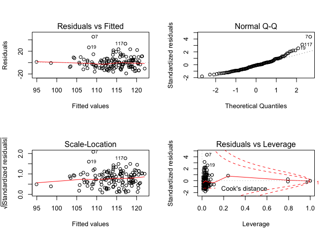<!-- -->

Age as a confounder:

    ## 
    ## Call:
    ## lm(formula = fbg ~ fuel_used_for_cooking_percent_wood_dung + 
    ##     percent_public_source + percent_private_toilet + percent_employed + 
    ##     percent_without_hs_education + percent_caste + median_age, 
    ##     data = total)
    ## 
    ## Residuals:
    ##     Min      1Q  Median      3Q     Max 
    ## -19.564  -6.450  -1.840   4.054  39.237 
    ## 
    ## Coefficients:
    ##                                          Estimate Std. Error t value
    ## (Intercept)                             64.394217  14.272593   4.512
    ## fuel_used_for_cooking_percent_wood_dung  1.570375  19.857818   0.079
    ## percent_public_source                   -0.105662   0.087667  -1.205
    ## percent_private_toilet                  -0.005991   0.023291  -0.257
    ## percent_employed                        13.331542  13.155706   1.013
    ## percent_without_hs_education            -4.754544   6.640426  -0.716
    ## percent_caste                           -0.045451   0.101298  -0.449
    ## median_age                               0.998880   0.222016   4.499
    ##                                         Pr(>|t|)    
    ## (Intercept)                             1.45e-05 ***
    ## fuel_used_for_cooking_percent_wood_dung    0.937    
    ## percent_public_source                      0.230    
    ## percent_private_toilet                     0.797    
    ## percent_employed                           0.313    
    ## percent_without_hs_education               0.475    
    ## percent_caste                              0.654    
    ## median_age                              1.53e-05 ***
    ## ---
    ## Signif. codes:  0 '***' 0.001 '**' 0.01 '*' 0.05 '.' 0.1 ' ' 1
    ## 
    ## Residual standard error: 9.965 on 126 degrees of freedom
    ## Multiple R-squared:  0.2939, Adjusted R-squared:  0.2547 
    ## F-statistic: 7.493 on 7 and 126 DF,  p-value: 1.568e-07

    ##                                             Estimate  Std. Error
    ## (Intercept)                             64.394216821 14.27259340
    ## fuel_used_for_cooking_percent_wood_dung  1.570374806 19.85781765
    ## percent_public_source                   -0.105661602  0.08766658
    ## percent_private_toilet                  -0.005991133  0.02329099
    ## percent_employed                        13.331542399 13.15570592
    ## percent_without_hs_education            -4.754543960  6.64042590
    ## percent_caste                           -0.045450956  0.10129831
    ## median_age                               0.998879615  0.22201621
    ##                                             t value     Pr(>|t|)
    ## (Intercept)                              4.51173904 1.454875e-05
    ## fuel_used_for_cooking_percent_wood_dung  0.07908094 9.370937e-01
    ## percent_public_source                   -1.20526667 2.303591e-01
    ## percent_private_toilet                  -0.25722961 7.974211e-01
    ## percent_employed                         1.01336580 3.128275e-01
    ## percent_without_hs_education            -0.71599985 4.753163e-01
    ## percent_caste                           -0.44868425 6.544301e-01
    ## median_age                               4.49912921 1.531179e-05

    ##                             (Intercept) 
    ##                            64.394216821 
    ## fuel_used_for_cooking_percent_wood_dung 
    ##                             1.570374806 
    ##                   percent_public_source 
    ##                            -0.105661602 
    ##                  percent_private_toilet 
    ##                            -0.005991133 
    ##                        percent_employed 
    ##                            13.331542399 
    ##            percent_without_hs_education 
    ##                            -4.754543960 
    ##                           percent_caste 
    ##                            -0.045450956 
    ##                              median_age 
    ##                             0.998879615

    ##         1         2         3         4         5         6         7 
    ## 113.87700 114.81052 114.14995 119.58058 120.83166 108.14677 115.26261 
    ##         8         9        10        11        12        13        14 
    ## 105.88606 115.34107 106.80357 111.57622 107.85608 109.93019 106.39933 
    ##        15        16        17        18        19        20        21 
    ## 120.68158 109.88700 114.07737 108.73789 112.60835 110.50043 106.80856 
    ##        22        23        24        25        26        27        28 
    ## 112.95074 109.32761 114.31402 109.89182 110.86752 113.71121 114.92129 
    ##        29        30        31        32        33        34        35 
    ## 108.06548 112.33163 107.42668 113.19762 113.86629 114.29454 113.98939 
    ##        36        37        38        39        40        41        42 
    ## 115.72678 120.00160 119.73055 115.81883 109.64083 126.58587 120.37824 
    ##        43        44        45        46        47        48        49 
    ## 117.92542 117.93213 121.10101 117.56192 122.06989 119.94474 121.59461 
    ##        50        51        52        53        54        55        56 
    ## 121.15795 128.35646 122.59658 127.16082 119.05614 118.40964 106.02329 
    ##        57        58        59        60        61        62        63 
    ## 107.20896 109.54799  99.85869 107.64622 108.32347 112.56761 125.96453 
    ##        64        65        66        67        68        69        70 
    ## 114.83554 107.93204 110.11757 108.47370 108.64505 110.03122 109.53172 
    ##        71        72        73        74        75        76        77 
    ## 119.71683 120.46889 118.32143 105.04402 115.25285 117.34323 110.04601 
    ##        78        79        80        81        82        83        84 
    ## 111.25117 126.05495 124.71844 123.60701 117.15685 105.41964  95.76251 
    ##        85        86        87        88        89        90        91 
    ## 109.11096 110.90266 111.29701 113.13401 108.93029 111.02691 117.40929 
    ##        92        93        94        95        96        97        98 
    ## 114.26167 109.22027 112.08134 116.81062 111.57769 116.36547 118.75566 
    ##        99       100       101       102       103       104       105 
    ## 111.00033 123.16541 103.99449 119.99624 120.71490 118.15229 124.41385 
    ##       106       107       108       109       110       111       112 
    ## 117.71983 107.89428 118.77064 111.77709 123.56204 110.38666 113.50826 
    ##       113       114       115       116       117       118       119 
    ## 103.95827 107.76548 114.13725 118.88442 119.56606 126.86423 122.33485 
    ##       120       121       122       123       124       125       126 
    ## 125.47188 110.54625 111.34723 107.84065 106.20772 119.01505 115.48664 
    ##       127       128       129       130       131       132       133 
    ## 109.40759 114.81364 120.56042 113.98206 117.73075 113.07159 110.31829 
    ##       134 
    ##  97.71944

    ## # A tibble: 1 x 11
    ##   r.squared adj.r.squared sigma statistic p.value    df logLik   AIC   BIC
    ##       <dbl>         <dbl> <dbl>     <dbl>   <dbl> <int>  <dbl> <dbl> <dbl>
    ## 1     0.294         0.255  9.96      7.49 1.57e-7     8  -494. 1006. 1032.
    ## # … with 2 more variables: deviance <dbl>, df.residual <int>

| term                                          | estimate | p.value |
| :-------------------------------------------- | -------: | ------: |
| (Intercept)                                   |   64.394 |   0.000 |
| fuel\_used\_for\_cooking\_percent\_wood\_dung |    1.570 |   0.937 |
| percent\_public\_source                       |  \-0.106 |   0.230 |
| percent\_private\_toilet                      |  \-0.006 |   0.797 |
| percent\_employed                             |   13.332 |   0.313 |
| percent\_without\_hs\_education               |  \-4.755 |   0.475 |
| percent\_caste                                |  \-0.045 |   0.654 |
| median\_age                                   |    0.999 |   0.000 |

|   fbg | fuel\_used\_for\_cooking\_percent\_wood\_dung | percent\_public\_source | percent\_private\_toilet | percent\_employed | percent\_without\_hs\_education | percent\_caste | median\_age |   .fitted |  .se.fit |       .resid |      .hat |    .sigma |     .cooksd |  .std.resid |
| ----: | --------------------------------------------: | ----------------------: | -----------------------: | ----------------: | ------------------------------: | -------------: | ----------: | --------: | -------: | -----------: | --------: | --------: | ----------: | ----------: |
| 123.4 |                                     0.0000000 |               0.0270270 |              100.0000000 |         0.5405405 |                       0.0270270 |      0.5675676 |    43.08108 | 113.87700 | 2.284775 |    9.5229971 | 0.0525727 |  9.966115 |   0.0066865 |   0.9818324 |
| 109.8 |                                     0.0000000 |               0.0789474 |                0.7368421 |         0.5789474 |                       0.0263158 |      0.2368421 |    42.89474 | 114.81052 | 2.073086 |  \-5.0105159 | 0.0432821 |  9.993962 |   0.0014945 | \-0.5140758 |
| 111.4 |                                     0.0277778 |               0.0555556 |                0.4722222 |         0.4444444 |                       0.3055556 |      0.7500000 |    45.33333 | 114.14995 | 1.363447 |  \-2.7499461 | 0.0187219 | 10.001377 |   0.0001851 | \-0.2785895 |
| 113.1 |                                     0.0000000 |               0.1538462 |                0.7692308 |         0.6153846 |                       0.0000000 |      0.4615385 |    47.07692 | 119.58058 | 2.540097 |  \-6.4805802 | 0.0649792 |  9.986484 |   0.0039295 | \-0.6725737 |
| 112.8 |                                     0.0277778 |               0.1944444 |                0.8333333 |         0.3888889 |                       0.2500000 |      0.3888889 |    52.50000 | 120.83166 | 2.269591 |  \-8.0316576 | 0.0518762 |  9.977219 |   0.0046863 | \-0.8277693 |
|  98.6 |                                     0.0000000 |               0.3076923 |                0.7435897 |         0.5128205 |                       0.2820513 |      0.4871795 |    38.35897 | 108.14677 | 1.369427 |  \-9.5467686 | 0.0188865 |  9.967248 |   0.0022512 | \-0.9672382 |
| 154.5 |                                     0.0000000 |               0.1351351 |                0.5405405 |         0.6486486 |                       0.3513514 |      0.9189189 |    44.00000 | 115.26261 | 2.522148 |   39.2373914 | 0.0640641 |  9.323602 |   0.1417444 |   4.0701810 |
| 105.6 |                                     0.0526316 |               0.3947368 |                0.9473684 |         0.5789474 |                       0.2631579 |    100.0000000 |    39.57895 | 105.88606 | 9.962343 |  \-0.2860575 | 0.9995310 |  9.934461 | 468.0293068 | \-1.3255213 |
| 123.8 |                                     0.0000000 |               0.2777778 |                0.3611111 |         0.4166667 |                       0.4722222 |      0.0000000 |    47.72222 | 115.34107 | 2.460948 |    8.4589341 | 0.0609928 |  9.973946 |   0.0062310 |   0.8760277 |
| 102.1 |                                     0.0000000 |               0.1500000 |                0.8500000 |         0.4250000 |                       0.3500000 |      0.0750000 |    38.47500 | 106.80357 | 1.858531 |  \-4.7035746 | 0.0347867 |  9.995290 |   0.0010399 | \-0.4804554 |
| 105.4 |                                     0.0000000 |               0.1071429 |                0.9285714 |         0.6666667 |                       0.3392857 |      0.6785714 |    40.00000 | 111.57622 | 2.361126 |  \-6.1762217 | 0.0561451 |  9.988287 |   0.0030264 | \-0.6379798 |
| 106.8 |                                     0.0000000 |               0.0344828 |                0.9137931 |         0.4655172 |                       0.2068966 |      0.4137931 |    38.31034 | 107.85608 | 1.739150 |  \-1.0560780 | 0.0304612 | 10.003999 |   0.0000455 | \-0.1076341 |
| 107.1 |                                     0.0000000 |               0.3818182 |                0.8000000 |         0.4909091 |                       0.2727273 |      0.8727273 |    40.41818 | 109.93019 | 1.179514 |  \-2.8301936 | 0.0140113 | 10.001210 |   0.0001453 | \-0.2860335 |
|  98.0 |                                     0.0000000 |               0.1636364 |                0.8909091 |         0.4909091 |                       0.1818182 |      0.6545455 |    36.41818 | 106.39933 | 2.035965 |  \-8.3993317 | 0.0417459 |  9.974980 |   0.0040376 | \-0.8610751 |
| 122.9 |                                     0.0000000 |               0.0000000 |              100.0000000 |         0.4545455 |                       0.0606061 |      0.2121212 |    51.18182 | 120.68158 | 1.716763 |    2.2184249 | 0.0296821 | 10.002431 |   0.0001953 |   0.2260083 |
| 115.7 |                                     0.0263158 |               0.8684211 |                0.1315789 |         0.7368421 |                       0.4736842 |      0.8157895 |    38.05263 | 109.88700 | 3.156796 |    5.8129956 | 0.1003613 |  9.989430 |   0.0052749 |   0.6150389 |
| 110.2 |                                     0.0000000 |               0.2702703 |                0.7837838 |         0.4594595 |                       0.1891892 |      0.5945946 |    44.56757 | 114.07737 | 1.135861 |  \-3.8773687 | 0.0129934 |  9.998367 |   0.0002524 | \-0.3916641 |
| 105.9 |                                     0.1025641 |               0.0256410 |                0.9487179 |         0.5897436 |                       0.2820513 |      0.6923077 |    37.74359 | 108.73789 | 2.321616 |  \-2.8378905 | 0.0542818 | 10.001054 |   0.0006153 | \-0.2928542 |
| 134.7 |                                     0.0000000 |               0.2105263 |                0.9473684 |         0.4210526 |                       0.5263158 |      0.6315789 |    45.21053 | 112.60835 | 2.474126 |   22.0916468 | 0.0616477 |  9.794303 |   0.0430155 |   2.2886627 |
| 127.8 |                                     0.0000000 |               0.0263158 |                0.8947368 |         0.4473684 |                       0.2105263 |      0.2894737 |    41.21053 | 110.50043 | 1.414666 |   17.2995720 | 0.0201549 |  9.881586 |   0.0079090 |   1.7538535 |
|  95.3 |                                     0.0540541 |               0.7837838 |                0.5675676 |         0.5405405 |                       0.7297297 |      0.1621622 |    38.72973 | 106.80856 | 2.870364 | \-11.5085599 | 0.0829750 |  9.946545 |   0.0164517 | \-1.2060548 |
| 135.7 |                                     0.0000000 |               0.1500000 |                0.9000000 |         0.5500000 |                       0.1500000 |      0.4250000 |    42.02500 | 112.95074 | 1.427084 |   22.7492585 | 0.0205103 |  9.790928 |   0.0139281 |   2.3067683 |
| 100.7 |                                     0.0000000 |               0.6923077 |                0.6666667 |         0.4871795 |                       0.4102564 |      0.0256410 |    40.51282 | 109.32761 | 1.436154 |  \-8.6276094 | 0.0207718 |  9.974020 |   0.0020299 | \-0.8749539 |
| 117.7 |                                     0.0000000 |               0.8461538 |                0.6923077 |         0.4615385 |                       0.3076923 |      0.2307692 |    45.38462 | 114.31402 | 1.311675 |    3.3859754 | 0.0173271 |  9.999793 |   0.0002590 |   0.3427804 |
| 113.1 |                                     0.0000000 |               0.5365854 |                0.6585366 |         0.3902439 |                       0.3170732 |      0.3658537 |    41.92683 | 109.89182 | 1.831896 |    3.2081835 | 0.0337968 | 10.000199 |   0.0004691 |   0.3275379 |
| 111.4 |                                     0.0769231 |               0.3333333 |                0.7179487 |         0.5384615 |                       0.3589744 |      0.7435897 |    41.00000 | 110.86752 | 1.616083 |    0.5324762 | 0.0263027 | 10.004343 |   0.0000099 |   0.0541533 |
| 104.9 |                                     0.0000000 |               0.4102564 |                0.7179487 |         0.4102564 |                       0.1282051 |      0.2051282 |    44.56410 | 113.71121 | 1.585924 |  \-8.8112113 | 0.0253302 |  9.972560 |   0.0026060 | \-0.8956607 |
| 114.9 |                                     0.0000000 |               0.1538462 |                0.7948718 |         0.4615385 |                       0.1538462 |      0.0512821 |    45.17949 | 114.92129 | 1.186468 |  \-0.0212882 | 0.0141770 | 10.004459 |   0.0000000 | \-0.0021517 |
| 103.6 |                                     0.0000000 |               0.9250000 |                0.8250000 |         0.4500000 |                       0.6250000 |      0.1750000 |    40.80000 | 108.06548 | 2.627668 |  \-4.4654756 | 0.0695367 |  9.995887 |   0.0020162 | \-0.4645739 |
| 113.8 |                                     0.0000000 |               0.2307692 |                0.8974359 |         0.5128205 |                       0.2307692 |      0.1538462 |    42.28205 | 112.33163 | 1.082138 |    1.4683707 | 0.0117934 | 10.003587 |   0.0000328 |   0.1482342 |
| 112.6 |                                     0.0000000 |               0.1750000 |                0.7750000 |         0.5000000 |                       0.1750000 |      0.2500000 |    37.27500 | 107.42668 | 1.874791 |    5.1733162 | 0.0353980 |  9.993360 |   0.0012818 |   0.5286054 |
| 116.4 |                                     0.0000000 |               0.1025641 |                0.7948718 |         0.3589744 |                       0.1794872 |      0.2564103 |    44.94872 | 113.19762 | 1.969287 |    3.2023762 | 0.0390563 | 10.000191 |   0.0005460 |   0.3278386 |
| 111.0 |                                     0.0000000 |               0.0270270 |              100.0000000 |         0.5945946 |                       0.0270270 |      0.0270270 |    42.32432 | 113.86629 | 2.595945 |  \-2.8662860 | 0.0678679 | 10.000934 |   0.0008079 | \-0.2979322 |
| 103.5 |                                     0.0263158 |               0.4736842 |                0.9210526 |         0.4473684 |                       0.2631579 |      0.8157895 |    45.28947 | 114.29454 | 1.249515 | \-10.7945430 | 0.0157238 |  9.957014 |   0.0023808 | \-1.0918989 |
| 104.7 |                                     0.0256410 |               0.2307692 |                0.9743590 |         0.5384615 |                       0.1538462 |      0.4102564 |    43.20513 | 113.98939 | 1.356336 |  \-9.2893917 | 0.0185271 |  9.969244 |   0.0020893 | \-0.9409895 |
| 124.1 |                                     0.0000000 |               0.0188679 |              100.0000000 |         0.3773585 |                       0.0754717 |      0.1320755 |    47.32075 | 115.72678 | 2.158504 |    8.3732186 | 0.0469223 |  9.975004 |   0.0045592 |   0.8607260 |
| 112.8 |                                     0.0000000 |               0.0526316 |                0.9473684 |         0.3157895 |                       0.0789474 |      0.0000000 |    51.84211 | 120.00160 | 2.433252 |  \-7.2016041 | 0.0596276 |  9.982384 |   0.0044024 | \-0.7452740 |
| 116.9 |                                     0.0000000 |               0.0000000 |                0.9750000 |         0.5000000 |                       0.0250000 |      0.0000000 |    48.85000 | 119.73055 | 1.726155 |  \-2.8305523 | 0.0300077 | 10.001156 |   0.0003217 | \-0.2884189 |
| 112.7 |                                     0.0000000 |               0.0769231 |                0.8846154 |         0.4230769 |                       0.0961538 |      0.0192308 |    46.30769 | 115.81883 | 1.495574 |  \-3.1188252 | 0.0225263 | 10.000480 |   0.0002887 | \-0.3165739 |
| 103.6 |                                     0.0000000 |               0.8285714 |                0.0285714 |         0.6000000 |                       0.4571429 |      0.4000000 |    39.57143 | 109.64083 | 1.966468 |  \-6.0408301 | 0.0389446 |  9.989266 |   0.0019370 | \-0.6183852 |
| 111.5 |                                     0.0000000 |               0.0000000 |              100.0000000 |         0.3030303 |                       0.0000000 |      0.0303030 |    58.81818 | 126.58587 | 2.702199 | \-15.0858704 | 0.0735373 |  9.905757 |   0.0245457 | \-1.5728708 |
| 118.2 |                                     0.0000000 |               0.0000000 |              100.0000000 |         0.4000000 |                       0.0333333 |      0.0000000 |    51.46667 | 120.37824 | 1.827505 |  \-2.1782399 | 0.0336349 | 10.002496 |   0.0002151 | \-0.2223677 |
| 106.8 |                                     0.0000000 |               0.0000000 |              100.0000000 |         0.4444444 |                       0.0000000 |      0.0000000 |    48.25926 | 117.92542 | 1.825041 | \-11.1254238 | 0.0335443 |  9.953122 |   0.0055959 | \-1.1356964 |
| 110.9 |                                     0.0000000 |               0.0263158 |              100.0000000 |         0.5526316 |                       0.0526316 |      0.0789474 |    47.07895 | 117.93213 | 2.036840 |  \-7.0321277 | 0.0417818 |  9.983804 |   0.0028328 | \-0.7209269 |
| 111.8 |                                     0.0000000 |               0.0000000 |              100.0000000 |         0.3947368 |                       0.1052632 |      0.0526316 |    52.60526 | 121.10101 | 1.949922 |  \-9.3010090 | 0.0382920 |  9.968429 |   0.0045088 | \-0.9517987 |
| 108.0 |                                     0.0000000 |               0.0000000 |                0.9666667 |         0.5666667 |                       0.0333333 |      0.1000000 |    45.83333 | 117.56192 | 1.944179 |  \-9.5619186 | 0.0380667 |  9.966384 |   0.0047351 | \-0.9783837 |
| 141.8 |                                     0.0400000 |               0.0000000 |              100.0000000 |         0.5000000 |                       0.1000000 |      0.0000000 |    52.08000 | 122.06989 | 2.021387 |   19.7301143 | 0.0411502 |  9.840799 |   0.0219338 |   2.0220457 |
| 120.1 |                                     0.0000000 |               0.0000000 |              100.0000000 |         0.4761905 |                       0.0000000 |      0.0000000 |    49.85714 | 119.94474 | 1.747228 |    0.1552593 | 0.0307449 | 10.004449 |   0.0000010 |   0.0158261 |
| 106.9 |                                     0.0000000 |               0.0000000 |              100.0000000 |         0.4473684 |                       0.0000000 |      0.0263158 |    51.89474 | 121.59461 | 1.741816 | \-14.6946133 | 0.0305547 |  9.915004 |   0.0088375 | \-1.4977287 |
| 121.5 |                                     0.0000000 |               0.0000000 |                0.9855072 |         0.4347826 |                       0.0144928 |      0.0434783 |    51.10145 | 121.15795 | 1.834666 |    0.3420513 | 0.0338990 | 10.004411 |   0.0000053 |   0.0349234 |
| 129.5 |                                     0.0000000 |               0.0000000 |              100.0000000 |         0.4615385 |                       0.0512821 |      0.0000000 |    58.71795 | 128.35646 | 2.613343 |    1.1435377 | 0.0687806 | 10.003898 |   0.0001306 |   0.1189217 |
| 109.8 |                                     0.0000000 |               0.0000000 |              100.0000000 |         0.5483871 |                       0.0000000 |      0.0000000 |    51.54839 | 122.59658 | 2.180998 | \-12.7965824 | 0.0479053 |  9.935455 |   0.0108942 | \-1.3161051 |
| 117.6 |                                     0.0000000 |               0.0000000 |              100.0000000 |         0.4117647 |                       0.0000000 |      0.0000000 |    57.94118 | 127.16082 | 2.271624 |  \-9.5608222 | 0.0519692 |  9.965834 |   0.0066539 | \-0.9854184 |
| 115.6 |                                     0.0000000 |               0.1304348 |                0.8695652 |         0.4347826 |                       0.1304348 |      0.1086957 |    49.56522 | 119.05613 | 1.529167 |  \-3.4561350 | 0.0235496 |  9.999567 |   0.0003714 | \-0.3509961 |
| 117.2 |                                     0.0000000 |               0.0000000 |              100.0000000 |         0.5641026 |                       0.1025641 |      0.1282051 |    47.64103 | 118.40964 | 2.104851 |  \-1.2096375 | 0.0446186 | 10.003847 |   0.0000900 | \-0.1241948 |
| 104.3 |                                     0.0000000 |               0.1315789 |                0.9736842 |         0.4736842 |                       0.2105263 |      0.4210526 |    36.39474 | 106.02329 | 2.026747 |  \-1.7232885 | 0.0413688 | 10.003220 |   0.0001683 | \-0.1766318 |
| 105.3 |                                     0.0000000 |               0.0500000 |                0.9500000 |         0.5250000 |                       0.0750000 |      0.5750000 |    36.25000 | 107.20896 | 2.452550 |  \-1.9089629 | 0.0605772 | 10.002908 |   0.0003149 | \-0.1976531 |
| 117.6 |                                     0.0000000 |               0.0243902 |                0.8536585 |         0.5121951 |                       0.1951220 |      0.2682927 |    39.31707 | 109.54799 | 1.441261 |    8.0520108 | 0.0209198 |  9.977948 |   0.0017812 |   0.8166423 |
|  93.5 |                                     0.0000000 |               0.4594595 |                0.4324324 |         0.4054054 |                       0.4594595 |      0.4324324 |    32.35135 |  99.85869 | 2.980429 |  \-6.3586889 | 0.0894604 |  9.986689 |   0.0054923 | \-0.6687362 |
|  98.7 |                                     0.0000000 |               0.0512821 |                0.8717949 |         0.5128205 |                       0.2307692 |      0.5384615 |    37.58974 | 107.64622 | 1.593255 |  \-8.9462162 | 0.0255649 |  9.971566 |   0.0027127 | \-0.9094935 |
| 112.2 |                                     0.2549020 |               0.3421053 |                0.7894737 |         0.6052632 |                       0.7368421 |      0.1052632 |    39.05263 | 108.32347 | 4.969554 |    3.8765322 | 0.2487185 |  9.996458 |   0.0083363 |   0.4488267 |
| 102.6 |                                     0.0000000 |               0.1538462 |                0.8974359 |         0.5128205 |                       0.2051282 |      0.0769231 |    42.38462 | 112.56761 | 1.116752 |  \-9.9676140 | 0.0125599 |  9.964149 |   0.0016111 | \-1.0066361 |
| 122.7 |                                     0.0000000 |               0.0000000 |                0.8333333 |         0.4166667 |                       0.0000000 |      0.0000000 |    56.08333 | 125.96453 | 2.460869 |  \-3.2645320 | 0.0609888 |  9.999920 |   0.0009280 | \-0.3380821 |
| 138.9 |                                     0.0000000 |               0.0000000 |                0.9729730 |         0.4054054 |                       0.1621622 |      0.0000000 |    45.86486 | 114.83554 | 1.494177 |   24.0644616 | 0.0224842 |  9.764725 |   0.0171540 |   2.4425919 |
| 100.0 |                                     0.0000000 |               0.2666667 |                0.8000000 |         0.4666667 |                       0.2666667 |      0.1333333 |    38.66667 | 107.93204 | 1.537434 |  \-7.9320406 | 0.0238049 |  9.978657 |   0.0019785 | \-0.8056627 |
| 104.2 |                                     0.0256410 |               0.0512821 |                0.8974359 |         0.4871795 |                       0.4102564 |      0.7692308 |    41.23077 | 110.11757 | 1.368618 |  \-5.9175721 | 0.0188642 |  9.990179 |   0.0008639 | \-0.5995365 |
| 103.7 |                                     0.0500000 |               0.2500000 |                0.7000000 |         0.5000000 |                       0.4250000 |      0.4250000 |    39.45000 | 108.47370 | 1.503536 |  \-4.7737006 | 0.0227667 |  9.995131 |   0.0006839 | \-0.4846104 |
| 101.1 |                                     0.0000000 |               0.2500000 |                0.6500000 |         0.5000000 |                       0.3250000 |      0.4500000 |    39.22500 | 108.64505 | 1.277356 |  \-7.5450516 | 0.0164323 |  9.981291 |   0.0012173 | \-0.7634784 |
| 115.1 |                                     0.0000000 |               0.1351351 |                0.8918919 |         0.5675676 |                       0.2972973 |      0.4324324 |    39.56757 | 110.03122 | 1.389423 |    5.0687850 | 0.0194421 |  9.993977 |   0.0006540 |   0.5136933 |
|  97.8 |                                     0.0000000 |               0.2500000 |                0.8888889 |         0.6666667 |                       0.4166667 |      0.6111111 |    38.33333 | 109.53172 | 2.409622 | \-11.7317206 | 0.0584751 |  9.945841 |   0.0114292 | \-1.2133399 |
| 110.0 |                                     0.0000000 |               0.0000000 |              100.0000000 |         0.5454545 |                       0.0000000 |      0.0000000 |    48.70455 | 119.71683 | 2.050947 |  \-9.7168315 | 0.0423626 |  9.964961 |   0.0054905 | \-0.9964621 |
| 119.4 |                                     0.0000000 |               0.0000000 |                0.9607843 |         0.5294118 |                       0.0000000 |      0.0196078 |    49.07843 | 120.46889 | 1.972850 |  \-1.0688895 | 0.0391978 | 10.003984 |   0.0000611 | \-0.1094340 |
| 122.6 |                                     0.0000000 |               0.0000000 |                0.9285714 |         0.3928571 |                       0.0000000 |      0.0000000 |    48.75000 | 118.32143 | 1.949511 |    4.2785735 | 0.0382758 |  9.996846 |   0.0009537 |   0.4378349 |
|  96.9 |                                     0.0975610 |               0.3414634 |                0.2439024 |         0.5609756 |                       0.7317073 |      0.2195122 |    36.58537 | 105.04402 | 2.947298 |  \-8.1440180 | 0.0874825 |  9.975356 |   0.0087720 | \-0.8555685 |
| 128.1 |                                     0.0000000 |               0.0000000 |                0.9333333 |         0.5833333 |                       0.0166667 |      0.0333333 |    43.21667 | 115.25285 | 2.135733 |   12.8471519 | 0.0459375 |  9.935051 |   0.0104860 |   1.3199428 |
| 120.5 |                                     0.0000000 |               0.0750000 |                0.9000000 |         0.4250000 |                       0.2250000 |      0.1000000 |    48.42500 | 117.34323 | 1.512378 |    3.1567664 | 0.0230353 | 10.000380 |   0.0003028 |   0.3205086 |
| 109.5 |                                     0.0000000 |               0.5263158 |                0.5789474 |         0.5526316 |                       0.4736842 |      0.3684211 |    40.65789 | 110.04601 | 1.807437 |  \-0.5460130 | 0.0329003 | 10.004336 |   0.0000132 | \-0.0557191 |
| 111.5 |                                     0.0000000 |               0.6000000 |                0.3500000 |         0.5500000 |                       0.4750000 |      0.1000000 |    41.90000 | 111.25117 | 1.899917 |    0.2488263 | 0.0363532 | 10.004433 |   0.0000031 |   0.0254375 |
| 130.4 |                                     0.0000000 |               0.0263158 |                0.9736842 |         0.5000000 |                       0.0526316 |      0.0000000 |    55.31579 | 126.05495 | 2.580041 |    4.3450507 | 0.0670388 |  9.996365 |   0.0018305 |   0.4514397 |
| 128.1 |                                     0.0256410 |               0.0000000 |              100.0000000 |         0.5641026 |                       0.0512821 |      0.0000000 |    53.66667 | 124.71844 | 2.527461 |    3.3815566 | 0.0643342 |  9.999572 |   0.0010578 |   0.3508270 |
| 132.6 |                                     0.0000000 |               0.0303030 |              100.0000000 |         0.3636364 |                       0.0000000 |      0.0303030 |    55.03030 | 123.60701 | 2.095690 |    8.9929941 | 0.0442311 |  9.970570 |   0.0049296 |   0.9231335 |
| 132.2 |                                     0.0000000 |               0.0000000 |              100.0000000 |         0.3750000 |                       0.0000000 |      0.0000000 |    48.41667 | 117.15685 | 2.170472 |   15.0431467 | 0.0474441 |  9.909019 |   0.0148957 |   1.5467855 |
|  94.8 |                                     0.0000000 |               0.9750000 |                0.0000000 |         0.5500000 |                       0.5250000 |      0.3750000 |    36.35000 | 105.41964 | 1.954833 | \-10.6196394 | 0.0384851 |  9.957453 |   0.0059099 | \-1.0868470 |
|  96.1 |                                     0.0000000 |             100.0000000 |                0.0000000 |         0.5405405 |                       0.6216216 |      0.6756757 |    37.75676 |  95.76251 | 8.876467 |    0.3374870 | 0.7935121 | 10.004238 |   0.0026685 |   0.0745326 |
| 106.7 |                                     0.0000000 |               0.2931034 |                0.6896552 |         0.5344828 |                       0.1896552 |      0.3275862 |    38.58621 | 109.11096 | 1.565124 |  \-2.4109573 | 0.0246701 | 10.002076 |   0.0001898 | \-0.2449912 |
| 116.1 |                                     0.0000000 |               0.0000000 |                0.9148936 |         0.5744681 |                       0.1914894 |      0.4255319 |    39.82979 | 110.90266 | 1.572416 |    5.1973417 | 0.0249005 |  9.993377 |   0.0008905 |   0.5281940 |
| 109.6 |                                     0.0000000 |               0.1666667 |                0.8333333 |         0.6666667 |                       0.3611111 |      0.7500000 |    39.83333 | 111.29701 | 2.380251 |  \-1.6970067 | 0.0570583 | 10.003238 |   0.0002326 | \-0.1753791 |
| 110.9 |                                     0.0000000 |               0.0000000 |                0.7068966 |         0.5517241 |                       0.2586207 |      0.5172414 |    42.68966 | 113.13401 | 1.273995 |  \-2.2340092 | 0.0163459 | 10.002430 |   0.0001061 | \-0.2260479 |
| 111.5 |                                     0.0000000 |               0.0869565 |                0.7391304 |         0.5652174 |                       0.2826087 |      0.2608696 |    38.41304 | 108.93029 | 1.456719 |    2.5697059 | 0.0213710 | 10.001761 |   0.0001855 |   0.2606820 |
| 101.2 |                                     0.0000000 |               0.0000000 |                0.9743590 |         0.5384615 |                       0.3333333 |      0.2564103 |    41.10256 | 111.02691 | 1.247342 |  \-9.8269135 | 0.0156691 |  9.965157 |   0.0019660 | \-0.9939928 |
| 115.1 |                                     0.0175439 |               0.0000000 |                0.9824561 |         0.3859649 |                       0.0350877 |      0.0350877 |    48.07018 | 117.40929 | 1.967872 |  \-2.3092863 | 0.0390002 | 10.002240 |   0.0002835 | \-0.2364029 |
| 105.6 |                                     0.0000000 |               0.0000000 |              100.0000000 |         0.4531250 |                       0.0312500 |      0.0156250 |    44.62500 | 114.26167 | 2.104299 |  \-8.6616718 | 0.0445952 |  9.973013 |   0.0046142 | \-0.8892926 |
| 111.7 |                                     0.0169492 |               0.1355932 |                0.7796610 |         0.4915254 |                       0.2711864 |      0.2372881 |    39.61017 | 109.22027 | 1.268742 |    2.4797346 | 0.0162114 | 10.001960 |   0.0001297 |   0.2508944 |
| 106.4 |                                     0.0000000 |               0.2131148 |                0.9672131 |         0.5081967 |                       0.4426230 |      0.1147541 |    43.09836 | 112.08134 | 1.702174 |  \-5.6813382 | 0.0291797 |  9.991157 |   0.0012580 | \-0.5786526 |
| 119.6 |                                     0.0000000 |               0.0800000 |                0.9800000 |         0.4800000 |                       0.1800000 |      0.0000000 |    46.94000 | 116.81062 | 1.229463 |    2.7893758 | 0.0152231 | 10.001300 |   0.0001538 |   0.2820816 |
| 103.4 |                                     0.0000000 |               0.0526316 |                0.8684211 |         0.5526316 |                       0.0526316 |      0.2105263 |    40.13158 | 111.57769 | 2.020522 |  \-8.1776925 | 0.0411150 |  9.976536 |   0.0037645 | \-0.8380775 |
| 104.5 |                                     0.0000000 |               0.0000000 |              100.0000000 |         0.4000000 |                       0.0750000 |      0.0500000 |    47.65000 | 116.36547 | 1.969292 | \-11.8654708 | 0.0390565 |  9.945708 |   0.0074964 | \-1.2147103 |
| 114.4 |                                     0.0000000 |               0.0285714 |                0.9142857 |         0.4571429 |                       0.0857143 |      0.1142857 |    48.74286 | 118.75566 | 1.475145 |  \-4.3556594 | 0.0219151 |  9.996701 |   0.0005471 | \-0.4419797 |
| 112.2 |                                     0.0540541 |               0.1081081 |                0.1351351 |         0.5675676 |                       0.5405405 |      0.2432432 |    41.59459 | 111.00033 | 2.159778 |    1.1996662 | 0.0469777 | 10.003855 |   0.0000937 |   0.1233234 |
| 119.5 |                                     0.0000000 |               0.0175439 |              100.0000000 |         0.4561404 |                       0.0000000 |      0.0000000 |    53.35088 | 123.16541 | 1.827375 |  \-3.6654079 | 0.0336301 |  9.998899 |   0.0006091 | \-0.3741858 |
| 113.3 |                                     0.0416667 |               0.2708333 |                0.3125000 |         0.5625000 |                       0.6666667 |      0.3541667 |    35.29167 | 103.99449 | 2.467868 |    9.3055140 | 0.0613362 |  9.967507 |   0.0075886 |   0.9638778 |
| 130.2 |                                     0.0000000 |               0.0000000 |              100.0000000 |         0.3859649 |                       0.0350877 |      0.0175439 |    51.28070 | 119.99624 | 1.900397 |   10.2037648 | 0.0363716 |  9.961166 |   0.0051339 |   1.0431393 |
| 110.1 |                                     0.0000000 |               0.0000000 |              100.0000000 |         0.4871795 |                       0.1025641 |      0.1025641 |    50.97436 | 120.71490 | 1.819672 | \-10.6148984 | 0.0333472 |  9.957745 |   0.0050621 | \-1.0834709 |
| 125.7 |                                     0.0000000 |               0.0000000 |              100.0000000 |         0.4102564 |                       0.2564103 |      0.3589744 |    50.17949 | 118.15229 | 2.224015 |    7.5477085 | 0.0498137 |  9.980459 |   0.0039568 |   0.7770472 |
| 122.4 |                                     0.0000000 |               0.0000000 |              100.0000000 |         0.5333333 |                       0.0333333 |      0.1333333 |    53.73333 | 124.41385 | 2.275942 |  \-2.0138459 | 0.0521670 | 10.002748 |   0.0002965 | \-0.2075855 |
| 123.6 |                                     0.0000000 |               0.0000000 |              100.0000000 |         0.4324324 |                       0.0000000 |      0.0540541 |    48.21622 | 117.71983 | 1.863821 |    5.8801665 | 0.0349850 |  9.990123 |   0.0016352 |   0.6007022 |
| 119.9 |                                     0.0000000 |               0.0697674 |                0.9302326 |         0.4186047 |                       0.1860465 |      0.0000000 |    38.86047 | 107.89428 | 2.064908 |   12.0057223 | 0.0429413 |  9.944062 |   0.0085066 |   1.2315602 |
| 117.0 |                                     0.0000000 |               0.0750000 |              100.0000000 |         0.4250000 |                       0.1000000 |      0.0250000 |    49.85000 | 118.77064 | 1.758524 |  \-1.7706426 | 0.0311437 | 10.003165 |   0.0001309 | \-0.1805252 |
| 117.0 |                                     0.0161290 |               0.1774194 |                0.7903226 |         0.4354839 |                       0.1935484 |      0.1129032 |    42.54839 | 111.77709 | 1.429272 |    5.2229135 | 0.0205732 |  9.993317 |   0.0007365 |   0.5296189 |
| 118.2 |                                     0.0000000 |               0.0000000 |                0.9000000 |         0.4750000 |                       0.0000000 |      0.0000000 |    52.90000 | 123.56204 | 2.115698 |  \-5.3620391 | 0.0450797 |  9.992414 |   0.0017893 | \-0.5506594 |
|  99.8 |                                     0.0000000 |               0.1621622 |                0.6756757 |         0.3783784 |                       0.3243243 |      0.1891892 |    42.56757 | 110.38666 | 1.926590 | \-10.5866643 | 0.0373811 |  9.957799 |   0.0056917 | \-1.0828507 |
| 132.6 |                                     0.0000000 |               0.0555556 |              100.0000000 |         0.5277778 |                       0.2777778 |      0.6666667 |    44.08333 | 113.50826 | 2.154561 |   19.0917390 | 0.0467510 |  9.850393 |   0.0236076 |   1.9623613 |
| 113.5 |                                     0.0000000 |               0.1282051 |              100.0000000 |         0.4615385 |                       0.4615385 |      0.5128205 |    36.28205 | 103.95827 | 3.260263 |    9.5417349 | 0.1070480 |  9.963610 |   0.0153872 |   1.0133278 |
| 103.4 |                                     0.0000000 |               0.6052632 |                0.7105263 |         0.4736842 |                       0.5526316 |      0.4210526 |    39.81579 | 107.76548 | 2.126874 |  \-4.3654801 | 0.0455572 |  9.996473 |   0.0011998 | \-0.4484290 |
| 132.3 |                                     0.0000000 |               0.0476190 |                0.9523810 |         0.4285714 |                       0.1269841 |      0.0952381 |    44.69841 | 114.13725 | 1.437542 |   18.1627493 | 0.0208120 |  9.868841 |   0.0090142 |   1.8419813 |
| 129.8 |                                     0.0000000 |               0.0000000 |                0.9444444 |         0.3888889 |                       0.1388889 |      0.0000000 |    50.02778 | 118.88442 | 1.759592 |   10.9155787 | 0.0311815 |  9.955166 |   0.0049830 |   1.1129156 |
| 150.3 |                                     0.0000000 |               0.0000000 |                0.9473684 |         0.4473684 |                       0.0526316 |      0.1578947 |    49.52632 | 119.56606 | 1.610249 |   30.7339363 | 0.0261132 |  9.608849 |   0.0327388 |   3.1253639 |
| 107.3 |                                     0.0000000 |               0.0263158 |                0.9736842 |         0.3684211 |                       0.0000000 |      0.0000000 |    57.63158 | 126.86423 | 2.728510 | \-19.5642331 | 0.0749764 |  9.837628 |   0.0422209 | \-2.0413763 |
| 124.1 |                                     0.0000000 |               0.0000000 |              100.0000000 |         0.4358974 |                       0.0769231 |      0.0000000 |    53.15385 | 122.33485 | 1.855488 |    1.7651521 | 0.0346729 | 10.003168 |   0.0001459 |   0.1802941 |
| 127.7 |                                     0.0000000 |               0.0000000 |                0.9000000 |         0.4000000 |                       0.0666667 |      0.0666667 |    56.13333 | 125.47188 | 2.472877 |    2.2281155 | 0.0615855 | 10.002344 |   0.0004371 |   0.2308219 |
| 133.8 |                                     0.0000000 |               0.0810811 |                0.8918919 |         0.5135135 |                       0.1351351 |      0.4324324 |    40.02703 | 110.54625 | 1.574930 |   23.2537456 | 0.0249802 |  9.780208 |   0.0178870 |   2.3633218 |
| 111.5 |                                     0.0500000 |               0.0250000 |              100.0000000 |         0.4750000 |                       0.1000000 |      0.2000000 |    41.67500 | 111.34723 | 2.508056 |    0.1527733 | 0.0633502 | 10.004449 |   0.0000021 |   0.0158415 |
| 106.3 |                                     0.1724138 |               0.8275862 |                0.0000000 |         0.5862069 |                       0.2758621 |      0.5862069 |    36.82759 | 107.84065 | 3.497708 |  \-1.5406523 | 0.1232084 | 10.003377 |   0.0004789 | \-0.1651175 |
| 105.4 |                                     0.0000000 |               0.2162162 |                0.7297297 |         0.5405405 |                       0.2972973 |      0.4324324 |    36.10811 | 106.20772 | 1.657176 |  \-0.8077239 | 0.0276573 | 10.004191 |   0.0000240 | \-0.0822034 |
| 142.2 |                                     0.0270270 |               0.0000000 |              100.0000000 |         0.4594595 |                       0.0270270 |      0.1621622 |    49.24324 | 119.01505 | 1.793002 |   23.1849504 | 0.0323769 |  9.779825 |   0.0234001 |   2.3653189 |
| 119.6 |                                     0.0000000 |               0.3333333 |                0.6944444 |         0.3888889 |                       0.3055556 |      0.4166667 |    47.47222 | 115.48664 | 1.834059 |    4.1133557 | 0.0338766 |  9.997454 |   0.0007731 |   0.4199684 |
| 106.5 |                                     0.0256410 |               0.1538462 |                0.4102564 |         0.4615385 |                       0.4615385 |      0.5128205 |    41.10256 | 109.40759 | 1.673393 |  \-2.9075892 | 0.0282013 | 10.000980 |   0.0003178 | \-0.2959931 |
| 119.6 |                                     0.0000000 |               0.0000000 |                0.9487179 |         0.5128205 |                       0.2564103 |      0.3076923 |    44.87179 | 114.81364 | 1.186131 |    4.7863562 | 0.0141690 |  9.995164 |   0.0004205 |   0.4837717 |
| 117.5 |                                     0.0000000 |               0.0000000 |                0.9117647 |         0.4705882 |                       0.0588235 |      0.0294118 |    50.23529 | 120.56042 | 1.679763 |  \-3.0604167 | 0.0284164 | 10.000604 |   0.0003549 | \-0.3115854 |
| 111.1 |                                     0.0000000 |               0.0263158 |                0.9210526 |         0.6052632 |                       0.0526316 |      0.3947368 |    41.84211 | 113.98206 | 2.184250 |  \-2.8820552 | 0.0480483 | 10.000970 |   0.0005544 | \-0.2964364 |
| 115.8 |                                     0.0000000 |               0.0000000 |                0.9714286 |         0.5428571 |                       0.0857143 |      0.1428571 |    46.57143 | 117.73075 | 1.636870 |  \-1.9307452 | 0.0269837 | 10.002927 |   0.0001338 | \-0.1964272 |
| 106.8 |                                     0.0000000 |               0.0000000 |                0.9090909 |         0.4848485 |                       0.1515152 |      0.2727273 |    43.00000 | 113.07159 | 1.219375 |  \-6.2715908 | 0.0149744 |  9.988481 |   0.0007642 | \-0.6341480 |
|  98.4 |                                     0.0000000 |               0.0000000 |              100.0000000 |         0.4705882 |                       0.1470588 |      0.1176471 |    41.00000 | 110.31829 | 2.351310 | \-11.9182899 | 0.0556792 |  9.944136 |   0.0111652 | \-1.2308095 |
|  97.8 |                                     0.5526316 |             100.0000000 |                0.0000000 |         0.5789474 |                       0.6842105 |      0.6578947 |    38.63158 |  97.71944 | 8.879050 |    0.0805575 | 0.7939741 | 10.004446 |   0.0001528 |   0.0178107 |

    ## Warning in sqrt(crit * p * (1 - hh)/hh): NaNs produced
    
    ## Warning in sqrt(crit * p * (1 - hh)/hh): NaNs produced

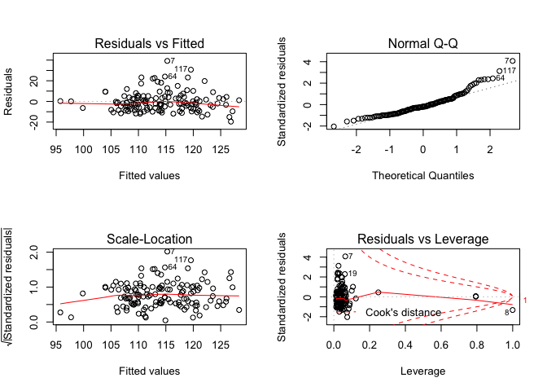<!-- -->

Gender as a confounder:

    ## 
    ## Call:
    ## lm(formula = fbg ~ fuel_used_for_cooking_percent_wood_dung + 
    ##     percent_public_source + percent_private_toilet + percent_employed + 
    ##     percent_without_hs_education + percent_caste + percent_female, 
    ##     data = total)
    ## 
    ## Residuals:
    ##     Min      1Q  Median      3Q     Max 
    ## -18.986  -7.429  -0.899   4.378  45.356 
    ## 
    ## Coefficients:
    ##                                           Estimate Std. Error t value
    ## (Intercept)                             122.798935   6.526982  18.814
    ## fuel_used_for_cooking_percent_wood_dung   9.488922  21.310597   0.445
    ## percent_public_source                    -0.099947   0.094439  -1.058
    ## percent_private_toilet                    0.023238   0.024222   0.959
    ## percent_employed                        -10.248186  13.006282  -0.788
    ## percent_without_hs_education            -19.777409   6.239550  -3.170
    ## percent_caste                            -0.065376   0.109041  -0.600
    ## percent_female                            0.002914   1.814096   0.002
    ##                                         Pr(>|t|)    
    ## (Intercept)                              < 2e-16 ***
    ## fuel_used_for_cooking_percent_wood_dung  0.65689    
    ## percent_public_source                    0.29194    
    ## percent_private_toilet                   0.33919    
    ## percent_employed                         0.43221    
    ## percent_without_hs_education             0.00192 ** 
    ## percent_caste                            0.54988    
    ## percent_female                           0.99872    
    ## ---
    ## Signif. codes:  0 '***' 0.001 '**' 0.01 '*' 0.05 '.' 0.1 ' ' 1
    ## 
    ## Residual standard error: 10.74 on 126 degrees of freedom
    ## Multiple R-squared:  0.1805, Adjusted R-squared:  0.135 
    ## F-statistic: 3.965 on 7 and 126 DF,  p-value: 0.0006013

    ##                                              Estimate  Std. Error
    ## (Intercept)                             122.798934539  6.52698234
    ## fuel_used_for_cooking_percent_wood_dung   9.488922439 21.31059712
    ## percent_public_source                    -0.099946682  0.09443947
    ## percent_private_toilet                    0.023238117  0.02422151
    ## percent_employed                        -10.248185935 13.00628159
    ## percent_without_hs_education            -19.777409261  6.23954968
    ## percent_caste                            -0.065376089  0.10904086
    ## percent_female                            0.002913621  1.81409630
    ##                                              t value     Pr(>|t|)
    ## (Intercept)                             18.814044247 2.102680e-38
    ## fuel_used_for_cooking_percent_wood_dung  0.445267788 6.568903e-01
    ## percent_public_source                   -1.058314694 2.919367e-01
    ## percent_private_toilet                   0.959399995 3.391947e-01
    ## percent_employed                        -0.787941262 4.322109e-01
    ## percent_without_hs_education            -3.169685360 1.915907e-03
    ## percent_caste                           -0.599555870 5.498789e-01
    ## percent_female                           0.001606101 9.987211e-01

    ##                             (Intercept) 
    ##                           122.798934539 
    ## fuel_used_for_cooking_percent_wood_dung 
    ##                             9.488922439 
    ##                   percent_public_source 
    ##                            -0.099946682 
    ##                  percent_private_toilet 
    ##                             0.023238117 
    ##                        percent_employed 
    ##                           -10.248185935 
    ##            percent_without_hs_education 
    ##                           -19.777409261 
    ##                           percent_caste 
    ##                            -0.065376089 
    ##                          percent_female 
    ##                             0.002913621

    ##         1         2         3         4         5         6         7 
    ## 119.01090 116.34101 112.42314 116.46672 114.10928 111.92180 109.14367 
    ##         8         9        10        11        12        13        14 
    ## 105.60751 109.17195 111.52316 109.22507 113.92903 112.29946 114.13564 
    ##        15        16        17        18        19        20        21 
    ## 119.25380 105.99404 114.30294 112.12624 108.03637 114.05180 103.26615 
    ##        22        23        24        25        26        27        28 
    ## 114.17590 109.63902 111.90205 112.46849 110.84775 116.02316 115.02804 
    ##        29        30        31        32        33        34        35 
    ## 105.74359 112.96908 114.19991 115.56367 118.49228 113.18208 114.45597 
    ##        36        37        38        39        40        41        42 
    ## 119.75432 118.01999 117.22249 116.57504 107.50245 122.01724 120.36625 
    ##        43        44        45        46        47        48        49 
    ## 120.56999 118.41244 118.99415 116.35025 118.40241 120.24466 120.53818 
    ##        50        51        52        53        54        55        56 
    ## 118.07859 119.38056 119.50467 120.90477 115.76555 117.30679 113.76476 
    ##        57        58        59        60        61        62        63 
    ## 115.91689 113.69275 109.49518 112.96134 104.42115 113.48891 118.55016 
    ##        64        65        66        67        68        69        70 
    ## 115.46163 112.72772 109.90307 109.70933 111.20982 111.08348 107.68388 
    ##        71        72        73        74        75        76        77 
    ## 119.53471 117.39639 118.79638 103.46359 116.51270 114.00236 107.70585 
    ##        78        79        80        81        82        83        84 
    ## 107.71173 116.65586 118.57277 121.39310 121.28162 106.65914  94.92830 
    ##        85        86        87        88        89        90        91 
    ## 113.53778 113.11987 108.78059 112.01442 111.41059 110.69600 118.33848 
    ##        92        93        94        95        96        97        98 
    ## 119.86191 112.55013 108.83254 114.33654 116.09758 119.53884 116.43174 
    ##        99       100       101       102       103       104       105 
    ## 106.78323 120.44835 104.20374 120.47418 118.09686 115.82567 118.99103 
    ##       106       107       108       109       110       111       112 
    ## 120.68954 114.84609 118.78240 114.65641 117.95397 112.49605 114.17291 
    ##       113       114       115       116       117       118       119 
    ## 111.22041 106.94527 115.90855 116.09063 117.18694 119.04523 119.13622 
    ##       120       121       122       123       124       125       126 
    ## 117.39975 114.85006 118.73793 112.85242 111.34859 120.12743 112.72788 
    ##       127       128       129       130       131       132       133 
    ## 109.14681 112.47616 116.83401 115.55001 115.55557 114.83874 117.38595 
    ##       134 
    ##  98.54194

    ## # A tibble: 1 x 11
    ##   r.squared adj.r.squared sigma statistic p.value    df logLik   AIC   BIC
    ##       <dbl>         <dbl> <dbl>     <dbl>   <dbl> <int>  <dbl> <dbl> <dbl>
    ## 1     0.181         0.135  10.7      3.96 6.01e-4     8  -504. 1026. 1052.
    ## # … with 2 more variables: deviance <dbl>, df.residual <int>

| term                                          | estimate | p.value |
| :-------------------------------------------- | -------: | ------: |
| (Intercept)                                   |  122.799 |   0.000 |
| fuel\_used\_for\_cooking\_percent\_wood\_dung |    9.489 |   0.657 |
| percent\_public\_source                       |  \-0.100 |   0.292 |
| percent\_private\_toilet                      |    0.023 |   0.339 |
| percent\_employed                             | \-10.248 |   0.432 |
| percent\_without\_hs\_education               | \-19.777 |   0.002 |
| percent\_caste                                |  \-0.065 |   0.550 |
| percent\_female                               |    0.003 |   0.999 |

|   fbg | fuel\_used\_for\_cooking\_percent\_wood\_dung | percent\_public\_source | percent\_private\_toilet | percent\_employed | percent\_without\_hs\_education | percent\_caste | percent\_female |   .fitted |   .se.fit |       .resid |      .hat |    .sigma |    .cooksd |  .std.resid |
| ----: | --------------------------------------------: | ----------------------: | -----------------------: | ----------------: | ------------------------------: | -------------: | --------------: | --------: | --------: | -----------: | --------: | --------: | ---------: | ----------: |
| 123.4 |                                     0.0000000 |               0.0270270 |              100.0000000 |         0.5405405 |                       0.0270270 |      0.5675676 |       0.7017544 | 119.01090 |  2.132516 |    4.3891003 | 0.0394599 | 10.770715 |  0.0008936 |   0.4171607 |
| 109.8 |                                     0.0000000 |               0.0789474 |                0.7368421 |         0.5789474 |                       0.0263158 |      0.2368421 |       0.6666667 | 116.34101 |  2.228010 |  \-6.5410070 | 0.0430730 | 10.761554 |  0.0021828 | \-0.6228606 |
| 111.4 |                                     0.0277778 |               0.0555556 |                0.4722222 |         0.4444444 |                       0.3055556 |      0.7500000 |       0.7142857 | 112.42314 |  1.409934 |  \-1.0231392 | 0.0172492 | 10.777765 |  0.0000203 | \-0.0961388 |
| 113.1 |                                     0.0000000 |               0.1538462 |                0.7692308 |         0.6153846 |                       0.0000000 |      0.4615385 |       0.7000000 | 116.46672 |  2.650985 |  \-3.3667236 | 0.0609798 | 10.773680 |  0.0008502 | \-0.3236351 |
| 112.8 |                                     0.0277778 |               0.1944444 |                0.8333333 |         0.3888889 |                       0.2500000 |      0.3888889 |       0.6909091 | 114.10928 |  1.840758 |  \-1.3092778 | 0.0294012 | 10.777505 |  0.0000580 | \-0.1237934 |
|  98.6 |                                     0.0000000 |               0.3076923 |                0.7435897 |         0.5128205 |                       0.2820513 |      0.4871795 |       0.6551724 | 111.92180 |  1.171361 | \-13.3217968 | 0.0119056 | 10.711296 |  0.0023473 | \-1.2483870 |
| 154.5 |                                     0.0000000 |               0.1351351 |                0.5405405 |         0.6486486 |                       0.3513514 |      0.9189189 |       0.7017544 | 109.14367 |  2.288450 |   45.3563327 | 0.0454417 |  9.946241 |  0.1112772 |   4.3243648 |
| 105.6 |                                     0.0526316 |               0.3947368 |                0.9473684 |         0.5789474 |                       0.2631579 |    100.0000000 |       0.6666667 | 105.60751 | 10.732600 |  \-0.0075058 | 0.9994962 | 10.778119 |  0.2406514 | \-0.0311505 |
| 123.8 |                                     0.0000000 |               0.2777778 |                0.3611111 |         0.4166667 |                       0.4722222 |      0.0000000 |       0.6153846 | 109.17195 |  2.201624 |   14.6280535 | 0.0420588 | 10.694940 |  0.0106374 |   1.3922036 |
| 102.1 |                                     0.0000000 |               0.1500000 |                0.8500000 |         0.4250000 |                       0.3500000 |      0.0750000 |       0.6666667 | 111.52316 |  1.652837 |  \-9.4231619 | 0.0237045 | 10.744353 |  0.0023952 | \-0.8883654 |
| 105.4 |                                     0.0000000 |               0.1071429 |                0.9285714 |         0.6666667 |                       0.3392857 |      0.6785714 |       0.6666667 | 109.22507 |  2.482893 |  \-3.8250679 | 0.0534918 | 10.772422 |  0.0009475 | \-0.3662373 |
| 106.8 |                                     0.0000000 |               0.0344828 |                0.9137931 |         0.4655172 |                       0.2068966 |      0.4137931 |       0.6666667 | 113.92903 |  1.189064 |  \-7.1290281 | 0.0122682 | 10.759047 |  0.0006932 | \-0.6681846 |
| 107.1 |                                     0.0000000 |               0.3818182 |                0.8000000 |         0.4909091 |                       0.2727273 |      0.8727273 |       0.6585366 | 112.29946 |  1.141840 |  \-5.1994603 | 0.0113131 | 10.768008 |  0.0003394 | \-0.4870959 |
|  98.0 |                                     0.0000000 |               0.1636364 |                0.8909091 |         0.4909091 |                       0.1818182 |      0.6545455 |       0.6746988 | 114.13564 |  1.184052 | \-16.1356366 | 0.0121650 | 10.679898 |  0.0035204 | \-1.5122707 |
| 122.9 |                                     0.0000000 |               0.0000000 |              100.0000000 |         0.4545455 |                       0.0606061 |      0.2121212 |       0.6250000 | 119.25380 |  1.819636 |    3.6461976 | 0.0287303 | 10.773079 |  0.0004392 |   0.3446322 |
| 115.7 |                                     0.0263158 |               0.8684211 |                0.1315789 |         0.7368421 |                       0.4736842 |      0.8157895 |       0.6896552 | 105.99404 |  3.270698 |    9.7059603 | 0.0928223 | 10.739552 |  0.0115246 |   0.9492442 |
| 110.2 |                                     0.0000000 |               0.2702703 |                0.7837838 |         0.4594595 |                       0.1891892 |      0.5945946 |       0.6785714 | 114.30294 |  1.228946 |  \-4.1029424 | 0.0131050 | 10.771828 |  0.0002457 | \-0.3847207 |
| 105.9 |                                     0.1025641 |               0.0256410 |                0.9487179 |         0.5897436 |                       0.2820513 |      0.6923077 |       0.6551724 | 112.12624 |  2.371738 |  \-6.2262440 | 0.0488095 | 10.763024 |  0.0022683 | \-0.5946727 |
| 134.7 |                                     0.0000000 |               0.2105263 |                0.9473684 |         0.4210526 |                       0.5263158 |      0.6315789 |       0.6666667 | 108.03637 |  2.434860 |   26.6636280 | 0.0514422 | 10.496318 |  0.0440871 |   2.5501925 |
| 127.8 |                                     0.0000000 |               0.0263158 |                0.8947368 |         0.4473684 |                       0.2105263 |      0.2894737 |       0.6896552 | 114.05180 |  1.267453 |   13.7481988 | 0.0139391 | 10.706786 |  0.0029390 |   1.2896729 |
|  95.3 |                                     0.0540541 |               0.7837838 |                0.5675676 |         0.5405405 |                       0.7297297 |      0.1621622 |       0.6071429 | 103.26615 |  2.977421 |  \-7.9661459 | 0.0769222 | 10.752616 |  0.0062137 | \-0.7723510 |
| 135.7 |                                     0.0000000 |               0.1500000 |                0.9000000 |         0.5500000 |                       0.1500000 |      0.4250000 |       0.6666667 | 114.17590 |  1.524643 |   21.5240992 | 0.0201701 | 10.601233 |  0.0105569 |   2.0255141 |
| 100.7 |                                     0.0000000 |               0.6923077 |                0.6666667 |         0.4871795 |                       0.4102564 |      0.0256410 |       0.6779661 | 109.63902 |  1.546072 |  \-8.9390169 | 0.0207411 | 10.747835 |  0.0018745 | \-0.8414467 |
| 117.7 |                                     0.0000000 |               0.8461538 |                0.6923077 |         0.4615385 |                       0.3076923 |      0.2307692 |       0.6779661 | 111.90205 |  1.290052 |    5.7979479 | 0.0144406 | 10.765494 |  0.0005421 |   0.5440246 |
| 113.1 |                                     0.0000000 |               0.5365854 |                0.6585366 |         0.3902439 |                       0.3170732 |      0.3658537 |       0.6774194 | 112.46849 |  1.874654 |    0.6315145 | 0.0304939 | 10.778008 |  0.0000140 |   0.0597439 |
| 111.4 |                                     0.0769231 |               0.3333333 |                0.7179487 |         0.5384615 |                       0.3589744 |      0.7435897 |       0.6779661 | 110.84775 |  1.741409 |    0.5522546 | 0.0263131 | 10.778044 |  0.0000092 |   0.0521333 |
| 104.9 |                                     0.0000000 |               0.4102564 |                0.7179487 |         0.4102564 |                       0.1282051 |      0.2051282 |       0.6551724 | 116.02316 |  1.628682 | \-11.1231637 | 0.0230167 | 10.731059 |  0.0032360 | \-1.0482633 |
| 114.9 |                                     0.0000000 |               0.1538462 |                0.7948718 |         0.4615385 |                       0.1538462 |      0.0512821 |       0.6779661 | 115.02804 |  1.287678 |  \-0.1280418 | 0.0143875 | 10.778154 |  0.0000003 | \-0.0120139 |
| 103.6 |                                     0.0000000 |               0.9250000 |                0.8250000 |         0.4500000 |                       0.6250000 |      0.1750000 |       0.6666667 | 105.74359 |  2.784353 |  \-2.1435924 | 0.0672698 | 10.776332 |  0.0003854 | \-0.2067520 |
| 113.8 |                                     0.0000000 |               0.2307692 |                0.8974359 |         0.5128205 |                       0.2307692 |      0.1538462 |       0.6551724 | 112.96908 |  1.166194 |    0.8309218 | 0.0118008 | 10.777901 |  0.0000090 |   0.0778616 |
| 112.6 |                                     0.0000000 |               0.1750000 |                0.7750000 |         0.5000000 |                       0.1750000 |      0.2500000 |       0.6666667 | 114.19991 |  1.216465 |  \-1.5999122 | 0.0128402 | 10.777198 |  0.0000366 | \-0.1499989 |
| 116.4 |                                     0.0000000 |               0.1025641 |                0.7948718 |         0.3589744 |                       0.1794872 |      0.2564103 |       0.6551724 | 115.56367 |  2.049023 |    0.8363266 | 0.0364305 | 10.777891 |  0.0000298 |   0.0793634 |
| 111.0 |                                     0.0000000 |               0.0270270 |              100.0000000 |         0.5945946 |                       0.0270270 |      0.0270270 |       0.7017544 | 118.49228 |  2.568159 |  \-7.4922822 | 0.0572288 | 10.756040 |  0.0039202 | \-0.7187810 |
| 103.5 |                                     0.0263158 |               0.4736842 |                0.9210526 |         0.4473684 |                       0.2631579 |      0.8157895 |       0.6896552 | 113.18208 |  1.320280 |  \-9.6820835 | 0.0151253 | 10.742778 |  0.0015855 | \-0.9087909 |
| 104.7 |                                     0.0256410 |               0.2307692 |                0.9743590 |         0.5384615 |                       0.1538462 |      0.4102564 |       0.6551724 | 114.45597 |  1.475836 |  \-9.7559735 | 0.0188994 | 10.742097 |  0.0020269 | \-0.9174860 |
| 124.1 |                                     0.0000000 |               0.0188679 |              100.0000000 |         0.3773585 |                       0.0754717 |      0.1320755 |       0.6750000 | 119.75432 |  2.116612 |    4.3456821 | 0.0388735 | 10.770866 |  0.0008620 |   0.4129080 |
| 112.8 |                                     0.0000000 |               0.0526316 |                0.9473684 |         0.3157895 |                       0.0789474 |      0.0000000 |       0.6666667 | 118.01999 |  2.584503 |  \-5.2199880 | 0.0579596 | 10.767420 |  0.0019302 | \-0.5009800 |
| 116.9 |                                     0.0000000 |               0.0000000 |                0.9750000 |         0.5000000 |                       0.0250000 |      0.0000000 |       6.6666667 | 117.22249 | 10.728761 |  \-0.3224876 | 0.9987813 | 10.746444 | 75.8527739 | \-0.8604926 |
| 112.7 |                                     0.0000000 |               0.0769231 |                0.8846154 |         0.4230769 |                       0.0961538 |      0.0192308 |       0.6666667 | 116.57504 |  1.614811 |  \-3.8750434 | 0.0226264 | 10.772457 |  0.0003858 | \-0.3651169 |
| 103.6 |                                     0.0000000 |               0.8285714 |                0.0285714 |         0.6000000 |                       0.4571429 |      0.4000000 |       0.6274510 | 107.50245 |  2.056464 |  \-3.9024503 | 0.0366956 | 10.772291 |  0.0006532 | \-0.3703746 |
| 111.5 |                                     0.0000000 |               0.0000000 |              100.0000000 |         0.3030303 |                       0.0000000 |      0.0303030 |       0.6800000 | 122.01724 |  2.697923 | \-10.5172355 | 0.0631583 | 10.734253 |  0.0086334 | \-1.0121715 |
| 118.2 |                                     0.0000000 |               0.0000000 |              100.0000000 |         0.4000000 |                       0.0333333 |      0.0000000 |       0.6956522 | 120.36625 |  1.969292 |  \-2.1662518 | 0.0336505 | 10.776358 |  0.0001834 | \-0.2052709 |
| 106.8 |                                     0.0000000 |               0.0000000 |              100.0000000 |         0.4444444 |                       0.0000000 |      0.0000000 |       0.6829268 | 120.56999 |  1.861598 | \-13.7699867 | 0.0300707 | 10.705364 |  0.0065737 | \-1.3024142 |
| 110.9 |                                     0.0000000 |               0.0263158 |              100.0000000 |         0.5526316 |                       0.0526316 |      0.0789474 |       0.6428571 | 118.41244 |  2.193580 |  \-7.5124404 | 0.0417521 | 10.756281 |  0.0027833 | \-0.7148711 |
| 111.8 |                                     0.0000000 |               0.0000000 |              100.0000000 |         0.3947368 |                       0.1052632 |      0.0526316 |       0.6896552 | 118.99415 |  2.041390 |  \-7.1941457 | 0.0361596 | 10.758214 |  0.0021850 | \-0.6825937 |
| 108.0 |                                     0.0000000 |               0.0000000 |                0.9666667 |         0.5666667 |                       0.0333333 |      0.1000000 |       0.6666667 | 116.35025 |  2.099032 |  \-8.3502505 | 0.0382305 | 10.751221 |  0.0031257 | \-0.7931396 |
| 141.8 |                                     0.0400000 |               0.0000000 |              100.0000000 |         0.5000000 |                       0.1000000 |      0.0000000 |       0.6666667 | 118.40241 |  1.992794 |   23.3975883 | 0.0344585 | 10.565645 |  0.0219471 |   2.2180496 |
| 120.1 |                                     0.0000000 |               0.0000000 |              100.0000000 |         0.4761905 |                       0.0000000 |      0.0000000 |       0.6875000 | 120.24466 |  1.881236 |  \-0.1446608 | 0.0307084 | 10.778152 |  0.0000007 | \-0.0136870 |
| 106.9 |                                     0.0000000 |               0.0000000 |              100.0000000 |         0.4473684 |                       0.0000000 |      0.0263158 |       0.6428571 | 120.53818 |  1.862099 | \-13.6381841 | 0.0300868 | 10.706754 |  0.0064522 | \-1.2899585 |
| 121.5 |                                     0.0000000 |               0.0000000 |                0.9855072 |         0.4347826 |                       0.0144928 |      0.0434783 |       0.6730769 | 118.07859 |  1.853889 |    3.4214076 | 0.0298221 | 10.773681 |  0.0004023 |   0.3235674 |
| 129.5 |                                     0.0000000 |               0.0000000 |              100.0000000 |         0.4615385 |                       0.0512821 |      0.0000000 |       0.6779661 | 119.38056 |  1.818566 |   10.1194365 | 0.0286965 | 10.738962 |  0.0033784 |   0.9564549 |
| 109.8 |                                     0.0000000 |               0.0000000 |              100.0000000 |         0.5483871 |                       0.0000000 |      0.0000000 |       0.6521739 | 119.50467 |  2.233459 |  \-9.7046735 | 0.0432840 | 10.741564 |  0.0048306 | \-0.9242193 |
| 117.6 |                                     0.0000000 |               0.0000000 |              100.0000000 |         0.4117647 |                       0.0000000 |      0.0000000 |       0.6400000 | 120.90477 |  1.937411 |  \-3.3047697 | 0.0325698 | 10.773970 |  0.0004122 | \-0.3129803 |
| 115.6 |                                     0.0000000 |               0.1304348 |                0.8695652 |         0.4347826 |                       0.1304348 |      0.1086957 |       0.6666667 | 115.76555 |  1.458809 |  \-0.1655463 | 0.0184658 | 10.778150 |  0.0000006 | \-0.0155651 |
| 117.2 |                                     0.0000000 |               0.0000000 |              100.0000000 |         0.5641026 |                       0.1025641 |      0.1282051 |       0.6551724 | 117.30679 |  2.252552 |  \-0.1067934 | 0.0440272 | 10.778156 |  0.0000006 | \-0.0101744 |
| 104.3 |                                     0.0000000 |               0.1315789 |                0.9736842 |         0.4736842 |                       0.2105263 |      0.4210526 |       0.6666667 | 113.76476 |  1.161603 |  \-9.4647569 | 0.0117081 | 10.744468 |  0.0011647 | \-0.8868547 |
| 105.3 |                                     0.0000000 |               0.0500000 |                0.9500000 |         0.5250000 |                       0.0750000 |      0.5750000 |       0.7096774 | 115.91689 |  1.633847 | \-10.6168866 | 0.0231630 | 10.735251 |  0.0029677 | \-1.0006259 |
| 117.6 |                                     0.0000000 |               0.0243902 |                0.8536585 |         0.5121951 |                       0.1951220 |      0.2682927 |       0.6984127 | 113.69275 |  1.198808 |    3.9072483 | 0.0124701 | 10.772421 |  0.0002117 |   0.3662533 |
|  93.5 |                                     0.0000000 |               0.4594595 |                0.4324324 |         0.4054054 |                       0.4594595 |      0.4324324 |       0.6785714 | 109.49518 |  2.236111 | \-15.9951806 | 0.0433868 | 10.678443 |  0.0131566 | \-1.5233742 |
|  98.7 |                                     0.0000000 |               0.0512821 |                0.8717949 |         0.5128205 |                       0.2307692 |      0.5384615 |       0.6779661 | 112.96134 |  1.157230 | \-14.2613433 | 0.0116201 | 10.701520 |  0.0026240 | \-1.3362389 |
| 112.2 |                                     0.2549020 |               0.3421053 |                0.7894737 |         0.6052632 |                       0.7368421 |      0.1052632 |       0.6428571 | 104.42115 |  5.273745 |    7.7788528 | 0.2413290 | 10.748519 |  0.0275179 |   0.8319063 |
| 102.6 |                                     0.0000000 |               0.1538462 |                0.8974359 |         0.5128205 |                       0.2051282 |      0.0769231 |       0.6551724 | 113.48891 |  1.195868 | \-10.8889084 | 0.0124090 | 10.733512 |  0.0016362 | \-1.0206608 |
| 122.7 |                                     0.0000000 |               0.0000000 |                0.8333333 |         0.4166667 |                       0.0000000 |      0.0000000 |       0.6666667 | 118.55016 |  1.990030 |    4.1498354 | 0.0343630 | 10.771540 |  0.0006883 |   0.3933775 |
| 138.9 |                                     0.0000000 |               0.0000000 |                0.9729730 |         0.4054054 |                       0.1621622 |      0.0000000 |       0.6545455 | 115.46163 |  1.611731 |   23.4383657 | 0.0225401 | 10.567523 |  0.0140571 |   2.2083276 |
| 100.0 |                                     0.0000000 |               0.2666667 |                0.8000000 |         0.4666667 |                       0.2666667 |      0.1333333 |       0.6956522 | 112.72772 |  1.194087 | \-12.7277201 | 0.0123721 | 10.717114 |  0.0022286 | \-1.1929976 |
| 104.2 |                                     0.0256410 |               0.0512821 |                0.8974359 |         0.4871795 |                       0.4102564 |      0.7692308 |       0.6551724 | 109.90307 |  1.473567 |  \-5.7030742 | 0.0188413 | 10.765851 |  0.0006904 | \-0.5363213 |
| 103.7 |                                     0.0500000 |               0.2500000 |                0.7000000 |         0.5000000 |                       0.4250000 |      0.4250000 |       0.6666667 | 109.70933 |  1.592700 |  \-6.0093263 | 0.0220110 | 10.764448 |  0.0009014 | \-0.5660365 |
| 101.1 |                                     0.0000000 |               0.2500000 |                0.6500000 |         0.5000000 |                       0.3250000 |      0.4500000 |       0.6666667 | 111.20982 |  1.232544 | \-10.1098248 | 0.0131818 | 10.739653 |  0.0015006 | \-0.9480051 |
| 115.1 |                                     0.0000000 |               0.1351351 |                0.8918919 |         0.5675676 |                       0.2972973 |      0.4324324 |       0.6545455 | 111.08348 |  1.480612 |    4.0165178 | 0.0190219 | 10.772055 |  0.0003459 |   0.3777510 |
|  97.8 |                                     0.0000000 |               0.2500000 |                0.8888889 |         0.6666667 |                       0.4166667 |      0.6111111 |       0.6666667 | 107.68388 |  2.558322 |  \-9.8838832 | 0.0567913 | 10.739653 |  0.0067640 | \-0.9480022 |
| 110.0 |                                     0.0000000 |               0.0000000 |              100.0000000 |         0.5454545 |                       0.0000000 |      0.0000000 |       0.6461538 | 119.53471 |  2.213199 |  \-9.5347093 | 0.0425023 | 10.742866 |  0.0045712 | \-0.9076621 |
| 119.4 |                                     0.0000000 |               0.0000000 |                0.9607843 |         0.5294118 |                       0.0000000 |      0.0196078 |       0.6578947 | 117.39639 |  2.024493 |    2.0036139 | 0.0355634 | 10.776615 |  0.0001665 |   0.1900478 |
| 122.6 |                                     0.0000000 |               0.0000000 |                0.9285714 |         0.3928571 |                       0.0000000 |      0.0000000 |       0.6666667 | 118.79638 |  2.115587 |    3.8036178 | 0.0388359 | 10.772573 |  0.0006596 |   0.3613963 |
|  96.9 |                                     0.0975610 |               0.3414634 |                0.2439024 |         0.5609756 |                       0.7317073 |      0.2195122 |       0.6774194 | 103.46359 |  3.163194 |  \-6.5635882 | 0.0868206 | 10.760638 |  0.0048649 | \-0.6398069 |
| 128.1 |                                     0.0000000 |               0.0000000 |                0.9333333 |         0.5833333 |                       0.0166667 |      0.0333333 |       0.6813187 | 116.51270 |  2.302695 |   11.5873026 | 0.0460091 | 10.725801 |  0.0073621 |   1.1050855 |
| 120.5 |                                     0.0000000 |               0.0750000 |                0.9000000 |         0.4250000 |                       0.2250000 |      0.1000000 |       0.6666667 | 114.00236 |  1.423234 |    6.4976385 | 0.0175762 | 10.762200 |  0.0008339 |   0.6106491 |
| 109.5 |                                     0.0000000 |               0.5263158 |                0.5789474 |         0.5526316 |                       0.4736842 |      0.3684211 |       0.6428571 | 107.70585 |  1.864861 |    1.7941459 | 0.0301762 | 10.776928 |  0.0001120 |   0.1697059 |
| 111.5 |                                     0.0000000 |               0.6000000 |                0.3500000 |         0.5500000 |                       0.4750000 |      0.1000000 |       0.6666667 | 107.71173 |  1.863859 |    3.7882670 | 0.0301437 | 10.772667 |  0.0004988 |   0.3583212 |
| 130.4 |                                     0.0000000 |               0.0263158 |                0.9736842 |         0.5000000 |                       0.0526316 |      0.0000000 |       0.6666667 | 116.65586 |  1.654780 |   13.7441359 | 0.0237603 | 10.706108 |  0.0051080 |   1.2957608 |
| 128.1 |                                     0.0256410 |               0.0000000 |              100.0000000 |         0.5641026 |                       0.0512821 |      0.0000000 |       0.6779661 | 118.57277 |  2.291499 |    9.5272268 | 0.0455628 | 10.742808 |  0.0049241 |   0.9084028 |
| 132.6 |                                     0.0000000 |               0.0303030 |              100.0000000 |         0.3636364 |                       0.0000000 |      0.0303030 |       0.6800000 | 121.39310 |  2.194642 |   11.2068953 | 0.0417925 | 10.729406 |  0.0062006 |   1.0664517 |
| 132.2 |                                     0.0000000 |               0.0000000 |              100.0000000 |         0.3750000 |                       0.0000000 |      0.0000000 |       0.6666667 | 121.28162 |  2.119667 |   10.9183811 | 0.0389858 | 10.732025 |  0.0054581 |   1.0374782 |
|  94.8 |                                     0.0000000 |               0.9750000 |                0.0000000 |         0.5500000 |                       0.5250000 |      0.3750000 |       0.6206897 | 106.65914 |  2.085016 | \-11.8591368 | 0.0377216 | 10.723783 |  0.0062141 | \-1.1261295 |
|  96.1 |                                     0.0000000 |             100.0000000 |                0.0000000 |         0.5405405 |                       0.6216216 |      0.6756757 |       0.6296296 |  94.92830 |  9.560913 |    1.1716974 | 0.7931769 | 10.775697 |  0.0276111 |   0.2399946 |
| 106.7 |                                     0.0000000 |               0.2931034 |                0.6896552 |         0.5344828 |                       0.1896552 |      0.3275862 |       0.6511628 | 113.53778 |  1.327335 |  \-6.8377804 | 0.0152873 | 10.760525 |  0.0007995 | \-0.6418684 |
| 116.1 |                                     0.0000000 |               0.0000000 |                0.9148936 |         0.5744681 |                       0.1914894 |      0.4255319 |       0.6571429 | 113.11987 |  1.622169 |    2.9801292 | 0.0228330 | 10.774787 |  0.0002303 |   0.2808254 |
| 109.6 |                                     0.0000000 |               0.1666667 |                0.8333333 |         0.6666667 |                       0.3611111 |      0.7500000 |       0.6666667 | 108.78059 |  2.494072 |    0.8194140 | 0.0539746 | 10.777897 |  0.0000439 |   0.0784761 |
| 110.9 |                                     0.0000000 |               0.0000000 |                0.7068966 |         0.5517241 |                       0.2586207 |      0.5172414 |       0.6511628 | 112.01442 |  1.354990 |  \-1.1144247 | 0.0159310 | 10.777692 |  0.0000222 | \-0.1046462 |
| 111.5 |                                     0.0000000 |               0.0869565 |                0.7391304 |         0.5652174 |                       0.2826087 |      0.2608696 |       0.6666667 | 111.41059 |  1.457007 |    0.0894134 | 0.0184202 | 10.778157 |  0.0000002 |   0.0084067 |
| 101.2 |                                     0.0000000 |               0.0000000 |                0.9743590 |         0.5384615 |                       0.3333333 |      0.2564103 |       0.6551724 | 110.69600 |  1.343842 |  \-9.4959989 | 0.0156700 | 10.744108 |  0.0015818 | \-0.8915710 |
| 115.1 |                                     0.0175439 |               0.0000000 |                0.9824561 |         0.3859649 |                       0.0350877 |      0.0350877 |       0.6588235 | 118.33848 |  2.124859 |  \-3.2384786 | 0.0391770 | 10.774109 |  0.0004827 | \-0.3077549 |
| 105.6 |                                     0.0000000 |               0.0000000 |              100.0000000 |         0.4531250 |                       0.0312500 |      0.0156250 |       0.6666667 | 119.86191 |  1.828182 | \-14.2619139 | 0.0290008 | 10.700136 |  0.0067859 | \-1.3481990 |
| 111.7 |                                     0.0169492 |               0.1355932 |                0.7796610 |         0.4915254 |                       0.2711864 |      0.2372881 |       0.6590909 | 112.55013 |  1.115608 |  \-0.8501277 | 0.0107993 | 10.777889 |  0.0000087 | \-0.0796210 |
| 106.4 |                                     0.0000000 |               0.2131148 |                0.9672131 |         0.5081967 |                       0.4426230 |      0.1147541 |       0.6739130 | 108.83254 |  1.661601 |  \-2.4325423 | 0.0239566 | 10.775910 |  0.0001614 | \-0.2293567 |
| 119.6 |                                     0.0000000 |               0.0800000 |                0.9800000 |         0.4800000 |                       0.1800000 |      0.0000000 |       0.6486486 | 114.33654 |  1.200858 |    5.2634608 | 0.0125128 | 10.767743 |  0.0003856 |   0.4933911 |
| 103.4 |                                     0.0000000 |               0.0526316 |                0.8684211 |         0.5526316 |                       0.0526316 |      0.2105263 |       0.6428571 | 116.09758 |  1.919358 | \-12.6975769 | 0.0319656 | 10.716171 |  0.0059652 | \-1.2021567 |
| 104.5 |                                     0.0000000 |               0.0000000 |              100.0000000 |         0.4000000 |                       0.0750000 |      0.0500000 |       0.6666667 | 119.53884 |  1.980998 | \-15.0388398 | 0.0340517 | 10.690913 |  0.0089524 | \-1.4253550 |
| 114.4 |                                     0.0000000 |               0.0285714 |                0.9142857 |         0.4571429 |                       0.0857143 |      0.1142857 |       0.6792453 | 116.43174 |  1.503393 |  \-2.0317412 | 0.0196118 | 10.776597 |  0.0000914 | \-0.1911415 |
| 112.2 |                                     0.0540541 |               0.1081081 |                0.1351351 |         0.5675676 |                       0.5405405 |      0.2432432 |       0.6785714 | 106.78323 |  2.099070 |    5.4167701 | 0.0382318 | 10.766832 |  0.0013154 |   0.5145065 |
| 119.5 |                                     0.0000000 |               0.0175439 |              100.0000000 |         0.4561404 |                       0.0000000 |      0.0000000 |       0.6744186 | 120.44835 |  1.858674 |  \-0.9483467 | 0.0299763 | 10.777816 |  0.0000311 | \-0.0896936 |
| 113.3 |                                     0.0416667 |               0.2708333 |                0.3125000 |         0.5625000 |                       0.6666667 |      0.3541667 |       0.6666667 | 104.20374 |  2.665609 |    9.0962564 | 0.0616544 | 10.745385 |  0.0062841 |   0.8747157 |
| 130.2 |                                     0.0000000 |               0.0000000 |              100.0000000 |         0.3859649 |                       0.0350877 |      0.0175439 |       0.6744186 | 120.47418 |  2.044195 |    9.7258201 | 0.0362590 | 10.741673 |  0.0040052 |   0.9228512 |
| 110.1 |                                     0.0000000 |               0.0000000 |              100.0000000 |         0.4871795 |                       0.1025641 |      0.1025641 |       0.6779661 | 118.09686 |  1.857746 |  \-7.9968581 | 0.0299463 | 10.753667 |  0.0022074 | \-0.7563227 |
| 125.7 |                                     0.0000000 |               0.0000000 |              100.0000000 |         0.4102564 |                       0.2564103 |      0.3589744 |       0.6551724 | 115.82567 |  2.335248 |    9.8743277 | 0.0473192 | 10.740111 |  0.0055136 |   0.9423657 |
| 122.4 |                                     0.0000000 |               0.0000000 |              100.0000000 |         0.5333333 |                       0.0333333 |      0.1333333 |       0.6666667 | 118.99103 |  2.080887 |    3.4089743 | 0.0375723 | 10.773678 |  0.0005113 |   0.3236870 |
| 123.6 |                                     0.0000000 |               0.0000000 |              100.0000000 |         0.4324324 |                       0.0000000 |      0.0540541 |       0.6785714 | 120.68954 |  1.878051 |    2.9104585 | 0.0306046 | 10.774917 |  0.0002992 |   0.2753573 |
| 119.9 |                                     0.0000000 |               0.0697674 |                0.9302326 |         0.4186047 |                       0.1860465 |      0.0000000 |       0.6769231 | 114.84609 |  1.480174 |    5.0539056 | 0.0190106 | 10.768493 |  0.0005473 |   0.4753140 |
| 117.0 |                                     0.0000000 |               0.0750000 |              100.0000000 |         0.4250000 |                       0.1000000 |      0.0250000 |       0.6885246 | 118.78240 |  1.896002 |  \-1.7824020 | 0.0311924 | 10.776943 |  0.0001145 | \-0.1686835 |
| 117.0 |                                     0.0161290 |               0.1774194 |                0.7903226 |         0.4354839 |                       0.1935484 |      0.1129032 |       0.6808511 | 114.65641 |  1.381394 |    2.3435880 | 0.0165579 | 10.776087 |  0.0001020 |   0.2201367 |
| 118.2 |                                     0.0000000 |               0.0000000 |                0.9000000 |         0.4750000 |                       0.0000000 |      0.0000000 |       0.6885246 | 117.95397 |  1.861806 |    0.2460334 | 0.0300774 | 10.778137 |  0.0000021 |   0.0232708 |
|  99.8 |                                     0.0000000 |               0.1621622 |                0.6756757 |         0.3783784 |                       0.3243243 |      0.1891892 |       0.6785714 | 112.49605 |  2.013279 | \-12.6960502 | 0.0351706 | 10.715979 |  0.0066054 | \-1.2040069 |
| 132.6 |                                     0.0000000 |               0.0555556 |              100.0000000 |         0.5277778 |                       0.2777778 |      0.6666667 |       0.6153846 | 114.17291 |  2.316262 |   18.4270870 | 0.0465529 | 10.645170 |  0.0188603 |   1.7578994 |
| 113.5 |                                     0.0000000 |               0.1282051 |              100.0000000 |         0.4615385 |                       0.4615385 |      0.5128205 |       0.6779661 | 111.22041 |  3.071041 |    2.2795853 | 0.0818357 | 10.776060 |  0.0005471 |   0.2216059 |
| 103.4 |                                     0.0000000 |               0.6052632 |                0.7105263 |         0.4736842 |                       0.5526316 |      0.4210526 |       0.6428571 | 106.94527 |  2.285389 |  \-3.5452733 | 0.0453202 | 10.773273 |  0.0006779 | \-0.3379920 |
| 132.3 |                                     0.0000000 |               0.0476190 |                0.9523810 |         0.4285714 |                       0.1269841 |      0.0952381 |       0.6736842 | 115.90855 |  1.499623 |   16.3914535 | 0.0195135 | 10.675979 |  0.0059152 |   1.5419926 |
| 129.8 |                                     0.0000000 |               0.0000000 |                0.9444444 |         0.3888889 |                       0.1388889 |      0.0000000 |       0.6909091 | 116.09063 |  1.777572 |   13.7093733 | 0.0274174 | 10.706203 |  0.0059087 |   1.2949112 |
| 150.3 |                                     0.0000000 |               0.0000000 |                0.9473684 |         0.4473684 |                       0.0526316 |      0.1578947 |       0.6666667 | 117.18694 |  1.658529 |   33.1130616 | 0.0238681 | 10.352896 |  0.0297907 |   3.1219843 |
| 107.3 |                                     0.0000000 |               0.0263158 |                0.9736842 |         0.3684211 |                       0.0000000 |      0.0000000 |       0.6666667 | 119.04523 |  2.282040 | \-11.7452259 | 0.0451875 | 10.724407 |  0.0074163 | \-1.1196646 |
| 124.1 |                                     0.0000000 |               0.0000000 |              100.0000000 |         0.4358974 |                       0.0769231 |      0.0000000 |       0.6779661 | 119.13622 |  1.846703 |    4.9637756 | 0.0295914 | 10.768733 |  0.0008398 |   0.4693755 |
| 127.7 |                                     0.0000000 |               0.0000000 |                0.9000000 |         0.4000000 |                       0.0666667 |      0.0666667 |       0.6956522 | 117.39975 |  1.841632 |   10.3002510 | 0.0294291 | 10.737516 |  0.0035950 |   0.9739122 |
| 133.8 |                                     0.0000000 |               0.0810811 |                0.8918919 |         0.5135135 |                       0.1351351 |      0.4324324 |       0.6785714 | 114.85006 |  1.361518 |   18.9499418 | 0.0160849 | 10.641850 |  0.0064714 |   1.7795684 |
| 111.5 |                                     0.0500000 |               0.0250000 |              100.0000000 |         0.4750000 |                       0.1000000 |      0.2000000 |       0.6666667 | 118.73793 |  2.041802 |  \-7.2379317 | 0.0361742 | 10.757969 |  0.0022126 | \-0.6867534 |
| 106.3 |                                     0.1724138 |               0.8275862 |                0.0000000 |         0.5862069 |                       0.2758621 |      0.5862069 |       0.6511628 | 112.85242 |  3.577394 |  \-6.5524202 | 0.1110465 | 10.760221 |  0.0065438 | \-0.6473630 |
| 105.4 |                                     0.0000000 |               0.2162162 |                0.7297297 |         0.5405405 |                       0.2972973 |      0.4324324 |       0.6545455 | 111.34859 |  1.297908 |  \-5.9485881 | 0.0146170 | 10.764825 |  0.0005778 | \-0.5582092 |
| 142.2 |                                     0.0270270 |               0.0000000 |              100.0000000 |         0.4594595 |                       0.0270270 |      0.1621622 |       0.6785714 | 120.12743 |  1.913360 |   22.0725714 | 0.0317661 | 10.589772 |  0.0179057 |   2.0895291 |
| 119.6 |                                     0.0000000 |               0.3333333 |                0.6944444 |         0.3888889 |                       0.3055556 |      0.4166667 |       0.6415094 | 112.72788 |  1.863438 |    6.8721173 | 0.0301301 | 10.760074 |  0.0016407 |   0.6500091 |
| 106.5 |                                     0.0256410 |               0.1538462 |                0.4102564 |         0.4615385 |                       0.4615385 |      0.5128205 |       0.6551724 | 109.14681 |  1.802454 |  \-2.6468131 | 0.0281903 | 10.775484 |  0.0002268 | \-0.2501027 |
| 119.6 |                                     0.0000000 |               0.0000000 |                0.9487179 |         0.5128205 |                       0.2564103 |      0.3076923 |       0.6551724 | 112.47616 |  1.156518 |    7.1238364 | 0.0116058 | 10.759088 |  0.0006539 |   0.6674742 |
| 117.5 |                                     0.0000000 |               0.0000000 |                0.9117647 |         0.4705882 |                       0.0588235 |      0.0294118 |       0.6400000 | 116.83401 |  1.604540 |    0.6659886 | 0.0223395 | 10.777992 |  0.0000112 |   0.0627420 |
| 111.1 |                                     0.0000000 |               0.0263158 |                0.9210526 |         0.6052632 |                       0.0526316 |      0.3947368 |       0.6428571 | 115.55001 |  2.351241 |  \-4.4500089 | 0.0479695 | 10.770438 |  0.0011368 | \-0.4248358 |
| 115.8 |                                     0.0000000 |               0.0000000 |                0.9714286 |         0.5428571 |                       0.0857143 |      0.1428571 |       0.6538462 | 115.55557 |  1.709717 |    0.2444331 | 0.0253641 | 10.778137 |  0.0000017 |   0.0230635 |
| 106.8 |                                     0.0000000 |               0.0000000 |                0.9090909 |         0.4848485 |                       0.1515152 |      0.2727273 |       0.6530612 | 114.83874 |  1.261851 |  \-8.0387384 | 0.0138162 | 10.753814 |  0.0009957 | \-0.7540404 |
|  98.4 |                                     0.0000000 |               0.0000000 |              100.0000000 |         0.4705882 |                       0.1470588 |      0.1176471 |       0.6923077 | 117.38595 |  1.887695 | \-18.9859538 | 0.0309197 | 10.639220 |  0.0128725 | \-1.7965453 |
|  97.8 |                                     0.5526316 |             100.0000000 |                0.0000000 |         0.5789474 |                       0.6842105 |      0.6578947 |       0.6428571 |  98.54194 |  9.563743 |  \-0.7419351 | 0.7936464 | 10.777170 |  0.0111280 | \-0.1521407 |

    ## Warning in sqrt(crit * p * (1 - hh)/hh): NaNs produced
    
    ## Warning in sqrt(crit * p * (1 - hh)/hh): NaNs produced

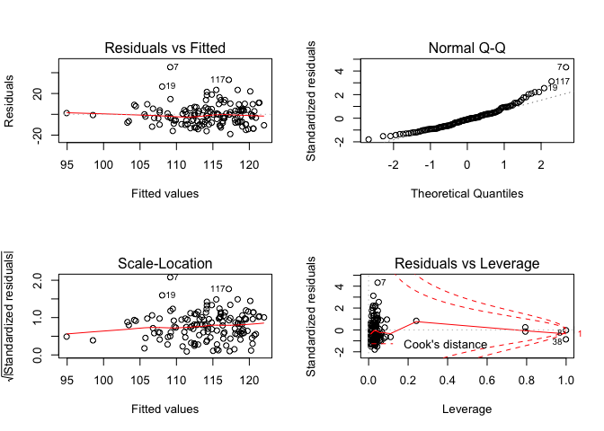<!-- -->

Marital status as a confounder:

    ## 
    ## Call:
    ## lm(formula = fbg ~ fuel_used_for_cooking_percent_wood_dung + 
    ##     percent_public_source + percent_private_toilet + percent_employed + 
    ##     percent_without_hs_education + percent_caste + percent_marital_status, 
    ##     data = total)
    ## 
    ## Residuals:
    ##     Min      1Q  Median      3Q     Max 
    ## -19.036  -7.296  -0.830   4.757  45.216 
    ## 
    ## Coefficients:
    ##                                          Estimate Std. Error t value
    ## (Intercept)                             122.62145    6.39343  19.179
    ## fuel_used_for_cooking_percent_wood_dung   9.54670   21.28819   0.448
    ## percent_public_source                    -0.09870    0.09437  -1.046
    ## percent_private_toilet                    0.02260    0.02410   0.938
    ## percent_employed                         -9.36197   13.10517  -0.714
    ## percent_without_hs_education            -20.42571    6.30929  -3.237
    ## percent_caste                            -0.06682    0.10896  -0.613
    ## percent_marital_status                   -0.03270    0.06488  -0.504
    ##                                         Pr(>|t|)    
    ## (Intercept)                              < 2e-16 ***
    ## fuel_used_for_cooking_percent_wood_dung  0.65460    
    ## percent_public_source                    0.29765    
    ## percent_private_toilet                   0.35019    
    ## percent_employed                         0.47632    
    ## percent_without_hs_education             0.00154 ** 
    ## percent_caste                            0.54083    
    ## percent_marital_status                   0.61513    
    ## ---
    ## Signif. codes:  0 '***' 0.001 '**' 0.01 '*' 0.05 '.' 0.1 ' ' 1
    ## 
    ## Residual standard error: 10.72 on 126 degrees of freedom
    ## Multiple R-squared:  0.1822, Adjusted R-squared:  0.1367 
    ## F-statistic: 4.009 on 7 and 126 DF,  p-value: 0.0005407

    ##                                             Estimate  Std. Error
    ## (Intercept)                             122.62145038  6.39343027
    ## fuel_used_for_cooking_percent_wood_dung   9.54670133 21.28818891
    ## percent_public_source                    -0.09869746  0.09437384
    ## percent_private_toilet                    0.02260344  0.02410484
    ## percent_employed                         -9.36196705 13.10517282
    ## percent_without_hs_education            -20.42571136  6.30929207
    ## percent_caste                            -0.06681502  0.10895543
    ## percent_marital_status                   -0.03270142  0.06488129
    ##                                            t value     Pr(>|t|)
    ## (Intercept)                             19.1792895 3.473968e-39
    ## fuel_used_for_cooking_percent_wood_dung  0.4484506 6.545983e-01
    ## percent_public_source                   -1.0458138 2.976492e-01
    ## percent_private_toilet                   0.9377138 3.501855e-01
    ## percent_employed                        -0.7143719 4.763186e-01
    ## percent_without_hs_education            -3.2374015 1.541765e-03
    ## percent_caste                           -0.6132325 5.408280e-01
    ## percent_marital_status                  -0.5040193 6.151280e-01

    ##                             (Intercept) 
    ##                            122.62145038 
    ## fuel_used_for_cooking_percent_wood_dung 
    ##                              9.54670133 
    ##                   percent_public_source 
    ##                             -0.09869746 
    ##                  percent_private_toilet 
    ##                              0.02260344 
    ##                        percent_employed 
    ##                             -9.36196705 
    ##            percent_without_hs_education 
    ##                            -20.42571136 
    ##                           percent_caste 
    ##                             -0.06681502 
    ##                  percent_marital_status 
    ##                             -0.03270142

    ##         1         2         3         4         5         6         7 
    ## 119.20212 116.63193 112.41039 113.56146 114.08313 111.98892 109.28407 
    ##         8         9        10        11        12        13        14 
    ## 105.60291 109.02956 111.46685 109.38528 113.99757 112.34788 114.24293 
    ##        15        16        17        18        19        20        21 
    ## 119.34750 106.13169 114.37871 112.25997 107.86009 114.10208 103.06454 
    ##        22        23        24        25        26        27        28 
    ## 114.35541 109.59891 111.90224 112.39793 110.88507 116.09213 115.12646 
    ##        29        30        31        32        33        34        35 
    ## 105.52709 113.06721 114.32008 115.55428 118.73307 113.20213 114.62441 
    ##        36        37        38        39        40        41        42 
    ## 119.76464 118.04030 117.42325 116.67691 107.52811 122.01705 120.42672 
    ##        43        44        45        46        47        48        49 
    ## 120.68943 118.59505 119.00343 116.62340 118.51068 120.39413 120.66253 
    ##        50        51        52        53        54        55        56 
    ## 118.24689 119.48407 116.47767 120.99609 115.85505 117.46950 113.84090 
    ##        57        58        59        60        61        62        63 
    ## 116.12563 113.81343 109.34499 113.05865 104.28401 113.59949 115.46932 
    ##        64        65        66        67        68        69        70 
    ## 115.51014 112.75801 109.85914 109.66774 111.23427 111.18239 107.79313 
    ##        71        72        73        74        75        76        77 
    ## 119.74554 117.65603 118.93766 103.28698 116.80822 114.02202 107.67708 
    ##        78        79        80        81        82        83        84 
    ## 107.68274 116.85730 118.77117 121.44864 121.34244 106.59570  94.91804 
    ##        85        86        87        88        89        90        91 
    ## 113.67700 113.29641 108.93285 112.12582 111.51897 110.74485 118.44946 
    ##        92        93        94        95        96        97        98 
    ## 119.97067 112.60311 108.78705 114.43786 116.34208 119.57067 116.57030 
    ##        99       100       101       102       103       104       105 
    ## 106.73175 120.57871 104.06404 120.52128 118.19137 115.75281 119.16846 
    ##       106       107       108       109       110       111       112 
    ## 120.80413 114.88532 118.82025 114.71046 118.16788 112.41553 114.18785 
    ##       113       114       115       116       117       118       119 
    ## 111.05989 106.79873 115.99735 116.13606 117.33719 119.16074 119.20206 
    ##       120       121       122       123       124       125       126 
    ## 117.50904 115.00517 118.82682 112.99228 111.42375 120.24367 112.66448 
    ##       127       128       129       130       131       132       133 
    ## 109.05023 112.55210 117.00528 115.83997 115.77098 114.96209 117.43567 
    ##       134 
    ##  98.55786

    ## # A tibble: 1 x 11
    ##   r.squared adj.r.squared sigma statistic p.value    df logLik   AIC   BIC
    ##       <dbl>         <dbl> <dbl>     <dbl>   <dbl> <int>  <dbl> <dbl> <dbl>
    ## 1     0.182         0.137  10.7      4.01 5.41e-4     8  -504. 1026. 1052.
    ## # … with 2 more variables: deviance <dbl>, df.residual <int>

| term                                          | estimate | p.value |
| :-------------------------------------------- | -------: | ------: |
| (Intercept)                                   |  122.621 |   0.000 |
| fuel\_used\_for\_cooking\_percent\_wood\_dung |    9.547 |   0.655 |
| percent\_public\_source                       |  \-0.099 |   0.298 |
| percent\_private\_toilet                      |    0.023 |   0.350 |
| percent\_employed                             |  \-9.362 |   0.476 |
| percent\_without\_hs\_education               | \-20.426 |   0.002 |
| percent\_caste                                |  \-0.067 |   0.541 |
| percent\_marital\_status                      |  \-0.033 |   0.615 |

|   fbg | fuel\_used\_for\_cooking\_percent\_wood\_dung | percent\_public\_source | percent\_private\_toilet | percent\_employed | percent\_without\_hs\_education | percent\_caste | percent\_marital\_status |   .fitted |   .se.fit |       .resid |      .hat |    .sigma |   .cooksd |  .std.resid |
| ----: | --------------------------------------------: | ----------------------: | -----------------------: | ----------------: | ------------------------------: | -------------: | -----------------------: | --------: | --------: | -----------: | --------: | --------: | --------: | ----------: |
| 123.4 |                                     0.0000000 |               0.0270270 |              100.0000000 |         0.5405405 |                       0.0270270 |      0.5675676 |                0.8108108 | 119.20212 |  2.163870 |    4.1978787 | 0.0407107 | 10.760485 | 0.0008473 |   0.3996484 |
| 109.8 |                                     0.0000000 |               0.0789474 |                0.7368421 |         0.5789474 |                       0.0263158 |      0.2368421 |                0.7631579 | 116.63193 |  2.275058 |  \-6.8319278 | 0.0450019 | 10.749140 | 0.0025030 | \-0.6518760 |
| 111.4 |                                     0.0277778 |               0.0555556 |                0.4722222 |         0.4444444 |                       0.3055556 |      0.7500000 |                0.8947368 | 112.41039 |  1.408293 |  \-1.0103929 | 0.0172438 | 10.766926 | 0.0000198 | \-0.0950365 |
| 113.1 |                                     0.0000000 |               0.1538462 |                0.7692308 |         0.6153846 |                       0.0000000 |      0.4615385 |              100.0000000 | 113.56146 |  6.336881 |  \-0.4614631 | 0.3491379 | 10.767190 | 0.0001907 | \-0.0533354 |
| 112.8 |                                     0.0277778 |               0.1944444 |                0.8333333 |         0.3888889 |                       0.2500000 |      0.3888889 |                0.9166667 | 114.08313 |  1.839388 |  \-1.2831288 | 0.0294166 | 10.766681 | 0.0000559 | \-0.1214442 |
|  98.6 |                                     0.0000000 |               0.3076923 |                0.7435897 |         0.5128205 |                       0.2820513 |      0.4871795 |                0.7435897 | 111.98892 |  1.172310 | \-13.3889155 | 0.0119490 | 10.699699 | 0.0023846 | \-1.2559684 |
| 154.5 |                                     0.0000000 |               0.1351351 |                0.5405405 |         0.6486486 |                       0.3513514 |      0.9189189 |                0.7837838 | 109.28407 |  2.302911 |   45.2159260 | 0.0461105 |  9.939242 | 0.1126012 |   4.3168344 |
| 105.6 |                                     0.0526316 |               0.3947368 |                0.9473684 |         0.5789474 |                       0.2631579 |    100.0000000 |                0.8157895 | 105.60291 | 10.721780 |  \-0.0029101 | 0.9994931 | 10.767305 | 0.0357963 | \-0.0120518 |
| 123.8 |                                     0.0000000 |               0.2777778 |                0.3611111 |         0.4166667 |                       0.4722222 |      0.0000000 |                0.8055556 | 109.02956 |  2.217444 |   14.7704404 | 0.0427515 | 10.682309 | 0.0110623 |   1.4076805 |
| 102.1 |                                     0.0000000 |               0.1500000 |                0.8500000 |         0.4250000 |                       0.3500000 |      0.0750000 |                0.8000000 | 111.46685 |  1.654949 |  \-9.3668515 | 0.0238131 | 10.733870 | 0.0023828 | \-0.8839956 |
| 105.4 |                                     0.0000000 |               0.1071429 |                0.9285714 |         0.6666667 |                       0.3392857 |      0.6785714 |                0.9107143 | 109.38528 |  2.498413 |  \-3.9852807 | 0.0542718 | 10.761071 | 0.0010474 | \-0.3821191 |
| 106.8 |                                     0.0000000 |               0.0344828 |                0.9137931 |         0.4655172 |                       0.2068966 |      0.4137931 |                0.8965517 | 113.99757 |  1.187979 |  \-7.1975695 | 0.0122705 | 10.747810 | 0.0007081 | \-0.6752893 |
| 107.1 |                                     0.0000000 |               0.3818182 |                0.8000000 |         0.4909091 |                       0.2727273 |      0.8727273 |                0.8909091 | 112.34788 |  1.139918 |  \-5.2478801 | 0.0112978 | 10.756959 | 0.0003459 | \-0.4921235 |
|  98.0 |                                     0.0000000 |               0.1636364 |                0.8909091 |         0.4909091 |                       0.1818182 |      0.6545455 |                0.8909091 | 114.24293 |  1.192258 | \-16.2429296 | 0.0123591 | 10.667611 | 0.0036331 | \-1.5240100 |
| 122.9 |                                     0.0000000 |               0.0000000 |              100.0000000 |         0.4545455 |                       0.0606061 |      0.2121212 |                0.8181818 | 119.34750 |  1.825297 |    3.5524955 | 0.0289677 | 10.762482 | 0.0004214 |   0.3361551 |
| 115.7 |                                     0.0263158 |               0.8684211 |                0.1315789 |         0.7368421 |                       0.4736842 |      0.8157895 |                0.9210526 | 106.13169 |  3.278783 |    9.5683126 | 0.0934698 | 10.729728 | 0.0113171 |   0.9370596 |
| 110.2 |                                     0.0000000 |               0.2702703 |                0.7837838 |         0.4594595 |                       0.1891892 |      0.5945946 |                0.8648649 | 114.37871 |  1.230447 |  \-4.1787134 | 0.0131635 | 10.760736 | 0.0002565 | \-0.3922320 |
| 105.9 |                                     0.1025641 |               0.0256410 |                0.9487179 |         0.5897436 |                       0.2820513 |      0.6923077 |                0.9487179 | 112.25997 |  2.378287 |  \-6.3599737 | 0.0491784 | 10.751496 | 0.0023914 | \-0.6081753 |
| 134.7 |                                     0.0000000 |               0.2105263 |                0.9473684 |         0.4210526 |                       0.5263158 |      0.6315789 |                0.8421053 | 107.86009 |  2.452781 |   26.8399065 | 0.0523074 | 10.481119 | 0.0455981 |   2.5708116 |
| 127.8 |                                     0.0000000 |               0.0263158 |                0.8947368 |         0.4473684 |                       0.2105263 |      0.2894737 |                0.8947368 | 114.10208 |  1.267379 |   13.6979213 | 0.0139656 | 10.696386 | 0.0029291 |   1.2862685 |
|  95.3 |                                     0.0540541 |               0.7837838 |                0.5675676 |         0.5405405 |                       0.7297297 |      0.1621622 |                0.9729730 | 103.06454 |  2.997468 |  \-7.7645358 | 0.0781187 | 10.742990 | 0.0060227 | \-0.7540515 |
| 135.7 |                                     0.0000000 |               0.1500000 |                0.9000000 |         0.5500000 |                       0.1500000 |      0.4250000 |                0.9250000 | 114.35541 |  1.549000 |   21.3445949 | 0.0208617 | 10.593045 | 0.0107744 |   2.0113557 |
| 100.7 |                                     0.0000000 |               0.6923077 |                0.6666667 |         0.4871795 |                       0.4102564 |      0.0256410 |                0.8205128 | 109.59891 |  1.545909 |  \-8.8989079 | 0.0207785 | 10.737226 | 0.0018650 | \-0.8385312 |
| 117.7 |                                     0.0000000 |               0.8461538 |                0.6923077 |         0.4615385 |                       0.3076923 |      0.2307692 |                0.9230769 | 111.90224 |  1.288405 |    5.7977612 | 0.0144328 | 10.754634 | 0.0005428 |   0.5445530 |
| 113.1 |                                     0.0000000 |               0.5365854 |                0.6585366 |         0.3902439 |                       0.3170732 |      0.3658537 |                0.9512195 | 112.39793 |  1.877980 |    0.7020704 | 0.0306639 | 10.767123 | 0.0000175 |   0.0664916 |
| 111.4 |                                     0.0769231 |               0.3333333 |                0.7179487 |         0.5384615 |                       0.3589744 |      0.7435897 |                0.9487179 | 110.88507 |  1.740875 |    0.5149322 | 0.0263500 | 10.767210 | 0.0000080 |   0.0486599 |
| 104.9 |                                     0.0000000 |               0.4102564 |                0.7179487 |         0.4102564 |                       0.1282051 |      0.2051282 |                0.9743590 | 116.09213 |  1.620478 | \-11.1921307 | 0.0228314 | 10.719584 | 0.0032552 | \-1.0557255 |
| 114.9 |                                     0.0000000 |               0.1538462 |                0.7948718 |         0.4615385 |                       0.1538462 |      0.0512821 |                0.9487179 | 115.12646 |  1.291451 |  \-0.2264572 | 0.0145011 | 10.767292 | 0.0000008 | \-0.0212707 |
| 103.6 |                                     0.0000000 |               0.9250000 |                0.8250000 |         0.4500000 |                       0.6250000 |      0.1750000 |                0.9500000 | 105.52709 |  2.805902 |  \-1.9270893 | 0.0684528 | 10.765830 | 0.0003184 | \-0.1861754 |
| 113.8 |                                     0.0000000 |               0.2307692 |                0.8974359 |         0.5128205 |                       0.2307692 |      0.1538462 |                0.8205128 | 113.06721 |  1.170838 |    0.7327864 | 0.0119190 | 10.767110 | 0.0000071 |   0.0687391 |
| 112.6 |                                     0.0000000 |               0.1750000 |                0.7750000 |         0.5000000 |                       0.1750000 |      0.2500000 |                0.9000000 | 114.32008 |  1.225747 |  \-1.7200779 | 0.0130631 | 10.766198 | 0.0000431 | \-0.1614457 |
| 116.4 |                                     0.0000000 |               0.1025641 |                0.7948718 |         0.3589744 |                       0.1794872 |      0.2564103 |                0.9487179 | 115.55428 |  2.042551 |    0.8457215 | 0.0362737 | 10.767036 | 0.0000304 |   0.0803292 |
| 111.0 |                                     0.0000000 |               0.0270270 |              100.0000000 |         0.5945946 |                       0.0270270 |      0.0270270 |                0.7837838 | 118.73307 |  2.609476 |  \-7.7330691 | 0.0592042 | 10.743672 | 0.0043473 | \-0.7434079 |
| 103.5 |                                     0.0263158 |               0.4736842 |                0.9210526 |         0.4473684 |                       0.2631579 |      0.8157895 |                0.8157895 | 113.20213 |  1.318798 |  \-9.7021268 | 0.0151218 | 10.731747 | 0.0015949 | \-0.9115881 |
| 104.7 |                                     0.0256410 |               0.2307692 |                0.9743590 |         0.5384615 |                       0.1538462 |      0.4102564 |                0.9230769 | 114.62441 |  1.493184 |  \-9.9244116 | 0.0193853 | 10.729933 | 0.0021579 | \-0.9344984 |
| 124.1 |                                     0.0000000 |               0.0188679 |              100.0000000 |         0.3773585 |                       0.0754717 |      0.1320755 |                0.9811321 | 119.76464 |  2.114003 |    4.3353576 | 0.0388559 | 10.760044 | 0.0008592 |   0.4123383 |
| 112.8 |                                     0.0000000 |               0.0526316 |                0.9473684 |         0.3157895 |                       0.0789474 |      0.0000000 |                0.8684211 | 118.04030 |  2.575850 |  \-5.2403042 | 0.0576882 | 10.756480 | 0.0019390 | \-0.5033640 |
| 116.9 |                                     0.0000000 |               0.0000000 |                0.9750000 |         0.5000000 |                       0.0250000 |      0.0000000 |                0.8750000 | 117.42325 |  1.809184 |  \-0.5232487 | 0.0284585 | 10.767207 | 0.0000090 | \-0.0494995 |
| 112.7 |                                     0.0000000 |               0.0769231 |                0.8846154 |         0.4230769 |                       0.0961538 |      0.0192308 |                0.9423077 | 116.67691 |  1.612043 |  \-3.9769110 | 0.0225943 | 10.761299 | 0.0004065 | \-0.3750865 |
| 103.6 |                                     0.0000000 |               0.8285714 |                0.0285714 |         0.6000000 |                       0.4571429 |      0.4000000 |                0.9428571 | 107.52811 |  2.054298 |  \-3.9281112 | 0.0366921 | 10.761359 | 0.0006631 | \-0.3731850 |
| 111.5 |                                     0.0000000 |               0.0000000 |              100.0000000 |         0.3030303 |                       0.0000000 |      0.0303030 |                0.7878788 | 122.01705 |  2.695085 | \-10.5170454 | 0.0631526 | 10.723361 | 0.0086496 | \-1.0131699 |
| 118.2 |                                     0.0000000 |               0.0000000 |              100.0000000 |         0.4000000 |                       0.0333333 |      0.0000000 |                0.9000000 | 120.42672 |  1.970516 |  \-2.2267194 | 0.0337603 | 10.765405 | 0.0001949 | \-0.2112253 |
| 106.8 |                                     0.0000000 |               0.0000000 |              100.0000000 |         0.4444444 |                       0.0000000 |      0.0000000 |                0.9629630 | 120.68943 |  1.874566 | \-13.8894300 | 0.0305526 | 10.693130 | 0.0068159 | \-1.3153620 |
| 110.9 |                                     0.0000000 |               0.0263158 |              100.0000000 |         0.5526316 |                       0.0526316 |      0.0789474 |                0.9210526 | 118.59505 |  2.218863 |  \-7.6950466 | 0.0428062 | 10.744306 | 0.0030067 | \-0.7333889 |
| 111.8 |                                     0.0000000 |               0.0000000 |              100.0000000 |         0.3947368 |                       0.1052632 |      0.0526316 |                0.8947368 | 119.00343 |  2.037267 |  \-7.2034306 | 0.0360862 | 10.747295 | 0.0021903 | \-0.6841373 |
| 108.0 |                                     0.0000000 |               0.0000000 |                0.9666667 |         0.5666667 |                       0.0333333 |      0.1000000 |                0.8333333 | 116.62340 |  2.141702 |  \-8.6233960 | 0.0398808 | 10.738500 | 0.0034964 | \-0.8206137 |
| 141.8 |                                     0.0400000 |               0.0000000 |              100.0000000 |         0.5000000 |                       0.1000000 |      0.0000000 |                0.9000000 | 118.51068 |  2.002337 |   23.2893234 | 0.0348594 | 10.556473 | 0.0220602 |   2.2104697 |
| 120.1 |                                     0.0000000 |               0.0000000 |              100.0000000 |         0.4761905 |                       0.0000000 |      0.0000000 |                0.9047619 | 120.39413 |  1.902328 |  \-0.2941280 | 0.0314642 | 10.767278 | 0.0000032 | \-0.0278677 |
| 106.9 |                                     0.0000000 |               0.0000000 |              100.0000000 |         0.4473684 |                       0.0000000 |      0.0263158 |                0.8947368 | 120.66253 |  1.873795 | \-13.7625287 | 0.0305274 | 10.694486 | 0.0066861 | \-1.3033272 |
| 121.5 |                                     0.0000000 |               0.0000000 |                0.9855072 |         0.4347826 |                       0.0144928 |      0.0434783 |                0.8405797 | 118.24689 |  1.862082 |    3.2531122 | 0.0301470 | 10.763257 | 0.0003686 |   0.3080130 |
| 129.5 |                                     0.0000000 |               0.0000000 |              100.0000000 |         0.4615385 |                       0.0512821 |      0.0000000 |                0.8974359 | 119.48407 |  1.828305 |   10.0159331 | 0.0290632 | 10.728859 | 0.0033612 |   0.9478048 |
| 109.8 |                                     0.0000000 |               0.0000000 |              100.0000000 |         0.5483871 |                       0.0000000 |      0.0000000 |              100.0000000 | 116.47767 |  6.405965 |  \-6.6776704 | 0.3567920 | 10.741526 | 0.0417944 | \-0.7763763 |
| 117.6 |                                     0.0000000 |               0.0000000 |              100.0000000 |         0.4117647 |                       0.0000000 |      0.0000000 |                0.9411765 | 120.99609 |  1.941767 |  \-3.3960891 | 0.0327823 | 10.762881 | 0.0004392 | \-0.3219882 |
| 115.6 |                                     0.0000000 |               0.1304348 |                0.8695652 |         0.4347826 |                       0.1304348 |      0.1086957 |                0.9565217 | 115.85505 |  1.456151 |  \-0.2550462 | 0.0184357 | 10.767287 | 0.0000014 | \-0.0240039 |
| 117.2 |                                     0.0000000 |               0.0000000 |              100.0000000 |         0.5641026 |                       0.1025641 |      0.1282051 |                0.8461538 | 117.46950 |  2.272960 |  \-0.2695037 | 0.0449190 | 10.767283 | 0.0000039 | \-0.0257139 |
| 104.3 |                                     0.0000000 |               0.1315789 |                0.9736842 |         0.4736842 |                       0.2105263 |      0.4210526 |                0.8157895 | 113.84090 |  1.162382 |  \-9.5408966 | 0.0117474 | 10.733038 | 0.0011900 | \-0.8949076 |
| 105.3 |                                     0.0000000 |               0.0500000 |                0.9500000 |         0.5250000 |                       0.0750000 |      0.5750000 |                0.8250000 | 116.12563 |  1.672991 | \-10.8256304 | 0.0243351 | 10.722596 | 0.0032561 | \-1.0219410 |
| 117.6 |                                     0.0000000 |               0.0243902 |                0.8536585 |         0.5121951 |                       0.1951220 |      0.2682927 |                0.8048780 | 113.81343 |  1.216612 |    3.7865664 | 0.0128692 | 10.761914 | 0.0002058 |   0.3553704 |
|  93.5 |                                     0.0000000 |               0.4594595 |                0.4324324 |         0.4054054 |                       0.4594595 |      0.4324324 |                0.9729730 | 109.34499 |  2.250382 | \-15.8449884 | 0.0440310 | 10.669301 | 0.0131465 | \-1.5110993 |
|  98.7 |                                     0.0000000 |               0.0512821 |                0.8717949 |         0.5128205 |                       0.2307692 |      0.5384615 |                0.8205128 | 113.05865 |  1.166526 | \-14.3586508 | 0.0118314 | 10.689522 | 0.0027149 | \-1.3468558 |
| 112.2 |                                     0.2549020 |               0.3421053 |                0.7894737 |         0.6052632 |                       0.7368421 |      0.1052632 |                0.9473684 | 104.28401 |  5.273386 |    7.9159882 | 0.2417827 | 10.736565 | 0.0286420 |   0.8476787 |
| 102.6 |                                     0.0000000 |               0.1538462 |                0.8974359 |         0.5128205 |                       0.2051282 |      0.0769231 |                0.9487179 | 113.59949 |  1.201610 | \-10.9994890 | 0.0125537 | 10.721697 | 0.0016930 | \-1.0321404 |
| 122.7 |                                     0.0000000 |               0.0000000 |                0.8333333 |         0.4166667 |                       0.0000000 |      0.0000000 |              100.0000000 | 115.46932 |  6.422128 |    7.2306752 | 0.3585947 | 10.736987 | 0.0495282 |   0.8418517 |
| 138.9 |                                     0.0000000 |               0.0000000 |                0.9729730 |         0.4054054 |                       0.1621622 |      0.0000000 |                0.7837838 | 115.51014 |  1.603972 |   23.3898575 | 0.0223686 | 10.557375 | 0.0139155 |   2.2057841 |
| 100.0 |                                     0.0000000 |               0.2666667 |                0.8000000 |         0.4666667 |                       0.2666667 |      0.1333333 |                0.9333333 | 112.75801 |  1.193918 | \-12.7580095 | 0.0123935 | 10.705911 | 0.0022478 | \-1.1970546 |
| 104.2 |                                     0.0256410 |               0.0512821 |                0.8974359 |         0.4871795 |                       0.4102564 |      0.7692308 |                0.9230769 | 109.85914 |  1.474662 |  \-5.6591419 | 0.0189074 | 10.755178 | 0.0006837 | \-0.5327440 |
| 103.7 |                                     0.0500000 |               0.2500000 |                0.7000000 |         0.5000000 |                       0.4250000 |      0.4250000 |                0.9750000 | 109.66774 |  1.593094 |  \-5.9677424 | 0.0220663 | 10.753774 | 0.0008931 | \-0.5627018 |
| 101.1 |                                     0.0000000 |               0.2500000 |                0.6500000 |         0.5000000 |                       0.3250000 |      0.4500000 |                0.8500000 | 111.23427 |  1.231199 | \-10.1342656 | 0.0131796 | 10.728578 | 0.0015107 | \-0.9512534 |
| 115.1 |                                     0.0000000 |               0.1351351 |                0.8918919 |         0.5675676 |                       0.2972973 |      0.4324324 |                0.9459459 | 111.18239 |  1.486975 |    3.9176117 | 0.0192244 | 10.761497 | 0.0003334 |   0.3688583 |
|  97.8 |                                     0.0000000 |               0.2500000 |                0.8888889 |         0.6666667 |                       0.4166667 |      0.6111111 |                0.9444444 | 107.79313 |  2.564578 |  \-9.9931275 | 0.0571844 | 10.727891 | 0.0069821 | \-0.9596460 |
| 110.0 |                                     0.0000000 |               0.0000000 |              100.0000000 |         0.5454545 |                       0.0000000 |      0.0000000 |                0.9090909 | 119.74554 |  2.246118 |  \-9.7455385 | 0.0438643 | 10.730346 | 0.0049527 | \-0.9293281 |
| 119.4 |                                     0.0000000 |               0.0000000 |                0.9607843 |         0.5294118 |                       0.0000000 |      0.0196078 |                0.9019608 | 117.65603 |  2.057316 |    1.7439736 | 0.0368000 | 10.766138 | 0.0001311 |   0.1656932 |
| 122.6 |                                     0.0000000 |               0.0000000 |                0.9285714 |         0.3928571 |                       0.0000000 |      0.0000000 |                0.8214286 | 118.93766 |  2.113630 |    3.6623382 | 0.0388422 | 10.762126 | 0.0006129 |   0.3483246 |
|  96.9 |                                     0.0975610 |               0.3414634 |                0.2439024 |         0.5609756 |                       0.7317073 |      0.2195122 |                0.7804878 | 103.28698 |  3.168752 |  \-6.3869799 | 0.0873017 | 10.750694 | 0.0046464 | \-0.6233829 |
| 128.1 |                                     0.0000000 |               0.0000000 |                0.9333333 |         0.5833333 |                       0.0166667 |      0.0333333 |                0.9333333 | 116.80822 |  2.352702 |   11.2917775 | 0.0481260 | 10.717434 | 0.0073604 |   1.0791842 |
| 120.5 |                                     0.0000000 |               0.0750000 |                0.9000000 |         0.4250000 |                       0.2250000 |      0.1000000 |                0.9500000 | 114.02202 |  1.418546 |    6.4779777 | 0.0174958 | 10.751433 | 0.0008266 |   0.6093899 |
| 109.5 |                                     0.0000000 |               0.5263158 |                0.5789474 |         0.5526316 |                       0.4736842 |      0.3684211 |                0.9736842 | 107.67708 |  1.863841 |    1.8229220 | 0.0302039 | 10.766039 | 0.0001160 |   0.1726040 |
| 111.5 |                                     0.0000000 |               0.6000000 |                0.3500000 |         0.5500000 |                       0.4750000 |      0.1000000 |                0.9000000 | 107.68274 |  1.862135 |    3.8172644 | 0.0301487 | 10.761729 | 0.0005076 |   0.3614287 |
| 130.4 |                                     0.0000000 |               0.0263158 |                0.9736842 |         0.5000000 |                       0.0526316 |      0.0000000 |                0.8421053 | 116.85730 |  1.677716 |   13.5426973 | 0.0244728 | 10.697240 | 0.0051259 |   1.2785228 |
| 128.1 |                                     0.0256410 |               0.0000000 |              100.0000000 |         0.5641026 |                       0.0512821 |      0.0000000 |                0.8205128 | 118.77117 |  2.322284 |    9.3288322 | 0.0468896 | 10.733337 | 0.0048820 |   0.8910020 |
| 132.6 |                                     0.0000000 |               0.0303030 |              100.0000000 |         0.3636364 |                       0.0000000 |      0.0303030 |                0.7272727 | 121.44864 |  2.195201 |   11.1513555 | 0.0418981 | 10.718986 | 0.0061685 |   1.0622942 |
| 132.2 |                                     0.0000000 |               0.0000000 |              100.0000000 |         0.3750000 |                       0.0000000 |      0.0000000 |                0.8750000 | 121.34244 |  2.120783 |   10.8575569 | 0.0391055 | 10.721638 | 0.0054263 |   1.0328024 |
|  94.8 |                                     0.0000000 |               0.9750000 |                0.0000000 |         0.5500000 |                       0.5250000 |      0.3750000 |                0.9750000 | 106.59570 |  2.086691 | \-11.7957005 | 0.0378584 | 10.713454 | 0.0061843 | \-1.1213140 |
|  96.1 |                                     0.0000000 |             100.0000000 |                0.0000000 |         0.5405405 |                       0.6216216 |      0.6756757 |                0.9459459 |  94.91804 |  9.551245 |    1.1819615 | 0.7931694 | 10.764802 | 0.0281513 |   0.2423365 |
| 106.7 |                                     0.0000000 |               0.2931034 |                0.6896552 |         0.5344828 |                       0.1896552 |      0.3275862 |                0.9655172 | 113.67700 |  1.338584 |  \-6.9769971 | 0.0155789 | 10.748926 | 0.0008505 | \-0.6556938 |
| 116.1 |                                     0.0000000 |               0.0000000 |                0.9148936 |         0.5744681 |                       0.1914894 |      0.4255319 |                0.8510638 | 113.29641 |  1.644613 |    2.8035905 | 0.0235165 | 10.764321 | 0.0002107 |   0.2645484 |
| 109.6 |                                     0.0000000 |               0.1666667 |                0.8333333 |         0.6666667 |                       0.3611111 |      0.7500000 |                0.7222222 | 108.93285 |  2.508252 |    0.6671546 | 0.0547001 | 10.767137 | 0.0000296 |   0.0639830 |
| 110.9 |                                     0.0000000 |               0.0000000 |                0.7068966 |         0.5517241 |                       0.2586207 |      0.5172414 |                0.8965517 | 112.12582 |  1.362700 |  \-1.2258159 | 0.0161453 | 10.766744 | 0.0000272 | \-0.1152346 |
| 111.5 |                                     0.0000000 |               0.0869565 |                0.7391304 |         0.5652174 |                       0.2826087 |      0.2608696 |                0.8913043 | 111.51897 |  1.466967 |  \-0.0189677 | 0.0187105 | 10.767311 | 0.0000000 | \-0.0017854 |
| 101.2 |                                     0.0000000 |               0.0000000 |                0.9743590 |         0.5384615 |                       0.3333333 |      0.2564103 |                0.9743590 | 110.74485 |  1.343601 |  \-9.5448496 | 0.0156959 | 10.732872 | 0.0016041 | \-0.8970723 |
| 115.1 |                                     0.0175439 |               0.0000000 |                0.9824561 |         0.3859649 |                       0.0350877 |      0.0350877 |                0.8947368 | 118.44946 |  2.117609 |  \-3.3494573 | 0.0389886 | 10.762974 | 0.0005147 | \-0.3185907 |
| 105.6 |                                     0.0000000 |               0.0000000 |              100.0000000 |         0.4531250 |                       0.0312500 |      0.0156250 |                0.9062500 | 119.97067 |  1.838730 | \-14.3706701 | 0.0293956 | 10.687976 | 0.0070034 | \-1.3601251 |
| 111.7 |                                     0.0169492 |               0.1355932 |                0.7796610 |         0.4915254 |                       0.2711864 |      0.2372881 |                0.8474576 | 112.60311 |  1.113989 |  \-0.9031109 | 0.0107897 | 10.767005 | 0.0000098 | \-0.0846681 |
| 106.4 |                                     0.0000000 |               0.2131148 |                0.9672131 |         0.5081967 |                       0.4426230 |      0.1147541 |                0.8852459 | 108.78705 |  1.661388 |  \-2.3870532 | 0.0239987 | 10.765142 | 0.0001560 | \-0.2252993 |
| 119.6 |                                     0.0000000 |               0.0800000 |                0.9800000 |         0.4800000 |                       0.1800000 |      0.0000000 |                0.8400000 | 114.43786 |  1.200364 |    5.1621355 | 0.0125277 | 10.757282 | 0.0003721 |   0.4843842 |
| 103.4 |                                     0.0000000 |               0.0526316 |                0.8684211 |         0.5526316 |                       0.0526316 |      0.2105263 |                0.9473684 | 116.34208 |  1.947768 | \-12.9420824 | 0.0329853 | 10.702771 | 0.0064212 | \-1.2271866 |
| 104.5 |                                     0.0000000 |               0.0000000 |              100.0000000 |         0.4000000 |                       0.0750000 |      0.0500000 |                0.9500000 | 119.57067 |  1.979860 | \-15.0706723 | 0.0340812 | 10.679601 | 0.0090168 | \-1.4298330 |
| 114.4 |                                     0.0000000 |               0.0285714 |                0.9142857 |         0.4571429 |                       0.0857143 |      0.1142857 |                0.9428571 | 116.57030 |  1.512221 |  \-2.1702961 | 0.0198827 | 10.765526 | 0.0001060 | \-0.2044104 |
| 112.2 |                                     0.0540541 |               0.1081081 |                0.1351351 |         0.5675676 |                       0.5405405 |      0.2432432 |                0.8378378 | 106.73175 |  2.096606 |    5.4682519 | 0.0382190 | 10.755755 | 0.0013427 |   0.5199163 |
| 119.5 |                                     0.0000000 |               0.0175439 |              100.0000000 |         0.4561404 |                       0.0000000 |      0.0000000 |                0.9473684 | 120.57871 |  1.874132 |  \-1.0787118 | 0.0305384 | 10.766866 | 0.0000411 | \-0.1021558 |
| 113.3 |                                     0.0416667 |               0.2708333 |                0.3125000 |         0.5625000 |                       0.6666667 |      0.3541667 |                0.8750000 | 104.06404 |  2.669937 |    9.2359621 | 0.0619795 | 10.733475 | 0.0065305 |   0.8891990 |
| 130.2 |                                     0.0000000 |               0.0000000 |              100.0000000 |         0.3859649 |                       0.0350877 |      0.0175439 |                0.8947368 | 120.52128 |  2.044246 |    9.6787192 | 0.0363339 | 10.731138 | 0.0039834 |   0.9193430 |
| 110.1 |                                     0.0000000 |               0.0000000 |              100.0000000 |         0.4871795 |                       0.1025641 |      0.1025641 |                0.8461538 | 118.19137 |  1.865045 |  \-8.0913682 | 0.0302430 | 10.742202 | 0.0022882 | \-0.7661494 |
| 125.7 |                                     0.0000000 |               0.0000000 |              100.0000000 |         0.4102564 |                       0.2564103 |      0.3589744 |                0.8205128 | 115.75281 |  2.332435 |    9.9471912 | 0.0473004 | 10.728659 | 0.0056042 |   0.9502666 |
| 122.4 |                                     0.0000000 |               0.0000000 |              100.0000000 |         0.5333333 |                       0.0333333 |      0.1333333 |                0.9333333 | 119.16846 |  2.107386 |    3.2315416 | 0.0386131 | 10.763276 | 0.0004741 |   0.3073149 |
| 123.6 |                                     0.0000000 |               0.0000000 |              100.0000000 |         0.4324324 |                       0.0000000 |      0.0540541 |                0.7837838 | 120.80413 |  1.889647 |    2.7958661 | 0.0310461 | 10.764314 | 0.0002809 |   0.2648426 |
| 119.9 |                                     0.0000000 |               0.0697674 |                0.9302326 |         0.4186047 |                       0.1860465 |      0.0000000 |                0.9534884 | 114.88532 |  1.476237 |    5.0146848 | 0.0189478 | 10.757785 | 0.0005380 |   0.4720854 |
| 117.0 |                                     0.0000000 |               0.0750000 |              100.0000000 |         0.4250000 |                       0.1000000 |      0.0250000 |                0.9500000 | 118.82025 |  1.894110 |  \-1.8202484 | 0.0311929 | 10.766041 | 0.0001197 | \-0.1724388 |
| 117.0 |                                     0.0161290 |               0.1774194 |                0.7903226 |         0.4354839 |                       0.1935484 |      0.1129032 |                0.8387097 | 114.71046 |  1.379560 |    2.2895372 | 0.0165473 | 10.765331 | 0.0000975 |   0.2152752 |
| 118.2 |                                     0.0000000 |               0.0000000 |                0.9000000 |         0.4750000 |                       0.0000000 |      0.0000000 |                0.8250000 | 118.16788 |  1.888072 |    0.0321195 | 0.0309944 | 10.767311 | 0.0000000 |   0.0030425 |
|  99.8 |                                     0.0000000 |               0.1621622 |                0.6756757 |         0.3783784 |                       0.3243243 |      0.1891892 |                0.7837838 | 112.41553 |  2.017493 | \-12.6155255 | 0.0353891 | 10.705843 | 0.0065786 | \-1.1977116 |
| 132.6 |                                     0.0000000 |               0.0555556 |              100.0000000 |         0.5277778 |                       0.2777778 |      0.6666667 |                0.8888889 | 114.18785 |  2.313585 |   18.4121468 | 0.0465390 | 10.634405 | 0.0188615 |   1.7582310 |
| 113.5 |                                     0.0000000 |               0.1282051 |              100.0000000 |         0.4615385 |                       0.4615385 |      0.5128205 |                0.8205128 | 111.05989 |  3.065199 |    2.4401143 | 0.0816890 | 10.764902 | 0.0006268 |   0.2374315 |
| 103.4 |                                     0.0000000 |               0.6052632 |                0.7105263 |         0.4736842 |                       0.5526316 |      0.4210526 |                0.8684211 | 106.79873 |  2.299038 |  \-3.3987325 | 0.0459556 | 10.762813 | 0.0006339 | \-0.3244559 |
| 132.3 |                                     0.0000000 |               0.0476190 |                0.9523810 |         0.4285714 |                       0.1269841 |      0.0952381 |                0.8730159 | 115.99735 |  1.498316 |   16.3026473 | 0.0195188 | 10.666136 | 0.0058647 |   1.5351877 |
| 129.8 |                                     0.0000000 |               0.0000000 |                0.9444444 |         0.3888889 |                       0.1388889 |      0.0000000 |                0.8888889 | 116.13606 |  1.774209 |   13.6639392 | 0.0273688 | 10.695763 | 0.0058704 |   1.2918878 |
| 150.3 |                                     0.0000000 |               0.0000000 |                0.9473684 |         0.4473684 |                       0.0526316 |      0.1578947 |                0.9736842 | 117.33719 |  1.663730 |   32.9628123 | 0.0240664 | 10.345447 | 0.0298384 |   3.1112658 |
| 107.3 |                                     0.0000000 |               0.0263158 |                0.9736842 |         0.3684211 |                       0.0000000 |      0.0000000 |                0.9473684 | 119.16074 |  2.275408 | \-11.8607356 | 0.0450157 | 10.712447 | 0.0075466 | \-1.1317135 |
| 124.1 |                                     0.0000000 |               0.0000000 |              100.0000000 |         0.4358974 |                       0.0769231 |      0.0000000 |                0.8461538 | 119.20206 |  1.849190 |    4.8979419 | 0.0297310 | 10.758122 | 0.0008234 |   0.4636503 |
| 127.7 |                                     0.0000000 |               0.0000000 |                0.9000000 |         0.4000000 |                       0.0666667 |      0.0666667 |                0.6666667 | 117.50904 |  1.844361 |   10.1909627 | 0.0295759 | 10.727480 | 0.0035449 |   0.9646226 |
| 133.8 |                                     0.0000000 |               0.0810811 |                0.8918919 |         0.5135135 |                       0.1351351 |      0.4324324 |                0.9729730 | 115.00517 |  1.381068 |   18.7948307 | 0.0165835 | 10.633032 | 0.0065832 |   1.7672283 |
| 111.5 |                                     0.0500000 |               0.0250000 |              100.0000000 |         0.4750000 |                       0.1000000 |      0.2000000 |                0.8250000 | 118.82681 |  2.047353 |  \-7.3268150 | 0.0364445 | 10.746595 | 0.0022902 | \-0.6959849 |
| 106.3 |                                     0.1724138 |               0.8275862 |                0.0000000 |         0.5862069 |                       0.2758621 |      0.5862069 |                0.9655172 | 112.99228 |  3.579101 |  \-6.6922829 | 0.1113766 | 10.748572 | 0.0068654 | \-0.6619701 |
| 105.4 |                                     0.0000000 |               0.2162162 |                0.7297297 |         0.5405405 |                       0.2972973 |      0.4324324 |                0.9459459 | 111.42375 |  1.300274 |  \-6.0237465 | 0.0146999 | 10.753622 | 0.0005971 | \-0.5658553 |
| 142.2 |                                     0.0270270 |               0.0000000 |              100.0000000 |         0.4594595 |                       0.0270270 |      0.1621622 |                0.9729730 | 120.24367 |  1.925140 |   21.9563296 | 0.0322233 | 10.580640 | 0.0180259 |   2.0811106 |
| 119.6 |                                     0.0000000 |               0.3333333 |                0.6944444 |         0.3888889 |                       0.3055556 |      0.4166667 |                0.9166667 | 112.66448 |  1.864596 |    6.9355224 | 0.0302284 | 10.748869 | 0.0016803 |   0.6567006 |
| 106.5 |                                     0.0256410 |               0.1538462 |                0.4102564 |         0.4615385 |                       0.4615385 |      0.5128205 |                0.8461538 | 109.05023 |  1.810064 |  \-2.5502328 | 0.0284862 | 10.764824 | 0.0002133 | \-0.2412561 |
| 119.6 |                                     0.0000000 |               0.0000000 |                0.9487179 |         0.5128205 |                       0.2564103 |      0.3076923 |                0.9743590 | 112.55210 |  1.157418 |    7.0478973 | 0.0116473 | 10.748625 | 0.0006437 |   0.6610383 |
| 117.5 |                                     0.0000000 |               0.0000000 |                0.9117647 |         0.4705882 |                       0.0588235 |      0.0294118 |                0.8461538 | 117.00528 |  1.608949 |    0.4947202 | 0.0225077 | 10.767219 | 0.0000063 |   0.0466580 |
| 111.1 |                                     0.0000000 |               0.0263158 |                0.9210526 |         0.6052632 |                       0.0526316 |      0.3947368 |                0.9736842 | 115.83997 |  2.390630 |  \-4.7399657 | 0.0496902 | 10.758525 | 0.0013435 | \-0.4533834 |
| 115.8 |                                     0.0000000 |               0.0000000 |                0.9714286 |         0.5428571 |                       0.0857143 |      0.1428571 |                0.9142857 | 115.77098 |  1.736309 |    0.0290214 | 0.0262120 | 10.767311 | 0.0000000 |   0.0027423 |
| 106.8 |                                     0.0000000 |               0.0000000 |                0.9090909 |         0.4848485 |                       0.1515152 |      0.2727273 |                0.8484848 | 114.96209 |  1.266124 |  \-8.1620897 | 0.0139379 | 10.742183 | 0.0010379 | \-0.7664295 |
|  98.4 |                                     0.0000000 |               0.0000000 |              100.0000000 |         0.4705882 |                       0.1470588 |      0.1176471 |                0.8823529 | 117.43567 |  1.885595 | \-19.0356671 | 0.0309131 | 10.627496 | 0.0129631 | \-1.8030581 |
|  97.8 |                                     0.5526316 |             100.0000000 |                0.0000000 |         0.5789474 |                       0.6842105 |      0.6578947 |                0.9210526 |  98.55786 |  9.554115 |  \-0.7578629 | 0.7936461 | 10.766277 | 0.0116343 | \-0.1555633 |

    ## Warning in sqrt(crit * p * (1 - hh)/hh): NaNs produced
    
    ## Warning in sqrt(crit * p * (1 - hh)/hh): NaNs produced

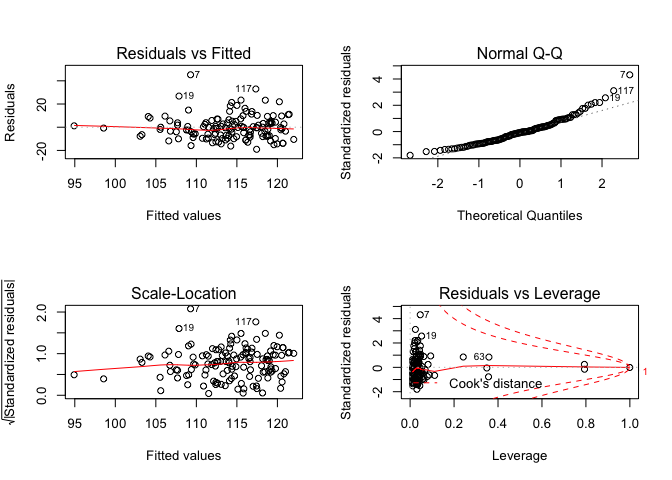<!-- -->

Full model:

    ## 
    ## Call:
    ## lm(formula = fbg ~ fuel_used_for_cooking_percent_wood_dung + 
    ##     percent_public_source + percent_private_toilet + percent_employed + 
    ##     percent_without_hs_education + percent_caste + median_age + 
    ##     percent_female + percent_marital_status, data = total)
    ## 
    ## Residuals:
    ##     Min      1Q  Median      3Q     Max 
    ## -20.422  -6.497  -1.782   3.994  38.488 
    ## 
    ## Coefficients:
    ##                                         Estimate Std. Error t value
    ## (Intercept)                             60.73319   14.53770   4.178
    ## fuel_used_for_cooking_percent_wood_dung  1.30336   19.85855   0.066
    ## percent_public_source                   -0.10252    0.08769  -1.169
    ## percent_private_toilet                  -0.01014    0.02357  -0.430
    ## percent_employed                        17.21384   13.43869   1.281
    ## percent_without_hs_education            -5.77267    6.69634  -0.862
    ## percent_caste                           -0.04848    0.10132  -0.479
    ## median_age                               1.05998    0.22620   4.686
    ## percent_female                          -0.52226    1.68840  -0.309
    ## percent_marital_status                  -0.08578    0.06138  -1.397
    ##                                         Pr(>|t|)    
    ## (Intercept)                             5.51e-05 ***
    ## fuel_used_for_cooking_percent_wood_dung    0.948    
    ## percent_public_source                      0.245    
    ## percent_private_toilet                     0.668    
    ## percent_employed                           0.203    
    ## percent_without_hs_education               0.390    
    ## percent_caste                              0.633    
    ## median_age                              7.21e-06 ***
    ## percent_female                             0.758    
    ## percent_marital_status                     0.165    
    ## ---
    ## Signif. codes:  0 '***' 0.001 '**' 0.01 '*' 0.05 '.' 0.1 ' ' 1
    ## 
    ## Residual standard error: 9.964 on 124 degrees of freedom
    ## Multiple R-squared:  0.3052, Adjusted R-squared:  0.2548 
    ## F-statistic: 6.052 on 9 and 124 DF,  p-value: 5.123e-07

    ##                                            Estimate  Std. Error
    ## (Intercept)                             60.73318885 14.53770472
    ## fuel_used_for_cooking_percent_wood_dung  1.30336257 19.85855155
    ## percent_public_source                   -0.10251844  0.08769163
    ## percent_private_toilet                  -0.01014074  0.02357330
    ## percent_employed                        17.21383503 13.43869096
    ## percent_without_hs_education            -5.77267344  6.69634072
    ## percent_caste                           -0.04848333  0.10132171
    ## median_age                               1.05998374  0.22620110
    ## percent_female                          -0.52225928  1.68839899
    ## percent_marital_status                  -0.08578202  0.06138359
    ##                                             t value     Pr(>|t|)
    ## (Intercept)                              4.17763258 5.510873e-05
    ## fuel_used_for_cooking_percent_wood_dung  0.06563231 9.477763e-01
    ## percent_public_source                   -1.16907905 2.446143e-01
    ## percent_private_toilet                  -0.43017894 6.678122e-01
    ## percent_employed                         1.28091606 2.026137e-01
    ## percent_without_hs_education            -0.86206388 3.903164e-01
    ## percent_caste                           -0.47850885 6.331307e-01
    ## median_age                               4.68602370 7.208566e-06
    ## percent_female                          -0.30932220 7.575956e-01
    ## percent_marital_status                  -1.39747472 1.647662e-01

    ##                             (Intercept) 
    ##                             60.73318885 
    ## fuel_used_for_cooking_percent_wood_dung 
    ##                              1.30336257 
    ##                   percent_public_source 
    ##                             -0.10251844 
    ##                  percent_private_toilet 
    ##                             -0.01014074 
    ##                        percent_employed 
    ##                             17.21383503 
    ##            percent_without_hs_education 
    ##                             -5.77267344 
    ##                           percent_caste 
    ##                             -0.04848333 
    ##                              median_age 
    ##                              1.05998374 
    ##                          percent_female 
    ##                             -0.52225928 
    ##                  percent_marital_status 
    ##                             -0.08578202

    ##         1         2         3         4         5         6         7 
    ## 114.06678 115.57422 114.21207 112.23736 121.18293 108.12383 116.01235 
    ##         8         9        10        11        12        13        14 
    ## 105.88505 115.34178 106.36708 112.17025 107.70258 109.94195 106.25038 
    ##        15        16        17        18        19        20        21 
    ## 121.03874 110.48301 114.29795 108.92865 112.38307 110.43857 106.45429 
    ##        22        23        24        25        26        27        28 
    ## 113.40808 109.19063 114.47057 109.54737 110.97657 113.80738 115.21768 
    ##        29        30        31        32        33        34        35 
    ## 107.57748 112.59416 107.37749 113.06674 114.22363 114.42778 114.46944 
    ##        36        37        38        39        40        41        42 
    ## 115.49343 120.22752 117.40932 116.09951 109.85443 126.85755 120.52554 
    ##        43        44        45        46        47        48        49 
    ## 118.08447 118.40984 121.22764 118.44355 122.57948 120.32727 122.01385 
    ##        50        51        52        53        54        55        56 
    ## 121.86478 129.17694 114.88061 127.80889 119.54515 118.91516 105.78771 
    ##        57        58        59        60        61        62        63 
    ## 107.27787 109.64115  98.84106 107.60849 108.16074 112.85151 118.41822 
    ##        64        65        66        67        68        69        70 
    ## 114.97273 107.72768 110.01550 108.28310 108.56672 110.26113 109.94305 
    ##        71        72        73        74        75        76        77 
    ## 120.31906 121.43708 118.74192 104.60401 116.04038 117.62860 110.11143 
    ##        78        79        80        81        82        83        84 
    ## 111.37681 127.23714 125.62820 123.88782 117.07195 105.17462  95.77652 
    ##        85        86        87        88        89        90        91 
    ## 109.26380 111.28940 111.87516 113.53865 109.09485 111.19794 117.71855 
    ##        92        93        94        95        96        97        98 
    ## 114.21384 109.18676 112.14453 117.28343 112.03968 116.24783 119.32084 
    ##        99       100       101       102       103       104       105 
    ## 111.09238 123.68682 103.55908 120.08739 121.11363 118.06051 125.22916 
    ##       106       107       108       109       110       111       112 
    ## 117.84710 107.60455 118.84793 111.77466 124.54342 110.04097 113.49263 
    ##       113       114       115       116       117       118       119 
    ## 102.99557 107.40114 114.31122 119.20767 120.17842 127.72165 122.69408 
    ##       120       121       122       123       124       125       126 
    ## 126.30144 110.74446 111.12721 107.95679 106.12225 119.25870 115.50829 
    ##       127       128       129       130       131       132       133 
    ## 109.15564 115.19371 121.32534 114.74978 118.51131 113.34765 109.98720 
    ##       134 
    ##  97.72000

    ## # A tibble: 1 x 11
    ##   r.squared adj.r.squared sigma statistic p.value    df logLik   AIC   BIC
    ##       <dbl>         <dbl> <dbl>     <dbl>   <dbl> <int>  <dbl> <dbl> <dbl>
    ## 1     0.305         0.255  9.96      6.05 5.12e-7    10  -493. 1008. 1040.
    ## # … with 2 more variables: deviance <dbl>, df.residual <int>

| term                                          | estimate | p.value |
| :-------------------------------------------- | -------: | ------: |
| (Intercept)                                   |   60.733 |   0.000 |
| fuel\_used\_for\_cooking\_percent\_wood\_dung |    1.303 |   0.948 |
| percent\_public\_source                       |  \-0.103 |   0.245 |
| percent\_private\_toilet                      |  \-0.010 |   0.668 |
| percent\_employed                             |   17.214 |   0.203 |
| percent\_without\_hs\_education               |  \-5.773 |   0.390 |
| percent\_caste                                |  \-0.048 |   0.633 |
| median\_age                                   |    1.060 |   0.000 |
| percent\_female                               |  \-0.522 |   0.758 |
| percent\_marital\_status                      |  \-0.086 |   0.165 |

|   fbg | fuel\_used\_for\_cooking\_percent\_wood\_dung | percent\_public\_source | percent\_private\_toilet | percent\_employed | percent\_without\_hs\_education | percent\_caste | median\_age | percent\_female | percent\_marital\_status |   .fitted |  .se.fit |       .resid |      .hat |    .sigma |     .cooksd |  .std.resid |
| ----: | --------------------------------------------: | ----------------------: | -----------------------: | ----------------: | ------------------------------: | -------------: | ----------: | --------------: | -----------------------: | --------: | -------: | -----------: | --------: | --------: | ----------: | ----------: |
| 123.4 |                                     0.0000000 |               0.0270270 |              100.0000000 |         0.5405405 |                       0.0270270 |      0.5675676 |    43.08108 |       0.7017544 |                0.8108108 | 114.06678 | 2.289907 |    9.3332210 | 0.0528132 |  9.967280 |   0.0051647 |   0.9624257 |
| 109.8 |                                     0.0000000 |               0.0789474 |                0.7368421 |         0.5789474 |                       0.0263158 |      0.2368421 |    42.89474 |       0.6666667 |                0.7631579 | 115.57422 | 2.151443 |  \-5.7742178 | 0.0466194 |  9.990497 |   0.0017224 | \-0.5934901 |
| 111.4 |                                     0.0277778 |               0.0555556 |                0.4722222 |         0.4444444 |                       0.3055556 |      0.7500000 |    45.33333 |       0.7142857 |                0.8947368 | 114.21207 | 1.364248 |  \-2.8120691 | 0.0187453 | 10.001442 |   0.0001551 | \-0.2848975 |
| 113.1 |                                     0.0000000 |               0.1538462 |                0.7692308 |         0.6153846 |                       0.0000000 |      0.4615385 |    47.07692 |       0.7000000 |              100.0000000 | 112.23736 | 5.894895 |    0.8626417 | 0.3499928 | 10.004252 |   0.0006209 |   0.1073804 |
| 112.8 |                                     0.0277778 |               0.1944444 |                0.8333333 |         0.3888889 |                       0.2500000 |      0.3888889 |    52.50000 |       0.6909091 |                0.9166667 | 121.18293 | 2.283983 |  \-8.3829339 | 0.0525403 |  9.974535 |   0.0041426 | \-0.8643093 |
|  98.6 |                                     0.0000000 |               0.3076923 |                0.7435897 |         0.5128205 |                       0.2820513 |      0.4871795 |    38.35897 |       0.6551724 |                0.7435897 | 108.12383 | 1.370941 |  \-9.5238344 | 0.0189297 |  9.967081 |   0.0017967 | \-0.9649732 |
| 154.5 |                                     0.0000000 |               0.1351351 |                0.5405405 |         0.6486486 |                       0.3513514 |      0.9189189 |    44.00000 |       0.7017544 |                0.7837838 | 116.01235 | 2.576912 |   38.4876523 | 0.0668815 |  9.337456 |   0.1145994 |   3.9985867 |
| 105.6 |                                     0.0526316 |               0.3947368 |                0.9473684 |         0.5789474 |                       0.2631579 |    100.0000000 |    39.57895 |       0.6666667 |                0.8157895 | 105.88505 | 9.961970 |  \-0.2850463 | 0.9995337 |  9.933666 | 376.1844081 | \-1.3247541 |
| 123.8 |                                     0.0000000 |               0.2777778 |                0.3611111 |         0.4166667 |                       0.4722222 |      0.0000000 |    47.72222 |       0.6153846 |                0.8055556 | 115.34178 | 2.461676 |    8.4582168 | 0.0610336 |  9.973711 |   0.0049881 |   0.8760064 |
| 102.1 |                                     0.0000000 |               0.1500000 |                0.8500000 |         0.4250000 |                       0.3500000 |      0.0750000 |    38.47500 |       0.6666667 |                0.8000000 | 106.36708 | 1.883798 |  \-4.2670753 | 0.0357417 |  9.997041 |   0.0007049 | \-0.4361010 |
| 105.4 |                                     0.0000000 |               0.1071429 |                0.9285714 |         0.6666667 |                       0.3392857 |      0.6785714 |    40.00000 |       0.6666667 |                0.9107143 | 112.17025 | 2.398589 |  \-6.7702471 | 0.0579454 |  9.984928 |   0.0030143 | \-0.7000353 |
| 106.8 |                                     0.0000000 |               0.0344828 |                0.9137931 |         0.4655172 |                       0.2068966 |      0.4137931 |    38.31034 |       0.6666667 |                0.8965517 | 107.70258 | 1.743954 |  \-0.9025776 | 0.0306321 | 10.004375 |   0.0000267 | \-0.0920012 |
| 107.1 |                                     0.0000000 |               0.3818182 |                0.8000000 |         0.4909091 |                       0.2727273 |      0.8727273 |    40.41818 |       0.6585366 |                0.8909091 | 109.94195 | 1.181498 |  \-2.8419474 | 0.0140596 | 10.001388 |   0.0001177 | \-0.2872395 |
|  98.0 |                                     0.0000000 |               0.1636364 |                0.8909091 |         0.4909091 |                       0.1818182 |      0.6545455 |    36.41818 |       0.6746988 |                0.8909091 | 106.25038 | 2.039707 |  \-8.2503841 | 0.0419027 |  9.975808 |   0.0031295 | \-0.8459075 |
| 122.9 |                                     0.0000000 |               0.0000000 |              100.0000000 |         0.4545455 |                       0.0606061 |      0.2121212 |    51.18182 |       0.6250000 |                0.8181818 | 121.03874 | 1.735928 |    1.8612600 | 0.0303508 | 10.003265 |   0.0001126 |   0.1896938 |
| 115.7 |                                     0.0263158 |               0.8684211 |                0.1315789 |         0.7368421 |                       0.4736842 |      0.8157895 |    38.05263 |       0.6896552 |                0.9210526 | 110.48301 | 3.184745 |    5.2169915 | 0.1021542 |  9.992392 |   0.0034738 |   0.5525515 |
| 110.2 |                                     0.0000000 |               0.2702703 |                0.7837838 |         0.4594595 |                       0.1891892 |      0.5945946 |    44.56757 |       0.6785714 |                0.8648649 | 114.29795 | 1.149889 |  \-4.0979539 | 0.0133174 |  9.997799 |   0.0002314 | \-0.4140300 |
| 105.9 |                                     0.1025641 |               0.0256410 |                0.9487179 |         0.5897436 |                       0.2820513 |      0.6923077 |    37.74359 |       0.6551724 |                0.9487179 | 108.92865 | 2.327294 |  \-3.0286498 | 0.0545519 | 10.000774 |   0.0005638 | \-0.3125962 |
| 134.7 |                                     0.0000000 |               0.2105263 |                0.9473684 |         0.4210526 |                       0.5263158 |      0.6315789 |    45.21053 |       0.6666667 |                0.8421053 | 112.38307 | 2.479839 |   22.3169283 | 0.0619375 |  9.786616 |   0.0353074 |   2.3124483 |
| 127.8 |                                     0.0000000 |               0.0263158 |                0.8947368 |         0.4473684 |                       0.2105263 |      0.2894737 |    41.21053 |       0.6896552 |                0.8947368 | 110.43857 | 1.415933 |   17.3614338 | 0.0201926 |  9.878932 |   0.0063854 |   1.7602272 |
|  95.3 |                                     0.0540541 |               0.7837838 |                0.5675676 |         0.5405405 |                       0.7297297 |      0.1621622 |    38.72973 |       0.6071429 |                0.9729730 | 106.45429 | 2.881631 | \-11.1542893 | 0.0836342 |  9.949397 |   0.0124806 | \-1.1693943 |
| 135.7 |                                     0.0000000 |               0.1500000 |                0.9000000 |         0.5500000 |                       0.1500000 |      0.4250000 |    42.02500 |       0.6666667 |                0.9250000 | 113.40808 | 1.469202 |   22.2919173 | 0.0217405 |  9.796147 |   0.0113701 |   2.2619025 |
| 100.7 |                                     0.0000000 |               0.6923077 |                0.6666667 |         0.4871795 |                       0.4102564 |      0.0256410 |    40.51282 |       0.6779661 |                0.8205128 | 109.19063 | 1.439648 |  \-8.4906336 | 0.0208747 |  9.974756 |   0.0015810 | \-0.8611414 |
| 117.7 |                                     0.0000000 |               0.8461538 |                0.6923077 |         0.4615385 |                       0.3076923 |      0.2307692 |    45.38462 |       0.6779661 |                0.9230769 | 114.47057 | 1.316827 |    3.2294299 | 0.0174648 | 10.000403 |   0.0001900 |   0.3269680 |
| 113.1 |                                     0.0000000 |               0.5365854 |                0.6585366 |         0.3902439 |                       0.3170732 |      0.3658537 |    41.92683 |       0.6774194 |                0.9512195 | 109.54737 | 1.847874 |    3.5526314 | 0.0343916 |  9.999405 |   0.0004689 |   0.3628299 |
| 111.4 |                                     0.0769231 |               0.3333333 |                0.7179487 |         0.5384615 |                       0.3589744 |      0.7435897 |    41.00000 |       0.6779661 |                0.9487179 | 110.97657 | 1.617975 |    0.4234349 | 0.0263664 | 10.004642 |   0.0000050 |   0.0430668 |
| 104.9 |                                     0.0000000 |               0.4102564 |                0.7179487 |         0.4102564 |                       0.1282051 |      0.2051282 |    44.56410 |       0.6551724 |                0.9743590 | 113.80738 | 1.594297 |  \-8.9073757 | 0.0256003 |  9.971578 |   0.0021547 | \-0.9055964 |
| 114.9 |                                     0.0000000 |               0.1538462 |                0.7948718 |         0.4615385 |                       0.1538462 |      0.0512821 |    45.17949 |       0.6779661 |                0.9487179 | 115.21768 | 1.209886 |  \-0.3176779 | 0.0147433 | 10.004675 |   0.0000015 | \-0.0321193 |
| 103.6 |                                     0.0000000 |               0.9250000 |                0.8250000 |         0.4500000 |                       0.6250000 |      0.1750000 |    40.80000 |       0.6666667 |                0.9500000 | 107.57748 | 2.652725 |  \-3.9774843 | 0.0708747 |  9.997796 |   0.0013082 | \-0.4141187 |
| 113.8 |                                     0.0000000 |               0.2307692 |                0.8974359 |         0.5128205 |                       0.2307692 |      0.1538462 |    42.28205 |       0.6551724 |                0.8205128 | 112.59416 | 1.103063 |    1.2058449 | 0.0122548 | 10.004119 |   0.0000184 |   0.1217650 |
| 112.6 |                                     0.0000000 |               0.1750000 |                0.7750000 |         0.5000000 |                       0.1750000 |      0.2500000 |    37.27500 |       0.6666667 |                0.9000000 | 107.37749 | 1.877217 |    5.2225149 | 0.0354925 |  9.993220 |   0.0010481 |   0.5336793 |
| 116.4 |                                     0.0000000 |               0.1025641 |                0.7948718 |         0.3589744 |                       0.1794872 |      0.2564103 |    44.94872 |       0.6551724 |                0.9487179 | 113.06674 | 1.974742 |    3.3332562 | 0.0392760 | 10.000017 |   0.0004762 |   0.3412895 |
| 111.0 |                                     0.0000000 |               0.0270270 |              100.0000000 |         0.5945946 |                       0.0270270 |      0.0270270 |    42.32432 |       0.7017544 |                0.7837838 | 114.22363 | 2.608986 |  \-3.2236324 | 0.0685568 | 10.000183 |   0.0008271 | \-0.3352130 |
| 103.5 |                                     0.0263158 |               0.4736842 |                0.9210526 |         0.4473684 |                       0.2631579 |      0.8157895 |    45.28947 |       0.6896552 |                0.8157895 | 114.42778 | 1.253612 | \-10.9277826 | 0.0158283 |  9.955294 |   0.0019655 | \-1.1054780 |
| 104.7 |                                     0.0256410 |               0.2307692 |                0.9743590 |         0.5384615 |                       0.1538462 |      0.4102564 |    43.20513 |       0.6551724 |                0.9230769 | 114.46944 | 1.406880 |  \-9.7694436 | 0.0199352 |  9.965070 |   0.0019951 | \-0.9903665 |
| 124.1 |                                     0.0000000 |               0.0188679 |              100.0000000 |         0.3773585 |                       0.0754717 |      0.1320755 |    47.32075 |       0.6750000 |                0.9811321 | 115.49343 | 2.165728 |    8.6065672 | 0.0472405 |  9.973078 |   0.0038825 |   0.8848952 |
| 112.8 |                                     0.0000000 |               0.0526316 |                0.9473684 |         0.3157895 |                       0.0789474 |      0.0000000 |    51.84211 |       0.6666667 |                0.8684211 | 120.22752 | 2.444121 |  \-7.4275175 | 0.0601662 |  9.980838 |   0.0037848 | \-0.7689032 |
| 116.9 |                                     0.0000000 |               0.0000000 |                0.9750000 |         0.5000000 |                       0.0250000 |      0.0000000 |    48.85000 |       6.6666667 |                0.8750000 | 117.40932 | 9.958298 |  \-0.5093202 | 0.9987971 |  9.916709 | 180.3407134 | \-1.4737585 |
| 112.7 |                                     0.0000000 |               0.0769231 |                0.8846154 |         0.4230769 |                       0.0961538 |      0.0192308 |    46.30769 |       0.6666667 |                0.9423077 | 116.09951 | 1.516579 |  \-3.3995063 | 0.0231653 |  9.999909 |   0.0002826 | \-0.3451905 |
| 103.6 |                                     0.0000000 |               0.8285714 |                0.0285714 |         0.6000000 |                       0.4571429 |      0.4000000 |    39.57143 |       0.6274510 |                0.9428571 | 109.85443 | 1.972827 |  \-6.2544251 | 0.0391999 |  9.988160 |   0.0016730 | \-0.6403602 |
| 111.5 |                                     0.0000000 |               0.0000000 |              100.0000000 |         0.3030303 |                       0.0000000 |      0.0303030 |    58.81818 |       0.6800000 |                0.7878788 | 126.85755 | 2.708882 | \-15.3575538 | 0.0739073 |  9.900698 |   0.0204705 | \-1.6015788 |
| 118.2 |                                     0.0000000 |               0.0000000 |              100.0000000 |         0.4000000 |                       0.0333333 |      0.0000000 |    51.46667 |       0.6956522 |                0.9000000 | 120.52554 | 1.831293 |  \-2.3255419 | 0.0337771 | 10.002442 |   0.0001971 | \-0.2374319 |
| 106.8 |                                     0.0000000 |               0.0000000 |              100.0000000 |         0.4444444 |                       0.0000000 |      0.0000000 |    48.25926 |       0.6829268 |                0.9629630 | 118.08447 | 1.828601 | \-11.2844689 | 0.0336779 |  9.951030 |   0.0046256 | \-1.1520562 |
| 110.9 |                                     0.0000000 |               0.0263158 |              100.0000000 |         0.5526316 |                       0.0526316 |      0.0789474 |    47.07895 |       0.6428571 |                0.9210526 | 118.40984 | 2.064669 |  \-7.5098444 | 0.0429346 |  9.980745 |   0.0026625 | \-0.7703953 |
| 111.8 |                                     0.0000000 |               0.0000000 |              100.0000000 |         0.3947368 |                       0.1052632 |      0.0526316 |    52.60526 |       0.6896552 |                0.8947368 | 121.22764 | 1.953463 |  \-9.4276409 | 0.0384342 |  9.967089 |   0.0037211 | \-0.9648660 |
| 108.0 |                                     0.0000000 |               0.0000000 |                0.9666667 |         0.5666667 |                       0.0333333 |      0.1000000 |    45.83333 |       0.6666667 |                0.8333333 | 118.44355 | 2.052033 | \-10.4435521 | 0.0424107 |  9.958331 |   0.0050807 | \-1.0710558 |
| 141.8 |                                     0.0400000 |               0.0000000 |              100.0000000 |         0.5000000 |                       0.1000000 |      0.0000000 |    52.08000 |       0.6666667 |                0.9000000 | 122.57948 | 2.053063 |   19.2205236 | 0.0424533 |  9.846711 |   0.0172278 |   1.9712365 |
| 120.1 |                                     0.0000000 |               0.0000000 |              100.0000000 |         0.4761905 |                       0.0000000 |      0.0000000 |    49.85714 |       0.6875000 |                0.9047619 | 120.32727 | 1.767992 |  \-0.2272747 | 0.0314824 | 10.004695 |   0.0000017 | \-0.0231767 |
| 106.9 |                                     0.0000000 |               0.0000000 |              100.0000000 |         0.4473684 |                       0.0000000 |      0.0263158 |    51.89474 |       0.6428571 |                0.8947368 | 122.01385 | 1.767588 | \-15.1138523 | 0.0314680 |  9.908424 |   0.0077179 | \-1.5412450 |
| 121.5 |                                     0.0000000 |               0.0000000 |                0.9855072 |         0.4347826 |                       0.0144928 |      0.0434783 |    51.10145 |       0.6730769 |                0.8405797 | 121.86478 | 1.912481 |  \-0.3647793 | 0.0368385 | 10.004661 |   0.0000053 | \-0.0373022 |
| 129.5 |                                     0.0000000 |               0.0000000 |              100.0000000 |         0.4615385 |                       0.0512821 |      0.0000000 |    58.71795 |       0.6779661 |                0.8974359 | 129.17694 | 2.676578 |    0.3230595 | 0.0721550 | 10.004671 |   0.0000088 |   0.0336588 |
| 109.8 |                                     0.0000000 |               0.0000000 |              100.0000000 |         0.5483871 |                       0.0000000 |      0.0000000 |    51.54839 |       0.6521739 |              100.0000000 | 114.88061 | 5.962613 |  \-5.0806067 | 0.3580802 |  9.988365 |   0.0225921 | \-0.6363978 |
| 117.6 |                                     0.0000000 |               0.0000000 |              100.0000000 |         0.4117647 |                       0.0000000 |      0.0000000 |    57.94118 |       0.6400000 |                0.9411765 | 127.80889 | 2.318569 | \-10.2088879 | 0.0541436 |  9.959846 |   0.0063527 | \-1.0534631 |
| 115.6 |                                     0.0000000 |               0.1304348 |                0.8695652 |         0.4347826 |                       0.1304348 |      0.1086957 |    49.56522 |       0.6666667 |                0.9565217 | 119.54515 | 1.575353 |  \-3.9451469 | 0.0249956 |  9.998229 |   0.0004122 | \-0.4009714 |
| 117.2 |                                     0.0000000 |               0.0000000 |              100.0000000 |         0.5641026 |                       0.1025641 |      0.1282051 |    47.64103 |       0.6551724 |                0.8461538 | 118.91516 | 2.134786 |  \-1.7151566 | 0.0459003 | 10.003464 |   0.0001494 | \-0.1762221 |
| 104.3 |                                     0.0000000 |               0.1315789 |                0.9736842 |         0.4736842 |                       0.2105263 |      0.4210526 |    36.39474 |       0.6666667 |                0.8157895 | 105.78771 | 2.034427 |  \-1.4877102 | 0.0416861 | 10.003778 |   0.0001012 | \-0.1525169 |
| 105.3 |                                     0.0000000 |               0.0500000 |                0.9500000 |         0.5250000 |                       0.0750000 |      0.5750000 |    36.25000 |       0.7096774 |                0.8250000 | 107.27787 | 2.453839 |  \-1.9778690 | 0.0606456 | 10.003025 |   0.0002708 | \-0.2048030 |
| 117.6 |                                     0.0000000 |               0.0243902 |                0.8536585 |         0.5121951 |                       0.1951220 |      0.2682927 |    39.31707 |       0.6984127 |                0.8048780 | 109.64115 | 1.443233 |    7.9588474 | 0.0209788 |  9.978393 |   0.0013964 |   0.8072492 |
|  93.5 |                                     0.0000000 |               0.4594595 |                0.4324324 |         0.4054054 |                       0.4594595 |      0.4324324 |    32.35135 |       0.6785714 |                0.9729730 |  98.84106 | 3.067409 |  \-5.3410598 | 0.0947655 |  9.991904 |   0.0033227 | \-0.5633787 |
|  98.7 |                                     0.0000000 |               0.0512821 |                0.8717949 |         0.5128205 |                       0.2307692 |      0.5384615 |    37.58974 |       0.6779661 |                0.8205128 | 107.60849 | 1.594124 |  \-8.9084944 | 0.0255948 |  9.971569 |   0.0021547 | \-0.9057076 |
| 112.2 |                                     0.2549020 |               0.3421053 |                0.7894737 |         0.6052632 |                       0.7368421 |      0.1052632 |    39.05263 |       0.6428571 |                0.9473684 | 108.16074 | 4.971211 |    4.0392625 | 0.2489037 |  9.995887 |   0.0072502 |   0.4677435 |
| 102.6 |                                     0.0000000 |               0.1538462 |                0.8974359 |         0.5128205 |                       0.2051282 |      0.0769231 |    42.38462 |       0.6551724 |                0.9487179 | 112.85151 | 1.141020 | \-10.2515065 | 0.0131127 |  9.961355 |   0.0014251 | \-1.0356366 |
| 122.7 |                                     0.0000000 |               0.0000000 |                0.8333333 |         0.4166667 |                       0.0000000 |      0.0000000 |    56.08333 |       0.6666667 |              100.0000000 | 118.41822 | 6.000093 |    4.2817837 | 0.3625960 |  9.993023 |   0.0164797 |   0.5382336 |
| 138.9 |                                     0.0000000 |               0.0000000 |                0.9729730 |         0.4054054 |                       0.1621622 |      0.0000000 |    45.86486 |       0.6545455 |                0.7837838 | 114.97273 | 1.503447 |   23.9272713 | 0.0227658 |  9.763777 |   0.0137461 |   2.4291109 |
| 100.0 |                                     0.0000000 |               0.2666667 |                0.8000000 |         0.4666667 |                       0.2666667 |      0.1333333 |    38.66667 |       0.6956522 |                0.9333333 | 107.72768 | 1.544118 |  \-7.7276809 | 0.0240142 |  9.979825 |   0.0015163 | \-0.7850204 |
| 104.2 |                                     0.0256410 |               0.0512821 |                0.8974359 |         0.4871795 |                       0.4102564 |      0.7692308 |    41.23077 |       0.6551724 |                0.9230769 | 110.01550 | 1.370540 |  \-5.8154982 | 0.0189187 |  9.990700 |   0.0006695 | \-0.5892342 |
| 103.7 |                                     0.0500000 |               0.2500000 |                0.7000000 |         0.5000000 |                       0.4250000 |      0.4250000 |    39.45000 |       0.6666667 |                0.9750000 | 108.28310 | 1.509522 |  \-4.5831029 | 0.0229502 |  9.995978 |   0.0005086 | \-0.4653232 |
| 101.1 |                                     0.0000000 |               0.2500000 |                0.6500000 |         0.5000000 |                       0.3250000 |      0.4500000 |    39.22500 |       0.6666667 |                0.8500000 | 108.56672 | 1.278778 |  \-7.4667235 | 0.0164701 |  9.981658 |   0.0009561 | \-0.7555962 |
| 115.1 |                                     0.0000000 |               0.1351351 |                0.8918919 |         0.5675676 |                       0.2972973 |      0.4324324 |    39.56757 |       0.6545455 |                0.9459459 | 110.26113 | 1.400839 |    4.8388703 | 0.0197644 |  9.995007 |   0.0004851 |   0.4904923 |
|  97.8 |                                     0.0000000 |               0.2500000 |                0.8888889 |         0.6666667 |                       0.4166667 |      0.6111111 |    38.33333 |       0.6666667 |                0.9444444 | 109.94305 | 2.426963 | \-12.1430468 | 0.0593244 |  9.940822 |   0.0099567 | \-1.2564963 |
| 110.0 |                                     0.0000000 |               0.0000000 |              100.0000000 |         0.5454545 |                       0.0000000 |      0.0000000 |    48.70455 |       0.6461538 |                0.9090909 | 120.31906 | 2.095156 | \-10.3190625 | 0.0442120 |  9.959347 |   0.0051904 | \-1.0592853 |
| 119.4 |                                     0.0000000 |               0.0000000 |                0.9607843 |         0.5294118 |                       0.0000000 |      0.0196078 |    49.07843 |       0.6578947 |                0.9019608 | 121.43708 | 2.102575 |  \-2.0370775 | 0.0445256 | 10.002952 |   0.0002038 | \-0.2091469 |
| 122.6 |                                     0.0000000 |               0.0000000 |                0.9285714 |         0.3928571 |                       0.0000000 |      0.0000000 |    48.75000 |       0.6666667 |                0.8214286 | 118.74192 | 1.982622 |    3.8580789 | 0.0395901 |  9.998418 |   0.0006435 |   0.3950902 |
|  96.9 |                                     0.0975610 |               0.3414634 |                0.2439024 |         0.5609756 |                       0.7317073 |      0.2195122 |    36.58537 |       0.6774194 |                0.7804878 | 104.60401 | 2.968476 |  \-7.7040106 | 0.0887512 |  9.978217 |   0.0063891 | \-0.8099382 |
| 128.1 |                                     0.0000000 |               0.0000000 |                0.9333333 |         0.5833333 |                       0.0166667 |      0.0333333 |    43.21667 |       0.6813187 |                0.9333333 | 116.04038 | 2.214647 |   12.0596237 | 0.0493987 |  9.942360 |   0.0080074 |   1.2413323 |
| 120.5 |                                     0.0000000 |               0.0750000 |                0.9000000 |         0.4250000 |                       0.2250000 |      0.1000000 |    48.42500 |       0.6666667 |                0.9500000 | 117.62860 | 1.529177 |    2.8713999 | 0.0235517 | 10.001285 |   0.0002051 |   0.2916235 |
| 109.5 |                                     0.0000000 |               0.5263158 |                0.5789474 |         0.5526316 |                       0.4736842 |      0.3684211 |    40.65789 |       0.6428571 |                0.9736842 | 110.11143 | 1.808001 |  \-0.6114277 | 0.0329234 | 10.004560 |   0.0000133 | \-0.0623976 |
| 111.5 |                                     0.0000000 |               0.6000000 |                0.3500000 |         0.5500000 |                       0.4750000 |      0.1000000 |    41.90000 |       0.6666667 |                0.9000000 | 111.37681 | 1.902034 |    0.1231884 | 0.0364371 | 10.004710 |   0.0000006 |   0.0125946 |
| 130.4 |                                     0.0000000 |               0.0263158 |                0.9736842 |         0.5000000 |                       0.0526316 |      0.0000000 |    55.31579 |       0.6666667 |                0.8421053 | 127.23714 | 2.721345 |    3.1628632 | 0.0745889 | 10.000324 |   0.0008776 |   0.3299640 |
| 128.1 |                                     0.0256410 |               0.0000000 |              100.0000000 |         0.5641026 |                       0.0512821 |      0.0000000 |    53.66667 |       0.6779661 |                0.8205128 | 125.62820 | 2.607578 |    2.4717966 | 0.0684828 | 10.002051 |   0.0004857 |   0.2570223 |
| 132.6 |                                     0.0000000 |               0.0303030 |              100.0000000 |         0.3636364 |                       0.0000000 |      0.0303030 |    55.03030 |       0.6800000 |                0.7272727 | 123.88782 | 2.104966 |    8.7121811 | 0.0446269 |  9.972384 |   0.0037378 |   0.8945279 |
| 132.2 |                                     0.0000000 |               0.0000000 |              100.0000000 |         0.3750000 |                       0.0000000 |      0.0000000 |    48.41667 |       0.6666667 |                0.8750000 | 117.07195 | 2.171255 |   15.1280494 | 0.0474820 |  9.906613 |   0.0120630 |   1.5556068 |
|  94.8 |                                     0.0000000 |               0.9750000 |                0.0000000 |         0.5500000 |                       0.5250000 |      0.3750000 |    36.35000 |       0.6206897 |                0.9750000 | 105.17462 | 1.962390 | \-10.3746184 | 0.0387862 |  9.959116 |   0.0045508 | \-1.0619783 |
|  96.1 |                                     0.0000000 |             100.0000000 |                0.0000000 |         0.5405405 |                       0.6216216 |      0.6756757 |    37.75676 |       0.6296296 |                0.9459459 |  95.77652 | 8.876164 |    0.3234844 | 0.7935195 | 10.004511 |   0.0019616 |   0.0714443 |
| 106.7 |                                     0.0000000 |               0.2931034 |                0.6896552 |         0.5344828 |                       0.1896552 |      0.3275862 |    38.58621 |       0.6511628 |                0.9655172 | 109.26380 | 1.573562 |  \-2.5637970 | 0.0249388 | 10.001977 |   0.0001737 | \-0.2605681 |
| 116.1 |                                     0.0000000 |               0.0000000 |                0.9148936 |         0.5744681 |                       0.1914894 |      0.4255319 |    39.82979 |       0.6571429 |                0.8510638 | 111.28940 | 1.600645 |    4.8106049 | 0.0258046 |  9.995060 |   0.0006337 |   0.4891366 |
| 109.6 |                                     0.0000000 |               0.1666667 |                0.8333333 |         0.6666667 |                       0.3611111 |      0.7500000 |    39.83333 |       0.6666667 |                0.7222222 | 111.87516 | 2.415231 |  \-2.2751619 | 0.0587522 | 10.002482 |   0.0003457 | \-0.2353498 |
| 110.9 |                                     0.0000000 |               0.0000000 |                0.7068966 |         0.5517241 |                       0.2586207 |      0.5172414 |    42.68966 |       0.6511628 |                0.8965517 | 113.53865 | 1.310235 |  \-2.6386548 | 0.0172904 | 10.001838 |   0.0001256 | \-0.2671305 |
| 111.5 |                                     0.0000000 |               0.0869565 |                0.7391304 |         0.5652174 |                       0.2826087 |      0.2608696 |    38.41304 |       0.6666667 |                0.8913043 | 109.09485 | 1.462380 |    2.4051470 | 0.0215391 | 10.002314 |   0.0001311 |   0.2440188 |
| 101.2 |                                     0.0000000 |               0.0000000 |                0.9743590 |         0.5384615 |                       0.3333333 |      0.2564103 |    41.10256 |       0.6551724 |                0.9743590 | 111.19794 | 1.254486 |  \-9.9979374 | 0.0158503 |  9.963363 |   0.0016476 | \-1.0114242 |
| 115.1 |                                     0.0175439 |               0.0000000 |                0.9824561 |         0.3859649 |                       0.0350877 |      0.0350877 |    48.07018 |       0.6588235 |                0.8947368 | 117.71855 | 1.990023 |  \-2.6185525 | 0.0398862 | 10.001815 |   0.0002988 | \-0.2681967 |
| 105.6 |                                     0.0000000 |               0.0000000 |              100.0000000 |         0.4531250 |                       0.0312500 |      0.0156250 |    44.62500 |       0.6666667 |                0.9062500 | 114.21384 | 2.104704 |  \-8.6138422 | 0.0446159 |  9.973111 |   0.0036529 | \-0.8844258 |
| 111.7 |                                     0.0169492 |               0.1355932 |                0.7796610 |         0.4915254 |                       0.2711864 |      0.2372881 |    39.61017 |       0.6590909 |                0.8474576 | 109.18676 | 1.270718 |    2.5132425 | 0.0162632 | 10.002107 |   0.0001069 |   0.2543012 |
| 106.4 |                                     0.0000000 |               0.2131148 |                0.9672131 |         0.5081967 |                       0.4426230 |      0.1147541 |    43.09836 |       0.6739130 |                0.8852459 | 112.14453 | 1.702839 |  \-5.7445315 | 0.0292048 |  9.990896 |   0.0010299 | \-0.5851191 |
| 119.6 |                                     0.0000000 |               0.0800000 |                0.9800000 |         0.4800000 |                       0.1800000 |      0.0000000 |    46.94000 |       0.6486486 |                0.8400000 | 117.28343 | 1.283604 |    2.3165739 | 0.0165947 | 10.002499 |   0.0000927 |   0.2344409 |
| 103.4 |                                     0.0000000 |               0.0526316 |                0.8684211 |         0.5526316 |                       0.0526316 |      0.2105263 |    40.13158 |       0.6428571 |                0.9473684 | 112.03968 | 2.057596 |  \-8.6396794 | 0.0426410 |  9.972987 |   0.0034977 | \-0.8861632 |
| 104.5 |                                     0.0000000 |               0.0000000 |              100.0000000 |         0.4000000 |                       0.0750000 |      0.0500000 |    47.65000 |       0.6666667 |                0.9500000 | 116.24783 | 1.971532 | \-11.7478339 | 0.0391485 |  9.946185 |   0.0058942 | \-1.2027716 |
| 114.4 |                                     0.0000000 |               0.0285714 |                0.9142857 |         0.4571429 |                       0.0857143 |      0.1142857 |    48.74286 |       0.6792453 |                0.9428571 | 119.32084 | 1.536161 |  \-4.9208421 | 0.0237673 |  9.994633 |   0.0006082 | \-0.4998230 |
| 112.2 |                                     0.0540541 |               0.1081081 |                0.1351351 |         0.5675676 |                       0.5405405 |      0.2432432 |    41.59459 |       0.6785714 |                0.8378378 | 111.09238 | 2.161589 |    1.1076231 | 0.0470601 | 10.004194 |   0.0000640 |   0.1138709 |
| 119.5 |                                     0.0000000 |               0.0175439 |              100.0000000 |         0.4561404 |                       0.0000000 |      0.0000000 |    53.35088 |       0.6744186 |                0.9473684 | 123.68682 | 1.864003 |  \-4.1868151 | 0.0349945 |  9.997333 |   0.0006635 | \-0.4277326 |
| 113.3 |                                     0.0416667 |               0.2708333 |                0.3125000 |         0.5625000 |                       0.6666667 |      0.3541667 |    35.29167 |       0.6666667 |                0.8750000 | 103.55908 | 2.490568 |    9.7409160 | 0.0624746 |  9.963510 |   0.0067927 |   1.0096289 |
| 130.2 |                                     0.0000000 |               0.0000000 |              100.0000000 |         0.3859649 |                       0.0350877 |      0.0175439 |    51.28070 |       0.6744186 |                0.8947368 | 120.08739 | 1.901606 |   10.1126127 | 0.0364207 |  9.961501 |   0.0040402 |   1.0338871 |
| 110.1 |                                     0.0000000 |               0.0000000 |              100.0000000 |         0.4871795 |                       0.1025641 |      0.1025641 |    50.97436 |       0.6779661 |                0.8461538 | 121.11363 | 1.841824 | \-11.0136336 | 0.0341667 |  9.953557 |   0.0044747 | \-1.1246905 |
| 125.7 |                                     0.0000000 |               0.0000000 |              100.0000000 |         0.4102564 |                       0.2564103 |      0.3589744 |    50.17949 |       0.6551724 |                0.8205128 | 118.06051 | 2.227293 |    7.6394902 | 0.0499645 |  9.979725 |   0.0032540 |   0.7865892 |
| 122.4 |                                     0.0000000 |               0.0000000 |              100.0000000 |         0.5333333 |                       0.0333333 |      0.1333333 |    53.73333 |       0.6666667 |                0.9333333 | 125.22916 | 2.347557 |  \-2.8291639 | 0.0555059 | 10.001273 |   0.0005016 | \-0.2921541 |
| 123.6 |                                     0.0000000 |               0.0000000 |              100.0000000 |         0.4324324 |                       0.0000000 |      0.0540541 |    48.21622 |       0.6785714 |                0.7837838 | 117.84710 | 1.866055 |    5.7529046 | 0.0350716 |  9.990771 |   0.0012556 |   0.5877507 |
| 119.9 |                                     0.0000000 |               0.0697674 |                0.9302326 |         0.4186047 |                       0.1860465 |      0.0000000 |    38.86047 |       0.6769231 |                0.9534884 | 107.60455 | 2.075778 |   12.2954516 | 0.0433979 |  9.940297 |   0.0072211 |   1.2616309 |
| 117.0 |                                     0.0000000 |               0.0750000 |              100.0000000 |         0.4250000 |                       0.1000000 |      0.0250000 |    49.85000 |       0.6885246 |                0.9500000 | 118.84793 | 1.761125 |  \-1.8479349 | 0.0312383 | 10.003284 |   0.0001145 | \-0.1884220 |
| 117.0 |                                     0.0161290 |               0.1774194 |                0.7903226 |         0.4354839 |                       0.1935484 |      0.1129032 |    42.54839 |       0.6808511 |                0.8387097 | 111.77466 | 1.431019 |    5.2253390 | 0.0206252 |  9.993383 |   0.0005913 |   0.5298995 |
| 118.2 |                                     0.0000000 |               0.0000000 |                0.9000000 |         0.4750000 |                       0.0000000 |      0.0000000 |    52.90000 |       0.6885246 |                0.8250000 | 124.54342 | 2.235505 |  \-6.3434151 | 0.0503336 |  9.987486 |   0.0022619 | \-0.6532676 |
|  99.8 |                                     0.0000000 |               0.1621622 |                0.6756757 |         0.3783784 |                       0.3243243 |      0.1891892 |    42.56757 |       0.6785714 |                0.7837838 | 110.04097 | 1.941887 | \-10.2409691 | 0.0379800 |  9.960323 |   0.0043349 | \-1.0478581 |
| 132.6 |                                     0.0000000 |               0.0555556 |              100.0000000 |         0.5277778 |                       0.2777778 |      0.6666667 |    44.08333 |       0.6153846 |                0.8888889 | 113.49263 | 2.155162 |   19.1073678 | 0.0467807 |  9.847866 |   0.0189317 |   1.9640744 |
| 113.5 |                                     0.0000000 |               0.1282051 |              100.0000000 |         0.4615385 |                       0.4615385 |      0.5128205 |    36.28205 |       0.6779661 |                0.8205128 | 102.99557 | 3.343172 |   10.5044303 | 0.1125705 |  9.954068 |   0.0158858 |   1.1190746 |
| 103.4 |                                     0.0000000 |               0.6052632 |                0.7105263 |         0.4736842 |                       0.5526316 |      0.4210526 |    39.81579 |       0.6428571 |                0.8684211 | 107.40114 | 2.142766 |  \-4.0011355 | 0.0462441 |  9.997894 |   0.0008197 | \-0.4111669 |
| 132.3 |                                     0.0000000 |               0.0476190 |                0.9523810 |         0.4285714 |                       0.1269841 |      0.0952381 |    44.69841 |       0.6736842 |                0.8730159 | 114.31122 | 1.447855 |   17.9887846 | 0.0211133 |  9.869486 |   0.0071813 |   1.8246901 |
| 129.8 |                                     0.0000000 |               0.0000000 |                0.9444444 |         0.3888889 |                       0.1388889 |      0.0000000 |    50.02778 |       0.6909091 |                0.8888889 | 119.20767 | 1.777340 |   10.5923329 | 0.0318162 |  9.957520 |   0.0038355 |   1.0803543 |
| 150.3 |                                     0.0000000 |               0.0000000 |                0.9473684 |         0.4473684 |                       0.0526316 |      0.1578947 |    49.52632 |       0.6666667 |                0.9736842 | 120.17842 | 1.678673 |   30.1215802 | 0.0283817 |  9.617816 |   0.0274733 |   3.0667856 |
| 107.3 |                                     0.0000000 |               0.0263158 |                0.9736842 |         0.3684211 |                       0.0000000 |      0.0000000 |    57.63158 |       0.6666667 |                0.9473684 | 127.72165 | 2.805264 | \-20.4216529 | 0.0792601 |  9.818955 |   0.0392708 | \-2.1358753 |
| 124.1 |                                     0.0000000 |               0.0000000 |              100.0000000 |         0.4358974 |                       0.0769231 |      0.0000000 |    53.15385 |       0.6779661 |                0.8461538 | 122.69408 | 1.872969 |    1.4059163 | 0.0353320 | 10.003884 |   0.0000756 |   0.1436561 |
| 127.7 |                                     0.0000000 |               0.0000000 |                0.9000000 |         0.4000000 |                       0.0666667 |      0.0666667 |    56.13333 |       0.6956522 |                0.6666667 | 126.30144 | 2.546138 |    1.3985592 | 0.0652936 | 10.003866 |   0.0001472 |   0.1451766 |
| 133.8 |                                     0.0000000 |               0.0810811 |                0.8918919 |         0.5135135 |                       0.1351351 |      0.4324324 |    40.02703 |       0.6785714 |                0.9729730 | 110.74446 | 1.584604 |   23.0555438 | 0.0252900 |  9.780625 |   0.0142513 |   2.3436413 |
| 111.5 |                                     0.0500000 |               0.0250000 |              100.0000000 |         0.4750000 |                       0.1000000 |      0.2000000 |    41.67500 |       0.6666667 |                0.8250000 | 111.12721 | 2.513623 |    0.3727927 | 0.0636366 | 10.004656 |   0.0000102 |   0.0386633 |
| 106.3 |                                     0.1724138 |               0.8275862 |                0.0000000 |         0.5862069 |                       0.2758621 |      0.5862069 |    36.82759 |       0.6511628 |                0.9655172 | 107.95679 | 3.500304 |  \-1.6567923 | 0.1234010 | 10.003444 |   0.0004440 | \-0.1775910 |
| 105.4 |                                     0.0000000 |               0.2162162 |                0.7297297 |         0.5405405 |                       0.2972973 |      0.4324324 |    36.10811 |       0.6545455 |                0.9459459 | 106.12225 | 1.659098 |  \-0.7222523 | 0.0277237 | 10.004499 |   0.0000154 | \-0.0735102 |
| 142.2 |                                     0.0270270 |               0.0000000 |              100.0000000 |         0.4594595 |                       0.0270270 |      0.1621622 |    49.24324 |       0.6785714 |                0.9729730 | 119.25870 | 1.801264 |   22.9412965 | 0.0326785 |  9.781151 |   0.0185124 |   2.3409170 |
| 119.6 |                                     0.0000000 |               0.3333333 |                0.6944444 |         0.3888889 |                       0.3055556 |      0.4166667 |    47.47222 |       0.6415094 |                0.9166667 | 115.50829 | 1.836482 |    4.0917149 | 0.0339688 |  9.997673 |   0.0006138 |   0.4177950 |
| 106.5 |                                     0.0256410 |               0.1538462 |                0.4102564 |         0.4615385 |                       0.4615385 |      0.5128205 |    41.10256 |       0.6551724 |                0.8461538 | 109.15564 | 1.682806 |  \-2.6556438 | 0.0285217 | 10.001767 |   0.0002147 | \-0.2704000 |
| 119.6 |                                     0.0000000 |               0.0000000 |                0.9487179 |         0.5128205 |                       0.2564103 |      0.3076923 |    44.87179 |       0.6551724 |                0.9743590 | 115.19371 | 1.220820 |    4.4062942 | 0.0150110 |  9.996705 |   0.0003026 |   0.4455652 |
| 117.5 |                                     0.0000000 |               0.0000000 |                0.9117647 |         0.4705882 |                       0.0588235 |      0.0294118 |    50.23529 |       0.6400000 |                0.8461538 | 121.32534 | 1.781081 |  \-3.8253403 | 0.0319503 |  9.998573 |   0.0005025 | \-0.3901887 |
| 111.1 |                                     0.0000000 |               0.0263158 |                0.9210526 |         0.6052632 |                       0.0526316 |      0.3947368 |    41.84211 |       0.6428571 |                0.9736842 | 114.74978 | 2.262156 |  \-3.6497764 | 0.0515409 |  9.999009 |   0.0007687 | \-0.3761062 |
| 115.8 |                                     0.0000000 |               0.0000000 |                0.9714286 |         0.5428571 |                       0.0857143 |      0.1428571 |    46.57143 |       0.6538462 |                0.9142857 | 118.51131 | 1.739221 |  \-2.7113149 | 0.0304661 | 10.001636 |   0.0002400 | \-0.2763452 |
| 106.8 |                                     0.0000000 |               0.0000000 |                0.9090909 |         0.4848485 |                       0.1515152 |      0.2727273 |    43.00000 |       0.6530612 |                0.8484848 | 113.34765 | 1.243495 |  \-6.5476504 | 0.0155738 |  9.987006 |   0.0006939 | \-0.6622888 |
|  98.4 |                                     0.0000000 |               0.0000000 |              100.0000000 |         0.4705882 |                       0.1470588 |      0.1176471 |    41.00000 |       0.6923077 |                0.8823529 | 109.98720 | 2.367061 | \-11.5871961 | 0.0564321 |  9.946733 |   0.0085712 | \-1.1971409 |
|  97.8 |                                     0.5526316 |             100.0000000 |                0.0000000 |         0.5789474 |                       0.6842105 |      0.6578947 |    38.63158 |       0.6428571 |                0.9210526 |  97.72001 | 8.878729 |    0.0799950 | 0.7939782 | 10.004704 |   0.0001206 |   0.0176872 |

    ## Warning in sqrt(crit * p * (1 - hh)/hh): NaNs produced
    
    ## Warning in sqrt(crit * p * (1 - hh)/hh): NaNs produced

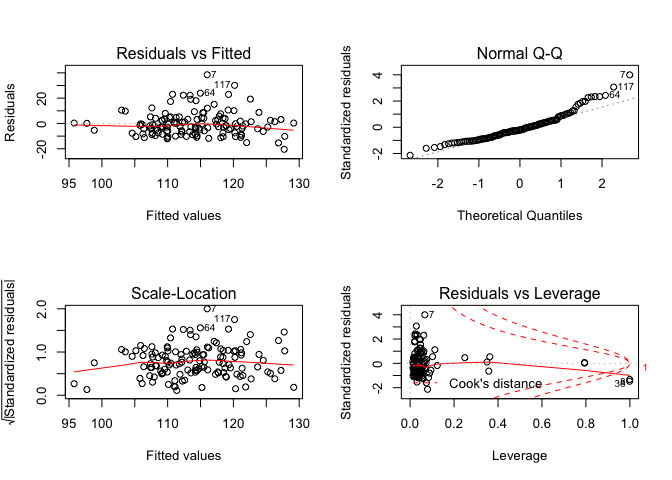<!-- -->

Model 2: BMI

Crude:

    ## 
    ## Call:
    ## lm(formula = bmi ~ fuel_used_for_cooking_percent_wood_dung + 
    ##     percent_public_source + percent_private_toilet + percent_employed + 
    ##     percent_without_hs_education + percent_caste, data = total)
    ## 
    ## Residuals:
    ##     Min      1Q  Median      3Q     Max 
    ## -3.2216 -0.9122  0.1088  0.9730  3.2519 
    ## 
    ## Coefficients:
    ##                                          Estimate Std. Error t value
    ## (Intercept)                             29.372806   0.871821  33.691
    ## fuel_used_for_cooking_percent_wood_dung  4.650046   2.907378   1.599
    ## percent_public_source                   -0.014349   0.012885  -1.114
    ## percent_private_toilet                   0.006950   0.003288   2.114
    ## percent_employed                        -5.941757   1.773671  -3.350
    ## percent_without_hs_education            -7.539730   0.843666  -8.937
    ## percent_caste                            0.006112   0.014875   0.411
    ##                                         Pr(>|t|)    
    ## (Intercept)                              < 2e-16 ***
    ## fuel_used_for_cooking_percent_wood_dung  0.11222    
    ## percent_public_source                    0.26752    
    ## percent_private_toilet                   0.03647 *  
    ## percent_employed                         0.00106 ** 
    ## percent_without_hs_education            3.94e-15 ***
    ## percent_caste                            0.68185    
    ## ---
    ## Signif. codes:  0 '***' 0.001 '**' 0.01 '*' 0.05 '.' 0.1 ' ' 1
    ## 
    ## Residual standard error: 1.465 on 127 degrees of freedom
    ## Multiple R-squared:  0.5966, Adjusted R-squared:  0.5775 
    ## F-statistic:  31.3 on 6 and 127 DF,  p-value: < 2.2e-16

    ##                                             Estimate  Std. Error
    ## (Intercept)                             29.372805864 0.871820727
    ## fuel_used_for_cooking_percent_wood_dung  4.650045739 2.907378010
    ## percent_public_source                   -0.014349199 0.012884605
    ## percent_private_toilet                   0.006950240 0.003287663
    ## percent_employed                        -5.941757261 1.773671068
    ## percent_without_hs_education            -7.539729813 0.843665813
    ## percent_caste                            0.006112094 0.014875423
    ##                                            t value     Pr(>|t|)
    ## (Intercept)                             33.6913369 3.497712e-65
    ## fuel_used_for_cooking_percent_wood_dung  1.5993950 1.122177e-01
    ## percent_public_source                   -1.1136701 2.675241e-01
    ## percent_private_toilet                   2.1140369 3.646757e-02
    ## percent_employed                        -3.3499770 1.064452e-03
    ## percent_without_hs_education            -8.9368678 3.941916e-15
    ## percent_caste                            0.4108854 6.818490e-01

    ##                             (Intercept) 
    ##                            29.372805864 
    ## fuel_used_for_cooking_percent_wood_dung 
    ##                             4.650045739 
    ##                   percent_public_source 
    ##                            -0.014349199 
    ##                  percent_private_toilet 
    ##                             0.006950240 
    ##                        percent_employed 
    ##                            -5.941757261 
    ##            percent_without_hs_education 
    ##                            -7.539729813 
    ##                           percent_caste 
    ##                             0.006112094

    ##        1        2        3        4        5        6        7        8 
    ## 26.65537 25.73986 24.56446 25.72230 25.31174 24.20289 22.87703 24.80557 
    ##        9       10       11       12       13       14       15       16 
    ## 23.33517 24.21287 22.86258 25.05526 24.40507 25.09293 26.91137 21.53903 
    ##       17       18       19       20       21       22       23       24 
    ## 25.22158 24.22949 22.91016 25.13495 20.90412 24.98058 23.37974 24.30462 
    ##       25       26       27       28       29       30       31       32 
    ## 24.66254 23.82928 25.96889 25.47413 21.98021 24.58968 25.08688 25.89220 
    ##       33       34       35       36       37       38       39       40 
    ## 26.33089 24.85747 25.13864 27.25716 26.90705 26.22021 26.13917 22.35177 
    ##       41       42       43       44       45       46       47       48 
    ## 28.26748 27.43980 27.42705 26.38750 26.92907 25.76182 26.52898 27.23842 
    ##       49       50       51       52       53       54       55       56 
    ## 27.40984 26.68728 26.93883 26.80945 27.62122 25.81083 25.94355 24.97843 
    ##       57       58       59       60       61       62       63       64 
    ## 25.69730 24.86552 23.49884 24.59443 21.40742 24.78364 26.90287 25.74809 
    ##       65       66       67       68       69       70       71       72 
    ## 24.59194 23.51432 23.43392 23.95520 23.76582 22.27641 26.82687 26.23397 
    ##       73       74       75       76       77       78       79       80 
    ## 27.04500 20.97455 25.78781 25.15691 22.51648 22.51790 26.01149 26.44865 
    ##       81       82       83       84       85       86       87       88 
    ## 27.90694 27.83967 22.13478 20.04340 24.76968 24.52464 22.69694 24.15274 
    ##       89       90       91       92       93       94       95       96 
    ## 23.88911 23.66849 26.90357 27.13995 24.49135 23.02033 25.16927 25.69894 
    ##       97       98       99      100      101      102      103      104 
    ## 27.12595 26.01695 22.17716 27.35730 21.19828 27.51008 26.40045 25.69912 
    ##      105      106      107      108      109      110      111      112 
    ## 26.64838 27.49875 25.48828 26.78769 25.40460 26.55673 24.68278 24.84081 
    ##      113      114      115      116      117      118      119      120 
    ## 23.84690 22.39042 25.87543 26.02150 26.32537 27.19013 26.89785 26.50012 
    ##      121      122      123      124      125      126      127      128 
    ## 25.31043 26.72489 24.60322 23.92412 27.26072 24.76091 23.27359 24.40096 
    ##      129      130      131      132      133      134 
    ## 26.13969 25.38809 25.50864 25.35756 26.16364 21.91294

    ## # A tibble: 1 x 11
    ##   r.squared adj.r.squared sigma statistic  p.value    df logLik   AIC   BIC
    ##       <dbl>         <dbl> <dbl>     <dbl>    <dbl> <int>  <dbl> <dbl> <dbl>
    ## 1     0.597         0.577  1.46      31.3 7.12e-23     7  -238.  491.  515.
    ## # … with 2 more variables: deviance <dbl>, df.residual <int>

| term                                          | estimate | p.value |
| :-------------------------------------------- | -------: | ------: |
| (Intercept)                                   |   29.373 |   0.000 |
| fuel\_used\_for\_cooking\_percent\_wood\_dung |    4.650 |   0.112 |
| percent\_public\_source                       |  \-0.014 |   0.268 |
| percent\_private\_toilet                      |    0.007 |   0.036 |
| percent\_employed                             |  \-5.942 |   0.001 |
| percent\_without\_hs\_education               |  \-7.540 |   0.000 |
| percent\_caste                                |    0.006 |   0.682 |

| bmi | fuel\_used\_for\_cooking\_percent\_wood\_dung | percent\_public\_source | percent\_private\_toilet | percent\_employed | percent\_without\_hs\_education | percent\_caste |  .fitted |   .se.fit |      .resid |      .hat |   .sigma |      .cooksd |  .std.resid |
| --: | --------------------------------------------: | ----------------------: | -----------------------: | ----------------: | ------------------------------: | -------------: | -------: | --------: | ----------: | --------: | -------: | -----------: | ----------: |
|  26 |                                     0.0000000 |               0.0270270 |              100.0000000 |         0.5405405 |                       0.0270270 |      0.5675676 | 26.65537 | 0.2909517 | \-0.6553739 | 0.0394593 | 1.469285 |    0.0012232 | \-0.4565467 |
|  26 |                                     0.0000000 |               0.0789474 |                0.7368421 |         0.5789474 |                       0.0263158 |      0.2368421 | 25.73986 | 0.3005860 |   0.2601368 | 0.0421158 | 1.470301 |    0.0002068 |   0.1814677 |
|  25 |                                     0.0277778 |               0.0555556 |                0.4722222 |         0.4444444 |                       0.3055556 |      0.7500000 | 24.56446 | 0.1923059 |   0.4355446 | 0.0172382 | 1.469971 |    0.0002255 |   0.2999594 |
|  26 |                                     0.0000000 |               0.1538462 |                0.7692308 |         0.6153846 |                       0.0000000 |      0.4615385 | 25.72230 | 0.3592425 |   0.2777004 | 0.0601566 | 1.470270 |    0.0003497 |   0.1955702 |
|  24 |                                     0.0277778 |               0.1944444 |                0.8333333 |         0.3888889 |                       0.2500000 |      0.3888889 | 25.31174 | 0.2511128 | \-1.3117366 | 0.0293931 | 1.465700 |    0.0035749 | \-0.9090315 |
|  23 |                                     0.0000000 |               0.3076923 |                0.7435897 |         0.5128205 |                       0.2820513 |      0.4871795 | 24.20289 | 0.1590767 | \-1.2028911 | 0.0117956 | 1.466535 |    0.0011638 | \-0.8261462 |
|  24 |                                     0.0000000 |               0.1351351 |                0.5405405 |         0.6486486 |                       0.3513514 |      0.9189189 | 22.87703 | 0.3122101 |   1.1229669 | 0.0454362 | 1.466922 |    0.0041873 |   0.7847267 |
|  25 |                                     0.0526316 |               0.3947368 |                0.9473684 |         0.5789474 |                       0.2631579 |    100.0000000 | 24.80557 | 1.4643192 |   0.1944293 | 0.9994924 | 1.253533 | 9763.0375380 |   5.8916068 |
|  26 |                                     0.0000000 |               0.2777778 |                0.3611111 |         0.4166667 |                       0.4722222 |      0.0000000 | 23.33517 | 0.3003787 |   2.6648304 | 0.0420578 | 1.450349 |    0.0216729 |   1.8588909 |
|  26 |                                     0.0000000 |               0.1500000 |                0.8500000 |         0.4250000 |                       0.3500000 |      0.0750000 | 24.21287 | 0.2255079 |   1.7871327 | 0.0237045 | 1.461637 |    0.0052892 |   1.2348669 |
|  23 |                                     0.0000000 |               0.1071429 |                0.9285714 |         0.6666667 |                       0.3392857 |      0.6785714 | 22.86258 | 0.3384519 |   0.1374244 | 0.0533952 | 1.470438 |    0.0000749 |   0.0964347 |
|  24 |                                     0.0000000 |               0.0344828 |                0.9137931 |         0.4655172 |                       0.2068966 |      0.4137931 | 25.05526 | 0.1611877 | \-1.0552567 | 0.0121108 | 1.467447 |    0.0009202 | \-0.7248664 |
|  24 |                                     0.0000000 |               0.3818182 |                0.8000000 |         0.4909091 |                       0.2727273 |      0.8727273 | 24.40507 | 0.1551335 | \-0.4050689 | 0.0112181 | 1.470044 |    0.0001254 | \-0.2781202 |
|  22 |                                     0.0000000 |               0.1636364 |                0.8909091 |         0.4909091 |                       0.1818182 |      0.6545455 | 25.09293 | 0.1602273 | \-3.0929279 | 0.0119669 | 1.444128 |    0.0078089 | \-2.1244085 |
|  25 |                                     0.0000000 |               0.0000000 |              100.0000000 |         0.4545455 |                       0.0606061 |      0.2121212 | 26.91137 | 0.2479961 | \-1.9113743 | 0.0286680 | 1.460307 |    0.0073920 | \-1.3240850 |
|  22 |                                     0.0263158 |               0.8684211 |                0.1315789 |         0.7368421 |                       0.4736842 |      0.8157895 | 21.53903 | 0.4462411 |   0.4609729 | 0.0928212 | 1.469860 |    0.0015960 |   0.3304326 |
|  22 |                                     0.0000000 |               0.2702703 |                0.7837838 |         0.4594595 |                       0.1891892 |      0.5945946 | 25.22158 | 0.1667952 | \-3.2215775 | 0.0129681 | 1.441837 |    0.0091994 | \-2.2138947 |
|  23 |                                     0.1025641 |               0.0256410 |                0.9487179 |         0.5897436 |                       0.2820513 |      0.6923077 | 24.22949 | 0.3227934 | \-1.2294873 | 0.0485688 | 1.466198 |    0.0054008 | \-0.8605762 |
|  22 |                                     0.0000000 |               0.2105263 |                0.9473684 |         0.4210526 |                       0.5263158 |      0.6315789 | 22.91016 | 0.3315732 | \-0.9101583 | 0.0512468 | 1.468134 |    0.0031405 | \-0.6379612 |
|  25 |                                     0.0000000 |               0.0263158 |                0.8947368 |         0.4473684 |                       0.2105263 |      0.2894737 | 25.13495 | 0.1725573 | \-0.1349501 | 0.0138795 | 1.470442 |    0.0000173 | \-0.0927817 |
|  24 |                                     0.0540541 |               0.7837838 |                0.5675676 |         0.5405405 |                       0.7297297 |      0.1621622 | 20.90412 | 0.4057243 |   3.0958768 | 0.0767309 | 1.442206 |    0.0574501 |   2.1997509 |
|  26 |                                     0.0000000 |               0.1500000 |                0.9000000 |         0.5500000 |                       0.1500000 |      0.4250000 | 24.98058 | 0.2059082 |   1.0194196 | 0.0197631 | 1.467628 |    0.0014233 |   0.7029775 |
|  24 |                                     0.0000000 |               0.6923077 |                0.6666667 |         0.4871795 |                       0.4102564 |      0.0256410 | 23.37974 | 0.2108525 |   0.6202627 | 0.0207236 | 1.469431 |    0.0005536 |   0.4279342 |
|  24 |                                     0.0000000 |               0.8461538 |                0.6923077 |         0.4615385 |                       0.3076923 |      0.2307692 | 24.30462 | 0.1759630 | \-0.3046201 | 0.0144328 | 1.470238 |    0.0000918 | \-0.2094929 |
|  24 |                                     0.0000000 |               0.5365854 |                0.6585366 |         0.3902439 |                       0.3170732 |      0.3658537 | 24.66254 | 0.2557704 | \-0.6625388 | 0.0304936 | 1.469269 |    0.0009483 | \-0.4593989 |
|  24 |                                     0.0769231 |               0.3333333 |                0.7179487 |         0.5384615 |                       0.3589744 |      0.7435897 | 23.82928 | 0.2375443 |   0.1707240 | 0.0263025 | 1.470411 |    0.0000538 |   0.1181236 |
|  23 |                                     0.0000000 |               0.4102564 |                0.7179487 |         0.4102564 |                       0.1282051 |      0.2051282 | 25.96889 | 0.2205326 | \-2.9688867 | 0.0226701 | 1.445949 |    0.0139306 | \-2.0503453 |
|  25 |                                     0.0000000 |               0.1538462 |                0.7948718 |         0.4615385 |                       0.1538462 |      0.0512821 | 25.47413 | 0.1743619 | \-0.4741283 | 0.0141713 | 1.469876 |    0.0002183 | \-0.3260237 |
|  23 |                                     0.0000000 |               0.9250000 |                0.8250000 |         0.4500000 |                       0.6250000 |      0.1750000 | 21.98021 | 0.3787117 |   1.0197855 | 0.0668537 | 1.467481 |    0.0053168 |   0.7207555 |
|  25 |                                     0.0000000 |               0.2307692 |                0.8974359 |         0.5128205 |                       0.2307692 |      0.1538462 | 24.58968 | 0.1576913 |   0.4103204 | 0.0115911 | 1.470032 |    0.0001330 |   0.2817791 |
|  23 |                                     0.0000000 |               0.1750000 |                0.7750000 |         0.5000000 |                       0.1750000 |      0.2500000 | 25.08688 | 0.1642235 | \-2.0868779 | 0.0125713 | 1.458541 |    0.0037391 | \-1.4338316 |
|  25 |                                     0.0000000 |               0.1025641 |                0.7948718 |         0.3589744 |                       0.1794872 |      0.2564103 | 25.89220 | 0.2789479 | \-0.8922026 | 0.0362705 | 1.468261 |    0.0020700 | \-0.6204973 |
|  25 |                                     0.0000000 |               0.0270270 |              100.0000000 |         0.5945946 |                       0.0270270 |      0.0270270 | 26.33089 | 0.3503664 | \-1.3308940 | 0.0572207 | 1.465413 |    0.0075933 | \-0.9358202 |
|  23 |                                     0.0263158 |               0.4736842 |                0.9210526 |         0.4473684 |                       0.2631579 |      0.8157895 | 24.85747 | 0.1800326 | \-1.8574722 | 0.0151081 | 1.461008 |    0.0035784 | \-1.2778564 |
|  24 |                                     0.0256410 |               0.2307692 |                0.9743590 |         0.5384615 |                       0.1538462 |      0.4102564 | 25.13864 | 0.1987809 | \-1.1386398 | 0.0184186 | 1.466923 |    0.0016504 | \-0.7846522 |
|  26 |                                     0.0000000 |               0.0188679 |              100.0000000 |         0.3773585 |                       0.0754717 |      0.1320755 | 27.25716 | 0.2887047 | \-1.2571576 | 0.0388522 | 1.466048 |    0.0044261 | \-0.8754848 |
|  27 |                                     0.0000000 |               0.0526316 |                0.9473684 |         0.3157895 |                       0.0789474 |      0.0000000 | 26.90705 | 0.3517531 |   0.0929511 | 0.0576745 | 1.470467 |    0.0000374 |   0.0653745 |
|  28 |                                     0.0000000 |               0.0000000 |                0.9750000 |         0.5000000 |                       0.0250000 |      0.0000000 | 26.22021 | 0.2399390 |   1.7797895 | 0.0268355 | 1.461682 |    0.0059770 |   1.2317697 |
|  27 |                                     0.0000000 |               0.0769231 |                0.8846154 |         0.4230769 |                       0.0961538 |      0.0192308 | 26.13917 | 0.2184379 |   0.8608265 | 0.0222415 | 1.468445 |    0.0011480 |   0.5943658 |
|  23 |                                     0.0000000 |               0.8285714 |                0.0285714 |         0.6000000 |                       0.4571429 |      0.4000000 | 22.35177 | 0.2804787 |   0.6482280 | 0.0366697 | 1.469314 |    0.0011057 |   0.4509145 |
|  26 |                                     0.0000000 |               0.0000000 |              100.0000000 |         0.3030303 |                       0.0000000 |      0.0303030 | 28.26748 | 0.3680794 | \-2.2674826 | 0.0631525 | 1.455606 |    0.0246349 | \-1.5994236 |
|  29 |                                     0.0000000 |               0.0000000 |              100.0000000 |         0.4000000 |                       0.0333333 |      0.0000000 | 27.43980 | 0.2686215 |   1.5601974 | 0.0336348 | 1.463678 |    0.0058382 |   1.0835848 |
|  29 |                                     0.0000000 |               0.0000000 |              100.0000000 |         0.4444444 |                       0.0000000 |      0.0000000 | 27.42705 | 0.2539650 |   1.5729512 | 0.0300646 | 1.463592 |    0.0052651 |   1.0904301 |
|  26 |                                     0.0000000 |               0.0263158 |              100.0000000 |         0.5526316 |                       0.0526316 |      0.0789474 | 26.38750 | 0.2989799 | \-0.3875042 | 0.0416670 | 1.470069 |    0.0004537 | \-0.2702540 |
|  27 |                                     0.0000000 |               0.0000000 |              100.0000000 |         0.3947368 |                       0.1052632 |      0.0526316 | 26.92907 | 0.2782265 |   0.0709347 | 0.0360832 | 1.470478 |    0.0000130 |   0.0493280 |
|  25 |                                     0.0000000 |               0.0000000 |                0.9666667 |         0.5666667 |                       0.0333333 |      0.1000000 | 25.76182 | 0.2830188 | \-0.7618155 | 0.0373369 | 1.468864 |    0.0015570 | \-0.5301108 |
|  28 |                                     0.0400000 |               0.0000000 |              100.0000000 |         0.5000000 |                       0.1000000 |      0.0000000 | 26.52898 | 0.2718899 |   1.4710199 | 0.0344583 | 1.464431 |    0.0053260 |   1.0220850 |
|  29 |                                     0.0000000 |               0.0000000 |              100.0000000 |         0.4761905 |                       0.0000000 |      0.0000000 | 27.23842 | 0.2566350 |   1.7615784 | 0.0307001 | 1.461827 |    0.0067521 |   1.2215939 |
|  28 |                                     0.0000000 |               0.0000000 |              100.0000000 |         0.4473684 |                       0.0000000 |      0.0263158 | 27.40984 | 0.2536902 |   0.5901639 | 0.0299996 | 1.469523 |    0.0007395 |   0.4091105 |
|  29 |                                     0.0000000 |               0.0000000 |                0.9855072 |         0.4347826 |                       0.0144928 |      0.0434783 | 26.68728 | 0.2502119 |   2.3127230 | 0.0291826 | 1.455548 |    0.0110282 |   1.6025398 |
|  30 |                                     0.0000000 |               0.0000000 |              100.0000000 |         0.4615385 |                       0.0512821 |      0.0000000 | 26.93883 | 0.2481193 |   3.0611725 | 0.0286965 | 1.444222 |    0.0189804 |   2.1206271 |
|  27 |                                     0.0000000 |               0.0000000 |              100.0000000 |         0.5483871 |                       0.0000000 |      0.0000000 | 26.80945 | 0.3042528 |   0.1905532 | 0.0431496 | 1.470389 |    0.0001140 |   0.1329989 |
|  27 |                                     0.0000000 |               0.0000000 |              100.0000000 |         0.4117647 |                       0.0000000 |      0.0000000 | 27.62122 | 0.2640422 | \-0.6212239 | 0.0324978 | 1.469415 |    0.0008922 | \-0.4311975 |
|  26 |                                     0.0000000 |               0.1304348 |                0.8695652 |         0.4347826 |                       0.1304348 |      0.1086957 | 25.81083 | 0.1973986 |   0.1891735 | 0.0181633 | 1.470393 |    0.0000449 |   0.1303451 |
|  27 |                                     0.0000000 |               0.0000000 |              100.0000000 |         0.5641026 |                       0.1025641 |      0.1282051 | 25.94355 | 0.3072835 |   1.0564527 | 0.0440136 | 1.467338 |    0.0035793 |   0.7376973 |
|  23 |                                     0.0000000 |               0.1315789 |                0.9736842 |         0.4736842 |                       0.2105263 |      0.4210526 | 24.97843 | 0.1574128 | \-1.9784305 | 0.0115502 | 1.459766 |    0.0030813 | \-1.3586183 |
|  24 |                                     0.0000000 |               0.0500000 |                0.9500000 |         0.5250000 |                       0.0750000 |      0.5750000 | 25.69730 | 0.2213967 | \-1.6973033 | 0.0228481 | 1.462514 |    0.0045904 | \-1.1722828 |
|  24 |                                     0.0000000 |               0.0243902 |                0.8536585 |         0.5121951 |                       0.1951220 |      0.2682927 | 24.86552 | 0.1629175 | \-0.8655230 | 0.0123721 | 1.468443 |    0.0006327 | \-0.5946151 |
|  21 |                                     0.0000000 |               0.4594595 |                0.4324324 |         0.4054054 |                       0.4594595 |      0.4324324 | 23.49884 | 0.3046449 | \-2.4988409 | 0.0432609 | 1.452773 |    0.0196515 | \-1.7441982 |
|  24 |                                     0.0000000 |               0.0512821 |                0.8717949 |         0.5128205 |                       0.2307692 |      0.5384615 | 24.59443 | 0.1571287 | \-0.5944277 | 0.0115085 | 1.469527 |    0.0002771 | \-0.4081939 |
|  24 |                                     0.2549020 |               0.3421053 |                0.7894737 |         0.6052632 |                       0.7368421 |      0.1052632 | 21.40742 | 0.7192531 |   2.5925840 | 0.2411412 | 1.446392 |    0.1874240 |   2.0319188 |
|  27 |                                     0.0000000 |               0.1538462 |                0.8974359 |         0.5128205 |                       0.2051282 |      0.0769231 | 24.78364 | 0.1613646 |   2.2163604 | 0.0121374 | 1.457011 |    0.0040684 |   1.5224607 |
|  28 |                                     0.0000000 |               0.0000000 |                0.8333333 |         0.4166667 |                       0.0000000 |      0.0000000 | 26.90287 | 0.2686492 |   1.0971345 | 0.0336418 | 1.467127 |    0.0028876 |   0.7619821 |
|  29 |                                     0.0000000 |               0.0000000 |                0.9729730 |         0.4054054 |                       0.1621622 |      0.0000000 | 25.74809 | 0.2186711 |   3.2519111 | 0.0222890 | 1.441008 |    0.0164194 |   2.2453674 |
|  26 |                                     0.0000000 |               0.2666667 |                0.8000000 |         0.4666667 |                       0.2666667 |      0.1333333 | 24.59194 | 0.1628526 |   1.4080601 | 0.0123622 | 1.465064 |    0.0016732 |   0.9673338 |
|  21 |                                     0.0256410 |               0.0512821 |                0.8974359 |         0.4871795 |                       0.4102564 |      0.7692308 | 23.51432 | 0.2010488 | \-2.5143162 | 0.0188413 | 1.453000 |    0.0082391 | \-1.7330227 |
|  23 |                                     0.0500000 |               0.2500000 |                0.7000000 |         0.5000000 |                       0.4250000 |      0.4250000 | 23.43392 | 0.2172842 | \-0.4339199 | 0.0220072 | 1.469972 |    0.0002885 | \-0.2995682 |
|  22 |                                     0.0000000 |               0.2500000 |                0.6500000 |         0.5000000 |                       0.3250000 |      0.4500000 | 23.95520 | 0.1680205 | \-1.9551958 | 0.0131593 | 1.460001 |    0.0034398 | \-1.3437570 |
|  24 |                                     0.0000000 |               0.1351351 |                0.8918919 |         0.5675676 |                       0.2972973 |      0.4324324 | 23.76582 | 0.2013135 |   0.2341813 | 0.0188910 | 1.470341 |    0.0000717 |   0.1614164 |
|  21 |                                     0.0000000 |               0.2500000 |                0.8888889 |         0.6666667 |                       0.4166667 |      0.6111111 | 22.27641 | 0.3490038 | \-1.2764061 | 0.0567765 | 1.465823 |    0.0069235 | \-0.8972956 |
|  26 |                                     0.0000000 |               0.0000000 |              100.0000000 |         0.5454545 |                       0.0000000 |      0.0000000 | 26.82687 | 0.3014066 | \-0.8268713 | 0.0423461 | 1.468564 |    0.0021022 | \-0.5768829 |
|  27 |                                     0.0000000 |               0.0000000 |                0.9607843 |         0.5294118 |                       0.0000000 |      0.0196078 | 26.23397 | 0.2720650 |   0.7660328 | 0.0345027 | 1.468851 |    0.0014463 |   0.5322624 |
|  27 |                                     0.0000000 |               0.0000000 |                0.9285714 |         0.3928571 |                       0.0000000 |      0.0000000 | 27.04500 | 0.2861340 | \-0.0449979 | 0.0381634 | 1.470486 |    0.0000056 | \-0.0313253 |
|  23 |                                     0.0975610 |               0.3414634 |                0.2439024 |         0.5609756 |                       0.7317073 |      0.2195122 | 20.97455 | 0.4301286 |   2.0254504 | 0.0862392 | 1.458326 |    0.0282158 |   1.4466362 |
|  26 |                                     0.0000000 |               0.0000000 |                0.9333333 |         0.5833333 |                       0.0166667 |      0.0333333 | 25.78781 | 0.3112155 |   0.2121907 | 0.0451472 | 1.470365 |    0.0001485 |   0.1482560 |
|  27 |                                     0.0000000 |               0.0750000 |                0.9000000 |         0.4250000 |                       0.2250000 |      0.1000000 | 25.15691 | 0.1936649 |   1.8430899 | 0.0174827 | 1.461132 |    0.0040967 |   1.2694933 |
|  23 |                                     0.0000000 |               0.5263158 |                0.5789474 |         0.5526316 |                       0.4736842 |      0.3684211 | 22.51648 | 0.2544334 |   0.4835244 | 0.0301756 | 1.469841 |    0.0004995 |   0.3352168 |
|  23 |                                     0.0000000 |               0.6000000 |                0.3500000 |         0.5500000 |                       0.4750000 |      0.1000000 | 22.51790 | 0.2541991 |   0.4820980 | 0.0301201 | 1.469845 |    0.0004956 |   0.3342184 |
|  29 |                                     0.0000000 |               0.0263158 |                0.9736842 |         0.5000000 |                       0.0526316 |      0.0000000 | 26.01149 | 0.2225662 |   2.9885109 | 0.0230901 | 1.445610 |    0.0143892 |   2.0643417 |
|  28 |                                     0.0256410 |               0.0000000 |              100.0000000 |         0.5641026 |                       0.0512821 |      0.0000000 | 26.44865 | 0.3125785 |   1.5513515 | 0.0455435 | 1.463671 |    0.0080121 |   1.0841419 |
|  29 |                                     0.0000000 |               0.0303030 |              100.0000000 |         0.3636364 |                       0.0000000 |      0.0303030 | 27.90694 | 0.2994300 |   1.0930588 | 0.0417925 | 1.467123 |    0.0036214 |   0.7623734 |
|  28 |                                     0.0000000 |               0.0000000 |              100.0000000 |         0.3750000 |                       0.0000000 |      0.0000000 | 27.83967 | 0.2891758 |   0.1603291 | 0.0389791 | 1.470420 |    0.0000722 |   0.1116606 |
|  19 |                                     0.0000000 |               0.9750000 |                0.0000000 |         0.5500000 |                       0.5250000 |      0.3750000 | 22.13478 | 0.2844698 | \-3.1347828 | 0.0377207 | 1.442670 |    0.0266565 | \-2.1817796 |
|  21 |                                     0.0000000 |             100.0000000 |                0.0000000 |         0.5405405 |                       0.6216216 |      0.6756757 | 20.04340 | 1.3044517 |   0.9566040 | 0.7931658 | 1.458504 |    1.1297796 |   1.4360681 |
|  24 |                                     0.0000000 |               0.2931034 |                0.6896552 |         0.5344828 |                       0.1896552 |      0.3275862 | 24.76968 | 0.1789007 | \-0.7696800 | 0.0149187 | 1.468868 |    0.0006065 | \-0.5294539 |
|  27 |                                     0.0000000 |               0.0000000 |                0.9148936 |         0.5744681 |                       0.1914894 |      0.4255319 | 24.52464 | 0.2194785 |   2.4753625 | 0.0224539 | 1.453478 |    0.0095875 |   1.7093231 |
|  22 |                                     0.0000000 |               0.1666667 |                0.8333333 |         0.6666667 |                       0.3611111 |      0.7500000 | 22.69694 | 0.3400737 | \-0.6969386 | 0.0539081 | 1.469106 |    0.0019480 | \-0.4891948 |
|  24 |                                     0.0000000 |               0.0000000 |                0.7068966 |         0.5517241 |                       0.2586207 |      0.5172414 | 24.15274 | 0.1836569 | \-0.1527394 | 0.0157225 | 1.470428 |    0.0000252 | \-0.1051105 |
|  22 |                                     0.0000000 |               0.0869565 |                0.7391304 |         0.5652174 |                       0.2826087 |      0.2608696 | 23.88911 | 0.1981931 | \-1.8891120 | 0.0183099 | 1.460649 |    0.0045150 | \-1.3017407 |
|  22 |                                     0.0000000 |               0.0000000 |                0.9743590 |         0.5384615 |                       0.3333333 |      0.2564103 | 23.66849 | 0.1830258 | \-1.6684941 | 0.0156147 | 1.462840 |    0.0029872 | \-1.1481433 |
|  28 |                                     0.0175439 |               0.0000000 |                0.9824561 |         0.3859649 |                       0.0350877 |      0.0350877 | 26.90357 | 0.2876553 |   1.0964334 | 0.0385703 | 1.467114 |    0.0033403 |   0.7634445 |
|  28 |                                     0.0000000 |               0.0000000 |              100.0000000 |         0.4531250 |                       0.0312500 |      0.0156250 | 27.13995 | 0.2493898 |   0.8600500 | 0.0289911 | 1.468435 |    0.0015145 |   0.5958900 |
|  24 |                                     0.0169492 |               0.1355932 |                0.7796610 |         0.4915254 |                       0.2711864 |      0.2372881 | 24.49135 | 0.1514679 | \-0.4913465 | 0.0106942 | 1.469833 |    0.0001757 | \-0.3372691 |
|  24 |                                     0.0000000 |               0.2131148 |                0.9672131 |         0.5081967 |                       0.4426230 |      0.1147541 | 23.02033 | 0.2265692 |   0.9796674 | 0.0239282 | 1.467836 |    0.0016051 |   0.6770048 |
|  26 |                                     0.0000000 |               0.0800000 |                0.9800000 |         0.4800000 |                       0.1800000 |      0.0000000 | 25.16927 | 0.1616379 |   0.8307257 | 0.0121785 | 1.468605 |    0.0005735 |   0.5706534 |
|  24 |                                     0.0000000 |               0.0526316 |                0.8684211 |         0.5526316 |                       0.0526316 |      0.2105263 | 25.69894 | 0.2576707 | \-1.6989426 | 0.0309484 | 1.462432 |    0.0063345 | \-1.1783091 |
|  26 |                                     0.0000000 |               0.0000000 |              100.0000000 |         0.4000000 |                       0.0750000 |      0.0500000 | 27.12595 | 0.2702600 | \-1.1259528 | 0.0340464 | 1.466946 |    0.0030804 | \-0.7821608 |
|  25 |                                     0.0000000 |               0.0285714 |                0.9142857 |         0.4571429 |                       0.0857143 |      0.1142857 | 26.01695 | 0.2031062 | \-1.0169545 | 0.0192289 | 1.467643 |    0.0013767 | \-0.7010866 |
|  22 |                                     0.0540541 |               0.1081081 |                0.1351351 |         0.5675676 |                       0.5405405 |      0.2432432 | 22.17716 | 0.2860048 | \-0.1771560 | 0.0381289 | 1.470404 |    0.0000861 | \-0.1233251 |
|  27 |                                     0.0000000 |               0.0175439 |              100.0000000 |         0.4561404 |                       0.0000000 |      0.0000000 | 27.35730 | 0.2535117 | \-0.3573029 | 0.0299574 | 1.470137 |    0.0002706 | \-0.2476824 |
|  23 |                                     0.0416667 |               0.2708333 |                0.3125000 |         0.5625000 |                       0.6666667 |      0.3541667 | 21.19828 | 0.3626834 |   1.8017168 | 0.0613145 | 1.461130 |    0.0150420 |   1.2696396 |
|  28 |                                     0.0000000 |               0.0000000 |              100.0000000 |         0.3859649 |                       0.0350877 |      0.0175439 | 27.51008 | 0.2788993 |   0.4899247 | 0.0362579 | 1.469820 |    0.0006240 |   0.3407241 |
|  27 |                                     0.0000000 |               0.0000000 |              100.0000000 |         0.4871795 |                       0.1025641 |      0.1025641 | 26.40045 | 0.2534252 |   0.5995511 | 0.0299369 | 1.469491 |    0.0007615 |   0.4156045 |
|  25 |                                     0.0000000 |               0.0000000 |              100.0000000 |         0.4102564 |                       0.2564103 |      0.3589744 | 25.69912 | 0.3179423 | \-0.6991159 | 0.0471199 | 1.469107 |    0.0016890 | \-0.4889720 |
|  27 |                                     0.0000000 |               0.0000000 |              100.0000000 |         0.5333333 |                       0.0333333 |      0.1333333 | 26.64838 | 0.2837753 |   0.3516167 | 0.0375368 | 1.470145 |    0.0003336 |   0.2446986 |
|  27 |                                     0.0000000 |               0.0000000 |              100.0000000 |         0.4324324 |                       0.0000000 |      0.0540541 | 27.49875 | 0.2562040 | \-0.4987517 | 0.0305971 | 1.469799 |    0.0005393 | \-0.3458487 |
|  25 |                                     0.0000000 |               0.0697674 |                0.9302326 |         0.4186047 |                       0.1860465 |      0.0000000 | 25.48828 | 0.2013384 | \-0.4882824 | 0.0188956 | 1.469836 |    0.0003117 | \-0.3365639 |
|  27 |                                     0.0000000 |               0.0750000 |              100.0000000 |         0.4250000 |                       0.1000000 |      0.0250000 | 26.78769 | 0.2584821 |   0.2123134 | 0.0311436 | 1.470366 |    0.0000996 |   0.1472657 |
|  26 |                                     0.0161290 |               0.1774194 |                0.7903226 |         0.4354839 |                       0.1935484 |      0.1129032 | 25.40460 | 0.1878461 |   0.5953982 | 0.0164480 | 1.469519 |    0.0004014 |   0.4098858 |
|  29 |                                     0.0000000 |               0.0000000 |                0.9000000 |         0.4750000 |                       0.0000000 |      0.0000000 | 26.55673 | 0.2512902 |   2.4432736 | 0.0294347 | 1.453799 |    0.0124212 |   1.6932212 |
|  26 |                                     0.0000000 |               0.1621622 |                0.6756757 |         0.3783784 |                       0.3243243 |      0.1891892 | 24.68278 | 0.2746731 |   1.3172188 | 0.0351674 | 1.465631 |    0.0043648 |   0.9155581 |
|  23 |                                     0.0000000 |               0.0555556 |              100.0000000 |         0.5277778 |                       0.2777778 |      0.6666667 | 24.84081 | 0.3159500 | \-1.8408106 | 0.0465312 | 1.460870 |    0.0115494 | \-1.2870928 |
|  23 |                                     0.0000000 |               0.1282051 |              100.0000000 |         0.4615385 |                       0.4615385 |      0.5128205 | 23.84690 | 0.4163770 | \-0.8468998 | 0.0808130 | 1.468385 |    0.0045682 | \-0.6030927 |
|  22 |                                     0.0000000 |               0.6052632 |                0.7105263 |         0.4736842 |                       0.5526316 |      0.4210526 | 22.39042 | 0.3114745 | \-0.3904233 | 0.0452223 | 1.470061 |    0.0005035 | \-0.2727964 |
|  26 |                                     0.0000000 |               0.0476190 |                0.9523810 |         0.4285714 |                       0.1269841 |      0.0952381 | 25.87543 | 0.2032206 |   0.1245695 | 0.0192506 | 1.470449 |    0.0000207 |   0.0858789 |
|  27 |                                     0.0000000 |               0.0000000 |                0.9444444 |         0.3888889 |                       0.1388889 |      0.0000000 | 26.02150 | 0.2420010 |   0.9784981 | 0.0272987 | 1.467833 |    0.0018396 |   0.6773673 |
|  28 |                                     0.0000000 |               0.0000000 |                0.9473684 |         0.4473684 |                       0.0526316 |      0.1578947 | 26.32537 | 0.2235659 |   1.6746271 | 0.0232980 | 1.462723 |    0.0045608 |   1.1568873 |
|  28 |                                     0.0000000 |               0.0263158 |                0.9736842 |         0.3684211 |                       0.0000000 |      0.0000000 | 27.19013 | 0.3091937 |   0.8098729 | 0.0445625 | 1.468638 |    0.0021321 |   0.5656785 |
|  29 |                                     0.0000000 |               0.0000000 |              100.0000000 |         0.4358974 |                       0.0769231 |      0.0000000 | 26.89785 | 0.2519201 |   2.1021461 | 0.0295824 | 1.458151 |    0.0092438 |   1.4569262 |
|  28 |                                     0.0000000 |               0.0000000 |                0.9000000 |         0.4000000 |                       0.0666667 |      0.0666667 | 26.50012 | 0.2501544 |   1.4998830 | 0.0291692 | 1.464225 |    0.0046362 |   1.0392968 |
|  25 |                                     0.0000000 |               0.0810811 |                0.8918919 |         0.5135135 |                       0.1351351 |      0.4324324 | 25.31043 | 0.1838950 | \-0.3104293 | 0.0157633 | 1.470228 |    0.0001044 | \-0.2136323 |
|  24 |                                     0.0500000 |               0.0250000 |              100.0000000 |         0.4750000 |                       0.1000000 |      0.2000000 | 26.72489 | 0.2785765 | \-2.7248881 | 0.0361740 | 1.449554 |    0.0192534 | \-1.8949744 |
|  23 |                                     0.1724138 |               0.8275862 |                0.0000000 |         0.5862069 |                       0.2758621 |      0.5862069 | 24.60322 | 0.4873485 | \-1.6032211 | 0.1107101 | 1.462671 |    0.0239606 | \-1.1607153 |
|  23 |                                     0.0000000 |               0.2162162 |                0.7297297 |         0.5405405 |                       0.2972973 |      0.4324324 | 23.92412 | 0.1764180 | \-0.9241162 | 0.0145075 | 1.468151 |    0.0008495 | \-0.6355562 |
|  27 |                                     0.0270270 |               0.0000000 |              100.0000000 |         0.4594595 |                       0.0270270 |      0.1621622 | 27.26072 | 0.2610324 | \-0.2607249 | 0.0317612 | 1.470302 |    0.0001534 | \-0.1809028 |
|  23 |                                     0.0000000 |               0.3333333 |                0.6944444 |         0.3888889 |                       0.3055556 |      0.4166667 | 24.76091 | 0.2540737 | \-1.7609063 | 0.0300904 | 1.461839 |    0.0066046 | \-1.2207440 |
|  23 |                                     0.0256410 |               0.1538462 |                0.4102564 |         0.4615385 |                       0.4615385 |      0.5128205 | 23.27359 | 0.2458215 | \-0.2735912 | 0.0281675 | 1.470284 |    0.0001487 | \-0.1894787 |
|  25 |                                     0.0000000 |               0.0000000 |                0.9487179 |         0.5128205 |                       0.2564103 |      0.3076923 | 24.40096 | 0.1567362 |   0.5990387 | 0.0114511 | 1.469512 |    0.0002800 |   0.4113484 |
|  24 |                                     0.0000000 |               0.0000000 |                0.9117647 |         0.4705882 |                       0.0588235 |      0.0294118 | 26.13969 | 0.2148136 | \-2.1396880 | 0.0215096 | 1.457811 |    0.0068490 | \-1.4768152 |
|  26 |                                     0.0000000 |               0.0263158 |                0.9210526 |         0.6052632 |                       0.0526316 |      0.3947368 | 25.38809 | 0.3169431 |   0.6119122 | 0.0468242 | 1.469431 |    0.0012850 |   0.4279141 |
|  26 |                                     0.0000000 |               0.0000000 |                0.9714286 |         0.5428571 |                       0.0857143 |      0.1428571 | 25.50864 | 0.2298713 |   0.4913572 | 0.0246307 | 1.469824 |    0.0004162 |   0.3396775 |
|  25 |                                     0.0000000 |               0.0000000 |                0.9090909 |         0.4848485 |                       0.1515152 |      0.2727273 | 25.35756 | 0.1696772 | \-0.3575559 | 0.0134201 | 1.470142 |    0.0001174 | \-0.2457716 |
|  25 |                                     0.0000000 |               0.0000000 |              100.0000000 |         0.4705882 |                       0.1470588 |      0.1176471 | 26.16364 | 0.2571689 | \-1.1636441 | 0.0308280 | 1.466717 |    0.0029593 | \-0.8070003 |
|  21 |                                     0.5526316 |             100.0000000 |                0.0000000 |         0.5789474 |                       0.6842105 |      0.6578947 | 21.91294 | 1.3048395 | \-0.9129420 | 0.7936375 | 1.459552 |    1.0343243 | \-1.3720873 |

    ## Warning in sqrt(crit * p * (1 - hh)/hh): NaNs produced
    
    ## Warning in sqrt(crit * p * (1 - hh)/hh): NaNs produced

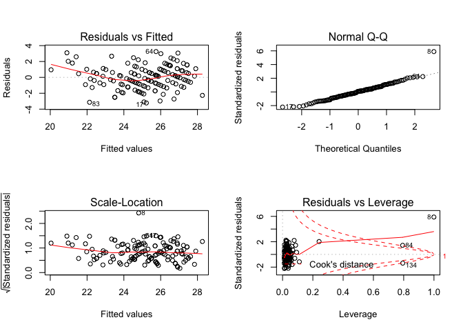<!-- -->

Age as a confounder:

    ## 
    ## Call:
    ## lm(formula = bmi ~ fuel_used_for_cooking_percent_wood_dung + 
    ##     percent_public_source + percent_private_toilet + percent_employed + 
    ##     percent_without_hs_education + percent_caste + median_age, 
    ##     data = total)
    ## 
    ## Residuals:
    ##     Min      1Q  Median      3Q     Max 
    ## -3.1828 -0.6472  0.0243  0.6988  3.3596 
    ## 
    ## Coefficients:
    ##                                          Estimate Std. Error t value
    ## (Intercept)                             19.330115   1.862418  10.379
    ## fuel_used_for_cooking_percent_wood_dung  3.288437   2.591229   1.269
    ## percent_public_source                   -0.015332   0.011440  -1.340
    ## percent_private_toilet                   0.001925   0.003039   0.633
    ## percent_employed                        -1.887484   1.716676  -1.099
    ## percent_without_hs_education            -4.956412   0.866503  -5.720
    ## percent_caste                            0.009539   0.013218   0.722
    ## median_age                               0.171751   0.028971   5.928
    ##                                         Pr(>|t|)    
    ## (Intercept)                              < 2e-16 ***
    ## fuel_used_for_cooking_percent_wood_dung    0.207    
    ## percent_public_source                      0.183    
    ## percent_private_toilet                     0.528    
    ## percent_employed                           0.274    
    ## percent_without_hs_education            7.33e-08 ***
    ## percent_caste                              0.472    
    ## median_age                              2.75e-08 ***
    ## ---
    ## Signif. codes:  0 '***' 0.001 '**' 0.01 '*' 0.05 '.' 0.1 ' ' 1
    ## 
    ## Residual standard error: 1.3 on 126 degrees of freedom
    ## Multiple R-squared:  0.6845, Adjusted R-squared:  0.667 
    ## F-statistic: 39.06 on 7 and 126 DF,  p-value: < 2.2e-16

    ##                                             Estimate  Std. Error
    ## (Intercept)                             19.330115186 1.862417726
    ## fuel_used_for_cooking_percent_wood_dung  3.288437265 2.591228557
    ## percent_public_source                   -0.015332053 0.011439532
    ## percent_private_toilet                   0.001925133 0.003039221
    ## percent_employed                        -1.887483664 1.716676096
    ## percent_without_hs_education            -4.956412465 0.866503134
    ## percent_caste                            0.009538560 0.013218324
    ## median_age                               0.171751056 0.028970693
    ##                                            t value     Pr(>|t|)
    ## (Intercept)                             10.3790438 1.288772e-18
    ## fuel_used_for_cooking_percent_wood_dung  1.2690649 2.067572e-01
    ## percent_public_source                   -1.3402693 1.825696e-01
    ## percent_private_toilet                   0.6334298 5.276011e-01
    ## percent_employed                        -1.0994990 2.736468e-01
    ## percent_without_hs_education            -5.7200168 7.334748e-08
    ## percent_caste                            0.7216164 4.718673e-01
    ## median_age                               5.9284414 2.745263e-08

    ##                             (Intercept) 
    ##                            19.330115186 
    ## fuel_used_for_cooking_percent_wood_dung 
    ##                             3.288437265 
    ##                   percent_public_source 
    ##                            -0.015332053 
    ##                  percent_private_toilet 
    ##                             0.001925133 
    ##                        percent_employed 
    ##                            -1.887483664 
    ##            percent_without_hs_education 
    ##                            -4.956412465 
    ##                           percent_caste 
    ##                             0.009538560 
    ##                              median_age 
    ##                             0.171751056

    ##        1        2        3        4        5        6        7        8 
    ## 25.77263 25.47661 24.86138 26.25762 26.46760 23.55377 23.92914 24.85347 
    ##        9       10       11       12       13       14       15       16 
    ## 24.39591 23.40136 23.26681 24.01101 23.99766 23.76268 27.15685 22.20840 
    ##       17       18       19       20       21       22       23       24 
    ## 25.18276 23.64684 23.69632 24.52429 21.51326 24.76986 23.32621 24.71934 
    ##       25       26       27       28       29       30       31       32 
    ## 24.21950 23.83267 25.57131 25.45573 22.37951 24.48003 23.92222 25.48534 
    ##       33       34       35       36       37       38       39       40 
    ## 25.53547 25.04874 25.05835 26.56466 27.24773 26.65438 26.00909 22.71944 
    ##       41       42       43       44       45       46       47       48 
    ## 29.05304 27.44188 26.97233 26.30489 27.29135 25.97007 27.15958 27.18684 
    ##       49       50       51       52       53       54       55       56 
    ## 27.59145 27.21668 28.48218 27.34105 28.69689 26.37657 26.13316 23.64730 
    ##       57       58       59       60       61       62       63       64 
    ## 24.19998 24.15283 21.84194 23.68049 22.07844 24.62518 28.17764 25.64039 
    ##       65       66       67       68       69       70       71       72 
    ## 23.76734 23.55120 23.22147 23.51419 23.58485 22.59412 26.85815 26.76217 
    ##       73       74       75       76       77       78       79       80 
    ## 26.96326 21.24637 25.57110 25.73132 22.91885 23.12650 27.62753 27.50534 
    ##       81       82       83       84       85       86       87       88 
    ## 28.28761 27.13044 21.92166 20.18684 24.00846 24.14334 23.12960 24.34520 
    ##       89       90       91       92       93       94       95       96 
    ## 23.46261 23.72537 26.74372 26.17701 23.91877 23.57896 25.59462 24.92168 
    ##       97       98       99      100      101      102      103      104 
    ## 26.58032 26.41648 22.90229 27.82447 21.16236 27.42790 26.85061 26.09921 
    ##      105      106      107      108      109      110      111      112 
    ## 27.58079 26.98812 24.29293 26.78569 24.90949 27.52092 24.32009 24.72654 
    ##      113      114      115      116      117      118      119      120 
    ## 22.59831 22.53148 25.57082 26.50185 26.73438 28.53448 27.44785 27.88802 
    ##      121      122      123      124      125      126      127      128 
    ## 24.57036 25.45410 23.74142 23.04015 27.06945 25.23524 23.31844 24.80284 
    ##      129      130      131      132      133      134 
    ## 26.78033 25.11839 25.88257 25.05365 24.94843 21.77151

    ## # A tibble: 1 x 11
    ##   r.squared adj.r.squared sigma statistic  p.value    df logLik   AIC   BIC
    ##       <dbl>         <dbl> <dbl>     <dbl>    <dbl> <int>  <dbl> <dbl> <dbl>
    ## 1     0.685         0.667  1.30      39.1 1.09e-28     8  -221.  460.  486.
    ## # … with 2 more variables: deviance <dbl>, df.residual <int>

| term                                          | estimate | p.value |
| :-------------------------------------------- | -------: | ------: |
| (Intercept)                                   |   19.330 |   0.000 |
| fuel\_used\_for\_cooking\_percent\_wood\_dung |    3.288 |   0.207 |
| percent\_public\_source                       |  \-0.015 |   0.183 |
| percent\_private\_toilet                      |    0.002 |   0.528 |
| percent\_employed                             |  \-1.887 |   0.274 |
| percent\_without\_hs\_education               |  \-4.956 |   0.000 |
| percent\_caste                                |    0.010 |   0.472 |
| median\_age                                   |    0.172 |   0.000 |

| bmi | fuel\_used\_for\_cooking\_percent\_wood\_dung | percent\_public\_source | percent\_private\_toilet | percent\_employed | percent\_without\_hs\_education | percent\_caste | median\_age |  .fitted |   .se.fit |      .resid |      .hat |   .sigma |      .cooksd |  .std.resid |
| --: | --------------------------------------------: | ----------------------: | -----------------------: | ----------------: | ------------------------------: | -------------: | ----------: | -------: | --------: | ----------: | --------: | -------: | -----------: | ----------: |
|  26 |                                     0.0000000 |               0.0270270 |              100.0000000 |         0.5405405 |                       0.0270270 |      0.5675676 |    43.08108 | 25.77263 | 0.2981382 |   0.2273695 | 0.0525727 | 1.305306 |    0.0002239 |   0.1796477 |
|  26 |                                     0.0000000 |               0.0789474 |                0.7368421 |         0.5789474 |                       0.0263158 |      0.2368421 |    42.89474 | 25.47661 | 0.2705151 |   0.5233868 | 0.0432821 | 1.304595 |    0.0009577 |   0.4115222 |
|  25 |                                     0.0277778 |               0.0555556 |                0.4722222 |         0.4444444 |                       0.3055556 |      0.7500000 |    45.33333 | 24.86138 | 0.1779150 |   0.1386212 | 0.0187219 | 1.305413 |    0.0000276 |   0.1076208 |
|  26 |                                     0.0000000 |               0.1538462 |                0.7692308 |         0.6153846 |                       0.0000000 |      0.4615385 |    47.07692 | 26.25762 | 0.3314550 | \-0.2576226 | 0.0649792 | 1.305255 |    0.0003647 | \-0.2048970 |
|  24 |                                     0.0277778 |               0.1944444 |                0.8333333 |         0.3888889 |                       0.2500000 |      0.3888889 |    52.50000 | 26.46760 | 0.2961568 | \-2.4675991 | 0.0518762 | 1.285644 |    0.0259790 | \-1.9489672 |
|  23 |                                     0.0000000 |               0.3076923 |                0.7435897 |         0.5128205 |                       0.2820513 |      0.4871795 |    38.35897 | 23.55377 | 0.1786953 | \-0.5537677 | 0.0188865 | 1.304515 |    0.0004448 | \-0.4299623 |
|  24 |                                     0.0000000 |               0.1351351 |                0.5405405 |         0.6486486 |                       0.3513514 |      0.9189189 |    44.00000 | 23.92914 | 0.3291128 |   0.0708604 | 0.0640641 | 1.305456 |    0.0000271 |   0.0563304 |
|  25 |                                     0.0526316 |               0.3947368 |                0.9473684 |         0.5789474 |                       0.2631579 |    100.0000000 |    39.57895 | 24.85347 | 1.2999770 |   0.1465283 | 0.9995310 | 1.156742 | 7212.0834614 |   5.2033202 |
|  26 |                                     0.0000000 |               0.2777778 |                0.3611111 |         0.4166667 |                       0.4722222 |      0.0000000 |    47.72222 | 24.39591 | 0.3211269 |   1.6040861 | 0.0609928 | 1.297049 |    0.0131592 |   1.2730799 |
|  26 |                                     0.0000000 |               0.1500000 |                0.8500000 |         0.4250000 |                       0.3500000 |      0.0750000 |    38.47500 | 23.40136 | 0.2425181 |   2.5986359 | 0.0347867 | 1.283857 |    0.0186420 |   2.0342121 |
|  23 |                                     0.0000000 |               0.1071429 |                0.9285714 |         0.6666667 |                       0.3392857 |      0.6785714 |    40.00000 | 23.26681 | 0.3081011 | \-0.2668126 | 0.0561451 | 1.305242 |    0.0003317 | \-0.2112108 |
|  24 |                                     0.0000000 |               0.0344828 |                0.9137931 |         0.4655172 |                       0.2068966 |      0.4137931 |    38.31034 | 24.01101 | 0.2269401 | \-0.0110140 | 0.0304612 | 1.305472 |    0.0000003 | \-0.0086025 |
|  24 |                                     0.0000000 |               0.3818182 |                0.8000000 |         0.4909091 |                       0.2727273 |      0.8727273 |    40.41818 | 23.99766 | 0.1539136 |   0.0023405 | 0.0140113 | 1.305473 |    0.0000000 |   0.0018128 |
|  22 |                                     0.0000000 |               0.1636364 |                0.8909091 |         0.4909091 |                       0.1818182 |      0.6545455 |    36.41818 | 23.76268 | 0.2656713 | \-1.7626773 | 0.0417459 | 1.295500 |    0.0104432 | \-1.3848251 |
|  25 |                                     0.0000000 |               0.0000000 |              100.0000000 |         0.4545455 |                       0.0606061 |      0.2121212 |    51.18182 | 27.15685 | 0.2240188 | \-2.1568474 | 0.0296821 | 1.290699 |    0.0108428 | \-1.6839331 |
|  22 |                                     0.0263158 |               0.8684211 |                0.1315789 |         0.7368421 |                       0.4736842 |      0.8157895 |    38.05263 | 22.20840 | 0.4119275 | \-0.2084010 | 0.1003613 | 1.305325 |    0.0003982 | \-0.1689772 |
|  22 |                                     0.0000000 |               0.2702703 |                0.7837838 |         0.4594595 |                       0.1891892 |      0.5945946 |    44.56757 | 25.18276 | 0.1482175 | \-3.1827568 | 0.0129934 | 1.273638 |    0.0099891 | \-2.4638024 |
|  23 |                                     0.1025641 |               0.0256410 |                0.9487179 |         0.5897436 |                       0.2820513 |      0.6923077 |    37.74359 | 23.64684 | 0.3029455 | \-0.6468352 | 0.0542818 | 1.304116 |    0.0018774 | \-0.5115349 |
|  22 |                                     0.0000000 |               0.2105263 |                0.9473684 |         0.4210526 |                       0.5263158 |      0.6315789 |    45.21053 | 23.69632 | 0.3228465 | \-1.6963231 | 0.0616477 | 1.296043 |    0.0148949 | \-1.3467534 |
|  25 |                                     0.0000000 |               0.0263158 |                0.8947368 |         0.4473684 |                       0.2105263 |      0.2894737 |    41.21053 | 24.52429 | 0.1845985 |   0.4757091 | 0.0201549 | 1.304765 |    0.0003512 |   0.3695942 |
|  24 |                                     0.0540541 |               0.7837838 |                0.5675676 |         0.5405405 |                       0.7297297 |      0.1621622 |    38.72973 | 21.51326 | 0.3745512 |   2.4867400 | 0.0829750 | 1.284645 |    0.0451108 |   1.9971112 |
|  26 |                                     0.0000000 |               0.1500000 |                0.9000000 |         0.5500000 |                       0.1500000 |      0.4250000 |    42.02500 | 24.76986 | 0.1862189 |   1.2301379 | 0.0205103 | 1.300731 |    0.0023917 |   0.9559085 |
|  24 |                                     0.0000000 |               0.6923077 |                0.6666667 |         0.4871795 |                       0.4102564 |      0.0256410 |    40.51282 | 23.32621 | 0.1874024 |   0.6737949 | 0.0207718 | 1.304051 |    0.0007271 |   0.5236586 |
|  24 |                                     0.0000000 |               0.8461538 |                0.6923077 |         0.4615385 |                       0.3076923 |      0.2307692 |    45.38462 | 24.71934 | 0.1711593 | \-0.7193352 | 0.0173271 | 1.303858 |    0.0006864 | \-0.5580708 |
|  24 |                                     0.0000000 |               0.5365854 |                0.6585366 |         0.3902439 |                       0.3170732 |      0.3658537 |    41.92683 | 24.21950 | 0.2390425 | \-0.2194985 | 0.0337968 | 1.305320 |    0.0001290 | \-0.1717354 |
|  24 |                                     0.0769231 |               0.3333333 |                0.7179487 |         0.5384615 |                       0.3589744 |      0.7435897 |    41.00000 | 23.83267 | 0.2108811 |   0.1673329 | 0.0263027 | 1.305385 |    0.0000574 |   0.1304163 |
|  23 |                                     0.0000000 |               0.4102564 |                0.7179487 |         0.4102564 |                       0.1282051 |      0.2051282 |    44.56410 | 25.57131 | 0.2069459 | \-2.5713058 | 0.0253302 | 1.284520 |    0.0130336 | \-2.0030299 |
|  25 |                                     0.0000000 |               0.1538462 |                0.7948718 |         0.4615385 |                       0.1538462 |      0.0512821 |    45.17949 | 25.45573 | 0.1548212 | \-0.4557291 | 0.0141770 | 1.304827 |    0.0002240 | \-0.3529960 |
|  23 |                                     0.0000000 |               0.9250000 |                0.8250000 |         0.4500000 |                       0.6250000 |      0.1750000 |    40.80000 | 22.37951 | 0.3428820 |   0.6204918 | 0.0695367 | 1.304204 |    0.0022862 |   0.4947080 |
|  25 |                                     0.0000000 |               0.2307692 |                0.8974359 |         0.5128205 |                       0.2307692 |      0.1538462 |    42.28205 | 24.48003 | 0.1412072 |   0.5199687 | 0.0117934 | 1.304634 |    0.0002414 |   0.4022683 |
|  23 |                                     0.0000000 |               0.1750000 |                0.7750000 |         0.5000000 |                       0.1750000 |      0.2500000 |    37.27500 | 23.92222 | 0.2446397 | \-0.9222153 | 0.0353980 | 1.302768 |    0.0023921 | \-0.7221388 |
|  25 |                                     0.0000000 |               0.1025641 |                0.7948718 |         0.3589744 |                       0.1794872 |      0.2564103 |    44.94872 | 25.48534 | 0.2569704 | \-0.4853377 | 0.0390563 | 1.304722 |    0.0007366 | \-0.3807655 |
|  25 |                                     0.0000000 |               0.0270270 |              100.0000000 |         0.5945946 |                       0.0270270 |      0.0270270 |    42.32432 | 25.53547 | 0.3387425 | \-0.5354746 | 0.0678679 | 1.304530 |    0.0016559 | \-0.4265428 |
|  23 |                                     0.0263158 |               0.4736842 |                0.9210526 |         0.4473684 |                       0.2631579 |      0.8157895 |    45.28947 | 25.04874 | 0.1630481 | \-2.0487404 | 0.0157238 | 1.292340 |    0.0050365 | \-1.5881476 |
|  24 |                                     0.0256410 |               0.2307692 |                0.9743590 |         0.5384615 |                       0.1538462 |      0.4102564 |    43.20513 | 25.05835 | 0.1769870 | \-1.0583490 | 0.0185271 | 1.301971 |    0.0015927 | \-0.8215844 |
|  26 |                                     0.0000000 |               0.0188679 |              100.0000000 |         0.3773585 |                       0.0754717 |      0.1320755 |    47.32075 | 26.56466 | 0.2816613 | \-0.5646618 | 0.0469223 | 1.304447 |    0.0012177 | \-0.4448224 |
|  27 |                                     0.0000000 |               0.0526316 |                0.9473684 |         0.3157895 |                       0.0789474 |      0.0000000 |    51.84211 | 27.24773 | 0.3175128 | \-0.2477252 | 0.0596276 | 1.305273 |    0.0003059 | \-0.1964639 |
|  28 |                                     0.0000000 |               0.0000000 |                0.9750000 |         0.5000000 |                       0.0250000 |      0.0000000 |    48.85000 | 26.65438 | 0.2252444 |   1.3456208 | 0.0300077 | 1.299740 |    0.0042695 |   1.0507539 |
|  27 |                                     0.0000000 |               0.0769231 |                0.8846154 |         0.4230769 |                       0.0961538 |      0.0192308 |    46.30769 | 26.00909 | 0.1951561 |   0.9909116 | 0.0225263 | 1.302391 |    0.0017115 |   0.7708055 |
|  23 |                                     0.0000000 |               0.8285714 |                0.0285714 |         0.6000000 |                       0.4571429 |      0.4000000 |    39.57143 | 22.71944 | 0.2566026 |   0.2805622 | 0.0389446 | 1.305222 |    0.0002454 |   0.2200986 |
|  26 |                                     0.0000000 |               0.0000000 |              100.0000000 |         0.3030303 |                       0.0000000 |      0.0303030 |    58.81818 | 29.05304 | 0.3526074 | \-3.0530376 | 0.0735373 | 1.274273 |    0.0590407 | \-2.4393867 |
|  29 |                                     0.0000000 |               0.0000000 |              100.0000000 |         0.4000000 |                       0.0333333 |      0.0000000 |    51.46667 | 27.44188 | 0.2384694 |   1.5581244 | 0.0336349 | 1.297752 |    0.0064647 |   1.2189726 |
|  29 |                                     0.0000000 |               0.0000000 |              100.0000000 |         0.4444444 |                       0.0000000 |      0.0000000 |    48.25926 | 26.97233 | 0.2381479 |   2.0276744 | 0.0335443 | 1.292372 |    0.0109166 |   1.5862429 |
|  26 |                                     0.0000000 |               0.0263158 |              100.0000000 |         0.5526316 |                       0.0526316 |      0.0789474 |    47.07895 | 26.30489 | 0.2657855 | \-0.3048901 | 0.0417818 | 1.305176 |    0.0003127 | \-0.2395375 |
|  27 |                                     0.0000000 |               0.0000000 |              100.0000000 |         0.3947368 |                       0.1052632 |      0.0526316 |    52.60526 | 27.29135 | 0.2544435 | \-0.2913531 | 0.0382920 | 1.305202 |    0.0002598 | \-0.2284864 |
|  25 |                                     0.0000000 |               0.0000000 |                0.9666667 |         0.5666667 |                       0.0333333 |      0.1000000 |    45.83333 | 25.97007 | 0.2536941 | \-0.9700656 | 0.0380667 | 1.302472 |    0.0028622 | \-0.7606609 |
|  28 |                                     0.0400000 |               0.0000000 |              100.0000000 |         0.5000000 |                       0.1000000 |      0.0000000 |    52.08000 | 27.15958 | 0.2637689 |   0.8404221 | 0.0411502 | 1.303214 |    0.0023372 |   0.6600618 |
|  29 |                                     0.0000000 |               0.0000000 |              100.0000000 |         0.4761905 |                       0.0000000 |      0.0000000 |    49.85714 | 27.18684 | 0.2279942 |   1.8131563 | 0.0307449 | 1.295038 |    0.0079543 |   1.4163763 |
|  28 |                                     0.0000000 |               0.0000000 |              100.0000000 |         0.4473684 |                       0.0000000 |      0.0263158 |    51.89474 | 27.59145 | 0.2272880 |   0.4085452 | 0.0305547 | 1.304945 |    0.0004012 |   0.3191104 |
|  29 |                                     0.0000000 |               0.0000000 |                0.9855072 |         0.4347826 |                       0.0144928 |      0.0434783 |    51.10145 | 27.21668 | 0.2394038 |   1.7833221 | 0.0338990 | 1.295347 |    0.0085396 |   1.3953430 |
|  30 |                                     0.0000000 |               0.0000000 |              100.0000000 |         0.4615385 |                       0.0512821 |      0.0000000 |    58.71795 | 28.48218 | 0.3410128 |   1.5178231 | 0.0687806 | 1.297870 |    0.0135095 |   1.2096441 |
|  27 |                                     0.0000000 |               0.0000000 |              100.0000000 |         0.5483871 |                       0.0000000 |      0.0000000 |    51.54839 | 27.34105 | 0.2845965 | \-0.3410467 | 0.0479053 | 1.305098 |    0.0004545 | \-0.2688043 |
|  27 |                                     0.0000000 |               0.0000000 |              100.0000000 |         0.4117647 |                       0.0000000 |      0.0000000 |    57.94118 | 28.69689 | 0.2964222 | \-1.6968876 | 0.0519692 | 1.296133 |    0.0123096 | \-1.3403071 |
|  26 |                                     0.0000000 |               0.1304348 |                0.8695652 |         0.4347826 |                       0.1304348 |      0.1086957 |    49.56522 | 26.37657 | 0.1995396 | \-0.3765710 | 0.0235496 | 1.305028 |    0.0002589 | \-0.2930787 |
|  27 |                                     0.0000000 |               0.0000000 |              100.0000000 |         0.5641026 |                       0.1025641 |      0.1282051 |    47.64103 | 26.13316 | 0.2746601 |   0.8668365 | 0.0446186 | 1.303061 |    0.0027156 |   0.6820422 |
|  23 |                                     0.0000000 |               0.1315789 |                0.9736842 |         0.4736842 |                       0.2105263 |      0.4210526 |    36.39474 | 23.64730 | 0.2644684 | \-0.6472966 | 0.0413688 | 1.304133 |    0.0013945 | \-0.5084403 |
|  24 |                                     0.0000000 |               0.0500000 |                0.9500000 |         0.5250000 |                       0.0750000 |      0.5750000 |    36.25000 | 24.19998 | 0.3200310 | \-0.1999781 | 0.0605772 | 1.305342 |    0.0002029 | \-0.1586771 |
|  24 |                                     0.0000000 |               0.0243902 |                0.8536585 |         0.5121951 |                       0.1951220 |      0.2682927 |    39.31707 | 24.15283 | 0.1880688 | \-0.1528278 | 0.0209198 | 1.305400 |    0.0000377 | \-0.1187834 |
|  21 |                                     0.0000000 |               0.4594595 |                0.4324324 |         0.4054054 |                       0.4594595 |      0.4324324 |    32.35135 | 21.84194 | 0.3889134 | \-0.8419401 | 0.0894604 | 1.303085 |    0.0056550 | \-0.6785693 |
|  24 |                                     0.0000000 |               0.0512821 |                0.8717949 |         0.5128205 |                       0.2307692 |      0.5384615 |    37.58974 | 23.68049 | 0.2079024 |   0.3195063 | 0.0255649 | 1.305152 |    0.0002032 |   0.2489232 |
|  24 |                                     0.2549020 |               0.3421053 |                0.7894737 |         0.6052632 |                       0.7368421 |      0.1052632 |    39.05263 | 22.07844 | 0.6484726 |   1.9215640 | 0.2487185 | 1.290326 |    0.1202950 |   1.7049669 |
|  27 |                                     0.0000000 |               0.1538462 |                0.8974359 |         0.5128205 |                       0.2051282 |      0.0769231 |    42.38462 | 24.62518 | 0.1457240 |   2.3748200 | 0.0125599 | 1.287854 |    0.0053711 |   1.8379673 |
|  28 |                                     0.0000000 |               0.0000000 |                0.8333333 |         0.4166667 |                       0.0000000 |      0.0000000 |    56.08333 | 28.17764 | 0.3211166 | \-0.1776397 | 0.0609888 | 1.305370 |    0.0001614 | \-0.1409831 |
|  29 |                                     0.0000000 |               0.0000000 |                0.9729730 |         0.4054054 |                       0.1621622 |      0.0000000 |    45.86486 | 25.64039 | 0.1949738 |   3.3596114 | 0.0224842 | 1.269601 |    0.0196355 |   2.6133020 |
|  26 |                                     0.0000000 |               0.2666667 |                0.8000000 |         0.4666667 |                       0.2666667 |      0.1333333 |    38.66667 | 23.76734 | 0.2006183 |   2.2326563 | 0.0238049 | 1.289732 |    0.0092060 |   1.7378649 |
|  21 |                                     0.0256410 |               0.0512821 |                0.8974359 |         0.4871795 |                       0.4102564 |      0.7692308 |    41.23077 | 23.55120 | 0.1785898 | \-2.5511977 | 0.0188642 | 1.284986 |    0.0094298 | \-1.9808063 |
|  23 |                                     0.0500000 |               0.2500000 |                0.7000000 |         0.5000000 |                       0.4250000 |      0.4250000 |    39.45000 | 23.22147 | 0.1961950 | \-0.2214676 | 0.0227667 | 1.305319 |    0.0000864 | \-0.1722953 |
|  22 |                                     0.0000000 |               0.2500000 |                0.6500000 |         0.5000000 |                       0.3250000 |      0.4500000 |    39.22500 | 23.51419 | 0.1666811 | \-1.5141852 | 0.0164323 | 1.298311 |    0.0028793 | \-1.1741925 |
|  24 |                                     0.0000000 |               0.1351351 |                0.8918919 |         0.5675676 |                       0.2972973 |      0.4324324 |    39.56757 | 23.58485 | 0.1813045 |   0.4151459 | 0.0194421 | 1.304934 |    0.0002577 |   0.3224234 |
|  21 |                                     0.0000000 |               0.2500000 |                0.8888889 |         0.6666667 |                       0.4166667 |      0.6111111 |    38.33333 | 22.59412 | 0.3144294 | \-1.5941187 | 0.0584751 | 1.297176 |    0.0123932 | \-1.2634766 |
|  26 |                                     0.0000000 |               0.0000000 |              100.0000000 |         0.5454545 |                       0.0000000 |      0.0000000 |    48.70455 | 26.85815 | 0.2676262 | \-0.8581491 | 0.0423626 | 1.303114 |    0.0025150 | \-0.6744110 |
|  27 |                                     0.0000000 |               0.0000000 |                0.9607843 |         0.5294118 |                       0.0000000 |      0.0196078 |    49.07843 | 26.76217 | 0.2574354 |   0.2378318 | 0.0391978 | 1.305292 |    0.0001776 |   0.1866016 |
|  27 |                                     0.0000000 |               0.0000000 |                0.9285714 |         0.3928571 |                       0.0000000 |      0.0000000 |    48.75000 | 26.96326 | 0.2543899 |   0.0367446 | 0.0382758 | 1.305468 |    0.0000041 |   0.0288158 |
|  23 |                                     0.0975610 |               0.3414634 |                0.2439024 |         0.5609756 |                       0.7317073 |      0.2195122 |    36.58537 | 21.24637 | 0.3845902 |   1.7536340 | 0.0874825 | 1.295106 |    0.0238865 |   1.4118248 |
|  26 |                                     0.0000000 |               0.0000000 |                0.9333333 |         0.5833333 |                       0.0166667 |      0.0333333 |    43.21667 | 25.57110 | 0.2786898 |   0.4289009 | 0.0459375 | 1.304882 |    0.0006864 |   0.3377000 |
|  27 |                                     0.0000000 |               0.0750000 |                0.9000000 |         0.4250000 |                       0.2250000 |      0.1000000 |    48.42500 | 25.73132 | 0.1973488 |   1.2686767 | 0.0230353 | 1.300415 |    0.0028719 |   0.9871292 |
|  23 |                                     0.0000000 |               0.5263158 |                0.5789474 |         0.5526316 |                       0.4736842 |      0.3684211 |    40.65789 | 22.91885 | 0.2358508 |   0.0811466 | 0.0329003 | 1.305452 |    0.0000171 |   0.0634596 |
|  23 |                                     0.0000000 |               0.6000000 |                0.3500000 |         0.5500000 |                       0.4750000 |      0.1000000 |    41.90000 | 23.12650 | 0.2479185 | \-0.1265009 | 0.0363532 | 1.305422 |    0.0000463 | \-0.0991054 |
|  29 |                                     0.0000000 |               0.0263158 |                0.9736842 |         0.5000000 |                       0.0526316 |      0.0000000 |    55.31579 | 27.62753 | 0.3366672 |   1.3724742 | 0.0670388 | 1.299272 |    0.0107261 |   1.0927853 |
|  28 |                                     0.0256410 |               0.0000000 |              100.0000000 |         0.5641026 |                       0.0512821 |      0.0000000 |    53.66667 | 27.50534 | 0.3298061 |   0.4946553 | 0.0643342 | 1.304671 |    0.0013294 |   0.3932826 |
|  29 |                                     0.0000000 |               0.0303030 |              100.0000000 |         0.3636364 |                       0.0000000 |      0.0303030 |    55.03030 | 28.28761 | 0.2734647 |   0.7123921 | 0.0442311 | 1.303845 |    0.0018167 |   0.5604090 |
|  28 |                                     0.0000000 |               0.0000000 |              100.0000000 |         0.3750000 |                       0.0000000 |      0.0000000 |    48.41667 | 27.13044 | 0.2832230 |   0.8695643 | 0.0474441 | 1.303038 |    0.0029231 |   0.6852024 |
|  19 |                                     0.0000000 |               0.9750000 |                0.0000000 |         0.5500000 |                       0.5250000 |      0.3750000 |    36.35000 | 21.92166 | 0.2550844 | \-2.9216617 | 0.0384851 | 1.277982 |    0.0262709 | \-2.2914711 |
|  21 |                                     0.0000000 |             100.0000000 |                0.0000000 |         0.5405405 |                       0.6216216 |      0.6756757 |    37.75676 | 20.18684 | 1.1582821 |   0.8131569 | 0.7935121 | 1.295624 |    0.9098044 |   1.3762252 |
|  24 |                                     0.0000000 |               0.2931034 |                0.6896552 |         0.5344828 |                       0.1896552 |      0.3275862 |    38.58621 | 24.00846 | 0.2042316 | \-0.0084587 | 0.0246701 | 1.305473 |    0.0000001 | \-0.0065871 |
|  27 |                                     0.0000000 |               0.0000000 |                0.9148936 |         0.5744681 |                       0.1914894 |      0.4255319 |    39.82979 | 24.14334 | 0.2051832 |   2.8566559 | 0.0249005 | 1.279573 |    0.0158002 |   2.2248253 |
|  22 |                                     0.0000000 |               0.1666667 |                0.8333333 |         0.6666667 |                       0.3611111 |      0.7500000 |    39.83333 | 23.12960 | 0.3105968 | \-1.1295971 | 0.0570583 | 1.301320 |    0.0060538 | \-0.8946303 |
|  24 |                                     0.0000000 |               0.0000000 |                0.7068966 |         0.5517241 |                       0.2586207 |      0.5172414 |    42.68966 | 24.34520 | 0.1662424 | \-0.3452021 | 0.0163459 | 1.305101 |    0.0001488 | \-0.2676792 |
|  22 |                                     0.0000000 |               0.0869565 |                0.7391304 |         0.5652174 |                       0.2826087 |      0.2608696 |    38.41304 | 23.46261 | 0.1900860 | \-1.4626102 | 0.0213710 | 1.298758 |    0.0035292 | \-1.1370564 |
|  22 |                                     0.0000000 |               0.0000000 |                0.9743590 |         0.5384615 |                       0.3333333 |      0.2564103 |    41.10256 | 23.72537 | 0.1627645 | \-1.7253707 | 0.0156691 | 1.296173 |    0.0035593 | \-1.3374400 |
|  28 |                                     0.0175439 |               0.0000000 |                0.9824561 |         0.3859649 |                       0.0350877 |      0.0350877 |    48.07018 | 26.74372 | 0.2567859 |   1.2562752 | 0.0390002 | 1.300431 |    0.0049275 |   0.9855657 |
|  28 |                                     0.0000000 |               0.0000000 |              100.0000000 |         0.4531250 |                       0.0312500 |      0.0156250 |    44.62500 | 26.17701 | 0.2745881 |   1.8229855 | 0.0445952 | 1.294771 |    0.0120037 |   1.4343395 |
|  24 |                                     0.0169492 |               0.1355932 |                0.7796610 |         0.4915254 |                       0.2711864 |      0.2372881 |    39.61017 | 23.91877 | 0.1655570 |   0.0812328 | 0.0162114 | 1.305452 |    0.0000082 |   0.0629858 |
|  24 |                                     0.0000000 |               0.2131148 |                0.9672131 |         0.5081967 |                       0.4426230 |      0.1147541 |    43.09836 | 23.57896 | 0.2221151 |   0.4210416 | 0.0291797 | 1.304913 |    0.0004058 |   0.3286382 |
|  26 |                                     0.0000000 |               0.0800000 |                0.9800000 |         0.4800000 |                       0.1800000 |      0.0000000 |    46.94000 | 25.59462 | 0.1604316 |   0.4053766 | 0.0152231 | 1.304961 |    0.0001907 |   0.3141609 |
|  24 |                                     0.0000000 |               0.0526316 |                0.8684211 |         0.5526316 |                       0.0526316 |      0.2105263 |    40.13158 | 24.92168 | 0.2636560 | \-0.9216824 | 0.0411150 | 1.302755 |    0.0028084 | \-0.7238698 |
|  26 |                                     0.0000000 |               0.0000000 |              100.0000000 |         0.4000000 |                       0.0750000 |      0.0500000 |    47.65000 | 26.58032 | 0.2569712 | \-0.5803188 | 0.0390565 | 1.304399 |    0.0010531 | \-0.4552817 |
|  25 |                                     0.0000000 |               0.0285714 |                0.9142857 |         0.4571429 |                       0.0857143 |      0.1142857 |    48.74286 | 26.41648 | 0.1924903 | \-1.4164795 | 0.0219151 | 1.299172 |    0.0033982 | \-1.1014999 |
|  22 |                                     0.0540541 |               0.1081081 |                0.1351351 |         0.5675676 |                       0.5405405 |      0.2432432 |    41.59459 | 22.90229 | 0.2818275 | \-0.9022906 | 0.0469777 | 1.302853 |    0.0031132 | \-0.7108162 |
|  27 |                                     0.0000000 |               0.0175439 |              100.0000000 |         0.4561404 |                       0.0000000 |      0.0000000 |    53.35088 | 27.82447 | 0.2384525 | \-0.8244716 | 0.0336301 | 1.303316 |    0.0018098 | \-0.6450100 |
|  23 |                                     0.0416667 |               0.2708333 |                0.3125000 |         0.5625000 |                       0.6666667 |      0.3541667 |    35.29167 | 21.16236 | 0.3220298 |   1.8376427 | 0.0613362 | 1.294403 |    0.0173802 |   1.4587084 |
|  28 |                                     0.0000000 |               0.0000000 |              100.0000000 |         0.3859649 |                       0.0350877 |      0.0175439 |    51.28070 | 27.42790 | 0.2479811 |   0.5721012 | 0.0363716 | 1.304432 |    0.0009478 |   0.4482089 |
|  27 |                                     0.0000000 |               0.0000000 |              100.0000000 |         0.4871795 |                       0.1025641 |      0.1025641 |    50.97436 | 26.85061 | 0.2374473 |   0.1493865 | 0.0333472 | 1.305402 |    0.0000589 |   0.1168527 |
|  25 |                                     0.0000000 |               0.0000000 |              100.0000000 |         0.4102564 |                       0.2564103 |      0.3589744 |    50.17949 | 26.09921 | 0.2902097 | \-1.0992052 | 0.0498137 | 1.301571 |    0.0049286 | \-0.8672351 |
|  27 |                                     0.0000000 |               0.0000000 |              100.0000000 |         0.5333333 |                       0.0333333 |      0.1333333 |    53.73333 | 27.58079 | 0.2969856 | \-0.5807853 | 0.0521670 | 1.304382 |    0.0014481 | \-0.4587881 |
|  27 |                                     0.0000000 |               0.0000000 |              100.0000000 |         0.4324324 |                       0.0000000 |      0.0540541 |    48.21622 | 26.98812 | 0.2432083 |   0.0118790 | 0.0349850 | 1.305472 |    0.0000004 |   0.0092998 |
|  25 |                                     0.0000000 |               0.0697674 |                0.9302326 |         0.4186047 |                       0.1860465 |      0.0000000 |    38.86047 | 24.29293 | 0.2694480 |   0.7070704 | 0.0429413 | 1.303871 |    0.0017328 |   0.5558477 |
|  27 |                                     0.0000000 |               0.0750000 |              100.0000000 |         0.4250000 |                       0.1000000 |      0.0250000 |    49.85000 | 26.78569 | 0.2294682 |   0.2143146 | 0.0311437 | 1.305327 |    0.0001127 |   0.1674498 |
|  26 |                                     0.0161290 |               0.1774194 |                0.7903226 |         0.4354839 |                       0.1935484 |      0.1129032 |    42.54839 | 24.90949 | 0.1865043 |   1.0905112 | 0.0205732 | 1.301747 |    0.0018856 |   0.8474354 |
|  29 |                                     0.0000000 |               0.0000000 |                0.9000000 |         0.4750000 |                       0.0000000 |      0.0000000 |    52.90000 | 27.52092 | 0.2760755 |   1.4790761 | 0.0450797 | 1.298434 |    0.0079958 |   1.1640440 |
|  26 |                                     0.0000000 |               0.1621622 |                0.6756757 |         0.3783784 |                       0.3243243 |      0.1891892 |    42.56757 | 24.32009 | 0.2513989 |   1.6799092 | 0.0373811 | 1.296459 |    0.0084168 |   1.3168037 |
|  23 |                                     0.0000000 |               0.0555556 |              100.0000000 |         0.5277778 |                       0.2777778 |      0.6666667 |    44.08333 | 24.72654 | 0.2811466 | \-1.7265416 | 0.0467510 | 1.295856 |    0.0113388 | \-1.3599919 |
|  23 |                                     0.0000000 |               0.1282051 |              100.0000000 |         0.4615385 |                       0.4615385 |      0.5128205 |    36.28205 | 22.59831 | 0.4254288 |   0.4016863 | 0.1070480 | 1.304919 |    0.0016015 |   0.3269154 |
|  22 |                                     0.0000000 |               0.6052632 |                0.7105263 |         0.4736842 |                       0.5526316 |      0.4210526 |    39.81579 | 22.53148 | 0.2775338 | \-0.5314820 | 0.0455572 | 1.304566 |    0.0010444 | \-0.4183850 |
|  26 |                                     0.0000000 |               0.0476190 |                0.9523810 |         0.4285714 |                       0.1269841 |      0.0952381 |    44.69841 | 25.57082 | 0.1875836 |   0.4291807 | 0.0208120 | 1.304896 |    0.0002956 |   0.3335566 |
|  27 |                                     0.0000000 |               0.0000000 |                0.9444444 |         0.3888889 |                       0.1388889 |      0.0000000 |    50.02778 | 26.50184 | 0.2296076 |   0.4981550 | 0.0311815 | 1.304688 |    0.0006095 |   0.3892295 |
|  28 |                                     0.0000000 |               0.0000000 |                0.9473684 |         0.4473684 |                       0.0526316 |      0.1578947 |    49.52632 | 26.73438 | 0.2101199 |   1.2656223 | 0.0261132 | 1.300423 |    0.0032605 |   0.9863074 |
|  28 |                                     0.0000000 |               0.0263158 |                0.9736842 |         0.3684211 |                       0.0000000 |      0.0000000 |    57.63158 | 28.53448 | 0.3560407 | \-0.5344820 | 0.0749764 | 1.304526 |    0.0018506 | \-0.4273849 |
|  29 |                                     0.0000000 |               0.0000000 |              100.0000000 |         0.4358974 |                       0.0769231 |      0.0000000 |    53.15385 | 27.44785 | 0.2421210 |   1.5521541 | 0.0346729 | 1.297803 |    0.0066274 |   1.2149545 |
|  28 |                                     0.0000000 |               0.0000000 |                0.9000000 |         0.4000000 |                       0.0666667 |      0.0666667 |    56.13333 | 27.88802 | 0.3226835 |   0.1119780 | 0.0615855 | 1.305432 |    0.0000648 |   0.0888992 |
|  25 |                                     0.0000000 |               0.0810811 |                0.8918919 |         0.5135135 |                       0.1351351 |      0.4324324 |    40.02703 | 24.57036 | 0.2055112 |   0.4296358 | 0.0249802 | 1.304893 |    0.0003586 |   0.3346233 |
|  24 |                                     0.0500000 |               0.0250000 |              100.0000000 |         0.4750000 |                       0.1000000 |      0.2000000 |    41.67500 | 25.45410 | 0.3272739 | \-1.4541040 | 0.0633502 | 1.298537 |    0.0112881 | \-1.1554983 |
|  23 |                                     0.1724138 |               0.8275862 |                0.0000000 |         0.5862069 |                       0.2758621 |      0.5862069 |    36.82759 | 23.74142 | 0.4564128 | \-0.7414248 | 0.1232084 | 1.303550 |    0.0065135 | \-0.6089496 |
|  23 |                                     0.0000000 |               0.2162162 |                0.7297297 |         0.5405405 |                       0.2972973 |      0.4324324 |    36.10811 | 23.04015 | 0.2162433 | \-0.0401460 | 0.0276573 | 1.305468 |    0.0000035 | \-0.0313109 |
|  27 |                                     0.0270270 |               0.0000000 |              100.0000000 |         0.4594595 |                       0.0270270 |      0.1621622 |    49.24324 | 27.06945 | 0.2339672 | \-0.0694517 | 0.0323769 | 1.305457 |    0.0000123 | \-0.0542990 |
|  23 |                                     0.0000000 |               0.3333333 |                0.6944444 |         0.3888889 |                       0.3055556 |      0.4166667 |    47.47222 | 25.23524 | 0.2393247 | \-2.2352393 | 0.0338766 | 1.289530 |    0.0134066 | \-1.7489210 |
|  23 |                                     0.0256410 |               0.1538462 |                0.4102564 |         0.4615385 |                       0.4615385 |      0.5128205 |    41.10256 | 23.31844 | 0.2183596 | \-0.3184442 | 0.0282013 | 1.305153 |    0.0002239 | \-0.2484321 |
|  25 |                                     0.0000000 |               0.0000000 |                0.9487179 |         0.5128205 |                       0.2564103 |      0.3076923 |    44.87179 | 24.80284 | 0.1547771 |   0.1971606 | 0.0141690 | 1.305352 |    0.0000419 |   0.1527149 |
|  24 |                                     0.0000000 |               0.0000000 |                0.9117647 |         0.4705882 |                       0.0588235 |      0.0294118 |    50.23529 | 26.78033 | 0.2191908 | \-2.7803346 | 0.0284164 | 1.280862 |    0.0172043 | \-2.1692991 |
|  26 |                                     0.0000000 |               0.0263158 |                0.9210526 |         0.6052632 |                       0.0526316 |      0.3947368 |    41.84211 | 25.11839 | 0.2850208 |   0.8816123 | 0.0480483 | 1.302969 |    0.0030468 |   0.6949165 |
|  26 |                                     0.0000000 |               0.0000000 |                0.9714286 |         0.5428571 |                       0.0857143 |      0.1428571 |    46.57143 | 25.88257 | 0.2135937 |   0.1174293 | 0.0269837 | 1.305429 |    0.0000291 |   0.0915543 |
|  25 |                                     0.0000000 |               0.0000000 |                0.9090909 |         0.4848485 |                       0.1515152 |      0.2727273 |    43.00000 | 25.05365 | 0.1591152 | \-0.0536470 | 0.0149744 | 1.305464 |    0.0000033 | \-0.0415704 |
|  25 |                                     0.0000000 |               0.0000000 |              100.0000000 |         0.4705882 |                       0.1470588 |      0.1176471 |    41.00000 | 24.94843 | 0.3068203 |   0.0515678 | 0.0556792 | 1.305464 |    0.0000123 |   0.0408114 |
|  21 |                                     0.5526316 |             100.0000000 |                0.0000000 |         0.5789474 |                       0.6842105 |      0.6578947 |    38.63158 | 21.77151 | 1.1586192 | \-0.7715107 | 0.7939741 | 1.296590 |    0.8231546 | \-1.3072043 |

    ## Warning in sqrt(crit * p * (1 - hh)/hh): NaNs produced
    
    ## Warning in sqrt(crit * p * (1 - hh)/hh): NaNs produced

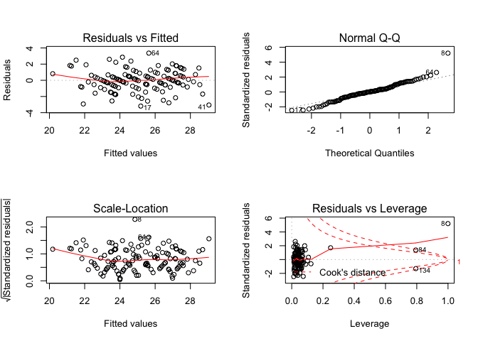<!-- -->

Gender as a confounder:

    ## 
    ## Call:
    ## lm(formula = bmi ~ fuel_used_for_cooking_percent_wood_dung + 
    ##     percent_public_source + percent_private_toilet + percent_employed + 
    ##     percent_without_hs_education + percent_caste + percent_female, 
    ##     data = total)
    ## 
    ## Residuals:
    ##     Min      1Q  Median      3Q     Max 
    ## -3.2001 -0.9070  0.0894  0.9371  3.2809 
    ## 
    ## Coefficients:
    ##                                          Estimate Std. Error t value
    ## (Intercept)                             29.145781   0.888526  32.802
    ## fuel_used_for_cooking_percent_wood_dung  4.610442   2.901037   1.589
    ## percent_public_source                   -0.014479   0.012856  -1.126
    ## percent_private_toilet                   0.007369   0.003297   2.235
    ## percent_employed                        -6.011034   1.770560  -3.395
    ## percent_without_hs_education            -7.397433   0.849397  -8.709
    ## percent_caste                            0.006399   0.014844   0.431
    ## percent_female                           0.309527   0.246955   1.253
    ##                                         Pr(>|t|)    
    ## (Intercept)                              < 2e-16 ***
    ## fuel_used_for_cooking_percent_wood_dung 0.114512    
    ## percent_public_source                   0.262207    
    ## percent_private_toilet                  0.027180 *  
    ## percent_employed                        0.000918 ***
    ## percent_without_hs_education            1.46e-14 ***
    ## percent_caste                           0.667146    
    ## percent_female                          0.212390    
    ## ---
    ## Signif. codes:  0 '***' 0.001 '**' 0.01 '*' 0.05 '.' 0.1 ' ' 1
    ## 
    ## Residual standard error: 1.461 on 126 degrees of freedom
    ## Multiple R-squared:  0.6015, Adjusted R-squared:  0.5794 
    ## F-statistic: 27.17 on 7 and 126 DF,  p-value: < 2.2e-16

    ##                                             Estimate  Std. Error
    ## (Intercept)                             29.145780821 0.888525821
    ## fuel_used_for_cooking_percent_wood_dung  4.610442300 2.901036774
    ## percent_public_source                   -0.014479049 0.012856157
    ## percent_private_toilet                   0.007369429 0.003297303
    ## percent_employed                        -6.011033551 1.770560486
    ## percent_without_hs_education            -7.397433052 0.849397272
    ## percent_caste                            0.006398898 0.014843861
    ## percent_female                           0.309527127 0.246955074
    ##                                            t value     Pr(>|t|)
    ## (Intercept)                             32.8024016 1.458685e-63
    ## fuel_used_for_cooking_percent_wood_dung  1.5892395 1.145124e-01
    ## percent_public_source                   -1.1262346 2.622067e-01
    ## percent_private_toilet                   2.2349871 2.717975e-02
    ## percent_employed                        -3.3949891 9.182688e-04
    ## percent_without_hs_education            -8.7090379 1.461708e-14
    ## percent_caste                            0.4310804 6.671465e-01
    ## percent_female                           1.2533742 2.123903e-01

    ##                             (Intercept) 
    ##                            29.145780821 
    ## fuel_used_for_cooking_percent_wood_dung 
    ##                             4.610442300 
    ##                   percent_public_source 
    ##                            -0.014479049 
    ##                  percent_private_toilet 
    ##                             0.007369429 
    ##                        percent_employed 
    ##                            -6.011033551 
    ##            percent_without_hs_education 
    ##                            -7.397433052 
    ##                           percent_caste 
    ##                             0.006398898 
    ##                          percent_female 
    ##                             0.309527127

    ##        1        2        3        4        5        6        7        8 
    ## 26.65404 25.68319 24.57052 25.66975 25.30654 24.18368 22.87275 24.80918 
    ##        9       10       11       12       13       14       15       16 
    ## 23.33707 24.21291 22.84457 25.03227 24.38721 25.06714 26.89692 21.54096 
    ##       17       18       19       20       21       22       23       24 
    ## 25.20014 24.20107 22.93576 25.12081 20.92946 24.94363 23.38739 24.29950 
    ##       25       26       27       28       29       30       31       32 
    ## 24.66359 23.82330 25.93478 25.44720 22.01758 24.56315 25.05684 25.86904 
    ##       33       34       35       36       37       38       39       40 
    ## 26.32566 24.84989 25.09848 27.26562 26.87612 28.02603 26.10324 22.34246 
    ##       41       42       43       44       45       46       47       48 
    ## 28.27187 27.44705 27.42254 26.37060 26.94507 25.70706 26.52823 27.23313 
    ##       49       50       51       52       53       54       55       56 
    ## 27.39273 26.64096 26.93889 26.78822 27.60569 25.77897 25.93679 24.95541 
    ##       57       58       59       60       61       62       63       64 
    ## 25.66480 24.84739 23.51939 24.57508 21.43251 24.75345 26.85368 25.71906 
    ##       65       66       67       68       69       70       71       72 
    ## 24.58619 23.51429 23.43749 23.94650 23.74486 22.26935 26.80398 26.17431 
    ##       73       74       75       76       77       78       79       80 
    ## 26.99750 21.01872 25.73403 25.13921 22.51783 22.52681 25.96407 26.44059 
    ##       81       82       83       84       85       86       87       88 
    ## 27.90713 27.83494 22.13646 20.04948 24.73451 24.48897 22.68201 24.12629 
    ##       89       90       91       92       93       94       95       96 
    ## 23.86987 23.65487 26.85845 27.13426 24.47257 23.03009 25.13578 25.64052 
    ##       97       98       99      100      101      102      103      104 
    ## 27.13017 25.98111 22.19574 27.34935 21.23205 27.51198 26.40607 25.72497 
    ##      105      106      107      108      109      110      111      112 
    ## 26.63746 27.49374 25.46864 26.80048 25.38539 26.51029 24.68605 24.84933 
    ##      113      114      115      116      117      118      119      120 
    ## 23.90547 22.40854 25.84573 26.00155 26.28164 27.14434 26.90335 26.47059 
    ##      121      122      123      124      125      126      127      128 
    ## 25.27758 26.72553 24.56963 23.90495 27.25665 24.74935 23.28235 24.37818 
    ##      129      130      131      132      133      134 
    ## 26.08692 25.32610 25.45904 25.32110 26.18119 21.90747

    ## # A tibble: 1 x 11
    ##   r.squared adj.r.squared sigma statistic  p.value    df logLik   AIC   BIC
    ##       <dbl>         <dbl> <dbl>     <dbl>    <dbl> <int>  <dbl> <dbl> <dbl>
    ## 1     0.602         0.579  1.46      27.2 1.96e-22     8  -237.  492.  518.
    ## # … with 2 more variables: deviance <dbl>, df.residual <int>

| term                                          | estimate | p.value |
| :-------------------------------------------- | -------: | ------: |
| (Intercept)                                   |   29.146 |   0.000 |
| fuel\_used\_for\_cooking\_percent\_wood\_dung |    4.610 |   0.115 |
| percent\_public\_source                       |  \-0.014 |   0.262 |
| percent\_private\_toilet                      |    0.007 |   0.027 |
| percent\_employed                             |  \-6.011 |   0.001 |
| percent\_without\_hs\_education               |  \-7.397 |   0.000 |
| percent\_caste                                |    0.006 |   0.667 |
| percent\_female                               |    0.310 |   0.212 |

| bmi | fuel\_used\_for\_cooking\_percent\_wood\_dung | percent\_public\_source | percent\_private\_toilet | percent\_employed | percent\_without\_hs\_education | percent\_caste | percent\_female |  .fitted |   .se.fit |      .resid |      .hat |   .sigma |      .cooksd |  .std.resid |
| --: | --------------------------------------------: | ----------------------: | -----------------------: | ----------------: | ------------------------------: | -------------: | --------------: | -------: | --------: | ----------: | --------: | -------: | -----------: | ----------: |
|  26 |                                     0.0000000 |               0.0270270 |              100.0000000 |         0.5405405 |                       0.0270270 |      0.5675676 |       0.7017544 | 26.65404 | 0.2903019 | \-0.6540383 | 0.0394599 | 1.466029 |    0.0010708 | \-0.4566395 |
|  26 |                                     0.0000000 |               0.0789474 |                0.7368421 |         0.5789474 |                       0.0263158 |      0.2368421 |       0.6666667 | 25.68319 | 0.3033016 |   0.3168066 | 0.0430730 | 1.466958 |    0.0002763 |   0.2216066 |
|  25 |                                     0.0277778 |               0.0555556 |                0.4722222 |         0.4444444 |                       0.3055556 |      0.7500000 |       0.7142857 | 24.57052 | 0.1919360 |   0.4294830 | 0.0172492 | 1.466732 |    0.0001928 |   0.2964506 |
|  26 |                                     0.0000000 |               0.1538462 |                0.7692308 |         0.6153846 |                       0.0000000 |      0.4615385 |       0.7000000 | 25.66975 | 0.3608817 |   0.3302532 | 0.0609798 | 1.466927 |    0.0004415 |   0.2332048 |
|  24 |                                     0.0277778 |               0.1944444 |                0.8333333 |         0.3888889 |                       0.2500000 |      0.3888889 |       0.6909091 | 25.30654 | 0.2505846 | \-1.3065356 | 0.0294012 | 1.462441 |    0.0031181 | \-0.9074640 |
|  23 |                                     0.0000000 |               0.3076923 |                0.7435897 |         0.5128205 |                       0.2820513 |      0.4871795 |       0.6551724 | 24.18368 | 0.1594587 | \-1.1836798 | 0.0119056 | 1.463373 |    0.0010000 | \-0.8148226 |
|  24 |                                     0.0000000 |               0.1351351 |                0.5405405 |         0.6486486 |                       0.3513514 |      0.9189189 |       0.7017544 | 22.87275 | 0.3115294 |   1.1272471 | 0.0454417 | 1.463610 |    0.0037090 |   0.7894887 |
|  25 |                                     0.0526316 |               0.3947368 |                0.9473684 |         0.5789474 |                       0.2631579 |    100.0000000 |       0.6666667 | 24.80918 | 1.4610415 |   0.1908219 | 0.9994962 | 1.254814 | 8393.3945400 |   5.8175447 |
|  26 |                                     0.0000000 |               0.2777778 |                0.3611111 |         0.4166667 |                       0.4722222 |      0.0000000 |       0.6153846 | 23.33707 | 0.2997096 |   2.6629313 | 0.0420588 | 1.446922 |    0.0190224 |   1.8617380 |
|  26 |                                     0.0000000 |               0.1500000 |                0.8500000 |         0.4250000 |                       0.3500000 |      0.0750000 |       0.6666667 | 24.21291 | 0.2250027 |   1.7870865 | 0.0237045 | 1.458298 |    0.0046486 |   1.2376076 |
|  23 |                                     0.0000000 |               0.1071429 |                0.9285714 |         0.6666667 |                       0.3392857 |      0.6785714 |       0.6666667 | 22.84457 | 0.3379992 |   0.1554330 | 0.0534918 | 1.467174 |    0.0000844 |   0.1093224 |
|  24 |                                     0.0000000 |               0.0344828 |                0.9137931 |         0.4655172 |                       0.2068966 |      0.4137931 |       0.6666667 | 25.03227 | 0.1618687 | \-1.0322718 | 0.0122682 | 1.464300 |    0.0007843 | \-0.7107266 |
|  24 |                                     0.0000000 |               0.3818182 |                0.8000000 |         0.4909091 |                       0.2727273 |      0.8727273 |       0.6585366 | 24.38721 | 0.1554401 | \-0.3872147 | 0.0113131 | 1.466830 |    0.0001016 | \-0.2664713 |
|  22 |                                     0.0000000 |               0.1636364 |                0.8909091 |         0.4909091 |                       0.1818182 |      0.6545455 |       0.6746988 | 25.06714 | 0.1611864 | \-3.0671441 | 0.0121650 | 1.441048 |    0.0068640 | \-2.1116406 |
|  25 |                                     0.0000000 |               0.0000000 |              100.0000000 |         0.4545455 |                       0.0606061 |      0.2121212 |       0.6250000 | 26.89692 | 0.2477092 | \-1.8969183 | 0.0287303 | 1.457109 |    0.0064139 | \-1.3170635 |
|  22 |                                     0.0263158 |               0.8684211 |                0.1315789 |         0.7368421 |                       0.4736842 |      0.8157895 |       0.6896552 | 21.54096 | 0.4452440 |   0.4590387 | 0.0928223 | 1.466610 |    0.0013910 |   0.3297852 |
|  22 |                                     0.0000000 |               0.2702703 |                0.7837838 |         0.4594595 |                       0.1891892 |      0.5945946 |       0.6785714 | 25.20014 | 0.1672978 | \-3.2001440 | 0.0131050 | 1.438676 |    0.0080649 | \-2.2042562 |
|  23 |                                     0.1025641 |               0.0256410 |                0.9487179 |         0.5897436 |                       0.2820513 |      0.6923077 |       0.6551724 | 24.20107 | 0.3228675 | \-1.2010666 | 0.0488095 | 1.463103 |    0.0045548 | \-0.8426774 |
|  22 |                                     0.0000000 |               0.2105263 |                0.9473684 |         0.4210526 |                       0.5263158 |      0.6315789 |       0.6666667 | 22.93576 | 0.3314604 | \-0.9357597 | 0.0514422 | 1.464725 |    0.0029301 | \-0.6574465 |
|  25 |                                     0.0000000 |               0.0263158 |                0.8947368 |         0.4473684 |                       0.2105263 |      0.2894737 |       0.6896552 | 25.12081 | 0.1725398 | \-0.1208119 | 0.0139391 | 1.467203 |    0.0000122 | \-0.0832503 |
|  24 |                                     0.0540541 |               0.7837838 |                0.5675676 |         0.5405405 |                       0.7297297 |      0.1621622 |       0.6071429 | 20.92946 | 0.4053198 |   3.0705412 | 0.0769222 | 1.439129 |    0.0498162 |   2.1868741 |
|  26 |                                     0.0000000 |               0.1500000 |                0.9000000 |         0.5500000 |                       0.1500000 |      0.4250000 |       0.6666667 | 24.94363 | 0.2075514 |   1.0563710 | 0.0201701 | 1.464136 |    0.0013722 |   0.7302459 |
|  24 |                                     0.0000000 |               0.6923077 |                0.6666667 |         0.4871795 |                       0.4102564 |      0.0256410 |       0.6779661 | 23.38739 | 0.2104687 |   0.6126138 | 0.0207411 | 1.466198 |    0.0004751 |   0.4236098 |
|  24 |                                     0.0000000 |               0.8461538 |                0.6923077 |         0.4615385 |                       0.3076923 |      0.2307692 |       0.6779661 | 24.29950 | 0.1756163 | \-0.2995004 | 0.0144406 | 1.466995 |    0.0000781 | \-0.2064353 |
|  24 |                                     0.0000000 |               0.5365854 |                0.6585366 |         0.3902439 |                       0.3170732 |      0.3658537 |       0.6774194 | 24.66359 | 0.2551988 | \-0.6635886 | 0.0304939 | 1.466005 |    0.0008361 | \-0.4611600 |
|  24 |                                     0.0769231 |               0.3333333 |                0.7179487 |         0.5384615 |                       0.3589744 |      0.7435897 |       0.6779661 | 23.82330 | 0.2370600 |   0.1766974 | 0.0263131 | 1.467156 |    0.0000507 |   0.1225317 |
|  23 |                                     0.0000000 |               0.4102564 |                0.7179487 |         0.4102564 |                       0.1282051 |      0.2051282 |       0.6551724 | 25.93478 | 0.2217144 | \-2.9347839 | 0.0230167 | 1.443010 |    0.0121559 | \-2.0317047 |
|  25 |                                     0.0000000 |               0.1538462 |                0.7948718 |         0.4615385 |                       0.1538462 |      0.0512821 |       0.6779661 | 25.44720 | 0.1752931 | \-0.4471983 | 0.0143875 | 1.466690 |    0.0001734 | \-0.3082301 |
|  23 |                                     0.0000000 |               0.9250000 |                0.8250000 |         0.4500000 |                       0.6250000 |      0.1750000 |       0.6666667 | 22.01758 | 0.3790373 |   0.9824221 | 0.0672698 | 1.464420 |    0.0043679 |   0.6960623 |
|  25 |                                     0.0000000 |               0.2307692 |                0.8974359 |         0.5128205 |                       0.2307692 |      0.1538462 |       0.6551724 | 24.56315 | 0.1587554 |   0.4368501 | 0.0118008 | 1.466717 |    0.0001350 |   0.3007033 |
|  23 |                                     0.0000000 |               0.1750000 |                0.7750000 |         0.5000000 |                       0.1750000 |      0.2500000 |       0.6666667 | 25.05684 | 0.1655987 | \-2.0568419 | 0.0128402 | 1.455513 |    0.0032626 | \-1.4165607 |
|  25 |                                     0.0000000 |               0.1025641 |                0.7948718 |         0.3589744 |                       0.1794872 |      0.2564103 |       0.6551724 | 25.86904 | 0.2789360 | \-0.8690366 | 0.0364305 | 1.465105 |    0.0017344 | \-0.6057934 |
|  25 |                                     0.0000000 |               0.0270270 |              100.0000000 |         0.5945946 |                       0.0270270 |      0.0270270 |       0.7017544 | 26.32566 | 0.3496065 | \-1.3256587 | 0.0572288 | 1.462153 |    0.0066227 | \-0.9342360 |
|  23 |                                     0.0263158 |               0.4736842 |                0.9210526 |         0.4473684 |                       0.2631579 |      0.8157895 |       0.6896552 | 24.84989 | 0.1797312 | \-1.8498850 | 0.0151253 | 1.457740 |    0.0031232 | \-1.2755053 |
|  24 |                                     0.0256410 |               0.2307692 |                0.9743590 |         0.5384615 |                       0.1538462 |      0.4102564 |       0.6551724 | 25.09848 | 0.2009073 | \-1.0984783 | 0.0188994 | 1.463887 |    0.0013867 | \-0.7588618 |
|  26 |                                     0.0000000 |               0.0188679 |              100.0000000 |         0.3773585 |                       0.0754717 |      0.1320755 |       0.6750000 | 27.26562 | 0.2881369 | \-1.2656151 | 0.0388735 | 1.462693 |    0.0039451 | \-0.8833634 |
|  27 |                                     0.0000000 |               0.0526316 |                0.9473684 |         0.3157895 |                       0.0789474 |      0.0000000 |       0.6666667 | 26.87612 | 0.3518314 |   0.1238772 | 0.0579596 | 1.467199 |    0.0000587 |   0.0873343 |
|  28 |                                     0.0000000 |               0.0000000 |                0.9750000 |         0.5000000 |                       0.0250000 |      0.0000000 |       6.6666667 | 28.02603 | 1.4605189 | \-0.0260276 | 0.9987813 | 1.465728 |   26.6623261 | \-0.5101647 |
|  27 |                                     0.0000000 |               0.0769231 |                0.8846154 |         0.4230769 |                       0.0961538 |      0.0192308 |       0.6666667 | 26.10324 | 0.2198261 |   0.8967606 | 0.0226264 | 1.464999 |    0.0011148 |   0.6206892 |
|  23 |                                     0.0000000 |               0.8285714 |                0.0285714 |         0.6000000 |                       0.4571429 |      0.4000000 |       0.6274510 | 22.34246 | 0.2799489 |   0.6575367 | 0.0366956 | 1.466020 |    0.0010007 |   0.4584228 |
|  26 |                                     0.0000000 |               0.0000000 |              100.0000000 |         0.3030303 |                       0.0000000 |      0.0303030 |       0.6800000 | 28.27187 | 0.3672714 | \-2.2718708 | 0.0631583 | 1.452146 |    0.0217386 | \-1.6061220 |
|  29 |                                     0.0000000 |               0.0000000 |              100.0000000 |         0.4000000 |                       0.0333333 |      0.0000000 |       0.6956522 | 27.44705 | 0.2680821 |   1.5529476 | 0.0336505 | 1.460424 |    0.0050863 |   1.0809801 |
|  29 |                                     0.0000000 |               0.0000000 |              100.0000000 |         0.4444444 |                       0.0000000 |      0.0000000 |       0.6829268 | 27.42254 | 0.2534216 |   1.5774623 | 0.0300707 | 1.460233 |    0.0046553 |   1.0960162 |
|  26 |                                     0.0000000 |               0.0263158 |              100.0000000 |         0.5526316 |                       0.0526316 |      0.0789474 |       0.6428571 | 26.37060 | 0.2986146 | \-0.3706041 | 0.0417521 | 1.466853 |    0.0003655 | \-0.2590593 |
|  27 |                                     0.0000000 |               0.0000000 |              100.0000000 |         0.3947368 |                       0.1052632 |      0.0526316 |       0.6896552 | 26.94507 | 0.2778969 |   0.0549261 | 0.0361596 | 1.467235 |    0.0000069 |   0.0382828 |
|  25 |                                     0.0000000 |               0.0000000 |                0.9666667 |         0.5666667 |                       0.0333333 |      0.1000000 |       0.6666667 | 25.70706 | 0.2857438 | \-0.7070625 | 0.0382305 | 1.465826 |    0.0012093 | \-0.4933445 |
|  28 |                                     0.0400000 |               0.0000000 |              100.0000000 |         0.5000000 |                       0.1000000 |      0.0000000 |       0.6666667 | 26.52823 | 0.2712814 |   1.4717672 | 0.0344585 | 1.461115 |    0.0046860 |   1.0249004 |
|  29 |                                     0.0000000 |               0.0000000 |              100.0000000 |         0.4761905 |                       0.0000000 |      0.0000000 |       0.6875000 | 27.23313 | 0.2560949 |   1.7668733 | 0.0307084 | 1.458437 |    0.0059721 |   1.2280222 |
|  28 |                                     0.0000000 |               0.0000000 |              100.0000000 |         0.4473684 |                       0.0000000 |      0.0263158 |       0.6428571 | 27.39273 | 0.2534897 |   0.6072727 | 0.0300868 | 1.466207 |    0.0006903 |   0.4219348 |
|  29 |                                     0.0000000 |               0.0000000 |                0.9855072 |         0.4347826 |                       0.0144928 |      0.0434783 |       0.6730769 | 26.64096 | 0.2523720 |   2.3590448 | 0.0298221 | 1.451521 |    0.0103199 |   1.6388474 |
|  30 |                                     0.0000000 |               0.0000000 |              100.0000000 |         0.4615385 |                       0.0512821 |      0.0000000 |       0.6779661 | 26.93889 | 0.2475635 |   3.0611061 | 0.0286965 | 1.440703 |    0.0166818 |   2.1253425 |
|  27 |                                     0.0000000 |               0.0000000 |              100.0000000 |         0.5483871 |                       0.0000000 |      0.0000000 |       0.6521739 | 26.78822 | 0.3040434 |   0.2117840 | 0.0432840 | 1.467116 |    0.0001241 |   0.1481595 |
|  27 |                                     0.0000000 |               0.0000000 |              100.0000000 |         0.4117647 |                       0.0000000 |      0.0000000 |       0.6400000 | 27.60569 | 0.2637420 | \-0.6056896 | 0.0325698 | 1.466209 |    0.0007472 | \-0.4213746 |
|  26 |                                     0.0000000 |               0.1304348 |                0.8695652 |         0.4347826 |                       0.1304348 |      0.1086957 |       0.6666667 | 25.77897 | 0.1985893 |   0.2210280 | 0.0184658 | 1.467108 |    0.0000548 |   0.1526591 |
|  27 |                                     0.0000000 |               0.0000000 |              100.0000000 |         0.5641026 |                       0.1025641 |      0.1282051 |       0.6551724 | 25.93679 | 0.3066425 |   1.0632128 | 0.0440272 | 1.464017 |    0.0031874 |   0.7440899 |
|  23 |                                     0.0000000 |               0.1315789 |                0.9736842 |         0.4736842 |                       0.2105263 |      0.4210526 |       0.6666667 | 24.95541 | 0.1581303 | \-1.9554109 | 0.0117081 | 1.456658 |    0.0026826 | \-1.3459329 |
|  24 |                                     0.0000000 |               0.0500000 |                0.9500000 |         0.5250000 |                       0.0750000 |      0.5750000 |       0.7096774 | 25.66480 | 0.2224176 | \-1.6648015 | 0.0231630 | 1.459488 |    0.0039377 | \-1.1526021 |
|  24 |                                     0.0000000 |               0.0243902 |                0.8536585 |         0.5121951 |                       0.1951220 |      0.2682927 |       0.6984127 | 24.84739 | 0.1631951 | \-0.8473895 | 0.0124701 | 1.465260 |    0.0005374 | \-0.5834934 |
|  21 |                                     0.0000000 |               0.4594595 |                0.4324324 |         0.4054054 |                       0.4594595 |      0.4324324 |       0.6785714 | 23.51939 | 0.3044044 | \-2.5193923 | 0.0433868 | 1.449042 |    0.0176134 | \-1.7626076 |
|  24 |                                     0.0000000 |               0.0512821 |                0.8717949 |         0.5128205 |                       0.2307692 |      0.5384615 |       0.6779661 | 24.57508 | 0.1575351 | \-0.5750762 | 0.0116201 | 1.466331 |    0.0002302 | \-0.3958143 |
|  24 |                                     0.2549020 |               0.3421053 |                0.7894737 |         0.6052632 |                       0.7368421 |      0.1052632 |       0.6428571 | 21.43251 | 0.7179211 |   2.5674858 | 0.2413290 | 1.443362 |    0.1617650 |   2.0170159 |
|  27 |                                     0.0000000 |               0.1538462 |                0.8974359 |         0.5128205 |                       0.2051282 |      0.0769231 |       0.6551724 | 24.75345 | 0.1627950 |   2.2465507 | 0.0124090 | 1.453245 |    0.0037582 |   1.5468767 |
|  28 |                                     0.0000000 |               0.0000000 |                0.8333333 |         0.4166667 |                       0.0000000 |      0.0000000 |       0.6666667 | 26.85368 | 0.2709052 |   1.1463239 | 0.0343630 | 1.463529 |    0.0028343 |   0.7982306 |
|  29 |                                     0.0000000 |               0.0000000 |                0.9729730 |         0.4054054 |                       0.1621622 |      0.0000000 |       0.6545455 | 25.71906 | 0.2194069 |   3.2809386 | 0.0225401 | 1.436907 |    0.0148635 |   2.2707883 |
|  26 |                                     0.0000000 |               0.2666667 |                0.8000000 |         0.4666667 |                       0.2666667 |      0.1333333 |       0.6956522 | 24.58619 | 0.1625524 |   1.4138061 | 0.0123721 | 1.461716 |    0.0014839 |   0.9734669 |
|  21 |                                     0.0256410 |               0.0512821 |                0.8974359 |         0.4871795 |                       0.4102564 |      0.7692308 |       0.6551724 | 23.51429 | 0.2005984 | \-2.5142877 | 0.0188413 | 1.449572 |    0.0072415 | \-1.7368941 |
|  23 |                                     0.0500000 |               0.2500000 |                0.7000000 |         0.5000000 |                       0.4250000 |      0.4250000 |       0.6666667 | 23.43749 | 0.2168161 | \-0.4374869 | 0.0220110 | 1.466710 |    0.0002578 | \-0.3027095 |
|  22 |                                     0.0000000 |               0.2500000 |                0.6500000 |         0.5000000 |                       0.3250000 |      0.4500000 |       0.6666667 | 23.94650 | 0.1677876 | \-1.9464996 | 0.0131818 | 1.456739 |    0.0030018 | \-1.3407993 |
|  24 |                                     0.0000000 |               0.1351351 |                0.8918919 |         0.5675676 |                       0.2972973 |      0.4324324 |       0.6545455 | 23.74486 | 0.2015575 |   0.2551410 | 0.0190219 | 1.467063 |    0.0000753 |   0.1762701 |
|  21 |                                     0.0000000 |               0.2500000 |                0.8888889 |         0.6666667 |                       0.4166667 |      0.6111111 |       0.6666667 | 22.26935 | 0.3482674 | \-1.2693540 | 0.0567913 | 1.462579 |    0.0060200 | \-0.8943487 |
|  26 |                                     0.0000000 |               0.0000000 |              100.0000000 |         0.5454545 |                       0.0000000 |      0.0000000 |       0.6461538 | 26.80398 | 0.3012854 | \-0.8039803 | 0.0425023 | 1.465402 |    0.0017539 | \-0.5622178 |
|  27 |                                     0.0000000 |               0.0000000 |                0.9607843 |         0.5294118 |                       0.0000000 |      0.0196078 |       0.6578947 | 26.17431 | 0.2755966 |   0.8256889 | 0.0355634 | 1.465315 |    0.0015257 |   0.5753176 |
|  27 |                                     0.0000000 |               0.0000000 |                0.9285714 |         0.3928571 |                       0.0000000 |      0.0000000 |       0.6666667 | 26.99750 | 0.2879974 |   0.0025022 | 0.0388359 | 1.467244 |    0.0000000 |   0.0017464 |
|  23 |                                     0.0975610 |               0.3414634 |                0.2439024 |         0.5609756 |                       0.7317073 |      0.2195122 |       0.6774194 | 21.01872 | 0.4306094 |   1.9812814 | 0.0868206 | 1.455477 |    0.0239204 |   1.4187182 |
|  26 |                                     0.0000000 |               0.0000000 |                0.9333333 |         0.5833333 |                       0.0166667 |      0.0333333 |       0.6813187 | 25.73403 | 0.3134685 |   0.2659679 | 0.0460091 | 1.467042 |    0.0002093 |   0.1863310 |
|  27 |                                     0.0000000 |               0.0750000 |                0.9000000 |         0.4250000 |                       0.2250000 |      0.1000000 |       0.6666667 | 25.13921 | 0.1937465 |   1.8607930 | 0.0175762 | 1.457604 |    0.0036905 |   1.2846258 |
|  23 |                                     0.0000000 |               0.5263158 |                0.5789474 |         0.5526316 |                       0.4736842 |      0.3684211 |       0.6428571 | 22.51783 | 0.2538657 |   0.4821682 | 0.0301762 | 1.466590 |    0.0004366 |   0.3350273 |
|  23 |                                     0.0000000 |               0.6000000 |                0.3500000 |         0.5500000 |                       0.4750000 |      0.1000000 |       0.6666667 | 22.52681 | 0.2537293 |   0.4731852 | 0.0301437 | 1.466614 |    0.0004200 |   0.3287800 |
|  29 |                                     0.0000000 |               0.0263158 |                0.9736842 |         0.5000000 |                       0.0526316 |      0.0000000 |       0.6666667 | 25.96407 | 0.2252671 |   3.0359286 | 0.0237603 | 1.441275 |    0.0134489 |   2.1025258 |
|  28 |                                     0.0256410 |               0.0000000 |              100.0000000 |         0.5641026 |                       0.0512821 |      0.0000000 |       0.6779661 | 26.44059 | 0.3119445 |   1.5594059 | 0.0455628 | 1.460281 |    0.0071187 |   1.0922285 |
|  29 |                                     0.0000000 |               0.0303030 |              100.0000000 |         0.3636364 |                       0.0000000 |      0.0303030 |       0.6800000 | 27.90713 | 0.2987592 |   1.0928730 | 0.0417925 | 1.463842 |    0.0031819 |   0.7639553 |
|  28 |                                     0.0000000 |               0.0000000 |              100.0000000 |         0.3750000 |                       0.0000000 |      0.0000000 |       0.6666667 | 27.83494 | 0.2885527 |   0.1650624 | 0.0389858 | 1.467166 |    0.0000673 |   0.1152156 |
|  19 |                                     0.0000000 |               0.9750000 |                0.0000000 |         0.5500000 |                       0.5250000 |      0.3750000 |       0.6206897 | 22.13646 | 0.2838357 | \-3.1364628 | 0.0377216 | 1.439104 |    0.0234550 | \-2.1878512 |
|  21 |                                     0.0000000 |             100.0000000 |                0.0000000 |         0.5405405 |                       0.6216216 |      0.6756757 |       0.6296296 | 20.04948 | 1.3015384 |   0.9505247 | 0.7931769 | 1.455286 |    0.9805385 |   1.4301839 |
|  24 |                                     0.0000000 |               0.2931034 |                0.6896552 |         0.5344828 |                       0.1896552 |      0.3275862 |       0.6511628 | 24.73451 | 0.1806916 | \-0.7345128 | 0.0152873 | 1.465749 |    0.0004978 | \-0.5064921 |
|  27 |                                     0.0000000 |               0.0000000 |                0.9148936 |         0.5744681 |                       0.1914894 |      0.4255319 |       0.6571429 | 24.48897 | 0.2208278 |   2.5110271 | 0.0228330 | 1.449546 |    0.0088246 |   1.7381811 |
|  22 |                                     0.0000000 |               0.1666667 |                0.8333333 |         0.6666667 |                       0.3611111 |      0.7500000 |       0.6666667 | 22.68201 | 0.3395209 | \-0.6820085 | 0.0539746 | 1.465903 |    0.0016418 | \-0.4798068 |
|  24 |                                     0.0000000 |               0.0000000 |                0.7068966 |         0.5517241 |                       0.2586207 |      0.5172414 |       0.6511628 | 24.12629 | 0.1844564 | \-0.1262910 | 0.0159310 | 1.467199 |    0.0000154 | \-0.0871140 |
|  22 |                                     0.0000000 |               0.0869565 |                0.7391304 |         0.5652174 |                       0.2826087 |      0.2608696 |       0.6666667 | 23.86987 | 0.1983441 | \-1.8698698 | 0.0184202 | 1.457501 |    0.0039123 | \-1.2914470 |
|  22 |                                     0.0000000 |               0.0000000 |                0.9743590 |         0.5384615 |                       0.3333333 |      0.2564103 |       0.6551724 | 23.65487 | 0.1829388 | \-1.6548743 | 0.0156700 | 1.459639 |    0.0025923 | \-1.1413600 |
|  28 |                                     0.0175439 |               0.0000000 |                0.9824561 |         0.3859649 |                       0.0350877 |      0.0350877 |       0.6588235 | 26.85845 | 0.2892596 |   1.1415529 | 0.0391770 | 1.463542 |    0.0032367 |   0.7968973 |
|  28 |                                     0.0000000 |               0.0000000 |              100.0000000 |         0.4531250 |                       0.0312500 |      0.0156250 |       0.6666667 | 27.13426 | 0.2488726 |   0.8657442 | 0.0290008 | 1.465138 |    0.0013493 |   0.6011851 |
|  24 |                                     0.0169492 |               0.1355932 |                0.7796610 |         0.4915254 |                       0.2711864 |      0.2372881 |       0.6590909 | 24.47257 | 0.1518691 | \-0.4725719 | 0.0107993 | 1.466628 |    0.0001443 | \-0.3251275 |
|  24 |                                     0.0000000 |               0.2131148 |                0.9672131 |         0.5081967 |                       0.4426230 |      0.1147541 |       0.6739130 | 23.03009 | 0.2261956 |   0.9699096 | 0.0239566 | 1.464614 |    0.0013846 |   0.6717763 |
|  26 |                                     0.0000000 |               0.0800000 |                0.9800000 |         0.4800000 |                       0.1800000 |      0.0000000 |       0.6486486 | 25.13578 | 0.1634742 |   0.8642152 | 0.0125128 | 1.465180 |    0.0005609 |   0.5950921 |
|  24 |                                     0.0000000 |               0.0526316 |                0.8684211 |         0.5526316 |                       0.0526316 |      0.2105263 |       0.6428571 | 25.64052 | 0.2612845 | \-1.6405219 | 0.0319656 | 1.459645 |    0.0053732 | \-1.1409448 |
|  26 |                                     0.0000000 |               0.0000000 |              100.0000000 |         0.4000000 |                       0.0750000 |      0.0500000 |       0.6666667 | 27.13017 | 0.2696756 | \-1.1301742 | 0.0340517 | 1.463634 |    0.0027283 | \-0.7868582 |
|  25 |                                     0.0000000 |               0.0285714 |                0.9142857 |         0.4571429 |                       0.0857143 |      0.1142857 |       0.6792453 | 25.98111 | 0.2046587 | \-0.9811143 | 0.0196118 | 1.464565 |    0.0011495 | \-0.6780295 |
|  22 |                                     0.0540541 |               0.1081081 |                0.1351351 |         0.5675676 |                       0.5405405 |      0.2432432 |       0.6785714 | 22.19574 | 0.2857489 | \-0.1957371 | 0.0382318 | 1.467135 |    0.0000927 | \-0.1365733 |
|  27 |                                     0.0000000 |               0.0175439 |              100.0000000 |         0.4561404 |                       0.0000000 |      0.0000000 |       0.6744186 | 27.34935 | 0.2530235 | \-0.3493456 | 0.0299763 | 1.466901 |    0.0002276 | \-0.2427125 |
|  23 |                                     0.0416667 |               0.2708333 |                0.3125000 |         0.5625000 |                       0.6666667 |      0.3541667 |       0.6666667 | 21.23205 | 0.3628726 |   1.7679466 | 0.0616544 | 1.458134 |    0.0128098 |   1.2488657 |
|  28 |                                     0.0000000 |               0.0000000 |              100.0000000 |         0.3859649 |                       0.0350877 |      0.0175439 |       0.6744186 | 27.51198 | 0.2782787 |   0.4880202 | 0.0362590 | 1.466570 |    0.0005442 |   0.3401619 |
|  27 |                                     0.0000000 |               0.0000000 |              100.0000000 |         0.4871795 |                       0.1025641 |      0.1025641 |       0.6779661 | 26.40607 | 0.2528971 |   0.5939344 | 0.0299463 | 1.466252 |    0.0006570 |   0.4126374 |
|  25 |                                     0.0000000 |               0.0000000 |              100.0000000 |         0.4102564 |                       0.2564103 |      0.3589744 |       0.6551724 | 25.72497 | 0.3179001 | \-0.7249717 | 0.0473192 | 1.465739 |    0.0016038 | \-0.5082476 |
|  27 |                                     0.0000000 |               0.0000000 |              100.0000000 |         0.5333333 |                       0.0333333 |      0.1333333 |       0.6666667 | 26.63746 | 0.2832736 |   0.3625373 | 0.0375723 | 1.466871 |    0.0003120 |   0.2528696 |
|  27 |                                     0.0000000 |               0.0000000 |              100.0000000 |         0.4324324 |                       0.0000000 |      0.0540541 |       0.6785714 | 27.49374 | 0.2556613 | \-0.4937400 | 0.0306046 | 1.466558 |    0.0004647 | \-0.3431436 |
|  25 |                                     0.0000000 |               0.0697674 |                0.9302326 |         0.4186047 |                       0.1860465 |      0.0000000 |       0.6769231 | 25.46864 | 0.2014978 | \-0.4686388 | 0.0190106 | 1.466633 |    0.0002539 | \-0.3237681 |
|  27 |                                     0.0000000 |               0.0750000 |              100.0000000 |         0.4250000 |                       0.1000000 |      0.0250000 |       0.6885246 | 26.80048 | 0.2581050 |   0.1995177 | 0.0311924 | 1.467132 |    0.0000774 |   0.1387046 |
|  26 |                                     0.0161290 |               0.1774194 |                0.7903226 |         0.4354839 |                       0.1935484 |      0.1129032 |       0.6808511 | 25.38539 | 0.1880508 |   0.6146069 | 0.0165579 | 1.466196 |    0.0003785 |   0.4240832 |
|  29 |                                     0.0000000 |               0.0000000 |                0.9000000 |         0.4750000 |                       0.0000000 |      0.0000000 |       0.6885246 | 26.51029 | 0.2534498 |   2.4897106 | 0.0300774 | 1.449716 |    0.0115992 |   1.7298496 |
|  26 |                                     0.0000000 |               0.1621622 |                0.6756757 |         0.3783784 |                       0.3243243 |      0.1891892 |       0.6785714 | 24.68605 | 0.2740701 |   1.3139535 | 0.0351706 | 1.462357 |    0.0038177 |   0.9153406 |
|  23 |                                     0.0000000 |               0.0555556 |              100.0000000 |         0.5277778 |                       0.2777778 |      0.6666667 |       0.6153846 | 24.84933 | 0.3153155 | \-1.8493311 | 0.0465529 | 1.457432 |    0.0102506 | \-1.2959683 |
|  23 |                                     0.0000000 |               0.1282051 |              100.0000000 |         0.4615385 |                       0.4615385 |      0.5128205 |       0.6779661 | 23.90547 | 0.4180645 | \-0.9054748 | 0.0818357 | 1.464807 |    0.0046582 | \-0.6466126 |
|  22 |                                     0.0000000 |               0.6052632 |                0.7105263 |         0.4736842 |                       0.5526316 |      0.4210526 |       0.6428571 | 22.40854 | 0.3111128 | \-0.4085426 | 0.0453202 | 1.466767 |    0.0004858 | \-0.2861123 |
|  26 |                                     0.0000000 |               0.0476190 |                0.9523810 |         0.4285714 |                       0.1269841 |      0.0952381 |       0.6736842 | 25.84573 | 0.2041454 |   0.1542710 | 0.0195135 | 1.467178 |    0.0000283 |   0.1066084 |
|  27 |                                     0.0000000 |               0.0000000 |                0.9444444 |         0.3888889 |                       0.1388889 |      0.0000000 |       0.6909091 | 26.00155 | 0.2419830 |   0.9984495 | 0.0274174 | 1.464447 |    0.0016912 |   0.6927728 |
|  28 |                                     0.0000000 |               0.0000000 |                0.9473684 |         0.4473684 |                       0.0526316 |      0.1578947 |       0.6666667 | 26.28164 | 0.2257776 |   1.7183610 | 0.0238681 | 1.458974 |    0.0043291 |   1.1901129 |
|  28 |                                     0.0000000 |               0.0263158 |                0.9736842 |         0.3684211 |                       0.0000000 |      0.0000000 |       0.6666667 | 27.14434 | 0.3106569 |   0.8556646 | 0.0451875 | 1.465152 |    0.0021240 |   0.5992010 |
|  29 |                                     0.0000000 |               0.0000000 |              100.0000000 |         0.4358974 |                       0.0769231 |      0.0000000 |       0.6779661 | 26.90335 | 0.2513939 |   2.0966548 | 0.0295914 | 1.454842 |    0.0080849 |   1.4563898 |
|  28 |                                     0.0000000 |               0.0000000 |                0.9000000 |         0.4000000 |                       0.0666667 |      0.0666667 |       0.6956522 | 26.47059 | 0.2507035 |   1.5294125 | 0.0294291 | 1.460659 |    0.0042770 |   1.0622800 |
|  25 |                                     0.0000000 |               0.0810811 |                0.8918919 |         0.5135135 |                       0.1351351 |      0.4324324 |       0.6785714 | 25.27758 | 0.1853451 | \-0.2775829 | 0.0160849 | 1.467030 |    0.0000749 | \-0.1914881 |
|  24 |                                     0.0500000 |               0.0250000 |              100.0000000 |         0.4750000 |                       0.1000000 |      0.2000000 |       0.6666667 | 26.72553 | 0.2779529 | \-2.7255308 | 0.0361742 | 1.446079 |    0.0169305 | \-1.8996773 |
|  23 |                                     0.1724138 |               0.8275862 |                0.0000000 |         0.5862069 |                       0.2758621 |      0.5862069 |       0.6511628 | 24.56963 | 0.4869949 | \-1.5696251 | 0.1110465 | 1.459669 |    0.0202630 | \-1.1391592 |
|  23 |                                     0.0000000 |               0.2162162 |                0.7297297 |         0.5405405 |                       0.2972973 |      0.4324324 |       0.6545455 | 23.90495 | 0.1766857 | \-0.9049504 | 0.0146170 | 1.464976 |    0.0007215 | \-0.6238070 |
|  27 |                                     0.0270270 |               0.0000000 |              100.0000000 |         0.4594595 |                       0.0270270 |      0.1621622 |       0.6785714 | 27.25665 | 0.2604679 | \-0.2566474 | 0.0317661 | 1.467058 |    0.0001306 | \-0.1784739 |
|  23 |                                     0.0000000 |               0.3333333 |                0.6944444 |         0.3888889 |                       0.3055556 |      0.4166667 |       0.6415094 | 24.74935 | 0.2536720 | \-1.7493520 | 0.0301301 | 1.458616 |    0.0057371 | \-1.2154819 |
|  23 |                                     0.0256410 |               0.1538462 |                0.4102564 |         0.4615385 |                       0.4615385 |      0.5128205 |       0.6551724 | 23.28235 | 0.2453702 | \-0.2823452 | 0.0281903 | 1.467020 |    0.0001393 | \-0.1959827 |
|  25 |                                     0.0000000 |               0.0000000 |                0.9487179 |         0.5128205 |                       0.2564103 |      0.3076923 |       0.6551724 | 24.37818 | 0.1574382 |   0.6218242 | 0.0116058 | 1.466177 |    0.0002689 |   0.4279869 |
|  24 |                                     0.0000000 |               0.0000000 |                0.9117647 |         0.4705882 |                       0.0588235 |      0.0294118 |       0.6400000 | 26.08692 | 0.2184280 | \-2.0869208 | 0.0223395 | 1.455048 |    0.0059576 | \-1.4442419 |
|  26 |                                     0.0000000 |               0.0263158 |                0.9210526 |         0.6052632 |                       0.0526316 |      0.3947368 |       0.6428571 | 25.32610 | 0.3200772 |   0.6739007 | 0.0479695 | 1.465943 |    0.0014068 |   0.4726052 |
|  26 |                                     0.0000000 |               0.0000000 |                0.9714286 |         0.5428571 |                       0.0857143 |      0.1428571 |       0.6538462 | 25.45904 | 0.2327458 |   0.5409612 | 0.0253641 | 1.466425 |    0.0004573 |   0.3749497 |
|  25 |                                     0.0000000 |               0.0000000 |                0.9090909 |         0.4848485 |                       0.1515152 |      0.2727273 |       0.6530612 | 25.32110 | 0.1717772 | \-0.3211019 | 0.0138162 | 1.466959 |    0.0000857 | \-0.2212544 |
|  25 |                                     0.0000000 |               0.0000000 |              100.0000000 |         0.4705882 |                       0.1470588 |      0.1176471 |       0.6923077 | 26.18119 | 0.2569742 | \-1.1811851 | 0.0309197 | 1.463313 |    0.0026885 | \-0.8210433 |
|  21 |                                     0.5526316 |             100.0000000 |                0.0000000 |         0.5789474 |                       0.6842105 |      0.6578947 |       0.6428571 | 21.90747 | 1.3019236 | \-0.9074698 | 0.7936464 | 1.456324 |    0.8983245 | \-1.3669548 |

    ## Warning in sqrt(crit * p * (1 - hh)/hh): NaNs produced
    
    ## Warning in sqrt(crit * p * (1 - hh)/hh): NaNs produced

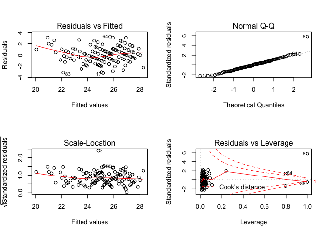<!-- -->

Marital status as a confounder:

    ## 
    ## Call:
    ## lm(formula = bmi ~ fuel_used_for_cooking_percent_wood_dung + 
    ##     percent_public_source + percent_private_toilet + percent_employed + 
    ##     percent_without_hs_education + percent_caste + percent_marital_status, 
    ##     data = total)
    ## 
    ## Residuals:
    ##     Min      1Q  Median      3Q     Max 
    ## -3.2086 -0.9110  0.0259  0.9358  3.2602 
    ## 
    ## Coefficients:
    ##                                          Estimate Std. Error t value
    ## (Intercept)                             29.403753   0.875240  33.595
    ## fuel_used_for_cooking_percent_wood_dung  4.640155   2.914284   1.592
    ## percent_public_source                   -0.014564   0.012919  -1.127
    ## percent_private_toilet                   0.007059   0.003300   2.139
    ## percent_employed                        -6.094334   1.794056  -3.397
    ## percent_without_hs_education            -7.428263   0.863722  -8.600
    ## percent_caste                            0.006360   0.014916   0.426
    ## percent_marital_status                   0.005634   0.008882   0.634
    ##                                         Pr(>|t|)    
    ## (Intercept)                              < 2e-16 ***
    ## fuel_used_for_cooking_percent_wood_dung 0.113843    
    ## percent_public_source                   0.261755    
    ## percent_private_toilet                  0.034353 *  
    ## percent_employed                        0.000912 ***
    ## percent_without_hs_education            2.66e-14 ***
    ## percent_caste                           0.670568    
    ## percent_marital_status                  0.527010    
    ## ---
    ## Signif. codes:  0 '***' 0.001 '**' 0.01 '*' 0.05 '.' 0.1 ' ' 1
    ## 
    ## Residual standard error: 1.468 on 126 degrees of freedom
    ## Multiple R-squared:  0.5978, Adjusted R-squared:  0.5755 
    ## F-statistic: 26.76 on 7 and 126 DF,  p-value: < 2.2e-16

    ##                                             Estimate  Std. Error
    ## (Intercept)                             29.403753282 0.875240008
    ## fuel_used_for_cooking_percent_wood_dung  4.640155087 2.914284482
    ## percent_public_source                   -0.014564219 0.012919475
    ## percent_private_toilet                   0.007058910 0.003299875
    ## percent_employed                        -6.094333961 1.794055941
    ## percent_without_hs_education            -7.428262867 0.863721758
    ## percent_caste                            0.006359546 0.014915648
    ## percent_marital_status                   0.005634217 0.008882040
    ##                                            t value     Pr(>|t|)
    ## (Intercept)                             33.5950745 9.780827e-65
    ## fuel_used_for_cooking_percent_wood_dung  1.5922108 1.138431e-01
    ## percent_public_source                   -1.1273074 2.617547e-01
    ## percent_private_toilet                   2.1391446 3.435280e-02
    ## percent_employed                        -3.3969587 9.122401e-04
    ## percent_without_hs_education            -8.6002961 2.657572e-14
    ## percent_caste                            0.4263674 6.705677e-01
    ## percent_marital_status                   0.6343381 5.270102e-01

    ##                             (Intercept) 
    ##                            29.403753282 
    ## fuel_used_for_cooking_percent_wood_dung 
    ##                             4.640155087 
    ##                   percent_public_source 
    ##                            -0.014564219 
    ##                  percent_private_toilet 
    ##                             0.007058910 
    ##                        percent_employed 
    ##                            -6.094333961 
    ##            percent_without_hs_education 
    ##                            -7.428262867 
    ##                           percent_caste 
    ##                             0.006359546 
    ##                  percent_marital_status 
    ##                             0.005634217

    ##        1        2        3        4        5        6        7        8 
    ## 26.62243 25.68983 24.56664 26.22294 25.31625 24.19136 22.85285 24.80636 
    ##        9       10       11       12       13       14       15       16 
    ## 23.35970 24.22257 22.83500 25.04348 24.39676 25.07448 26.89525 21.51531 
    ##       17       18       19       20       21       22       23       24 
    ## 25.20856 24.20649 22.94049 25.12631 20.93882 24.94971 23.38664 24.30460 
    ##       25       26       27       28       29       30       31       32 
    ## 24.67469 23.82286 25.95706 25.45722 22.01746 24.57281 25.06622 25.89386 
    ##       33       34       35       36       37       38       39       40 
    ## 26.28942 24.85403 25.10968 27.25537 26.90360 26.18269 26.12168 22.34737 
    ##       41       42       43       44       45       46       47       48 
    ## 28.26751 27.42937 27.40648 26.35607 26.92744 25.71484 26.51033 27.21268 
    ##       49       50       51       52       53       54       55       56 
    ## 27.38844 26.65836 26.92099 27.33101 27.60552 25.79546 25.91552 24.96535 
    ##       57       58       59       60       61       62       63       64 
    ## 25.66139 24.84476 23.52468 24.57769 21.43100 24.76464 27.43375 25.73978 
    ##       65       66       67       68       69       70       71       72 
    ## 24.58673 23.52189 23.44108 23.95100 23.74881 22.25760 26.79058 26.18933 
    ##       73       74       75       76       77       78       79       80 
    ## 27.02073 21.00491 25.73698 25.15355 22.52143 22.52288 25.97686 26.41448 
    ##       81       82       83       84       85       86       87       88 
    ## 27.89737 27.82920 22.14571 20.04515 24.74575 24.49428 22.67073 24.13359 
    ##       89       90       91       92       93       94       95       96 
    ## 23.87047 23.66010 26.88452 27.12122 24.48225 23.02815 25.15187 25.65691 
    ##       97       98       99      100      101      102      103      104 
    ## 27.12046 25.99314 22.18600 27.33485 21.22230 27.50196 26.38416 25.71163 
    ##      105      106      107      108      109      110      111      112 
    ## 26.61783 27.47902 25.48156 26.78115 25.39532 26.51995 24.69665 24.83822 
    ##      113      114      115      116      117      118      119      120 
    ## 23.87446 22.41564 25.86018 26.01371 26.29956 27.17030 26.88650 26.48134 
    ##      121      122      123      124      125      126      127      128 
    ## 25.28376 26.70957 24.57918 23.91120 27.24070 24.77185 23.29022 24.38791 
    ##      129      130      131      132      133      134 
    ## 26.11027 25.33823 25.47161 25.33636 26.15505 21.91021

    ## # A tibble: 1 x 11
    ##   r.squared adj.r.squared sigma statistic  p.value    df logLik   AIC   BIC
    ##       <dbl>         <dbl> <dbl>     <dbl>    <dbl> <int>  <dbl> <dbl> <dbl>
    ## 1     0.598         0.575  1.47      26.8 3.44e-22     8  -237.  493.  519.
    ## # … with 2 more variables: deviance <dbl>, df.residual <int>

| term                                          | estimate | p.value |
| :-------------------------------------------- | -------: | ------: |
| (Intercept)                                   |   29.404 |   0.000 |
| fuel\_used\_for\_cooking\_percent\_wood\_dung |    4.640 |   0.114 |
| percent\_public\_source                       |  \-0.015 |   0.262 |
| percent\_private\_toilet                      |    0.007 |   0.034 |
| percent\_employed                             |  \-6.094 |   0.001 |
| percent\_without\_hs\_education               |  \-7.428 |   0.000 |
| percent\_caste                                |    0.006 |   0.671 |
| percent\_marital\_status                      |    0.006 |   0.527 |

| bmi | fuel\_used\_for\_cooking\_percent\_wood\_dung | percent\_public\_source | percent\_private\_toilet | percent\_employed | percent\_without\_hs\_education | percent\_caste | percent\_marital\_status |  .fitted |   .se.fit |      .resid |      .hat |   .sigma |      .cooksd |  .std.resid |
| --: | --------------------------------------------: | ----------------------: | -----------------------: | ----------------: | ------------------------------: | -------------: | -----------------------: | -------: | --------: | ----------: | --------: | -------: | -----------: | ----------: |
|  26 |                                     0.0000000 |               0.0270270 |              100.0000000 |         0.5405405 |                       0.0270270 |      0.5675676 |                0.8108108 | 26.62243 | 0.2962268 | \-0.6224300 | 0.0407107 | 1.472914 |    0.0009939 | \-0.4328580 |
|  26 |                                     0.0000000 |               0.0789474 |                0.7368421 |         0.5789474 |                       0.0263158 |      0.2368421 |                0.7631579 | 25.68983 | 0.3114481 |   0.3101684 | 0.0450019 | 1.473737 |    0.0002753 |   0.2161853 |
|  25 |                                     0.0277778 |               0.0555556 |                0.4722222 |         0.4444444 |                       0.3055556 |      0.7500000 |                0.8947368 | 24.56664 | 0.1927908 |   0.4333583 | 0.0172438 | 1.473492 |    0.0001944 |   0.2977515 |
|  26 |                                     0.0000000 |               0.1538462 |                0.7692308 |         0.6153846 |                       0.0000000 |      0.4615385 |              100.0000000 | 26.22294 | 0.8674985 | \-0.2229400 | 0.3491379 | 1.473803 |    0.0023756 | \-0.1882233 |
|  24 |                                     0.0277778 |               0.1944444 |                0.8333333 |         0.3888889 |                       0.2500000 |      0.3888889 |                0.9166667 | 25.31625 | 0.2518063 | \-1.3162503 | 0.0294166 | 1.469158 |    0.0031374 | \-0.9100219 |
|  23 |                                     0.0000000 |               0.3076923 |                0.7435897 |         0.5128205 |                       0.2820513 |      0.4871795 |                0.7435897 | 24.19136 | 0.1604855 | \-1.1913582 | 0.0119490 | 1.470107 |    0.0010075 | \-0.8163613 |
|  24 |                                     0.0000000 |               0.1351351 |                0.5405405 |         0.6486486 |                       0.3513514 |      0.9189189 |                0.7837838 | 22.85285 | 0.3152610 |   1.1471510 | 0.0461105 | 1.470262 |    0.0038674 |   0.8000209 |
|  25 |                                     0.0526316 |               0.3947368 |                0.9473684 |         0.5789474 |                       0.2631579 |    100.0000000 |                0.8157895 | 24.80636 | 1.4677772 |   0.1936434 | 0.9994931 | 1.257359 | 8457.5789130 |   5.8580795 |
|  26 |                                     0.0000000 |               0.2777778 |                0.3611111 |         0.4166667 |                       0.4722222 |      0.0000000 |                0.8055556 | 23.35970 | 0.3035609 |   2.6403012 | 0.0427515 | 1.454114 |    0.0188616 |   1.8381074 |
|  26 |                                     0.0000000 |               0.1500000 |                0.8500000 |         0.4250000 |                       0.3500000 |      0.0750000 |                0.8000000 | 24.22257 | 0.2265571 |   1.7774309 | 0.0238131 | 1.465202 |    0.0045783 |   1.2253382 |
|  23 |                                     0.0000000 |               0.1071429 |                0.9285714 |         0.6666667 |                       0.3392857 |      0.6785714 |                0.9107143 | 22.83500 | 0.3420246 |   0.1649987 | 0.0542718 | 1.473932 |    0.0000958 |   0.1155652 |
|  24 |                                     0.0000000 |               0.0344828 |                0.9137931 |         0.4655172 |                       0.2068966 |      0.4137931 |                0.8965517 | 25.04348 | 0.1626306 | \-1.0434848 | 0.0122705 | 1.471016 |    0.0007942 | \-0.7151496 |
|  24 |                                     0.0000000 |               0.3818182 |                0.8000000 |         0.4909091 |                       0.2727273 |      0.8727273 |                0.8909091 | 24.39676 | 0.1560511 | \-0.3967554 | 0.0112978 | 1.473578 |    0.0001055 | \-0.2717815 |
|  22 |                                     0.0000000 |               0.1636364 |                0.8909091 |         0.4909091 |                       0.1818182 |      0.6545455 |                0.8909091 | 25.07448 | 0.1632163 | \-3.0744839 | 0.0123591 | 1.447805 |    0.0069455 | \-2.1071839 |
|  25 |                                     0.0000000 |               0.0000000 |              100.0000000 |         0.4545455 |                       0.0606061 |      0.2121212 |                0.8181818 | 26.89525 | 0.2498773 | \-1.8952535 | 0.0289677 | 1.463937 |    0.0063996 | \-1.3100269 |
|  22 |                                     0.0263158 |               0.8684211 |                0.1315789 |         0.7368421 |                       0.4736842 |      0.8157895 |                0.9210526 | 21.51531 | 0.4488548 |   0.4846917 | 0.0934698 | 1.473307 |    0.0015496 |   0.3467402 |
|  22 |                                     0.0000000 |               0.2702703 |                0.7837838 |         0.4594595 |                       0.1891892 |      0.5945946 |                0.8648649 | 25.20856 | 0.1684443 | \-3.2085574 | 0.0131635 | 1.445423 |    0.0080699 | \-2.1999711 |
|  23 |                                     0.1025641 |               0.0256410 |                0.9487179 |         0.5897436 |                       0.2820513 |      0.6923077 |                0.9487179 | 24.20649 | 0.3255799 | \-1.2064927 | 0.0491784 | 1.469850 |    0.0045919 | \-0.8427620 |
|  22 |                                     0.0000000 |               0.2105263 |                0.9473684 |         0.4210526 |                       0.5263158 |      0.6315789 |                0.8421053 | 22.94049 | 0.3357778 | \-0.9404883 | 0.0523074 | 1.471475 |    0.0029875 | \-0.6580356 |
|  25 |                                     0.0000000 |               0.0263158 |                0.8947368 |         0.4473684 |                       0.2105263 |      0.2894737 |                0.8947368 | 25.12631 | 0.1735001 | \-0.1263106 | 0.0139656 | 1.473966 |    0.0000133 | \-0.0866410 |
|  24 |                                     0.0540541 |               0.7837838 |                0.5675676 |         0.5405405 |                       0.7297297 |      0.1621622 |                0.9729730 | 20.93882 | 0.4103438 |   3.0611819 | 0.0781187 | 1.446163 |    0.0499520 |   2.1716079 |
|  26 |                                     0.0000000 |               0.1500000 |                0.9000000 |         0.5500000 |                       0.1500000 |      0.4250000 |                0.9250000 | 24.94971 | 0.2120531 |   1.0502870 | 0.0208617 | 1.470950 |    0.0013920 |   0.7229624 |
|  24 |                                     0.0000000 |               0.6923077 |                0.6666667 |         0.4871795 |                       0.4102564 |      0.0256410 |                0.8205128 | 23.38664 | 0.2116300 |   0.6133646 | 0.0207785 | 1.472967 |    0.0004728 |   0.4221901 |
|  24 |                                     0.0000000 |               0.8461538 |                0.6923077 |         0.4615385 |                       0.3076923 |      0.2307692 |                0.9230769 | 24.30460 | 0.1763785 | \-0.3045962 | 0.0144328 | 1.473755 |    0.0000799 | \-0.2089831 |
|  24 |                                     0.0000000 |               0.5365854 |                0.6585366 |         0.3902439 |                       0.3170732 |      0.3658537 |                0.9512195 | 24.67469 | 0.2570894 | \-0.6746934 | 0.0306639 | 1.472735 |    0.0008615 | \-0.4667658 |
|  24 |                                     0.0769231 |               0.3333333 |                0.7179487 |         0.5384615 |                       0.3589744 |      0.7435897 |                0.9487179 | 23.82286 | 0.2383202 |   0.1771447 | 0.0263500 | 1.473923 |    0.0000506 |   0.1222803 |
|  23 |                                     0.0000000 |               0.4102564 |                0.7179487 |         0.4102564 |                       0.1282051 |      0.2051282 |                0.9743590 | 25.95706 | 0.2218382 | \-2.9570595 | 0.0228314 | 1.449523 |    0.0121250 | \-2.0375349 |
|  25 |                                     0.0000000 |               0.1538462 |                0.7948718 |         0.4615385 |                       0.1538462 |      0.0512821 |                0.9487179 | 25.45722 | 0.1767955 | \-0.4572158 | 0.0145011 | 1.473434 |    0.0001810 | \-0.3137061 |
|  23 |                                     0.0000000 |               0.9250000 |                0.8250000 |         0.4500000 |                       0.6250000 |      0.1750000 |                0.9500000 | 22.01746 | 0.3841189 |   0.9825442 | 0.0684528 | 1.471195 |    0.0044163 |   0.6933929 |
|  25 |                                     0.0000000 |               0.2307692 |                0.8974359 |         0.5128205 |                       0.2307692 |      0.1538462 |                0.8205128 | 24.57281 | 0.1602840 |   0.4271854 | 0.0119190 | 1.473509 |    0.0001292 |   0.2927183 |
|  23 |                                     0.0000000 |               0.1750000 |                0.7750000 |         0.5000000 |                       0.1750000 |      0.2500000 |                0.9000000 | 25.06622 | 0.1678008 | \-2.0662229 | 0.0130631 | 1.462224 |    0.0033204 | \-1.4166490 |
|  25 |                                     0.0000000 |               0.1025641 |                0.7948718 |         0.3589744 |                       0.1794872 |      0.2564103 |                0.9487179 | 25.89386 | 0.2796187 | \-0.8938588 | 0.0362737 | 1.471759 |    0.0018096 | \-0.6201858 |
|  25 |                                     0.0000000 |               0.0270270 |              100.0000000 |         0.5945946 |                       0.0270270 |      0.0270270 |                0.7837838 | 26.28942 | 0.3572288 | \-1.2894166 | 0.0592042 | 1.469207 |    0.0064494 | \-0.9054727 |
|  23 |                                     0.0263158 |               0.4736842 |                0.9210526 |         0.4473684 |                       0.2631579 |      0.8157895 |                0.8157895 | 24.85403 | 0.1805392 | \-1.8540312 | 0.0151218 | 1.464508 |    0.0031077 | \-1.2724934 |
|  24 |                                     0.0256410 |               0.2307692 |                0.9743590 |         0.5384615 |                       0.1538462 |      0.4102564 |                0.9230769 | 25.10968 | 0.2044121 | \-1.1096843 | 0.0193853 | 1.470599 |    0.0014396 | \-0.7632732 |
|  26 |                                     0.0000000 |               0.0188679 |              100.0000000 |         0.3773585 |                       0.0754717 |      0.1320755 |                0.9811321 | 27.25537 | 0.2894002 | \-1.2553651 | 0.0388559 | 1.469554 |    0.0038441 | \-0.8721788 |
|  27 |                                     0.0000000 |               0.0526316 |                0.9473684 |         0.3157895 |                       0.0789474 |      0.0000000 |                0.8684211 | 26.90360 | 0.3526256 |   0.0964013 | 0.0576882 | 1.473983 |    0.0000350 |   0.0676418 |
|  28 |                                     0.0000000 |               0.0000000 |                0.9750000 |         0.5000000 |                       0.0250000 |      0.0000000 |                0.8750000 | 26.18269 | 0.2476714 |   1.8173079 | 0.0284585 | 1.464756 |    0.0057745 |   1.2558205 |
|  27 |                                     0.0000000 |               0.0769231 |                0.8846154 |         0.4230769 |                       0.0961538 |      0.0192308 |                0.9423077 | 26.12168 | 0.2206834 |   0.8783193 | 0.0225943 | 1.471867 |    0.0010581 |   0.6051245 |
|  23 |                                     0.0000000 |               0.8285714 |                0.0285714 |         0.6000000 |                       0.4571429 |      0.4000000 |                0.9428571 | 22.34737 | 0.2812267 |   0.6526341 | 0.0366921 | 1.472810 |    0.0009767 |   0.4529153 |
|  26 |                                     0.0000000 |               0.0000000 |              100.0000000 |         0.3030303 |                       0.0000000 |      0.0303030 |                0.7878788 | 28.26751 | 0.3689484 | \-2.2675082 | 0.0631526 | 1.459041 |    0.0214546 | \-1.5956741 |
|  29 |                                     0.0000000 |               0.0000000 |              100.0000000 |         0.4000000 |                       0.0333333 |      0.0000000 |                0.9000000 | 27.42937 | 0.2697573 |   1.5706273 | 0.0337603 | 1.467066 |    0.0051731 |   1.0883296 |
|  29 |                                     0.0000000 |               0.0000000 |              100.0000000 |         0.4444444 |                       0.0000000 |      0.0000000 |                0.9629630 | 27.40648 | 0.2566221 |   1.5935230 | 0.0305526 | 1.466885 |    0.0047872 |   1.1023664 |
|  26 |                                     0.0000000 |               0.0263158 |              100.0000000 |         0.5526316 |                       0.0526316 |      0.0789474 |                0.9210526 | 26.35607 | 0.3037552 | \-0.3560699 | 0.0428062 | 1.473651 |    0.0003435 | \-0.2478935 |
|  27 |                                     0.0000000 |               0.0000000 |              100.0000000 |         0.3947368 |                       0.1052632 |      0.0526316 |                0.8947368 | 26.92744 | 0.2788952 |   0.0725604 | 0.0360862 | 1.473995 |    0.0000119 |   0.0503397 |
|  25 |                                     0.0000000 |               0.0000000 |                0.9666667 |         0.5666667 |                       0.0333333 |      0.1000000 |                0.8333333 | 25.71484 | 0.2931921 | \-0.7148434 | 0.0398808 | 1.472565 |    0.0012821 | \-0.4969104 |
|  28 |                                     0.0400000 |               0.0000000 |              100.0000000 |         0.5000000 |                       0.1000000 |      0.0000000 |                0.9000000 | 26.51033 | 0.2741135 |   1.4896720 | 0.0348594 | 1.467758 |    0.0048160 |   1.0328212 |
|  29 |                                     0.0000000 |               0.0000000 |              100.0000000 |         0.4761905 |                       0.0000000 |      0.0000000 |                0.9047619 | 27.21268 | 0.2604225 |   1.7873219 | 0.0314642 | 1.465032 |    0.0062138 |   1.2370142 |
|  28 |                                     0.0000000 |               0.0000000 |              100.0000000 |         0.4473684 |                       0.0000000 |      0.0263158 |                0.8947368 | 27.38844 | 0.2565164 |   0.6115598 | 0.0305274 | 1.472963 |    0.0007045 |   0.4230590 |
|  29 |                                     0.0000000 |               0.0000000 |                0.9855072 |         0.4347826 |                       0.0144928 |      0.0434783 |                0.8405797 | 26.65836 | 0.2549130 |   2.3416440 | 0.0301470 | 1.458587 |    0.0101916 |   1.6195623 |
|  30 |                                     0.0000000 |               0.0000000 |              100.0000000 |         0.4615385 |                       0.0512821 |      0.0000000 |                0.8974359 | 26.92099 | 0.2502890 |   3.0790054 | 0.0290632 | 1.447271 |    0.0169493 |   2.1283583 |
|  27 |                                     0.0000000 |               0.0000000 |              100.0000000 |         0.5483871 |                       0.0000000 |      0.0000000 |              100.0000000 | 27.33101 | 0.8769560 | \-0.3310118 | 0.3567920 | 1.473548 |    0.0054799 | \-0.2811238 |
|  27 |                                     0.0000000 |               0.0000000 |              100.0000000 |         0.4117647 |                       0.0000000 |      0.0000000 |                0.9411765 | 27.60552 | 0.2658216 | \-0.6055154 | 0.0327823 | 1.472981 |    0.0007451 | \-0.4193657 |
|  26 |                                     0.0000000 |               0.1304348 |                0.8695652 |         0.4347826 |                       0.1304348 |      0.1086957 |                0.9565217 | 25.79546 | 0.1993424 |   0.2045420 | 0.0184357 | 1.473895 |    0.0000464 |   0.1406219 |
|  27 |                                     0.0000000 |               0.0000000 |              100.0000000 |         0.5641026 |                       0.1025641 |      0.1282051 |                0.8461538 | 25.91552 | 0.3111609 |   1.0844755 | 0.0449190 | 1.470665 |    0.0033586 |   0.7558392 |
|  23 |                                     0.0000000 |               0.1315789 |                0.9736842 |         0.4736842 |                       0.2105263 |      0.4210526 |                0.8157895 | 24.96535 | 0.1591263 | \-1.9653495 | 0.0117474 | 1.463365 |    0.0026944 | \-1.3465906 |
|  24 |                                     0.0000000 |               0.0500000 |                0.9500000 |         0.5250000 |                       0.0750000 |      0.5750000 |                0.8250000 | 25.66139 | 0.2290270 | \-1.6613910 | 0.0243351 | 1.466313 |    0.0040921 | \-1.1456482 |
|  24 |                                     0.0000000 |               0.0243902 |                0.8536585 |         0.5121951 |                       0.1951220 |      0.2682927 |                0.8048780 | 24.84476 | 0.1665502 | \-0.8447598 | 0.0128692 | 1.472047 |    0.0005466 | \-0.5791294 |
|  21 |                                     0.0000000 |               0.4594595 |                0.4324324 |         0.4054054 |                       0.4594595 |      0.4324324 |                0.9729730 | 23.52468 | 0.3080701 | \-2.5246846 | 0.0440310 | 1.455804 |    0.0178096 | \-1.7587940 |
|  24 |                                     0.0000000 |               0.0512821 |                0.8717949 |         0.5128205 |                       0.2307692 |      0.5384615 |                0.8205128 | 24.57769 | 0.1596937 | \-0.5776937 | 0.0118314 | 1.473094 |    0.0002345 | \-0.3958328 |
|  24 |                                     0.2549020 |               0.3421053 |                0.7894737 |         0.6052632 |                       0.7368421 |      0.1052632 |                0.9473684 | 21.43100 | 0.7219096 |   2.5689973 | 0.2417827 | 1.450197 |    0.1609662 |   2.0095395 |
|  27 |                                     0.0000000 |               0.1538462 |                0.8974359 |         0.5128205 |                       0.2051282 |      0.0769231 |                0.9487179 | 24.76464 | 0.1644965 |   2.2353637 | 0.0125537 | 1.460213 |    0.0037309 |   1.5322203 |
|  28 |                                     0.0000000 |               0.0000000 |                0.8333333 |         0.4166667 |                       0.0000000 |      0.0000000 |              100.0000000 | 27.43375 | 0.8791686 |   0.5662485 | 0.3585947 | 1.472653 |    0.0162077 |   0.4815823 |
|  29 |                                     0.0000000 |               0.0000000 |                0.9729730 |         0.4054054 |                       0.1621622 |      0.0000000 |                0.7837838 | 25.73978 | 0.2195786 |   3.2602217 | 0.0223686 | 1.444205 |    0.0144262 |   2.2458944 |
|  26 |                                     0.0000000 |               0.2666667 |                0.8000000 |         0.4666667 |                       0.2666667 |      0.1333333 |                0.9333333 | 24.58673 | 0.1634436 |   1.4132695 | 0.0123935 | 1.468512 |    0.0014718 |   0.9686408 |
|  21 |                                     0.0256410 |               0.0512821 |                0.8974359 |         0.4871795 |                       0.4102564 |      0.7692308 |                0.9230769 | 23.52189 | 0.2018764 | \-2.5218855 | 0.0189074 | 1.456313 |    0.0072449 | \-1.7342037 |
|  23 |                                     0.0500000 |               0.2500000 |                0.7000000 |         0.5000000 |                       0.4250000 |      0.4250000 |                0.9750000 | 23.44108 | 0.2180894 | \-0.4410787 | 0.0220663 | 1.473470 |    0.0002603 | \-0.3038023 |
|  22 |                                     0.0000000 |               0.2500000 |                0.6500000 |         0.5000000 |                       0.3250000 |      0.4500000 |                0.8500000 | 23.95100 | 0.1685471 | \-1.9509990 | 0.0131796 | 1.463505 |    0.0029875 | \-1.3377278 |
|  24 |                                     0.0000000 |               0.1351351 |                0.8918919 |         0.5675676 |                       0.2972973 |      0.4324324 |                0.9459459 | 23.74881 | 0.2035621 |   0.2511881 | 0.0192244 | 1.473836 |    0.0000731 |   0.1727603 |
|  21 |                                     0.0000000 |               0.2500000 |                0.8888889 |         0.6666667 |                       0.4166667 |      0.6111111 |                0.9444444 | 22.25760 | 0.3510824 | \-1.2575956 | 0.0571844 | 1.469451 |    0.0059003 | \-0.8821804 |
|  26 |                                     0.0000000 |               0.0000000 |              100.0000000 |         0.5454545 |                       0.0000000 |      0.0000000 |                0.9090909 | 26.79058 | 0.3074863 | \-0.7905841 | 0.0438643 | 1.472235 |    0.0017392 | \-0.5507038 |
|  27 |                                     0.0000000 |               0.0000000 |                0.9607843 |         0.5294118 |                       0.0000000 |      0.0196078 |                0.9019608 | 26.18933 | 0.2816399 |   0.8106702 | 0.0368000 | 1.472158 |    0.0015117 |   0.5626207 |
|  27 |                                     0.0000000 |               0.0000000 |                0.9285714 |         0.3928571 |                       0.0000000 |      0.0000000 |                0.8214286 | 27.02073 | 0.2893492 | \-0.0207335 | 0.0388422 | 1.474009 |    0.0000010 | \-0.0144047 |
|  23 |                                     0.0975610 |               0.3414634 |                0.2439024 |         0.5609756 |                       0.7317073 |      0.2195122 |                0.7804878 | 21.00491 | 0.4337920 |   1.9950937 | 0.0873017 | 1.462128 |    0.0241916 |   1.4224252 |
|  26 |                                     0.0000000 |               0.0000000 |                0.9333333 |         0.5833333 |                       0.0166667 |      0.0333333 |                0.9333333 | 25.73698 | 0.3220774 |   0.2630203 | 0.0481260 | 1.473813 |    0.0002131 |   0.1836240 |
|  27 |                                     0.0000000 |               0.0750000 |                0.9000000 |         0.4250000 |                       0.2250000 |      0.1000000 |                0.9500000 | 25.15355 | 0.1941943 |   1.8464486 | 0.0174958 | 1.464563 |    0.0035835 |   1.2688193 |
|  23 |                                     0.0000000 |               0.5263158 |                0.5789474 |         0.5526316 |                       0.4736842 |      0.3684211 |                0.9736842 | 22.52143 | 0.2551538 |   0.4785687 | 0.0302039 | 1.473369 |    0.0004265 |   0.3310044 |
|  23 |                                     0.0000000 |               0.6000000 |                0.3500000 |         0.5500000 |                       0.4750000 |      0.1000000 |                0.9000000 | 22.52288 | 0.2549203 |   0.4771164 | 0.0301487 | 1.473373 |    0.0004231 |   0.3299906 |
|  29 |                                     0.0000000 |               0.0263158 |                0.9736842 |         0.5000000 |                       0.0526316 |      0.0000000 |                0.8421053 | 25.97686 | 0.2296740 |   3.0231404 | 0.0244728 | 1.448364 |    0.0136298 |   2.0848191 |
|  28 |                                     0.0256410 |               0.0000000 |              100.0000000 |         0.5641026 |                       0.0512821 |      0.0000000 |                0.8205128 | 26.41448 | 0.3179131 |   1.5855204 | 0.0468896 | 1.466835 |    0.0075249 |   1.1061907 |
|  29 |                                     0.0000000 |               0.0303030 |              100.0000000 |         0.3636364 |                       0.0000000 |      0.0303030 |                0.7272727 | 27.89737 | 0.3005159 |   1.1026282 | 0.0418981 | 1.470563 |    0.0032181 |   0.7672784 |
|  28 |                                     0.0000000 |               0.0000000 |              100.0000000 |         0.3750000 |                       0.0000000 |      0.0000000 |                0.8750000 | 27.82920 | 0.2903283 |   0.1708010 | 0.0391055 | 1.473928 |    0.0000717 |   0.1186813 |
|  19 |                                     0.0000000 |               0.9750000 |                0.0000000 |         0.5500000 |                       0.5250000 |      0.3750000 |                0.9750000 | 22.14571 | 0.2856613 | \-3.1457097 | 0.0378584 | 1.445831 |    0.0234688 | \-2.1843836 |
|  21 |                                     0.0000000 |             100.0000000 |                0.0000000 |         0.5405405 |                       0.6216216 |      0.6756757 |                0.9459459 | 20.04515 | 1.3075347 |   0.9548454 | 0.7931694 | 1.461999 |    0.9803294 |   1.4300638 |
|  24 |                                     0.0000000 |               0.2931034 |                0.6896552 |         0.5344828 |                       0.1896552 |      0.3275862 |                0.9655172 | 24.74575 | 0.1832479 | \-0.7457510 | 0.0155789 | 1.472476 |    0.0005185 | \-0.5119566 |
|  27 |                                     0.0000000 |               0.0000000 |                0.9148936 |         0.5744681 |                       0.1914894 |      0.4255319 |                0.8510638 | 24.49428 | 0.2251422 |   2.5057210 | 0.0235165 | 1.456457 |    0.0089800 |   1.7271499 |
|  22 |                                     0.0000000 |               0.1666667 |                0.8333333 |         0.6666667 |                       0.3611111 |      0.7500000 |                0.7222222 | 22.67073 | 0.3433716 | \-0.6707296 | 0.0547001 | 1.472718 |    0.0015970 | \-0.4698859 |
|  24 |                                     0.0000000 |               0.0000000 |                0.7068966 |         0.5517241 |                       0.2586207 |      0.5172414 |                0.8965517 | 24.13359 | 0.1865492 | \-0.1335904 | 0.0161453 | 1.473961 |    0.0000173 | \-0.0917359 |
|  22 |                                     0.0000000 |               0.0869565 |                0.7391304 |         0.5652174 |                       0.2826087 |      0.2608696 |                0.8913043 | 23.87047 | 0.2008230 | \-1.8704699 | 0.0187105 | 1.464303 |    0.0039424 | \-1.2861212 |
|  22 |                                     0.0000000 |               0.0000000 |                0.9743590 |         0.5384615 |                       0.3333333 |      0.2564103 |                0.9743590 | 23.66010 | 0.1839346 | \-1.6600995 | 0.0156959 | 1.466393 |    0.0025892 | \-1.1397228 |
|  28 |                                     0.0175439 |               0.0000000 |                0.9824561 |         0.3859649 |                       0.0350877 |      0.0350877 |                0.8947368 | 26.88452 | 0.2898938 |   1.1154810 | 0.0389886 | 1.470492 |    0.0030463 |   0.7750463 |
|  28 |                                     0.0000000 |               0.0000000 |              100.0000000 |         0.4531250 |                       0.0312500 |      0.0156250 |                0.9062500 | 27.12122 | 0.2517162 |   0.8787786 | 0.0293956 | 1.471850 |    0.0013974 |   0.6075585 |
|  24 |                                     0.0169492 |               0.1355932 |                0.7796610 |         0.4915254 |                       0.2711864 |      0.2372881 |                0.8474576 | 24.48225 | 0.1525015 | \-0.4822483 | 0.0107897 | 1.473372 |    0.0001487 | \-0.3302601 |
|  24 |                                     0.0000000 |               0.2131148 |                0.9672131 |         0.5081967 |                       0.4426230 |      0.1147541 |                0.8852459 | 23.02815 | 0.2274386 |   0.9718458 | 0.0239987 | 1.471382 |    0.0013799 |   0.6700419 |
|  26 |                                     0.0000000 |               0.0800000 |                0.9800000 |         0.4800000 |                       0.1800000 |      0.0000000 |                0.8400000 | 25.15187 | 0.1643260 |   0.8481290 | 0.0125277 | 1.472032 |    0.0005359 |   0.5813387 |
|  24 |                                     0.0000000 |               0.0526316 |                0.8684211 |         0.5526316 |                       0.0526316 |      0.2105263 |                0.9473684 | 25.65691 | 0.2666432 | \-1.6569108 | 0.0329853 | 1.466286 |    0.0056159 | \-1.1476576 |
|  26 |                                     0.0000000 |               0.0000000 |              100.0000000 |         0.4000000 |                       0.0750000 |      0.0500000 |                0.9500000 | 27.12046 | 0.2710364 | \-1.1204615 | 0.0340812 | 1.470479 |    0.0026595 | \-0.7765267 |
|  25 |                                     0.0000000 |               0.0285714 |                0.9142857 |         0.4571429 |                       0.0857143 |      0.1142857 |                0.9428571 | 25.99314 | 0.2070182 | \-0.9931406 | 0.0198827 | 1.471277 |    0.0011839 | \-0.6832844 |
|  22 |                                     0.0540541 |               0.1081081 |                0.1351351 |         0.5675676 |                       0.5405405 |      0.2432432 |                0.8378378 | 22.18600 | 0.2870186 | \-0.1859958 | 0.0382190 | 1.473913 |    0.0000829 | \-0.1291799 |
|  27 |                                     0.0000000 |               0.0175439 |              100.0000000 |         0.4561404 |                       0.0000000 |      0.0000000 |                0.9473684 | 27.33485 | 0.2565626 | \-0.3348548 | 0.0305384 | 1.473696 |    0.0002113 | \-0.2316440 |
|  23 |                                     0.0416667 |               0.2708333 |                0.3125000 |         0.5625000 |                       0.6666667 |      0.3541667 |                0.8750000 | 21.22230 | 0.3655058 |   1.7777013 | 0.0619795 | 1.464839 |    0.0129095 |   1.2502083 |
|  28 |                                     0.0000000 |               0.0000000 |              100.0000000 |         0.3859649 |                       0.0350877 |      0.0175439 |                0.8947368 | 27.50196 | 0.2798506 |   0.4980429 | 0.0363339 | 1.473312 |    0.0005628 |   0.3455678 |
|  27 |                                     0.0000000 |               0.0000000 |              100.0000000 |         0.4871795 |                       0.1025641 |      0.1025641 |                0.8461538 | 26.38416 | 0.2553187 |   0.6158437 | 0.0302430 | 1.472949 |    0.0007073 |   0.4259599 |
|  25 |                                     0.0000000 |               0.0000000 |              100.0000000 |         0.4102564 |                       0.2564103 |      0.3589744 |                0.8205128 | 25.71163 | 0.3193028 | \-0.7116278 | 0.0473004 | 1.472567 |    0.0015305 | \-0.4965977 |
|  27 |                                     0.0000000 |               0.0000000 |              100.0000000 |         0.5333333 |                       0.0333333 |      0.1333333 |                0.9333333 | 26.61783 | 0.2884943 |   0.3821694 | 0.0386131 | 1.473598 |    0.0003538 |   0.2654829 |
|  27 |                                     0.0000000 |               0.0000000 |              100.0000000 |         0.4324324 |                       0.0000000 |      0.0540541 |                0.7837838 | 27.47902 | 0.2586866 | \-0.4790164 | 0.0310461 | 1.473367 |    0.0004400 | \-0.3314581 |
|  25 |                                     0.0000000 |               0.0697674 |                0.9302326 |         0.4186047 |                       0.1860465 |      0.0000000 |                0.9534884 | 25.48156 | 0.2020921 | \-0.4815568 | 0.0189478 | 1.473369 |    0.0002648 | \-0.3311549 |
|  27 |                                     0.0000000 |               0.0750000 |              100.0000000 |         0.4250000 |                       0.1000000 |      0.0250000 |                0.9500000 | 26.78115 | 0.2592975 |   0.2188548 | 0.0311929 | 1.473876 |    0.0000923 |   0.1514492 |
|  26 |                                     0.0161290 |               0.1774194 |                0.7903226 |         0.4354839 |                       0.1935484 |      0.1129032 |                0.8387097 | 25.39532 | 0.1888573 |   0.6046796 | 0.0165473 | 1.473001 |    0.0003628 |   0.4153157 |
|  29 |                                     0.0000000 |               0.0000000 |                0.9000000 |         0.4750000 |                       0.0000000 |      0.0000000 |                0.8250000 | 26.51995 | 0.2584710 |   2.4800541 | 0.0309944 | 1.456684 |    0.0117740 |   1.7160414 |
|  26 |                                     0.0000000 |               0.1621622 |                0.6756757 |         0.3783784 |                       0.3243243 |      0.1891892 |                0.7837838 | 24.69665 | 0.2761883 |   1.3033503 | 0.0353891 | 1.469224 |    0.0037468 |   0.9038885 |
|  23 |                                     0.0000000 |               0.0555556 |              100.0000000 |         0.5277778 |                       0.2777778 |      0.6666667 |                0.8888889 | 24.83822 | 0.3167223 | \-1.8382227 | 0.0465390 | 1.464361 |    0.0100317 | \-1.2822609 |
|  23 |                                     0.0000000 |               0.1282051 |              100.0000000 |         0.4615385 |                       0.4615385 |      0.5128205 |                0.8205128 | 23.87446 | 0.4196159 | \-0.8744628 | 0.0816890 | 1.471749 |    0.0042957 | \-0.6215502 |
|  22 |                                     0.0000000 |               0.6052632 |                0.7105263 |         0.4736842 |                       0.5526316 |      0.4210526 |                0.8684211 | 22.41564 | 0.3147309 | \-0.4156418 | 0.0459556 | 1.473519 |    0.0005058 | \-0.2898442 |
|  26 |                                     0.0000000 |               0.0476190 |                0.9523810 |         0.4285714 |                       0.1269841 |      0.0952381 |                0.8730159 | 25.86018 | 0.2051146 |   0.1398219 | 0.0195188 | 1.473956 |    0.0000230 |   0.0961801 |
|  27 |                                     0.0000000 |               0.0000000 |                0.9444444 |         0.3888889 |                       0.1388889 |      0.0000000 |                0.8888889 | 26.01371 | 0.2428835 |   0.9862937 | 0.0273688 | 1.471294 |    0.0016321 |   0.6811801 |
|  28 |                                     0.0000000 |               0.0000000 |                0.9473684 |         0.4473684 |                       0.0526316 |      0.1578947 |                0.9736842 | 26.29956 | 0.2277593 |   1.7004430 | 0.0240664 | 1.465948 |    0.0042371 |   1.1724159 |
|  28 |                                     0.0000000 |               0.0263158 |                0.9736842 |         0.3684211 |                       0.0000000 |      0.0000000 |                0.9473684 | 27.17030 | 0.3114960 |   0.8297001 | 0.0450157 | 1.472053 |    0.0019705 |   0.5782995 |
|  29 |                                     0.0000000 |               0.0000000 |              100.0000000 |         0.4358974 |                       0.0769231 |      0.0000000 |                0.8461538 | 26.88650 | 0.2531482 |   2.1134977 | 0.0297310 | 1.461464 |    0.0081808 |   1.4614550 |
|  28 |                                     0.0000000 |               0.0000000 |                0.9000000 |         0.4000000 |                       0.0666667 |      0.0666667 |                0.6666667 | 26.48134 | 0.2524871 |   1.5186647 | 0.0295759 | 1.467547 |    0.0042006 |   1.0500522 |
|  25 |                                     0.0000000 |               0.0810811 |                0.8918919 |         0.5135135 |                       0.1351351 |      0.4324324 |                0.9729730 | 25.28376 | 0.1890638 | \-0.2837580 | 0.0165835 | 1.473788 |    0.0000801 | \-0.1948988 |
|  24 |                                     0.0500000 |               0.0250000 |              100.0000000 |         0.4750000 |                       0.1000000 |      0.2000000 |                0.8250000 | 26.70957 | 0.2802761 | \-2.7095732 | 0.0364445 | 1.453186 |    0.0167128 | \-1.8801490 |
|  23 |                                     0.1724138 |               0.8275862 |                0.0000000 |         0.5862069 |                       0.2758621 |      0.5862069 |                0.9655172 | 24.57918 | 0.4899674 | \-1.5791783 | 0.1113766 | 1.466375 |    0.0203981 | \-1.1410431 |
|  23 |                                     0.0000000 |               0.2162162 |                0.7297297 |         0.5405405 |                       0.2972973 |      0.4324324 |                0.9459459 | 23.91120 | 0.1780033 | \-0.9111980 | 0.0146999 | 1.471722 |    0.0007291 | \-0.6252566 |
|  27 |                                     0.0270270 |               0.0000000 |              100.0000000 |         0.4594595 |                       0.0270270 |      0.1621622 |                0.9729730 | 27.24070 | 0.2635455 | \-0.2407038 | 0.0322233 | 1.473848 |    0.0001156 | \-0.1666576 |
|  23 |                                     0.0000000 |               0.3333333 |                0.6944444 |         0.3888889 |                       0.3055556 |      0.4166667 |                0.9166667 | 24.77185 | 0.2552572 | \-1.7718493 | 0.0302284 | 1.465199 |    0.0058519 | \-1.2255240 |
|  23 |                                     0.0256410 |               0.1538462 |                0.4102564 |         0.4615385 |                       0.4615385 |      0.5128205 |                0.8461538 | 23.29022 | 0.2477920 | \-0.2902171 | 0.0284862 | 1.473775 |    0.0001474 | \-0.2005526 |
|  25 |                                     0.0000000 |               0.0000000 |                0.9487179 |         0.5128205 |                       0.2564103 |      0.3076923 |                0.9743590 | 24.38791 | 0.1584468 |   0.6120855 | 0.0116473 | 1.472981 |    0.0002591 |   0.4193589 |
|  24 |                                     0.0000000 |               0.0000000 |                0.9117647 |         0.4705882 |                       0.0588235 |      0.0294118 |                0.8461538 | 26.11027 | 0.2202600 | \-2.1102653 | 0.0225077 | 1.461595 |    0.0060834 | \-1.4538183 |
|  26 |                                     0.0000000 |               0.0263158 |                0.9210526 |         0.6052632 |                       0.0526316 |      0.3947368 |                0.9736842 | 25.33823 | 0.3272695 |   0.6617691 | 0.0496902 | 1.472759 |    0.0013974 |   0.4623849 |
|  26 |                                     0.0000000 |               0.0000000 |                0.9714286 |         0.5428571 |                       0.0857143 |      0.1428571 |                0.9142857 | 25.47161 | 0.2376951 |   0.5283907 | 0.0262120 | 1.473232 |    0.0004476 |   0.3647142 |
|  25 |                                     0.0000000 |               0.0000000 |                0.9090909 |         0.4848485 |                       0.1515152 |      0.2727273 |                0.8484848 | 25.33636 | 0.1733283 | \-0.3363625 | 0.0139379 | 1.473699 |    0.0000941 | \-0.2307200 |
|  25 |                                     0.0000000 |               0.0000000 |              100.0000000 |         0.4705882 |                       0.1470588 |      0.1176471 |                0.8823529 | 26.15505 | 0.2581319 | \-1.1550504 | 0.0309131 | 1.470270 |    0.0025468 | \-0.7991887 |
|  21 |                                     0.5526316 |             100.0000000 |                0.0000000 |         0.5789474 |                       0.6842105 |      0.6578947 |                0.9210526 | 21.91021 | 1.3079275 | \-0.9102066 | 0.7936461 | 1.463075 |    0.8954698 | \-1.3647823 |

    ## Warning in sqrt(crit * p * (1 - hh)/hh): NaNs produced
    
    ## Warning in sqrt(crit * p * (1 - hh)/hh): NaNs produced

<!-- -->

Full model:

    ## 
    ## Call:
    ## lm(formula = bmi ~ fuel_used_for_cooking_percent_wood_dung + 
    ##     percent_public_source + percent_private_toilet + percent_employed + 
    ##     percent_without_hs_education + percent_caste + median_age + 
    ##     percent_female + percent_marital_status, data = total)
    ## 
    ## Residuals:
    ##     Min      1Q  Median      3Q     Max 
    ## -3.1721 -0.6354  0.0234  0.6553  3.3782 
    ## 
    ## Coefficients:
    ##                                          Estimate Std. Error t value
    ## (Intercept)                             19.141890   1.902471  10.062
    ## fuel_used_for_cooking_percent_wood_dung  3.262409   2.598781   1.255
    ## percent_public_source                   -0.015336   0.011476  -1.336
    ## percent_private_toilet                   0.002198   0.003085   0.713
    ## percent_employed                        -1.872661   1.758649  -1.065
    ## percent_without_hs_education            -4.896708   0.876314  -5.588
    ## percent_caste                            0.009649   0.013259   0.728
    ## median_age                               0.171759   0.029602   5.802
    ## percent_female                           0.237280   0.220952   1.074
    ## percent_marital_status                  -0.002502   0.008033  -0.311
    ##                                         Pr(>|t|)    
    ## (Intercept)                              < 2e-16 ***
    ## fuel_used_for_cooking_percent_wood_dung    0.212    
    ## percent_public_source                      0.184    
    ## percent_private_toilet                     0.477    
    ## percent_employed                           0.289    
    ## percent_without_hs_education            1.39e-07 ***
    ## percent_caste                              0.468    
    ## median_age                              5.13e-08 ***
    ## percent_female                             0.285    
    ## percent_marital_status                     0.756    
    ## ---
    ## Signif. codes:  0 '***' 0.001 '**' 0.01 '*' 0.05 '.' 0.1 ' ' 1
    ## 
    ## Residual standard error: 1.304 on 124 degrees of freedom
    ## Multiple R-squared:  0.6878, Adjusted R-squared:  0.6651 
    ## F-statistic: 30.35 on 9 and 124 DF,  p-value: < 2.2e-16

    ##                                             Estimate  Std. Error
    ## (Intercept)                             19.141890064 1.902470572
    ## fuel_used_for_cooking_percent_wood_dung  3.262408550 2.598780939
    ## percent_public_source                   -0.015336165 0.011475728
    ## percent_private_toilet                   0.002198002 0.003084910
    ## percent_employed                        -1.872661013 1.758648602
    ## percent_without_hs_education            -4.896707983 0.876313792
    ## percent_caste                            0.009648699 0.013259422
    ## median_age                               0.171758736 0.029601712
    ## percent_female                           0.237279776 0.220951619
    ## percent_marital_status                  -0.002501728 0.008032938
    ##                                            t value     Pr(>|t|)
    ## (Intercept)                             10.0615959 8.964268e-18
    ## fuel_used_for_cooking_percent_wood_dung  1.2553611 2.117083e-01
    ## percent_public_source                   -1.3364002 1.838656e-01
    ## percent_private_toilet                   0.7125011 4.774931e-01
    ## percent_employed                        -1.0648296 2.890222e-01
    ## percent_without_hs_education            -5.5878477 1.388398e-07
    ## percent_caste                            0.7276862 4.681775e-01
    ## median_age                               5.8023244 5.128032e-08
    ## percent_female                           1.0738992 2.849532e-01
    ## percent_marital_status                  -0.3114338 7.559939e-01

    ##                             (Intercept) 
    ##                            19.141890064 
    ## fuel_used_for_cooking_percent_wood_dung 
    ##                             3.262408550 
    ##                   percent_public_source 
    ##                            -0.015336165 
    ##                  percent_private_toilet 
    ##                             0.002198002 
    ##                        percent_employed 
    ##                            -1.872661013 
    ##            percent_without_hs_education 
    ##                            -4.896707983 
    ##                           percent_caste 
    ##                             0.009648699 
    ##                              median_age 
    ##                             0.171758736 
    ##                          percent_female 
    ##                             0.237279776 
    ##                  percent_marital_status 
    ##                            -0.002501728

    ##        1        2        3        4        5        6        7        8 
    ## 25.78620 25.45537 24.86507 25.99506 26.46166 23.54413 23.93664 24.85589 
    ##        9       10       11       12       13       14       15       16 
    ## 24.38653 23.39706 23.26527 23.99857 23.98765 23.75104 27.15293 22.22045 
    ##       17       18       19       20       21       22       23       24 
    ## 25.17211 23.63523 23.70252 24.51726 21.51730 24.75523 23.32900 24.71544 
    ##       25       26       27       28       29       30       31       32 
    ## 24.21489 23.83094 25.55040 25.44259 22.39163 24.46718 23.90831 25.46683 
    ##       33       34       35       36       37       38       39       40 
    ## 25.54984 25.04446 25.04042 26.57191 27.22556 28.05538 25.98930 22.71427 
    ##       41       42       43       44       45       46       47       48 
    ## 29.05643 27.45206 26.97798 26.30589 27.30436 25.94896 27.16732 27.19421 
    ##       49       50       51       52       53       54       55       56 
    ## 27.58785 27.19403 28.49022 27.09321 28.69200 26.35900 26.14043 23.63540 
    ##       57       58       59       60       61       62       63       64 
    ## 24.19094 24.14811 21.84615 23.67305 22.08723 24.61047 27.90426 25.62182 
    ##       65       66       67       68       69       70       71       72 
    ## 23.76522 23.54782 23.22101 23.50936 23.57633 22.59708 26.85671 26.73628 
    ##       73       74       75       76       77       78       79       80 
    ## 26.93761 21.26676 25.55243 25.71927 22.91771 23.13115 27.60662 27.51439 
    ##       81       82       83       84       85       86       87       88 
    ## 28.29202 27.13143 21.91809 20.19073 23.99209 24.12947 23.12981 24.33344 
    ##       89       90       91       92       93       94       95       96 
    ## 23.45612 23.71866 26.71759 26.18092 23.90839 23.58299 25.57670 24.89553 
    ##       97       98       99      100      101      102      103      104 
    ## 26.58597 26.39960 22.91264 27.82836 21.17758 27.43296 26.86217 26.11349 
    ##      105      106      107      108      109      110      111      112 
    ## 27.58602 26.99302 24.28080 26.79840 24.89886 27.50170 24.31642 24.73422 
    ##      113      114      115      116      117      118      119      120 
    ## 22.63092 22.53418 25.55481 26.49003 26.71233 28.50824 27.45712 27.87379 
    ##      121      122      123      124      125      126      127      128 
    ## 24.55699 25.46134 23.72631 23.03115 27.07521 25.22154 23.31777 24.79118 
    ##      129      130      131      132      133      134 
    ## 26.75298 25.09299 25.86101 25.03510 24.96564 21.76852

    ## # A tibble: 1 x 11
    ##   r.squared adj.r.squared sigma statistic  p.value    df logLik   AIC   BIC
    ##       <dbl>         <dbl> <dbl>     <dbl>    <dbl> <int>  <dbl> <dbl> <dbl>
    ## 1     0.688         0.665  1.30      30.4 2.29e-27    10  -221.  463.  495.
    ## # … with 2 more variables: deviance <dbl>, df.residual <int>

| term                                          | estimate | p.value |
| :-------------------------------------------- | -------: | ------: |
| (Intercept)                                   |   19.142 |   0.000 |
| fuel\_used\_for\_cooking\_percent\_wood\_dung |    3.262 |   0.212 |
| percent\_public\_source                       |  \-0.015 |   0.184 |
| percent\_private\_toilet                      |    0.002 |   0.477 |
| percent\_employed                             |  \-1.873 |   0.289 |
| percent\_without\_hs\_education               |  \-4.897 |   0.000 |
| percent\_caste                                |    0.010 |   0.468 |
| median\_age                                   |    0.172 |   0.000 |
| percent\_female                               |    0.237 |   0.285 |
| percent\_marital\_status                      |  \-0.003 |   0.756 |

| bmi | fuel\_used\_for\_cooking\_percent\_wood\_dung | percent\_public\_source | percent\_private\_toilet | percent\_employed | percent\_without\_hs\_education | percent\_caste | median\_age | percent\_female | percent\_marital\_status |  .fitted |   .se.fit |      .resid |      .hat |   .sigma |      .cooksd |  .std.resid |
| --: | --------------------------------------------: | ----------------------: | -----------------------: | ----------------: | ------------------------------: | -------------: | ----------: | --------------: | -----------------------: | -------: | --------: | ----------: | --------: | -------: | -----------: | ----------: |
|  26 |                                     0.0000000 |               0.0270270 |              100.0000000 |         0.5405405 |                       0.0270270 |      0.5675676 |    43.08108 |       0.7017544 |                0.8108108 | 25.78620 | 0.2996677 |   0.2138049 | 0.0528132 | 1.309113 |    0.0001583 |   0.1684734 |
|  26 |                                     0.0000000 |               0.0789474 |                0.7368421 |         0.5789474 |                       0.0263158 |      0.2368421 |    42.89474 |       0.6666667 |                0.7631579 | 25.45537 | 0.2815477 |   0.5446257 | 0.0466194 | 1.308297 |    0.0008947 |   0.4277562 |
|  25 |                                     0.0277778 |               0.0555556 |                0.4722222 |         0.4444444 |                       0.3055556 |      0.7500000 |    45.33333 |       0.7142857 |                0.8947368 | 24.86507 | 0.1785317 |   0.1349319 | 0.0187453 | 1.309205 |    0.0000208 |   0.1044613 |
|  26 |                                     0.0000000 |               0.1538462 |                0.7692308 |         0.6153846 |                       0.0000000 |      0.4615385 |    47.07692 |       0.7000000 |              100.0000000 | 25.99506 | 0.7714329 |   0.0049363 | 0.3499928 | 1.309263 |    0.0000012 |   0.0046954 |
|  24 |                                     0.0277778 |               0.1944444 |                0.8333333 |         0.3888889 |                       0.2500000 |      0.3888889 |    52.50000 |       0.6909091 |                0.9166667 | 26.46166 | 0.2988924 | \-2.4616595 | 0.0525403 | 1.289252 |    0.0208588 | \-1.9394518 |
|  23 |                                     0.0000000 |               0.3076923 |                0.7435897 |         0.5128205 |                       0.2820513 |      0.4871795 |    38.35897 |       0.6551724 |                0.7435897 | 23.54413 | 0.1794076 | \-0.5441324 | 0.0189297 | 1.308326 |    0.0003425 | \-0.4212946 |
|  24 |                                     0.0000000 |               0.1351351 |                0.5405405 |         0.6486486 |                       0.3513514 |      0.9189189 |    44.00000 |       0.7017544 |                0.7837838 | 23.93664 | 0.3372265 |   0.0633562 | 0.0668815 | 1.309250 |    0.0000181 |   0.0502982 |
|  25 |                                     0.0526316 |               0.3947368 |                0.9473684 |         0.5789474 |                       0.2631579 |    100.0000000 |    39.57895 |       0.6666667 |                0.8157895 | 24.85589 | 1.3036690 |   0.1441097 | 0.9995337 | 1.162791 | 5614.5145571 |   5.1178905 |
|  26 |                                     0.0000000 |               0.2777778 |                0.3611111 |         0.4166667 |                       0.4722222 |      0.0000000 |    47.72222 |       0.6153846 |                0.8055556 | 24.38653 | 0.3221462 |   1.6134744 | 0.0610336 | 1.300626 |    0.0105988 |   1.2769339 |
|  26 |                                     0.0000000 |               0.1500000 |                0.8500000 |         0.4250000 |                       0.3500000 |      0.0750000 |    38.47500 |       0.6666667 |                0.8000000 | 23.39706 | 0.2465224 |   2.6029446 | 0.0357417 | 1.287262 |    0.0153173 |   2.0328233 |
|  23 |                                     0.0000000 |               0.1071429 |                0.9285714 |         0.6666667 |                       0.3392857 |      0.6785714 |    40.00000 |       0.6666667 |                0.9107143 | 23.26527 | 0.3138904 | \-0.2652691 | 0.0579454 | 1.309031 |    0.0002702 | \-0.2095946 |
|  24 |                                     0.0000000 |               0.0344828 |                0.9137931 |         0.4655172 |                       0.2068966 |      0.4137931 |    38.31034 |       0.6666667 |                0.8965517 | 23.99857 | 0.2282218 |   0.0014257 | 0.0306321 | 1.309263 |    0.0000000 |   0.0011105 |
|  24 |                                     0.0000000 |               0.3818182 |                0.8000000 |         0.4909091 |                       0.2727273 |      0.8727273 |    40.41818 |       0.6585366 |                0.8909091 | 23.98765 | 0.1546163 |   0.0123542 | 0.0140596 | 1.309262 |    0.0000001 |   0.0095416 |
|  22 |                                     0.0000000 |               0.1636364 |                0.8909091 |         0.4909091 |                       0.1818182 |      0.6545455 |    36.41818 |       0.6746988 |                0.8909091 | 23.75104 | 0.2669254 | \-1.7510418 | 0.0419027 | 1.299289 |    0.0082315 | \-1.3719021 |
|  25 |                                     0.0000000 |               0.0000000 |              100.0000000 |         0.4545455 |                       0.0606061 |      0.2121212 |    51.18182 |       0.6250000 |                0.8181818 | 27.15293 | 0.2271714 | \-2.1529346 | 0.0303508 | 1.294336 |    0.0087997 | \-1.6766982 |
|  22 |                                     0.0263158 |               0.8684211 |                0.1315789 |         0.7368421 |                       0.4736842 |      0.8157895 |    38.05263 |       0.6896552 |                0.9210526 | 22.22045 | 0.4167704 | \-0.2204454 | 0.1021542 | 1.309095 |    0.0003622 | \-0.1784150 |
|  22 |                                     0.0000000 |               0.2702703 |                0.7837838 |         0.4594595 |                       0.1891892 |      0.5945946 |    44.56757 |       0.6785714 |                0.8648649 | 25.17211 | 0.1504798 | \-3.1721056 | 0.0133174 | 1.277207 |    0.0080951 | \-2.4490085 |
|  23 |                                     0.1025641 |               0.0256410 |                0.9487179 |         0.5897436 |                       0.2820513 |      0.6923077 |    37.74359 |       0.6551724 |                0.9487179 | 23.63523 | 0.3045604 | \-0.6352324 | 0.0545519 | 1.307937 |    0.0014483 | \-0.5010086 |
|  22 |                                     0.0000000 |               0.2105263 |                0.9473684 |         0.4210526 |                       0.5263158 |      0.6315789 |    45.21053 |       0.6666667 |                0.8421053 | 23.70252 | 0.3245231 | \-1.7025167 | 0.0619375 | 1.299634 |    0.0119987 | \-1.3480528 |
|  25 |                                     0.0000000 |               0.0263158 |                0.8947368 |         0.4473684 |                       0.2105263 |      0.2894737 |    41.21053 |       0.6896552 |                0.8947368 | 24.51726 | 0.1852954 |   0.4827384 | 0.0201926 | 1.308524 |    0.0002883 |   0.3740011 |
|  24 |                                     0.0540541 |               0.7837838 |                0.5675676 |         0.5405405 |                       0.7297297 |      0.1621622 |    38.72973 |       0.6071429 |                0.9729730 | 21.51730 | 0.3771035 |   2.4826962 | 0.0836342 | 1.288210 |    0.0361041 |   1.9889347 |
|  26 |                                     0.0000000 |               0.1500000 |                0.9000000 |         0.5500000 |                       0.1500000 |      0.4250000 |    42.02500 |       0.6666667 |                0.9250000 | 24.75523 | 0.1922665 |   1.2447679 | 0.0217405 | 1.304336 |    0.0020701 |   0.9651454 |
|  24 |                                     0.0000000 |               0.6923077 |                0.6666667 |         0.4871795 |                       0.4102564 |      0.0256410 |    40.51282 |       0.6779661 |                0.8205128 | 23.32900 | 0.1883989 |   0.6709966 | 0.0208747 | 1.307835 |    0.0005766 |   0.5200350 |
|  24 |                                     0.0000000 |               0.8461538 |                0.6923077 |         0.4615385 |                       0.3076923 |      0.2307692 |    45.38462 |       0.6779661 |                0.9230769 | 24.71544 | 0.1723260 | \-0.7154397 | 0.0174648 | 1.307645 |    0.0005446 | \-0.5535162 |
|  24 |                                     0.0000000 |               0.5365854 |                0.6585366 |         0.3902439 |                       0.3170732 |      0.3658537 |    41.92683 |       0.6774194 |                0.9512195 | 24.21489 | 0.2418213 | \-0.2148865 | 0.0343916 | 1.309114 |    0.0001002 | \-0.1677027 |
|  24 |                                     0.0769231 |               0.3333333 |                0.7179487 |         0.5384615 |                       0.3589744 |      0.7435897 |    41.00000 |       0.6779661 |                0.9487179 | 23.83094 | 0.2117356 |   0.1690609 | 0.0263664 | 1.309172 |    0.0000468 |   0.1313944 |
|  23 |                                     0.0000000 |               0.4102564 |                0.7179487 |         0.4102564 |                       0.1282051 |      0.2051282 |    44.56410 |       0.6551724 |                0.9743590 | 25.55040 | 0.2086371 | \-2.5503968 | 0.0256003 | 1.288370 |    0.0103145 | \-1.9813928 |
|  25 |                                     0.0000000 |               0.1538462 |                0.7948718 |         0.4615385 |                       0.1538462 |      0.0512821 |    45.17949 |       0.6779661 |                0.9487179 | 25.44259 | 0.1583312 | \-0.4425936 | 0.0147433 | 1.308646 |    0.0001750 | \-0.3419494 |
|  23 |                                     0.0000000 |               0.9250000 |                0.8250000 |         0.4500000 |                       0.6250000 |      0.1750000 |    40.80000 |       0.6666667 |                0.9500000 | 22.39163 | 0.3471477 |   0.6083677 | 0.0708747 | 1.308026 |    0.0017871 |   0.4840167 |
|  25 |                                     0.0000000 |               0.2307692 |                0.8974359 |         0.5128205 |                       0.2307692 |      0.1538462 |    42.28205 |       0.6551724 |                0.8205128 | 24.46718 | 0.1443519 |   0.5328224 | 0.0122548 | 1.308370 |    0.0002097 |   0.4111416 |
|  23 |                                     0.0000000 |               0.1750000 |                0.7750000 |         0.5000000 |                       0.1750000 |      0.2500000 |    37.27500 |       0.6666667 |                0.9000000 | 23.90831 | 0.2456612 | \-0.9083093 | 0.0354925 | 1.306604 |    0.0018512 | \-0.7092712 |
|  25 |                                     0.0000000 |               0.1025641 |                0.7948718 |         0.3589744 |                       0.1794872 |      0.2564103 |    44.94872 |       0.6551724 |                0.9487179 | 25.46683 | 0.2584238 | \-0.4668254 | 0.0392760 | 1.308558 |    0.0005454 | \-0.3652469 |
|  25 |                                     0.0000000 |               0.0270270 |              100.0000000 |         0.5945946 |                       0.0270270 |      0.0270270 |    42.32432 |       0.7017544 |                0.7837838 | 25.54984 | 0.3414239 | \-0.5498427 | 0.0685568 | 1.308255 |    0.0014050 | \-0.4369097 |
|  23 |                                     0.0263158 |               0.4736842 |                0.9210526 |         0.4473684 |                       0.2631579 |      0.8157895 |    45.28947 |       0.6896552 |                0.8157895 | 25.04446 | 0.1640534 | \-2.0444605 | 0.0158283 | 1.296010 |    0.0040171 | \-1.5804279 |
|  24 |                                     0.0256410 |               0.2307692 |                0.9743590 |         0.5384615 |                       0.1538462 |      0.4102564 |    43.20513 |       0.6551724 |                0.9230769 | 25.04041 | 0.1841107 | \-1.0404150 | 0.0199352 | 1.305829 |    0.0013213 | \-0.8059546 |
|  26 |                                     0.0000000 |               0.0188679 |              100.0000000 |         0.3773585 |                       0.0754717 |      0.1320755 |    47.32075 |       0.6750000 |                0.9811321 | 26.57191 | 0.2834171 | \-0.5719102 | 0.0472405 | 1.308197 |    0.0010011 | \-0.4493322 |
|  27 |                                     0.0000000 |               0.0526316 |                0.9473684 |         0.3157895 |                       0.0789474 |      0.0000000 |    51.84211 |       0.6666667 |                0.8684211 | 27.22556 | 0.3198489 | \-0.2255648 | 0.0601662 | 1.309095 |    0.0002038 | \-0.1784338 |
|  28 |                                     0.0000000 |               0.0000000 |                0.9750000 |         0.5000000 |                       0.0250000 |      0.0000000 |    48.85000 |       6.6666667 |                0.8750000 | 28.05538 | 1.3031885 | \-0.0553753 | 0.9987971 | 1.301324 |  124.4802531 | \-1.2244179 |
|  27 |                                     0.0000000 |               0.0769231 |                0.8846154 |         0.4230769 |                       0.0961538 |      0.0192308 |    46.30769 |       0.6666667 |                0.9423077 | 25.98930 | 0.1984665 |   1.0106968 | 0.0231653 | 1.306012 |    0.0014585 |   0.7842269 |
|  23 |                                     0.0000000 |               0.8285714 |                0.0285714 |         0.6000000 |                       0.4571429 |      0.4000000 |    39.57143 |       0.6274510 |                0.9428571 | 22.71427 | 0.2581731 |   0.2857252 | 0.0391999 | 1.308999 |    0.0002039 |   0.2235442 |
|  26 |                                     0.0000000 |               0.0000000 |              100.0000000 |         0.3030303 |                       0.0000000 |      0.0303030 |    58.81818 |       0.6800000 |                0.7878788 | 29.05643 | 0.3544967 | \-3.0564253 | 0.0739073 | 1.277560 |    0.0473444 | \-2.4356672 |
|  29 |                                     0.0000000 |               0.0000000 |              100.0000000 |         0.4000000 |                       0.0333333 |      0.0000000 |    51.46667 |       0.6956522 |                0.9000000 | 27.45206 | 0.2396514 |   1.5479355 | 0.0337771 | 1.301541 |    0.0050984 |   1.2076625 |
|  29 |                                     0.0000000 |               0.0000000 |              100.0000000 |         0.4444444 |                       0.0000000 |      0.0000000 |    48.25926 |       0.6829268 |                0.9629630 | 26.97798 | 0.2392990 |   2.0220185 | 0.0336779 | 1.296060 |    0.0086723 |   1.5774498 |
|  26 |                                     0.0000000 |               0.0263158 |              100.0000000 |         0.5526316 |                       0.0526316 |      0.0789474 |    47.07895 |       0.6428571 |                0.9210526 | 26.30589 | 0.2701920 | \-0.3058886 | 0.0429346 | 1.308959 |    0.0002579 | \-0.2397860 |
|  27 |                                     0.0000000 |               0.0000000 |              100.0000000 |         0.3947368 |                       0.1052632 |      0.0526316 |    52.60526 |       0.6896552 |                0.8947368 | 27.30436 | 0.2556391 | \-0.3043632 | 0.0384342 | 1.308964 |    0.0002265 | \-0.2380312 |
|  25 |                                     0.0000000 |               0.0000000 |                0.9666667 |         0.5666667 |                       0.0333333 |      0.1000000 |    45.83333 |       0.6666667 |                0.8333333 | 25.94896 | 0.2685384 | \-0.9489586 | 0.0424107 | 1.306340 |    0.0024495 | \-0.7436850 |
|  28 |                                     0.0400000 |               0.0000000 |              100.0000000 |         0.5000000 |                       0.1000000 |      0.0000000 |    52.08000 |       0.6666667 |                0.9000000 | 27.16732 | 0.2686732 |   0.8326848 | 0.0424533 | 1.307013 |    0.0018881 |   0.6525774 |
|  29 |                                     0.0000000 |               0.0000000 |              100.0000000 |         0.4761905 |                       0.0000000 |      0.0000000 |    49.85714 |       0.6875000 |                0.9047619 | 27.19421 | 0.2313675 |   1.8057869 | 0.0314824 | 1.298767 |    0.0064365 |   1.4071621 |
|  28 |                                     0.0000000 |               0.0000000 |              100.0000000 |         0.4473684 |                       0.0000000 |      0.0263158 |    51.89474 |       0.6428571 |                0.8947368 | 27.58785 | 0.2313147 |   0.4121522 | 0.0314680 | 1.308718 |    0.0003351 |   0.3211679 |
|  29 |                                     0.0000000 |               0.0000000 |                0.9855072 |         0.4347826 |                       0.0144928 |      0.0434783 |    51.10145 |       0.6730769 |                0.8405797 | 27.19403 | 0.2502761 |   1.8059665 | 0.0368385 | 1.298707 |    0.0076170 |   1.4112096 |
|  30 |                                     0.0000000 |               0.0000000 |              100.0000000 |         0.4615385 |                       0.0512821 |      0.0000000 |    58.71795 |       0.6779661 |                0.8974359 | 28.49022 | 0.3502692 |   1.5097849 | 0.0721550 | 1.301613 |    0.0112359 |   1.2020119 |
|  27 |                                     0.0000000 |               0.0000000 |              100.0000000 |         0.5483871 |                       0.0000000 |      0.0000000 |    51.54839 |       0.6521739 |              100.0000000 | 27.09321 | 0.7802949 | \-0.0932078 | 0.3580802 | 1.309221 |    0.0004440 | \-0.0892161 |
|  27 |                                     0.0000000 |               0.0000000 |              100.0000000 |         0.4117647 |                       0.0000000 |      0.0000000 |    57.94118 |       0.6400000 |                0.9411765 | 28.69200 | 0.3034186 | \-1.6920022 | 0.0541436 | 1.299832 |    0.0101897 | \-1.3341963 |
|  26 |                                     0.0000000 |               0.1304348 |                0.8695652 |         0.4347826 |                       0.1304348 |      0.1086957 |    49.56522 |       0.6666667 |                0.9565217 | 26.35900 | 0.2061579 | \-0.3590009 | 0.0249956 | 1.308852 |    0.0001993 | \-0.2788198 |
|  27 |                                     0.0000000 |               0.0000000 |              100.0000000 |         0.5641026 |                       0.1025641 |      0.1282051 |    47.64103 |       0.6551724 |                0.8461538 | 26.14043 | 0.2793679 |   0.8595674 | 0.0459003 | 1.306856 |    0.0021910 |   0.6748612 |
|  23 |                                     0.0000000 |               0.1315789 |                0.9736842 |         0.4736842 |                       0.2105263 |      0.4210526 |    36.39474 |       0.6666667 |                0.8157895 | 23.63540 | 0.2662345 | \-0.6353987 | 0.0416861 | 1.307954 |    0.0010778 | \-0.4977644 |
|  24 |                                     0.0000000 |               0.0500000 |                0.9500000 |         0.5250000 |                       0.0750000 |      0.5750000 |    36.25000 |       0.7096774 |                0.8250000 | 24.19094 | 0.3211206 | \-0.1909416 | 0.0606456 | 1.309143 |    0.0001474 | \-0.1510835 |
|  24 |                                     0.0000000 |               0.0243902 |                0.8536585 |         0.5121951 |                       0.1951220 |      0.2682927 |    39.31707 |       0.6984127 |                0.8048780 | 24.14811 | 0.1888680 | \-0.1481144 | 0.0209788 | 1.309193 |    0.0000282 | \-0.1147975 |
|  21 |                                     0.0000000 |               0.4594595 |                0.4324324 |         0.4054054 |                       0.4594595 |      0.4324324 |    32.35135 |       0.6785714 |                0.9729730 | 21.84615 | 0.4014152 | \-0.8461453 | 0.0947655 | 1.306805 |    0.0048695 | \-0.6820179 |
|  24 |                                     0.0000000 |               0.0512821 |                0.8717949 |         0.5128205 |                       0.2307692 |      0.5384615 |    37.58974 |       0.6779661 |                0.8205128 | 23.67305 | 0.2086143 |   0.3269515 | 0.0255948 | 1.308922 |    0.0001695 |   0.2540065 |
|  24 |                                     0.2549020 |               0.3421053 |                0.7894737 |         0.6052632 |                       0.7368421 |      0.1052632 |    39.05263 |       0.6428571 |                0.9473684 | 22.08723 | 0.6505554 |   1.9127670 | 0.2489037 | 1.294051 |    0.0949351 |   1.6925661 |
|  27 |                                     0.0000000 |               0.1538462 |                0.8974359 |         0.5128205 |                       0.2051282 |      0.0769231 |    42.38462 |       0.6551724 |                0.9487179 | 24.61047 | 0.1493190 |   2.3895328 | 0.0131127 | 1.291174 |    0.0045211 |   1.8446357 |
|  28 |                                     0.0000000 |               0.0000000 |                0.8333333 |         0.4166667 |                       0.0000000 |      0.0000000 |    56.08333 |       0.6666667 |              100.0000000 | 27.90426 | 0.7851997 |   0.0957375 | 0.3625960 | 1.309218 |    0.0004811 |   0.0919615 |
|  29 |                                     0.0000000 |               0.0000000 |                0.9729730 |         0.4054054 |                       0.1621622 |      0.0000000 |    45.86486 |       0.6545455 |                0.7837838 | 25.62182 | 0.1967480 |   3.3781782 | 0.0227658 | 1.272488 |    0.0159998 |   2.6206838 |
|  26 |                                     0.0000000 |               0.2666667 |                0.8000000 |         0.4666667 |                       0.2666667 |      0.1333333 |    38.66667 |       0.6956522 |                0.9333333 | 23.76522 | 0.2020704 |   2.2347849 | 0.0240142 | 1.293278 |    0.0074048 |   1.7347838 |
|  21 |                                     0.0256410 |               0.0512821 |                0.8974359 |         0.4871795 |                       0.4102564 |      0.7692308 |    41.23077 |       0.6551724 |                0.9230769 | 23.54782 | 0.1793552 | \-2.5478166 | 0.0189187 | 1.288556 |    0.0075038 | \-1.9726364 |
|  23 |                                     0.0500000 |               0.2500000 |                0.7000000 |         0.5000000 |                       0.4250000 |      0.4250000 |    39.45000 |       0.6666667 |                0.9750000 | 23.22101 | 0.1975429 | \-0.2210138 | 0.0229502 | 1.309108 |    0.0000691 | \-0.1714717 |
|  22 |                                     0.0000000 |               0.2500000 |                0.6500000 |         0.5000000 |                       0.3250000 |      0.4500000 |    39.22500 |       0.6666667 |                0.8500000 | 23.50936 | 0.1673468 | \-1.5093625 | 0.0164701 | 1.302051 |    0.0022812 | \-1.1671621 |
|  24 |                                     0.0000000 |               0.1351351 |                0.8918919 |         0.5675676 |                       0.2972973 |      0.4324324 |    39.56757 |       0.6545455 |                0.9459459 | 23.57633 | 0.1833201 |   0.4236700 | 0.0197644 | 1.308694 |    0.0002171 |   0.3281662 |
|  21 |                                     0.0000000 |               0.2500000 |                0.8888889 |         0.6666667 |                       0.4166667 |      0.6111111 |    38.33333 |       0.6666667 |                0.9444444 | 22.59708 | 0.3176035 | \-1.5970792 | 0.0593244 | 1.300817 |    0.0100570 | \-1.2628097 |
|  26 |                                     0.0000000 |               0.0000000 |              100.0000000 |         0.5454545 |                       0.0000000 |      0.0000000 |    48.70455 |       0.6461538 |                0.9090909 | 26.85671 | 0.2741817 | \-0.8567149 | 0.0442120 | 1.306877 |    0.0020891 | \-0.6720273 |
|  27 |                                     0.0000000 |               0.0000000 |                0.9607843 |         0.5294118 |                       0.0000000 |      0.0196078 |    49.07843 |       0.6578947 |                0.9019608 | 26.73628 | 0.2751526 |   0.2637197 | 0.0445256 | 1.309037 |    0.0001995 |   0.2069019 |
|  27 |                                     0.0000000 |               0.0000000 |                0.9285714 |         0.3928571 |                       0.0000000 |      0.0000000 |    48.75000 |       0.6666667 |                0.8214286 | 26.93761 | 0.2594549 |   0.0623873 | 0.0395901 | 1.309250 |    0.0000098 |   0.0488201 |
|  23 |                                     0.0975610 |               0.3414634 |                0.2439024 |         0.5609756 |                       0.7317073 |      0.2195122 |    36.58537 |       0.6774194 |                0.7804878 | 21.26676 | 0.3884683 |   1.7332415 | 0.0887512 | 1.298987 |    0.0188834 |   1.3924255 |
|  26 |                                     0.0000000 |               0.0000000 |                0.9333333 |         0.5833333 |                       0.0166667 |      0.0333333 |    43.21667 |       0.6813187 |                0.9333333 | 25.55243 | 0.2898188 |   0.4475660 | 0.0493987 | 1.308609 |    0.0006440 |   0.3520378 |
|  27 |                                     0.0000000 |               0.0750000 |                0.9000000 |         0.4250000 |                       0.2250000 |      0.1000000 |    48.42500 |       0.6666667 |                0.9500000 | 25.71927 | 0.2001150 |   1.2807306 | 0.0235517 | 1.304037 |    0.0023829 |   0.9939500 |
|  23 |                                     0.0000000 |               0.5263158 |                0.5789474 |         0.5526316 |                       0.4736842 |      0.3684211 |    40.65789 |       0.6428571 |                0.9736842 | 22.91771 | 0.2366033 |   0.0822894 | 0.0329234 | 1.309241 |    0.0000140 |   0.0641719 |
|  23 |                                     0.0000000 |               0.6000000 |                0.3500000 |         0.5500000 |                       0.4750000 |      0.1000000 |    41.90000 |       0.6666667 |                0.9000000 | 23.13115 | 0.2489089 | \-0.1311487 | 0.0364371 | 1.309208 |    0.0000397 | \-0.1024602 |
|  29 |                                     0.0000000 |               0.0263158 |                0.9736842 |         0.5000000 |                       0.0526316 |      0.0000000 |    55.31579 |       0.6666667 |                0.8421053 | 27.60662 | 0.3561277 |   1.3933755 | 0.0745889 | 1.302733 |    0.0099450 |   1.1107906 |
|  28 |                                     0.0256410 |               0.0000000 |              100.0000000 |         0.5641026 |                       0.0512821 |      0.0000000 |    53.66667 |       0.6779661 |                0.8205128 | 27.51439 | 0.3412396 |   0.4856106 | 0.0684828 | 1.308477 |    0.0010946 |   0.3858550 |
|  29 |                                     0.0000000 |               0.0303030 |              100.0000000 |         0.3636364 |                       0.0000000 |      0.0303030 |    55.03030 |       0.6800000 |                0.7272727 | 28.29202 | 0.2754655 |   0.7079837 | 0.0446269 | 1.307633 |    0.0014413 |   0.5554796 |
|  28 |                                     0.0000000 |               0.0000000 |              100.0000000 |         0.3750000 |                       0.0000000 |      0.0000000 |    48.41667 |       0.6666667 |                0.8750000 | 27.13143 | 0.2841404 |   0.8685747 | 0.0474820 | 1.306802 |    0.0023220 |   0.6824989 |
|  19 |                                     0.0000000 |               0.9750000 |                0.0000000 |         0.5500000 |                       0.5250000 |      0.3750000 |    36.35000 |       0.6206897 |                0.9750000 | 21.91809 | 0.2568074 | \-2.9180883 | 0.0387862 | 1.281463 |    0.0210231 | \-2.2825475 |
|  21 |                                     0.0000000 |             100.0000000 |                0.0000000 |         0.5405405 |                       0.6216216 |      0.6756757 |    37.75676 |       0.6296296 |                0.9459459 | 20.19073 | 1.1615754 |   0.8092711 | 0.7935195 | 1.299378 |    0.7168865 |   1.3657962 |
|  24 |                                     0.0000000 |               0.2931034 |                0.6896552 |         0.5344828 |                       0.1896552 |      0.3275862 |    38.58621 |       0.6511628 |                0.9655172 | 23.99209 | 0.2059236 |   0.0079090 | 0.0249388 | 1.309263 |    0.0000001 |   0.0061424 |
|  27 |                                     0.0000000 |               0.0000000 |                0.9148936 |         0.5744681 |                       0.1914894 |      0.4255319 |    39.82979 |       0.6571429 |                0.8510638 | 24.12947 | 0.2094678 |   2.8705331 | 0.0258046 | 1.282733 |    0.0131763 |   2.2303392 |
|  22 |                                     0.0000000 |               0.1666667 |                0.8333333 |         0.6666667 |                       0.3611111 |      0.7500000 |    39.83333 |       0.6666667 |                0.7222222 | 23.12981 | 0.3160682 | \-1.1298086 | 0.0587522 | 1.305046 |    0.0049784 | \-0.8930675 |
|  24 |                                     0.0000000 |               0.0000000 |                0.7068966 |         0.5517241 |                       0.2586207 |      0.5172414 |    42.68966 |       0.6511628 |                0.8965517 | 24.33344 | 0.1714633 | \-0.3334383 | 0.0172904 | 1.308912 |    0.0001171 | \-0.2579493 |
|  22 |                                     0.0000000 |               0.0869565 |                0.7391304 |         0.5652174 |                       0.2826087 |      0.2608696 |    38.41304 |       0.6666667 |                0.8913043 | 23.45612 | 0.1913737 | \-1.4561178 | 0.0215391 | 1.302518 |    0.0028054 | \-1.1289018 |
|  22 |                                     0.0000000 |               0.0000000 |                0.9743590 |         0.5384615 |                       0.3333333 |      0.2564103 |    41.10256 |       0.6551724 |                0.9743590 | 23.71866 | 0.1641678 | \-1.7186599 | 0.0158503 | 1.299911 |    0.0028429 | \-1.3285893 |
|  28 |                                     0.0175439 |               0.0000000 |                0.9824561 |         0.3859649 |                       0.0350877 |      0.0350877 |    48.07018 |       0.6588235 |                0.8947368 | 26.71759 | 0.2604235 |   1.2824128 | 0.0398862 | 1.303934 |    0.0041850 |   1.0036860 |
|  28 |                                     0.0000000 |               0.0000000 |              100.0000000 |         0.4531250 |                       0.0312500 |      0.0156250 |    44.62500 |       0.6666667 |                0.9062500 | 26.18092 | 0.2754313 |   1.8190777 | 0.0446159 | 1.298465 |    0.0095126 |   1.4272289 |
|  24 |                                     0.0169492 |               0.1355932 |                0.7796610 |         0.4915254 |                       0.2711864 |      0.2372881 |    39.61017 |       0.6590909 |                0.8474576 | 23.90839 | 0.1662920 |   0.0916110 | 0.0162632 | 1.309236 |    0.0000083 |   0.0708336 |
|  24 |                                     0.0000000 |               0.2131148 |                0.9672131 |         0.5081967 |                       0.4426230 |      0.1147541 |    43.09836 |       0.6739130 |                0.8852459 | 23.58299 | 0.2228413 |   0.4170094 | 0.0292048 | 1.308707 |    0.0003169 |   0.3245738 |
|  26 |                                     0.0000000 |               0.0800000 |                0.9800000 |         0.4800000 |                       0.1800000 |      0.0000000 |    46.94000 |       0.6486486 |                0.8400000 | 25.57670 | 0.1679783 |   0.4233027 | 0.0165947 | 1.308697 |    0.0001808 |   0.3273529 |
|  24 |                                     0.0000000 |               0.0526316 |                0.8684211 |         0.5526316 |                       0.0526316 |      0.2105263 |    40.13158 |       0.6428571 |                0.9473684 | 24.89553 | 0.2692664 | \-0.8955261 | 0.0426410 | 1.306660 |    0.0021943 | \-0.7018951 |
|  26 |                                     0.0000000 |               0.0000000 |              100.0000000 |         0.4000000 |                       0.0750000 |      0.0500000 |    47.65000 |       0.6666667 |                0.9500000 | 26.58597 | 0.2580038 | \-0.5859688 | 0.0391485 | 1.308153 |    0.0008563 | \-0.4584350 |
|  25 |                                     0.0000000 |               0.0285714 |                0.9142857 |         0.4571429 |                       0.0857143 |      0.1142857 |    48.74286 |       0.6792453 |                0.9428571 | 26.39960 | 0.2010291 | \-1.3995967 | 0.0237673 | 1.303018 |    0.0028730 | \-1.0863196 |
|  22 |                                     0.0540541 |               0.1081081 |                0.1351351 |         0.5675676 |                       0.5405405 |      0.2432432 |    41.59459 |       0.6785714 |                0.8378378 | 22.91264 | 0.2828754 | \-0.9126419 | 0.0470601 | 1.306546 |    0.0025385 | \-0.7169668 |
|  27 |                                     0.0000000 |               0.0175439 |              100.0000000 |         0.4561404 |                       0.0000000 |      0.0000000 |    53.35088 |       0.6744186 |                0.9473684 | 27.82836 | 0.2439320 | \-0.8283600 | 0.0349945 | 1.307053 |    0.0015165 | \-0.6466743 |
|  23 |                                     0.0416667 |               0.2708333 |                0.3125000 |         0.5625000 |                       0.6666667 |      0.3541667 |    35.29167 |       0.6666667 |                0.8750000 | 21.17758 | 0.3259271 |   1.8224199 | 0.0624746 | 1.298218 |    0.0138834 |   1.4434054 |
|  28 |                                     0.0000000 |               0.0000000 |              100.0000000 |         0.3859649 |                       0.0350877 |      0.0175439 |    51.28070 |       0.6744186 |                0.8947368 | 27.43296 | 0.2488529 |   0.5670402 | 0.0364207 | 1.308227 |    0.0007418 |   0.4429978 |
|  27 |                                     0.0000000 |               0.0000000 |              100.0000000 |         0.4871795 |                       0.1025641 |      0.1025641 |    50.97436 |       0.6779661 |                0.8461538 | 26.86217 | 0.2410295 |   0.1378264 | 0.0341667 | 1.309202 |    0.0000409 |   0.1075506 |
|  25 |                                     0.0000000 |               0.0000000 |              100.0000000 |         0.4102564 |                       0.2564103 |      0.3589744 |    50.17949 |       0.6551724 |                0.8205128 | 26.11349 | 0.2914737 | \-1.1134883 | 0.0499645 | 1.305205 |    0.0040366 | \-0.8760868 |
|  27 |                                     0.0000000 |               0.0000000 |              100.0000000 |         0.5333333 |                       0.0333333 |      0.1333333 |    53.73333 |       0.6666667 |                0.9333333 | 27.58602 | 0.3072121 | \-0.5860216 | 0.0555059 | 1.308134 |    0.0012567 | \-0.4624293 |
|  27 |                                     0.0000000 |               0.0000000 |              100.0000000 |         0.4324324 |                       0.0000000 |      0.0540541 |    48.21622 |       0.6785714 |                0.7837838 | 26.99302 | 0.2442005 |   0.0069808 | 0.0350716 | 1.309263 |    0.0000001 |   0.0054499 |
|  25 |                                     0.0000000 |               0.0697674 |                0.9302326 |         0.4186047 |                       0.1860465 |      0.0000000 |    38.86047 |       0.6769231 |                0.9534884 | 24.28080 | 0.2716458 |   0.7191961 | 0.0433979 | 1.307583 |    0.0014427 |   0.5639142 |
|  27 |                                     0.0000000 |               0.0750000 |              100.0000000 |         0.4250000 |                       0.1000000 |      0.0250000 |    49.85000 |       0.6885246 |                0.9500000 | 26.79840 | 0.2304689 |   0.2016012 | 0.0312383 | 1.309133 |    0.0000796 |   0.1570782 |
|  26 |                                     0.0161290 |               0.1774194 |                0.7903226 |         0.4354839 |                       0.1935484 |      0.1129032 |    42.54839 |       0.6808511 |                0.8387097 | 24.89886 | 0.1872697 |   1.1011373 | 0.0206252 | 1.305414 |    0.0015334 |   0.8532934 |
|  29 |                                     0.0000000 |               0.0000000 |                0.9000000 |         0.4750000 |                       0.0000000 |      0.0000000 |    52.90000 |       0.6885246 |                0.8250000 | 27.50170 | 0.2925484 |   1.4982995 | 0.0503336 | 1.301903 |    0.0073685 |   1.1790833 |
|  26 |                                     0.0000000 |               0.1621622 |                0.6756757 |         0.3783784 |                       0.3243243 |      0.1891892 |    42.56757 |       0.6785714 |                0.7837838 | 24.31642 | 0.2541242 |   1.6835802 | 0.0379800 | 1.300083 |    0.0068410 |   1.3163553 |
|  23 |                                     0.0000000 |               0.0555556 |              100.0000000 |         0.5277778 |                       0.2777778 |      0.6666667 |    44.08333 |       0.6153846 |                0.8888889 | 24.73422 | 0.2820344 | \-1.7342173 | 0.0467807 | 1.299430 |    0.0091065 | \-1.3621925 |
|  23 |                                     0.0000000 |               0.1282051 |              100.0000000 |         0.4615385 |                       0.4615385 |      0.5128205 |    36.28205 |       0.6779661 |                0.8205128 | 22.63092 | 0.4375028 |   0.3690778 | 0.1125705 | 1.308786 |    0.0011451 |   0.3004571 |
|  22 |                                     0.0000000 |               0.6052632 |                0.7105263 |         0.4736842 |                       0.5526316 |      0.4210526 |    39.81579 |       0.6428571 |                0.8684211 | 22.53418 | 0.2804122 | \-0.5341807 | 0.0462441 | 1.308334 |    0.0008531 | \-0.4194701 |
|  26 |                                     0.0000000 |               0.0476190 |                0.9523810 |         0.4285714 |                       0.1269841 |      0.0952381 |    44.69841 |       0.6736842 |                0.8730159 | 25.55481 | 0.1894729 |   0.4451907 | 0.0211133 | 1.308634 |    0.0002568 |   0.3450732 |
|  27 |                                     0.0000000 |               0.0000000 |                0.9444444 |         0.3888889 |                       0.1388889 |      0.0000000 |    50.02778 |       0.6909091 |                0.8888889 | 26.49003 | 0.2325908 |   0.5099666 | 0.0318162 | 1.308429 |    0.0005191 |   0.3974607 |
|  28 |                                     0.0000000 |               0.0000000 |                0.9473684 |         0.4473684 |                       0.0526316 |      0.1578947 |    49.52632 |       0.6666667 |                0.9736842 | 26.71233 | 0.2196788 |   1.2876670 | 0.0283817 | 1.303954 |    0.0029317 |   1.0018140 |
|  28 |                                     0.0000000 |               0.0263158 |                0.9736842 |         0.3684211 |                       0.0000000 |      0.0000000 |    57.63158 |       0.6666667 |                0.9473684 | 28.50824 | 0.3671097 | \-0.5082425 | 0.0792601 | 1.308392 |    0.0014203 | \-0.4061944 |
|  29 |                                     0.0000000 |               0.0000000 |              100.0000000 |         0.4358974 |                       0.0769231 |      0.0000000 |    53.15385 |       0.6779661 |                0.8461538 | 27.45712 | 0.2451053 |   1.5428795 | 0.0353320 | 1.301579 |    0.0053154 |   1.2046877 |
|  28 |                                     0.0000000 |               0.0000000 |                0.9000000 |         0.4000000 |                       0.0666667 |      0.0666667 |    56.13333 |       0.6956522 |                0.6666667 | 27.87379 | 0.3331992 |   0.1262133 | 0.0652936 | 1.309210 |    0.0000700 |   0.1001150 |
|  25 |                                     0.0000000 |               0.0810811 |                0.8918919 |         0.5135135 |                       0.1351351 |      0.4324324 |    40.02703 |       0.6785714 |                0.9729730 | 24.55699 | 0.2073685 |   0.4430059 | 0.0252900 | 1.308638 |    0.0003072 |   0.3441147 |
|  24 |                                     0.0500000 |               0.0250000 |              100.0000000 |         0.4750000 |                       0.1000000 |      0.2000000 |    41.67500 |       0.6666667 |                0.8250000 | 25.46134 | 0.3289442 | \-1.4613401 | 0.0636366 | 1.302163 |    0.0091156 | \-1.1581385 |
|  23 |                                     0.1724138 |               0.8275862 |                0.0000000 |         0.5862069 |                       0.2758621 |      0.5862069 |    36.82759 |       0.6511628 |                0.9655172 | 23.72631 | 0.4580659 | \-0.7263076 | 0.1234010 | 1.307393 |    0.0049822 | \-0.5949103 |
|  23 |                                     0.0000000 |               0.2162162 |                0.7297297 |         0.5405405 |                       0.2972973 |      0.4324324 |    36.10811 |       0.6545455 |                0.9459459 | 23.03115 | 0.2171172 | \-0.0311502 | 0.0277237 | 1.309260 |    0.0000017 | \-0.0242268 |
|  27 |                                     0.0270270 |               0.0000000 |              100.0000000 |         0.4594595 |                       0.0270270 |      0.1621622 |    49.24324 |       0.6785714 |                0.9729730 | 27.07521 | 0.2357217 | \-0.0752072 | 0.0326785 | 1.309245 |    0.0000116 | \-0.0586415 |
|  23 |                                     0.0000000 |               0.3333333 |                0.6944444 |         0.3888889 |                       0.3055556 |      0.4166667 |    47.47222 |       0.6415094 |                0.9166667 | 25.22154 | 0.2403304 | \-2.2215442 | 0.0339688 | 1.293304 |    0.0105650 | \-1.7333679 |
|  23 |                                     0.0256410 |               0.1538462 |                0.4102564 |         0.4615385 |                       0.4615385 |      0.5128205 |    41.10256 |       0.6551724 |                0.8461538 | 23.31777 | 0.2202197 | \-0.3177746 | 0.0285217 | 1.308940 |    0.0001795 | \-0.2472487 |
|  25 |                                     0.0000000 |               0.0000000 |                0.9487179 |         0.5128205 |                       0.2564103 |      0.3076923 |    44.87179 |       0.6551724 |                0.9743590 | 24.79118 | 0.1597621 |   0.2088166 | 0.0150110 | 1.309126 |    0.0000397 |   0.1613544 |
|  24 |                                     0.0000000 |               0.0000000 |                0.9117647 |         0.4705882 |                       0.0588235 |      0.0294118 |    50.23529 |       0.6400000 |                0.8461538 | 26.75298 | 0.2330804 | \-2.7529769 | 0.0319503 | 1.284725 |    0.0151966 | \-2.1457796 |
|  26 |                                     0.0000000 |               0.0263158 |                0.9210526 |         0.6052632 |                       0.0526316 |      0.3947368 |    41.84211 |       0.6428571 |                0.9736842 | 25.09299 | 0.2960361 |   0.9070063 | 0.0515409 | 1.306567 |    0.0027720 |   0.7142206 |
|  26 |                                     0.0000000 |               0.0000000 |                0.9714286 |         0.5428571 |                       0.0857143 |      0.1428571 |    46.57143 |       0.6538462 |                0.9142857 | 25.86101 | 0.2276024 |   0.1389947 | 0.0304661 | 1.309201 |    0.0000368 |   0.1082550 |
|  25 |                                     0.0000000 |               0.0000000 |                0.9090909 |         0.4848485 |                       0.1515152 |      0.2727273 |    43.00000 |       0.6530612 |                0.8484848 | 25.03510 | 0.1627295 | \-0.0350986 | 0.0155738 | 1.309259 |    0.0000012 | \-0.0271287 |
|  25 |                                     0.0000000 |               0.0000000 |              100.0000000 |         0.4705882 |                       0.1470588 |      0.1176471 |    41.00000 |       0.6923077 |                0.8823529 | 24.96564 | 0.3097645 |   0.0343596 | 0.0564321 | 1.309259 |    0.0000044 |   0.0271264 |
|  21 |                                     0.5526316 |             100.0000000 |                0.0000000 |         0.5789474 |                       0.6842105 |      0.6578947 |    38.63158 |       0.6428571 |                0.9210526 | 21.76852 | 1.1619111 | \-0.7685240 | 0.7939782 | 1.300331 |    0.6497705 | \-1.2984710 |

    ## Warning in sqrt(crit * p * (1 - hh)/hh): NaNs produced
    
    ## Warning in sqrt(crit * p * (1 - hh)/hh): NaNs produced

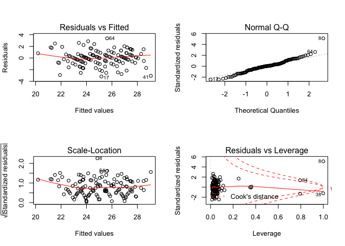<!-- -->

Model 3: Systolic Blood Pressure

Crude:

    ## 
    ## Call:
    ## lm(formula = sbp ~ fuel_used_for_cooking_percent_wood_dung + 
    ##     percent_public_source + percent_private_toilet + percent_employed + 
    ##     percent_without_hs_education + percent_caste, data = total)
    ## 
    ## Residuals:
    ##     Min      1Q  Median      3Q     Max 
    ## -10.155  -3.676   0.209   2.577  11.467 
    ## 
    ## Coefficients:
    ##                                           Estimate Std. Error t value
    ## (Intercept)                             134.984480   2.961484  45.580
    ## fuel_used_for_cooking_percent_wood_dung  -9.929177   9.876059  -1.005
    ## percent_public_source                    -0.019037   0.043768  -0.435
    ## percent_private_toilet                   -0.005609   0.011168  -0.502
    ## percent_employed                        -15.362599   6.024975  -2.550
    ## percent_without_hs_education             -6.419725   2.865845  -2.240
    ## percent_caste                             0.021393   0.050530   0.423
    ##                                         Pr(>|t|)    
    ## (Intercept)                               <2e-16 ***
    ## fuel_used_for_cooking_percent_wood_dung   0.3166    
    ## percent_public_source                     0.6643    
    ## percent_private_toilet                    0.6164    
    ## percent_employed                          0.0120 *  
    ## percent_without_hs_education              0.0268 *  
    ## percent_caste                             0.6727    
    ## ---
    ## Signif. codes:  0 '***' 0.001 '**' 0.01 '*' 0.05 '.' 0.1 ' ' 1
    ## 
    ## Residual standard error: 4.975 on 127 degrees of freedom
    ## Multiple R-squared:  0.173,  Adjusted R-squared:  0.134 
    ## F-statistic: 4.429 on 6 and 127 DF,  p-value: 0.000422

    ##                                              Estimate Std. Error
    ## (Intercept)                             134.984479784 2.96148391
    ## fuel_used_for_cooking_percent_wood_dung  -9.929176576 9.87605928
    ## percent_public_source                    -0.019036948 0.04376766
    ## percent_private_toilet                   -0.005609216 0.01116785
    ## percent_employed                        -15.362598819 6.02497527
    ## percent_without_hs_education             -6.419725079 2.86584461
    ## percent_caste                             0.021393020 0.05053026
    ##                                            t value     Pr(>|t|)
    ## (Intercept)                             45.5800146 1.421460e-80
    ## fuel_used_for_cooking_percent_wood_dung -1.0053784 3.166264e-01
    ## percent_public_source                   -0.4349547 6.643335e-01
    ## percent_private_toilet                  -0.5022648 6.163510e-01
    ## percent_employed                        -2.5498194 1.196654e-02
    ## percent_without_hs_education            -2.2400814 2.682417e-02
    ## percent_caste                            0.4233705 6.727411e-01

    ##                             (Intercept) 
    ##                           134.984479784 
    ## fuel_used_for_cooking_percent_wood_dung 
    ##                            -9.929176576 
    ##                   percent_public_source 
    ##                            -0.019036948 
    ##                  percent_private_toilet 
    ##                            -0.005609216 
    ##                        percent_employed 
    ##                           -15.362598819 
    ##            percent_without_hs_education 
    ##                            -6.419725079 
    ##                           percent_caste 
    ##                             0.021393020

    ##        1        2        3        4        5        6        7        8 
    ## 125.9576 125.9208 125.9316 125.5332 127.1293 125.2959 122.7780 126.0048 
    ##        9       10       11       12       13       14       15       16 
    ## 125.5445 126.2025 122.5719 126.5078 125.6989 126.2815 127.0560 120.3626 
    ##       17       18       19       20       21       22       23       24 
    ## 126.7146 123.1044 125.1414 126.7609 121.4444 125.5733 124.8500 125.9037 
    ##       25       26       27       28       29       30       31       32 
    ## 126.9477 123.6495 127.8514 126.9001 124.0405 125.6186 126.1774 128.3165 
    ##       33       34       35       36       37       38       39       40 
    ## 125.1156 126.1643 125.4690 128.1443 129.6200 127.1372 127.8616 122.8248 
    ##       41       42       43       44       45       46       47       48 
    ## 129.7689 128.0645 127.5957 125.5970 127.6847 126.0617 125.7031 127.1080 
    ##       49       50       51       52       53       54       55       56 
    ## 127.5514 128.2075 127.0039 125.9989 128.0978 127.4627 125.1018 126.3570 
    ##       57       58       59       60       61       62       63       64 
    ## 126.4437 125.8637 125.8049 125.6304 118.4161 125.7830 128.5787 127.7099 
    ##       65       66       67       68       69       70       71       72 
    ## 126.0966 124.6223 124.0787 125.2180 124.3583 122.0712 126.0440 126.8464 
    ##       73       74       75       76       77       78       79       80 
    ## 128.9440 120.6972 125.9114 127.0066 123.4483 123.4744 126.9593 125.1737 
    ##       81       82       83       84       85       86       87       88 
    ## 128.8372 128.6626 123.1542 120.8005 125.5535 124.9338 122.4327 124.8554 
    ##       89       90       91       92       93       94       95       96 
    ## 124.4868 124.5724 128.6508 127.2621 125.5223 124.3287 126.4479 126.1554 
    ##       97       98       99      100      101      102      103      104 
    ## 127.7981 127.4081 122.2607 127.4157 121.6502 128.2693 126.2830 126.4825 
    ##      105      106      107      108      109      110      111      112 
    ## 126.0190 127.7814 127.3527 127.2516 126.8862 127.6822 127.0867 124.5455 
    ##      113      114      115      116      117      118      119      120 
    ## 124.3787 124.1532 127.5811 128.1132 127.7719 129.3186 127.2332 128.4078 
    ##      121      122      123      124      125      126      127      128 
    ## 126.2308 125.9917 122.4927 124.7728 126.9267 127.0472 124.6822 125.4614 
    ##      129      130      131      132      133      134 
    ## 127.3729 125.3510 126.0921 126.5640 126.2525 114.3211

    ## # A tibble: 1 x 11
    ##   r.squared adj.r.squared sigma statistic p.value    df logLik   AIC   BIC
    ##       <dbl>         <dbl> <dbl>     <dbl>   <dbl> <int>  <dbl> <dbl> <dbl>
    ## 1     0.173         0.134  4.98      4.43 4.22e-4     7  -402.  819.  842.
    ## # … with 2 more variables: deviance <dbl>, df.residual <int>

| term                                          | estimate | p.value |
| :-------------------------------------------- | -------: | ------: |
| (Intercept)                                   |  134.984 |   0.000 |
| fuel\_used\_for\_cooking\_percent\_wood\_dung |  \-9.929 |   0.317 |
| percent\_public\_source                       |  \-0.019 |   0.664 |
| percent\_private\_toilet                      |  \-0.006 |   0.616 |
| percent\_employed                             | \-15.363 |   0.012 |
| percent\_without\_hs\_education               |  \-6.420 |   0.027 |
| percent\_caste                                |    0.021 |   0.673 |

| sbp | fuel\_used\_for\_cooking\_percent\_wood\_dung | percent\_public\_source | percent\_private\_toilet | percent\_employed | percent\_without\_hs\_education | percent\_caste |  .fitted |   .se.fit |       .resid |      .hat |   .sigma |   .cooksd |  .std.resid |
| --: | --------------------------------------------: | ----------------------: | -----------------------: | ----------------: | ------------------------------: | -------------: | -------: | --------: | -----------: | --------: | -------: | --------: | ----------: |
| 127 |                                     0.0000000 |               0.0270270 |              100.0000000 |         0.5405405 |                       0.0270270 |      0.5675676 | 125.9576 | 0.9883327 |    1.0424279 | 0.0394593 | 4.994208 | 0.0002682 |   0.2137765 |
| 126 |                                     0.0000000 |               0.0789474 |                0.7368421 |         0.5789474 |                       0.0263158 |      0.2368421 | 125.9208 | 1.0210593 |    0.0791658 | 0.0421158 | 4.995102 | 0.0000017 |   0.0162575 |
| 127 |                                     0.0277778 |               0.0555556 |                0.4722222 |         0.4444444 |                       0.3055556 |      0.7500000 | 125.9316 | 0.6532430 |    1.0683967 | 0.0172382 | 4.994184 | 0.0001176 |   0.2166108 |
| 137 |                                     0.0000000 |               0.1538462 |                0.7692308 |         0.6153846 |                       0.0000000 |      0.4615385 | 125.5332 | 1.2203092 |   11.4667970 | 0.0601566 | 4.882699 | 0.0516776 |   2.3773120 |
| 132 |                                     0.0277778 |               0.1944444 |                0.8333333 |         0.3888889 |                       0.2500000 |      0.3888889 | 127.1293 | 0.8530040 |    4.8706624 | 0.0293931 | 4.975652 | 0.0042715 |   0.9936608 |
| 126 |                                     0.0000000 |               0.3076923 |                0.7435897 |         0.5128205 |                       0.2820513 |      0.4871795 | 125.2959 | 0.5403670 |    0.7040739 | 0.0117956 | 4.994708 | 0.0000346 |   0.1423530 |
| 132 |                                     0.0000000 |               0.1351351 |                0.5405405 |         0.6486486 |                       0.3513514 |      0.9189189 | 122.7780 | 1.0605452 |    9.2219744 | 0.0454362 | 4.923820 | 0.0244729 |   1.8971131 |
| 126 |                                     0.0526316 |               0.3947368 |                0.9473684 |         0.5789474 |                       0.2631579 |    100.0000000 | 126.0048 | 4.9741392 |  \-0.0048274 | 0.9994924 | 4.995070 | 0.5215911 | \-0.0430632 |
| 124 |                                     0.0000000 |               0.2777778 |                0.3611111 |         0.4166667 |                       0.4722222 |      0.0000000 | 125.5445 | 1.0203551 |  \-1.5445465 | 0.0420578 | 4.993128 | 0.0006310 | \-0.3171781 |
| 125 |                                     0.0000000 |               0.1500000 |                0.8500000 |         0.4250000 |                       0.3500000 |      0.0750000 | 126.2025 | 0.7660266 |  \-1.2024526 | 0.0237045 | 4.993930 | 0.0002075 | \-0.2445959 |
| 125 |                                     0.0000000 |               0.1071429 |                0.9285714 |         0.6666667 |                       0.3392857 |      0.6785714 | 122.5719 | 1.1496857 |    2.4281053 | 0.0533952 | 4.990157 | 0.0020274 |   0.5015970 |
| 122 |                                     0.0000000 |               0.0344828 |                0.9137931 |         0.4655172 |                       0.2068966 |      0.4137931 | 126.5078 | 0.5475377 |  \-4.5077764 | 0.0121108 | 4.978739 | 0.0014552 | \-0.9115490 |
| 128 |                                     0.0000000 |               0.3818182 |                0.8000000 |         0.4909091 |                       0.2727273 |      0.8727273 | 125.6989 | 0.5269723 |    2.3010795 | 0.0112181 | 4.990851 | 0.0003506 |   0.4651073 |
| 125 |                                     0.0000000 |               0.1636364 |                0.8909091 |         0.4909091 |                       0.1818182 |      0.6545455 | 126.2815 | 0.5442753 |  \-1.2815079 | 0.0119669 | 4.993786 | 0.0001162 | \-0.2591238 |
| 134 |                                     0.0000000 |               0.0000000 |              100.0000000 |         0.4545455 |                       0.0606061 |      0.2121212 | 127.0560 | 0.8424168 |    6.9439776 | 0.0286680 | 4.955513 | 0.0084552 |   1.4161076 |
| 113 |                                     0.0263158 |               0.8684211 |                0.1315789 |         0.7368421 |                       0.4736842 |      0.8157895 | 120.3626 | 1.5158343 |  \-7.3626357 | 0.0928212 | 4.947408 | 0.0352836 | \-1.5536696 |
| 122 |                                     0.0000000 |               0.2702703 |                0.7837838 |         0.4594595 |                       0.1891892 |      0.5945946 | 126.7146 | 0.5665859 |  \-4.7146245 | 0.0129681 | 4.977184 | 0.0017075 | \-0.9537912 |
| 122 |                                     0.1025641 |               0.0256410 |                0.9487179 |         0.5897436 |                       0.2820513 |      0.6923077 | 123.1044 | 1.0964955 |  \-1.1044177 | 0.0485688 | 4.994088 | 0.0003777 | \-0.2275708 |
| 127 |                                     0.0000000 |               0.2105263 |                0.9473684 |         0.4210526 |                       0.5263158 |      0.6315789 | 125.1414 | 1.1263196 |    1.8585959 | 0.0512468 | 4.992214 | 0.0011349 |   0.3835131 |
| 121 |                                     0.0000000 |               0.0263158 |                0.8947368 |         0.4473684 |                       0.2105263 |      0.2894737 | 126.7609 | 0.5861591 |  \-5.7608901 | 0.0138795 | 4.968299 | 0.0027336 | \-1.1659942 |
| 130 |                                     0.0540541 |               0.7837838 |                0.5675676 |         0.5405405 |                       0.7297297 |      0.1621622 | 121.4444 | 1.3782032 |    8.5556395 | 0.0767309 | 4.931721 | 0.0380245 |   1.7896171 |
| 134 |                                     0.0000000 |               0.1500000 |                0.9000000 |         0.5500000 |                       0.1500000 |      0.4250000 | 125.5733 | 0.6994487 |    8.4267201 | 0.0197631 | 4.937222 | 0.0084286 |   1.7106645 |
| 133 |                                     0.0000000 |               0.6923077 |                0.6666667 |         0.4871795 |                       0.4102564 |      0.0256410 | 124.8500 | 0.7162441 |    8.1499670 | 0.0207236 | 4.940929 | 0.0082835 |   1.6552935 |
| 137 |                                     0.0000000 |               0.8461538 |                0.6923077 |         0.4615385 |                       0.3076923 |      0.2307692 | 125.9037 | 0.5977278 |   11.0963051 | 0.0144328 | 4.894852 | 0.0105580 |   2.2465033 |
| 136 |                                     0.0000000 |               0.5365854 |                0.6585366 |         0.3902439 |                       0.3170732 |      0.3658537 | 126.9477 | 0.8688255 |    9.0522854 | 0.0304936 | 4.927503 | 0.0153416 |   1.8477989 |
| 128 |                                     0.0769231 |               0.3333333 |                0.7179487 |         0.5384615 |                       0.3589744 |      0.7435897 | 123.6495 | 0.8069132 |    4.3504535 | 0.0263025 | 4.979641 | 0.0030301 |   0.8861236 |
| 133 |                                     0.0000000 |               0.4102564 |                0.7179487 |         0.4102564 |                       0.1282051 |      0.2051282 | 127.8514 | 0.7491262 |    5.1486154 | 0.0226701 | 4.973513 | 0.0036308 |   1.0467468 |
| 136 |                                     0.0000000 |               0.1538462 |                0.7948718 |         0.4615385 |                       0.1538462 |      0.0512821 | 126.9001 | 0.5922892 |    9.0998907 | 0.0141713 | 4.927924 | 0.0069683 |   1.8420748 |
| 131 |                                     0.0000000 |               0.9250000 |                0.8250000 |         0.4500000 |                       0.6250000 |      0.1750000 | 124.0405 | 1.2864439 |    6.9595109 | 0.0668537 | 4.953701 | 0.0214600 |   1.4480236 |
| 137 |                                     0.0000000 |               0.2307692 |                0.8974359 |         0.5128205 |                       0.2307692 |      0.1538462 | 125.6186 | 0.5356609 |   11.3813869 | 0.0115911 | 4.889885 | 0.0088692 |   2.3009048 |
| 129 |                                     0.0000000 |               0.1750000 |                0.7750000 |         0.5000000 |                       0.1750000 |      0.2500000 | 126.1774 | 0.5578502 |    2.8226019 | 0.0125713 | 4.988693 | 0.0005928 |   0.5709112 |
| 133 |                                     0.0000000 |               0.1025641 |                0.7948718 |         0.3589744 |                       0.1794872 |      0.2564103 | 128.3165 | 0.9475567 |    4.6834834 | 0.0362705 | 4.976992 | 0.0049434 |   0.9588777 |
| 124 |                                     0.0000000 |               0.0270270 |              100.0000000 |         0.5945946 |                       0.0270270 |      0.0270270 | 125.1156 | 1.1901581 |  \-1.1155975 | 0.0572207 | 4.994058 | 0.0004624 | \-0.2309268 |
| 128 |                                     0.0263158 |               0.4736842 |                0.9210526 |         0.4473684 |                       0.2631579 |      0.8157895 | 126.1643 | 0.6115519 |    1.8356889 | 0.0151081 | 4.992388 | 0.0003029 |   0.3717719 |
| 131 |                                     0.0256410 |               0.2307692 |                0.9743590 |         0.5384615 |                       0.1538462 |      0.4102564 | 125.4690 | 0.6752379 |    5.5310150 | 0.0184186 | 4.970286 | 0.0033749 |   1.1220533 |
| 136 |                                     0.0000000 |               0.0188679 |              100.0000000 |         0.3773585 |                       0.0754717 |      0.1320755 | 128.1443 | 0.9806996 |    7.8556902 | 0.0388522 | 4.943836 | 0.0149779 |   1.6105012 |
| 126 |                                     0.0000000 |               0.0526316 |                0.9473684 |         0.3157895 |                       0.0789474 |      0.0000000 | 129.6200 | 1.1948686 |  \-3.6199964 | 0.0576745 | 4.984047 | 0.0049118 | \-0.7495135 |
| 128 |                                     0.0000000 |               0.0000000 |                0.9750000 |         0.5000000 |                       0.0250000 |      0.0000000 | 127.1372 | 0.8150479 |    0.8627817 | 0.0268355 | 4.994499 | 0.0001217 |   0.1757841 |
| 126 |                                     0.0000000 |               0.0769231 |                0.8846154 |         0.4230769 |                       0.0961538 |      0.0192308 | 127.8616 | 0.7420108 |  \-1.8616225 | 0.0222415 | 4.992290 | 0.0004653 | \-0.3783969 |
| 118 |                                     0.0000000 |               0.8285714 |                0.0285714 |         0.6000000 |                       0.4571429 |      0.4000000 | 122.8248 | 0.9527568 |  \-4.8248125 | 0.0366697 | 4.975873 | 0.0053084 | \-0.9880175 |
| 126 |                                     0.0000000 |               0.0000000 |              100.0000000 |         0.3030303 |                       0.0000000 |      0.0303030 | 129.7689 | 1.2503271 |  \-3.7688735 | 0.0631525 | 4.983047 | 0.0058982 | \-0.7826164 |
| 126 |                                     0.0000000 |               0.0000000 |              100.0000000 |         0.4000000 |                       0.0333333 |      0.0000000 | 128.0645 | 0.9124791 |  \-2.0645278 | 0.0336348 | 4.991602 | 0.0008859 | \-0.4221064 |
| 121 |                                     0.0000000 |               0.0000000 |              100.0000000 |         0.4444444 |                       0.0000000 |      0.0000000 | 127.5957 | 0.8626925 |  \-6.5957365 | 0.0300646 | 4.959347 | 0.0080231 | \-1.3460577 |
| 128 |                                     0.0000000 |               0.0263158 |              100.0000000 |         0.5526316 |                       0.0526316 |      0.0789474 | 125.5970 | 1.0156033 |    2.4029914 | 0.0416670 | 4.990318 | 0.0015119 |   0.4933621 |
| 124 |                                     0.0000000 |               0.0000000 |              100.0000000 |         0.3947368 |                       0.1052632 |      0.0526316 | 127.6847 | 0.9451064 |  \-3.6847398 | 0.0360832 | 4.983904 | 0.0030429 | \-0.7543256 |
| 126 |                                     0.0000000 |               0.0000000 |                0.9666667 |         0.5666667 |                       0.0333333 |      0.1000000 | 126.0617 | 0.9613853 |  \-0.0617333 | 0.0373369 | 4.995104 | 0.0000009 | \-0.0126460 |
| 132 |                                     0.0400000 |               0.0000000 |              100.0000000 |         0.5000000 |                       0.1000000 |      0.0000000 | 125.7031 | 0.9235815 |    6.2968808 | 0.0344583 | 4.962376 | 0.0084576 |   1.2879878 |
| 129 |                                     0.0000000 |               0.0000000 |              100.0000000 |         0.4761905 |                       0.0000000 |      0.0000000 | 127.1080 | 0.8717622 |    1.8919651 | 0.0307001 | 4.992172 | 0.0006750 |   0.3862387 |
| 126 |                                     0.0000000 |               0.0000000 |              100.0000000 |         0.4473684 |                       0.0000000 |      0.0263158 | 127.5514 | 0.8617591 |  \-1.5513796 | 0.0299996 | 4.993135 | 0.0004428 | \-0.3165949 |
| 130 |                                     0.0000000 |               0.0000000 |                0.9855072 |         0.4347826 |                       0.0144928 |      0.0434783 | 128.2075 | 0.8499436 |    1.7925483 | 0.0291826 | 4.992477 | 0.0005742 |   0.3656570 |
| 127 |                                     0.0000000 |               0.0000000 |              100.0000000 |         0.4615385 |                       0.0512821 |      0.0000000 | 127.0039 | 0.8428355 |  \-0.0039113 | 0.0286965 | 4.995107 | 0.0000000 | \-0.0007977 |
| 127 |                                     0.0000000 |               0.0000000 |              100.0000000 |         0.5483871 |                       0.0000000 |      0.0000000 | 125.9989 | 1.0335150 |    1.0010928 | 0.0431496 | 4.994275 | 0.0002726 |   0.2056952 |
| 123 |                                     0.0000000 |               0.0000000 |              100.0000000 |         0.4117647 |                       0.0000000 |      0.0000000 | 128.0978 | 0.8969236 |  \-5.0977822 | 0.0324978 | 4.973723 | 0.0052067 | \-1.0416627 |
| 132 |                                     0.0000000 |               0.1304348 |                0.8695652 |         0.4347826 |                       0.1304348 |      0.1086957 | 127.4627 | 0.6705423 |    4.5373018 | 0.0181633 | 4.978421 | 0.0022385 |   0.9203433 |
| 127 |                                     0.0000000 |               0.0000000 |              100.0000000 |         0.5641026 |                       0.1025641 |      0.1282051 | 125.1018 | 1.0438100 |    1.8982139 | 0.0440136 | 4.992112 | 0.0010014 |   0.3902034 |
| 121 |                                     0.0000000 |               0.1315789 |                0.9736842 |         0.4736842 |                       0.2105263 |      0.4210526 | 126.3570 | 0.5347148 |  \-5.3569793 | 0.0115502 | 4.971989 | 0.0019578 | \-1.0829651 |
| 117 |                                     0.0000000 |               0.0500000 |                0.9500000 |         0.5250000 |                       0.0750000 |      0.5750000 | 126.4437 | 0.7520616 |  \-9.4436564 | 0.0228481 | 4.922067 | 0.0123155 | \-1.9201314 |
| 122 |                                     0.0000000 |               0.0243902 |                0.8536585 |         0.5121951 |                       0.1951220 |      0.2682927 | 125.8637 | 0.5534137 |  \-3.8636892 | 0.0123721 | 4.983085 | 0.0010927 | \-0.7814070 |
| 118 |                                     0.0000000 |               0.4594595 |                0.4324324 |         0.4054054 |                       0.4594595 |      0.4324324 | 125.8049 | 1.0348470 |  \-7.8048745 | 0.0432609 | 4.944267 | 0.0166145 | \-1.6037659 |
| 125 |                                     0.0000000 |               0.0512821 |                0.8717949 |         0.5128205 |                       0.2307692 |      0.5384615 | 125.6304 | 0.5337498 |  \-0.6304019 | 0.0115085 | 4.994788 | 0.0000270 | \-0.1274392 |
| 120 |                                     0.2549020 |               0.3421053 |                0.7894737 |         0.6052632 |                       0.7368421 |      0.1052632 | 118.4161 | 2.4432276 |    1.5839147 | 0.2411412 | 4.992480 | 0.0060626 |   0.3654459 |
| 129 |                                     0.0000000 |               0.1538462 |                0.8974359 |         0.5128205 |                       0.2051282 |      0.0769231 | 125.7830 | 0.5481388 |    3.2169598 | 0.0121374 | 4.986778 | 0.0007428 |   0.6505327 |
| 124 |                                     0.0000000 |               0.0000000 |                0.8333333 |         0.4166667 |                       0.0000000 |      0.0000000 | 128.5787 | 0.9125733 |  \-4.5787226 | 0.0336418 | 4.977842 | 0.0043585 | \-0.9361535 |
| 123 |                                     0.0000000 |               0.0000000 |                0.9729730 |         0.4054054 |                       0.1621622 |      0.0000000 | 127.7099 | 0.7428027 |  \-4.7099051 | 0.0222890 | 4.977050 | 0.0029850 | \-0.9573675 |
| 125 |                                     0.0000000 |               0.2666667 |                0.8000000 |         0.4666667 |                       0.2666667 |      0.1333333 | 126.0966 | 0.5531933 |  \-1.0966288 | 0.0123622 | 4.994140 | 0.0000880 | \-0.2217852 |
| 125 |                                     0.0256410 |               0.0512821 |                0.8974359 |         0.4871795 |                       0.4102564 |      0.7692308 | 124.6223 | 0.6829417 |    0.3777449 | 0.0188413 | 4.994991 | 0.0000161 |   0.0766480 |
| 124 |                                     0.0500000 |               0.2500000 |                0.7000000 |         0.5000000 |                       0.4250000 |      0.4250000 | 124.0787 | 0.7380917 |  \-0.0787447 | 0.0220072 | 4.995102 | 0.0000008 | \-0.0160039 |
| 125 |                                     0.0000000 |               0.2500000 |                0.6500000 |         0.5000000 |                       0.3250000 |      0.4500000 | 125.2180 | 0.5707481 |  \-0.2179914 | 0.0131593 | 4.995069 | 0.0000037 | \-0.0441050 |
| 128 |                                     0.0000000 |               0.1351351 |                0.8918919 |         0.5675676 |                       0.2972973 |      0.4324324 | 124.3583 | 0.6838411 |    3.6417243 | 0.0188910 | 4.984357 | 0.0015020 |   0.7389588 |
| 124 |                                     0.0000000 |               0.2500000 |                0.8888889 |         0.6666667 |                       0.4166667 |      0.6111111 | 122.0712 | 1.1855294 |    1.9288099 | 0.0567765 | 4.991973 | 0.0013701 |   0.3991663 |
| 119 |                                     0.0000000 |               0.0000000 |              100.0000000 |         0.5454545 |                       0.0000000 |      0.0000000 | 126.0440 | 1.0238466 |  \-7.0439588 | 0.0423461 | 4.953775 | 0.0132213 | \-1.4467194 |
| 129 |                                     0.0000000 |               0.0000000 |                0.9607843 |         0.5294118 |                       0.0000000 |      0.0196078 | 126.8464 | 0.9241762 |    2.1536305 | 0.0345027 | 4.991289 | 0.0009907 |   0.4405219 |
| 121 |                                     0.0000000 |               0.0000000 |                0.9285714 |         0.3928571 |                       0.0000000 |      0.0000000 | 128.9440 | 0.9719673 |  \-7.9439645 | 0.0381634 | 4.942709 | 0.0150233 | \-1.6280152 |
| 121 |                                     0.0975610 |               0.3414634 |                0.2439024 |         0.5609756 |                       0.7317073 |      0.2195122 | 120.6972 | 1.4611018 |    0.3027959 | 0.0862392 | 4.995027 | 0.0000546 |   0.0636657 |
| 124 |                                     0.0000000 |               0.0000000 |                0.9333333 |         0.5833333 |                       0.0166667 |      0.0333333 | 125.9114 | 1.0571665 |  \-1.9114462 | 0.0451472 | 4.992066 | 0.0010441 | \-0.3931567 |
| 125 |                                     0.0000000 |               0.0750000 |                0.9000000 |         0.4250000 |                       0.2250000 |      0.1000000 | 127.0066 | 0.6578594 |  \-2.0066004 | 0.0174827 | 4.991850 | 0.0004208 | \-0.4068765 |
| 114 |                                     0.0000000 |               0.5263158 |                0.5789474 |         0.5526316 |                       0.4736842 |      0.3684211 | 123.4483 | 0.8642836 |  \-9.4483149 | 0.0301756 | 4.921438 | 0.0165281 | \-1.9283222 |
| 127 |                                     0.0000000 |               0.6000000 |                0.3500000 |         0.5500000 |                       0.4750000 |      0.1000000 | 123.4744 | 0.8634877 |    3.5255651 | 0.0301201 | 4.984915 | 0.0022968 |   0.7195178 |
| 127 |                                     0.0000000 |               0.0263158 |                0.9736842 |         0.5000000 |                       0.0526316 |      0.0000000 | 126.9593 | 0.7560340 |    0.0406625 | 0.0230901 | 4.995106 | 0.0000002 |   0.0082687 |
| 126 |                                     0.0256410 |               0.0000000 |              100.0000000 |         0.5641026 |                       0.0512821 |      0.0000000 | 125.1737 | 1.0617966 |    0.8263342 | 0.0455435 | 4.994538 | 0.0001970 |   0.1700002 |
| 132 |                                     0.0000000 |               0.0303030 |              100.0000000 |         0.3636364 |                       0.0000000 |      0.0303030 | 128.8372 | 1.0171324 |    3.1627700 | 0.0417925 | 4.986807 | 0.0026276 |   0.6493960 |
| 131 |                                     0.0000000 |               0.0000000 |              100.0000000 |         0.3750000 |                       0.0000000 |      0.0000000 | 128.6626 | 0.9823001 |    2.3374164 | 0.0389791 | 4.990589 | 0.0013307 |   0.4792272 |
| 115 |                                     0.0000000 |               0.9750000 |                0.0000000 |         0.5500000 |                       0.5250000 |      0.3750000 | 123.1542 | 0.9663141 |  \-8.1541561 | 0.0377207 | 4.939910 | 0.0156308 | \-1.6707069 |
| 121 |                                     0.0000000 |             100.0000000 |                0.0000000 |         0.5405405 |                       0.6216216 |      0.6756757 | 120.8005 | 4.4310862 |    0.1995077 | 0.7931658 | 4.994954 | 0.0042588 |   0.0881699 |
| 120 |                                     0.0000000 |               0.2931034 |                0.6896552 |         0.5344828 |                       0.1896552 |      0.3275862 | 125.5535 | 0.6077069 |  \-5.5534614 | 0.0149187 | 4.970173 | 0.0027363 | \-1.1246037 |
| 126 |                                     0.0000000 |               0.0000000 |                0.9148936 |         0.5744681 |                       0.1914894 |      0.4255319 | 124.9338 | 0.7455457 |    1.0661804 | 0.0224539 | 4.994183 | 0.0001541 |   0.2167374 |
| 124 |                                     0.0000000 |               0.1666667 |                0.8333333 |         0.6666667 |                       0.3611111 |      0.7500000 | 122.4327 | 1.1551950 |    1.5672892 | 0.0539081 | 4.993044 | 0.0008538 |   0.3238577 |
| 128 |                                     0.0000000 |               0.0000000 |                0.7068966 |         0.5517241 |                       0.2586207 |      0.5172414 | 124.8554 | 0.6238633 |    3.1446103 | 0.0157225 | 4.987119 | 0.0009261 |   0.6370593 |
| 125 |                                     0.0000000 |               0.0869565 |                0.7391304 |         0.5652174 |                       0.2826087 |      0.2608696 | 124.4868 | 0.6732412 |    0.5132189 | 0.0183099 | 4.994894 | 0.0000289 |   0.1041088 |
| 125 |                                     0.0000000 |               0.0000000 |                0.9743590 |         0.5384615 |                       0.3333333 |      0.2564103 | 124.5724 | 0.6217195 |    0.4275772 | 0.0156147 | 4.994959 | 0.0000170 |   0.0866171 |
| 128 |                                     0.0175439 |               0.0000000 |                0.9824561 |         0.3859649 |                       0.0350877 |      0.0350877 | 128.6508 | 0.9771349 |  \-0.6508459 | 0.0385703 | 4.994757 | 0.0001020 | \-0.1334109 |
| 125 |                                     0.0000000 |               0.0000000 |              100.0000000 |         0.4531250 |                       0.0312500 |      0.0156250 | 127.2621 | 0.8471510 |  \-2.2620984 | 0.0289911 | 4.990919 | 0.0009080 | \-0.4613937 |
| 120 |                                     0.0169492 |               0.1355932 |                0.7796610 |         0.4915254 |                       0.2711864 |      0.2372881 | 125.5223 | 0.5145206 |  \-5.5222601 | 0.0106942 | 4.970558 | 0.0019229 | \-1.1158951 |
| 123 |                                     0.0000000 |               0.2131148 |                0.9672131 |         0.5081967 |                       0.4426230 |      0.1147541 | 124.3287 | 0.7696319 |  \-1.3287124 | 0.0239282 | 4.993670 | 0.0002559 | \-0.2703099 |
| 132 |                                     0.0000000 |               0.0800000 |                0.9800000 |         0.4800000 |                       0.1800000 |      0.0000000 | 126.4479 | 0.5490671 |    5.5521382 | 0.0121785 | 4.970254 | 0.0022203 |   1.1227752 |
| 116 |                                     0.0000000 |               0.0526316 |                0.8684211 |         0.5526316 |                       0.0526316 |      0.2105263 | 126.1554 | 0.8752804 | \-10.1553730 | 0.0309484 | 4.909832 | 0.0196147 | \-2.0734531 |
| 124 |                                     0.0000000 |               0.0000000 |              100.0000000 |         0.4000000 |                       0.0750000 |      0.0500000 | 127.7981 | 0.9180450 |  \-3.7981089 | 0.0340464 | 4.983229 | 0.0030377 | \-0.7767139 |
| 128 |                                     0.0000000 |               0.0285714 |                0.9142857 |         0.4571429 |                       0.0857143 |      0.1142857 | 127.4081 | 0.6899306 |    0.5919121 | 0.0192289 | 4.994823 | 0.0000404 |   0.1201283 |
| 118 |                                     0.0540541 |               0.1081081 |                0.1351351 |         0.5675676 |                       0.5405405 |      0.2432432 | 122.2607 | 0.9715286 |  \-4.2607207 | 0.0381289 | 4.980091 | 0.0043175 | \-0.8731652 |
| 133 |                                     0.0000000 |               0.0175439 |              100.0000000 |         0.4561404 |                       0.0000000 |      0.0000000 | 127.4157 | 0.8611529 |    5.5842770 | 0.0299574 | 4.969503 | 0.0057293 |   1.1395761 |
| 118 |                                     0.0416667 |               0.2708333 |                0.3125000 |         0.5625000 |                       0.6666667 |      0.3541667 | 121.6502 | 1.2319976 |  \-3.6501535 | 0.0613145 | 4.983818 | 0.0053505 | \-0.7572214 |
| 132 |                                     0.0000000 |               0.0000000 |              100.0000000 |         0.3859649 |                       0.0350877 |      0.0175439 | 128.2693 | 0.9473919 |    3.7307441 | 0.0362579 | 4.983620 | 0.0031356 |   0.7638127 |
| 124 |                                     0.0000000 |               0.0000000 |              100.0000000 |         0.4871795 |                       0.1025641 |      0.1025641 | 126.2830 | 0.8608588 |  \-2.2829760 | 0.0299369 | 4.990837 | 0.0009569 | \-0.4658790 |
| 128 |                                     0.0000000 |               0.0000000 |              100.0000000 |         0.4102564 |                       0.2564103 |      0.3589744 | 126.4825 | 1.0800168 |    1.5174503 | 0.0471199 | 4.993187 | 0.0006896 |   0.3124404 |
| 120 |                                     0.0000000 |               0.0000000 |              100.0000000 |         0.5333333 |                       0.0333333 |      0.1333333 | 126.0190 | 0.9639551 |  \-6.0190337 | 0.0375368 | 4.965113 | 0.0084720 | \-1.2331233 |
| 128 |                                     0.0000000 |               0.0000000 |              100.0000000 |         0.4324324 |                       0.0000000 |      0.0540541 | 127.7814 | 0.8702982 |    0.2185714 | 0.0305971 | 4.995068 | 0.0000090 |   0.0446183 |
| 119 |                                     0.0000000 |               0.0697674 |                0.9302326 |         0.4186047 |                       0.1860465 |      0.0000000 | 127.3527 | 0.6839255 |  \-8.3527110 | 0.0188956 | 4.938291 | 0.0079037 | \-1.6948905 |
| 134 |                                     0.0000000 |               0.0750000 |              100.0000000 |         0.4250000 |                       0.1000000 |      0.0250000 | 127.2516 | 0.8780366 |    6.7484118 | 0.0311436 | 4.957624 | 0.0087196 |   1.3779824 |
| 123 |                                     0.0161290 |               0.1774194 |                0.7903226 |         0.4354839 |                       0.1935484 |      0.1129032 | 126.8862 | 0.6380936 |  \-3.8862451 | 0.0164480 | 4.982893 | 0.0014819 | \-0.7875957 |
| 130 |                                     0.0000000 |               0.0000000 |                0.9000000 |         0.4750000 |                       0.0000000 |      0.0000000 | 127.6822 | 0.8536064 |    2.3178029 | 0.0294347 | 4.990708 | 0.0009687 |   0.4728636 |
| 125 |                                     0.0000000 |               0.1621622 |                0.6756757 |         0.3783784 |                       0.3243243 |      0.1891892 | 127.0867 | 0.9330357 |  \-2.0867018 | 0.0351674 | 4.991520 | 0.0009493 | \-0.4269787 |
| 130 |                                     0.0000000 |               0.0555556 |              100.0000000 |         0.5277778 |                       0.2777778 |      0.6666667 | 124.5455 | 1.0732491 |    5.4545327 | 0.0465312 | 4.970256 | 0.0087880 |   1.1227320 |
| 115 |                                     0.0000000 |               0.1282051 |              100.0000000 |         0.4615385 |                       0.4615385 |      0.5128205 | 124.3787 | 1.4143891 |  \-9.3787081 | 0.0808130 | 4.918498 | 0.0485518 | \-1.9661330 |
| 121 |                                     0.0000000 |               0.6052632 |                0.7105263 |         0.4736842 |                       0.5526316 |      0.4210526 | 124.1532 | 1.0580463 |  \-3.1532162 | 0.0452223 | 4.986827 | 0.0028464 | \-0.6485962 |
| 130 |                                     0.0000000 |               0.0476190 |                0.9523810 |         0.4285714 |                       0.1269841 |      0.0952381 | 127.5811 | 0.6903191 |    2.4189055 | 0.0192506 | 4.990365 | 0.0006758 |   0.4909211 |
| 135 |                                     0.0000000 |               0.0000000 |                0.9444444 |         0.3888889 |                       0.1388889 |      0.0000000 | 128.1132 | 0.8220520 |    6.8867903 | 0.0272987 | 4.956220 | 0.0078970 |   1.4034564 |
| 129 |                                     0.0000000 |               0.0000000 |                0.9473684 |         0.4473684 |                       0.0526316 |      0.1578947 | 127.7719 | 0.7594299 |    1.2280782 | 0.0232980 | 4.993880 | 0.0002126 |   0.2497565 |
| 127 |                                     0.0000000 |               0.0263158 |                0.9736842 |         0.3684211 |                       0.0000000 |      0.0000000 | 129.3186 | 1.0502988 |  \-2.3186124 | 0.0445625 | 4.990635 | 0.0015145 | \-0.4767589 |
| 133 |                                     0.0000000 |               0.0000000 |              100.0000000 |         0.4358974 |                       0.0769231 |      0.0000000 | 127.2332 | 0.8557463 |    5.7667843 | 0.0295824 | 4.967808 | 0.0060288 |   1.1765928 |
| 129 |                                     0.0000000 |               0.0000000 |                0.9000000 |         0.4000000 |                       0.0666667 |      0.0666667 | 128.4078 | 0.8497485 |    0.5921635 | 0.0291692 | 4.994820 | 0.0000626 |   0.1207930 |
| 126 |                                     0.0000000 |               0.0810811 |                0.8918919 |         0.5135135 |                       0.1351351 |      0.4324324 | 126.2308 | 0.6246721 |  \-0.2307520 | 0.0157633 | 4.995064 | 0.0000050 | \-0.0467485 |
| 118 |                                     0.0500000 |               0.0250000 |              100.0000000 |         0.4750000 |                       0.1000000 |      0.2000000 | 125.9917 | 0.9462953 |  \-7.9916951 | 0.0361740 | 4.942184 | 0.0143524 | \-1.6361058 |
| 119 |                                     0.1724138 |               0.8275862 |                0.0000000 |         0.5862069 |                       0.2758621 |      0.5862069 | 122.4927 | 1.6554718 |  \-3.4927188 | 0.1107101 | 4.984197 | 0.0098554 | \-0.7444126 |
| 119 |                                     0.0000000 |               0.2162162 |                0.7297297 |         0.5405405 |                       0.2972973 |      0.4324324 | 124.7728 | 0.5992736 |  \-5.7728471 | 0.0145075 | 4.968170 | 0.0028728 | \-1.1687865 |
| 133 |                                     0.0270270 |               0.0000000 |              100.0000000 |         0.4594595 |                       0.0270270 |      0.1621622 | 126.9267 | 0.8866998 |    6.0733263 | 0.0317612 | 4.964751 | 0.0072116 |   1.2405297 |
| 126 |                                     0.0000000 |               0.3333333 |                0.6944444 |         0.3888889 |                       0.3055556 |      0.4166667 | 127.0472 | 0.8630617 |  \-1.0472260 | 0.0300904 | 4.994209 | 0.0002024 | \-0.2137207 |
| 125 |                                     0.0256410 |               0.1538462 |                0.4102564 |         0.4615385 |                       0.4615385 |      0.5128205 | 124.6822 | 0.8350300 |    0.3177539 | 0.0281675 | 4.995024 | 0.0000174 |   0.0647839 |
| 121 |                                     0.0000000 |               0.0000000 |                0.9487179 |         0.5128205 |                       0.2564103 |      0.3076923 | 125.4614 | 0.5324165 |  \-4.4614015 | 0.0114511 | 4.979086 | 0.0013460 | \-0.9018702 |
| 130 |                                     0.0000000 |               0.0000000 |                0.9117647 |         0.4705882 |                       0.0588235 |      0.0294118 | 127.3729 | 0.7296993 |    2.6270944 | 0.0215096 | 4.989500 | 0.0008948 |   0.5337885 |
| 126 |                                     0.0000000 |               0.0263158 |                0.9210526 |         0.6052632 |                       0.0526316 |      0.3947368 | 125.3510 | 1.0766227 |    0.6490383 | 0.0468242 | 4.994756 | 0.0001253 |   0.1336151 |
| 118 |                                     0.0000000 |               0.0000000 |                0.9714286 |         0.5428571 |                       0.0857143 |      0.1428571 | 126.0921 | 0.7808486 |  \-8.0921283 | 0.0246307 | 4.941484 | 0.0097839 | \-1.6468348 |
| 121 |                                     0.0000000 |               0.0000000 |                0.9090909 |         0.4848485 |                       0.1515152 |      0.2727273 | 126.5640 | 0.5763756 |  \-5.5639966 | 0.0134201 | 4.970116 | 0.0024633 | \-1.1258811 |
| 118 |                                     0.0000000 |               0.0000000 |              100.0000000 |         0.4705882 |                       0.1470588 |      0.1176471 | 126.2525 | 0.8735760 |  \-8.2525395 | 0.0308280 | 4.938966 | 0.0128992 | \-1.6848412 |
| 114 |                                     0.5526316 |             100.0000000 |                0.0000000 |         0.5789474 |                       0.6842105 |      0.6578947 | 114.3211 | 4.4324034 |  \-0.3211032 | 0.7936375 | 4.994710 | 0.0110891 | \-0.1420695 |

    ## Warning in sqrt(crit * p * (1 - hh)/hh): NaNs produced
    
    ## Warning in sqrt(crit * p * (1 - hh)/hh): NaNs produced

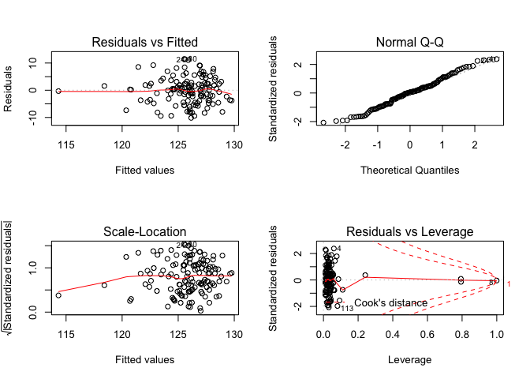<!-- -->

Age as a confounder:

    ## 
    ## Call:
    ## lm(formula = sbp ~ fuel_used_for_cooking_percent_wood_dung + 
    ##     percent_public_source + percent_private_toilet + percent_employed + 
    ##     percent_without_hs_education + percent_caste + median_age, 
    ##     data = total)
    ## 
    ## Residuals:
    ##      Min       1Q   Median       3Q      Max 
    ## -10.3002  -3.4341   0.2496   2.6973  11.6135 
    ## 
    ## Coefficients:
    ##                                          Estimate Std. Error t value
    ## (Intercept)                             113.72289    6.84481  16.614
    ## fuel_used_for_cooking_percent_wood_dung -12.81187    9.52335  -1.345
    ## percent_public_source                    -0.02112    0.04204  -0.502
    ## percent_private_toilet                   -0.01625    0.01117  -1.455
    ## percent_employed                         -6.77921    6.30917  -1.075
    ## percent_without_hs_education             -0.95053    3.18460  -0.298
    ## percent_caste                             0.02865    0.04858   0.590
    ## median_age                                0.36362    0.10647   3.415
    ##                                         Pr(>|t|)    
    ## (Intercept)                              < 2e-16 ***
    ## fuel_used_for_cooking_percent_wood_dung 0.180941    
    ## percent_public_source                   0.616339    
    ## percent_private_toilet                  0.148258    
    ## percent_employed                        0.284652    
    ## percent_without_hs_education            0.765831    
    ## percent_caste                           0.556456    
    ## median_age                              0.000858 ***
    ## ---
    ## Signif. codes:  0 '***' 0.001 '**' 0.01 '*' 0.05 '.' 0.1 ' ' 1
    ## 
    ## Residual standard error: 4.779 on 126 degrees of freedom
    ## Multiple R-squared:  0.2431, Adjusted R-squared:  0.2011 
    ## F-statistic: 5.781 on 7 and 126 DF,  p-value: 8.008e-06

    ##                                             Estimate Std. Error    t value
    ## (Intercept)                             113.72288569 6.84480771 16.6144749
    ## fuel_used_for_cooking_percent_wood_dung -12.81186685 9.52335288 -1.3453105
    ## percent_public_source                    -0.02111777 0.04204287 -0.5022913
    ## percent_private_toilet                   -0.01624798 0.01116983 -1.4546313
    ## percent_employed                         -6.77920993 6.30917415 -1.0745004
    ## percent_without_hs_education             -0.95052896 3.18459562 -0.2984771
    ## percent_caste                             0.02864726 0.04858034  0.5896884
    ## median_age                                0.36361782 0.10647387  3.4150897
    ##                                             Pr(>|t|)
    ## (Intercept)                             1.532266e-33
    ## fuel_used_for_cooking_percent_wood_dung 1.809412e-01
    ## percent_public_source                   6.163393e-01
    ## percent_private_toilet                  1.482580e-01
    ## percent_employed                        2.846518e-01
    ## percent_without_hs_education            7.658307e-01
    ## percent_caste                           5.564555e-01
    ## median_age                              8.584613e-04

    ##                             (Intercept) 
    ##                            113.72288569 
    ## fuel_used_for_cooking_percent_wood_dung 
    ##                            -12.81186685 
    ##                   percent_public_source 
    ##                             -0.02111777 
    ##                  percent_private_toilet 
    ##                             -0.01624798 
    ##                        percent_employed 
    ##                             -6.77920993 
    ##            percent_without_hs_education 
    ##                             -0.95052896 
    ##                           percent_caste 
    ##                              0.02864726 
    ##                              median_age 
    ##                              0.36361782

    ##        1        2        3        4        5        6        7        8 
    ## 124.0887 125.3635 126.5602 126.6665 129.5764 123.9217 125.0055 126.1062 
    ##        9       10       11       12       13       14       15       16 
    ## 127.7903 124.4844 123.4277 124.2970 124.8364 123.4652 127.5757 121.7798 
    ##       17       18       19       20       21       22       23       24 
    ## 126.6324 121.8709 126.8058 125.4681 122.7340 125.1272 124.7367 126.7817 
    ##       25       26       27       28       29       30       31       32 
    ## 126.0097 123.6567 127.0097 126.8612 124.8858 125.3865 123.7117 127.4551 
    ##       33       34       35       36       37       38       39       40 
    ## 123.4316 126.5692 125.2990 126.6782 130.3412 128.0564 127.5862 123.6032 
    ##       41       42       43       44       45       46       47       48 
    ## 131.4320 128.0689 126.6330 125.4221 128.4517 126.5026 127.0382 126.9988 
    ##       49       50       51       52       53       54       55       56 
    ## 127.9359 129.3283 130.2714 127.1244 130.3751 128.6604 125.5032 123.5388 
    ##       57       58       59       60       61       62       63       64 
    ## 123.2736 124.3548 122.2970 123.6955 119.8367 125.4476 131.2776 127.4819 
    ##       65       66       67       68       69       70       71       72 
    ## 124.3509 124.7003 123.6290 124.2843 123.9752 122.7438 126.1102 127.9646 
    ##       73       74       75       76       77       78       79       80 
    ## 128.7709 121.2727 125.4526 128.2227 124.3002 124.7629 130.3807 127.4108 
    ##       81       82       83       84       85       86       87       88 
    ## 129.6431 127.1610 122.7030 121.1042 123.9419 124.1266 123.3487 125.2629 
    ##       89       90       91       92       93       94       95       96 
    ## 123.5838 124.6928 128.3124 125.2234 124.3100 125.5114 127.3484 124.5098 
    ##       97       98       99      100      101      102      103      104 
    ## 126.6429 128.2539 123.7959 128.4048 121.5741 128.0953 127.2360 127.3296 
    ##      105      106      107      108      109      110      111      112 
    ## 127.9930 126.7004 124.8220 127.2474 125.8380 129.7235 126.3188 124.3035 
    ##      113      114      115      116      117      118      119      120 
    ## 121.7353 124.4519 126.9362 129.1302 128.6378 132.1648 128.3976 131.3462 
    ##      121      122      123      124      125      126      127      128 
    ## 124.6639 123.3013 120.6682 122.9014 126.5217 128.0514 124.7772 126.3122 
    ##      129      130      131      132      133      134 
    ## 128.7292 124.7800 126.8838 125.9206 123.6798 114.0217

    ## # A tibble: 1 x 11
    ##   r.squared adj.r.squared sigma statistic p.value    df logLik   AIC   BIC
    ##       <dbl>         <dbl> <dbl>     <dbl>   <dbl> <int>  <dbl> <dbl> <dbl>
    ## 1     0.243         0.201  4.78      5.78 8.01e-6     8  -396.  809.  835.
    ## # … with 2 more variables: deviance <dbl>, df.residual <int>

| term                                          | estimate | p.value |
| :-------------------------------------------- | -------: | ------: |
| (Intercept)                                   |  113.723 |   0.000 |
| fuel\_used\_for\_cooking\_percent\_wood\_dung | \-12.812 |   0.181 |
| percent\_public\_source                       |  \-0.021 |   0.616 |
| percent\_private\_toilet                      |  \-0.016 |   0.148 |
| percent\_employed                             |  \-6.779 |   0.285 |
| percent\_without\_hs\_education               |  \-0.951 |   0.766 |
| percent\_caste                                |    0.029 |   0.556 |
| median\_age                                   |    0.364 |   0.001 |

| sbp | fuel\_used\_for\_cooking\_percent\_wood\_dung | percent\_public\_source | percent\_private\_toilet | percent\_employed | percent\_without\_hs\_education | percent\_caste | median\_age |  .fitted |   .se.fit |       .resid |      .hat |   .sigma |     .cooksd |  .std.resid |
| --: | --------------------------------------------: | ----------------------: | -----------------------: | ----------------: | ------------------------------: | -------------: | ----------: | -------: | --------: | -----------: | --------: | -------: | ----------: | ----------: |
| 127 |                                     0.0000000 |               0.0270270 |              100.0000000 |         0.5405405 |                       0.0270270 |      0.5675676 |    43.08108 | 124.0887 | 1.0957254 |    2.9113027 | 0.0525727 | 4.790445 |   0.0027171 |   0.6258823 |
| 126 |                                     0.0000000 |               0.0789474 |                0.7368421 |         0.5789474 |                       0.0263158 |      0.2368421 |    42.89474 | 125.3635 | 0.9942044 |    0.6364980 | 0.0432821 | 4.797555 |   0.0001049 |   0.1361706 |
| 127 |                                     0.0277778 |               0.0555556 |                0.4722222 |         0.4444444 |                       0.3055556 |      0.7500000 |    45.33333 | 126.5602 | 0.6538779 |    0.4397739 | 0.0187219 | 4.797744 |   0.0000206 |   0.0928991 |
| 137 |                                     0.0000000 |               0.1538462 |                0.7692308 |         0.6153846 |                       0.0000000 |      0.4615385 |    47.07692 | 126.6665 | 1.2181723 |   10.3334534 | 0.0649792 | 4.701736 |   0.0434399 |   2.2362128 |
| 132 |                                     0.0277778 |               0.1944444 |                0.8333333 |         0.3888889 |                       0.2500000 |      0.3888889 |    52.50000 | 129.5764 | 1.0884434 |    2.4235615 | 0.0518762 | 4.792741 |   0.0018553 |   0.5208346 |
| 126 |                                     0.0000000 |               0.3076923 |                0.7435897 |         0.5128205 |                       0.2820513 |      0.4871795 |    38.35897 | 123.9217 | 0.6567457 |    2.0783469 | 0.0188865 | 4.794237 |   0.0004639 |   0.4390730 |
| 132 |                                     0.0000000 |               0.1351351 |                0.5405405 |         0.6486486 |                       0.3513514 |      0.9189189 |    44.00000 | 125.0055 | 1.2095643 |    6.9945374 | 0.0640641 | 4.754130 |   0.0195842 |   1.5129140 |
| 126 |                                     0.0526316 |               0.3947368 |                0.9473684 |         0.5789474 |                       0.2631579 |    100.0000000 |    39.57895 | 126.1062 | 4.7777105 |  \-0.1062398 | 0.9995310 | 4.777804 | 280.6880417 | \-1.0265075 |
| 124 |                                     0.0000000 |               0.2777778 |                0.3611111 |         0.4166667 |                       0.4722222 |      0.0000000 |    47.72222 | 127.7903 | 1.1802143 |  \-3.7902708 | 0.0609928 | 4.785137 |   0.0054394 | \-0.8184913 |
| 125 |                                     0.0000000 |               0.1500000 |                0.8500000 |         0.4250000 |                       0.3500000 |      0.0750000 |    38.47500 | 124.4844 | 0.8913089 |    0.5155981 | 0.0347867 | 4.797679 |   0.0000543 |   0.1098191 |
| 125 |                                     0.0000000 |               0.1071429 |                0.9285714 |         0.6666667 |                       0.3392857 |      0.6785714 |    40.00000 | 123.4277 | 1.1323415 |    1.5722867 | 0.0561451 | 4.795725 |   0.0008528 |   0.3386549 |
| 122 |                                     0.0000000 |               0.0344828 |                0.9137931 |         0.4655172 |                       0.2068966 |      0.4137931 |    38.31034 | 124.2970 | 0.8340563 |  \-2.2969879 | 0.0304612 | 4.793369 |   0.0009358 | \-0.4881513 |
| 128 |                                     0.0000000 |               0.3818182 |                0.8000000 |         0.4909091 |                       0.2727273 |      0.8727273 |    40.41818 | 124.8364 | 0.5656675 |    3.1636146 | 0.0140113 | 4.789439 |   0.0007895 |   0.6666930 |
| 125 |                                     0.0000000 |               0.1636364 |                0.8909091 |         0.4909091 |                       0.1818182 |      0.6545455 |    36.41818 | 123.4652 | 0.9764022 |    1.5347940 | 0.0417459 | 4.795859 |   0.0005862 |   0.3280863 |
| 134 |                                     0.0000000 |               0.0000000 |              100.0000000 |         0.4545455 |                       0.0606061 |      0.2121212 |    51.18182 | 127.5757 | 0.8233200 |    6.4242813 | 0.0296821 | 4.762316 |   0.0071217 |   1.3647271 |
| 113 |                                     0.0263158 |               0.8684211 |                0.1315789 |         0.7368421 |                       0.4736842 |      0.8157895 |    38.05263 | 121.7798 | 1.5139270 |  \-8.7797813 | 0.1003613 | 4.725934 |   0.0523196 | \-1.9369925 |
| 122 |                                     0.0000000 |               0.2702703 |                0.7837838 |         0.4594595 |                       0.1891892 |      0.5945946 |    44.56757 | 126.6324 | 0.5447328 |  \-4.6324364 | 0.0129934 | 4.779748 |   0.0015666 | \-0.9757257 |
| 122 |                                     0.1025641 |               0.0256410 |                0.9487179 |         0.5897436 |                       0.2820513 |      0.6923077 |    37.74359 | 121.8709 | 1.1133935 |    0.1291273 | 0.0542818 | 4.797894 |   0.0000055 |   0.0277853 |
| 127 |                                     0.0000000 |               0.2105263 |                0.9473684 |         0.4210526 |                       0.5263158 |      0.6315789 |    45.21053 | 126.8058 | 1.1865340 |    0.1941897 | 0.0616477 | 4.797875 |   0.0000145 |   0.0419490 |
| 121 |                                     0.0000000 |               0.0263158 |                0.8947368 |         0.4473684 |                       0.2105263 |      0.2894737 |    41.21053 | 125.4681 | 0.6784414 |  \-4.4680507 | 0.0201549 | 4.780893 |   0.0022939 | \-0.9445342 |
| 130 |                                     0.0540541 |               0.7837838 |                0.5675676 |         0.5405405 |                       0.7297297 |      0.1621622 |    38.72973 | 122.7340 | 1.3765608 |    7.2660231 | 0.0829750 | 4.749668 |   0.0285131 |   1.5877586 |
| 134 |                                     0.0000000 |               0.1500000 |                0.9000000 |         0.5500000 |                       0.1500000 |      0.4250000 |    42.02500 | 125.1272 | 0.6843969 |    8.8728362 | 0.0205103 | 4.730425 |   0.0092122 |   1.8760345 |
| 133 |                                     0.0000000 |               0.6923077 |                0.6666667 |         0.4871795 |                       0.4102564 |      0.0256410 |    40.51282 | 124.7367 | 0.6887463 |    8.2633011 | 0.0207718 | 4.739418 |   0.0080962 |   1.7473903 |
| 137 |                                     0.0000000 |               0.8461538 |                0.6923077 |         0.4615385 |                       0.3076923 |      0.2307692 |    45.38462 | 126.7817 | 0.6290493 |   10.2183028 | 0.0173271 | 4.708491 |   0.0102549 |   2.1570121 |
| 136 |                                     0.0000000 |               0.5365854 |                0.6585366 |         0.3902439 |                       0.3170732 |      0.3658537 |    41.92683 | 126.0097 | 0.8785354 |    9.9902555 | 0.0337968 | 4.711004 |   0.0197769 |   2.1267706 |
| 128 |                                     0.0769231 |               0.3333333 |                0.7179487 |         0.5384615 |                       0.3589744 |      0.7435897 |    41.00000 | 123.6567 | 0.7750361 |    4.3432741 | 0.0263027 | 4.781730 |   0.0028645 |   0.9210507 |
| 133 |                                     0.0000000 |               0.4102564 |                0.7179487 |         0.4102564 |                       0.1282051 |      0.2051282 |    44.56410 | 127.0097 | 0.7605730 |    5.9903423 | 0.0253302 | 4.767116 |   0.0052371 |   1.2697002 |
| 136 |                                     0.0000000 |               0.1538462 |                0.7948718 |         0.4615385 |                       0.1538462 |      0.0512821 |    45.17949 | 126.8612 | 0.5690030 |    9.1388441 | 0.0141770 | 4.726750 |   0.0066686 |   1.9260613 |
| 131 |                                     0.0000000 |               0.9250000 |                0.8250000 |         0.4500000 |                       0.6250000 |      0.1750000 |    40.80000 | 124.8858 | 1.2601691 |    6.1141578 | 0.0695367 | 4.764296 |   0.0164345 |   1.3263719 |
| 137 |                                     0.0000000 |               0.2307692 |                0.8974359 |         0.5128205 |                       0.2307692 |      0.1538462 |    42.28205 | 125.3865 | 0.5189686 |   11.6135255 | 0.0117934 | 4.682740 |   0.0089153 |   2.4446602 |
| 129 |                                     0.0000000 |               0.1750000 |                0.7750000 |         0.5000000 |                       0.1750000 |      0.2500000 |    37.27500 | 123.7117 | 0.8991065 |    5.2883337 | 0.0353980 | 4.773676 |   0.0058235 |   1.1267383 |
| 133 |                                     0.0000000 |               0.1025641 |                0.7948718 |         0.3589744 |                       0.1794872 |      0.2564103 |    44.94872 | 127.4551 | 0.9444246 |    5.5448655 | 0.0390563 | 4.771160 |   0.0071178 |   1.1836419 |
| 124 |                                     0.0000000 |               0.0270270 |              100.0000000 |         0.5945946 |                       0.0270270 |      0.0270270 |    42.32432 | 123.4316 | 1.2449556 |    0.5684017 | 0.0678679 | 4.797620 |   0.0001381 |   0.1231955 |
| 128 |                                     0.0263158 |               0.4736842 |                0.9210526 |         0.4473684 |                       0.2631579 |      0.8157895 |    45.28947 | 126.5692 | 0.5992387 |    1.4307511 | 0.0157238 | 4.796174 |   0.0001819 |   0.3017754 |
| 131 |                                     0.0256410 |               0.2307692 |                0.9743590 |         0.5384615 |                       0.1538462 |      0.4102564 |    43.20513 | 125.2990 | 0.6504674 |    5.7010004 | 0.0185271 | 4.770221 |   0.0034215 |   1.2041767 |
| 136 |                                     0.0000000 |               0.0188679 |              100.0000000 |         0.3773585 |                       0.0754717 |      0.1320755 |    47.32075 | 126.6782 | 1.0351691 |    9.3217879 | 0.0469223 | 4.721285 |   0.0245690 |   1.9980822 |
| 126 |                                     0.0000000 |               0.0526316 |                0.9473684 |         0.3157895 |                       0.0789474 |      0.0000000 |    51.84211 | 130.3412 | 1.1669317 |  \-4.3412496 | 0.0596276 | 4.781171 |   0.0069557 | \-0.9367919 |
| 128 |                                     0.0000000 |               0.0000000 |                0.9750000 |         0.5000000 |                       0.0250000 |      0.0000000 |    48.85000 | 128.0564 | 0.8278242 |  \-0.0564060 | 0.0300077 | 4.797906 |   0.0000006 | \-0.0119845 |
| 126 |                                     0.0000000 |               0.0769231 |                0.8846154 |         0.4230769 |                       0.0961538 |      0.0192308 |    46.30769 | 127.5862 | 0.7172430 |  \-1.5862166 | 0.0225263 | 4.795762 |   0.0003247 | \-0.3357285 |
| 118 |                                     0.0000000 |               0.8285714 |                0.0285714 |         0.6000000 |                       0.4571429 |      0.4000000 |    39.57143 | 123.6032 | 0.9430727 |  \-5.6032057 | 0.0389446 | 4.770595 |   0.0072459 | \-1.1960261 |
| 126 |                                     0.0000000 |               0.0000000 |              100.0000000 |         0.3030303 |                       0.0000000 |      0.0303030 |    58.81818 | 131.4320 | 1.2959123 |  \-5.4319888 | 0.0735373 | 4.771283 |   0.0138368 | \-1.1809274 |
| 126 |                                     0.0000000 |               0.0000000 |              100.0000000 |         0.4000000 |                       0.0333333 |      0.0000000 |    51.46667 | 128.0689 | 0.8764293 |  \-2.0689166 | 0.0336349 | 4.794214 |   0.0008438 | \-0.4404034 |
| 121 |                                     0.0000000 |               0.0000000 |              100.0000000 |         0.4444444 |                       0.0000000 |      0.0000000 |    48.25926 | 126.6330 | 0.8752477 |  \-5.6330322 | 0.0335443 | 4.770458 |   0.0062374 | \-1.1990286 |
| 128 |                                     0.0000000 |               0.0263158 |              100.0000000 |         0.5526316 |                       0.0526316 |      0.0789474 |    47.07895 | 125.4221 | 0.9768219 |    2.5778954 | 0.0417818 | 4.792123 |   0.0016552 |   0.5510759 |
| 124 |                                     0.0000000 |               0.0000000 |              100.0000000 |         0.3947368 |                       0.1052632 |      0.0526316 |    52.60526 | 128.4517 | 0.9351377 |  \-4.4517470 | 0.0382920 | 4.780698 |   0.0044911 | \-0.9499203 |
| 126 |                                     0.0000000 |               0.0000000 |                0.9666667 |         0.5666667 |                       0.0333333 |      0.1000000 |    45.83333 | 126.5026 | 0.9323835 |  \-0.5026240 | 0.0380667 | 4.797690 |   0.0000569 | \-0.1072381 |
| 132 |                                     0.0400000 |               0.0000000 |              100.0000000 |         0.5000000 |                       0.1000000 |      0.0000000 |    52.08000 | 127.0382 | 0.9694105 |    4.9618287 | 0.0411502 | 4.776454 |   0.0060314 |   1.0603391 |
| 129 |                                     0.0000000 |               0.0000000 |              100.0000000 |         0.4761905 |                       0.0000000 |      0.0000000 |    49.85714 | 126.9988 | 0.8379304 |    2.0011618 | 0.0307449 | 4.794463 |   0.0007173 |   0.4253451 |
| 126 |                                     0.0000000 |               0.0000000 |              100.0000000 |         0.4473684 |                       0.0000000 |      0.0263158 |    51.89474 | 127.9359 | 0.8353349 |  \-1.9358883 | 0.0305547 | 4.794685 |   0.0006669 | \-0.4114309 |
| 130 |                                     0.0000000 |               0.0000000 |                0.9855072 |         0.4347826 |                       0.0144928 |      0.0434783 |    51.10145 | 129.3283 | 0.8798634 |    0.6717423 | 0.0338990 | 4.797519 |   0.0000897 |   0.1430111 |
| 127 |                                     0.0000000 |               0.0000000 |              100.0000000 |         0.4615385 |                       0.0512821 |      0.0000000 |    58.71795 | 130.2714 | 1.2532993 |  \-3.2713690 | 0.0687806 | 4.788318 |   0.0046461 | \-0.7093847 |
| 127 |                                     0.0000000 |               0.0000000 |              100.0000000 |         0.5483871 |                       0.0000000 |      0.0000000 |    51.54839 | 127.1244 | 1.0459565 |  \-0.1243686 | 0.0479053 | 4.797895 |   0.0000045 | \-0.0266716 |
| 123 |                                     0.0000000 |               0.0000000 |              100.0000000 |         0.4117647 |                       0.0000000 |      0.0000000 |    57.94118 | 130.3751 | 1.0894187 |  \-7.3750926 | 0.0519692 | 4.749835 |   0.0172148 | \-1.5850193 |
| 132 |                                     0.0000000 |               0.1304348 |                0.8695652 |         0.4347826 |                       0.1304348 |      0.1086957 |    49.56522 | 128.6604 | 0.7333533 |    3.3395522 | 0.0235496 | 4.788377 |   0.0015077 |   0.7071987 |
| 127 |                                     0.0000000 |               0.0000000 |              100.0000000 |         0.5641026 |                       0.1025641 |      0.1282051 |    47.64103 | 125.5032 | 1.0094382 |    1.4967735 | 0.0446186 | 4.795953 |   0.0005994 |   0.3204395 |
| 121 |                                     0.0000000 |               0.1315789 |                0.9736842 |         0.4736842 |                       0.2105263 |      0.4210526 |    36.39474 | 123.5388 | 0.9719815 |  \-2.5388073 | 0.0413688 | 4.792300 |   0.0015882 | \-0.5426031 |
| 117 |                                     0.0000000 |               0.0500000 |                0.9500000 |         0.5250000 |                       0.0750000 |      0.5750000 |    36.25000 | 123.2736 | 1.1761867 |  \-6.2736373 | 0.0605772 | 4.762852 |   0.0147874 | \-1.3544630 |
| 122 |                                     0.0000000 |               0.0243902 |                0.8536585 |         0.5121951 |                       0.1951220 |      0.2682927 |    39.31707 | 124.3548 | 0.6911955 |  \-2.3548272 | 0.0209198 | 4.793184 |   0.0006624 | \-0.4979987 |
| 118 |                                     0.0000000 |               0.4594595 |                0.4324324 |         0.4054054 |                       0.4594595 |      0.4324324 |    32.35135 | 122.2970 | 1.4293451 |  \-4.2970146 | 0.0894604 | 4.780973 |   0.0109052 | \-0.9423141 |
| 125 |                                     0.0000000 |               0.0512821 |                0.8717949 |         0.5128205 |                       0.2307692 |      0.5384615 |    37.58974 | 123.6955 | 0.7640885 |    1.3045070 | 0.0255649 | 4.796452 |   0.0002508 |   0.2765338 |
| 120 |                                     0.2549020 |               0.3421053 |                0.7894737 |         0.6052632 |                       0.7368421 |      0.1052632 |    39.05263 | 119.8367 | 2.3832839 |    0.1632838 | 0.2487185 | 4.797879 |   0.0000643 |   0.0394203 |
| 129 |                                     0.0000000 |               0.1538462 |                0.8974359 |         0.5128205 |                       0.2051282 |      0.0769231 |    42.38462 | 125.4476 | 0.5355688 |    3.5524380 | 0.0125599 | 4.787242 |   0.0008898 |   0.7480824 |
| 124 |                                     0.0000000 |               0.0000000 |                0.8333333 |         0.4166667 |                       0.0000000 |      0.0000000 |    56.08333 | 131.2776 | 1.1801762 |  \-7.2775741 | 0.0609888 | 4.750653 |   0.0200516 | \-1.5715549 |
| 123 |                                     0.0000000 |               0.0000000 |                0.9729730 |         0.4054054 |                       0.1621622 |      0.0000000 |    45.86486 | 127.4819 | 0.7165730 |  \-4.4818906 | 0.0224842 | 4.780746 |   0.0025871 | \-0.9485881 |
| 125 |                                     0.0000000 |               0.2666667 |                0.8000000 |         0.4666667 |                       0.2666667 |      0.1333333 |    38.66667 | 124.3509 | 0.7373180 |    0.6491413 | 0.0238049 | 4.797549 |   0.0000576 |   0.1374831 |
| 125 |                                     0.0256410 |               0.0512821 |                0.8974359 |         0.4871795 |                       0.4102564 |      0.7692308 |    41.23077 | 124.7003 | 0.6563580 |    0.2996622 | 0.0188642 | 4.797832 |   0.0000096 |   0.0633061 |
| 124 |                                     0.0500000 |               0.2500000 |                0.7000000 |         0.5000000 |                       0.4250000 |      0.4250000 |    39.45000 | 123.6290 | 0.7210612 |    0.3710425 | 0.0227667 | 4.797791 |   0.0000180 |   0.0785422 |
| 125 |                                     0.0000000 |               0.2500000 |                0.6500000 |         0.5000000 |                       0.3250000 |      0.4500000 |    39.22500 | 124.2843 | 0.6125907 |    0.7156817 | 0.0164323 | 4.797474 |   0.0000476 |   0.1510067 |
| 128 |                                     0.0000000 |               0.1351351 |                0.8918919 |         0.5675676 |                       0.2972973 |      0.4324324 |    39.56757 | 123.9752 | 0.6663353 |    4.0248484 | 0.0194421 | 4.784116 |   0.0017929 |   0.8505330 |
| 124 |                                     0.0000000 |               0.2500000 |                0.8888889 |         0.6666667 |                       0.4166667 |      0.6111111 |    38.33333 | 122.7438 | 1.1555995 |    1.2561738 | 0.0584751 | 4.796511 |   0.0005697 |   0.2709020 |
| 119 |                                     0.0000000 |               0.0000000 |              100.0000000 |         0.5454545 |                       0.0000000 |      0.0000000 |    48.70455 | 126.1102 | 0.9835871 |  \-7.1101775 | 0.0423626 | 4.753693 |   0.0127823 | \-1.5204011 |
| 129 |                                     0.0000000 |               0.0000000 |                0.9607843 |         0.5294118 |                       0.0000000 |      0.0196078 |    49.07843 | 127.9646 | 0.9461336 |    1.0353649 | 0.0391978 | 4.796978 |   0.0002491 |   0.2210318 |
| 121 |                                     0.0000000 |               0.0000000 |                0.9285714 |         0.3928571 |                       0.0000000 |      0.0000000 |    48.75000 | 128.7709 | 0.9349406 |  \-7.7709057 | 0.0382758 | 4.745272 |   0.0136783 | \-1.6581533 |
| 121 |                                     0.0975610 |               0.3414634 |                0.2439024 |         0.5609756 |                       0.7317073 |      0.2195122 |    36.58537 | 121.2727 | 1.4134562 |  \-0.2726724 | 0.0874825 | 4.797841 |   0.0000428 | \-0.0597309 |
| 124 |                                     0.0000000 |               0.0000000 |                0.9333333 |         0.5833333 |                       0.0166667 |      0.0333333 |    43.21667 | 125.4526 | 1.0242483 |  \-1.4526445 | 0.0459375 | 4.796064 |   0.0005829 | \-0.3112069 |
| 125 |                                     0.0000000 |               0.0750000 |                0.9000000 |         0.4250000 |                       0.2250000 |      0.1000000 |    48.42500 | 128.2227 | 0.7253016 |  \-3.2227029 | 0.0230353 | 4.789038 |   0.0013720 | \-0.6822745 |
| 114 |                                     0.0000000 |               0.5263158 |                0.5789474 |         0.5526316 |                       0.4736842 |      0.3684211 |    40.65789 | 124.3002 | 0.8668051 | \-10.3001974 | 0.0329003 | 4.705560 |   0.0204275 | \-2.1917359 |
| 127 |                                     0.0000000 |               0.6000000 |                0.3500000 |         0.5500000 |                       0.4750000 |      0.1000000 |    41.90000 | 124.7629 | 0.9111566 |    2.2370873 | 0.0363532 | 4.793577 |   0.0010724 |   0.4768725 |
| 127 |                                     0.0000000 |               0.0263158 |                0.9736842 |         0.5000000 |                       0.0526316 |      0.0000000 |    55.31579 | 130.3807 | 1.2373284 |  \-3.3806833 | 0.0670388 | 4.787685 |   0.0048181 | \-0.7324045 |
| 126 |                                     0.0256410 |               0.0000000 |              100.0000000 |         0.5641026 |                       0.0512821 |      0.0000000 |    53.66667 | 127.4108 | 1.2121121 |  \-1.4108199 | 0.0643342 | 4.796135 |   0.0008006 | \-0.3052035 |
| 132 |                                     0.0000000 |               0.0303030 |              100.0000000 |         0.3636364 |                       0.0000000 |      0.0303030 |    55.03030 | 129.6431 | 1.0050450 |    2.3568525 | 0.0442311 | 4.793061 |   0.0014722 |   0.5044687 |
| 131 |                                     0.0000000 |               0.0000000 |              100.0000000 |         0.3750000 |                       0.0000000 |      0.0000000 |    48.41667 | 127.1610 | 1.0409087 |    3.8389532 | 0.0474441 | 4.784993 |   0.0042179 |   0.8230872 |
| 115 |                                     0.0000000 |               0.9750000 |                0.0000000 |         0.5500000 |                       0.5250000 |      0.3750000 |    36.35000 | 122.7030 | 0.9374930 |  \-7.7029530 | 0.0384851 | 4.746182 |   0.0135195 | \-1.6438324 |
| 121 |                                     0.0000000 |             100.0000000 |                0.0000000 |         0.5405405 |                       0.6216216 |      0.6756757 |    37.75676 | 121.1042 | 4.2569494 |  \-0.1041872 | 0.7935121 | 4.797865 |   0.0011058 | \-0.0479783 |
| 120 |                                     0.0000000 |               0.2931034 |                0.6896552 |         0.5344828 |                       0.1896552 |      0.3275862 |    38.58621 | 123.9419 | 0.7505976 |  \-3.9418636 | 0.0246701 | 4.784608 |   0.0022057 | \-0.8352262 |
| 126 |                                     0.0000000 |               0.0000000 |                0.9148936 |         0.5744681 |                       0.1914894 |      0.4255319 |    39.82979 | 124.1266 | 0.7540947 |    1.8734249 | 0.0249005 | 4.794907 |   0.0005031 |   0.3969996 |
| 124 |                                     0.0000000 |               0.1666667 |                0.8333333 |         0.6666667 |                       0.3611111 |      0.7500000 |    39.83333 | 123.3487 | 1.1415136 |    0.6512987 | 0.0570583 | 4.797534 |   0.0001490 |   0.1403512 |
| 128 |                                     0.0000000 |               0.0000000 |                0.7068966 |         0.5517241 |                       0.2586207 |      0.5172414 |    42.68966 | 125.2629 | 0.6109785 |    2.7371435 | 0.0163459 | 4.791555 |   0.0006928 |   0.5775035 |
| 125 |                                     0.0000000 |               0.0869565 |                0.7391304 |         0.5652174 |                       0.2826087 |      0.2608696 |    38.41304 | 123.5838 | 0.6986092 |    1.4161750 | 0.0213710 | 4.796200 |   0.0002450 |   0.2995616 |
| 125 |                                     0.0000000 |               0.0000000 |                0.9743590 |         0.5384615 |                       0.3333333 |      0.2564103 |    41.10256 | 124.6928 | 0.5981963 |    0.3071624 | 0.0156691 | 4.797829 |   0.0000084 |   0.0647852 |
| 128 |                                     0.0175439 |               0.0000000 |                0.9824561 |         0.3859649 |                       0.0350877 |      0.0350877 |    48.07018 | 128.3124 | 0.9437463 |  \-0.3124415 | 0.0390002 | 4.797824 |   0.0000226 | \-0.0666938 |
| 125 |                                     0.0000000 |               0.0000000 |              100.0000000 |         0.4531250 |                       0.0312500 |      0.0156250 |    44.62500 | 125.2234 | 1.0091736 |  \-0.2234471 | 0.0445952 | 4.797865 |   0.0000134 | \-0.0478365 |
| 120 |                                     0.0169492 |               0.1355932 |                0.7796610 |         0.4915254 |                       0.2711864 |      0.2372881 |    39.61017 | 124.3100 | 0.6084594 |  \-4.3100404 | 0.0162114 | 4.782140 |   0.0017031 | \-0.9093032 |
| 123 |                                     0.0000000 |               0.2131148 |                0.9672131 |         0.5081967 |                       0.4426230 |      0.1147541 |    43.09836 | 125.5114 | 0.8163233 |  \-2.5113909 | 0.0291797 | 4.792489 |   0.0010688 | \-0.5333634 |
| 132 |                                     0.0000000 |               0.0800000 |                0.9800000 |         0.4800000 |                       0.1800000 |      0.0000000 |    46.94000 | 127.3484 | 0.5896224 |    4.6516225 | 0.0152231 | 4.779555 |   0.0018591 |   0.9808754 |
| 116 |                                     0.0000000 |               0.0526316 |                0.8684211 |         0.5526316 |                       0.0526316 |      0.2105263 |    40.13158 | 124.5098 | 0.9689958 |  \-8.5098189 | 0.0411150 | 4.734527 |   0.0177245 | \-1.8185086 |
| 124 |                                     0.0000000 |               0.0000000 |              100.0000000 |         0.4000000 |                       0.0750000 |      0.0500000 |    47.65000 | 126.6429 | 0.9444273 |  \-2.6429356 | 0.0390565 | 4.791845 |   0.0016171 | \-0.5641778 |
| 128 |                                     0.0000000 |               0.0285714 |                0.9142857 |         0.4571429 |                       0.0857143 |      0.1142857 |    48.74286 | 128.2539 | 0.7074455 |  \-0.2539309 | 0.0219151 | 4.797854 |   0.0000081 | \-0.0537286 |
| 118 |                                     0.0540541 |               0.1081081 |                0.1351351 |         0.5675676 |                       0.5405405 |      0.2432432 |    41.59459 | 123.7959 | 1.0357798 |  \-5.7959184 | 0.0469777 | 4.768431 |   0.0095103 | \-1.2423645 |
| 133 |                                     0.0000000 |               0.0175439 |              100.0000000 |         0.4561404 |                       0.0000000 |      0.0000000 |    53.35088 | 128.4048 | 0.8763672 |    4.5952243 | 0.0336301 | 4.779657 |   0.0041622 |   0.9781677 |
| 118 |                                     0.0416667 |               0.2708333 |                0.3125000 |         0.5625000 |                       0.6666667 |      0.3541667 |    35.29167 | 121.5741 | 1.1835327 |  \-3.5740941 | 0.0613362 | 4.786549 |   0.0048674 | \-0.7719501 |
| 132 |                                     0.0000000 |               0.0000000 |              100.0000000 |         0.3859649 |                       0.0350877 |      0.0175439 |    51.28070 | 128.0953 | 0.9113867 |    3.9047217 | 0.0363716 | 4.784699 |   0.0032688 |   0.8323646 |
| 124 |                                     0.0000000 |               0.0000000 |              100.0000000 |         0.4871795 |                       0.1025641 |      0.1025641 |    50.97436 | 127.2360 | 0.8726726 |  \-3.2360291 | 0.0333472 | 4.788869 |   0.0020455 | \-0.6887402 |
| 128 |                                     0.0000000 |               0.0000000 |              100.0000000 |         0.4102564 |                       0.2564103 |      0.3589744 |    50.17949 | 127.3296 | 1.0665863 |    0.6704126 | 0.0498137 | 4.797514 |   0.0001357 |   0.1439183 |
| 120 |                                     0.0000000 |               0.0000000 |              100.0000000 |         0.5333333 |                       0.0333333 |      0.1333333 |    53.73333 | 127.9930 | 1.0914896 |  \-7.9930420 | 0.0521670 | 4.741380 |   0.0203059 | \-1.7180052 |
| 128 |                                     0.0000000 |               0.0000000 |              100.0000000 |         0.4324324 |                       0.0000000 |      0.0540541 |    48.21622 | 126.7004 | 0.8938456 |    1.2996385 | 0.0349850 | 4.796449 |   0.0003473 |   0.2768432 |
| 119 |                                     0.0000000 |               0.0697674 |                0.9302326 |         0.4186047 |                       0.1860465 |      0.0000000 |    38.86047 | 124.8220 | 0.9902824 |  \-5.8220040 | 0.0429413 | 4.768290 |   0.0086978 | \-1.2453215 |
| 134 |                                     0.0000000 |               0.0750000 |              100.0000000 |         0.4250000 |                       0.1000000 |      0.0250000 |    49.85000 | 127.2474 | 0.8433475 |    6.7526487 | 0.0311437 | 4.758510 |   0.0082807 |   1.4355647 |
| 123 |                                     0.0161290 |               0.1774194 |                0.7903226 |         0.4354839 |                       0.1935484 |      0.1129032 |    42.54839 | 125.8380 | 0.6854458 |  \-2.8380308 | 0.0205732 | 4.791048 |   0.0009455 | \-0.6000804 |
| 130 |                                     0.0000000 |               0.0000000 |                0.9000000 |         0.4750000 |                       0.0000000 |      0.0000000 |    52.90000 | 129.7235 | 1.0146402 |    0.2764798 | 0.0450797 | 4.797842 |   0.0000207 |   0.0592050 |
| 125 |                                     0.0000000 |               0.1621622 |                0.6756757 |         0.3783784 |                       0.3243243 |      0.1891892 |    42.56757 | 126.3188 | 0.9239481 |  \-1.3188424 | 0.0373811 | 4.796402 |   0.0003841 | \-0.2812833 |
| 130 |                                     0.0000000 |               0.0555556 |              100.0000000 |         0.5277778 |                       0.2777778 |      0.6666667 |    44.08333 | 124.3035 | 1.0332777 |    5.6964539 | 0.0467510 | 4.769444 |   0.0091381 |   1.2208989 |
| 115 |                                     0.0000000 |               0.1282051 |              100.0000000 |         0.4615385 |                       0.4615385 |      0.5128205 |    36.28205 | 121.7353 | 1.5635473 |  \-6.7352999 | 0.1070480 | 4.755366 |   0.0333352 | \-1.4914929 |
| 121 |                                     0.0000000 |               0.6052632 |                0.7105263 |         0.4736842 |                       0.5526316 |      0.4210526 |    39.81579 | 124.4519 | 1.0199998 |  \-3.4518546 | 0.0455572 | 4.787489 |   0.0032616 | \-0.7393598 |
| 130 |                                     0.0000000 |               0.0476190 |                0.9523810 |         0.4285714 |                       0.1269841 |      0.0952381 |    44.69841 | 126.9362 | 0.6894123 |    3.0638045 | 0.0208120 | 4.789910 |   0.0011152 |   0.6478975 |
| 135 |                                     0.0000000 |               0.0000000 |                0.9444444 |         0.3888889 |                       0.1388889 |      0.0000000 |    50.02778 | 129.1302 | 0.8438600 |    5.8698457 | 0.0311815 | 4.768167 |   0.0062652 |   1.2479115 |
| 129 |                                     0.0000000 |               0.0000000 |                0.9473684 |         0.4473684 |                       0.0526316 |      0.1578947 |    49.52632 | 128.6378 | 0.7722385 |    0.3621654 | 0.0261132 | 4.797796 |   0.0000198 |   0.0767947 |
| 127 |                                     0.0000000 |               0.0263158 |                0.9736842 |         0.3684211 |                       0.0000000 |      0.0000000 |    57.63158 | 132.1648 | 1.3085305 |  \-5.1647747 | 0.0749764 | 4.773807 |   0.0127935 | \-1.1237075 |
| 133 |                                     0.0000000 |               0.0000000 |              100.0000000 |         0.4358974 |                       0.0769231 |      0.0000000 |    53.15385 | 128.3976 | 0.8898496 |    4.6023844 | 0.0346729 | 4.779580 |   0.0043139 |   0.9802208 |
| 129 |                                     0.0000000 |               0.0000000 |                0.9000000 |         0.4000000 |                       0.0666667 |      0.0666667 |    56.13333 | 131.3462 | 1.1859350 |  \-2.3461998 | 0.0615855 | 4.793016 |   0.0021071 | \-0.5068109 |
| 126 |                                     0.0000000 |               0.0810811 |                0.8918919 |         0.5135135 |                       0.1351351 |      0.4324324 |    40.02703 | 124.6639 | 0.7553003 |    1.3360556 | 0.0249802 | 4.796382 |   0.0002567 |   0.2831367 |
| 118 |                                     0.0500000 |               0.0250000 |              100.0000000 |         0.4750000 |                       0.1000000 |      0.2000000 |    41.67500 | 123.3013 | 1.2028059 |  \-5.3012910 | 0.0633502 | 4.772828 |   0.0111077 | \-1.1462288 |
| 119 |                                     0.1724138 |               0.8275862 |                0.0000000 |         0.5862069 |                       0.2758621 |      0.5862069 |    36.82759 | 120.6682 | 1.6774205 |  \-1.6681915 | 0.1232084 | 4.795262 |   0.0024412 | \-0.3728001 |
| 119 |                                     0.0000000 |               0.2162162 |                0.7297297 |         0.5405405 |                       0.2972973 |      0.4324324 |    36.10811 | 122.9014 | 0.7947434 |  \-3.9013750 | 0.0276573 | 4.784840 |   0.0024371 | \-0.8279161 |
| 133 |                                     0.0270270 |               0.0000000 |              100.0000000 |         0.4594595 |                       0.0270270 |      0.1621622 |    49.24324 | 126.5217 | 0.8598825 |    6.4782747 | 0.0323769 | 4.761612 |   0.0079434 |   1.3781121 |
| 126 |                                     0.0000000 |               0.3333333 |                0.6944444 |         0.3888889 |                       0.3055556 |      0.4166667 |    47.47222 | 128.0514 | 0.8795726 |  \-2.0514464 | 0.0338766 | 4.794276 |   0.0008360 | \-0.4367392 |
| 125 |                                     0.0256410 |               0.1538462 |                0.4102564 |         0.4615385 |                       0.4615385 |      0.5128205 |    41.10256 | 124.7772 | 0.8025210 |    0.2227948 | 0.0282013 | 4.797866 |   0.0000081 |   0.0472928 |
| 121 |                                     0.0000000 |               0.0000000 |                0.9487179 |         0.5128205 |                       0.2564103 |      0.3076923 |    44.87179 | 126.3122 | 0.5688411 |  \-5.3122262 | 0.0141690 | 4.773984 |   0.0022519 | \-1.1195761 |
| 130 |                                     0.0000000 |               0.0000000 |                0.9117647 |         0.4705882 |                       0.0588235 |      0.0294118 |    50.23529 | 128.7292 | 0.8055757 |    1.2707681 | 0.0284164 | 4.796523 |   0.0002661 |   0.2697767 |
| 126 |                                     0.0000000 |               0.0263158 |                0.9210526 |         0.6052632 |                       0.0526316 |      0.3947368 |    41.84211 | 124.7800 | 1.0475161 |    1.2200261 | 0.0480483 | 4.796605 |   0.0004320 |   0.2616616 |
| 118 |                                     0.0000000 |               0.0000000 |                0.9714286 |         0.5428571 |                       0.0857143 |      0.1428571 |    46.57143 | 126.8838 | 0.7850053 |  \-8.8837791 | 0.0269837 | 4.729804 |   0.0123119 | \-1.8845861 |
| 121 |                                     0.0000000 |               0.0000000 |                0.9090909 |         0.4848485 |                       0.1515152 |      0.2727273 |    43.00000 | 125.9206 | 0.5847844 |  \-4.9205846 | 0.0149744 | 4.777372 |   0.0020453 | \-1.0374597 |
| 118 |                                     0.0000000 |               0.0000000 |              100.0000000 |         0.4705882 |                       0.1470588 |      0.1176471 |    41.00000 | 123.6798 | 1.1276341 |  \-5.6797886 | 0.0556792 | 4.769343 |   0.0110252 | \-1.2230682 |
| 114 |                                     0.5526316 |             100.0000000 |                0.0000000 |         0.5789474 |                       0.6842105 |      0.6578947 |    38.63158 | 114.0217 | 4.2581883 |  \-0.0216760 | 0.7939741 | 4.797907 |   0.0000481 | \-0.0099930 |

    ## Warning in sqrt(crit * p * (1 - hh)/hh): NaNs produced
    
    ## Warning in sqrt(crit * p * (1 - hh)/hh): NaNs produced

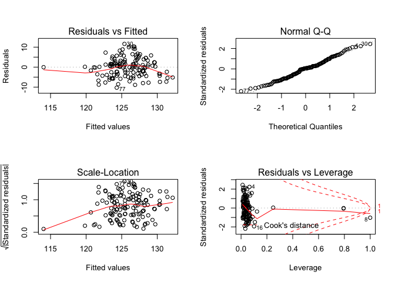<!-- -->

Gender as a confounder:

    ## 
    ## Call:
    ## lm(formula = sbp ~ fuel_used_for_cooking_percent_wood_dung + 
    ##     percent_public_source + percent_private_toilet + percent_employed + 
    ##     percent_without_hs_education + percent_caste + percent_female, 
    ##     data = total)
    ## 
    ## Residuals:
    ##      Min       1Q   Median       3Q      Max 
    ## -10.1253  -3.6866   0.1524   2.6001  11.4939 
    ## 
    ## Coefficients:
    ##                                           Estimate Std. Error t value
    ## (Intercept)                             134.867501   3.036556  44.415
    ## fuel_used_for_cooking_percent_wood_dung  -9.949583   9.914356  -1.004
    ## percent_public_source                    -0.019104   0.043936  -0.435
    ## percent_private_toilet                   -0.005393   0.011269  -0.479
    ## percent_employed                        -15.398295   6.050929  -2.545
    ## percent_without_hs_education             -6.346404   2.902834  -2.186
    ## percent_caste                             0.021541   0.050729   0.425
    ## percent_female                            0.159489   0.843974   0.189
    ##                                         Pr(>|t|)    
    ## (Intercept)                               <2e-16 ***
    ## fuel_used_for_cooking_percent_wood_dung   0.3175    
    ## percent_public_source                     0.6644    
    ## percent_private_toilet                    0.6330    
    ## percent_employed                          0.0121 *  
    ## percent_without_hs_education              0.0306 *  
    ## percent_caste                             0.6718    
    ## percent_female                            0.8504    
    ## ---
    ## Signif. codes:  0 '***' 0.001 '**' 0.01 '*' 0.05 '.' 0.1 ' ' 1
    ## 
    ## Residual standard error: 4.994 on 126 degrees of freedom
    ## Multiple R-squared:  0.1733, Adjusted R-squared:  0.1273 
    ## F-statistic: 3.773 on 7 and 126 DF,  p-value: 0.0009525

    ##                                              Estimate Std. Error
    ## (Intercept)                             134.867501149 3.03655619
    ## fuel_used_for_cooking_percent_wood_dung  -9.949582943 9.91435584
    ## percent_public_source                    -0.019103856 0.04393619
    ## percent_private_toilet                   -0.005393221 0.01126860
    ## percent_employed                        -15.398294642 6.05092871
    ## percent_without_hs_education             -6.346404177 2.90283353
    ## percent_caste                             0.021540800 0.05072922
    ## percent_female                            0.159489281 0.84397430
    ##                                            t value     Pr(>|t|)
    ## (Intercept)                             44.4146240 8.037665e-79
    ## fuel_used_for_cooking_percent_wood_dung -1.0035531 3.175174e-01
    ## percent_public_source                   -0.4348091 6.644448e-01
    ## percent_private_toilet                  -0.4786060 6.330484e-01
    ## percent_employed                        -2.5447820 1.214154e-02
    ## percent_without_hs_education            -2.1862791 3.064281e-02
    ## percent_caste                            0.4246232 6.718356e-01
    ## percent_female                           0.1889741 8.504172e-01

    ##                             (Intercept) 
    ##                           134.867501149 
    ## fuel_used_for_cooking_percent_wood_dung 
    ##                            -9.949582943 
    ##                   percent_public_source 
    ##                            -0.019103856 
    ##                  percent_private_toilet 
    ##                            -0.005393221 
    ##                        percent_employed 
    ##                           -15.398294642 
    ##            percent_without_hs_education 
    ##                            -6.346404177 
    ##                           percent_caste 
    ##                             0.021540800 
    ##                          percent_female 
    ##                             0.159489281

    ##        1        2        3        4        5        6        7        8 
    ## 125.9569 125.8916 125.9347 125.5061 127.1267 125.2860 122.7758 126.0067 
    ##        9       10       11       12       13       14       15       16 
    ## 125.5455 126.2025 122.5626 126.4959 125.6897 126.2682 127.0486 120.3636 
    ##       17       18       19       20       21       22       23       24 
    ## 126.7036 123.0898 125.1546 126.7536 121.4574 125.5542 124.8540 125.9011 
    ##       25       26       27       28       29       30       31       32 
    ## 126.9483 123.6465 127.8338 126.8862 124.0597 125.6049 126.1619 128.3046 
    ##       33       34       35       36       37       38       39       40 
    ## 125.1129 126.1604 125.4483 128.1487 129.6041 128.0677 127.8431 122.8200 
    ##       41       42       43       44       45       46       47       48 
    ## 129.7711 128.0683 127.5934 125.5883 127.6930 126.0335 125.7027 127.1053 
    ##       49       50       51       52       53       54       55       56 
    ## 127.5426 128.1836 127.0039 125.9880 128.0898 127.4463 125.0983 126.3451 
    ##       57       58       59       60       61       62       63       64 
    ## 126.4269 125.8543 125.8155 125.6204 118.4290 125.7675 128.5534 127.6949 
    ##       65       66       67       68       69       70       71       72 
    ## 126.0937 124.6222 124.0806 125.2135 124.3475 122.0676 126.0322 126.8156 
    ##       73       74       75       76       77       78       79       80 
    ## 128.9195 120.7200 125.8837 126.9975 123.4490 123.4790 126.9349 125.1695 
    ##       81       82       83       84       85       86       87       88 
    ## 128.8373 128.6601 123.1550 120.8036 125.5353 124.9154 122.4250 124.8418 
    ##       89       90       91       92       93       94       95       96 
    ## 124.4769 124.5654 128.6276 127.2592 125.5126 124.3337 126.4306 126.1253 
    ##       97       98       99      100      101      102      103      104 
    ## 127.8003 127.3896 122.2703 127.4116 121.6676 128.2702 126.2859 126.4959 
    ##      105      106      107      108      109      110      111      112 
    ## 126.0134 127.7788 127.3426 127.2582 126.8763 127.6583 127.0884 124.5499 
    ##      113      114      115      116      117      118      119      120 
    ## 124.4089 124.1626 127.5658 128.1029 127.7494 129.2950 127.2360 128.3926 
    ##      121      122      123      124      125      126      127      128 
    ## 126.2138 125.9920 122.4754 124.7630 126.9246 127.0413 124.6868 125.4497 
    ##      129      130      131      132      133      134 
    ## 127.3457 125.3190 126.0666 126.5452 126.2616 114.3183

    ## # A tibble: 1 x 11
    ##   r.squared adj.r.squared sigma statistic p.value    df logLik   AIC   BIC
    ##       <dbl>         <dbl> <dbl>     <dbl>   <dbl> <int>  <dbl> <dbl> <dbl>
    ## 1     0.173         0.127  4.99      3.77 9.53e-4     8  -402.  821.  847.
    ## # … with 2 more variables: deviance <dbl>, df.residual <int>

| term                                          | estimate | p.value |
| :-------------------------------------------- | -------: | ------: |
| (Intercept)                                   |  134.868 |   0.000 |
| fuel\_used\_for\_cooking\_percent\_wood\_dung |  \-9.950 |   0.318 |
| percent\_public\_source                       |  \-0.019 |   0.664 |
| percent\_private\_toilet                      |  \-0.005 |   0.633 |
| percent\_employed                             | \-15.398 |   0.012 |
| percent\_without\_hs\_education               |  \-6.346 |   0.031 |
| percent\_caste                                |    0.022 |   0.672 |
| percent\_female                               |    0.159 |   0.850 |

| sbp | fuel\_used\_for\_cooking\_percent\_wood\_dung | percent\_public\_source | percent\_private\_toilet | percent\_employed | percent\_without\_hs\_education | percent\_caste | percent\_female |  .fitted |   .se.fit |       .resid |      .hat |   .sigma |    .cooksd |  .std.resid |
| --: | --------------------------------------------: | ----------------------: | -----------------------: | ----------------: | ------------------------------: | -------------: | --------------: | -------: | --------: | -----------: | --------: | -------: | ---------: | ----------: |
| 127 |                                     0.0000000 |               0.0270270 |              100.0000000 |         0.5405405 |                       0.0270270 |      0.5675676 |       0.7017544 | 125.9569 | 0.9921130 |    1.0431161 | 0.0394599 | 5.013433 |  0.0002332 |   0.2131040 |
| 126 |                                     0.0000000 |               0.0789474 |                0.7368421 |         0.5789474 |                       0.0263158 |      0.2368421 |       0.6666667 | 125.8916 | 1.0365398 |    0.1083658 | 0.0430730 | 5.014327 |  0.0000028 |   0.0221804 |
| 127 |                                     0.0277778 |               0.0555556 |                0.4722222 |         0.4444444 |                       0.3055556 |      0.7500000 |       0.7142857 | 125.9347 | 0.6559454 |    1.0652733 | 0.0172492 | 5.013416 |  0.0001016 |   0.2151573 |
| 137 |                                     0.0000000 |               0.1538462 |                0.7692308 |         0.6153846 |                       0.0000000 |      0.4615385 |       0.7000000 | 125.5061 | 1.2333211 |   11.4938758 | 0.0609798 | 4.900823 |  0.0457839 |   2.3749024 |
| 132 |                                     0.0277778 |               0.1944444 |                0.8333333 |         0.3888889 |                       0.2500000 |      0.3888889 |       0.6909091 | 127.1267 | 0.8563783 |    4.8733423 | 0.0294012 | 4.994780 |  0.0037143 |   0.9904300 |
| 126 |                                     0.0000000 |               0.3076923 |                0.7435897 |         0.5128205 |                       0.2820513 |      0.4871795 |       0.6551724 | 125.2860 | 0.5449536 |    0.7139729 | 0.0119056 | 5.013925 |  0.0000312 |   0.1438134 |
| 132 |                                     0.0000000 |               0.1351351 |                0.5405405 |         0.6486486 |                       0.3513514 |      0.9189189 |       0.7017544 | 122.7758 | 1.0646585 |    9.2241799 | 0.0454417 | 4.942721 |  0.0212642 |   1.8903546 |
| 126 |                                     0.0526316 |               0.3947368 |                0.9473684 |         0.5789474 |                       0.2631579 |    100.0000000 |       0.6666667 | 126.0067 | 4.9931410 |  \-0.0066862 | 0.9994962 | 5.014266 |  0.8823091 | \-0.0596460 |
| 124 |                                     0.0000000 |               0.2777778 |                0.3611111 |         0.4166667 |                       0.4722222 |      0.0000000 |       0.6153846 | 125.5455 | 1.0242640 |  \-1.5455250 | 0.0420588 | 5.012347 |  0.0005486 | \-0.3161720 |
| 125 |                                     0.0000000 |               0.1500000 |                0.8500000 |         0.4250000 |                       0.3500000 |      0.0750000 |       0.6666667 | 126.2025 | 0.7689515 |  \-1.2024764 | 0.0237045 | 5.013155 |  0.0001802 | \-0.2436703 |
| 125 |                                     0.0000000 |               0.1071429 |                0.9285714 |         0.6666667 |                       0.3392857 |      0.6785714 |       0.6666667 | 122.5626 | 1.1551196 |    2.4373846 | 0.0534918 | 5.009328 |  0.0017776 |   0.5016244 |
| 122 |                                     0.0000000 |               0.0344828 |                0.9137931 |         0.4655172 |                       0.2068966 |      0.4137931 |       0.6666667 | 126.4959 | 0.5531899 |  \-4.4959329 | 0.0122682 | 4.997986 |  0.0012738 | \-0.9057682 |
| 128 |                                     0.0000000 |               0.3818182 |                0.8000000 |         0.4909091 |                       0.2727273 |      0.8727273 |       0.6585366 | 125.6897 | 0.5312198 |    2.3102792 | 0.0113131 | 5.010029 |  0.0003096 |   0.4652130 |
| 125 |                                     0.0000000 |               0.1636364 |                0.8909091 |         0.4909091 |                       0.1818182 |      0.6545455 |       0.6746988 | 126.2682 | 0.5508581 |  \-1.2682224 | 0.0121650 | 5.013038 |  0.0001005 | \-0.2554877 |
| 134 |                                     0.0000000 |               0.0000000 |              100.0000000 |         0.4545455 |                       0.0606061 |      0.2121212 |       0.6250000 | 127.0486 | 0.8465515 |    6.9514263 | 0.0287303 | 4.974491 |  0.0073748 |   1.4122798 |
| 113 |                                     0.0263158 |               0.8684211 |                0.1315789 |         0.7368421 |                       0.4736842 |      0.8157895 |       0.6896552 | 120.3636 | 1.5216311 |  \-7.3636323 | 0.0928223 | 4.966428 |  0.0306475 | \-1.5479704 |
| 122 |                                     0.0000000 |               0.2702703 |                0.7837838 |         0.4594595 |                       0.1891892 |      0.5945946 |       0.6785714 | 126.7036 | 0.5717439 |  \-4.7035805 | 0.0131050 | 4.996422 |  0.0014917 | \-0.9480033 |
| 122 |                                     0.1025641 |               0.0256410 |                0.9487179 |         0.5897436 |                       0.2820513 |      0.6923077 |       0.6551724 | 123.0898 | 1.1034067 |  \-1.0897735 | 0.0488095 | 5.013341 |  0.0003211 | \-0.2237274 |
| 127 |                                     0.0000000 |               0.2105263 |                0.9473684 |         0.4210526 |                       0.5263158 |      0.6315789 |       0.6666667 | 125.1546 | 1.1327730 |    1.8454044 | 0.0514422 | 5.011472 |  0.0009757 |   0.3793817 |
| 121 |                                     0.0000000 |               0.0263158 |                0.8947368 |         0.4473684 |                       0.2105263 |      0.2894737 |       0.6896552 | 126.7536 | 0.5896587 |  \-5.7536052 | 0.0139391 | 4.987484 |  0.0023782 | \-1.1601254 |
| 130 |                                     0.0540541 |               0.7837838 |                0.5675676 |         0.5405405 |                       0.7297297 |      0.1621622 |       0.6071429 | 121.4574 | 1.3851891 |    8.5425849 | 0.0769222 | 4.950871 |  0.0330139 |   1.7802742 |
| 134 |                                     0.0000000 |               0.1500000 |                0.9000000 |         0.5500000 |                       0.1500000 |      0.4250000 |       0.6666667 | 125.5542 | 0.7093115 |    8.4457600 | 0.0201701 | 4.955924 |  0.0075098 |   1.7083629 |
| 133 |                                     0.0000000 |               0.6923077 |                0.6666667 |         0.4871795 |                       0.4102564 |      0.0256410 |       0.6779661 | 124.8540 | 0.7192812 |    8.1460257 | 0.0207411 | 4.959987 |  0.0071924 |   1.6482146 |
| 137 |                                     0.0000000 |               0.8461538 |                0.6923077 |         0.4615385 |                       0.3076923 |      0.2307692 |       0.6779661 | 125.9011 | 0.6001724 |   11.0989431 | 0.0144406 | 4.913618 |  0.0091775 |   2.2384994 |
| 136 |                                     0.0000000 |               0.5365854 |                0.6585366 |         0.3902439 |                       0.3170732 |      0.3658537 |       0.6774194 | 126.9483 | 0.8721475 |    9.0517445 | 0.0304939 | 4.946462 |  0.0133205 |   1.8406608 |
| 128 |                                     0.0769231 |               0.3333333 |                0.7179487 |         0.5384615 |                       0.3589744 |      0.7435897 |       0.6779661 | 123.6465 | 0.8101578 |    4.3535313 | 0.0263131 | 4.998785 |  0.0026361 |   0.8833825 |
| 133 |                                     0.0000000 |               0.4102564 |                0.7179487 |         0.4102564 |                       0.1282051 |      0.2051282 |       0.6551724 | 127.8338 | 0.7577137 |    5.1661874 | 0.0230167 | 4.992497 |  0.0032252 |   1.0465099 |
| 136 |                                     0.0000000 |               0.1538462 |                0.7948718 |         0.4615385 |                       0.1538462 |      0.0512821 |       0.6779661 | 126.8862 | 0.5990679 |    9.1137669 | 0.0143875 | 4.946654 |  0.0061647 |   1.8380680 |
| 131 |                                     0.0000000 |               0.9250000 |                0.8250000 |         0.4500000 |                       0.6250000 |      0.1750000 |       0.6666667 | 124.0597 | 1.2953682 |    6.9402587 | 0.0672698 | 4.972972 |  0.0186639 |   1.4388462 |
| 137 |                                     0.0000000 |               0.2307692 |                0.8974359 |         0.5128205 |                       0.2307692 |      0.1538462 |       0.6551724 | 125.6049 | 0.5425501 |   11.3950567 | 0.0118008 | 4.908400 |  0.0078632 |   2.2951496 |
| 129 |                                     0.0000000 |               0.1750000 |                0.7750000 |         0.5000000 |                       0.1750000 |      0.2500000 |       0.6666667 | 126.1619 | 0.5659373 |    2.8380784 | 0.0128402 | 5.007824 |  0.0005318 |   0.5719360 |
| 133 |                                     0.0000000 |               0.1025641 |                0.7948718 |         0.3589744 |                       0.1794872 |      0.2564103 |       0.6551724 | 128.3046 | 0.9532697 |    4.6954200 | 0.0364305 | 4.996052 |  0.0043350 |   0.9577445 |
| 124 |                                     0.0000000 |               0.0270270 |              100.0000000 |         0.5945946 |                       0.0270270 |      0.0270270 |       0.7017544 | 125.1129 | 1.1947876 |  \-1.1129000 | 0.0572288 | 5.013289 |  0.0003996 | \-0.2294932 |
| 128 |                                     0.0263158 |               0.4736842 |                0.9210526 |         0.4473684 |                       0.2631579 |      0.8157895 |       0.6896552 | 126.1604 | 0.6142354 |    1.8395984 | 0.0151253 | 5.011595 |  0.0002644 |   0.3711498 |
| 131 |                                     0.0256410 |               0.2307692 |                0.9743590 |         0.5384615 |                       0.1538462 |      0.4102564 |       0.6551724 | 125.4483 | 0.6866049 |    5.5517089 | 0.0188994 | 4.989214 |  0.0030326 |   1.1222424 |
| 136 |                                     0.0000000 |               0.0188679 |              100.0000000 |         0.3773585 |                       0.0754717 |      0.1320755 |       0.6750000 | 128.1487 | 0.9847142 |    7.8513323 | 0.0388735 | 4.962911 |  0.0129994 |   1.6035032 |
| 126 |                                     0.0000000 |               0.0526316 |                0.9473684 |         0.3157895 |                       0.0789474 |      0.0000000 |       0.6666667 | 129.6041 | 1.2023913 |  \-3.6040612 | 0.0579596 | 5.003326 |  0.0042512 | \-0.7434883 |
| 128 |                                     0.0000000 |               0.0000000 |                0.9750000 |         0.5000000 |                       0.0250000 |      0.0000000 |       6.6666667 | 128.0677 | 4.9913549 |  \-0.0676972 | 0.9987813 | 5.011336 | 15.4436158 | \-0.3882718 |
| 126 |                                     0.0000000 |               0.0769231 |                0.8846154 |         0.4230769 |                       0.0961538 |      0.0192308 |       0.6666667 | 127.8431 | 0.7512606 |  \-1.8431068 | 0.0226264 | 5.011564 |  0.0004032 | \-0.3732819 |
| 118 |                                     0.0000000 |               0.8285714 |                0.0285714 |         0.6000000 |                       0.4571429 |      0.4000000 |       0.6274510 | 122.8200 | 0.9567314 |  \-4.8200161 | 0.0366956 | 4.995061 |  0.0046039 | \-0.9832941 |
| 126 |                                     0.0000000 |               0.0000000 |              100.0000000 |         0.3030303 |                       0.0000000 |      0.0303030 |       0.6800000 | 129.7711 | 1.2551581 |  \-3.7711346 | 0.0631583 | 5.002213 |  0.0051284 | \-0.7801097 |
| 126 |                                     0.0000000 |               0.0000000 |              100.0000000 |         0.4000000 |                       0.0333333 |      0.0000000 |       0.6956522 | 128.0683 | 0.9161764 |  \-2.0682634 | 0.0336505 | 5.010804 |  0.0007725 | \-0.4212651 |
| 121 |                                     0.0000000 |               0.0000000 |              100.0000000 |         0.4444444 |                       0.0000000 |      0.0000000 |       0.6829268 | 127.5934 | 0.8660737 |  \-6.5934120 | 0.0300707 | 4.978454 |  0.0069635 | \-1.3404694 |
| 128 |                                     0.0000000 |               0.0263158 |              100.0000000 |         0.5526316 |                       0.0526316 |      0.0789474 |       0.6428571 | 125.5883 | 1.0205220 |    2.4116995 | 0.0417521 | 5.009493 |  0.0013253 |   0.4932885 |
| 124 |                                     0.0000000 |               0.0000000 |              100.0000000 |         0.3947368 |                       0.1052632 |      0.0526316 |       0.6896552 | 127.6930 | 0.9497187 |  \-3.6929886 | 0.0361596 | 5.003037 |  0.0026602 | \-0.7531685 |
| 126 |                                     0.0000000 |               0.0000000 |                0.9666667 |         0.5666667 |                       0.0333333 |      0.1000000 |       0.6666667 | 126.0335 | 0.9765355 |  \-0.0335209 | 0.0382305 | 5.014336 |  0.0000002 | \-0.0068438 |
| 132 |                                     0.0400000 |               0.0000000 |              100.0000000 |         0.5000000 |                       0.1000000 |      0.0000000 |       0.6666667 | 125.7027 | 0.9271102 |    6.2972659 | 0.0344585 | 4.981467 |  0.0073452 |   1.2831674 |
| 129 |                                     0.0000000 |               0.0000000 |              100.0000000 |         0.4761905 |                       0.0000000 |      0.0000000 |       0.6875000 | 127.1053 | 0.8752098 |    1.8946934 | 0.0307084 | 5.011382 |  0.0005880 |   0.3853261 |
| 126 |                                     0.0000000 |               0.0000000 |              100.0000000 |         0.4473684 |                       0.0000000 |      0.0263158 |       0.6428571 | 127.5426 | 0.8663064 |  \-1.5425639 | 0.0300868 | 5.012380 |  0.0003814 | \-0.3136126 |
| 130 |                                     0.0000000 |               0.0000000 |                0.9855072 |         0.4347826 |                       0.0144928 |      0.0434783 |       0.6730769 | 128.1836 | 0.8624869 |    1.8164164 | 0.0298221 | 5.011623 |  0.0005239 |   0.3692381 |
| 127 |                                     0.0000000 |               0.0000000 |              100.0000000 |         0.4615385 |                       0.0512821 |      0.0000000 |       0.6779661 | 127.0039 | 0.8460536 |  \-0.0039455 | 0.0286965 | 5.014337 |  0.0000000 | \-0.0008016 |
| 127 |                                     0.0000000 |               0.0000000 |              100.0000000 |         0.5483871 |                       0.0000000 |      0.0000000 |       0.6521739 | 125.9880 | 1.0390750 |    1.0120323 | 0.0432840 | 5.013483 |  0.0002427 |   0.2071665 |
| 123 |                                     0.0000000 |               0.0000000 |              100.0000000 |         0.4117647 |                       0.0000000 |      0.0000000 |       0.6400000 | 128.0898 | 0.9013440 |  \-5.0897779 | 0.0325698 | 4.992930 |  0.0045177 | \-1.0361097 |
| 132 |                                     0.0000000 |               0.1304348 |                0.8695652 |         0.4347826 |                       0.1304348 |      0.1086957 |       0.6666667 | 127.4463 | 0.6786833 |    4.5537154 | 0.0184658 | 4.997456 |  0.0019917 |   0.9203010 |
| 127 |                                     0.0000000 |               0.0000000 |              100.0000000 |         0.5641026 |                       0.1025641 |      0.1282051 |       0.6551724 | 125.0983 | 1.0479575 |    1.9016971 | 0.0440272 | 5.011318 |  0.0008731 |   0.3894353 |
| 121 |                                     0.0000000 |               0.1315789 |                0.9736842 |         0.4736842 |                       0.2105263 |      0.4210526 |       0.6666667 | 126.3451 | 0.5404138 |  \-5.3451181 | 0.0117081 | 4.991223 |  0.0017162 | \-1.0765431 |
| 117 |                                     0.0000000 |               0.0500000 |                0.9500000 |         0.5250000 |                       0.0750000 |      0.5750000 |       0.7096774 | 126.4269 | 0.7601169 |  \-9.4269093 | 0.0231630 | 4.941233 |  0.0108102 | \-1.9097434 |
| 122 |                                     0.0000000 |               0.0243902 |                0.8536585 |         0.5121951 |                       0.1951220 |      0.2682927 |       0.6984127 | 125.8543 | 0.5577227 |  \-3.8543456 | 0.0124701 | 5.002322 |  0.0009520 | \-0.7765909 |
| 118 |                                     0.0000000 |               0.4594595 |                0.4324324 |         0.4054054 |                       0.4594595 |      0.4324324 |       0.6785714 | 125.8155 | 1.0403086 |  \-7.8154640 | 0.0433868 | 4.963140 |  0.0145124 | \-1.5999387 |
| 125 |                                     0.0000000 |               0.0512821 |                0.8717949 |         0.5128205 |                       0.2307692 |      0.5384615 |       0.6779661 | 125.6204 | 0.5383796 |  \-0.6204307 | 0.0116201 | 5.014026 |  0.0000229 | \-0.1249534 |
| 120 |                                     0.2549020 |               0.3421053 |                0.7894737 |         0.6052632 |                       0.7368421 |      0.1052632 |       0.6428571 | 118.4290 | 2.4535109 |    1.5709824 | 0.2413290 | 5.011741 |  0.0051855 |   0.3611281 |
| 129 |                                     0.0000000 |               0.1538462 |                0.8974359 |         0.5128205 |                       0.2051282 |      0.0769231 |       0.6551724 | 125.7675 | 0.5563554 |    3.2325159 | 0.0124090 | 5.005890 |  0.0006662 |   0.6512817 |
| 124 |                                     0.0000000 |               0.0000000 |                0.8333333 |         0.4166667 |                       0.0000000 |      0.0000000 |       0.6666667 | 128.5534 | 0.9258242 |  \-4.5533769 | 0.0343630 | 4.997180 |  0.0038289 | \-0.9277765 |
| 123 |                                     0.0000000 |               0.0000000 |                0.9729730 |         0.4054054 |                       0.1621622 |      0.0000000 |       0.6545455 | 127.6949 | 0.7498278 |  \-4.6949482 | 0.0225401 | 4.996315 |  0.0026059 | \-0.9508195 |
| 125 |                                     0.0000000 |               0.2666667 |                0.8000000 |         0.4666667 |                       0.2666667 |      0.1333333 |       0.6956522 | 126.0937 | 0.5555264 |  \-1.0936681 | 0.0123721 | 5.013371 |  0.0000760 | \-0.2203462 |
| 125 |                                     0.0256410 |               0.0512821 |                0.8974359 |         0.4871795 |                       0.4102564 |      0.7692308 |       0.6551724 | 124.6222 | 0.6855493 |    0.3777596 | 0.0188413 | 5.014221 |  0.0000140 |   0.0763594 |
| 124 |                                     0.0500000 |               0.2500000 |                0.7000000 |         0.5000000 |                       0.4250000 |      0.4250000 |       0.6666667 | 124.0806 | 0.7409737 |  \-0.0805827 | 0.0220110 | 5.014332 |  0.0000007 | \-0.0163152 |
| 125 |                                     0.0000000 |               0.2500000 |                0.6500000 |         0.5000000 |                       0.3250000 |      0.4500000 |       0.6666667 | 125.2135 | 0.5734178 |  \-0.2135105 | 0.0131818 | 5.014300 |  0.0000031 | \-0.0430346 |
| 128 |                                     0.0000000 |               0.1351351 |                0.8918919 |         0.5675676 |                       0.2972973 |      0.4324324 |       0.6545455 | 124.3475 | 0.6888270 |    3.6525241 | 0.0190219 | 5.003477 |  0.0013215 |   0.7383804 |
| 124 |                                     0.0000000 |               0.2500000 |                0.8888889 |         0.6666667 |                       0.4166667 |      0.6111111 |       0.6666667 | 122.0676 | 1.1902113 |    1.9324436 | 0.0567913 | 5.011178 |  0.0011946 |   0.3984003 |
| 119 |                                     0.0000000 |               0.0000000 |              100.0000000 |         0.5454545 |                       0.0000000 |      0.0000000 |       0.6461538 | 126.0322 | 1.0296494 |  \-7.0321638 | 0.0425023 | 4.972967 |  0.0114884 | \-1.4389207 |
| 129 |                                     0.0000000 |               0.0000000 |                0.9607843 |         0.5294118 |                       0.0000000 |      0.0196078 |       0.6578947 | 126.8156 | 0.9418573 |    2.1843694 | 0.0355634 | 5.010389 |  0.0009142 |   0.4453547 |
| 121 |                                     0.0000000 |               0.0000000 |                0.9285714 |         0.3928571 |                       0.0000000 |      0.0000000 |       0.6666667 | 128.9195 | 0.9842372 |  \-7.9194893 | 0.0388359 | 4.962011 |  0.0132122 | \-1.6173915 |
| 121 |                                     0.0975610 |               0.3414634 |                0.2439024 |         0.5609756 |                       0.7317073 |      0.2195122 |       0.6774194 | 120.7200 | 1.4716168 |    0.2800371 | 0.0868206 | 5.014269 |  0.0000409 |   0.0586752 |
| 124 |                                     0.0000000 |               0.0000000 |                0.9333333 |         0.5833333 |                       0.0166667 |      0.0333333 |       0.6813187 | 125.8837 | 1.0712855 |  \-1.8837366 | 0.0460091 | 5.011369 |  0.0008990 | \-0.3861578 |
| 125 |                                     0.0000000 |               0.0750000 |                0.9000000 |         0.4250000 |                       0.2250000 |      0.1000000 |       0.6666667 | 126.9975 | 0.6621330 |  \-1.9974786 | 0.0175762 | 5.011096 |  0.0003641 | \-0.4035055 |
| 114 |                                     0.0000000 |               0.5263158 |                0.5789474 |         0.5526316 |                       0.4736842 |      0.3684211 |       0.6428571 | 123.4490 | 0.8675914 |  \-9.4490137 | 0.0301762 | 4.940352 |  0.0143547 | \-1.9211302 |
| 127 |                                     0.0000000 |               0.6000000 |                0.3500000 |         0.5500000 |                       0.4750000 |      0.1000000 |       0.6666667 | 123.4790 | 0.8671253 |    3.5209726 | 0.0301437 | 5.004130 |  0.0019909 |   0.7158561 |
| 127 |                                     0.0000000 |               0.0263158 |                0.9736842 |         0.5000000 |                       0.0526316 |      0.0000000 |       0.6666667 | 126.9349 | 0.7698551 |    0.0650953 | 0.0237603 | 5.014334 |  0.0000005 |   0.0131913 |
| 126 |                                     0.0256410 |               0.0000000 |              100.0000000 |         0.5641026 |                       0.0512821 |      0.0000000 |       0.6779661 | 125.1695 | 1.0660769 |    0.8304843 | 0.0455628 | 5.013761 |  0.0001729 |   0.1702059 |
| 132 |                                     0.0000000 |               0.0303030 |              100.0000000 |         0.3636364 |                       0.0000000 |      0.0303030 |       0.6800000 | 128.8373 | 1.0210161 |    3.1626743 | 0.0417925 | 5.006003 |  0.0022816 |   0.6469064 |
| 131 |                                     0.0000000 |               0.0000000 |              100.0000000 |         0.3750000 |                       0.0000000 |      0.0000000 |       0.6666667 | 128.6601 | 0.9861351 |    2.3398553 | 0.0389858 | 5.009790 |  0.0011582 |   0.4779042 |
| 115 |                                     0.0000000 |               0.9750000 |                0.0000000 |         0.5500000 |                       0.5250000 |      0.3750000 |       0.6206897 | 123.1550 | 0.9700145 |  \-8.1550218 | 0.0377216 | 4.958900 |  0.0135763 | \-1.6645295 |
| 121 |                                     0.0000000 |             100.0000000 |                0.0000000 |         0.5405405 |                       0.6216216 |      0.6756757 |       0.6296296 | 120.8036 | 4.4480357 |    0.1963752 | 0.7931769 | 5.014188 |  0.0035833 |   0.0864577 |
| 120 |                                     0.0000000 |               0.2931034 |                0.6896552 |         0.5344828 |                       0.1896552 |      0.3275862 |       0.6511628 | 125.5353 | 0.6175175 |  \-5.5353409 | 0.0152873 | 4.989454 |  0.0024207 | \-1.1168796 |
| 126 |                                     0.0000000 |               0.0000000 |                0.9148936 |         0.5744681 |                       0.1914894 |      0.4255319 |       0.6571429 | 124.9154 | 0.7546838 |    1.0845573 | 0.0228330 | 5.013377 |  0.0001410 |   0.2196771 |
| 124 |                                     0.0000000 |               0.1666667 |                0.8333333 |         0.6666667 |                       0.3611111 |      0.7500000 |       0.6666667 | 122.4250 | 1.1603200 |    1.5749822 | 0.0539746 | 5.012245 |  0.0007497 |   0.3242209 |
| 128 |                                     0.0000000 |               0.0000000 |                0.7068966 |         0.5517241 |                       0.2586207 |      0.5172414 |       0.6511628 | 124.8418 | 0.6303839 |    3.1582383 | 0.0159310 | 5.006245 |  0.0008223 |   0.6374540 |
| 125 |                                     0.0000000 |               0.0869565 |                0.7391304 |         0.5652174 |                       0.2826087 |      0.2608696 |       0.6666667 | 124.4769 | 0.6778453 |    0.5231338 | 0.0184202 | 5.014115 |  0.0000262 |   0.1057223 |
| 125 |                                     0.0000000 |               0.0000000 |                0.9743590 |         0.5384615 |                       0.3333333 |      0.2564103 |       0.6551724 | 124.5654 | 0.6251973 |    0.4345950 | 0.0156700 | 5.014184 |  0.0000153 |   0.0877064 |
| 128 |                                     0.0175439 |               0.0000000 |                0.9824561 |         0.3859649 |                       0.0350877 |      0.0350877 |       0.6588235 | 128.6276 | 0.9885509 |  \-0.6275973 | 0.0391770 | 5.014010 |  0.0000838 | \-0.1281965 |
| 125 |                                     0.0000000 |               0.0000000 |              100.0000000 |         0.4531250 |                       0.0312500 |      0.0156250 |       0.6666667 | 127.2592 | 0.8505273 |  \-2.2591644 | 0.0290008 | 5.010142 |  0.0007867 | \-0.4590449 |
| 120 |                                     0.0169492 |               0.1355932 |                0.7796610 |         0.4915254 |                       0.2711864 |      0.2372881 |       0.6590909 | 125.5126 | 0.5190159 |  \-5.5125862 | 0.0107993 | 4.989771 |  0.0016807 | \-1.1097622 |
| 123 |                                     0.0000000 |               0.2131148 |                0.9672131 |         0.5081967 |                       0.4426230 |      0.1147541 |       0.6739130 | 124.3337 | 0.7730285 |  \-1.3337402 | 0.0239566 | 5.012883 |  0.0002242 | \-0.2703046 |
| 132 |                                     0.0000000 |               0.0800000 |                0.9800000 |         0.4800000 |                       0.1800000 |      0.0000000 |       0.6486486 | 126.4306 | 0.5586766 |    5.5693942 | 0.0125128 | 4.989217 |  0.0019946 |   1.1221708 |
| 116 |                                     0.0000000 |               0.0526316 |                0.8684211 |         0.5526316 |                       0.0526316 |      0.2105263 |       0.6428571 | 126.1253 | 0.8929454 | \-10.1252707 | 0.0319656 | 4.929130 |  0.0175250 | \-2.0605255 |
| 124 |                                     0.0000000 |               0.0000000 |              100.0000000 |         0.4000000 |                       0.0750000 |      0.0500000 |       0.6666667 | 127.8003 | 0.9216222 |  \-3.8002841 | 0.0340517 | 5.002396 |  0.0026412 | \-0.7742048 |
| 128 |                                     0.0000000 |               0.0285714 |                0.9142857 |         0.4571429 |                       0.0857143 |      0.1142857 |       0.6792453 | 127.3896 | 0.6994255 |    0.6103794 | 0.0196118 | 5.014034 |  0.0000381 |   0.1234291 |
| 118 |                                     0.0540541 |               0.1081081 |                0.1351351 |         0.5675676 |                       0.5405405 |      0.2432432 |       0.6785714 | 122.2703 | 0.9765532 |  \-4.2702949 | 0.0382318 | 4.999189 |  0.0037770 | \-0.8718453 |
| 133 |                                     0.0000000 |               0.0175439 |              100.0000000 |         0.4561404 |                       0.0000000 |      0.0000000 |       0.6744186 | 127.4116 | 0.8647132 |    5.5883771 | 0.0299763 | 4.988588 |  0.0049857 |   1.1360862 |
| 118 |                                     0.0416667 |               0.2708333 |                0.3125000 |         0.5625000 |                       0.6666667 |      0.3541667 |       0.6666667 | 121.6676 | 1.2401248 |  \-3.6675542 | 0.0616544 | 5.002889 |  0.0047199 | \-0.7580745 |
| 132 |                                     0.0000000 |               0.0000000 |              100.0000000 |         0.3859649 |                       0.0350877 |      0.0175439 |       0.6744186 | 128.2702 | 0.9510233 |    3.7297628 | 0.0362590 | 5.002809 |  0.0027215 |   0.7607077 |
| 124 |                                     0.0000000 |               0.0000000 |              100.0000000 |         0.4871795 |                       0.1025641 |      0.1025641 |       0.6779661 | 126.2859 | 0.8642814 |  \-2.2858701 | 0.0299463 | 5.010038 |  0.0008333 | \-0.4646976 |
| 128 |                                     0.0000000 |               0.0000000 |              100.0000000 |         0.4102564 |                       0.2564103 |      0.3589744 |       0.6551724 | 126.4959 | 1.0864303 |    1.5041276 | 0.0473192 | 5.012442 |  0.0005911 |   0.3085515 |
| 120 |                                     0.0000000 |               0.0000000 |              100.0000000 |         0.5333333 |                       0.0333333 |      0.1333333 |       0.6666667 | 126.0134 | 0.9680937 |  \-6.0134067 | 0.0375723 | 4.984275 |  0.0073505 | \-1.2273072 |
| 128 |                                     0.0000000 |               0.0000000 |              100.0000000 |         0.4324324 |                       0.0000000 |      0.0540541 |       0.6785714 | 127.7788 | 0.8737280 |    0.2211538 | 0.0306046 | 5.014297 |  0.0000080 |   0.0449739 |
| 119 |                                     0.0000000 |               0.0697674 |                0.9302326 |         0.4186047 |                       0.1860465 |      0.0000000 |       0.6769231 | 127.3426 | 0.6886231 |  \-8.3425892 | 0.0190106 | 4.957418 |  0.0068899 | \-1.6864966 |
| 134 |                                     0.0000000 |               0.0750000 |              100.0000000 |         0.4250000 |                       0.1000000 |      0.0250000 |       0.6885246 | 127.2582 | 0.8820793 |    6.7418186 | 0.0311924 | 4.976771 |  0.0075696 |   1.3714344 |
| 123 |                                     0.0161290 |               0.1774194 |                0.7903226 |         0.4354839 |                       0.1935484 |      0.1129032 |       0.6808511 | 126.8763 | 0.6426677 |  \-3.8763474 | 0.0165579 | 5.002134 |  0.0012891 | \-0.7826454 |
| 130 |                                     0.0000000 |               0.0000000 |                0.9000000 |         0.4750000 |                       0.0000000 |      0.0000000 |       0.6885246 | 127.6583 | 0.8661702 |    2.3417304 | 0.0300774 | 5.009825 |  0.0008786 |   0.4760857 |
| 125 |                                     0.0000000 |               0.1621622 |                0.6756757 |         0.3783784 |                       0.3243243 |      0.1891892 |       0.6785714 | 127.0884 | 0.9366405 |  \-2.0883843 | 0.0351706 | 5.010730 |  0.0008257 | \-0.4256983 |
| 130 |                                     0.0000000 |               0.0555556 |              100.0000000 |         0.5277778 |                       0.2777778 |      0.6666667 |       0.6153846 | 124.5499 | 1.0775974 |    5.4501423 | 0.0465529 | 4.989423 |  0.0076228 |   1.1175740 |
| 115 |                                     0.0000000 |               0.1282051 |              100.0000000 |         0.4615385 |                       0.4615385 |      0.5128205 |       0.6779661 | 124.4089 | 1.4287444 |  \-9.4088898 | 0.0818357 | 4.936824 |  0.0430648 | \-1.9660516 |
| 121 |                                     0.0000000 |               0.6052632 |                0.7105263 |         0.4736842 |                       0.5526316 |      0.4210526 |       0.6428571 | 124.1626 | 1.0632346 |  \-3.1625525 | 0.0453202 | 5.005973 |  0.0024923 | \-0.6480755 |
| 130 |                                     0.0000000 |               0.0476190 |                0.9523810 |         0.4285714 |                       0.1269841 |      0.0952381 |       0.6736842 | 127.5658 | 0.6976712 |    2.4342098 | 0.0195135 | 5.009514 |  0.0006027 |   0.4922140 |
| 135 |                                     0.0000000 |               0.0000000 |                0.9444444 |         0.3888889 |                       0.1388889 |      0.0000000 |       0.6909091 | 128.1029 | 0.8269820 |    6.8970706 | 0.0274174 | 4.975167 |  0.0069095 |   1.4002906 |
| 129 |                                     0.0000000 |               0.0000000 |                0.9473684 |         0.4473684 |                       0.0526316 |      0.1578947 |       0.6666667 | 127.7494 | 0.7715998 |    1.2506129 | 0.0238681 | 5.013059 |  0.0001963 |   0.2534460 |
| 127 |                                     0.0000000 |               0.0263158 |                0.9736842 |         0.3684211 |                       0.0000000 |      0.0000000 |       0.6666667 | 129.2950 | 1.0616766 |  \-2.2950174 | 0.0451875 | 5.009935 |  0.0013083 | \-0.4702661 |
| 133 |                                     0.0000000 |               0.0000000 |              100.0000000 |         0.4358974 |                       0.0769231 |      0.0000000 |       0.6779661 | 127.2360 | 0.8591441 |    5.7639548 | 0.0295914 | 4.986951 |  0.0052317 |   1.1715477 |
| 129 |                                     0.0000000 |               0.0000000 |                0.9000000 |         0.4000000 |                       0.0666667 |      0.0666667 |       0.6956522 | 128.3926 | 0.8567847 |    0.6073791 | 0.0294291 | 5.014034 |  0.0000578 |   0.1234420 |
| 126 |                                     0.0000000 |               0.0810811 |                0.8918919 |         0.5135135 |                       0.1351351 |      0.4324324 |       0.6785714 | 126.2138 | 0.6334208 |  \-0.2138273 | 0.0160849 | 5.014300 |  0.0000038 | \-0.0431619 |
| 118 |                                     0.0500000 |               0.0250000 |              100.0000000 |         0.4750000 |                       0.1000000 |      0.2000000 |       0.6666667 | 125.9920 | 0.9499100 |  \-7.9920262 | 0.0361742 | 4.961191 |  0.0124640 | \-1.6299503 |
| 119 |                                     0.1724138 |               0.8275862 |                0.0000000 |         0.5862069 |                       0.2758621 |      0.5862069 |       0.6511628 | 122.4754 | 1.6643156 |  \-3.4754079 | 0.1110465 | 5.003487 |  0.0085055 | \-0.7380453 |
| 119 |                                     0.0000000 |               0.2162162 |                0.7297297 |         0.5405405 |                       0.2972973 |      0.4324324 |       0.6545455 | 124.7630 | 0.6038273 |  \-5.7629716 | 0.0146170 | 4.987378 |  0.0025054 | \-1.1624136 |
| 133 |                                     0.0270270 |               0.0000000 |              100.0000000 |         0.4594595 |                       0.0270270 |      0.1621622 |       0.6785714 | 126.9246 | 0.8901548 |    6.0754272 | 0.0317661 | 4.983834 |  0.0062676 |   1.2362418 |
| 126 |                                     0.0000000 |               0.3333333 |                0.6944444 |         0.3888889 |                       0.3055556 |      0.4166667 |       0.6415094 | 127.0413 | 0.8669296 |  \-1.0412724 | 0.0301301 | 5.013445 |  0.0001740 | \-0.2117017 |
| 125 |                                     0.0256410 |               0.1538462 |                0.4102564 |         0.4615385 |                       0.4615385 |      0.5128205 |       0.6551724 | 124.6868 | 0.8385581 |    0.3132433 | 0.0281903 | 5.014257 |  0.0000147 |   0.0636221 |
| 121 |                                     0.0000000 |               0.0000000 |                0.9487179 |         0.5128205 |                       0.2564103 |      0.3076923 |       0.6551724 | 125.4497 | 0.5380483 |  \-4.4496609 | 0.0116058 | 4.998332 |  0.0011787 | \-0.8961456 |
| 130 |                                     0.0000000 |               0.0000000 |                0.9117647 |         0.4705882 |                       0.0588235 |      0.0294118 |       0.6400000 | 127.3457 | 0.7464823 |    2.6542837 | 0.0223395 | 5.008585 |  0.0008252 |   0.5374896 |
| 126 |                                     0.0000000 |               0.0263158 |                0.9210526 |         0.6052632 |                       0.0526316 |      0.3947368 |       0.6428571 | 125.3190 | 1.0938706 |    0.6809790 | 0.0479695 | 5.013948 |  0.0001230 |   0.1397414 |
| 118 |                                     0.0000000 |               0.0000000 |                0.9714286 |         0.5428571 |                       0.0857143 |      0.1428571 |       0.6538462 | 126.0666 | 0.7954137 |  \-8.0665690 | 0.0253641 | 4.960794 |  0.0087067 | \-1.6360041 |
| 121 |                                     0.0000000 |               0.0000000 |                0.9090909 |         0.4848485 |                       0.1515152 |      0.2727273 |       0.6530612 | 126.5452 | 0.5870523 |  \-5.5452130 | 0.0138162 | 4.989402 |  0.0021890 | \-1.1180366 |
| 118 |                                     0.0000000 |               0.0000000 |              100.0000000 |         0.4705882 |                       0.1470588 |      0.1176471 |       0.6923077 | 126.2616 | 0.8782148 |  \-8.2615778 | 0.0309197 | 4.957835 |  0.0112612 | \-1.6803504 |
| 114 |                                     0.5526316 |             100.0000000 |                0.0000000 |         0.5789474 |                       0.6842105 |      0.6578947 |       0.6428571 | 114.3183 | 4.4493521 |  \-0.3182835 | 0.7936464 | 5.013945 |  0.0094618 | \-0.1402894 |

    ## Warning in sqrt(crit * p * (1 - hh)/hh): NaNs produced
    
    ## Warning in sqrt(crit * p * (1 - hh)/hh): NaNs produced

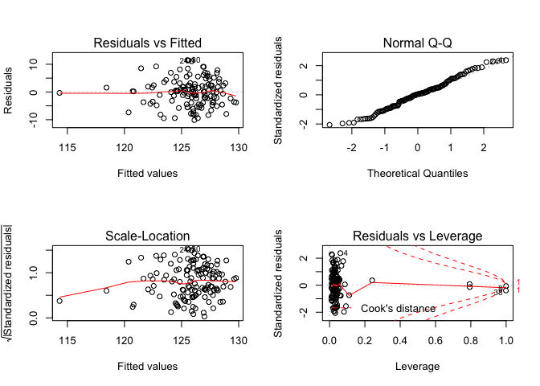<!-- -->

Marital status as a confounder:

    ## 
    ## Call:
    ## lm(formula = sbp ~ fuel_used_for_cooking_percent_wood_dung + 
    ##     percent_public_source + percent_private_toilet + percent_employed + 
    ##     percent_without_hs_education + percent_caste + percent_marital_status, 
    ##     data = total)
    ## 
    ## Residuals:
    ##     Min      1Q  Median      3Q     Max 
    ## -9.9417 -3.7377  0.2036  2.7246 11.4671 
    ## 
    ## Coefficients:
    ##                                           Estimate Std. Error t value
    ## (Intercept)                             135.141791   2.967210  45.545
    ## fuel_used_for_cooking_percent_wood_dung  -9.979453   9.879911  -1.010
    ## percent_public_source                    -0.020130   0.043799  -0.460
    ## percent_private_toilet                   -0.005057   0.011187  -0.452
    ## percent_employed                        -16.138174   6.082149  -2.653
    ## percent_without_hs_education             -5.853119   2.928161  -1.999
    ## percent_caste                             0.022651   0.050567   0.448
    ## percent_marital_status                    0.028640   0.030112   0.951
    ##                                         Pr(>|t|)    
    ## (Intercept)                               <2e-16 ***
    ## fuel_used_for_cooking_percent_wood_dung   0.3144    
    ## percent_public_source                     0.6466    
    ## percent_private_toilet                    0.6520    
    ## percent_employed                          0.0090 ** 
    ## percent_without_hs_education              0.0478 *  
    ## percent_caste                             0.6550    
    ## percent_marital_status                    0.3434    
    ## ---
    ## Signif. codes:  0 '***' 0.001 '**' 0.01 '*' 0.05 '.' 0.1 ' ' 1
    ## 
    ## Residual standard error: 4.977 on 126 degrees of freedom
    ## Multiple R-squared:  0.1789, Adjusted R-squared:  0.1333 
    ## F-statistic: 3.923 on 7 and 126 DF,  p-value: 0.0006647

    ##                                              Estimate Std. Error
    ## (Intercept)                             135.141791078 2.96720977
    ## fuel_used_for_cooking_percent_wood_dung  -9.979452543 9.87991101
    ## percent_public_source                    -0.020129938 0.04379918
    ## percent_private_toilet                   -0.005056826 0.01118713
    ## percent_employed                        -16.138173619 6.08214921
    ## percent_without_hs_education             -5.853118547 2.92816098
    ## percent_caste                             0.022650861 0.05056654
    ## percent_marital_status                    0.028639736 0.03011160
    ##                                            t value     Pr(>|t|)
    ## (Intercept)                             45.5450748 4.071996e-80
    ## fuel_used_for_cooking_percent_wood_dung -1.0100751 3.143951e-01
    ## percent_public_source                   -0.4595963 6.465980e-01
    ## percent_private_toilet                  -0.4520219 6.520304e-01
    ## percent_employed                        -2.6533669 8.995660e-03
    ## percent_without_hs_education            -1.9989060 4.777047e-02
    ## percent_caste                            0.4479417 6.549645e-01
    ## percent_marital_status                   0.9511198 3.433645e-01

    ##                             (Intercept) 
    ##                           135.141791078 
    ## fuel_used_for_cooking_percent_wood_dung 
    ##                            -9.979452543 
    ##                   percent_public_source 
    ##                            -0.020129938 
    ##                  percent_private_toilet 
    ##                            -0.005056826 
    ##                        percent_employed 
    ##                           -16.138173619 
    ##            percent_without_hs_education 
    ##                            -5.853118547 
    ##                           percent_caste 
    ##                             0.022650861 
    ##                  percent_marital_status 
    ##                             0.028639736

    ##        1        2        3        4        5        6        7        8 
    ## 125.7901 125.6665 125.9427 128.0780 127.1523 125.2373 122.6551 126.0088 
    ##        9       10       11       12       13       14       15       16 
    ## 125.6692 126.2518 122.4317 126.4479 125.6567 126.1878 126.9741 120.2421 
    ##       17       18       19       20       21       22       23       24 
    ## 126.6484 122.9875 125.2956 126.7170 121.6207 125.4164 124.8851 125.9036 
    ##       25       26       27       28       29       30       31       32 
    ## 127.0095 123.6169 127.7913 126.8141 124.2298 125.5329 126.0724 128.3249 
    ##       33       34       35       36       37       38       39       40 
    ## 124.9048 126.1468 125.3218 128.1352 129.6025 126.9465 127.7727 122.8024 
    ##       41       42       43       44       45       46       47       48 
    ## 129.7690 128.0115 127.4912 125.4372 127.6765 125.8230 125.6083 126.9772 
    ##       49       50       51       52       53       54       55       56 
    ## 127.4426 128.0604 126.9133 128.6501 128.0179 127.3846 124.9593 126.2905 
    ##       57       58       59       60       61       62       63       64 
    ## 126.2611 125.7581 125.9362 125.5453 118.5360 125.6864 131.2773 127.6677 
    ##       65       66       67       68       69       70       71       72 
    ## 126.0701 124.6607 124.1151 125.1967 124.2718 121.9756 125.8595 126.6195 
    ##       73       74       75       76       77       78       79       80 
    ## 128.8206 120.8515 125.6531 126.9895 123.4735 123.4998 126.7833 125.0000 
    ##       81       82       83       84       85       86       87       88 
    ## 128.7886 128.6094 123.2097 120.8094 125.4318 124.7795 122.2995 124.7581 
    ##       89       90       91       92       93       94       95       96 
    ## 124.3920 124.5298 128.5540 127.1669 125.4760 124.3685 126.3594 125.9417 
    ##       97       98       99      100      101      102      103      104 
    ## 127.7702 127.2870 122.3057 127.3016 121.7722 128.2280 126.2002 126.5461 
    ##      105      106      107      108      109      110      111      112 
    ## 125.8637 127.6811 127.3185 127.2183 126.8391 127.4952 127.1572 124.5323 
    ##      113      114      115      116      117      118      119      120 
    ## 124.5188 124.2814 127.5036 128.0736 127.6407 129.2178 127.1755 128.3124 
    ##      121      122      123      124      125      126      127      128 
    ## 126.0952 125.9138 122.3705 124.7072 126.8249 127.1029 124.7668 125.3951 
    ##      129      130      131      132      133      134 
    ## 127.2233 125.0975 125.9039 126.4563 126.2089 114.3072

    ## # A tibble: 1 x 11
    ##   r.squared adj.r.squared sigma statistic p.value    df logLik   AIC   BIC
    ##       <dbl>         <dbl> <dbl>     <dbl>   <dbl> <int>  <dbl> <dbl> <dbl>
    ## 1     0.179         0.133  4.98      3.92 6.65e-4     8  -401.  820.  846.
    ## # … with 2 more variables: deviance <dbl>, df.residual <int>

| term                                          | estimate | p.value |
| :-------------------------------------------- | -------: | ------: |
| (Intercept)                                   |  135.142 |   0.000 |
| fuel\_used\_for\_cooking\_percent\_wood\_dung |  \-9.979 |   0.314 |
| percent\_public\_source                       |  \-0.020 |   0.647 |
| percent\_private\_toilet                      |  \-0.005 |   0.652 |
| percent\_employed                             | \-16.138 |   0.009 |
| percent\_without\_hs\_education               |  \-5.853 |   0.048 |
| percent\_caste                                |    0.023 |   0.655 |
| percent\_marital\_status                      |    0.029 |   0.343 |

| sbp | fuel\_used\_for\_cooking\_percent\_wood\_dung | percent\_public\_source | percent\_private\_toilet | percent\_employed | percent\_without\_hs\_education | percent\_caste | percent\_marital\_status |  .fitted |   .se.fit |      .resid |      .hat |   .sigma |   .cooksd |  .std.resid |
| --: | --------------------------------------------: | ----------------------: | -----------------------: | ----------------: | ------------------------------: | -------------: | -----------------------: | -------: | --------: | ----------: | --------: | -------: | --------: | ----------: |
| 127 |                                     0.0000000 |               0.0270270 |              100.0000000 |         0.5405405 |                       0.0270270 |      0.5675676 |                0.8108108 | 125.7901 | 1.0042583 |   1.2098878 | 0.0407107 | 4.995919 | 0.0003268 |   0.2481870 |
| 126 |                                     0.0000000 |               0.0789474 |                0.7368421 |         0.5789474 |                       0.0263158 |      0.2368421 |                0.7631579 | 125.6665 | 1.0558612 |   0.3334855 | 0.0450019 | 4.997048 | 0.0000277 |   0.0685621 |
| 127 |                                     0.0277778 |               0.0555556 |                0.4722222 |         0.4444444 |                       0.3055556 |      0.7500000 |                0.8947368 | 125.9427 | 0.6535928 |   1.0572835 | 0.0172438 | 4.996230 | 0.0001007 |   0.2142778 |
| 137 |                                     0.0000000 |               0.1538462 |                0.7692308 |         0.6153846 |                       0.0000000 |      0.4615385 |              100.0000000 | 128.0780 | 2.9409649 |   8.9219516 | 0.3491379 | 4.898266 | 0.3310291 |   2.2218976 |
| 132 |                                     0.0277778 |               0.1944444 |                0.8333333 |         0.3888889 |                       0.2500000 |      0.3888889 |                0.9166667 | 127.1523 | 0.8536654 |   4.8477184 | 0.0294166 | 4.977722 | 0.0037028 |   0.9886205 |
| 126 |                                     0.0000000 |               0.3076923 |                0.7435897 |         0.5128205 |                       0.2820513 |      0.4871795 |                0.7435897 | 125.2373 | 0.5440726 |   0.7626978 | 0.0119490 | 4.996670 | 0.0000359 |   0.1541599 |
| 132 |                                     0.0000000 |               0.1351351 |                0.5405405 |         0.6486486 |                       0.3513514 |      0.9189189 |                0.7837838 | 122.6551 | 1.0687876 |   9.3449066 | 0.0461105 | 4.923315 | 0.0223296 |   1.9223595 |
| 126 |                                     0.0526316 |               0.3947368 |                0.9473684 |         0.5789474 |                       0.2631579 |    100.0000000 |                0.8157895 | 126.0088 | 4.9760097 | \-0.0088226 | 0.9994931 | 4.997018 | 1.5275322 | \-0.0787277 |
| 124 |                                     0.0000000 |               0.2777778 |                0.3611111 |         0.4166667 |                       0.4722222 |      0.0000000 |                0.8055556 | 125.6692 | 1.0291222 | \-1.6692326 | 0.0427515 | 4.994810 | 0.0006559 | \-0.3427782 |
| 125 |                                     0.0000000 |               0.1500000 |                0.8500000 |         0.4250000 |                       0.3500000 |      0.0750000 |                0.8000000 | 126.2518 | 0.7680666 | \-1.2517686 | 0.0238131 | 4.995856 | 0.0001976 | \-0.2545460 |
| 125 |                                     0.0000000 |               0.1071429 |                0.9285714 |         0.6666667 |                       0.3392857 |      0.6785714 |                0.9107143 | 122.4317 | 1.1595206 |   2.5682704 | 0.0542718 | 4.991555 | 0.0020195 |   0.5305988 |
| 122 |                                     0.0000000 |               0.0344828 |                0.9137931 |         0.4655172 |                       0.2068966 |      0.4137931 |                0.8965517 | 126.4479 | 0.5513447 | \-4.4479377 | 0.0122705 | 4.981082 | 0.0012555 | \-0.8991836 |
| 128 |                                     0.0000000 |               0.3818182 |                0.8000000 |         0.4909091 |                       0.2727273 |      0.8727273 |                0.8909091 | 125.6567 | 0.5290393 |   2.3433381 | 0.0112978 | 4.992693 | 0.0003202 |   0.4734901 |
| 125 |                                     0.0000000 |               0.1636364 |                0.8909091 |         0.4909091 |                       0.1818182 |      0.6545455 |                0.8909091 | 126.1878 | 0.5533305 | \-1.1877538 | 0.0123591 | 4.995997 | 0.0000902 | \-0.2401240 |
| 134 |                                     0.0000000 |               0.0000000 |              100.0000000 |         0.4545455 |                       0.0606061 |      0.2121212 |                0.8181818 | 126.9741 | 0.8471259 |   7.0259222 | 0.0289677 | 4.956282 | 0.0076521 |   1.4325017 |
| 113 |                                     0.0263158 |               0.8684211 |                0.1315789 |         0.7368421 |                       0.4736842 |      0.8157895 |                0.9210526 | 120.2421 | 1.5216929 | \-7.2420686 | 0.0934698 | 4.950614 | 0.0300995 | \-1.5281999 |
| 122 |                                     0.0000000 |               0.2702703 |                0.7837838 |         0.4594595 |                       0.1891892 |      0.5945946 |                0.8648649 | 126.6484 | 0.5710541 | \-4.6484414 | 0.0131635 | 4.979583 | 0.0014737 | \-0.9401420 |
| 122 |                                     0.1025641 |               0.0256410 |                0.9487179 |         0.5897436 |                       0.2820513 |      0.6923077 |                0.9487179 | 122.9875 | 1.1037701 | \-0.9875322 | 0.0491784 | 4.996320 | 0.0002677 | \-0.2034747 |
| 127 |                                     0.0000000 |               0.2105263 |                0.9473684 |         0.4210526 |                       0.5263158 |      0.6315789 |                0.8421053 | 125.2956 | 1.1383428 |   1.7044232 | 0.0523074 | 4.994687 | 0.0008537 |   0.3517648 |
| 121 |                                     0.0000000 |               0.0263158 |                0.8947368 |         0.4473684 |                       0.2105263 |      0.2894737 |                0.8947368 | 126.7170 | 0.5881944 | \-5.7169739 | 0.0139656 | 4.970538 | 0.0023688 | \-1.1567216 |
| 130 |                                     0.0540541 |               0.7837838 |                0.5675676 |         0.5405405 |                       0.7297297 |      0.1621622 |                0.9729730 | 121.6207 | 1.3911339 |   8.3792793 | 0.0781187 | 4.935800 | 0.0325646 |   1.7533872 |
| 134 |                                     0.0000000 |               0.1500000 |                0.9000000 |         0.5500000 |                       0.1500000 |      0.4250000 |                0.9250000 | 125.4164 | 0.7188954 |   8.5836245 | 0.0208617 | 4.936540 | 0.0080896 |   1.7428393 |
| 133 |                                     0.0000000 |               0.6923077 |                0.6666667 |         0.4871795 |                       0.4102564 |      0.0256410 |                0.8205128 | 124.8851 | 0.7174609 |   8.1149027 | 0.0207785 | 4.943018 | 0.0072002 |   1.6475990 |
| 137 |                                     0.0000000 |               0.8461538 |                0.6923077 |         0.4615385 |                       0.3076923 |      0.2307692 |                0.9230769 | 125.9036 | 0.5979524 |  11.0964264 | 0.0144328 | 4.896115 | 0.0092315 |   2.2456842 |
| 136 |                                     0.0000000 |               0.5365854 |                0.6585366 |         0.3902439 |                       0.3170732 |      0.3658537 |                0.9512195 | 127.0095 | 0.8715760 |   8.9905016 | 0.0306639 | 4.929942 | 0.0133099 |   1.8346592 |
| 128 |                                     0.0769231 |               0.3333333 |                0.7179487 |         0.5384615 |                       0.3589744 |      0.7435897 |                0.9487179 | 123.6169 | 0.8079454 |   4.3830909 | 0.0263500 | 4.981322 | 0.0026944 |   0.8924579 |
| 133 |                                     0.0000000 |               0.4102564 |                0.7179487 |         0.4102564 |                       0.1282051 |      0.2051282 |                0.9743590 | 127.7913 | 0.7520686 |   5.2087352 | 0.0228314 | 4.974867 | 0.0032733 |   1.0586592 |
| 136 |                                     0.0000000 |               0.1538462 |                0.7948718 |         0.4615385 |                       0.1538462 |      0.0512821 |                0.9487179 | 126.8141 | 0.5993664 |   9.1858604 | 0.0145011 | 4.928128 | 0.0063571 |   1.8590901 |
| 131 |                                     0.0000000 |               0.9250000 |                0.8250000 |         0.4500000 |                       0.6250000 |      0.1750000 |                0.9500000 | 124.2298 | 1.3022273 |   6.7702066 | 0.0684528 | 4.957599 | 0.0182437 |   1.4093152 |
| 137 |                                     0.0000000 |               0.2307692 |                0.8974359 |         0.5128205 |                       0.2307692 |      0.1538462 |                0.8205128 | 125.5329 | 0.5433896 |  11.4671146 | 0.0119190 | 4.889455 | 0.0081001 |   2.3177498 |
| 129 |                                     0.0000000 |               0.1750000 |                0.7750000 |         0.5000000 |                       0.1750000 |      0.2500000 |                0.9000000 | 126.0724 | 0.5688729 |   2.9275948 | 0.0130631 | 4.990185 | 0.0005800 |   0.5920726 |
| 133 |                                     0.0000000 |               0.1025641 |                0.7948718 |         0.3589744 |                       0.1794872 |      0.2564103 |                0.9487179 | 128.3249 | 0.9479540 |   4.6750644 | 0.0362737 | 4.978954 | 0.0043071 |   0.9567961 |
| 124 |                                     0.0000000 |               0.0270270 |              100.0000000 |         0.5945946 |                       0.0270270 |      0.0270270 |                0.7837838 | 124.9048 | 1.2110654 | \-0.9047607 | 0.0592042 | 4.996444 | 0.0002763 | \-0.1874109 |
| 128 |                                     0.0263158 |               0.4736842 |                0.9210526 |         0.4473684 |                       0.2631579 |      0.8157895 |                0.8157895 | 126.1468 | 0.6120580 |   1.8531802 | 0.0151218 | 4.994349 | 0.0002701 |   0.3751760 |
| 131 |                                     0.0256410 |               0.2307692 |                0.9743590 |         0.5384615 |                       0.1538462 |      0.4102564 |                0.9230769 | 125.3218 | 0.6929910 |   5.6782011 | 0.0193853 | 4.970753 | 0.0032796 |   1.1520471 |
| 136 |                                     0.0000000 |               0.0188679 |              100.0000000 |         0.3773585 |                       0.0754717 |      0.1320755 |                0.9811321 | 128.1352 | 0.9811149 |   7.8648020 | 0.0388559 | 4.945359 | 0.0131275 |   1.6117668 |
| 126 |                                     0.0000000 |               0.0526316 |                0.9473684 |         0.3157895 |                       0.0789474 |      0.0000000 |                0.8684211 | 129.6025 | 1.1954597 | \-3.6024586 | 0.0576882 | 4.986105 | 0.0042543 | \-0.7456077 |
| 128 |                                     0.0000000 |               0.0000000 |                0.9750000 |         0.5000000 |                       0.0250000 |      0.0000000 |                0.8750000 | 126.9465 | 0.8396475 |   1.0534943 | 0.0284585 | 4.996226 | 0.0001688 |   0.2147386 |
| 126 |                                     0.0000000 |               0.0769231 |                0.8846154 |         0.4230769 |                       0.0961538 |      0.0192308 |                0.9423077 | 127.7727 | 0.7481536 | \-1.7727036 | 0.0225943 | 4.994567 | 0.0003750 | \-0.3602528 |
| 118 |                                     0.0000000 |               0.8285714 |                0.0285714 |         0.6000000 |                       0.4571429 |      0.4000000 |                0.9428571 | 122.8024 | 0.9534056 | \-4.8024155 | 0.0366921 | 4.977940 | 0.0046014 | \-0.9830732 |
| 126 |                                     0.0000000 |               0.0000000 |              100.0000000 |         0.3030303 |                       0.0000000 |      0.0303030 |                0.7878788 | 129.7690 | 1.2507968 | \-3.7690038 | 0.0631526 | 4.984989 | 0.0051574 | \-0.7823495 |
| 126 |                                     0.0000000 |               0.0000000 |              100.0000000 |         0.4000000 |                       0.0333333 |      0.0000000 |                0.9000000 | 128.0115 | 0.9145222 | \-2.0115108 | 0.0337603 | 4.993788 | 0.0007383 | \-0.4111389 |
| 121 |                                     0.0000000 |               0.0000000 |              100.0000000 |         0.4444444 |                       0.0000000 |      0.0000000 |                0.9629630 | 127.4912 | 0.8699916 | \-6.4911658 | 0.0305526 | 4.962229 | 0.0069115 | \-1.3245527 |
| 128 |                                     0.0000000 |               0.0263158 |              100.0000000 |         0.5526316 |                       0.0526316 |      0.0789474 |                0.9210526 | 125.4372 | 1.0297809 |   2.5627776 | 0.0428062 | 4.991645 | 0.0015483 |   0.5262834 |
| 124 |                                     0.0000000 |               0.0000000 |              100.0000000 |         0.3947368 |                       0.1052632 |      0.0526316 |                0.8947368 | 127.6765 | 0.9455014 | \-3.6764762 | 0.0360862 | 4.985904 | 0.0026488 | \-0.7523524 |
| 126 |                                     0.0000000 |               0.0000000 |                0.9666667 |         0.5666667 |                       0.0333333 |      0.1000000 |                0.8333333 | 125.8230 | 0.9939702 |   0.1770347 | 0.0398808 | 4.997115 | 0.0000068 |   0.0362998 |
| 132 |                                     0.0400000 |               0.0000000 |              100.0000000 |         0.5000000 |                       0.1000000 |      0.0000000 |                0.9000000 | 125.6083 | 0.9292905 |   6.3916926 | 0.0348594 | 4.963142 | 0.0077143 |   1.3071615 |
| 129 |                                     0.0000000 |               0.0000000 |              100.0000000 |         0.4761905 |                       0.0000000 |      0.0000000 |                0.9047619 | 126.9772 | 0.8828759 |   2.0228240 | 0.0314642 | 4.993758 | 0.0006925 |   0.4129609 |
| 126 |                                     0.0000000 |               0.0000000 |              100.0000000 |         0.4473684 |                       0.0000000 |      0.0263158 |                0.8947368 | 127.4426 | 0.8696336 | \-1.4426203 | 0.0305274 | 4.995422 | 0.0003411 | \-0.2943696 |
| 130 |                                     0.0000000 |               0.0000000 |                0.9855072 |         0.4347826 |                       0.0144928 |      0.0434783 |                0.8405797 | 128.0604 | 0.8641976 |   1.9395587 | 0.0301470 | 4.994035 | 0.0006084 |   0.3956932 |
| 127 |                                     0.0000000 |               0.0000000 |              100.0000000 |         0.4615385 |                       0.0512821 |      0.0000000 |                0.8974359 | 126.9133 | 0.8485216 |   0.0867370 | 0.0290632 | 4.997135 | 0.0000012 |   0.0176855 |
| 127 |                                     0.0000000 |               0.0000000 |              100.0000000 |         0.5483871 |                       0.0000000 |      0.0000000 |              100.0000000 | 128.6501 | 2.9730273 | \-1.6501159 | 0.3567920 | 4.993751 | 0.0118486 | \-0.4133780 |
| 123 |                                     0.0000000 |               0.0000000 |              100.0000000 |         0.4117647 |                       0.0000000 |      0.0000000 |                0.9411765 | 128.0179 | 0.9011796 | \-5.0179332 | 0.0327823 | 4.976259 | 0.0044521 | \-1.0251123 |
| 132 |                                     0.0000000 |               0.1304348 |                0.8695652 |         0.4347826 |                       0.1304348 |      0.1086957 |                0.9565217 | 127.3846 | 0.6758041 |   4.6154227 | 0.0184357 | 4.979739 | 0.0020567 |   0.9359675 |
| 127 |                                     0.0000000 |               0.0000000 |              100.0000000 |         0.5641026 |                       0.1025641 |      0.1282051 |                0.8461538 | 124.9593 | 1.0548876 |   2.0406590 | 0.0449190 | 4.993650 | 0.0010347 |   0.4195261 |
| 121 |                                     0.0000000 |               0.1315789 |                0.9736842 |         0.4736842 |                       0.2105263 |      0.4210526 |                0.8157895 | 126.2905 | 0.5394647 | \-5.2904863 | 0.0117474 | 4.974419 | 0.0016987 | \-1.0692279 |
| 117 |                                     0.0000000 |               0.0500000 |                0.9500000 |         0.5250000 |                       0.0750000 |      0.5750000 |                0.8250000 | 126.2611 | 0.7764399 | \-9.2611076 | 0.0243351 | 4.926272 | 0.0110633 | \-1.8837413 |
| 122 |                                     0.0000000 |               0.0243902 |                0.8536585 |         0.5121951 |                       0.1951220 |      0.2682927 |                0.8048780 | 125.7581 | 0.5646331 | \-3.7581461 | 0.0128692 | 4.985675 | 0.0009412 | \-0.7599674 |
| 118 |                                     0.0000000 |               0.4594595 |                0.4324324 |         0.4054054 |                       0.4594595 |      0.4324324 |                0.9729730 | 125.9362 | 1.0444090 | \-7.9362426 | 0.0440310 | 4.944121 | 0.0153119 | \-1.6308038 |
| 125 |                                     0.0000000 |               0.0512821 |                0.8717949 |         0.5128205 |                       0.2307692 |      0.5384615 |                0.8205128 | 125.5453 | 0.5413883 | \-0.5453400 | 0.0118314 | 4.996900 | 0.0000182 | \-0.1102200 |
| 120 |                                     0.2549020 |               0.3421053 |                0.7894737 |         0.6052632 |                       0.7368421 |      0.1052632 |                0.9473684 | 118.5360 | 2.4473941 |   1.4640192 | 0.2417827 | 4.994878 | 0.0045484 |   0.3377992 |
| 129 |                                     0.0000000 |               0.1538462 |                0.8974359 |         0.5128205 |                       0.2051282 |      0.0769231 |                0.9487179 | 125.6864 | 0.5576707 |   3.3135568 | 0.0125537 | 4.988232 | 0.0007133 |   0.6699561 |
| 124 |                                     0.0000000 |               0.0000000 |                0.8333333 |         0.4166667 |                       0.0000000 |      0.0000000 |              100.0000000 | 131.2773 | 2.9805284 | \-7.2773116 | 0.3585947 | 4.930606 | 0.2329207 | \-1.8256326 |
| 123 |                                     0.0000000 |               0.0000000 |                0.9729730 |         0.4054054 |                       0.1621622 |      0.0000000 |                0.7837838 | 127.6677 | 0.7444080 | \-4.6676611 | 0.0223686 | 4.979270 | 0.0025729 | \-0.9484631 |
| 125 |                                     0.0000000 |               0.2666667 |                0.8000000 |         0.4666667 |                       0.2666667 |      0.1333333 |                0.9333333 | 126.0701 | 0.5541010 | \-1.0701489 | 0.0123935 | 4.996213 | 0.0000734 | \-0.2163520 |
| 125 |                                     0.0256410 |               0.0512821 |                0.8974359 |         0.4871795 |                       0.4102564 |      0.7692308 |                0.9230769 | 124.6607 | 0.6843948 |   0.3392689 | 0.0189074 | 4.997047 | 0.0000114 |   0.0688173 |
| 124 |                                     0.0500000 |               0.2500000 |                0.7000000 |         0.5000000 |                       0.4250000 |      0.4250000 |                0.9750000 | 124.1151 | 0.7393596 | \-0.1151344 | 0.0220663 | 4.997130 | 0.0000015 | \-0.0233915 |
| 125 |                                     0.0000000 |               0.2500000 |                0.6500000 |         0.5000000 |                       0.3250000 |      0.4500000 |                0.8500000 | 125.1967 | 0.5714029 | \-0.1966580 | 0.0131796 | 4.997109 | 0.0000026 | \-0.0397742 |
| 128 |                                     0.0000000 |               0.1351351 |                0.8918919 |         0.5675676 |                       0.2972973 |      0.4324324 |                0.9459459 | 124.2718 | 0.6901096 |   3.7281730 | 0.0192244 | 4.985784 | 0.0014016 |   0.7563449 |
| 124 |                                     0.0000000 |               0.2500000 |                0.8888889 |         0.6666667 |                       0.4166667 |      0.6111111 |                0.9444444 | 121.9756 | 1.1902281 |   2.0244273 | 0.0571844 | 4.993660 | 0.0013303 |   0.4188876 |
| 119 |                                     0.0000000 |               0.0000000 |              100.0000000 |         0.5454545 |                       0.0000000 |      0.0000000 |                0.9090909 | 125.8595 | 1.0424299 | \-6.8595044 | 0.0438643 | 4.957593 | 0.0113916 | \-1.4094239 |
| 129 |                                     0.0000000 |               0.0000000 |                0.9607843 |         0.5294118 |                       0.0000000 |      0.0196078 |                0.9019608 | 126.6195 | 0.9548062 |   2.3805304 | 0.0368000 | 4.992429 | 0.0011342 |   0.4873311 |
| 121 |                                     0.0000000 |               0.0000000 |                0.9285714 |         0.3928571 |                       0.0000000 |      0.0000000 |                0.8214286 | 128.8206 | 0.9809420 | \-7.8206242 | 0.0388422 | 4.945942 | 0.0129755 | \-1.6027019 |
| 121 |                                     0.0975610 |               0.3414634 |                0.2439024 |         0.5609756 |                       0.7317073 |      0.2195122 |                0.7804878 | 120.8515 | 1.4706272 |   0.1484874 | 0.0873017 | 4.997122 | 0.0000117 |   0.0312273 |
| 124 |                                     0.0000000 |               0.0000000 |                0.9333333 |         0.5833333 |                       0.0166667 |      0.0333333 |                0.9333333 | 125.6531 | 1.0918961 | \-1.6530702 | 0.0481260 | 4.994842 | 0.0007324 | \-0.3404162 |
| 125 |                                     0.0000000 |               0.0750000 |                0.9000000 |         0.4250000 |                       0.2250000 |      0.1000000 |                0.9500000 | 126.9895 | 0.6583513 | \-1.9895276 | 0.0174958 | 4.993915 | 0.0003620 | \-0.4032658 |
| 114 |                                     0.0000000 |               0.5263158 |                0.5789474 |         0.5526316 |                       0.4736842 |      0.3684211 |                0.9736842 | 123.4735 | 0.8650138 | \-9.4735056 | 0.0302039 | 4.922507 | 0.0145429 | \-1.9327656 |
| 127 |                                     0.0000000 |               0.6000000 |                0.3500000 |         0.5500000 |                       0.4750000 |      0.1000000 |                0.9000000 | 123.4998 | 0.8642223 |   3.5002427 | 0.0301487 | 4.987019 | 0.0019814 |   0.7140921 |
| 127 |                                     0.0000000 |               0.0263158 |                0.9736842 |         0.5000000 |                       0.0526316 |      0.0000000 |                0.8421053 | 126.7833 | 0.7786331 |   0.2166904 | 0.0244728 | 4.997102 | 0.0000061 |   0.0440787 |
| 126 |                                     0.0256410 |               0.0000000 |              100.0000000 |         0.5641026 |                       0.0512821 |      0.0000000 |                0.8205128 | 125.0000 | 1.0777786 |   1.0000207 | 0.0468896 | 4.996301 | 0.0002605 |   0.2058003 |
| 132 |                                     0.0000000 |               0.0303030 |              100.0000000 |         0.3636364 |                       0.0000000 |      0.0303030 |                0.7272727 | 128.7886 | 1.0187990 |   3.2114130 | 0.0418981 | 4.988517 | 0.0023751 |   0.6591724 |
| 131 |                                     0.0000000 |               0.0000000 |              100.0000000 |         0.3750000 |                       0.0000000 |      0.0000000 |                0.8750000 | 128.6094 | 0.9842616 |   2.3906469 | 0.0391055 | 4.992378 | 0.0012214 |   0.4899889 |
| 115 |                                     0.0000000 |               0.9750000 |                0.0000000 |         0.5500000 |                       0.5250000 |      0.3750000 |                0.9750000 | 123.2097 | 0.9684395 | \-8.2096995 | 0.0378584 | 4.940750 | 0.0139080 | \-1.6815757 |
| 121 |                                     0.0000000 |             100.0000000 |                0.0000000 |         0.5405405 |                       0.6216216 |      0.6756757 |                0.9459459 | 120.8094 | 4.4327609 |   0.1905686 | 0.7931694 | 4.997000 | 0.0033976 |   0.0841885 |
| 120 |                                     0.0000000 |               0.2931034 |                0.6896552 |         0.5344828 |                       0.1896552 |      0.3275862 |                0.9655172 | 125.4318 | 0.6212409 | \-5.4318260 | 0.0155789 | 4.973092 | 0.0023933 | \-1.0999275 |
| 126 |                                     0.0000000 |               0.0000000 |                0.9148936 |         0.5744681 |                       0.1914894 |      0.4255319 |                0.8510638 | 124.7795 | 0.7632697 |   1.2204981 | 0.0235165 | 4.995920 | 0.0001854 |   0.2481495 |
| 124 |                                     0.0000000 |               0.1666667 |                0.8333333 |         0.6666667 |                       0.3611111 |      0.7500000 |                0.7222222 | 122.2995 | 1.1640869 |   1.7005141 | 0.0547001 | 4.994692 | 0.0008932 |   0.3514019 |
| 128 |                                     0.0000000 |               0.0000000 |                0.7068966 |         0.5517241 |                       0.2586207 |      0.5172414 |                0.8965517 | 124.7581 | 0.6324329 |   3.2419481 | 0.0161453 | 4.988582 | 0.0008846 |   0.6566731 |
| 125 |                                     0.0000000 |               0.0869565 |                0.7391304 |         0.5652174 |                       0.2826087 |      0.2608696 |                0.8913043 | 124.3920 | 0.6808235 |   0.6079800 | 0.0187105 | 4.996839 | 0.0000362 |   0.1233103 |
| 125 |                                     0.0000000 |               0.0000000 |                0.9743590 |         0.5384615 |                       0.3333333 |      0.2564103 |                0.9743590 | 124.5298 | 0.6235691 |   0.4702481 | 0.0156959 | 4.996961 | 0.0000181 |   0.0952294 |
| 128 |                                     0.0175439 |               0.0000000 |                0.9824561 |         0.3859649 |                       0.0350877 |      0.0350877 |                0.8947368 | 128.5540 | 0.9827884 | \-0.5540233 | 0.0389886 | 4.996885 | 0.0000654 | \-0.1135462 |
| 125 |                                     0.0000000 |               0.0000000 |              100.0000000 |         0.4531250 |                       0.0312500 |      0.0156250 |                0.9062500 | 127.1669 | 0.8533598 | \-2.1668972 | 0.0293956 | 4.993267 | 0.0007393 | \-0.4419019 |
| 120 |                                     0.0169492 |               0.1355932 |                0.7796610 |         0.4915254 |                       0.2711864 |      0.2372881 |                0.8474576 | 125.4760 | 0.5170055 | \-5.4760125 | 0.0107897 | 4.972817 | 0.0016683 | \-1.1061876 |
| 123 |                                     0.0000000 |               0.2131148 |                0.9672131 |         0.5081967 |                       0.4426230 |      0.1147541 |                0.8852459 | 124.3685 | 0.7710550 | \-1.3684710 | 0.0239987 | 4.995605 | 0.0002381 | \-0.2783038 |
| 132 |                                     0.0000000 |               0.0800000 |                0.9800000 |         0.4800000 |                       0.1800000 |      0.0000000 |                0.8400000 | 126.3594 | 0.5570926 |   5.6406023 | 0.0125277 | 4.971283 | 0.0020625 |   1.1404380 |
| 116 |                                     0.0000000 |               0.0526316 |                0.8684211 |         0.5526316 |                       0.0526316 |      0.2105263 |                0.9473684 | 125.9417 | 0.9039649 | \-9.9417179 | 0.0329853 | 4.914646 | 0.0175916 | \-2.0312041 |
| 124 |                                     0.0000000 |               0.0000000 |              100.0000000 |         0.4000000 |                       0.0750000 |      0.0500000 |                0.9500000 | 127.7702 | 0.9188587 | \-3.7701954 | 0.0340812 | 4.985347 | 0.0026199 | \-0.7707299 |
| 128 |                                     0.0000000 |               0.0285714 |                0.9142857 |         0.4571429 |                       0.0857143 |      0.1142857 |                0.9428571 | 127.2870 | 0.7018261 |   0.7129623 | 0.0198827 | 4.996726 | 0.0000531 |   0.1446892 |
| 118 |                                     0.0540541 |               0.1081081 |                0.1351351 |         0.5675676 |                       0.5405405 |      0.2432432 |                0.8378378 | 122.3057 | 0.9730411 | \-4.3056550 | 0.0382190 | 4.981688 | 0.0038649 | \-0.8820837 |
| 133 |                                     0.0000000 |               0.0175439 |              100.0000000 |         0.4561404 |                       0.0000000 |      0.0000000 |                0.9473684 | 127.3016 | 0.8697901 |   5.6983845 | 0.0305384 | 4.970258 | 0.0053237 |   1.1627735 |
| 118 |                                     0.0416667 |               0.2708333 |                0.3125000 |         0.5625000 |                       0.6666667 |      0.3541667 |                0.8750000 | 121.7722 | 1.2391256 | \-3.7722287 | 0.0619795 | 4.984983 | 0.0050576 | \-0.7825291 |
| 132 |                                     0.0000000 |               0.0000000 |              100.0000000 |         0.3859649 |                       0.0350877 |      0.0175439 |                0.8947368 | 128.2280 | 0.9487404 |   3.7720105 | 0.0363339 | 4.985309 | 0.0028089 |   0.7720017 |
| 124 |                                     0.0000000 |               0.0000000 |              100.0000000 |         0.4871795 |                       0.1025641 |      0.1025641 |                0.8461538 | 126.2002 | 0.8655730 | \-2.2001582 | 0.0302430 | 4.993144 | 0.0007855 | \-0.4488809 |
| 128 |                                     0.0000000 |               0.0000000 |              100.0000000 |         0.4102564 |                       0.2564103 |      0.3589744 |                0.8205128 | 126.5461 | 1.0824899 |   1.4538500 | 0.0473004 | 4.995365 | 0.0005558 |   0.2992611 |
| 120 |                                     0.0000000 |               0.0000000 |              100.0000000 |         0.5333333 |                       0.0333333 |      0.1333333 |                0.9333333 | 125.8637 | 0.9780440 | \-5.8637291 | 0.0386131 | 4.968431 | 0.0072479 | \-1.2015268 |
| 128 |                                     0.0000000 |               0.0000000 |              100.0000000 |         0.4324324 |                       0.0000000 |      0.0540541 |                0.7837838 | 127.6811 | 0.8769908 |   0.3188895 | 0.0310461 | 4.997057 | 0.0000170 |   0.0650875 |
| 119 |                                     0.0000000 |               0.0697674 |                0.9302326 |         0.4186047 |                       0.1860465 |      0.0000000 |                0.9534884 | 127.3185 | 0.6851260 | \-8.3185235 | 0.0189478 | 4.940359 | 0.0068738 | \-1.6873643 |
| 134 |                                     0.0000000 |               0.0750000 |              100.0000000 |         0.4250000 |                       0.1000000 |      0.0250000 |                0.9500000 | 127.2183 | 0.8790619 |   6.7816629 | 0.0311929 | 4.958996 | 0.0077123 |   1.3842873 |
| 123 |                                     0.0161290 |               0.1774194 |                0.7903226 |         0.4354839 |                       0.1935484 |      0.1129032 |                0.8387097 | 126.8391 | 0.6402577 | \-3.8390660 | 0.0165473 | 4.985131 | 0.0012723 | \-0.7777813 |
| 130 |                                     0.0000000 |               0.0000000 |                0.9000000 |         0.4750000 |                       0.0000000 |      0.0000000 |                0.8250000 | 127.4952 | 0.8762599 |   2.5047648 | 0.0309944 | 4.991956 | 0.0010449 |   0.5112255 |
| 125 |                                     0.0000000 |               0.1621622 |                0.6756757 |         0.3783784 |                       0.3243243 |      0.1891892 |                0.7837838 | 127.1572 | 0.9363244 | \-2.1571980 | 0.0353891 | 4.993278 | 0.0008930 | \-0.4412885 |
| 130 |                                     0.0000000 |               0.0555556 |              100.0000000 |         0.5277778 |                       0.2777778 |      0.6666667 |                0.8888889 | 124.5323 | 1.0737413 |   5.4676874 | 0.0465390 | 4.971979 | 0.0077223 |   1.1250216 |
| 115 |                                     0.0000000 |               0.1282051 |              100.0000000 |         0.4615385 |                       0.4615385 |      0.5128205 |                0.8205128 | 124.5188 | 1.4225680 | \-9.5188156 | 0.0816890 | 4.917527 | 0.0442871 | \-1.9957066 |
| 121 |                                     0.0000000 |               0.6052632 |                0.7105263 |         0.4736842 |                       0.5526316 |      0.4210526 |                0.8684211 | 124.2814 | 1.0669904 | \-3.2814065 | 0.0459556 | 4.988099 | 0.0027431 | \-0.6749699 |
| 130 |                                     0.0000000 |               0.0476190 |                0.9523810 |         0.4285714 |                       0.1269841 |      0.0952381 |                0.8730159 | 127.5036 | 0.6953728 |   2.4964366 | 0.0195188 | 4.992050 | 0.0006385 |   0.5065351 |
| 135 |                                     0.0000000 |               0.0000000 |                0.9444444 |         0.3888889 |                       0.1388889 |      0.0000000 |                0.8888889 | 128.0736 | 0.8234155 |   6.9264168 | 0.0273688 | 4.957501 | 0.0070033 |   1.4110526 |
| 129 |                                     0.0000000 |               0.0000000 |                0.9473684 |         0.4473684 |                       0.0526316 |      0.1578947 |                0.9736842 | 127.6407 | 0.7721419 |   1.3593052 | 0.0240664 | 4.995625 | 0.0002356 |   0.2764493 |
| 127 |                                     0.0000000 |               0.0263158 |                0.9736842 |         0.3684211 |                       0.0000000 |      0.0000000 |                0.9473684 | 129.2178 | 1.0560233 | \-2.2178271 | 0.0450157 | 4.993016 | 0.0012251 | \-0.4559721 |
| 133 |                                     0.0000000 |               0.0000000 |              100.0000000 |         0.4358974 |                       0.0769231 |      0.0000000 |                0.8461538 | 127.1755 | 0.8582147 |   5.8244863 | 0.0297310 | 4.969075 | 0.0054059 |   1.1880103 |
| 129 |                                     0.0000000 |               0.0000000 |                0.9000000 |         0.4000000 |                       0.0666667 |      0.0666667 |                0.6666667 | 128.3124 | 0.8559736 |   0.6876342 | 0.0295759 | 4.996751 | 0.0000749 |   0.1402443 |
| 126 |                                     0.0000000 |               0.0810811 |                0.8918919 |         0.5135135 |                       0.1351351 |      0.4324324 |                0.9729730 | 126.0952 | 0.6409577 | \-0.0951772 | 0.0165835 | 4.997134 | 0.0000008 | \-0.0192829 |
| 118 |                                     0.0500000 |               0.0250000 |              100.0000000 |         0.4750000 |                       0.1000000 |      0.2000000 |                0.8250000 | 125.9138 | 0.9501827 | \-7.9138462 | 0.0364445 | 4.944839 | 0.0124045 | \-1.6197870 |
| 119 |                                     0.1724138 |               0.8275862 |                0.0000000 |         0.5862069 |                       0.2758621 |      0.5862069 |                0.9655172 | 122.3705 | 1.6610712 | \-3.3705047 | 0.1113766 | 4.986897 | 0.0080849 | \-0.7183643 |
| 119 |                                     0.0000000 |               0.2162162 |                0.7297297 |         0.5405405 |                       0.2972973 |      0.4324324 |                0.9459459 | 124.7072 | 0.6034610 | \-5.7071817 | 0.0146999 | 4.970609 | 0.0024886 | \-1.1551706 |
| 133 |                                     0.0270270 |               0.0000000 |              100.0000000 |         0.4594595 |                       0.0270270 |      0.1621622 |                0.9729730 | 126.8249 | 0.8934632 |   6.1750966 | 0.0322233 | 4.965502 | 0.0066197 |   1.2611445 |
| 126 |                                     0.0000000 |               0.3333333 |                0.6944444 |         0.3888889 |                       0.3055556 |      0.4166667 |                0.9166667 | 127.1029 | 0.8653644 | \-1.1028511 | 0.0302284 | 4.996137 | 0.0001973 | \-0.2250043 |
| 125 |                                     0.0256410 |               0.1538462 |                0.4102564 |         0.4615385 |                       0.4615385 |      0.5128205 |                0.8461538 | 124.7668 | 0.8400562 |   0.2332415 | 0.0284862 | 4.997096 | 0.0000083 |   0.0475434 |
| 121 |                                     0.0000000 |               0.0000000 |                0.9487179 |         0.5128205 |                       0.2564103 |      0.3076923 |                0.9743590 | 125.3951 | 0.5371613 | \-4.3950824 | 0.0116473 | 4.981472 | 0.0011622 | \-0.8882183 |
| 130 |                                     0.0000000 |               0.0000000 |                0.9117647 |         0.4705882 |                       0.0588235 |      0.0294118 |                0.8461538 | 127.2233 | 0.7467181 |   2.7766555 | 0.0225077 | 4.990823 | 0.0009164 |   0.5642531 |
| 126 |                                     0.0000000 |               0.0263158 |                0.9210526 |         0.6052632 |                       0.0526316 |      0.3947368 |                0.9736842 | 125.0975 | 1.1094982 |   0.9024699 | 0.0496902 | 4.996455 | 0.0002261 |   0.1859982 |
| 118 |                                     0.0000000 |               0.0000000 |                0.9714286 |         0.5428571 |                       0.0857143 |      0.1428571 |                0.9142857 | 125.9039 | 0.8058262 | \-7.9038808 | 0.0262120 | 4.945523 | 0.0087132 | \-1.6092253 |
| 121 |                                     0.0000000 |               0.0000000 |                0.9090909 |         0.4848485 |                       0.1515152 |      0.2727273 |                0.8484848 | 126.4563 | 0.5876120 | \-5.4562667 | 0.0139379 | 4.972915 | 0.0021533 | \-1.1039569 |
| 118 |                                     0.0000000 |               0.0000000 |              100.0000000 |         0.4705882 |                       0.1470588 |      0.1176471 |                0.8823529 | 126.2089 | 0.8751102 | \-8.2088562 | 0.0309131 | 4.941168 | 0.0111921 | \-1.6753670 |
| 114 |                                     0.5526316 |             100.0000000 |                0.0000000 |         0.5789474 |                       0.6842105 |      0.6578947 |                0.9210526 | 114.3072 | 4.4340927 | \-0.3071988 | 0.7936461 | 4.996775 | 0.0088750 | \-0.1358694 |

    ## Warning in sqrt(crit * p * (1 - hh)/hh): NaNs produced
    
    ## Warning in sqrt(crit * p * (1 - hh)/hh): NaNs produced

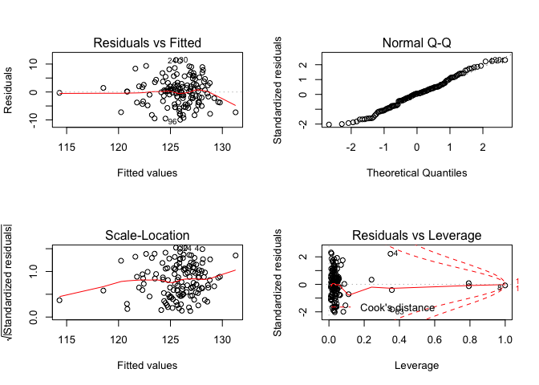<!-- -->

Full model:

    ## 
    ## Call:
    ## lm(formula = sbp ~ fuel_used_for_cooking_percent_wood_dung + 
    ##     percent_public_source + percent_private_toilet + percent_employed + 
    ##     percent_without_hs_education + percent_caste + median_age + 
    ##     percent_female + percent_marital_status, data = total)
    ## 
    ## Residuals:
    ##      Min       1Q   Median       3Q      Max 
    ## -10.2922  -3.4318   0.2388   2.7488  11.6443 
    ## 
    ## Coefficients:
    ##                                          Estimate Std. Error t value
    ## (Intercept)                             114.20967    7.02424  16.259
    ## fuel_used_for_cooking_percent_wood_dung -12.77444    9.59514  -1.331
    ## percent_public_source                    -0.02151    0.04237  -0.508
    ## percent_private_toilet                   -0.01577    0.01139  -1.385
    ## percent_employed                         -7.26651    6.49323  -1.119
    ## percent_without_hs_education             -0.83268    3.23550  -0.257
    ## percent_caste                             0.02901    0.04896   0.593
    ## median_age                                0.35598    0.10929   3.257
    ## percent_female                            0.02812    0.81579   0.034
    ## percent_marital_status                    0.01111    0.02966   0.375
    ##                                         Pr(>|t|)    
    ## (Intercept)                              < 2e-16 ***
    ## fuel_used_for_cooking_percent_wood_dung  0.18552    
    ## percent_public_source                    0.61259    
    ## percent_private_toilet                   0.16862    
    ## percent_employed                         0.26526    
    ## percent_without_hs_education             0.79733    
    ## percent_caste                            0.55456    
    ## median_age                               0.00145 ** 
    ## percent_female                           0.97256    
    ## percent_marital_status                   0.70867    
    ## ---
    ## Signif. codes:  0 '***' 0.001 '**' 0.01 '*' 0.05 '.' 0.1 ' ' 1
    ## 
    ## Residual standard error: 4.814 on 124 degrees of freedom
    ## Multiple R-squared:  0.244,  Adjusted R-squared:  0.1891 
    ## F-statistic: 4.446 on 9 and 124 DF,  p-value: 4.616e-05

    ##                                             Estimate Std. Error    t value
    ## (Intercept)                             114.20967014 7.02424392 16.2593542
    ## fuel_used_for_cooking_percent_wood_dung -12.77443949 9.59513986 -1.3313448
    ## percent_public_source                    -0.02150977 0.04237033 -0.5076612
    ## percent_private_toilet                   -0.01577229 0.01139001 -1.3847481
    ## percent_employed                         -7.26650715 6.49322883 -1.1190900
    ## percent_without_hs_education             -0.83268402 3.23549910 -0.2573588
    ## percent_caste                             0.02900884 0.04895604  0.5925488
    ## median_age                                0.35598345 0.10929454  3.2571019
    ## percent_female                            0.02811998 0.81579084  0.0344696
    ## percent_marital_status                    0.01110732 0.02965897  0.3745012
    ##                                             Pr(>|t|)
    ## (Intercept)                             1.568258e-32
    ## fuel_used_for_cooking_percent_wood_dung 1.855180e-01
    ## percent_public_source                   6.125928e-01
    ## percent_private_toilet                  1.686160e-01
    ## percent_employed                        2.652649e-01
    ## percent_without_hs_education            7.973284e-01
    ## percent_caste                           5.545622e-01
    ## median_age                              1.452003e-03
    ## percent_female                          9.725581e-01
    ## percent_marital_status                  7.086711e-01

    ##                             (Intercept) 
    ##                            114.20967014 
    ## fuel_used_for_cooking_percent_wood_dung 
    ##                            -12.77443949 
    ##                   percent_public_source 
    ##                             -0.02150977 
    ##                  percent_private_toilet 
    ##                             -0.01577229 
    ##                        percent_employed 
    ##                             -7.26650715 
    ##            percent_without_hs_education 
    ##                             -0.83268402 
    ##                           percent_caste 
    ##                              0.02900884 
    ##                              median_age 
    ##                              0.35598345 
    ##                          percent_female 
    ##                              0.02811998 
    ##                  percent_marital_status 
    ##                              0.01110732

    ##        1        2        3        4        5        6        7        8 
    ## 124.0629 125.2714 126.5519 127.6249 129.5335 123.9260 124.9106 126.1060 
    ##        9       10       11       12       13       14       15       16 
    ## 127.7916 124.5396 123.3537 124.3181 124.8365 123.4856 127.5317 121.7034 
    ##       17       18       19       20       21       22       23       24 
    ## 126.6065 121.8489 126.8330 125.4769 122.7776 125.0723 124.7534 126.7628 
    ##       25       26       27       28       29       30       31       32 
    ## 126.0535 123.6434 127.0009 126.8262 124.9449 125.3557 123.7200 127.4744 
    ##       33       34       35       36       37       38       39       40 
    ## 123.3847 126.5533 125.2418 126.7062 130.3165 128.1272 127.5542 123.5773 
    ##       41       42       43       44       45       46       47       48 
    ## 131.3975 128.0489 126.6123 125.3623 128.4339 126.3958 126.9733 126.9499 
    ##       49       50       51       52       53       54       55       56 
    ## 127.8841 129.2435 130.1676 128.1270 130.2949 128.6021 125.4389 123.5701 
    ##       57       58       59       60       61       62       63       64 
    ## 123.2664 124.3439 122.4235 123.7014 119.8557 125.4144 132.2630 127.4677 
    ##       65       66       67       68       69       70       71       72 
    ## 124.3767 124.7136 123.6528 124.2949 123.9478 122.6920 126.0352 127.8477 
    ##       73       74       75       76       77       78       79       80 
    ## 128.7224 121.3244 125.3572 128.1889 124.2922 124.7465 130.2363 127.2958 
    ##       81       82       83       84       85       86       87       88 
    ## 129.6074 127.1715 122.7341 121.1018 123.9253 124.0804 123.2764 125.2141 
    ##       89       90       91       92       93       94       95       96 
    ## 123.5643 124.6725 128.2779 125.2288 124.3158 125.5029 127.2921 124.4562 
    ##       97       98       99      100      101      102      103      104 
    ## 126.6567 128.1860 123.7828 128.3390 121.6261 128.0831 127.1844 127.3388 
    ##      105      106      107      108      109      110      111      112 
    ## 127.8904 126.6837 124.8601 127.2357 125.8400 129.6039 126.3626 124.3043 
    ##      113      114      115      116      117      118      119      120 
    ## 121.8505 124.4969 126.9170 129.0916 128.5648 132.0618 128.3513 131.2448 
    ##      121      122      123      124      125      126      127      128 
    ## 124.6413 123.3276 120.6560 122.9135 126.4904 128.0509 124.8088 126.2666 
    ##      129      130      131      132      133      134 
    ## 128.6380 124.6880 126.7896 125.8890 123.7185 114.0221

    ## # A tibble: 1 x 11
    ##   r.squared adj.r.squared sigma statistic p.value    df logLik   AIC   BIC
    ##       <dbl>         <dbl> <dbl>     <dbl>   <dbl> <int>  <dbl> <dbl> <dbl>
    ## 1     0.244         0.189  4.81      4.45 4.62e-5    10  -396.  813.  845.
    ## # … with 2 more variables: deviance <dbl>, df.residual <int>

| term                                          | estimate | p.value |
| :-------------------------------------------- | -------: | ------: |
| (Intercept)                                   |  114.210 |   0.000 |
| fuel\_used\_for\_cooking\_percent\_wood\_dung | \-12.774 |   0.186 |
| percent\_public\_source                       |  \-0.022 |   0.613 |
| percent\_private\_toilet                      |  \-0.016 |   0.169 |
| percent\_employed                             |  \-7.267 |   0.265 |
| percent\_without\_hs\_education               |  \-0.833 |   0.797 |
| percent\_caste                                |    0.029 |   0.555 |
| median\_age                                   |    0.356 |   0.001 |
| percent\_female                               |    0.028 |   0.973 |
| percent\_marital\_status                      |    0.011 |   0.709 |

| sbp | fuel\_used\_for\_cooking\_percent\_wood\_dung | percent\_public\_source | percent\_private\_toilet | percent\_employed | percent\_without\_hs\_education | percent\_caste | median\_age | percent\_female | percent\_marital\_status |  .fitted |   .se.fit |       .resid |      .hat |   .sigma |     .cooksd |  .std.resid |
| --: | --------------------------------------------: | ----------------------: | -----------------------: | ----------------: | ------------------------------: | -------------: | ----------: | --------------: | -----------------------: | -------: | --------: | -----------: | --------: | -------: | ----------: | ----------: |
| 127 |                                     0.0000000 |               0.0270270 |              100.0000000 |         0.5405405 |                       0.0270270 |      0.5675676 |    43.08108 |       0.7017544 |                0.8108108 | 124.0629 | 1.1064241 |    2.9371317 | 0.0528132 | 4.826356 |   0.0021909 |   0.6268381 |
| 126 |                                     0.0000000 |               0.0789474 |                0.7368421 |         0.5789474 |                       0.0263158 |      0.2368421 |    42.89474 |       0.6666667 |                0.7631579 | 125.2714 | 1.0395217 |    0.7285774 | 0.0466194 | 4.833553 |   0.0001175 |   0.1549859 |
| 127 |                                     0.0277778 |               0.0555556 |                0.4722222 |         0.4444444 |                       0.3055556 |      0.7500000 |    45.33333 |       0.7142857 |                0.8947368 | 126.5519 | 0.6591694 |    0.4481115 | 0.0187453 | 4.833849 |   0.0000169 |   0.0939604 |
| 137 |                                     0.0000000 |               0.1538462 |                0.7692308 |         0.6153846 |                       0.0000000 |      0.4615385 |    47.07692 |       0.7000000 |              100.0000000 | 127.6249 | 2.8482610 |    9.3750580 | 0.3499928 | 4.718945 |   0.3141016 |   2.4152640 |
| 132 |                                     0.0277778 |               0.1944444 |                0.8333333 |         0.3888889 |                       0.2500000 |      0.3888889 |    52.50000 |       0.6909091 |                0.9166667 | 129.5335 | 1.1035616 |    2.4665139 | 0.0525403 | 4.828618 |   0.0015362 |   0.5263237 |
| 126 |                                     0.0000000 |               0.3076923 |                0.7435897 |         0.5128205 |                       0.2820513 |      0.4871795 |    38.35897 |       0.6551724 |                0.7435897 | 123.9260 | 0.6624033 |    2.0739746 | 0.0189297 | 4.830333 |   0.0003650 |   0.4349137 |
| 132 |                                     0.0000000 |               0.1351351 |                0.5405405 |         0.6486486 |                       0.3513514 |      0.9189189 |    44.00000 |       0.7017544 |                0.7837838 | 124.9106 | 1.2450975 |    7.0893692 | 0.0668815 | 4.788513 |   0.0166551 |   1.5243649 |
| 126 |                                     0.0526316 |               0.3947368 |                0.9473684 |         0.5789474 |                       0.2631579 |    100.0000000 |    39.57895 |       0.6666667 |                0.8157895 | 126.1060 | 4.8133669 |  \-0.1059877 | 0.9995337 | 4.813720 | 222.7787178 | \-1.0194636 |
| 124 |                                     0.0000000 |               0.2777778 |                0.3611111 |         0.4166667 |                       0.4722222 |      0.0000000 |    47.72222 |       0.6153846 |                0.8055556 | 127.7916 | 1.1894185 |  \-3.7916499 | 0.0610336 | 4.821128 |   0.0042936 | \-0.8127425 |
| 125 |                                     0.0000000 |               0.1500000 |                0.8500000 |         0.4250000 |                       0.3500000 |      0.0750000 |    38.47500 |       0.6666667 |                0.8000000 | 124.5396 | 0.9102025 |    0.4603963 | 0.0357417 | 4.833836 |   0.0000352 |   0.0973834 |
| 125 |                                     0.0000000 |               0.1071429 |                0.9285714 |         0.6666667 |                       0.3392857 |      0.6785714 |    40.00000 |       0.6666667 |                0.9107143 | 123.3537 | 1.1589365 |    1.6462512 | 0.0579454 | 4.831601 |   0.0007634 |   0.3522961 |
| 122 |                                     0.0000000 |               0.0344828 |                0.9137931 |         0.4655172 |                       0.2068966 |      0.4137931 |    38.31034 |       0.6666667 |                0.8965517 | 124.3181 | 0.8426336 |  \-2.3181093 | 0.0306321 | 4.829357 |   0.0007557 | \-0.4890343 |
| 128 |                                     0.0000000 |               0.3818182 |                0.8000000 |         0.4909091 |                       0.2727273 |      0.8727273 |    40.41818 |       0.6585366 |                0.8909091 | 124.8365 | 0.5708695 |    3.1635163 | 0.0140596 | 4.825478 |   0.0006245 |   0.6617508 |
| 125 |                                     0.0000000 |               0.1636364 |                0.8909091 |         0.4909091 |                       0.1818182 |      0.6545455 |    36.41818 |       0.6746988 |                0.8909091 | 123.4856 | 0.9855337 |    1.5143671 | 0.0419027 | 4.832008 |   0.0004516 |   0.3213484 |
| 134 |                                     0.0000000 |               0.0000000 |              100.0000000 |         0.4545455 |                       0.0606061 |      0.2121212 |    51.18182 |       0.6250000 |                0.8181818 | 127.5317 | 0.8387555 |    6.4682864 | 0.0303508 | 4.797599 |   0.0058267 |   1.3643685 |
| 113 |                                     0.0263158 |               0.8684211 |                0.1315789 |         0.7368421 |                       0.4736842 |      0.8157895 |    38.05263 |       0.6896552 |                0.9210526 | 121.7034 | 1.5387868 |  \-8.7034439 | 0.1021542 | 4.762545 |   0.0414128 | \-1.9078315 |
| 122 |                                     0.0000000 |               0.2702703 |                0.7837838 |         0.4594595 |                       0.1891892 |      0.5945946 |    44.56757 |       0.6785714 |                0.8648649 | 126.6065 | 0.5555968 |  \-4.6065471 | 0.0133174 | 4.815902 |   0.0012523 | \-0.9632445 |
| 122 |                                     0.1025641 |               0.0256410 |                0.9487179 |         0.5897436 |                       0.2820513 |      0.6923077 |    37.74359 |       0.6551724 |                0.9487179 | 121.8489 | 1.1244886 |    0.1511419 | 0.0545519 | 4.834001 |   0.0000060 |   0.0322861 |
| 127 |                                     0.0000000 |               0.2105263 |                0.9473684 |         0.4210526 |                       0.5263158 |      0.6315789 |    45.21053 |       0.6666667 |                0.8421053 | 126.8330 | 1.1981942 |    0.1670164 | 0.0619375 | 4.833996 |   0.0000085 |   0.0358173 |
| 121 |                                     0.0000000 |               0.0263158 |                0.8947368 |         0.4473684 |                       0.2105263 |      0.2894737 |    41.21053 |       0.6896552 |                0.8947368 | 125.4769 | 0.6841420 |  \-4.4768782 | 0.0201926 | 4.816789 |   0.0018187 | \-0.9394089 |
| 130 |                                     0.0540541 |               0.7837838 |                0.5675676 |         0.5405405 |                       0.7297297 |      0.1621622 |    38.72973 |       0.6071429 |                0.9729730 | 122.7776 | 1.3923300 |    7.2224000 | 0.0836342 | 4.785913 |   0.0224134 |   1.5671005 |
| 134 |                                     0.0000000 |               0.1500000 |                0.9000000 |         0.5500000 |                       0.1500000 |      0.4250000 |    42.02500 |       0.6666667 |                0.9250000 | 125.0723 | 0.7098806 |    8.9276787 | 0.0217405 | 4.765015 |   0.0078116 |   1.8748273 |
| 133 |                                     0.0000000 |               0.6923077 |                0.6666667 |         0.4871795 |                       0.4102564 |      0.0256410 |    40.51282 |       0.6779661 |                0.8205128 | 124.7534 | 0.6956006 |    8.2466277 | 0.0208747 | 4.775256 |   0.0063884 |   1.7310396 |
| 137 |                                     0.0000000 |               0.8461538 |                0.6923077 |         0.4615385 |                       0.3076923 |      0.2307692 |    45.38462 |       0.6779661 |                0.9230769 | 126.7628 | 0.6362567 |   10.2372491 | 0.0174648 | 4.743477 |   0.0081796 |   2.1451564 |
| 136 |                                     0.0000000 |               0.5365854 |                0.6585366 |         0.3902439 |                       0.3170732 |      0.3658537 |    41.92683 |       0.6774194 |                0.9512195 | 126.0535 | 0.8928452 |    9.9465053 | 0.0343916 | 4.747081 |   0.0157431 |   2.1024213 |
| 128 |                                     0.0769231 |               0.3333333 |                0.7179487 |         0.5384615 |                       0.3589744 |      0.7435897 |    41.00000 |       0.6779661 |                0.9487179 | 123.6434 | 0.7817636 |    4.3566252 | 0.0263664 | 4.817600 |   0.0022775 |   0.9170693 |
| 133 |                                     0.0000000 |               0.4102564 |                0.7179487 |         0.4102564 |                       0.1282051 |      0.2051282 |    44.56410 |       0.6551724 |                0.9743590 | 127.0009 | 0.7703234 |    5.9990841 | 0.0256003 | 4.802861 |   0.0041864 |   1.2623103 |
| 136 |                                     0.0000000 |               0.1538462 |                0.7948718 |         0.4615385 |                       0.1538462 |      0.0512821 |    45.17949 |       0.6779661 |                0.9487179 | 126.8262 | 0.5845857 |    9.1738143 | 0.0147433 | 4.761649 |   0.0055144 |   1.9196630 |
| 131 |                                     0.0000000 |               0.9250000 |                0.8250000 |         0.4500000 |                       0.6250000 |      0.1750000 |    40.80000 |       0.6666667 |                0.9500000 | 124.9449 | 1.2817282 |    6.0550943 | 0.0708747 | 4.800723 |   0.0129863 |   1.3047687 |
| 137 |                                     0.0000000 |               0.2307692 |                0.8974359 |         0.5128205 |                       0.2307692 |      0.1538462 |    42.28205 |       0.6551724 |                0.8205128 | 125.3557 | 0.5329717 |   11.6443095 | 0.0122548 | 4.717174 |   0.0073476 |   2.4335543 |
| 129 |                                     0.0000000 |               0.1750000 |                0.7750000 |         0.5000000 |                       0.1750000 |      0.2500000 |    37.27500 |       0.6666667 |                0.9000000 | 123.7200 | 0.9070229 |    5.2800123 | 0.0354925 | 4.809653 |   0.0045887 |   1.1166880 |
| 133 |                                     0.0000000 |               0.1025641 |                0.7948718 |         0.3589744 |                       0.1794872 |      0.2564103 |    44.94872 |       0.6551724 |                0.9487179 | 127.4744 | 0.9541444 |    5.5256198 | 0.0392760 | 4.807222 |   0.0056052 |   1.1709314 |
| 124 |                                     0.0000000 |               0.0270270 |              100.0000000 |         0.5945946 |                       0.0270270 |      0.0270270 |    42.32432 |       0.7017544 |                0.7837838 | 123.3847 | 1.2605949 |    0.6152894 | 0.0685568 | 4.833679 |   0.0001291 |   0.1324192 |
| 128 |                                     0.0263158 |               0.4736842 |                0.9210526 |         0.4473684 |                       0.2631579 |      0.8157895 |    45.28947 |       0.6896552 |                0.8157895 | 126.5533 | 0.6057130 |    1.4467259 | 0.0158283 | 4.832232 |   0.0001476 |   0.3029009 |
| 131 |                                     0.0256410 |               0.2307692 |                0.9743590 |         0.5384615 |                       0.1538462 |      0.4102564 |    43.20513 |       0.6551724 |                0.9230769 | 125.2418 | 0.6797681 |    5.7581631 | 0.0199352 | 4.805488 |   0.0029688 |   1.2081096 |
| 136 |                                     0.0000000 |               0.0188679 |              100.0000000 |         0.3773585 |                       0.0754717 |      0.1320755 |    47.32075 |       0.6750000 |                0.9811321 | 126.7062 | 1.0464240 |    9.2937718 | 0.0472405 | 4.757175 |   0.0193924 |   1.9776531 |
| 126 |                                     0.0000000 |               0.0526316 |                0.9473684 |         0.3157895 |                       0.0789474 |      0.0000000 |    51.84211 |       0.6666667 |                0.8684211 | 130.3165 | 1.1809364 |  \-4.3164952 | 0.0601662 | 4.817321 |   0.0054754 | \-0.9248163 |
| 128 |                                     0.0000000 |               0.0000000 |                0.9750000 |         0.5000000 |                       0.0250000 |      0.0000000 |    48.85000 |       6.6666667 |                0.8750000 | 128.1272 | 4.8115930 |  \-0.1271985 | 0.9987971 | 4.822697 |  48.1801868 | \-0.7617521 |
| 126 |                                     0.0000000 |               0.0769231 |                0.8846154 |         0.4230769 |                       0.0961538 |      0.0192308 |    46.30769 |       0.6666667 |                0.9423077 | 127.5542 | 0.7327720 |  \-1.5542490 | 0.0231653 | 4.831941 |   0.0002530 | \-0.3266328 |
| 118 |                                     0.0000000 |               0.8285714 |                0.0285714 |         0.6000000 |                       0.4571429 |      0.4000000 |    39.57143 |       0.6274510 |                0.9428571 | 123.5773 | 0.9532190 |  \-5.5773310 | 0.0391999 | 4.806718 |   0.0056986 | \-1.1818426 |
| 126 |                                     0.0000000 |               0.0000000 |              100.0000000 |         0.3030303 |                       0.0000000 |      0.0303030 |    58.81818 |       0.6800000 |                0.7878788 | 131.3975 | 1.3088619 |  \-5.3975200 | 0.0739073 | 4.807494 |   0.0108309 | \-1.1649754 |
| 126 |                                     0.0000000 |               0.0000000 |              100.0000000 |         0.4000000 |                       0.0333333 |      0.0000000 |    51.46667 |       0.6956522 |                0.9000000 | 128.0489 | 0.8848335 |  \-2.0489216 | 0.0337771 | 4.830366 |   0.0006553 | \-0.4329487 |
| 121 |                                     0.0000000 |               0.0000000 |              100.0000000 |         0.4444444 |                       0.0000000 |      0.0000000 |    48.25926 |       0.6829268 |                0.9629630 | 126.6123 | 0.8835326 |  \-5.6122794 | 0.0336779 | 4.806533 |   0.0049009 | \-1.1858454 |
| 128 |                                     0.0000000 |               0.0263158 |              100.0000000 |         0.5526316 |                       0.0526316 |      0.0789474 |    47.07895 |       0.6428571 |                0.9210526 | 125.3623 | 0.9975947 |    2.6377283 | 0.0429346 | 4.827904 |   0.0014070 |   0.5600271 |
| 124 |                                     0.0000000 |               0.0000000 |              100.0000000 |         0.3947368 |                       0.1052632 |      0.0526316 |    52.60526 |       0.6896552 |                0.8947368 | 128.4339 | 0.9438631 |  \-4.4338927 | 0.0384342 | 4.816797 |   0.0035256 | \-0.9391726 |
| 126 |                                     0.0000000 |               0.0000000 |                0.9666667 |         0.5666667 |                       0.0333333 |      0.1000000 |    45.83333 |       0.6666667 |                0.8333333 | 126.3958 | 0.9914894 |  \-0.3957919 | 0.0424107 | 4.833883 |   0.0000313 | \-0.0840092 |
| 132 |                                     0.0400000 |               0.0000000 |              100.0000000 |         0.5000000 |                       0.1000000 |      0.0000000 |    52.08000 |       0.6666667 |                0.9000000 | 126.9733 | 0.9919871 |    5.0266975 | 0.0424533 | 4.811780 |   0.0050473 |   1.0669708 |
| 129 |                                     0.0000000 |               0.0000000 |              100.0000000 |         0.4761905 |                       0.0000000 |      0.0000000 |    49.85714 |       0.6875000 |                0.9047619 | 126.9499 | 0.8542480 |    2.0501011 | 0.0314824 | 4.830370 |   0.0006086 |   0.4326844 |
| 126 |                                     0.0000000 |               0.0000000 |              100.0000000 |         0.4473684 |                       0.0000000 |      0.0263158 |    51.89474 |       0.6428571 |                0.8947368 | 127.8841 | 0.8540531 |  \-1.8840810 | 0.0314680 | 4.830938 |   0.0005137 | \-0.3976421 |
| 130 |                                     0.0000000 |               0.0000000 |                0.9855072 |         0.4347826 |                       0.0144928 |      0.0434783 |    51.10145 |       0.6730769 |                0.8405797 | 129.2435 | 0.9240617 |    0.7564974 | 0.0368385 | 4.833521 |   0.0000980 |   0.1601060 |
| 127 |                                     0.0000000 |               0.0000000 |              100.0000000 |         0.4615385 |                       0.0512821 |      0.0000000 |    58.71795 |       0.6779661 |                0.8974359 | 130.1676 | 1.2932533 |  \-3.1676169 | 0.0721550 | 4.824919 |   0.0036281 | \-0.6830377 |
| 127 |                                     0.0000000 |               0.0000000 |              100.0000000 |         0.5483871 |                       0.0000000 |      0.0000000 |    51.54839 |       0.6521739 |              100.0000000 | 128.1270 | 2.8809810 |  \-1.1270258 | 0.3580802 | 4.832357 |   0.0047620 | \-0.2921751 |
| 123 |                                     0.0000000 |               0.0000000 |              100.0000000 |         0.4117647 |                       0.0000000 |      0.0000000 |    57.94118 |       0.6400000 |                0.9411765 | 130.2949 | 1.1202728 |  \-7.2949002 | 0.0541436 | 4.786475 |   0.0138942 | \-1.5579607 |
| 132 |                                     0.0000000 |               0.1304348 |                0.8695652 |         0.4347826 |                       0.1304348 |      0.1086957 |    49.56522 |       0.6666667 |                0.9565217 | 128.6021 | 0.7611701 |    3.3978911 | 0.0249956 | 4.824053 |   0.0013097 |   0.7147529 |
| 127 |                                     0.0000000 |               0.0000000 |              100.0000000 |         0.5641026 |                       0.1025641 |      0.1282051 |    47.64103 |       0.6551724 |                0.8461538 | 125.4389 | 1.0314736 |    1.5610604 | 0.0459003 | 4.831873 |   0.0005301 |   0.3319499 |
| 121 |                                     0.0000000 |               0.1315789 |                0.9736842 |         0.4736842 |                       0.2105263 |      0.4210526 |    36.39474 |       0.6666667 |                0.8157895 | 123.5701 | 0.9829829 |  \-2.5700972 | 0.0416861 | 4.828221 |   0.0012935 | \-0.5453124 |
| 117 |                                     0.0000000 |               0.0500000 |                0.9500000 |         0.5250000 |                       0.0750000 |      0.5750000 |    36.25000 |       0.7096774 |                0.8250000 | 123.2664 | 1.1856317 |  \-6.2664432 | 0.0606456 | 4.798739 |   0.0116435 | \-1.3429385 |
| 122 |                                     0.0000000 |               0.0243902 |                0.8536585 |         0.5121951 |                       0.1951220 |      0.2682927 |    39.31707 |       0.6984127 |                0.8048780 | 124.3439 | 0.6973328 |  \-2.3439265 | 0.0209788 | 4.829300 |   0.0005188 | \-0.4920369 |
| 118 |                                     0.0000000 |               0.4594595 |                0.4324324 |         0.4054054 |                       0.4594595 |      0.4324324 |    32.35135 |       0.6785714 |                0.9729730 | 122.4235 | 1.4820931 |  \-4.4234796 | 0.0947655 | 4.815810 |   0.0097624 | \-0.9656800 |
| 125 |                                     0.0000000 |               0.0512821 |                0.8717949 |         0.5128205 |                       0.2307692 |      0.5384615 |    37.58974 |       0.6779661 |                0.8205128 | 123.7014 | 0.7702395 |    1.2986300 | 0.0255948 | 4.832565 |   0.0001961 |   0.2732533 |
| 120 |                                     0.2549020 |               0.3421053 |                0.7894737 |         0.6052632 |                       0.7368421 |      0.1052632 |    39.05263 |       0.6428571 |                0.9473684 | 119.8557 | 2.4019608 |    0.1443317 | 0.2489037 | 4.833998 |   0.0000397 |   0.0345910 |
| 129 |                                     0.0000000 |               0.1538462 |                0.8974359 |         0.5128205 |                       0.2051282 |      0.0769231 |    42.38462 |       0.6551724 |                0.9487179 | 125.4144 | 0.5513112 |    3.5856003 | 0.0131127 | 4.823054 |   0.0007468 |   0.7496833 |
| 124 |                                     0.0000000 |               0.0000000 |                0.8333333 |         0.4166667 |                       0.0000000 |      0.0000000 |    56.08333 |       0.6666667 |              100.0000000 | 132.2630 | 2.8990903 |  \-8.2630325 | 0.3625960 | 4.743087 |   0.2628886 | \-2.1497196 |
| 123 |                                     0.0000000 |               0.0000000 |                0.9729730 |         0.4054054 |                       0.1621622 |      0.0000000 |    45.86486 |       0.6545455 |                0.7837838 | 127.4677 | 0.7264269 |  \-4.4676574 | 0.0227658 | 4.816815 |   0.0020528 | \-0.9387075 |
| 125 |                                     0.0000000 |               0.2666667 |                0.8000000 |         0.4666667 |                       0.2666667 |      0.1333333 |    38.66667 |       0.6956522 |                0.9333333 | 124.3767 | 0.7460782 |    0.6232795 | 0.0240142 | 4.833686 |   0.0000423 |   0.1310421 |
| 125 |                                     0.0256410 |               0.0512821 |                0.8974359 |         0.4871795 |                       0.4102564 |      0.7692308 |    41.23077 |       0.6551724 |                0.9230769 | 124.7136 | 0.6622098 |    0.2863821 | 0.0189187 | 4.833951 |   0.0000070 |   0.0600542 |
| 124 |                                     0.0500000 |               0.2500000 |                0.7000000 |         0.5000000 |                       0.4250000 |      0.4250000 |    39.45000 |       0.6666667 |                0.9750000 | 123.6528 | 0.7293620 |    0.3471620 | 0.0229502 | 4.833917 |   0.0000125 |   0.0729497 |
| 125 |                                     0.0000000 |               0.2500000 |                0.6500000 |         0.5000000 |                       0.3250000 |      0.4500000 |    39.22500 |       0.6666667 |                0.8500000 | 124.2949 | 0.6178727 |    0.7051425 | 0.0164701 | 4.833596 |   0.0000365 |   0.1476838 |
| 128 |                                     0.0000000 |               0.1351351 |                0.8918919 |         0.5675676 |                       0.2972973 |      0.4324324 |    39.56757 |       0.6545455 |                0.9459459 | 123.9478 | 0.6768490 |    4.0522359 | 0.0197644 | 4.819914 |   0.0014572 |   0.8501180 |
| 124 |                                     0.0000000 |               0.2500000 |                0.8888889 |         0.6666667 |                       0.4166667 |      0.6111111 |    38.33333 |       0.6666667 |                0.9444444 | 122.6920 | 1.1726460 |    1.3080201 | 0.0593244 | 4.832491 |   0.0004949 |   0.2801201 |
| 119 |                                     0.0000000 |               0.0000000 |              100.0000000 |         0.5454545 |                       0.0000000 |      0.0000000 |    48.70455 |       0.6461538 |                0.9090909 | 126.0352 | 1.0123253 |  \-7.0351709 | 0.0442120 | 4.790278 |   0.0103339 | \-1.4946641 |
| 129 |                                     0.0000000 |               0.0000000 |                0.9607843 |         0.5294118 |                       0.0000000 |      0.0196078 |    49.07843 |       0.6578947 |                0.9019608 | 127.8477 | 1.0159102 |    1.1522615 | 0.0445256 | 4.832852 |   0.0002794 |   0.2448450 |
| 121 |                                     0.0000000 |               0.0000000 |                0.9285714 |         0.3928571 |                       0.0000000 |      0.0000000 |    48.75000 |       0.6666667 |                0.8214286 | 128.7224 | 0.9579515 |  \-7.7223889 | 0.0395901 | 4.781520 |   0.0110427 | \-1.6367152 |
| 121 |                                     0.0975610 |               0.3414634 |                0.2439024 |         0.5609756 |                       0.7317073 |      0.2195122 |    36.58537 |       0.6774194 |                0.7804878 | 121.3244 | 1.4342910 |  \-0.3244481 | 0.0887512 | 4.833924 |   0.0000485 | \-0.0705954 |
| 124 |                                     0.0000000 |               0.0000000 |                0.9333333 |         0.5833333 |                       0.0166667 |      0.0333333 |    43.21667 |       0.6813187 |                0.9333333 | 125.3572 | 1.0700602 |  \-1.3571860 | 0.0493987 | 4.832391 |   0.0004344 | \-0.2891279 |
| 125 |                                     0.0000000 |               0.0750000 |                0.9000000 |         0.4250000 |                       0.2250000 |      0.1000000 |    48.42500 |       0.6666667 |                0.9500000 | 128.1889 | 0.7388587 |  \-3.1889405 | 0.0235517 | 4.825255 |   0.0010837 | \-0.6703036 |
| 114 |                                     0.0000000 |               0.5263158 |                0.5789474 |         0.5526316 |                       0.4736842 |      0.3684211 |    40.65789 |       0.6428571 |                0.9736842 | 124.2922 | 0.8735793 | \-10.2922046 | 0.0329234 | 4.741015 |   0.0160879 | \-2.1738407 |
| 127 |                                     0.0000000 |               0.6000000 |                0.3500000 |         0.5500000 |                       0.4750000 |      0.1000000 |    41.90000 |       0.6666667 |                0.9000000 | 124.7465 | 0.9190138 |    2.2535092 | 0.0364371 | 4.829587 |   0.0008598 |   0.4768360 |
| 127 |                                     0.0000000 |               0.0263158 |                0.9736842 |         0.5000000 |                       0.0526316 |      0.0000000 |    55.31579 |       0.6666667 |                0.8421053 | 130.2363 | 1.3148838 |  \-3.2362736 | 0.0745889 | 4.824494 |   0.0039355 | \-0.6987593 |
| 126 |                                     0.0256410 |               0.0000000 |              100.0000000 |         0.5641026 |                       0.0512821 |      0.0000000 |    53.66667 |       0.6779661 |                0.8205128 | 127.2958 | 1.2599145 |  \-1.2957572 | 0.0684828 | 4.832505 |   0.0005717 | \-0.2788547 |
| 132 |                                     0.0000000 |               0.0303030 |              100.0000000 |         0.3636364 |                       0.0000000 |      0.0303030 |    55.03030 |       0.6800000 |                0.7272727 | 129.6074 | 1.0170652 |    2.3926215 | 0.0446269 | 4.828980 |   0.0012075 |   0.5084371 |
| 131 |                                     0.0000000 |               0.0000000 |              100.0000000 |         0.3750000 |                       0.0000000 |      0.0000000 |    48.41667 |       0.6666667 |                0.8750000 | 127.1715 | 1.0490944 |    3.8285019 | 0.0474820 | 4.821064 |   0.0033093 |   0.8147831 |
| 115 |                                     0.0000000 |               0.9750000 |                0.0000000 |         0.5500000 |                       0.5250000 |      0.3750000 |    36.35000 |       0.6206897 |                0.9750000 | 122.7341 | 0.9481764 |  \-7.7341202 | 0.0387862 | 4.781404 |   0.0108333 | \-1.6385160 |
| 121 |                                     0.0000000 |             100.0000000 |                0.0000000 |         0.5405405 |                       0.6216216 |      0.6756757 |    37.75676 |       0.6296296 |                0.9459459 | 121.1018 | 4.2887335 |  \-0.1018301 | 0.7935195 | 4.833979 |   0.0008326 | \-0.0465464 |
| 120 |                                     0.0000000 |               0.2931034 |                0.6896552 |         0.5344828 |                       0.1896552 |      0.3275862 |    38.58621 |       0.6511628 |                0.9655172 | 123.9253 | 0.7603047 |  \-3.9253315 | 0.0249388 | 4.820714 |   0.0017437 | \-0.8256769 |
| 126 |                                     0.0000000 |               0.0000000 |                0.9148936 |         0.5744681 |                       0.1914894 |      0.4255319 |    39.82979 |       0.6571429 |                0.8510638 | 124.0804 | 0.7733905 |    1.9195652 | 0.0258046 | 4.830839 |   0.0004322 |   0.4039518 |
| 124 |                                     0.0000000 |               0.1666667 |                0.8333333 |         0.6666667 |                       0.3611111 |      0.7500000 |    39.83333 |       0.6666667 |                0.7222222 | 123.2764 | 1.1669774 |    0.7235553 | 0.0587522 | 4.833553 |   0.0001498 |   0.1549064 |
| 128 |                                     0.0000000 |               0.0000000 |                0.7068966 |         0.5517241 |                       0.2586207 |      0.5172414 |    42.68966 |       0.6511628 |                0.8965517 | 125.2141 | 0.6330717 |    2.7858517 | 0.0172904 | 4.827375 |   0.0005995 |   0.5837073 |
| 125 |                                     0.0000000 |               0.0869565 |                0.7391304 |         0.5652174 |                       0.2826087 |      0.2608696 |    38.41304 |       0.6666667 |                0.8913043 | 123.5643 | 0.7065842 |    1.4357161 | 0.0215391 | 4.832249 |   0.0002001 |   0.3014717 |
| 125 |                                     0.0000000 |               0.0000000 |                0.9743590 |         0.5384615 |                       0.3333333 |      0.2564103 |    41.10256 |       0.6551724 |                0.9743590 | 124.6725 | 0.6061354 |    0.3274770 | 0.0158503 | 4.833929 |   0.0000076 |   0.0685646 |
| 128 |                                     0.0175439 |               0.0000000 |                0.9824561 |         0.3859649 |                       0.0350877 |      0.0350877 |    48.07018 |       0.6588235 |                0.8947368 | 128.2779 | 0.9615277 |  \-0.2778968 | 0.0398862 | 4.833953 |   0.0000144 | \-0.0589077 |
| 125 |                                     0.0000000 |               0.0000000 |              100.0000000 |         0.4531250 |                       0.0312500 |      0.0156250 |    44.62500 |       0.6666667 |                0.9062500 | 125.2288 | 1.0169389 |  \-0.2288106 | 0.0446159 | 4.833975 |   0.0000110 | \-0.0486225 |
| 120 |                                     0.0169492 |               0.1355932 |                0.7796610 |         0.4915254 |                       0.2711864 |      0.2372881 |    39.61017 |       0.6590909 |                0.8474576 | 124.3158 | 0.6139783 |  \-4.3158498 | 0.0162632 | 4.818072 |   0.0013505 | \-0.9038089 |
| 123 |                                     0.0000000 |               0.2131148 |                0.9672131 |         0.5081967 |                       0.4426230 |      0.1147541 |    43.09836 |       0.6739130 |                0.8852459 | 125.5029 | 0.8227679 |  \-2.5028659 | 0.0292048 | 4.828592 |   0.0008375 | \-0.5276228 |
| 132 |                                     0.0000000 |               0.0800000 |                0.9800000 |         0.4800000 |                       0.1800000 |      0.0000000 |    46.94000 |       0.6486486 |                0.8400000 | 127.2921 | 0.6202042 |    4.7078807 | 0.0165947 | 4.815031 |   0.0016408 |   0.9860727 |
| 116 |                                     0.0000000 |               0.0526316 |                0.8684211 |         0.5526316 |                       0.0526316 |      0.2105263 |    40.13158 |       0.6428571 |                0.9473684 | 124.4562 | 0.9941773 |  \-8.4561992 | 0.0426410 | 4.770797 |   0.0143525 | \-1.7950954 |
| 124 |                                     0.0000000 |               0.0000000 |              100.0000000 |         0.4000000 |                       0.0750000 |      0.0500000 |    47.65000 |       0.6666667 |                0.9500000 | 126.6567 | 0.9525936 |  \-2.6567470 | 0.0391485 | 4.827840 |   0.0012912 | \-0.5629526 |
| 128 |                                     0.0000000 |               0.0285714 |                0.9142857 |         0.4571429 |                       0.0857143 |      0.1142857 |    48.74286 |       0.6792453 |                0.9428571 | 128.1860 | 0.7422336 |  \-0.1859692 | 0.0237673 | 4.833991 |   0.0000037 | \-0.0390944 |
| 118 |                                     0.0540541 |               0.1081081 |                0.1351351 |         0.5675676 |                       0.5405405 |      0.2432432 |    41.59459 |       0.6785714 |                0.8378378 | 123.7828 | 1.0444238 |  \-5.7828009 | 0.0470601 | 4.804421 |   0.0074765 | \-1.2304253 |
| 133 |                                     0.0000000 |               0.0175439 |              100.0000000 |         0.4561404 |                       0.0000000 |      0.0000000 |    53.35088 |       0.6744186 |                0.9473684 | 128.3390 | 0.9006382 |    4.6609671 | 0.0349945 | 4.815053 |   0.0035220 |   0.9855097 |
| 118 |                                     0.0416667 |               0.2708333 |                0.3125000 |         0.5625000 |                       0.6666667 |      0.3541667 |    35.29167 |       0.6666667 |                0.8750000 | 121.6261 | 1.2033780 |  \-3.6261033 | 0.0624746 | 4.822213 |   0.0040320 | \-0.7778546 |
| 132 |                                     0.0000000 |               0.0000000 |              100.0000000 |         0.3859649 |                       0.0350877 |      0.0175439 |    51.28070 |       0.6744186 |                0.8947368 | 128.0831 | 0.9188069 |    3.9169003 | 0.0364207 | 4.820613 |   0.0025963 |   0.8287977 |
| 124 |                                     0.0000000 |               0.0000000 |              100.0000000 |         0.4871795 |                       0.1025641 |      0.1025641 |    50.97436 |       0.6779661 |                0.8461538 | 127.1844 | 0.8899217 |  \-3.1844103 | 0.0341667 | 4.825184 |   0.0016023 | \-0.6730196 |
| 128 |                                     0.0000000 |               0.0000000 |              100.0000000 |         0.4102564 |                       0.2564103 |      0.3589744 |    50.17949 |       0.6551724 |                0.8205128 | 127.3388 | 1.0761704 |    0.6611816 | 0.0499645 | 4.833634 |   0.0001044 |   0.1408966 |
| 120 |                                     0.0000000 |               0.0000000 |              100.0000000 |         0.5333333 |                       0.0333333 |      0.1333333 |    53.73333 |       0.6666667 |                0.9333333 | 127.8904 | 1.1342790 |  \-7.8903728 | 0.0555059 | 4.778269 |   0.0167123 | \-1.6863497 |
| 128 |                                     0.0000000 |               0.0000000 |              100.0000000 |         0.4324324 |                       0.0000000 |      0.0540541 |    48.21622 |       0.6785714 |                0.7837838 | 126.6837 | 0.9016298 |    1.3163025 | 0.0350716 | 4.832511 |   0.0002816 |   0.2783286 |
| 119 |                                     0.0000000 |               0.0697674 |                0.9302326 |         0.4186047 |                       0.1860465 |      0.0000000 |    38.86047 |       0.6769231 |                0.9534884 | 124.8601 | 1.0029623 |  \-5.8600941 | 0.0433979 | 4.803738 |   0.0070261 | \-1.2444822 |
| 134 |                                     0.0000000 |               0.0750000 |              100.0000000 |         0.4250000 |                       0.1000000 |      0.0250000 |    49.85000 |       0.6885246 |                0.9500000 | 127.2357 | 0.8509304 |    6.7642930 | 0.0312383 | 4.794139 |   0.0065705 |   1.4274591 |
| 123 |                                     0.0161290 |               0.1774194 |                0.7903226 |         0.4354839 |                       0.1935484 |      0.1129032 |    42.54839 |       0.6808511 |                0.8387097 | 125.8400 | 0.6914316 |  \-2.8399962 | 0.0206252 | 4.827091 |   0.0007482 | \-0.5960642 |
| 130 |                                     0.0000000 |               0.0000000 |                0.9000000 |         0.4750000 |                       0.0000000 |      0.0000000 |    52.90000 |       0.6885246 |                0.8250000 | 129.6039 | 1.0801383 |    0.3960664 | 0.0503336 | 4.833882 |   0.0000378 |   0.0844175 |
| 125 |                                     0.0000000 |               0.1621622 |                0.6756757 |         0.3783784 |                       0.3243243 |      0.1891892 |    42.56757 |       0.6785714 |                0.7837838 | 126.3626 | 0.9382697 |  \-1.3626011 | 0.0379800 | 4.832398 |   0.0003287 | \-0.2885536 |
| 130 |                                     0.0000000 |               0.0555556 |              100.0000000 |         0.5277778 |                       0.2777778 |      0.6666667 |    44.08333 |       0.6153846 |                0.8888889 | 124.3043 | 1.0413187 |    5.6957023 | 0.0467807 | 4.805317 |   0.0072057 |   1.2117154 |
| 115 |                                     0.0000000 |               0.1282051 |              100.0000000 |         0.4615385 |                       0.4615385 |      0.5128205 |    36.28205 |       0.6779661 |                0.8205128 | 121.8505 | 1.6153345 |  \-6.8504590 | 0.1125705 | 4.789345 |   0.0289398 | \-1.5104365 |
| 121 |                                     0.0000000 |               0.6052632 |                0.7105263 |         0.4736842 |                       0.5526316 |      0.4210526 |    39.81579 |       0.6428571 |                0.8684211 | 124.4969 | 1.0353294 |  \-3.4969466 | 0.0462441 | 4.823227 |   0.0026820 | \-0.7437383 |
| 130 |                                     0.0000000 |               0.0476190 |                0.9523810 |         0.4285714 |                       0.1269841 |      0.0952381 |    44.69841 |       0.6736842 |                0.8730159 | 126.9170 | 0.6995661 |    3.0830316 | 0.0211133 | 4.825849 |   0.0009035 |   0.6472343 |
| 135 |                                     0.0000000 |               0.0000000 |                0.9444444 |         0.3888889 |                       0.1388889 |      0.0000000 |    50.02778 |       0.6909091 |                0.8888889 | 129.0916 | 0.8587646 |    5.9083779 | 0.0318162 | 4.803605 |   0.0051117 |   1.2472086 |
| 129 |                                     0.0000000 |               0.0000000 |                0.9473684 |         0.4473684 |                       0.0526316 |      0.1578947 |    49.52632 |       0.6666667 |                0.9736842 | 128.5648 | 0.8110914 |    0.4352125 | 0.0283817 | 4.833857 |   0.0000246 |   0.0917072 |
| 127 |                                     0.0000000 |               0.0263158 |                0.9736842 |         0.3684211 |                       0.0000000 |      0.0000000 |    57.63158 |       0.6666667 |                0.9473684 | 132.0618 | 1.3554313 |  \-5.0617704 | 0.0792601 | 4.810564 |   0.0103344 | \-1.0956799 |
| 133 |                                     0.0000000 |               0.0000000 |              100.0000000 |         0.4358974 |                       0.0769231 |      0.0000000 |    53.15385 |       0.6779661 |                0.8461538 | 128.3513 | 0.9049703 |    4.6487113 | 0.0353320 | 4.815146 |   0.0035398 |   0.9830903 |
| 129 |                                     0.0000000 |               0.0000000 |                0.9000000 |         0.4000000 |                       0.0666667 |      0.0666667 |    56.13333 |       0.6956522 |                0.6666667 | 131.2448 | 1.2302280 |  \-2.2447982 | 0.0652936 | 4.829485 |   0.0016247 | \-0.4822691 |
| 126 |                                     0.0000000 |               0.0810811 |                0.8918919 |         0.5135135 |                       0.1351351 |      0.4324324 |    40.02703 |       0.6785714 |                0.9729730 | 124.6413 | 0.7656397 |    1.3587235 | 0.0252900 | 4.832428 |   0.0002120 |   0.2858532 |
| 118 |                                     0.0500000 |               0.0250000 |              100.0000000 |         0.4750000 |                       0.1000000 |      0.2000000 |    41.67500 |       0.6666667 |                0.8250000 | 123.3276 | 1.2145177 |  \-5.3276439 | 0.0636366 | 4.808463 |   0.0088877 | \-1.1435699 |
| 119 |                                     0.1724138 |               0.8275862 |                0.0000000 |         0.5862069 |                       0.2758621 |      0.5862069 |    36.82759 |       0.6511628 |                0.9655172 | 120.6560 | 1.6912568 |  \-1.6560482 | 0.1234010 | 4.831390 |   0.0019000 | \-0.3673857 |
| 119 |                                     0.0000000 |               0.2162162 |                0.7297297 |         0.5405405 |                       0.2972973 |      0.4324324 |    36.10811 |       0.6545455 |                0.9459459 | 122.9135 | 0.8016333 |  \-3.9134595 | 0.0277237 | 4.820757 |   0.0019377 | \-0.8243578 |
| 133 |                                     0.0270270 |               0.0000000 |              100.0000000 |         0.4594595 |                       0.0270270 |      0.1621622 |    49.24324 |       0.6785714 |                0.9729730 | 126.4904 | 0.8703244 |    6.5096126 | 0.0326785 | 4.797042 |   0.0063845 |   1.3747365 |
| 126 |                                     0.0000000 |               0.3333333 |                0.6944444 |         0.3888889 |                       0.3055556 |      0.4166667 |    47.47222 |       0.6415094 |                0.9166667 | 128.0509 | 0.8873406 |  \-2.0508855 | 0.0339688 | 4.830358 |   0.0006605 | \-0.4334067 |
| 125 |                                     0.0256410 |               0.1538462 |                0.4102564 |         0.4615385 |                       0.4615385 |      0.5128205 |    41.10256 |       0.6551724 |                0.8461538 | 124.8088 | 0.8130883 |    0.1912168 | 0.0285217 | 4.833989 |   0.0000048 |   0.0402958 |
| 121 |                                     0.0000000 |               0.0000000 |                0.9487179 |         0.5128205 |                       0.2564103 |      0.3076923 |    44.87179 |       0.6551724 |                0.9743590 | 126.2666 | 0.5898687 |  \-5.2665722 | 0.0150110 | 4.810283 |   0.0018514 | \-1.1022043 |
| 130 |                                     0.0000000 |               0.0000000 |                0.9117647 |         0.4705882 |                       0.0588235 |      0.0294118 |    50.23529 |       0.6400000 |                0.8461538 | 128.6380 | 0.8605723 |    1.3620428 | 0.0319503 | 4.832409 |   0.0002729 |   0.2875356 |
| 126 |                                     0.0000000 |               0.0263158 |                0.9210526 |         0.6052632 |                       0.0526316 |      0.3947368 |    41.84211 |       0.6428571 |                0.9736842 | 124.6880 | 1.0930155 |    1.3119575 | 0.0515409 | 4.832495 |   0.0004255 |   0.2798081 |
| 118 |                                     0.0000000 |               0.0000000 |                0.9714286 |         0.5428571 |                       0.0857143 |      0.1428571 |    46.57143 |       0.6538462 |                0.9142857 | 126.7896 | 0.8403467 |  \-8.7896436 | 0.0304661 | 4.766541 |   0.0108027 | \-1.8541271 |
| 121 |                                     0.0000000 |               0.0000000 |                0.9090909 |         0.4848485 |                       0.1515152 |      0.2727273 |    43.00000 |       0.6530612 |                0.8484848 | 125.8890 | 0.6008249 |  \-4.8890008 | 0.0155738 | 4.813560 |   0.0016572 | \-1.0234775 |
| 118 |                                     0.0000000 |               0.0000000 |              100.0000000 |         0.4705882 |                       0.1470588 |      0.1176471 |    41.00000 |       0.6923077 |                0.8823529 | 123.7185 | 1.1437029 |  \-5.7184569 | 0.0564321 | 4.804789 |   0.0089420 | \-1.2227622 |
| 114 |                                     0.5526316 |             100.0000000 |                0.0000000 |         0.5789474 |                       0.6842105 |      0.6578947 |    38.63158 |       0.6428571 |                0.9210526 | 114.0221 | 4.2899728 |  \-0.0220730 | 0.7939782 | 4.834019 |   0.0000393 | \-0.0101008 |

    ## Warning in sqrt(crit * p * (1 - hh)/hh): NaNs produced
    
    ## Warning in sqrt(crit * p * (1 - hh)/hh): NaNs produced

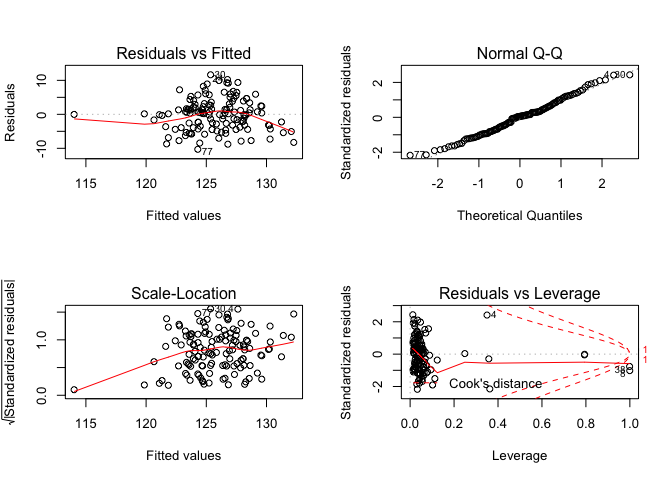<!-- -->

Model 4: Diastolic Blood Pressure

Crude:

    ## 
    ## Call:
    ## lm(formula = dbp ~ fuel_used_for_cooking_percent_wood_dung + 
    ##     percent_public_source + percent_private_toilet + percent_employed + 
    ##     percent_without_hs_education + percent_caste, data = total)
    ## 
    ## Residuals:
    ##     Min      1Q  Median      3Q     Max 
    ## -6.1543 -1.8922  0.1381  1.5985  7.1545 
    ## 
    ## Coefficients:
    ##                                          Estimate Std. Error t value
    ## (Intercept)                             85.762963   1.623616  52.822
    ## fuel_used_for_cooking_percent_wood_dung -1.577574   5.414491  -0.291
    ## percent_public_source                   -0.019758   0.023995  -0.823
    ## percent_private_toilet                  -0.001706   0.006123  -0.279
    ## percent_employed                        -4.918851   3.303157  -1.489
    ## percent_without_hs_education            -1.702722   1.571182  -1.084
    ## percent_caste                            0.026482   0.027703   0.956
    ##                                         Pr(>|t|)    
    ## (Intercept)                               <2e-16 ***
    ## fuel_used_for_cooking_percent_wood_dung    0.771    
    ## percent_public_source                      0.412    
    ## percent_private_toilet                     0.781    
    ## percent_employed                           0.139    
    ## percent_without_hs_education               0.281    
    ## percent_caste                              0.341    
    ## ---
    ## Signif. codes:  0 '***' 0.001 '**' 0.01 '*' 0.05 '.' 0.1 ' ' 1
    ## 
    ## Residual standard error: 2.728 on 127 degrees of freedom
    ## Multiple R-squared:  0.06741,    Adjusted R-squared:  0.02335 
    ## F-statistic:  1.53 on 6 and 127 DF,  p-value: 0.1735

    ##                                             Estimate  Std. Error
    ## (Intercept)                             85.762962850 1.623616142
    ## fuel_used_for_cooking_percent_wood_dung -1.577574083 5.414491444
    ## percent_public_source                   -0.019758085 0.023995360
    ## percent_private_toilet                  -0.001706308 0.006122706
    ## percent_employed                        -4.918850962 3.303157273
    ## percent_without_hs_education            -1.702722090 1.571182458
    ## percent_caste                            0.026482041 0.027702916
    ##                                            t value     Pr(>|t|)
    ## (Intercept)                             52.8221915 2.660909e-88
    ## fuel_used_for_cooking_percent_wood_dung -0.2913615 7.712502e-01
    ## percent_public_source                   -0.8234128 4.118169e-01
    ## percent_private_toilet                  -0.2786852 7.809397e-01
    ## percent_employed                        -1.4891362 1.389306e-01
    ## percent_without_hs_education            -1.0837202 2.805420e-01
    ## percent_caste                            0.9559297 3.409238e-01

    ##                             (Intercept) 
    ##                            85.762962850 
    ## fuel_used_for_cooking_percent_wood_dung 
    ##                            -1.577574083 
    ##                   percent_public_source 
    ##                            -0.019758085 
    ##                  percent_private_toilet 
    ##                            -0.001706308 
    ##                        percent_employed 
    ##                            -4.918850962 
    ##            percent_without_hs_education 
    ##                            -1.702722090 
    ##                           percent_caste 
    ##                             0.026482041

    ##        1        2        3        4        5        6        7        8 
    ## 82.90197 82.87385 83.03067 82.74385 83.38561 82.76577 81.99485 85.02288 
    ##        9       10       11       12       13       14       15       16 
    ## 82.90327 83.07407 81.92029 83.12958 82.89808 83.05125 83.25891 81.29470 
    ##       17       18       19       20       21       22       23       24 
    ## 83.18988 82.23625 82.80665 83.20958 81.76416 82.80894 82.65391 82.95702 
    ##       25       26       27       28       29       30       31       32 
    ## 83.30149 82.39365 83.52278 83.22773 82.47023 82.84552 83.00740 83.69501 
    ##       33       34       35       36       37       38       39       40 
    ## 82.62177 83.08350 82.81659 83.61078 84.07256 83.25931 83.51567 82.02744 
    ##       41       42       43       44       45       46       47       48 
    ## 84.10257 83.56803 83.40618 82.78597 83.47284 82.91986 82.89953 83.25002 
    ##       49       50       51       52       53       54       55       56 
    ## 83.39249 83.59912 83.23477 82.89490 83.56692 83.40106 82.64635 83.08140 
    ##       57       58       59       60       61       62       63       64 
    ## 83.06548 82.91648 82.98814 82.85930 81.12368 82.88866 83.71202 83.49106 
    ##       65       66       67       68       69       70       71       72 
    ## 83.01034 82.64542 82.50612 82.75602 82.47223 81.78399 82.90932 83.15775 
    ##       73       74       75       76       77       78       79       80 
    ## 83.82897 81.60245 82.86454 83.28897 82.23647 82.23900 83.21174 82.68983 
    ##       81       82       83       84       85       86       87       88 
    ## 83.80386 83.74776 82.15433 80.08776 82.81270 82.62089 81.88400 82.62125 
    ##       89       90       91       92       93       94       95       96 
    ## 82.50547 82.55190 83.77629 83.31068 82.85900 82.50673 83.09217 82.95809 
    ##       97       98       99      100      101      102      103      104 
    ## 83.49841 83.36930 81.96959 83.34830 81.79872 83.63455 83.02405 83.14725 
    ##      105      106      107      108      109      110      111      112 
    ## 82.91572 83.46669 83.38416 83.33073 83.26401 83.42497 83.35019 82.53985 
    ##      113      114      115      116      117      118      119      120 
    ## 82.54727 82.48998 83.43862 83.61198 83.47537 83.94857 83.31724 83.68214 
    ##      121      122      123      124      125      126      127      128 
    ## 83.01530 83.01153 82.13696 82.60384 83.24796 83.33306 82.67624 82.81041 
    ##      129      130      131      132      133      134 
    ## 83.34727 82.70451 82.94891 83.12575 83.03029 78.91998

    ## # A tibble: 1 x 11
    ##   r.squared adj.r.squared sigma statistic p.value    df logLik   AIC   BIC
    ##       <dbl>         <dbl> <dbl>     <dbl>   <dbl> <int>  <dbl> <dbl> <dbl>
    ## 1    0.0674        0.0234  2.73      1.53   0.173     7  -321.  658.  681.
    ## # … with 2 more variables: deviance <dbl>, df.residual <int>

| term                                          | estimate | p.value |
| :-------------------------------------------- | -------: | ------: |
| (Intercept)                                   |   85.763 |   0.000 |
| fuel\_used\_for\_cooking\_percent\_wood\_dung |  \-1.578 |   0.771 |
| percent\_public\_source                       |  \-0.020 |   0.412 |
| percent\_private\_toilet                      |  \-0.002 |   0.781 |
| percent\_employed                             |  \-4.919 |   0.139 |
| percent\_without\_hs\_education               |  \-1.703 |   0.281 |
| percent\_caste                                |    0.026 |   0.341 |

| dbp | fuel\_used\_for\_cooking\_percent\_wood\_dung | percent\_public\_source | percent\_private\_toilet | percent\_employed | percent\_without\_hs\_education | percent\_caste |  .fitted |   .se.fit |      .resid |      .hat |   .sigma |    .cooksd |  .std.resid |
| --: | --------------------------------------------: | ----------------------: | -----------------------: | ----------------: | ------------------------------: | -------------: | -------: | --------: | ----------: | --------: | -------: | ---------: | ----------: |
|  85 |                                     0.0000000 |               0.0270270 |              100.0000000 |         0.5405405 |                       0.0270270 |      0.5675676 | 82.90197 | 0.5418476 |   2.0980294 | 0.0394593 | 2.731890 |  0.0036144 |   0.7847865 |
|  82 |                                     0.0000000 |               0.0789474 |                0.7368421 |         0.5789474 |                       0.0263158 |      0.2368421 | 82.87385 | 0.5597898 | \-0.8738535 | 0.0421158 | 2.737383 |  0.0006730 | \-0.3273256 |
|  84 |                                     0.0277778 |               0.0555556 |                0.4722222 |         0.4444444 |                       0.3055556 |      0.7500000 | 83.03067 | 0.3581366 |   0.9693327 | 0.0172382 | 2.737152 |  0.0003220 |   0.3584648 |
|  84 |                                     0.0000000 |               0.1538462 |                0.7692308 |         0.6153846 |                       0.0000000 |      0.4615385 | 82.74385 | 0.6690274 |   1.2561521 | 0.0601566 | 2.736104 |  0.0020633 |   0.4750205 |
|  86 |                                     0.0277778 |               0.1944444 |                0.8333333 |         0.3888889 |                       0.2500000 |      0.3888889 | 83.38561 | 0.4676544 |   2.6143909 | 0.0293931 | 2.728315 |  0.0040945 |   0.9728517 |
|  83 |                                     0.0000000 |               0.3076923 |                0.7435897 |         0.5128205 |                       0.2820513 |      0.4871795 | 82.76577 | 0.2962530 |   0.2342265 | 0.0117956 | 2.738458 |  0.0000127 |   0.0863794 |
|  85 |                                     0.0000000 |               0.1351351 |                0.5405405 |         0.6486486 |                       0.3513514 |      0.9189189 | 81.99485 | 0.5814377 |   3.0051544 | 0.0454362 | 2.724794 |  0.0086462 |   1.1276183 |
|  85 |                                     0.0526316 |               0.3947368 |                0.9473684 |         0.5789474 |                       0.2631579 |    100.0000000 | 85.02288 | 2.7270426 | \-0.0228804 | 0.9994924 | 2.737043 | 38.9832607 | \-0.3722891 |
|  81 |                                     0.0000000 |               0.2777778 |                0.3611111 |         0.4166667 |                       0.4722222 |      0.0000000 | 82.90327 | 0.5594037 | \-1.9032739 | 0.0420578 | 2.733053 |  0.0031876 | \-0.7129014 |
|  83 |                                     0.0000000 |               0.1500000 |                0.8500000 |         0.4250000 |                       0.3500000 |      0.0750000 | 83.07407 | 0.4199696 | \-0.0740705 | 0.0237045 | 2.738530 |  0.0000026 | \-0.0274823 |
|  84 |                                     0.0000000 |               0.1071429 |                0.9285714 |         0.6666667 |                       0.3392857 |      0.6785714 | 81.92029 | 0.6303084 |   2.0797118 | 0.0533952 | 2.731909 |  0.0049484 |   0.7836400 |
|  79 |                                     0.0000000 |               0.0344828 |                0.9137931 |         0.4655172 |                       0.2068966 |      0.4137931 | 83.12958 | 0.3001843 | \-4.1295832 | 0.0121108 | 2.713409 |  0.0040632 | \-1.5231754 |
|  85 |                                     0.0000000 |               0.3818182 |                0.8000000 |         0.4909091 |                       0.2727273 |      0.8727273 | 82.89808 | 0.2889095 |   2.1019220 | 0.0112181 | 2.732056 |  0.0009733 |   0.7749330 |
|  84 |                                     0.0000000 |               0.1636364 |                0.8909091 |         0.4909091 |                       0.1818182 |      0.6545455 | 83.05125 | 0.2983957 |   0.9487512 | 0.0119669 | 2.737218 |  0.0002119 |   0.3499165 |
|  87 |                                     0.0000000 |               0.0000000 |              100.0000000 |         0.4545455 |                       0.0606061 |      0.2121212 | 83.25891 | 0.4618501 |   3.7410871 | 0.0286680 | 2.717579 |  0.0081650 |   1.3915916 |
|  76 |                                     0.0263158 |               0.8684211 |                0.1315789 |         0.7368421 |                       0.4736842 |      0.8157895 | 81.29470 | 0.8310472 | \-5.2946996 | 0.0928212 | 2.693387 |  0.0607074 | \-2.0379461 |
|  82 |                                     0.0000000 |               0.2702703 |                0.7837838 |         0.4594595 |                       0.1891892 |      0.5945946 | 83.18988 | 0.3106274 | \-1.1898823 | 0.0129681 | 2.736459 |  0.0003618 | \-0.4390725 |
|  83 |                                     0.1025641 |               0.0256410 |                0.9487179 |         0.5897436 |                       0.2820513 |      0.6923077 | 82.23625 | 0.6011472 |   0.7637471 | 0.0485688 | 2.737649 |  0.0006009 |   0.2870508 |
|  82 |                                     0.0000000 |               0.2105263 |                0.9473684 |         0.4210526 |                       0.5263158 |      0.6315789 | 82.80665 | 0.6174981 | \-0.8066476 | 0.0512468 | 2.737544 |  0.0007113 | \-0.3036023 |
|  82 |                                     0.0000000 |               0.0263158 |                0.8947368 |         0.4473684 |                       0.2105263 |      0.2894737 | 83.20958 | 0.3213583 | \-1.2095757 | 0.0138795 | 2.736387 |  0.0004009 | \-0.4465457 |
|  86 |                                     0.0540541 |               0.7837838 |                0.5675676 |         0.5405405 |                       0.7297297 |      0.1621622 | 81.76416 | 0.7555918 |   4.2358368 | 0.0767309 | 2.710232 |  0.0310091 |   1.6161173 |
|  87 |                                     0.0000000 |               0.1500000 |                0.9000000 |         0.5500000 |                       0.1500000 |      0.4250000 | 82.80894 | 0.3834686 |   4.1910580 | 0.0197631 | 2.712448 |  0.0069365 |   1.5518722 |
|  87 |                                     0.0000000 |               0.6923077 |                0.6666667 |         0.4871795 |                       0.4102564 |      0.0256410 | 82.65391 | 0.3926766 |   4.3460903 | 0.0207236 | 2.710444 |  0.0078370 |   1.6100669 |
|  88 |                                     0.0000000 |               0.8461538 |                0.6923077 |         0.4615385 |                       0.3076923 |      0.2307692 | 82.95702 | 0.3277008 |   5.0429790 | 0.0144328 | 2.700888 |  0.0072552 |   1.8622666 |
|  86 |                                     0.0000000 |               0.5365854 |                0.6585366 |         0.3902439 |                       0.3170732 |      0.3658537 | 83.30149 | 0.4763285 |   2.6985133 | 0.0304936 | 2.727632 |  0.0045358 |   1.0047246 |
|  84 |                                     0.0769231 |               0.3333333 |                0.7179487 |         0.5384615 |                       0.3589744 |      0.7435897 | 82.39365 | 0.4423854 |   1.6063539 | 0.0263025 | 2.734695 |  0.0013745 |   0.5967975 |
|  85 |                                     0.0000000 |               0.4102564 |                0.7179487 |         0.4102564 |                       0.1282051 |      0.2051282 | 83.52278 | 0.4107040 |   1.4772237 | 0.0226701 | 2.735301 |  0.0009944 |   0.5478018 |
|  89 |                                     0.0000000 |               0.1538462 |                0.7948718 |         0.4615385 |                       0.1538462 |      0.0512821 | 83.22773 | 0.3247191 |   5.7722712 | 0.0141713 | 2.689117 |  0.0093282 |   2.1312963 |
|  85 |                                     0.0000000 |               0.9250000 |                0.8250000 |         0.4500000 |                       0.6250000 |      0.1750000 | 82.47023 | 0.7052853 |   2.5297710 | 0.0668537 | 2.728582 |  0.0094338 |   0.9600728 |
|  90 |                                     0.0000000 |               0.2307692 |                0.8974359 |         0.5128205 |                       0.2307692 |      0.1538462 | 82.84552 | 0.2936729 |   7.1544774 | 0.0115911 | 2.662440 |  0.0116601 |   2.6381981 |
|  84 |                                     0.0000000 |               0.1750000 |                0.7750000 |         0.5000000 |                       0.1750000 |      0.2500000 | 83.00740 | 0.3058381 |   0.9925985 | 0.0125713 | 2.737092 |  0.0002439 |   0.3662002 |
|  84 |                                     0.0000000 |               0.1025641 |                0.7948718 |         0.3589744 |                       0.1794872 |      0.2564103 | 83.69501 | 0.5194924 |   0.3049878 | 0.0362705 | 2.738398 |  0.0000697 |   0.1138945 |
|  82 |                                     0.0000000 |               0.0270270 |              100.0000000 |         0.5945946 |                       0.0270270 |      0.0270270 | 82.62177 | 0.6524972 | \-0.6217721 | 0.0572207 | 2.737944 |  0.0004779 | \-0.2347600 |
|  83 |                                     0.0263158 |               0.4736842 |                0.9210526 |         0.4473684 |                       0.2631579 |      0.8157895 | 83.08350 | 0.3352797 | \-0.0834975 | 0.0151081 | 2.738528 |  0.0000021 | \-0.0308444 |
|  86 |                                     0.0256410 |               0.2307692 |                0.9743590 |         0.5384615 |                       0.1538462 |      0.4102564 | 82.81659 | 0.3701952 |   3.1834148 | 0.0184186 | 2.723537 |  0.0037195 |   1.1779528 |
|  90 |                                     0.0000000 |               0.0188679 |              100.0000000 |         0.3773585 |                       0.0754717 |      0.1320755 | 83.61078 | 0.5376628 |   6.3892206 | 0.0388522 | 2.676286 |  0.0329631 |   2.3891896 |
|  82 |                                     0.0000000 |               0.0526316 |                0.9473684 |         0.3157895 |                       0.0789474 |      0.0000000 | 84.07256 | 0.6550797 | \-2.0725597 | 0.0576745 | 2.731925 |  0.0053567 | \-0.7827163 |
|  84 |                                     0.0000000 |               0.0000000 |                0.9750000 |         0.5000000 |                       0.0250000 |      0.0000000 | 83.25931 | 0.4468452 |   0.7406943 | 0.0268355 | 2.737721 |  0.0002985 |   0.2752604 |
|  83 |                                     0.0000000 |               0.0769231 |                0.8846154 |         0.4230769 |                       0.0961538 |      0.0192308 | 83.51567 | 0.4068030 | \-0.5156672 | 0.0222415 | 2.738144 |  0.0001188 | \-0.1911840 |
|  79 |                                     0.0000000 |               0.8285714 |                0.0285714 |         0.6000000 |                       0.4571429 |      0.4000000 | 82.02744 | 0.5223433 | \-3.0274381 | 0.0366697 | 2.724717 |  0.0069535 | \-1.1307992 |
|  81 |                                     0.0000000 |               0.0000000 |              100.0000000 |         0.3030303 |                       0.0000000 |      0.0303030 | 84.10257 | 0.6854845 | \-3.1025737 | 0.0631525 | 2.723609 |  0.0132983 | \-1.1751288 |
|  84 |                                     0.0000000 |               0.0000000 |              100.0000000 |         0.4000000 |                       0.0333333 |      0.0000000 | 83.56803 | 0.5002613 |   0.4319657 | 0.0336348 | 2.738258 |  0.0001290 |   0.1610929 |
|  81 |                                     0.0000000 |               0.0000000 |              100.0000000 |         0.4444444 |                       0.0000000 |      0.0000000 | 83.40618 | 0.4729661 | \-2.4061761 | 0.0300646 | 2.729875 |  0.0035524 | \-0.8956820 |
|  83 |                                     0.0000000 |               0.0263158 |              100.0000000 |         0.5526316 |                       0.0526316 |      0.0789474 | 82.78597 | 0.5567986 |   0.2140265 | 0.0416670 | 2.738469 |  0.0000399 |   0.0801507 |
|  80 |                                     0.0000000 |               0.0000000 |              100.0000000 |         0.3947368 |                       0.1052632 |      0.0526316 | 83.47284 | 0.5181491 | \-3.4728403 | 0.0360832 | 2.720347 |  0.0089928 | \-1.2967697 |
|  80 |                                     0.0000000 |               0.0000000 |                0.9666667 |         0.5666667 |                       0.0333333 |      0.1000000 | 82.91986 | 0.5270739 | \-2.9198553 | 0.0373369 | 2.725675 |  0.0065949 | \-1.0909931 |
|  84 |                                     0.0400000 |               0.0000000 |              100.0000000 |         0.5000000 |                       0.1000000 |      0.0000000 | 82.89953 | 0.5063482 |   1.1004686 | 0.0344583 | 2.736720 |  0.0008594 |   0.4105726 |
|  84 |                                     0.0000000 |               0.0000000 |              100.0000000 |         0.4761905 |                       0.0000000 |      0.0000000 | 83.25002 | 0.4779385 |   0.7499779 | 0.0307001 | 2.737697 |  0.0003529 |   0.2792654 |
|  81 |                                     0.0000000 |               0.0000000 |              100.0000000 |         0.4473684 |                       0.0000000 |      0.0263158 | 83.39249 | 0.4724544 | \-2.3924904 | 0.0299996 | 2.729974 |  0.0035040 | \-0.8905577 |
|  85 |                                     0.0000000 |               0.0000000 |                0.9855072 |         0.4347826 |                       0.0144928 |      0.0434783 | 83.59912 | 0.4659766 |   1.4008753 | 0.0291826 | 2.735607 |  0.0011667 |   0.5212289 |
|  83 |                                     0.0000000 |               0.0000000 |              100.0000000 |         0.4615385 |                       0.0512821 |      0.0000000 | 83.23477 | 0.4620796 | \-0.2347741 | 0.0286965 | 2.738456 |  0.0000322 | \-0.0873314 |
|  86 |                                     0.0000000 |               0.0000000 |              100.0000000 |         0.5483871 |                       0.0000000 |      0.0000000 | 82.89490 | 0.5666185 |   3.1051023 | 0.0431496 | 2.723898 |  0.0087245 |   1.1637286 |
|  79 |                                     0.0000000 |               0.0000000 |              100.0000000 |         0.4117647 |                       0.0000000 |      0.0000000 | 83.56692 | 0.4917331 | \-4.5669229 | 0.0324978 | 2.707120 |  0.0139026 | \-1.7021410 |
|  86 |                                     0.0000000 |               0.1304348 |                0.8695652 |         0.4347826 |                       0.1304348 |      0.1086957 | 83.40106 | 0.3676209 |   2.5989446 | 0.0181633 | 2.728551 |  0.0024435 |   0.9615574 |
|  84 |                                     0.0000000 |               0.0000000 |              100.0000000 |         0.5641026 |                       0.1025641 |      0.1282051 | 82.64635 | 0.5722627 |   1.3536474 | 0.0440136 | 2.735759 |  0.0016943 |   0.5075484 |
|  80 |                                     0.0000000 |               0.1315789 |                0.9736842 |         0.4736842 |                       0.2105263 |      0.4210526 | 83.08140 | 0.2931542 | \-3.0814022 | 0.0115502 | 2.724583 |  0.0021551 | \-1.1362369 |
|  79 |                                     0.0000000 |               0.0500000 |                0.9500000 |         0.5250000 |                       0.0750000 |      0.5750000 | 83.06548 | 0.4123133 | \-4.0654802 | 0.0228481 | 2.713917 |  0.0075936 | \-1.5077475 |
|  81 |                                     0.0000000 |               0.0243902 |                0.8536585 |         0.5121951 |                       0.1951220 |      0.2682927 | 82.91648 | 0.3034058 | \-1.9164794 | 0.0123721 | 2.733144 |  0.0008945 | \-0.7069770 |
|  81 |                                     0.0000000 |               0.4594595 |                0.4324324 |         0.4054054 |                       0.4594595 |      0.4324324 | 82.98814 | 0.5673488 | \-1.9881381 | 0.0432609 | 2.732545 |  0.0035867 | \-0.7451567 |
|  83 |                                     0.0000000 |               0.0512821 |                0.8717949 |         0.5128205 |                       0.2307692 |      0.5384615 | 82.85930 | 0.2926252 |   0.1407019 | 0.0115085 | 2.738509 |  0.0000045 |   0.0518814 |
|  82 |                                     0.2549020 |               0.3421053 |                0.7894737 |         0.6052632 |                       0.7368421 |      0.1052632 | 81.12368 | 1.3394852 |   0.8763193 | 0.2411412 | 2.737071 |  0.0061741 |   0.3687905 |
|  85 |                                     0.0000000 |               0.1538462 |                0.8974359 |         0.5128205 |                       0.2051282 |      0.0769231 | 82.88866 | 0.3005139 |   2.1113351 | 0.0121374 | 2.731991 |  0.0010645 |   0.7787655 |
|  80 |                                     0.0000000 |               0.0000000 |                0.8333333 |         0.4166667 |                       0.0000000 |      0.0000000 | 83.71202 | 0.5003129 | \-3.7120197 | 0.0336418 | 2.717798 |  0.0095306 | \-1.3843280 |
|  83 |                                     0.0000000 |               0.0000000 |                0.9729730 |         0.4054054 |                       0.1621622 |      0.0000000 | 83.49106 | 0.4072372 | \-0.4910568 | 0.0222890 | 2.738181 |  0.0001080 | \-0.1820641 |
|  84 |                                     0.0000000 |               0.2666667 |                0.8000000 |         0.4666667 |                       0.2666667 |      0.1333333 | 83.01034 | 0.3032850 |   0.9896631 | 0.0123622 | 2.737101 |  0.0002383 |   0.3650786 |
|  82 |                                     0.0256410 |               0.0512821 |                0.8974359 |         0.4871795 |                       0.4102564 |      0.7692308 | 82.64542 | 0.3744188 | \-0.6454226 | 0.0188413 | 2.737923 |  0.0001565 | \-0.2388759 |
|  83 |                                     0.0500000 |               0.2500000 |                0.7000000 |         0.5000000 |                       0.4250000 |      0.4250000 | 82.50612 | 0.4046545 |   0.4938773 | 0.0220072 | 2.738177 |  0.0001078 |   0.1830834 |
|  84 |                                     0.0000000 |               0.2500000 |                0.6500000 |         0.5000000 |                       0.3250000 |      0.4500000 | 82.75602 | 0.3129093 |   1.2439790 | 0.0131593 | 2.736265 |  0.0004015 |   0.4590789 |
|  84 |                                     0.0000000 |               0.1351351 |                0.8918919 |         0.5675676 |                       0.2972973 |      0.4324324 | 82.47223 | 0.3749118 |   1.5277723 | 0.0188910 | 2.735088 |  0.0008795 |   0.5654547 |
|  83 |                                     0.0000000 |               0.2500000 |                0.8888889 |         0.6666667 |                       0.4166667 |      0.6111111 | 81.78399 | 0.6499595 |   1.2160114 | 0.0567765 | 2.736265 |  0.0018118 |   0.4590164 |
|  78 |                                     0.0000000 |               0.0000000 |              100.0000000 |         0.5454545 |                       0.0000000 |      0.0000000 | 82.90932 | 0.5613179 | \-4.9093225 | 0.0423461 | 2.701824 |  0.0213667 | \-1.8391413 |
|  83 |                                     0.0000000 |               0.0000000 |                0.9607843 |         0.5294118 |                       0.0000000 |      0.0196078 | 83.15775 | 0.5066742 | \-0.1577451 | 0.0345027 | 2.738501 |  0.0000177 | \-0.0588543 |
|  78 |                                     0.0000000 |               0.0000000 |                0.9285714 |         0.3928571 |                       0.0000000 |      0.0000000 | 83.82897 | 0.5328754 | \-5.8289727 | 0.0381634 | 2.686863 |  0.0269108 | \-2.1789095 |
|  81 |                                     0.0975610 |               0.3414634 |                0.2439024 |         0.5609756 |                       0.7317073 |      0.2195122 | 81.60245 | 0.8010405 | \-0.6024538 | 0.0862392 | 2.737962 |  0.0007198 | \-0.2310497 |
|  83 |                                     0.0000000 |               0.0000000 |                0.9333333 |         0.5833333 |                       0.0166667 |      0.0333333 | 82.86454 | 0.5795853 |   0.1354554 | 0.0451472 | 2.738510 |  0.0000174 |   0.0508190 |
|  82 |                                     0.0000000 |               0.0750000 |                0.9000000 |         0.4250000 |                       0.2250000 |      0.1000000 | 83.28897 | 0.3606675 | \-1.2889694 | 0.0174827 | 2.736087 |  0.0005777 | \-0.4767276 |
|  78 |                                     0.0000000 |               0.5263158 |                0.5789474 |         0.5526316 |                       0.4736842 |      0.3684211 | 82.23647 | 0.4738384 | \-4.2364676 | 0.0301756 | 2.711589 |  0.0110554 | \-1.5770852 |
|  84 |                                     0.0000000 |               0.6000000 |                0.3500000 |         0.5500000 |                       0.4750000 |      0.1000000 | 82.23900 | 0.4734021 |   1.7610020 | 0.0301201 | 2.733901 |  0.0019065 |   0.6555392 |
|  82 |                                     0.0000000 |               0.0263158 |                0.9736842 |         0.5000000 |                       0.0526316 |      0.0000000 | 83.21174 | 0.4144912 | \-1.2117391 | 0.0230901 | 2.736359 |  0.0006821 | \-0.4494482 |
|  84 |                                     0.0256410 |               0.0000000 |              100.0000000 |         0.5641026 |                       0.0512821 |      0.0000000 | 82.68983 | 0.5821237 |   1.3101740 | 0.0455435 | 2.735931 |  0.0016477 |   0.4916417 |
|  84 |                                     0.0000000 |               0.0303030 |              100.0000000 |         0.3636364 |                       0.0000000 |      0.0303030 | 83.80386 | 0.5576369 |   0.1961372 | 0.0417925 | 2.738480 |  0.0000336 |   0.0734561 |
|  89 |                                     0.0000000 |               0.0000000 |              100.0000000 |         0.3750000 |                       0.0000000 |      0.0000000 | 83.74776 | 0.5385402 |   5.2522370 | 0.0389791 | 2.696623 |  0.0223539 |   1.9641548 |
|  76 |                                     0.0000000 |               0.9750000 |                0.0000000 |         0.5500000 |                       0.5250000 |      0.3750000 | 82.15433 | 0.5297760 | \-6.1543324 | 0.0377207 | 2.680896 |  0.0296236 | \-2.3000019 |
|  80 |                                     0.0000000 |             100.0000000 |                0.0000000 |         0.5405405 |                       0.6216216 |      0.6756757 | 80.08776 | 2.4293170 | \-0.0877604 | 0.7931658 | 2.738484 |  0.0027417 | \-0.0707433 |
|  81 |                                     0.0000000 |               0.2931034 |                0.6896552 |         0.5344828 |                       0.1896552 |      0.3275862 | 82.81270 | 0.3331717 | \-1.8126990 | 0.0149187 | 2.733700 |  0.0009699 | \-0.6695569 |
|  84 |                                     0.0000000 |               0.0000000 |                0.9148936 |         0.5744681 |                       0.1914894 |      0.4255319 | 82.62089 | 0.4087410 |   1.3791053 | 0.0224539 | 2.735717 |  0.0008580 |   0.5113599 |
|  83 |                                     0.0000000 |               0.1666667 |                0.8333333 |         0.6666667 |                       0.3611111 |      0.7500000 | 81.88400 | 0.6333288 |   1.1159964 | 0.0539081 | 2.736630 |  0.0014402 |   0.4206239 |
|  85 |                                     0.0000000 |               0.0000000 |                0.7068966 |         0.5517241 |                       0.2586207 |      0.5172414 | 82.62125 | 0.3420294 |   2.3787537 | 0.0157225 | 2.730195 |  0.0017631 |   0.8789993 |
|  85 |                                     0.0000000 |               0.0869565 |                0.7391304 |         0.5652174 |                       0.2826087 |      0.2608696 | 82.50547 | 0.3691005 |   2.4945322 | 0.0183099 | 2.729337 |  0.0022699 |   0.9229958 |
|  83 |                                     0.0000000 |               0.0000000 |                0.9743590 |         0.5384615 |                       0.3333333 |      0.2564103 | 82.55190 | 0.3408541 |   0.4480955 | 0.0156147 | 2.738242 |  0.0000621 |   0.1655716 |
|  84 |                                     0.0175439 |               0.0000000 |                0.9824561 |         0.3859649 |                       0.0350877 |      0.0350877 | 83.77629 | 0.5357085 |   0.2237096 | 0.0385703 | 2.738463 |  0.0000401 |   0.0836418 |
|  83 |                                     0.0000000 |               0.0000000 |              100.0000000 |         0.4531250 |                       0.0312500 |      0.0156250 | 83.31068 | 0.4644456 | \-0.3106815 | 0.0289911 | 2.738394 |  0.0000570 | \-0.1155850 |
|  81 |                                     0.0169492 |               0.1355932 |                0.7796610 |         0.4915254 |                       0.2711864 |      0.2372881 | 82.85900 | 0.2820829 | \-1.8590033 | 0.0106942 | 2.733471 |  0.0007250 | \-0.6851927 |
|  82 |                                     0.0000000 |               0.2131148 |                0.9672131 |         0.5081967 |                       0.4426230 |      0.1147541 | 82.50673 | 0.4219462 | \-0.5067329 | 0.0239282 | 2.738157 |  0.0001238 | \-0.1880338 |
|  86 |                                     0.0000000 |               0.0800000 |                0.9800000 |         0.4800000 |                       0.1800000 |      0.0000000 | 83.09217 | 0.3010228 |   2.9078284 | 0.0121785 | 2.726106 |  0.0020262 |   1.0725742 |
|  78 |                                     0.0000000 |               0.0526316 |                0.8684211 |         0.5526316 |                       0.0526316 |      0.2105263 | 82.95809 | 0.4798673 | \-4.9580870 | 0.0309484 | 2.701529 |  0.0155550 | \-1.8464540 |
|  82 |                                     0.0000000 |               0.0000000 |              100.0000000 |         0.4000000 |                       0.0750000 |      0.0500000 | 83.49841 | 0.5033128 | \-1.4984117 | 0.0340464 | 2.735168 |  0.0015730 | \-0.5589215 |
|  80 |                                     0.0000000 |               0.0285714 |                0.9142857 |         0.4571429 |                       0.0857143 |      0.1142857 | 83.36930 | 0.3782504 | \-3.3692996 | 0.0192289 | 2.721714 |  0.0043571 | \-1.2472503 |
|  78 |                                     0.0540541 |               0.1081081 |                0.1351351 |         0.5675676 |                       0.5405405 |      0.2432432 | 81.96959 | 0.5326348 | \-3.9695930 | 0.0381289 | 2.714696 |  0.0124684 | \-1.4838342 |
|  84 |                                     0.0000000 |               0.0175439 |              100.0000000 |         0.4561404 |                       0.0000000 |      0.0000000 | 83.34830 | 0.4721220 |   0.6517009 | 0.0299574 | 2.737903 |  0.0002596 |   0.2425776 |
|  80 |                                     0.0416667 |               0.2708333 |                0.3125000 |         0.5625000 |                       0.6666667 |      0.3541667 | 81.79872 | 0.6754354 | \-1.7987236 | 0.0613145 | 2.733539 |  0.0043226 | \-0.6806161 |
|  85 |                                     0.0000000 |               0.0000000 |              100.0000000 |         0.3859649 |                       0.0350877 |      0.0175439 | 83.63455 | 0.5194020 |   1.3654518 | 0.0362579 | 2.735733 |  0.0013974 |   0.5099103 |
|  80 |                                     0.0000000 |               0.0000000 |              100.0000000 |         0.4871795 |                       0.1025641 |      0.1025641 | 83.02405 | 0.4719608 | \-3.0240468 | 0.0299369 | 2.724843 |  0.0055858 | \-1.1256058 |
|  83 |                                     0.0000000 |               0.0000000 |              100.0000000 |         0.4102564 |                       0.2564103 |      0.3589744 | 83.14725 | 0.5921129 | \-0.1472529 | 0.0471199 | 2.738505 |  0.0000216 | \-0.0553022 |
|  79 |                                     0.0000000 |               0.0000000 |              100.0000000 |         0.5333333 |                       0.0333333 |      0.1333333 | 82.91572 | 0.5284827 | \-3.9157185 | 0.0375368 | 2.715355 |  0.0119291 | \-1.4632455 |
|  82 |                                     0.0000000 |               0.0000000 |              100.0000000 |         0.4324324 |                       0.0000000 |      0.0540541 | 83.46669 | 0.4771359 | \-1.4666929 | 0.0305971 | 2.735321 |  0.0013448 | \-0.5461159 |
|  80 |                                     0.0000000 |               0.0697674 |                0.9302326 |         0.4186047 |                       0.1860465 |      0.0000000 | 83.38416 | 0.3749582 | \-3.3841577 | 0.0188956 | 2.721571 |  0.0043165 | \-1.2525377 |
|  85 |                                     0.0000000 |               0.0750000 |              100.0000000 |         0.4250000 |                       0.1000000 |      0.0250000 | 83.33073 | 0.4813784 |   1.6692716 | 0.0311436 | 2.734367 |  0.0017750 |   0.6217204 |
|  82 |                                     0.0161290 |               0.1774194 |                0.7903226 |         0.4354839 |                       0.1935484 |      0.1129032 | 83.26401 | 0.3498311 | \-1.2640146 | 0.0164480 | 2.736183 |  0.0005216 | \-0.4672521 |
|  85 |                                     0.0000000 |               0.0000000 |                0.9000000 |         0.4750000 |                       0.0000000 |      0.0000000 | 83.42497 | 0.4679847 |   1.5750270 | 0.0294347 | 2.734832 |  0.0014883 |   0.5861023 |
|  84 |                                     0.0000000 |               0.1621622 |                0.6756757 |         0.3783784 |                       0.3243243 |      0.1891892 | 83.35019 | 0.5115313 |   0.6498050 | 0.0351674 | 2.737904 |  0.0003063 |   0.2425241 |
|  86 |                                     0.0000000 |               0.0555556 |              100.0000000 |         0.5277778 |                       0.2777778 |      0.6666667 | 82.53985 | 0.5884025 |   3.4601495 | 0.0465312 | 2.720282 |  0.0117657 |   1.2990906 |
|  78 |                                     0.0000000 |               0.1282051 |              100.0000000 |         0.4615385 |                       0.4615385 |      0.5128205 | 82.54727 | 0.7754305 | \-4.5472689 | 0.0808130 | 2.705745 |  0.0379728 | \-1.7387876 |
|  81 |                                     0.0000000 |               0.6052632 |                0.7105263 |         0.4736842 |                       0.5526316 |      0.4210526 | 82.48998 | 0.5800677 | \-1.4899819 | 0.0452223 | 2.735167 |  0.0021145 | \-0.5590204 |
|  86 |                                     0.0000000 |               0.0476190 |                0.9523810 |         0.4285714 |                       0.1269841 |      0.0952381 | 83.43862 | 0.3784634 |   2.5613786 | 0.0192506 | 2.728827 |  0.0025210 |   0.9481839 |
|  87 |                                     0.0000000 |               0.0000000 |                0.9444444 |         0.3888889 |                       0.1388889 |      0.0000000 | 83.61198 | 0.4506852 |   3.3880243 | 0.0272987 | 2.721384 |  0.0063588 |   1.2593736 |
|  86 |                                     0.0000000 |               0.0000000 |                0.9473684 |         0.4473684 |                       0.0526316 |      0.1578947 | 83.47537 | 0.4163530 |   2.5246278 | 0.0232980 | 2.729065 |  0.0029887 |   0.9365137 |
|  83 |                                     0.0000000 |               0.0263158 |                0.9736842 |         0.3684211 |                       0.0000000 |      0.0000000 | 83.94857 | 0.5758202 | \-0.9485732 | 0.0445625 | 2.737173 |  0.0008433 | \-0.3557685 |
|  85 |                                     0.0000000 |               0.0000000 |              100.0000000 |         0.4358974 |                       0.0769231 |      0.0000000 | 83.31724 | 0.4691579 |   1.6827610 | 0.0295824 | 2.734306 |  0.0017079 |   0.6262402 |
|  81 |                                     0.0000000 |               0.0000000 |                0.9000000 |         0.4000000 |                       0.0666667 |      0.0666667 | 83.68214 | 0.4658696 | \-2.6821375 | 0.0291692 | 2.727780 |  0.0042746 | \-0.9979461 |
|  84 |                                     0.0000000 |               0.0810811 |                0.8918919 |         0.5135135 |                       0.1351351 |      0.4324324 | 83.01530 | 0.3424728 |   0.9847033 | 0.0157633 | 2.737110 |  0.0003029 |   0.3638760 |
|  81 |                                     0.0500000 |               0.0250000 |              100.0000000 |         0.4750000 |                       0.1000000 |      0.2000000 | 83.01153 | 0.5188008 | \-2.0115294 | 0.0361740 | 2.732448 |  0.0030252 | \-0.7511469 |
|  79 |                                     0.1724138 |               0.8275862 |                0.0000000 |         0.5862069 |                       0.2758621 |      0.5862069 | 82.13696 | 0.9076027 | \-3.1369590 | 0.1107101 | 2.722456 |  0.0264494 | \-1.2195089 |
|  79 |                                     0.0000000 |               0.2162162 |                0.7297297 |         0.5405405 |                       0.2972973 |      0.4324324 | 82.60384 | 0.3285482 | \-3.6038443 | 0.0145075 | 2.719374 |  0.0037249 | \-1.3308748 |
|  89 |                                     0.0270270 |               0.0000000 |              100.0000000 |         0.4594595 |                       0.0270270 |      0.1621622 | 83.24796 | 0.4861279 |   5.7520428 | 0.0317612 | 2.688566 |  0.0215216 |   2.1430321 |
|  83 |                                     0.0000000 |               0.3333333 |                0.6944444 |         0.3888889 |                       0.3055556 |      0.4166667 | 83.33306 | 0.4731685 | \-0.3330634 | 0.0300904 | 2.738372 |  0.0000681 | \-0.1239821 |
|  85 |                                     0.0256410 |               0.1538462 |                0.4102564 |         0.4615385 |                       0.4615385 |      0.5128205 | 82.67624 | 0.4578003 |   2.3237576 | 0.0281675 | 2.730475 |  0.0030920 |   0.8641575 |
|  80 |                                     0.0000000 |               0.0000000 |                0.9487179 |         0.5128205 |                       0.2564103 |      0.3076923 | 82.81041 | 0.2918942 | \-2.8104093 | 0.0114511 | 2.726936 |  0.0017770 | \-1.0362590 |
|  83 |                                     0.0000000 |               0.0000000 |                0.9117647 |         0.4705882 |                       0.0588235 |      0.0294118 | 83.34727 | 0.4000534 | \-0.3472725 | 0.0215096 | 2.738359 |  0.0000520 | \-0.1287034 |
|  86 |                                     0.0000000 |               0.0263158 |                0.9210526 |         0.6052632 |                       0.0526316 |      0.3947368 | 82.70451 | 0.5902521 |   3.2954915 | 0.0468242 | 2.721978 |  0.0107464 |   1.2374610 |
|  82 |                                     0.0000000 |               0.0000000 |                0.9714286 |         0.5428571 |                       0.0857143 |      0.1428571 | 82.94891 | 0.4280957 | \-0.9489075 | 0.0246307 | 2.737200 |  0.0004476 | \-0.3522388 |
|  81 |                                     0.0000000 |               0.0000000 |                0.9090909 |         0.4848485 |                       0.1515152 |      0.2727273 | 83.12575 | 0.3159946 | \-2.1257484 | 0.0134201 | 2.731893 |  0.0011962 | \-0.7845914 |
|  81 |                                     0.0000000 |               0.0000000 |              100.0000000 |         0.4705882 |                       0.1470588 |      0.1176471 | 83.03029 | 0.4789329 | \-2.0302939 | 0.0308280 | 2.732368 |  0.0025975 | \-0.7560601 |
|  79 |                                     0.5526316 |             100.0000000 |                0.0000000 |         0.5789474 |                       0.6842105 |      0.6578947 | 78.91998 | 2.4300391 |   0.0800167 | 0.7936375 | 2.738493 |  0.0022910 |   0.0645748 |

    ## Warning in sqrt(crit * p * (1 - hh)/hh): NaNs produced
    
    ## Warning in sqrt(crit * p * (1 - hh)/hh): NaNs produced

<!-- -->

Age as a confounder:

    ## 
    ## Call:
    ## lm(formula = dbp ~ fuel_used_for_cooking_percent_wood_dung + 
    ##     percent_public_source + percent_private_toilet + percent_employed + 
    ##     percent_without_hs_education + percent_caste + median_age, 
    ##     data = total)
    ## 
    ## Residuals:
    ##     Min      1Q  Median      3Q     Max 
    ## -6.1029 -1.7170  0.1546  1.5727  7.1809 
    ## 
    ## Coefficients:
    ##                                          Estimate Std. Error t value
    ## (Intercept)                             83.341642   3.915282  21.286
    ## fuel_used_for_cooking_percent_wood_dung -1.905862   5.447431  -0.350
    ## percent_public_source                   -0.019995   0.024049  -0.831
    ## percent_private_toilet                  -0.002918   0.006389  -0.457
    ## percent_employed                        -3.941354   3.608896  -1.092
    ## percent_without_hs_education            -1.079877   1.821613  -0.593
    ## percent_caste                            0.027308   0.027788   0.983
    ## median_age                               0.041410   0.060904   0.680
    ##                                         Pr(>|t|)    
    ## (Intercept)                               <2e-16 ***
    ## fuel_used_for_cooking_percent_wood_dung    0.727    
    ## percent_public_source                      0.407    
    ## percent_private_toilet                     0.649    
    ## percent_employed                           0.277    
    ## percent_without_hs_education               0.554    
    ## percent_caste                              0.328    
    ## median_age                                 0.498    
    ## ---
    ## Signif. codes:  0 '***' 0.001 '**' 0.01 '*' 0.05 '.' 0.1 ' ' 1
    ## 
    ## Residual standard error: 2.734 on 126 degrees of freedom
    ## Multiple R-squared:  0.07082,    Adjusted R-squared:  0.0192 
    ## F-statistic: 1.372 on 7 and 126 DF,  p-value: 0.2228

    ##                                             Estimate  Std. Error
    ## (Intercept)                             83.341641506 3.915282239
    ## fuel_used_for_cooking_percent_wood_dung -1.905861767 5.447430513
    ## percent_public_source                   -0.019995054 0.024048845
    ## percent_private_toilet                  -0.002917875 0.006389225
    ## percent_employed                        -3.941354044 3.608895757
    ## percent_without_hs_education            -1.079876915 1.821612995
    ## percent_caste                            0.027308172 0.027788326
    ## median_age                               0.041409669 0.060903867
    ##                                            t value     Pr(>|t|)
    ## (Intercept)                             21.2862410 1.489059e-43
    ## fuel_used_for_cooking_percent_wood_dung -0.3498644 7.270246e-01
    ## percent_public_source                   -0.8314351 4.073007e-01
    ## percent_private_toilet                  -0.4566868 6.486825e-01
    ## percent_employed                        -1.0921219 2.768633e-01
    ## percent_without_hs_education            -0.5928136 5.543684e-01
    ## percent_caste                            0.9827210 3.276280e-01
    ## median_age                               0.6799186 4.978033e-01

    ##                             (Intercept) 
    ##                            83.341641506 
    ## fuel_used_for_cooking_percent_wood_dung 
    ##                            -1.905861767 
    ##                   percent_public_source 
    ##                            -0.019995054 
    ##                  percent_private_toilet 
    ##                            -0.002917875 
    ##                        percent_employed 
    ##                            -3.941354044 
    ##            percent_without_hs_education 
    ##                            -1.079876915 
    ##                           percent_caste 
    ##                             0.027308172 
    ##                              median_age 
    ##                             0.041409669

    ##        1        2        3        4        5        6        7        8 
    ## 82.68914 82.81038 83.10226 82.87292 83.66429 82.60927 82.24851 85.03443 
    ##        9       10       11       12       13       14       15       16 
    ## 83.15902 82.87841 82.01775 82.87781 82.79985 82.73052 83.31810 81.45609 
    ##       17       18       19       20       21       22       23       24 
    ## 83.18052 82.09577 82.99619 83.06234 81.91103 82.75814 82.64100 83.05701 
    ##       25       26       27       28       29       30       31       32 
    ## 83.19467 82.39446 83.42692 83.22329 82.56650 82.81909 82.72660 83.59692 
    ##       33       34       35       36       37       38       39       40 
    ## 82.42999 83.12961 82.79723 83.44382 84.15470 83.36398 83.48430 82.11608 
    ##       41       42       43       44       45       46       47       48 
    ## 84.29197 83.56853 83.29654 82.76606 83.56019 82.97007 83.05157 83.23759 
    ##       49       50       51       52       53       54       55       56 
    ## 83.43628 83.72676 83.60688 83.02307 83.82627 83.53746 82.69207 82.76046 
    ##       57       58       59       60       61       62       63       64 
    ## 82.70447 82.74465 82.58865 82.63895 81.28547 82.85046 84.01937 83.46509 
    ##       65       66       67       68       69       70       71       72 
    ## 82.81152 82.65431 82.45490 82.64969 82.42860 81.86059 82.91686 83.28510 
    ##       73       74       75       76       77       78       79       80 
    ## 83.80926 81.66799 82.81230 83.42746 82.33348 82.38573 83.60137 82.94460 
    ##       81       82       83       84       85       86       87       88 
    ## 83.89564 83.57676 82.10295 80.12235 82.62917 82.52896 81.98832 82.66765 
    ##       89       90       91       92       93       94       95       96 
    ## 82.40264 82.56562 83.73775 83.07851 82.72095 82.64142 83.19472 82.77069 
    ##       97       98       99      100      101      102      103      104 
    ## 83.36686 83.46563 82.14442 83.46093 81.79006 83.61474 83.13258 83.24372 
    ##      105      106      107      108      109      110      111      112 
    ## 83.14052 83.34358 83.09595 83.33025 83.14464 83.65744 83.26275 82.51230 
    ##      113      114      115      116      117      118      119      120 
    ## 82.24623 82.52399 83.36518 83.72779 83.57398 84.27270 83.44984 84.01677 
    ##      121      122      123      124      125      126      127      128 
    ## 82.83686 82.70514 81.92918 82.39072 83.20184 83.44743 82.68706 82.90730 
    ##      129      130      131      132      133      134 
    ## 83.50173 82.63948 83.03906 83.05248 82.73730 78.88588

    ## # A tibble: 1 x 11
    ##   r.squared adj.r.squared sigma statistic p.value    df logLik   AIC   BIC
    ##       <dbl>         <dbl> <dbl>     <dbl>   <dbl> <int>  <dbl> <dbl> <dbl>
    ## 1    0.0708        0.0192  2.73      1.37   0.223     8  -321.  660.  686.
    ## # … with 2 more variables: deviance <dbl>, df.residual <int>

| term                                          | estimate | p.value |
| :-------------------------------------------- | -------: | ------: |
| (Intercept)                                   |   83.342 |   0.000 |
| fuel\_used\_for\_cooking\_percent\_wood\_dung |  \-1.906 |   0.727 |
| percent\_public\_source                       |  \-0.020 |   0.407 |
| percent\_private\_toilet                      |  \-0.003 |   0.649 |
| percent\_employed                             |  \-3.941 |   0.277 |
| percent\_without\_hs\_education               |  \-1.080 |   0.554 |
| percent\_caste                                |    0.027 |   0.328 |
| median\_age                                   |    0.041 |   0.498 |

| dbp | fuel\_used\_for\_cooking\_percent\_wood\_dung | percent\_public\_source | percent\_private\_toilet | percent\_employed | percent\_without\_hs\_education | percent\_caste | median\_age |  .fitted |   .se.fit |      .resid |      .hat |   .sigma |    .cooksd |  .std.resid |
| --: | --------------------------------------------: | ----------------------: | -----------------------: | ----------------: | ------------------------------: | -------------: | ----------: | -------: | --------: | ----------: | --------: | -------: | ---------: | ----------: |
|  85 |                                     0.0000000 |               0.0270270 |              100.0000000 |         0.5405405 |                       0.0270270 |      0.5675676 |    43.08108 | 82.68914 | 0.6267633 |   2.3108614 | 0.0525727 | 2.736213 |  0.0052321 |   0.8685152 |
|  82 |                                     0.0000000 |               0.0789474 |                0.7368421 |         0.5789474 |                       0.0263158 |      0.2368421 |    42.89474 | 82.81038 | 0.5686925 | \-0.8103832 | 0.0432821 | 2.743440 |  0.0005195 | \-0.3030923 |
|  84 |                                     0.0277778 |               0.0555556 |                0.4722222 |         0.4444444 |                       0.3055556 |      0.7500000 |    45.33333 | 83.10226 | 0.3740232 |   0.8977437 | 0.0187219 | 2.743243 |  0.0002621 |   0.3315376 |
|  84 |                                     0.0000000 |               0.1538462 |                0.7692308 |         0.6153846 |                       0.0000000 |      0.4615385 |    47.07692 | 82.87292 | 0.6968039 |   1.1270842 | 0.0649792 | 2.742459 |  0.0015795 |   0.4264049 |
|  86 |                                     0.0277778 |               0.1944444 |                0.8333333 |         0.3888889 |                       0.2500000 |      0.3888889 |    52.50000 | 83.66429 | 0.6225980 |   2.3357091 | 0.0518762 | 2.736041 |  0.0052667 |   0.8775315 |
|  83 |                                     0.0000000 |               0.3076923 |                0.7435897 |         0.5128205 |                       0.2820513 |      0.4871795 |    38.35897 | 82.60927 | 0.3756636 |   0.3907320 | 0.0188865 | 2.744213 |  0.0000501 |   0.1443098 |
|  85 |                                     0.0000000 |               0.1351351 |                0.5405405 |         0.6486486 |                       0.3513514 |      0.9189189 |    44.00000 | 82.24851 | 0.6918800 |   2.7514885 | 0.0640641 | 2.732625 |  0.0092623 |   1.0404498 |
|  85 |                                     0.0526316 |               0.3947368 |                0.9473684 |         0.5789474 |                       0.2631579 |    100.0000000 |    39.57895 | 85.03443 | 2.7328869 | \-0.0344295 | 0.9995310 | 2.740754 | 90.0965434 | \-0.5815730 |
|  81 |                                     0.0000000 |               0.2777778 |                0.3611111 |         0.4166667 |                       0.4722222 |      0.0000000 |    47.72222 | 83.15902 | 0.6750916 | \-2.1590224 | 0.0609928 | 2.737195 |  0.0053941 | \-0.8150780 |
|  83 |                                     0.0000000 |               0.1500000 |                0.8500000 |         0.4250000 |                       0.3500000 |      0.0750000 |    38.47500 | 82.87841 | 0.5098355 |   0.1215852 | 0.0347867 | 2.744418 |  0.0000092 |   0.0452737 |
|  84 |                                     0.0000000 |               0.1071429 |                0.9285714 |         0.6666667 |                       0.3392857 |      0.6785714 |    40.00000 | 82.01775 | 0.6477080 |   1.9822491 | 0.0561451 | 2.738366 |  0.0041427 |   0.7464180 |
|  79 |                                     0.0000000 |               0.0344828 |                0.9137931 |         0.4655172 |                       0.2068966 |      0.4137931 |    38.31034 | 82.87781 | 0.4770866 | \-3.8778133 | 0.0304612 | 2.721741 |  0.0081518 | \-1.4407239 |
|  85 |                                     0.0000000 |               0.3818182 |                0.8000000 |         0.4909091 |                       0.2727273 |      0.8727273 |    40.41818 | 82.79985 | 0.3235661 |   2.2001496 | 0.0140113 | 2.737275 |  0.0011671 |   0.8105741 |
|  84 |                                     0.0000000 |               0.1636364 |                0.8909091 |         0.4909091 |                       0.1818182 |      0.6545455 |    36.41818 | 82.73052 | 0.5585095 |   1.2694785 | 0.0417459 | 2.741988 |  0.0012256 |   0.4744183 |
|  87 |                                     0.0000000 |               0.0000000 |              100.0000000 |         0.4545455 |                       0.0606061 |      0.2121212 |    51.18182 | 83.31810 | 0.4709453 |   3.6819029 | 0.0296821 | 2.724001 |  0.0071495 |   1.3673880 |
|  76 |                                     0.0263158 |               0.8684211 |                0.1315789 |         0.7368421 |                       0.4736842 |      0.8157895 |    38.05263 | 81.45609 | 0.8659778 | \-5.4560875 | 0.1003613 | 2.695781 |  0.0617527 | \-2.1043780 |
|  82 |                                     0.0000000 |               0.2702703 |                0.7837838 |         0.4594595 |                       0.1891892 |      0.5945946 |    44.56757 | 83.18052 | 0.3115913 | \-1.1805225 | 0.0129934 | 2.742382 |  0.0003110 | \-0.4347011 |
|  83 |                                     0.1025641 |               0.0256410 |                0.9487179 |         0.5897436 |                       0.2820513 |      0.6923077 |    37.74359 | 82.09577 | 0.6368696 |   0.9042262 | 0.0542818 | 2.743180 |  0.0008301 |   0.3401517 |
|  82 |                                     0.0000000 |               0.2105263 |                0.9473684 |         0.4210526 |                       0.5263158 |      0.6315789 |    45.21053 | 82.99619 | 0.6787065 | \-0.9961942 | 0.0616477 | 2.742898 |  0.0011623 | \-0.3762162 |
|  82 |                                     0.0000000 |               0.0263158 |                0.8947368 |         0.4473684 |                       0.2105263 |      0.2894737 |    41.21053 | 83.06234 | 0.3880736 | \-1.0623440 | 0.0201549 | 2.742761 |  0.0003963 | \-0.3926114 |
|  86 |                                     0.0540541 |               0.7837838 |                0.5675676 |         0.5405405 |                       0.7297297 |      0.1621622 |    38.72973 | 81.91103 | 0.7874033 |   4.0889722 | 0.0829750 | 2.717737 |  0.0275979 |   1.5620684 |
|  87 |                                     0.0000000 |               0.1500000 |                0.9000000 |         0.5500000 |                       0.1500000 |      0.4250000 |    42.02500 | 82.75814 | 0.3914802 |   4.2418628 | 0.0205103 | 2.717534 |  0.0064350 |   1.5679534 |
|  87 |                                     0.0000000 |               0.6923077 |                0.6666667 |         0.4871795 |                       0.4102564 |      0.0256410 |    40.51282 | 82.64100 | 0.3939681 |   4.3589970 | 0.0207718 | 2.716012 |  0.0068856 |   1.6114658 |
|  88 |                                     0.0000000 |               0.8461538 |                0.6923077 |         0.4615385 |                       0.3076923 |      0.2307692 |    45.38462 | 83.05701 | 0.3598210 |   4.9429900 | 0.0173271 | 2.707959 |  0.0073342 |   1.8241549 |
|  86 |                                     0.0000000 |               0.5365854 |                0.6585366 |         0.3902439 |                       0.3170732 |      0.3658537 |    41.92683 | 83.19467 | 0.5025290 |   2.8053315 | 0.0337968 | 2.732543 |  0.0047662 |   1.0440623 |
|  84 |                                     0.0769231 |               0.3333333 |                0.7179487 |         0.5384615 |                       0.3589744 |      0.7435897 |    41.00000 | 82.39446 | 0.4433265 |   1.6055363 | 0.0263027 | 2.740579 |  0.0011963 |   0.5952297 |
|  85 |                                     0.0000000 |               0.4102564 |                0.7179487 |         0.4102564 |                       0.1282051 |      0.2051282 |    44.56410 | 83.42692 | 0.4350535 |   1.5730816 | 0.0253302 | 2.740737 |  0.0011038 |   0.5829066 |
|  89 |                                     0.0000000 |               0.1538462 |                0.7948718 |         0.4615385 |                       0.1538462 |      0.0512821 |    45.17949 | 83.22329 | 0.3254741 |   5.7767073 | 0.0141770 | 2.694652 |  0.0081435 |   2.1284202 |
|  85 |                                     0.0000000 |               0.9250000 |                0.8250000 |         0.4500000 |                       0.6250000 |      0.1750000 |    40.80000 | 82.56650 | 0.7208264 |   2.4335001 | 0.0695367 | 2.735148 |  0.0079569 |   0.9229076 |
|  90 |                                     0.0000000 |               0.2307692 |                0.8974359 |         0.5128205 |                       0.2307692 |      0.1538462 |    42.28205 | 82.81909 | 0.2968540 |   7.1809139 | 0.0117934 | 2.667303 |  0.0104176 |   2.6426054 |
|  84 |                                     0.0000000 |               0.1750000 |                0.7750000 |         0.5000000 |                       0.1750000 |      0.2500000 |    37.27500 | 82.72660 | 0.5142958 |   1.2734020 | 0.0353980 | 2.741989 |  0.0010320 |   0.4743162 |
|  84 |                                     0.0000000 |               0.1025641 |                0.7948718 |         0.3589744 |                       0.1794872 |      0.2564103 |    44.94872 | 83.59692 | 0.5402181 |   0.4030841 | 0.0390563 | 2.744194 |  0.0001150 |   0.1504261 |
|  82 |                                     0.0000000 |               0.0270270 |              100.0000000 |         0.5945946 |                       0.0270270 |      0.0270270 |    42.32432 | 82.42999 | 0.7121241 | \-0.4299942 | 0.0678679 | 2.744151 |  0.0002416 | \-0.1629297 |
|  83 |                                     0.0263158 |               0.4736842 |                0.9210526 |         0.4473684 |                       0.2631579 |      0.8157895 |    45.28947 | 83.12961 | 0.3427691 | \-0.1296128 | 0.0157238 | 2.744415 |  0.0000046 | \-0.0477932 |
|  86 |                                     0.0256410 |               0.2307692 |                0.9743590 |         0.5384615 |                       0.1538462 |      0.4102564 |    43.20513 | 82.79723 | 0.3720723 |   3.2027731 | 0.0185271 | 2.729165 |  0.0033004 |   1.1826698 |
|  90 |                                     0.0000000 |               0.0188679 |              100.0000000 |         0.3773585 |                       0.0754717 |      0.1320755 |    47.32075 | 83.44382 | 0.5921246 |   6.5561833 | 0.0469223 | 2.677901 |  0.0371439 |   2.4567638 |
|  82 |                                     0.0000000 |               0.0526316 |                0.9473684 |         0.3157895 |                       0.0789474 |      0.0000000 |    51.84211 | 84.15470 | 0.6674939 | \-2.1546977 | 0.0596276 | 2.737235 |  0.0052370 | \-0.8128546 |
|  84 |                                     0.0000000 |               0.0000000 |                0.9750000 |         0.5000000 |                       0.0250000 |      0.0000000 |    48.85000 | 83.36398 | 0.4735218 |   0.6360150 | 0.0300077 | 2.743832 |  0.0002158 |   0.2362434 |
|  83 |                                     0.0000000 |               0.0769231 |                0.8846154 |         0.4230769 |                       0.0961538 |      0.0192308 |    46.30769 | 83.48430 | 0.4102685 | \-0.4843033 | 0.0225263 | 2.744091 |  0.0000925 | \-0.1792014 |
|  79 |                                     0.0000000 |               0.8285714 |                0.0285714 |         0.6000000 |                       0.4571429 |      0.4000000 |    39.57143 | 82.11608 | 0.5394448 | \-3.1160834 | 0.0389446 | 2.729675 |  0.0068491 | \-1.1628169 |
|  81 |                                     0.0000000 |               0.0000000 |              100.0000000 |         0.3030303 |                       0.0000000 |      0.0303030 |    58.81818 | 84.29197 | 0.7412717 | \-3.2919733 | 0.0735373 | 2.727338 |  0.0155320 | \-1.2511772 |
|  84 |                                     0.0000000 |               0.0000000 |              100.0000000 |         0.4000000 |                       0.0333333 |      0.0000000 |    51.46667 | 83.56853 | 0.5013242 |   0.4314659 | 0.0336349 | 2.744159 |  0.0001122 |   0.1605655 |
|  81 |                                     0.0000000 |               0.0000000 |              100.0000000 |         0.4444444 |                       0.0000000 |      0.0000000 |    48.25926 | 83.29654 | 0.5006483 | \-2.2965410 | 0.0335443 | 2.736475 |  0.0031686 | \-0.8545937 |
|  83 |                                     0.0000000 |               0.0263158 |              100.0000000 |         0.5526316 |                       0.0526316 |      0.0789474 |    47.07895 | 82.76605 | 0.5587496 |   0.2339450 | 0.0417818 | 2.744357 |  0.0000417 |   0.0874295 |
|  80 |                                     0.0000000 |               0.0000000 |              100.0000000 |         0.3947368 |                       0.1052632 |      0.0526316 |    52.60526 | 83.56019 | 0.5349059 | \-3.5601889 | 0.0382920 | 2.725163 |  0.0087787 | \-1.3280912 |
|  80 |                                     0.0000000 |               0.0000000 |                0.9666667 |         0.5666667 |                       0.0333333 |      0.1000000 |    45.83333 | 82.97007 | 0.5333305 | \-2.9700650 | 0.0380667 | 2.731042 |  0.0060709 | \-1.1078219 |
|  84 |                                     0.0400000 |               0.0000000 |              100.0000000 |         0.5000000 |                       0.1000000 |      0.0000000 |    52.08000 | 83.05157 | 0.5545102 |   0.9484296 | 0.0411502 | 2.743073 |  0.0006735 |   0.3543287 |
|  84 |                                     0.0000000 |               0.0000000 |              100.0000000 |         0.4761905 |                       0.0000000 |      0.0000000 |    49.85714 | 83.23759 | 0.4793026 |   0.7624135 | 0.0307449 | 2.743566 |  0.0003182 |   0.2833009 |
|  81 |                                     0.0000000 |               0.0000000 |              100.0000000 |         0.4473684 |                       0.0000000 |      0.0263158 |    51.89474 | 83.43628 | 0.4778179 | \-2.4362792 | 0.0305547 | 2.735502 |  0.0032281 | \-0.9051944 |
|  85 |                                     0.0000000 |               0.0000000 |                0.9855072 |         0.4347826 |                       0.0144928 |      0.0434783 |    51.10145 | 83.72676 | 0.5032886 |   1.2732352 | 0.0338990 | 2.741993 |  0.0009850 |   0.4738860 |
|  83 |                                     0.0000000 |               0.0000000 |              100.0000000 |         0.4615385 |                       0.0512821 |      0.0000000 |    58.71795 | 83.60688 | 0.7168968 | \-0.6068800 | 0.0687806 | 2.743864 |  0.0004887 | \-0.2300665 |
|  86 |                                     0.0000000 |               0.0000000 |              100.0000000 |         0.5483871 |                       0.0000000 |      0.0000000 |    51.54839 | 83.02307 | 0.5982951 |   2.9769321 | 0.0479053 | 2.730840 |  0.0078347 |   1.1161057 |
|  79 |                                     0.0000000 |               0.0000000 |              100.0000000 |         0.4117647 |                       0.0000000 |      0.0000000 |    57.94118 | 83.82627 | 0.6231558 | \-4.8262685 | 0.0519692 | 2.708393 |  0.0225314 | \-1.8133295 |
|  86 |                                     0.0000000 |               0.1304348 |                0.8695652 |         0.4347826 |                       0.1304348 |      0.1086957 |    49.56522 | 83.53746 | 0.4194837 |   2.4625420 | 0.0235496 | 2.735374 |  0.0025056 |   0.9116645 |
|  84 |                                     0.0000000 |               0.0000000 |              100.0000000 |         0.5641026 |                       0.1025641 |      0.1282051 |    47.64103 | 82.69207 | 0.5774063 |   1.3079304 | 0.0446186 | 2.741829 |  0.0013989 |   0.4895226 |
|  80 |                                     0.0000000 |               0.1315789 |                0.9736842 |         0.4736842 |                       0.2105263 |      0.4210526 |    36.39474 | 82.76046 | 0.5559808 | \-2.7604620 | 0.0413688 | 2.732830 |  0.0057385 | \-1.0314127 |
|  79 |                                     0.0000000 |               0.0500000 |                0.9500000 |         0.5250000 |                       0.0750000 |      0.5750000 |    36.25000 | 82.70447 | 0.6727878 | \-3.7044708 | 0.0605772 | 2.723066 |  0.0157580 | \-1.3982090 |
|  81 |                                     0.0000000 |               0.0243902 |                0.8536585 |         0.5121951 |                       0.1951220 |      0.2682927 |    39.31707 | 82.74465 | 0.3953691 | \-1.7446465 | 0.0209198 | 2.739905 |  0.0011112 | \-0.6450224 |
|  81 |                                     0.0000000 |               0.4594595 |                0.4324324 |         0.4054054 |                       0.4594595 |      0.4324324 |    32.35135 | 82.58865 | 0.8175963 | \-1.5886546 | 0.0894604 | 2.740397 |  0.0045557 | \-0.6090550 |
|  83 |                                     0.0000000 |               0.0512821 |                0.8717949 |         0.5128205 |                       0.2307692 |      0.5384615 |    37.58974 | 82.63895 | 0.4370644 |   0.3610540 | 0.0255649 | 2.744245 |  0.0000587 |   0.1338049 |
|  82 |                                     0.2549020 |               0.3421053 |                0.7894737 |         0.6052632 |                       0.7368421 |      0.1052632 |    39.05263 | 81.28547 | 1.3632566 |   0.7145345 | 0.2487185 | 2.743450 |  0.0037637 |   0.3015771 |
|  85 |                                     0.0000000 |               0.1538462 |                0.8974359 |         0.5128205 |                       0.2051282 |      0.0769231 |    42.38462 | 82.85046 | 0.3063494 |   2.1495401 | 0.0125599 | 2.737612 |  0.0009957 |   0.7913465 |
|  80 |                                     0.0000000 |               0.0000000 |                0.8333333 |         0.4166667 |                       0.0000000 |      0.0000000 |    56.08333 | 84.01937 | 0.6750698 | \-4.0193714 | 0.0609888 | 2.719249 |  0.0186934 | \-1.5173970 |
|  83 |                                     0.0000000 |               0.0000000 |                0.9729730 |         0.4054054 |                       0.1621622 |      0.0000000 |    45.86486 | 83.46509 | 0.4098852 | \-0.4650900 | 0.0224842 | 2.744118 |  0.0000851 | \-0.1720884 |
|  84 |                                     0.0000000 |               0.2666667 |                0.8000000 |         0.4666667 |                       0.2666667 |      0.1333333 |    38.66667 | 82.81152 | 0.4217515 |   1.1884756 | 0.0238049 | 2.742331 |  0.0005903 |   0.4400463 |
|  82 |                                     0.0256410 |               0.0512821 |                0.8974359 |         0.4871795 |                       0.4102564 |      0.7692308 |    41.23077 | 82.65431 | 0.3754418 | \-0.6543148 | 0.0188642 | 2.743804 |  0.0001404 | \-0.2416566 |
|  83 |                                     0.0500000 |               0.2500000 |                0.7000000 |         0.5000000 |                       0.4250000 |      0.4250000 |    39.45000 | 82.45490 | 0.4124525 |   0.5451001 | 0.0227667 | 2.743997 |  0.0001185 |   0.2017222 |
|  84 |                                     0.0000000 |               0.2500000 |                0.6500000 |         0.5000000 |                       0.3250000 |      0.4500000 |    39.22500 | 82.64969 | 0.3504066 |   1.3503079 | 0.0164323 | 2.741737 |  0.0005181 |   0.4980892 |
|  84 |                                     0.0000000 |               0.1351351 |                0.8918919 |         0.5675676 |                       0.2972973 |      0.4324324 |    39.56757 | 82.42860 | 0.3811489 |   1.5714034 | 0.0194421 | 2.740768 |  0.0008353 |   0.5805338 |
|  83 |                                     0.0000000 |               0.2500000 |                0.8888889 |         0.6666667 |                       0.4166667 |      0.6111111 |    38.33333 | 81.86059 | 0.6610117 |   1.1394100 | 0.0584751 | 2.742430 |  0.0014326 |   0.4295766 |
|  78 |                                     0.0000000 |               0.0000000 |              100.0000000 |         0.5454545 |                       0.0000000 |      0.0000000 |    48.70455 | 82.91686 | 0.5626193 | \-4.9168636 | 0.0423626 | 2.707396 |  0.0186818 | \-1.8380786 |
|  83 |                                     0.0000000 |               0.0000000 |                0.9607843 |         0.5294118 |                       0.0000000 |      0.0196078 |    49.07843 | 83.28510 | 0.5411956 | \-0.2850959 | 0.0391978 | 2.744317 |  0.0000577 | \-0.1064022 |
|  78 |                                     0.0000000 |               0.0000000 |                0.9285714 |         0.3928571 |                       0.0000000 |      0.0000000 |    48.75000 | 83.80926 | 0.5347932 | \-5.8092643 | 0.0382758 | 2.692810 |  0.0233630 | \-2.1670670 |
|  81 |                                     0.0975610 |               0.3414634 |                0.2439024 |         0.5609756 |                       0.7317073 |      0.2195122 |    36.58537 | 81.66799 | 0.8085077 | \-0.6679896 | 0.0874825 | 2.743727 |  0.0007842 | \-0.2558147 |
|  83 |                                     0.0000000 |               0.0000000 |                0.9333333 |         0.5833333 |                       0.0166667 |      0.0333333 |    43.21667 | 82.81230 | 0.5858779 |   0.1877048 | 0.0459375 | 2.744387 |  0.0000297 |   0.0703013 |
|  82 |                                     0.0000000 |               0.0750000 |                0.9000000 |         0.4250000 |                       0.2250000 |      0.1000000 |    48.42500 | 83.42746 | 0.4148781 | \-1.4274621 | 0.0230353 | 2.741399 |  0.0008227 | \-0.5283256 |
|  78 |                                     0.0000000 |               0.5263158 |                0.5789474 |         0.5526316 |                       0.4736842 |      0.3684211 |    40.65789 | 82.33348 | 0.4958191 | \-4.3334820 | 0.0329003 | 2.715991 |  0.0110508 | \-1.6120475 |
|  84 |                                     0.0000000 |               0.6000000 |                0.3500000 |         0.5500000 |                       0.4750000 |      0.1000000 |    41.90000 | 82.38573 | 0.5211885 |   1.6142671 | 0.0363532 | 2.740496 |  0.0017066 |   0.6015794 |
|  82 |                                     0.0000000 |               0.0263158 |                0.9736842 |         0.5000000 |                       0.0526316 |      0.0000000 |    55.31579 | 83.60137 | 0.7077613 | \-1.6013701 | 0.0670388 | 2.740431 |  0.0033040 | \-0.6065078 |
|  84 |                                     0.0256410 |               0.0000000 |              100.0000000 |         0.5641026 |                       0.0512821 |      0.0000000 |    53.66667 | 82.94460 | 0.6933374 |   1.0554016 | 0.0643342 | 2.742705 |  0.0013693 |   0.3991479 |
|  84 |                                     0.0000000 |               0.0303030 |              100.0000000 |         0.3636364 |                       0.0000000 |      0.0303030 |    55.03030 | 83.89564 | 0.5748934 |   0.1043574 | 0.0442311 | 2.744424 |  0.0000088 |   0.0390502 |
|  89 |                                     0.0000000 |               0.0000000 |              100.0000000 |         0.3750000 |                       0.0000000 |      0.0000000 |    48.41667 | 83.57676 | 0.5954077 |   5.4232356 | 0.0474441 | 2.699063 |  0.0257265 |   2.0327768 |
|  76 |                                     0.0000000 |               0.9750000 |                0.0000000 |         0.5500000 |                       0.5250000 |      0.3750000 |    36.35000 | 82.10295 | 0.5362531 | \-6.1029483 | 0.0384851 | 2.687389 |  0.0259372 | \-2.2768696 |
|  80 |                                     0.0000000 |             100.0000000 |                0.0000000 |         0.5405405 |                       0.6216216 |      0.6756757 |    37.75676 | 80.12235 | 2.4350075 | \-0.1223459 | 0.7935121 | 2.744335 |  0.0046602 | \-0.0984960 |
|  81 |                                     0.0000000 |               0.2931034 |                0.6896552 |         0.5344828 |                       0.1896552 |      0.3275862 |    38.58621 | 82.62917 | 0.4293476 | \-1.6291664 | 0.0246701 | 2.740471 |  0.0011515 | \-0.6034845 |
|  84 |                                     0.0000000 |               0.0000000 |                0.9148936 |         0.5744681 |                       0.1914894 |      0.4255319 |    39.82979 | 82.52896 | 0.4313479 |   1.4710363 | 0.0249005 | 2.741204 |  0.0009480 |   0.5449735 |
|  83 |                                     0.0000000 |               0.1666667 |                0.8333333 |         0.6666667 |                       0.3611111 |      0.7500000 |    39.83333 | 81.98832 | 0.6529545 |   1.0116812 | 0.0570583 | 2.742858 |  0.0010988 |   0.3811340 |
|  85 |                                     0.0000000 |               0.0000000 |                0.7068966 |         0.5517241 |                       0.2586207 |      0.5172414 |    42.68966 | 82.66765 | 0.3494844 |   2.3323504 | 0.0163459 | 2.736368 |  0.0015374 |   0.8602983 |
|  85 |                                     0.0000000 |               0.0869565 |                0.7391304 |         0.5652174 |                       0.2826087 |      0.2608696 |    38.41304 | 82.40264 | 0.3996098 |   2.5973630 | 0.0213710 | 2.734374 |  0.0025184 |   0.9605060 |
|  83 |                                     0.0000000 |               0.0000000 |                0.9743590 |         0.5384615 |                       0.3333333 |      0.2564103 |    41.10256 | 82.56562 | 0.3421729 |   0.4343824 | 0.0156691 | 2.744161 |  0.0000510 |   0.1601689 |
|  84 |                                     0.0175439 |               0.0000000 |                0.9824561 |         0.3859649 |                       0.0350877 |      0.0350877 |    48.07018 | 83.73775 | 0.5398301 |   0.2622479 | 0.0390002 | 2.744336 |  0.0000486 |   0.0978649 |
|  83 |                                     0.0000000 |               0.0000000 |              100.0000000 |         0.4531250 |                       0.0312500 |      0.0156250 |    44.62500 | 83.07851 | 0.5772550 | \-0.0785150 | 0.0445952 | 2.744431 |  0.0000050 | \-0.0293856 |
|  81 |                                     0.0169492 |               0.1355932 |                0.7796610 |         0.4915254 |                       0.2711864 |      0.2372881 |    39.61017 | 82.72095 | 0.3480434 | \-1.7209528 | 0.0162114 | 2.740049 |  0.0008299 | \-0.6347381 |
|  82 |                                     0.0000000 |               0.2131148 |                0.9672131 |         0.5081967 |                       0.4426230 |      0.1147541 |    43.09836 | 82.64142 | 0.4669432 | \-0.6414191 | 0.0291797 | 2.743823 |  0.0002131 | \-0.2381491 |
|  86 |                                     0.0000000 |               0.0800000 |                0.9800000 |         0.4800000 |                       0.1800000 |      0.0000000 |    46.94000 | 83.19472 | 0.3372685 |   2.8052755 | 0.0152231 | 2.732768 |  0.0020665 |   1.0341489 |
|  78 |                                     0.0000000 |               0.0526316 |                0.8684211 |         0.5526316 |                       0.0526316 |      0.2105263 |    40.13158 | 82.77069 | 0.5542730 | \-4.7706874 | 0.0411150 | 2.709625 |  0.0170252 | \-1.7822728 |
|  82 |                                     0.0000000 |               0.0000000 |              100.0000000 |         0.4000000 |                       0.0750000 |      0.0500000 |    47.65000 | 83.36686 | 0.5402196 | \-1.3668578 | 0.0390565 | 2.741605 |  0.0013219 | \-0.5100948 |
|  80 |                                     0.0000000 |               0.0285714 |                0.9142857 |         0.4571429 |                       0.0857143 |      0.1142857 |    48.74286 | 83.46563 | 0.4046642 | \-3.4656262 | 0.0219151 | 2.726484 |  0.0046027 | \-1.2819465 |
|  78 |                                     0.0540541 |               0.1081081 |                0.1351351 |         0.5675676 |                       0.5405405 |      0.2432432 |    41.59459 | 82.14442 | 0.5924740 | \-4.1444250 | 0.0469777 | 2.718045 |  0.0148620 | \-1.5530635 |
|  84 |                                     0.0000000 |               0.0175439 |              100.0000000 |         0.4561404 |                       0.0000000 |      0.0000000 |    53.35088 | 83.46093 | 0.5012887 |   0.5390652 | 0.0336301 | 2.744002 |  0.0001751 |   0.2006070 |
|  80 |                                     0.0416667 |               0.2708333 |                0.3125000 |         0.5625000 |                       0.6666667 |      0.3541667 |    35.29167 | 81.79006 | 0.6769898 | \-1.7900617 | 0.0613362 | 2.739460 |  0.0037316 | \-0.6759109 |
|  85 |                                     0.0000000 |               0.0000000 |              100.0000000 |         0.3859649 |                       0.0350877 |      0.0175439 |    51.28070 | 83.61474 | 0.5213201 |   1.3852648 | 0.0363716 | 2.741536 |  0.0012574 |   0.5162434 |
|  80 |                                     0.0000000 |               0.0000000 |              100.0000000 |         0.4871795 |                       0.1025641 |      0.1025641 |    50.97436 | 83.13258 | 0.4991754 | \-3.1325827 | 0.0333472 | 2.729604 |  0.0058585 | \-1.1655845 |
|  83 |                                     0.0000000 |               0.0000000 |              100.0000000 |         0.4102564 |                       0.2564103 |      0.3589744 |    50.17949 | 83.24372 | 0.6100955 | \-0.2437156 | 0.0498137 | 2.744349 |  0.0000548 | \-0.0914651 |
|  79 |                                     0.0000000 |               0.0000000 |              100.0000000 |         0.5333333 |                       0.0333333 |      0.1333333 |    53.73333 | 83.14052 | 0.6243404 | \-4.1405233 | 0.0521670 | 2.717950 |  0.0166535 | \-1.5558431 |
|  82 |                                     0.0000000 |               0.0000000 |              100.0000000 |         0.4324324 |                       0.0000000 |      0.0540541 |    48.21622 | 83.34358 | 0.5112865 | \-1.3435784 | 0.0349850 | 2.741713 |  0.0011345 | \-0.5003483 |
|  80 |                                     0.0000000 |               0.0697674 |                0.9302326 |         0.4186047 |                       0.1860465 |      0.0000000 |    38.86047 | 83.09595 | 0.5664491 | \-3.0959547 | 0.0429413 | 2.729805 |  0.0075171 | \-1.1577153 |
|  85 |                                     0.0000000 |               0.0750000 |              100.0000000 |         0.4250000 |                       0.1000000 |      0.0250000 |    49.85000 | 83.33025 | 0.4824012 |   1.6697541 | 0.0311437 | 2.740243 |  0.0015475 |   0.6205822 |
|  82 |                                     0.0161290 |               0.1774194 |                0.7903226 |         0.4354839 |                       0.1935484 |      0.1129032 |    42.54839 | 83.14464 | 0.3920802 | \-1.1446415 | 0.0205732 | 2.742490 |  0.0004701 | \-0.4231165 |
|  85 |                                     0.0000000 |               0.0000000 |                0.9000000 |         0.4750000 |                       0.0000000 |      0.0000000 |    52.90000 | 83.65744 | 0.5803819 |   1.3425563 | 0.0450797 | 2.741688 |  0.0014906 |   0.5026034 |
|  84 |                                     0.0000000 |               0.1621622 |                0.6756757 |         0.3783784 |                       0.3243243 |      0.1891892 |    42.56757 | 83.26275 | 0.5285054 |   0.7372507 | 0.0373811 | 2.743617 |  0.0003668 |   0.2748935 |
|  86 |                                     0.0000000 |               0.0555556 |              100.0000000 |         0.5277778 |                       0.2777778 |      0.6666667 |    44.08333 | 82.51230 | 0.5910427 |   3.4877000 | 0.0467510 | 2.725778 |  0.0104693 |   1.3068099 |
|  78 |                                     0.0000000 |               0.1282051 |              100.0000000 |         0.4615385 |                       0.4615385 |      0.5128205 |    36.28205 | 82.24623 | 0.8943610 | \-4.2462312 | 0.1070480 | 2.714851 |  0.0404942 | \-1.6438647 |
|  81 |                                     0.0000000 |               0.6052632 |                0.7105263 |         0.4736842 |                       0.5526316 |      0.4210526 |    39.81579 | 82.52399 | 0.5834477 | \-1.5239916 | 0.0455572 | 2.740891 |  0.0019431 | \-0.5706687 |
|  86 |                                     0.0000000 |               0.0476190 |                0.9523810 |         0.4285714 |                       0.1269841 |      0.0952381 |    44.69841 | 83.36518 | 0.3943491 |   2.6348213 | 0.0208120 | 2.734087 |  0.0025209 |   0.9740799 |
|  87 |                                     0.0000000 |               0.0000000 |                0.9444444 |         0.3888889 |                       0.1388889 |      0.0000000 |    50.02778 | 83.72779 | 0.4826944 |   3.2722122 | 0.0311815 | 2.728285 |  0.0059506 |   1.2161769 |
|  86 |                                     0.0000000 |               0.0000000 |                0.9473684 |         0.4473684 |                       0.0526316 |      0.1578947 |    49.52632 | 83.57398 | 0.4417263 |   2.4260156 | 0.0261132 | 2.735618 |  0.0027108 |   0.8993232 |
|  83 |                                     0.0000000 |               0.0263158 |                0.9736842 |         0.3684211 |                       0.0000000 |      0.0000000 |    57.63158 | 84.27270 | 0.7484894 | \-1.2727010 | 0.0749764 | 2.741887 |  0.0023743 | \-0.4840904 |
|  85 |                                     0.0000000 |               0.0000000 |              100.0000000 |         0.4358974 |                       0.0769231 |      0.0000000 |    53.15385 | 83.44984 | 0.5090008 |   1.5501564 | 0.0346729 | 2.740810 |  0.0014957 |   0.5771846 |
|  81 |                                     0.0000000 |               0.0000000 |                0.9000000 |         0.4000000 |                       0.0666667 |      0.0666667 |    56.13333 | 84.01677 | 0.6783639 | \-3.0167653 | 0.0615855 | 2.730269 |  0.0106472 | \-1.1392542 |
|  84 |                                     0.0000000 |               0.0810811 |                0.8918919 |         0.5135135 |                       0.1351351 |      0.4324324 |    40.02703 | 82.83686 | 0.4320375 |   1.1631351 | 0.0249802 | 2.742417 |  0.0005947 |   0.4309233 |
|  81 |                                     0.0500000 |               0.0250000 |              100.0000000 |         0.4750000 |                       0.1000000 |      0.2000000 |    41.67500 | 82.70514 | 0.6880141 | \-1.7051398 | 0.0633502 | 2.739912 |  0.0035122 | \-0.6445370 |
|  79 |                                     0.1724138 |               0.8275862 |                0.0000000 |         0.5862069 |                       0.2758621 |      0.5862069 |    36.82759 | 81.92918 | 0.9594973 | \-2.9291774 | 0.1232084 | 2.730140 |  0.0230039 | \-1.1443898 |
|  79 |                                     0.0000000 |               0.2162162 |                0.7297297 |         0.5405405 |                       0.2972973 |      0.4324324 |    36.10811 | 82.39072 | 0.4545993 | \-3.3907166 | 0.0276573 | 2.727152 |  0.0056262 | \-1.2579353 |
|  89 |                                     0.0270270 |               0.0000000 |              100.0000000 |         0.4594595 |                       0.0270270 |      0.1621622 |    49.24324 | 83.20184 | 0.4918594 |   5.7981593 | 0.0323769 | 2.693326 |  0.0194476 |   2.1563214 |
|  83 |                                     0.0000000 |               0.3333333 |                0.6944444 |         0.3888889 |                       0.3055556 |      0.4166667 |    47.47222 | 83.44743 | 0.5031222 | \-0.4474264 | 0.0338766 | 2.744138 |  0.0001215 | \-0.1665259 |
|  85 |                                     0.0256410 |               0.1538462 |                0.4102564 |         0.4615385 |                       0.4615385 |      0.5128205 |    41.10256 | 82.68706 | 0.4590481 |   2.3129434 | 0.0282013 | 2.736405 |  0.0026725 |   0.8583281 |
|  80 |                                     0.0000000 |               0.0000000 |                0.9487179 |         0.5128205 |                       0.2564103 |      0.3076923 |    44.87179 | 82.90730 | 0.3253814 | \-2.9073032 | 0.0141690 | 2.731915 |  0.0020615 | \-1.0711877 |
|  83 |                                     0.0000000 |               0.0000000 |                0.9117647 |         0.4705882 |                       0.0588235 |      0.0294118 |    50.23529 | 83.50173 | 0.4607955 | \-0.5017342 | 0.0284164 | 2.744063 |  0.0001268 | \-0.1862130 |
|  86 |                                     0.0000000 |               0.0263158 |                0.9210526 |         0.6052632 |                       0.0526316 |      0.3947368 |    41.84211 | 82.63948 | 0.5991872 |   3.3605169 | 0.0480483 | 2.727095 |  0.0100167 |   1.2600132 |
|  82 |                                     0.0000000 |               0.0000000 |                0.9714286 |         0.5428571 |                       0.0857143 |      0.1428571 |    46.57143 | 83.03906 | 0.4490290 | \-1.0390625 | 0.0269837 | 2.742823 |  0.0005148 | \-0.3853524 |
|  81 |                                     0.0000000 |               0.0000000 |                0.9090909 |         0.4848485 |                       0.1515152 |      0.2727273 |    43.00000 | 83.05248 | 0.3345012 | \-2.0524751 | 0.0149744 | 2.738200 |  0.0010876 | \-0.7565378 |
|  81 |                                     0.0000000 |               0.0000000 |              100.0000000 |         0.4705882 |                       0.1470588 |      0.1176471 |    41.00000 | 82.73730 | 0.6450153 | \-1.7373029 | 0.0556792 | 2.739778 |  0.0031526 | \-0.6540218 |
|  79 |                                     0.5526316 |             100.0000000 |                0.0000000 |         0.5789474 |                       0.6842105 |      0.6578947 |    38.63158 | 78.88588 | 2.4357162 |   0.1141162 | 0.7939741 | 2.744348 |  0.0040749 |   0.0919736 |

    ## Warning in sqrt(crit * p * (1 - hh)/hh): NaNs produced
    
    ## Warning in sqrt(crit * p * (1 - hh)/hh): NaNs produced

<!-- -->

Gender as a confounder:

    ## 
    ## Call:
    ## lm(formula = dbp ~ fuel_used_for_cooking_percent_wood_dung + 
    ##     percent_public_source + percent_private_toilet + percent_employed + 
    ##     percent_without_hs_education + percent_caste + percent_female, 
    ##     data = total)
    ## 
    ## Residuals:
    ##     Min      1Q  Median      3Q     Max 
    ## -6.1550 -1.8908  0.1156  1.6054  7.1658 
    ## 
    ## Coefficients:
    ##                                          Estimate Std. Error t value
    ## (Intercept)                             85.666227   1.664473  51.467
    ## fuel_used_for_cooking_percent_wood_dung -1.594449   5.434505  -0.293
    ## percent_public_source                   -0.019813   0.024083  -0.823
    ## percent_private_toilet                  -0.001528   0.006177  -0.247
    ## percent_employed                        -4.948370   3.316787  -1.492
    ## percent_without_hs_education            -1.642089   1.591174  -1.032
    ## percent_caste                            0.026604   0.027807   0.957
    ## percent_female                           0.131890   0.462620   0.285
    ##                                         Pr(>|t|)    
    ## (Intercept)                               <2e-16 ***
    ## fuel_used_for_cooking_percent_wood_dung    0.770    
    ## percent_public_source                      0.412    
    ## percent_private_toilet                     0.805    
    ## percent_employed                           0.138    
    ## percent_without_hs_education               0.304    
    ## percent_caste                              0.341    
    ## percent_female                             0.776    
    ## ---
    ## Signif. codes:  0 '***' 0.001 '**' 0.01 '*' 0.05 '.' 0.1 ' ' 1
    ## 
    ## Residual standard error: 2.738 on 126 degrees of freedom
    ## Multiple R-squared:  0.06801,    Adjusted R-squared:  0.01624 
    ## F-statistic: 1.314 on 7 and 126 DF,  p-value: 0.2492

    ##                                            Estimate  Std. Error    t value
    ## (Intercept)                             85.66622680 1.664473214 51.4674710
    ## fuel_used_for_cooking_percent_wood_dung -1.59444923 5.434504987 -0.2933936
    ## percent_public_source                   -0.01981342 0.024083407 -0.8226998
    ## percent_private_toilet                  -0.00152769 0.006176829 -0.2473259
    ## percent_employed                        -4.94836980 3.316786564 -1.4919169
    ## percent_without_hs_education            -1.64208902 1.591173802 -1.0319985
    ## percent_caste                            0.02660425 0.027806969  0.9567476
    ## percent_female                           0.13189043 0.462620326  0.2850943
    ##                                             Pr(>|t|)
    ## (Intercept)                             1.817939e-86
    ## fuel_used_for_cooking_percent_wood_dung 7.697040e-01
    ## percent_public_source                   4.122330e-01
    ## percent_private_toilet                  8.050586e-01
    ## percent_employed                        1.382205e-01
    ## percent_without_hs_education            3.040496e-01
    ## percent_caste                           3.405268e-01
    ## percent_female                          7.760400e-01

    ##                             (Intercept) 
    ##                             85.66622680 
    ## fuel_used_for_cooking_percent_wood_dung 
    ##                             -1.59444923 
    ##                   percent_public_source 
    ##                             -0.01981342 
    ##                  percent_private_toilet 
    ##                             -0.00152769 
    ##                        percent_employed 
    ##                             -4.94836980 
    ##            percent_without_hs_education 
    ##                             -1.64208902 
    ##                           percent_caste 
    ##                              0.02660425 
    ##                          percent_female 
    ##                              0.13189043

    ##        1        2        3        4        5        6        7        8 
    ## 82.90140 82.84971 83.03325 82.72145 83.38339 82.75759 81.99302 85.02442 
    ##        9       10       11       12       13       14       15       16 
    ## 82.90408 83.07409 81.91261 83.11979 82.89047 83.04026 83.25275 81.29552 
    ##       17       18       19       20       21       22       23       24 
    ## 83.18075 82.22414 82.81756 83.20355 81.77496 82.79320 82.65717 82.95484 
    ##       25       26       27       28       29       30       31       32 
    ## 83.30193 82.39110 83.50825 83.21625 82.48615 82.83422 82.99460 83.68514 
    ##       33       34       35       36       37       38       39       40 
    ## 82.61954 83.08026 82.79947 83.61438 84.05938 84.02877 83.50036 82.02347 
    ##       41       42       43       44       45       46       47       48 
    ## 84.10444 83.57112 83.40425 82.77877 83.47966 82.89652 82.89921 83.24777 
    ##       49       50       51       52       53       54       55       56 
    ## 83.38520 83.57939 83.23480 82.88585 83.56030 83.38748 82.64347 83.07159 
    ##       57       58       59       60       61       62       63       64 
    ## 83.05163 82.90875 82.99690 82.85105 81.13438 82.87580 83.69106 83.47869 
    ##       65       66       67       68       69       70       71       72 
    ## 83.00789 82.64541 82.50764 82.75232 82.46330 81.78098 82.89957 83.13233 
    ##       73       74       75       76       77       78       79       80 
    ## 83.80873 81.62127 82.84163 83.28143 82.23705 82.24280 83.19153 82.68639 
    ##       81       82       83       84       85       86       87       88 
    ## 83.80394 83.74575 82.15505 80.09035 82.79771 82.60570 81.87764 82.60998 
    ##       89       90       91       92       93       94       95       96 
    ## 82.49727 82.54610 83.75706 83.30826 82.85100 82.51089 83.07790 82.93319 
    ##       97       98       99      100      101      102      103      104 
    ## 83.50021 83.35403 81.97751 83.34491 81.81311 83.63536 83.02644 83.15827 
    ##      105      106      107      108      109      110      111      112 
    ## 82.91107 83.46456 83.37579 83.33618 83.25583 83.40519 83.35159 82.54348 
    ##      113      114      115      116      117      118      119      120 
    ## 82.57223 82.49770 83.42597 83.60347 83.45674 83.92906 83.31958 83.66955 
    ##      121      122      123      124      125      126      127      128 
    ## 83.00130 83.01180 82.12264 82.59568 83.24622 83.32814 82.67997 82.80070 
    ##      129      130      131      132      133      134 
    ## 83.32479 82.67810 82.92777 83.11022 83.03777 78.91765

    ## # A tibble: 1 x 11
    ##   r.squared adj.r.squared sigma statistic p.value    df logLik   AIC   BIC
    ##       <dbl>         <dbl> <dbl>     <dbl>   <dbl> <int>  <dbl> <dbl> <dbl>
    ## 1    0.0680        0.0162  2.74      1.31   0.249     8  -321.  660.  686.
    ## # … with 2 more variables: deviance <dbl>, df.residual <int>

| term                                          | estimate | p.value |
| :-------------------------------------------- | -------: | ------: |
| (Intercept)                                   |   85.666 |   0.000 |
| fuel\_used\_for\_cooking\_percent\_wood\_dung |  \-1.594 |   0.770 |
| percent\_public\_source                       |  \-0.020 |   0.412 |
| percent\_private\_toilet                      |  \-0.002 |   0.805 |
| percent\_employed                             |  \-4.948 |   0.138 |
| percent\_without\_hs\_education               |  \-1.642 |   0.304 |
| percent\_caste                                |    0.027 |   0.341 |
| percent\_female                               |    0.132 |   0.776 |

| dbp | fuel\_used\_for\_cooking\_percent\_wood\_dung | percent\_public\_source | percent\_private\_toilet | percent\_employed | percent\_without\_hs\_education | percent\_caste | percent\_female |  .fitted |   .se.fit |      .resid |      .hat |   .sigma |    .cooksd |  .std.resid |
| --: | --------------------------------------------: | ----------------------: | -----------------------: | ----------------: | ------------------------------: | -------------: | --------------: | -------: | --------: | ----------: | --------: | -------: | ---------: | ----------: |
|  85 |                                     0.0000000 |               0.0270270 |              100.0000000 |         0.5405405 |                       0.0270270 |      0.5675676 |       0.7017544 | 82.90140 | 0.5438218 |   2.0985985 | 0.0394599 | 2.741903 |  0.0031415 |   0.7821551 |
|  82 |                                     0.0000000 |               0.0789474 |                0.7368421 |         0.5789474 |                       0.0263158 |      0.2368421 |       0.6666667 | 82.84971 | 0.5681741 | \-0.8497063 | 0.0430730 | 2.747486 |  0.0005664 | \-0.3172859 |
|  84 |                                     0.0277778 |               0.0555556 |                0.4722222 |         0.4444444 |                       0.3055556 |      0.7500000 |       0.7142857 | 83.03325 | 0.3595532 |   0.9667499 | 0.0172492 | 2.747200 |  0.0002784 |   0.3562162 |
|  84 |                                     0.0000000 |               0.1538462 |                0.7692308 |         0.6153846 |                       0.0000000 |      0.4615385 |       0.7000000 | 82.72146 | 0.6760389 |   1.2785450 | 0.0609798 | 2.746049 |  0.0018855 |   0.4819476 |
|  86 |                                     0.0277778 |               0.1944444 |                0.8333333 |         0.3888889 |                       0.2500000 |      0.3888889 |       0.6909091 | 83.38339 | 0.4694195 |   2.6166070 | 0.0294012 | 2.738299 |  0.0035638 |   0.9701522 |
|  83 |                                     0.0000000 |               0.3076923 |                0.7435897 |         0.5128205 |                       0.2820513 |      0.4871795 |       0.6551724 | 82.75759 | 0.2987136 |   0.2424124 | 0.0119056 | 2.748497 |  0.0000120 |   0.0890793 |
|  85 |                                     0.0000000 |               0.1351351 |                0.5405405 |         0.6486486 |                       0.3513514 |      0.9189189 |       0.7017544 | 81.99302 | 0.5835873 |   3.0069782 | 0.0454417 | 2.734764 |  0.0075208 |   1.1242174 |
|  85 |                                     0.0526316 |               0.3947368 |                0.9473684 |         0.5789474 |                       0.2631579 |    100.0000000 |       0.6666667 | 85.02442 | 2.7369655 | \-0.0244176 | 0.9994962 | 2.746861 | 39.1627403 | \-0.3973813 |
|  81 |                                     0.0000000 |               0.2777778 |                0.3611111 |         0.4166667 |                       0.4722222 |      0.0000000 |       0.6153846 | 82.90408 | 0.5614453 | \-1.9040831 | 0.0420588 | 2.743071 |  0.0027714 | \-0.7106205 |
|  83 |                                     0.0000000 |               0.1500000 |                0.8500000 |         0.4250000 |                       0.3500000 |      0.0750000 |       0.6666667 | 83.07409 | 0.4214969 | \-0.0740902 | 0.0237045 | 2.748576 |  0.0000023 | \-0.0273900 |
|  84 |                                     0.0000000 |               0.1071429 |                0.9285714 |         0.6666667 |                       0.3392857 |      0.6785714 |       0.6666667 | 81.91261 | 0.6331731 |   2.0873853 | 0.0534918 | 2.741876 |  0.0043391 |   0.7837214 |
|  79 |                                     0.0000000 |               0.0344828 |                0.9137931 |         0.4655172 |                       0.2068966 |      0.4137931 |       0.6666667 | 83.11979 | 0.3032283 | \-4.1197892 | 0.0122682 | 2.723462 |  0.0035596 | \-1.5141773 |
|  85 |                                     0.0000000 |               0.3818182 |                0.8000000 |         0.4909091 |                       0.2727273 |      0.8727273 |       0.6585366 | 82.89047 | 0.2911855 |   2.1095297 | 0.0113131 | 2.742026 |  0.0008590 |   0.7749568 |
|  84 |                                     0.0000000 |               0.1636364 |                0.8909091 |         0.4909091 |                       0.1818182 |      0.6545455 |       0.6746988 | 83.04026 | 0.3019501 |   0.9597378 | 0.0121650 | 2.747227 |  0.0001915 |   0.3527213 |
|  87 |                                     0.0000000 |               0.0000000 |              100.0000000 |         0.4545455 |                       0.0606061 |      0.2121212 |       0.6250000 | 83.25275 | 0.4640330 |   3.7472469 | 0.0287303 | 2.727463 |  0.0071324 |   1.3888765 |
|  76 |                                     0.0263158 |               0.8684211 |                0.1315789 |         0.7368421 |                       0.4736842 |      0.8157895 |       0.6896552 | 81.29552 | 0.8340745 | \-5.2955237 | 0.0928223 | 2.703224 |  0.0527519 | \-2.0308787 |
|  82 |                                     0.0000000 |               0.2702703 |                0.7837838 |         0.4594595 |                       0.1891892 |      0.5945946 |       0.6785714 | 83.18075 | 0.3133986 | \-1.1807495 | 0.0131050 | 2.746527 |  0.0003129 | \-0.4341537 |
|  83 |                                     0.1025641 |               0.0256410 |                0.9487179 |         0.5897436 |                       0.2820513 |      0.6923077 |       0.6551724 | 82.22414 | 0.6048269 |   0.7758572 | 0.0488095 | 2.747663 |  0.0005416 |   0.2905824 |
|  82 |                                     0.0000000 |               0.2105263 |                0.9473684 |         0.4210526 |                       0.5263158 |      0.6315789 |       0.6666667 | 82.81756 | 0.6209239 | \-0.8175564 | 0.0514422 | 2.747558 |  0.0006374 | \-0.3066247 |
|  82 |                                     0.0000000 |               0.0263158 |                0.8947368 |         0.4473684 |                       0.2105263 |      0.2894737 |       0.6896552 | 83.20355 | 0.3232185 | \-1.2035513 | 0.0139391 | 2.746445 |  0.0003463 | \-0.4427250 |
|  86 |                                     0.0540541 |               0.7837838 |                0.5675676 |         0.5405405 |                       0.7297297 |      0.1621622 |       0.6071429 | 81.77496 | 0.7592845 |   4.2250413 | 0.0769222 | 2.720295 |  0.0268775 |   1.6063237 |
|  87 |                                     0.0000000 |               0.1500000 |                0.9000000 |         0.5500000 |                       0.1500000 |      0.4250000 |       0.6666667 | 82.79320 | 0.3888056 |   4.2068031 | 0.0201701 | 2.722172 |  0.0062010 |   1.5523802 |
|  87 |                                     0.0000000 |               0.6923077 |                0.6666667 |         0.4871795 |                       0.4102564 |      0.0256410 |       0.6779661 | 82.65717 | 0.3942704 |   4.3428310 | 0.0207411 | 2.720411 |  0.0068035 |   1.6030439 |
|  88 |                                     0.0000000 |               0.8461538 |                0.6923077 |         0.4615385 |                       0.3076923 |      0.2307692 |       0.6779661 | 82.95484 | 0.3289815 |   5.0451605 | 0.0144406 | 2.710738 |  0.0063114 |   1.8563285 |
|  86 |                                     0.0000000 |               0.5365854 |                0.6585366 |         0.3902439 |                       0.3170732 |      0.3658537 |       0.6774194 | 83.30193 | 0.4780633 |   2.6980659 | 0.0304939 | 2.737635 |  0.0039389 |   1.0009181 |
|  84 |                                     0.0769231 |               0.3333333 |                0.7179487 |         0.5384615 |                       0.3589744 |      0.7435897 |       0.6779661 | 82.39110 | 0.4440840 |   1.6088992 | 0.0263131 | 2.744712 |  0.0011982 |   0.5955805 |
|  85 |                                     0.0000000 |               0.4102564 |                0.7179487 |         0.4102564 |                       0.1282051 |      0.2051282 |       0.6551724 | 83.50825 | 0.4153370 |   1.4917550 | 0.0230167 | 2.745267 |  0.0008950 |   0.5512838 |
|  89 |                                     0.0000000 |               0.1538462 |                0.7948718 |         0.4615385 |                       0.1538462 |      0.0512821 |       0.6779661 | 83.21625 | 0.3283761 |   5.7837462 | 0.0143875 | 2.698739 |  0.0082631 |   2.1280282 |
|  85 |                                     0.0000000 |               0.9250000 |                0.8250000 |         0.4500000 |                       0.6250000 |      0.1750000 |       0.6666667 | 82.48615 | 0.7100497 |   2.5138503 | 0.0672698 | 2.738706 |  0.0081497 |   0.9507857 |
|  90 |                                     0.0000000 |               0.2307692 |                0.8974359 |         0.5128205 |                       0.2307692 |      0.1538462 |       0.6551724 | 82.83422 | 0.2973961 |   7.1657817 | 0.0118008 | 2.671895 |  0.0103491 |   2.6330712 |
|  84 |                                     0.0000000 |               0.1750000 |                0.7750000 |         0.5000000 |                       0.1750000 |      0.2500000 |       0.6666667 | 82.99460 | 0.3102157 |   1.0053970 | 0.0128402 | 2.747093 |  0.0002221 |   0.3696282 |
|  84 |                                     0.0000000 |               0.1025641 |                0.7948718 |         0.3589744 |                       0.1794872 |      0.2564103 |       0.6551724 | 83.68514 | 0.5225301 |   0.3148589 | 0.0364305 | 2.748434 |  0.0000649 |   0.1171644 |
|  82 |                                     0.0000000 |               0.0270270 |              100.0000000 |         0.5945946 |                       0.0270270 |      0.0270270 |       0.7017544 | 82.61954 | 0.6549169 | \-0.6195413 | 0.0572288 | 2.747991 |  0.0004122 | \-0.2330711 |
|  83 |                                     0.0263158 |               0.4736842 |                0.9210526 |         0.4473684 |                       0.2631579 |      0.8157895 |       0.6896552 | 83.08026 | 0.3366901 | \-0.0802645 | 0.0151253 | 2.748574 |  0.0000017 | \-0.0295430 |
|  86 |                                     0.0256410 |               0.2307692 |                0.9743590 |         0.5384615 |                       0.1538462 |      0.4102564 |       0.6551724 | 82.79947 | 0.3763591 |   3.2005277 | 0.0188994 | 2.733347 |  0.0033544 |   1.1802828 |
|  90 |                                     0.0000000 |               0.0188679 |              100.0000000 |         0.3773585 |                       0.0754717 |      0.1320755 |       0.6750000 | 83.61438 | 0.5397662 |   6.3856168 | 0.0388735 | 2.686133 |  0.0286188 |   2.3792158 |
|  82 |                                     0.0000000 |               0.0526316 |                0.9473684 |         0.3157895 |                       0.0789474 |      0.0000000 |       0.6666667 | 84.05938 | 0.6590849 | \-2.0593820 | 0.0579596 | 2.742024 |  0.0046197 | \-0.7750387 |
|  84 |                                     0.0000000 |               0.0000000 |                0.9750000 |         0.5000000 |                       0.0250000 |      0.0000000 |       6.6666667 | 84.02877 | 2.7359864 | \-0.0287697 | 0.9987813 | 2.747595 |  9.2829887 | \-0.3010269 |
|  83 |                                     0.0000000 |               0.0769231 |                0.8846154 |         0.4230769 |                       0.0961538 |      0.0192308 |       0.6666667 | 83.50036 | 0.4117998 | \-0.5003556 | 0.0226264 | 2.748211 |  0.0000989 | \-0.1848714 |
|  79 |                                     0.0000000 |               0.8285714 |                0.0285714 |         0.6000000 |                       0.4571429 |      0.4000000 |       0.6274510 | 82.02347 | 0.5244276 | \-3.0234717 | 0.0366956 | 2.734739 |  0.0060291 | \-1.1252406 |
|  81 |                                     0.0000000 |               0.0000000 |              100.0000000 |         0.3030303 |                       0.0000000 |      0.0303030 |       0.6800000 | 84.10444 | 0.6880087 | \-3.1044435 | 0.0631583 | 2.733572 |  0.0115669 | \-1.1715799 |
|  84 |                                     0.0000000 |               0.0000000 |              100.0000000 |         0.4000000 |                       0.0333333 |      0.0000000 |       0.6956522 | 83.57112 | 0.5021975 |   0.4288765 | 0.0336505 | 2.748307 |  0.0001105 |   0.1593626 |
|  81 |                                     0.0000000 |               0.0000000 |              100.0000000 |         0.4444444 |                       0.0000000 |      0.0000000 |       0.6829268 | 83.40425 | 0.4747340 | \-2.4042539 | 0.0300707 | 2.739897 |  0.0030816 | \-0.8917262 |
|  83 |                                     0.0000000 |               0.0263158 |              100.0000000 |         0.5526316 |                       0.0526316 |      0.0789474 |       0.6428571 | 82.77877 | 0.5593941 |   0.2212277 | 0.0417521 | 2.748510 |  0.0000371 |   0.0825509 |
|  80 |                                     0.0000000 |               0.0000000 |              100.0000000 |         0.3947368 |                       0.1052632 |      0.0526316 |       0.6896552 | 83.47966 | 0.5205836 | \-3.4796616 | 0.0361596 | 2.730241 |  0.0078603 | \-1.2946599 |
|  80 |                                     0.0000000 |               0.0000000 |                0.9666667 |         0.5666667 |                       0.0333333 |      0.1000000 |       0.6666667 | 82.89652 | 0.5352831 | \-2.8965249 | 0.0382305 | 2.735860 |  0.0057833 | \-1.0788548 |
|  84 |                                     0.0400000 |               0.0000000 |              100.0000000 |         0.5000000 |                       0.1000000 |      0.0000000 |       0.6666667 | 82.89921 | 0.5081908 |   1.1007870 | 0.0344585 | 2.746757 |  0.0007470 |   0.4092032 |
|  84 |                                     0.0000000 |               0.0000000 |              100.0000000 |         0.4761905 |                       0.0000000 |      0.0000000 |       0.6875000 | 83.24777 | 0.4797419 |   0.7522341 | 0.0307084 | 2.747734 |  0.0003085 |   0.2790918 |
|  81 |                                     0.0000000 |               0.0000000 |              100.0000000 |         0.4473684 |                       0.0000000 |      0.0263158 |       0.6428571 | 83.38520 | 0.4748616 | \-2.3852003 | 0.0300868 | 2.740034 |  0.0030347 | \-0.8846667 |
|  85 |                                     0.0000000 |               0.0000000 |                0.9855072 |         0.4347826 |                       0.0144928 |      0.0434783 |       0.6730769 | 83.57939 | 0.4727679 |   1.4206132 | 0.0298221 | 2.745555 |  0.0010664 |   0.5268311 |
|  83 |                                     0.0000000 |               0.0000000 |              100.0000000 |         0.4615385 |                       0.0512821 |      0.0000000 |       0.6779661 | 83.23480 | 0.4637601 | \-0.2348024 | 0.0286965 | 2.748501 |  0.0000280 | \-0.0870255 |
|  86 |                                     0.0000000 |               0.0000000 |              100.0000000 |         0.5483871 |                       0.0000000 |      0.0000000 |       0.6521739 | 82.88585 | 0.5695638 |   3.1141488 | 0.0432840 | 2.733792 |  0.0076488 |   1.1629716 |
|  79 |                                     0.0000000 |               0.0000000 |              100.0000000 |         0.4117647 |                       0.0000000 |      0.0000000 |       0.6400000 | 83.56030 | 0.4940673 | \-4.5603037 | 0.0325698 | 2.717120 |  0.0120702 | \-1.6935780 |
|  86 |                                     0.0000000 |               0.1304348 |                0.8695652 |         0.4347826 |                       0.1304348 |      0.1086957 |       0.6666667 | 83.38748 | 0.3720169 |   2.6125179 | 0.0184658 | 2.738446 |  0.0021819 |   0.9632252 |
|  84 |                                     0.0000000 |               0.0000000 |              100.0000000 |         0.5641026 |                       0.1025641 |      0.1282051 |       0.6551724 | 82.64347 | 0.5744327 |   1.3565279 | 0.0440272 | 2.745781 |  0.0014786 |   0.5067890 |
|  80 |                                     0.0000000 |               0.1315789 |                0.9736842 |         0.4736842 |                       0.2105263 |      0.4210526 |       0.6666667 | 83.07159 | 0.2962252 | \-3.0715934 | 0.0117081 | 2.734656 |  0.0018862 | \-1.1286060 |
|  79 |                                     0.0000000 |               0.0500000 |                0.9500000 |         0.5250000 |                       0.0750000 |      0.5750000 |       0.7096774 | 83.05163 | 0.4166543 | \-4.0516311 | 0.0231630 | 2.724018 |  0.0066460 | \-1.4974078 |
|  81 |                                     0.0000000 |               0.0243902 |                0.8536585 |         0.5121951 |                       0.1951220 |      0.2682927 |       0.6984127 | 82.90875 | 0.3057129 | \-1.9087526 | 0.0124701 | 2.743210 |  0.0007770 | \-0.7016100 |
|  81 |                                     0.0000000 |               0.4594595 |                0.4324324 |         0.4054054 |                       0.4594595 |      0.4324324 |       0.6785714 | 82.99690 | 0.5702400 | \-1.9968951 | 0.0433868 | 2.742511 |  0.0031532 | \-0.7457759 |
|  83 |                                     0.0000000 |               0.0512821 |                0.8717949 |         0.5128205 |                       0.2307692 |      0.5384615 |       0.6779661 | 82.85105 | 0.2951101 |   0.1489477 | 0.0116201 | 2.748551 |  0.0000044 |   0.0547259 |
|  82 |                                     0.2549020 |               0.3421053 |                0.7894737 |         0.6052632 |                       0.7368421 |      0.1052632 |       0.6428571 | 81.13438 | 1.3448798 |   0.8656249 | 0.2413290 | 2.747146 |  0.0052398 |   0.3630147 |
|  85 |                                     0.0000000 |               0.1538462 |                0.8974359 |         0.5128205 |                       0.2051282 |      0.0769231 |       0.6551724 | 82.87580 | 0.3049634 |   2.1241993 | 0.0124090 | 2.741927 |  0.0009575 |   0.7807787 |
|  80 |                                     0.0000000 |               0.0000000 |                0.8333333 |         0.4166667 |                       0.0000000 |      0.0000000 |       0.6666667 | 83.69106 | 0.5074860 | \-3.6910599 | 0.0343630 | 2.727974 |  0.0083737 | \-1.3720357 |
|  83 |                                     0.0000000 |               0.0000000 |                0.9729730 |         0.4054054 |                       0.1621622 |      0.0000000 |       0.6545455 | 83.47869 | 0.4110144 | \-0.4786881 | 0.0225401 | 2.748243 |  0.0000902 | \-0.1768579 |
|  84 |                                     0.0000000 |               0.2666667 |                0.8000000 |         0.4666667 |                       0.2666667 |      0.1333333 |       0.6956522 | 83.00789 | 0.3045091 |   0.9921115 | 0.0123721 | 2.747133 |  0.0002082 |   0.3646574 |
|  82 |                                     0.0256410 |               0.0512821 |                0.8974359 |         0.4871795 |                       0.4102564 |      0.7692308 |       0.6551724 | 82.64541 | 0.3757804 | \-0.6454104 | 0.0188413 | 2.747966 |  0.0001360 | \-0.2380058 |
|  83 |                                     0.0500000 |               0.2500000 |                0.7000000 |         0.5000000 |                       0.4250000 |      0.4250000 |       0.6666667 | 82.50764 | 0.4061611 |   0.4923574 | 0.0220110 | 2.748223 |  0.0000930 |   0.1818590 |
|  84 |                                     0.0000000 |               0.2500000 |                0.6500000 |         0.5000000 |                       0.3250000 |      0.4500000 |       0.6666667 | 82.75232 | 0.3143161 |   1.2476845 | 0.0131818 | 2.746287 |  0.0003515 |   0.4587832 |
|  84 |                                     0.0000000 |               0.1351351 |                0.8918919 |         0.5675676 |                       0.2972973 |      0.4324324 |       0.6545455 | 82.46330 | 0.3775771 |   1.5367032 | 0.0190219 | 2.745078 |  0.0007785 |   0.5667371 |
|  83 |                                     0.0000000 |               0.2500000 |                0.8888889 |         0.6666667 |                       0.4166667 |      0.6111111 |       0.6666667 | 81.78098 | 0.6524084 |   1.2190163 | 0.0567913 | 2.746290 |  0.0015821 |   0.4584868 |
|  78 |                                     0.0000000 |               0.0000000 |              100.0000000 |         0.5454545 |                       0.0000000 |      0.0000000 |       0.6461538 | 82.89957 | 0.5643972 | \-4.8995685 | 0.0425023 | 2.711852 |  0.0185612 | \-1.8289853 |
|  83 |                                     0.0000000 |               0.0000000 |                0.9607843 |         0.5294118 |                       0.0000000 |      0.0196078 |       0.6578947 | 83.13233 | 0.5162744 | \-0.1323255 | 0.0355634 | 2.748557 |  0.0000112 | \-0.0492185 |
|  78 |                                     0.0000000 |               0.0000000 |                0.9285714 |         0.3928571 |                       0.0000000 |      0.0000000 |       0.6666667 | 83.80873 | 0.5395048 | \-5.8087328 | 0.0388359 | 2.697013 |  0.0236567 | \-2.1642323 |
|  81 |                                     0.0975610 |               0.3414634 |                0.2439024 |         0.5609756 |                       0.7317073 |      0.2195122 |       0.6774194 | 81.62127 | 0.8066595 | \-0.6212744 | 0.0868206 | 2.747969 |  0.0006702 | \-0.2374798 |
|  83 |                                     0.0000000 |               0.0000000 |                0.9333333 |         0.5833333 |                       0.0166667 |      0.0333333 |       0.6813187 | 82.84163 | 0.5872198 |   0.1583700 | 0.0460091 | 2.748546 |  0.0000211 |   0.0592273 |
|  82 |                                     0.0000000 |               0.0750000 |                0.9000000 |         0.4250000 |                       0.2250000 |      0.1000000 |       0.6666667 | 83.28143 | 0.3629449 | \-1.2814261 | 0.0175762 | 2.746151 |  0.0004987 | \-0.4722428 |
|  78 |                                     0.0000000 |               0.5263158 |                0.5789474 |         0.5526316 |                       0.4736842 |      0.3684211 |       0.6428571 | 82.23705 | 0.4755659 | \-4.2370455 | 0.0301762 | 2.721512 |  0.0096063 | \-1.5715853 |
|  84 |                                     0.0000000 |               0.6000000 |                0.3500000 |         0.5500000 |                       0.4750000 |      0.1000000 |       0.6666667 | 82.24280 | 0.4753104 |   1.7572042 | 0.0301437 | 2.743947 |  0.0016504 |   0.6517632 |
|  82 |                                     0.0000000 |               0.0263158 |                0.9736842 |         0.5000000 |                       0.0526316 |      0.0000000 |       0.6666667 | 83.19153 | 0.4219923 | \-1.1915342 | 0.0237603 | 2.746467 |  0.0005903 | \-0.4405037 |
|  84 |                                     0.0256410 |               0.0000000 |              100.0000000 |         0.5641026 |                       0.0512821 |      0.0000000 |       0.6779661 | 82.68639 | 0.5843648 |   1.3136060 | 0.0455628 | 2.745952 |  0.0014395 |   0.4911484 |
|  84 |                                     0.0000000 |               0.0303030 |              100.0000000 |         0.3636364 |                       0.0000000 |      0.0303030 |       0.6800000 | 83.80394 | 0.5596649 |   0.1960581 | 0.0417925 | 2.748526 |  0.0000292 |   0.0731604 |
|  89 |                                     0.0000000 |               0.0000000 |              100.0000000 |         0.3750000 |                       0.0000000 |      0.0000000 |       0.6666667 | 83.74575 | 0.5405451 |   5.2542539 | 0.0389858 | 2.706455 |  0.0194366 |   1.9577959 |
|  76 |                                     0.0000000 |               0.9750000 |                0.0000000 |         0.5500000 |                       0.5250000 |      0.3750000 |       0.6206897 | 82.15505 | 0.5317086 | \-6.1550482 | 0.0377216 | 2.690679 |  0.0257397 | \-2.2919353 |
|  80 |                                     0.0000000 |             100.0000000 |                0.0000000 |         0.5405405 |                       0.6216216 |      0.6756757 |       0.6296296 | 80.09035 | 2.4381687 | \-0.0903507 | 0.7931769 | 2.748527 |  0.0025246 | \-0.0725694 |
|  81 |                                     0.0000000 |               0.2931034 |                0.6896552 |         0.5344828 |                       0.1896552 |      0.3275862 |       0.6511628 | 82.79771 | 0.3384892 | \-1.7977142 | 0.0152873 | 2.743804 |  0.0008498 | \-0.6617396 |
|  84 |                                     0.0000000 |               0.0000000 |                0.9148936 |         0.5744681 |                       0.1914894 |      0.4255319 |       0.6571429 | 82.60570 | 0.4136762 |   1.3943022 | 0.0228330 | 2.745687 |  0.0007753 |   0.5152213 |
|  83 |                                     0.0000000 |               0.1666667 |                0.8333333 |         0.6666667 |                       0.3611111 |      0.7500000 |       0.6666667 | 81.87764 | 0.6360237 |   1.1223582 | 0.0539746 | 2.746646 |  0.0012671 |   0.4215036 |
|  85 |                                     0.0000000 |               0.0000000 |                0.7068966 |         0.5517241 |                       0.2586207 |      0.5172414 |       0.6511628 | 82.60998 | 0.3455418 |   2.3900234 | 0.0159310 | 2.740123 |  0.0015673 |   0.8800567 |
|  85 |                                     0.0000000 |               0.0869565 |                0.7391304 |         0.5652174 |                       0.2826087 |      0.2608696 |       0.6666667 | 82.49727 | 0.3715576 |   2.5027314 | 0.0184202 | 2.739282 |  0.0019972 |   0.9227259 |
|  83 |                                     0.0000000 |               0.0000000 |                0.9743590 |         0.5384615 |                       0.3333333 |      0.2564103 |       0.6551724 | 82.54610 | 0.3426988 |   0.4538990 | 0.0156700 | 2.748279 |  0.0000556 |   0.1671129 |
|  84 |                                     0.0175439 |               0.0000000 |                0.9824561 |         0.3859649 |                       0.0350877 |      0.0350877 |       0.6588235 | 83.75706 | 0.5418693 |   0.2429351 | 0.0391770 | 2.748495 |  0.0000418 |   0.0905295 |
|  83 |                                     0.0000000 |               0.0000000 |              100.0000000 |         0.4531250 |                       0.0312500 |      0.0156250 |       0.6666667 | 83.30826 | 0.4662123 | \-0.3082551 | 0.0290008 | 2.748442 |  0.0000487 | \-0.1142673 |
|  81 |                                     0.0169492 |               0.1355932 |                0.7796610 |         0.4915254 |                       0.2711864 |      0.2372881 |       0.6590909 | 82.85100 | 0.2844960 | \-1.8510034 | 0.0107993 | 2.743539 |  0.0006307 | \-0.6798080 |
|  82 |                                     0.0000000 |               0.2131148 |                0.9672131 |         0.5081967 |                       0.4426230 |      0.1147541 |       0.6739130 | 82.51089 | 0.4237317 | \-0.5108907 | 0.0239566 | 2.748195 |  0.0001095 | \-0.1888925 |
|  86 |                                     0.0000000 |               0.0800000 |                0.9800000 |         0.4800000 |                       0.1800000 |      0.0000000 |       0.6486486 | 83.07790 | 0.3062358 |   2.9220984 | 0.0125128 | 2.735971 |  0.0018274 |   1.0741139 |
|  78 |                                     0.0000000 |               0.0526316 |                0.8684211 |         0.5526316 |                       0.0526316 |      0.2105263 |       0.6428571 | 82.93319 | 0.4894636 | \-4.9331938 | 0.0319656 | 2.711751 |  0.0138456 | \-1.8314879 |
|  82 |                                     0.0000000 |               0.0000000 |              100.0000000 |         0.4000000 |                       0.0750000 |      0.0500000 |       0.6666667 | 83.50021 | 0.5051826 | \-1.5002104 | 0.0340517 | 2.745191 |  0.0013699 | \-0.5575663 |
|  80 |                                     0.0000000 |               0.0285714 |                0.9142857 |         0.4571429 |                       0.0857143 |      0.1142857 |       0.6792453 | 83.35403 | 0.3833866 | \-3.3540280 | 0.0196118 | 2.731834 |  0.0038283 | \-1.2373395 |
|  78 |                                     0.0540541 |               0.1081081 |                0.1351351 |         0.5675676 |                       0.5405405 |      0.2432432 |       0.6785714 | 81.97751 | 0.5352928 | \-3.9775104 | 0.0382318 | 2.724540 |  0.0109059 | \-1.4814854 |
|  84 |                                     0.0000000 |               0.0175439 |              100.0000000 |         0.4561404 |                       0.0000000 |      0.0000000 |       0.6744186 | 83.34491 | 0.4739882 |   0.6550915 | 0.0299763 | 2.747940 |  0.0002280 |   0.2429585 |
|  80 |                                     0.0416667 |               0.2708333 |                0.3125000 |         0.5625000 |                       0.6666667 |      0.3541667 |       0.6666667 | 81.81311 | 0.6797683 | \-1.8131132 | 0.0616544 | 2.743481 |  0.0038392 | \-0.6836987 |
|  85 |                                     0.0000000 |               0.0000000 |              100.0000000 |         0.3859649 |                       0.0350877 |      0.0175439 |       0.6744186 | 83.63536 | 0.5212987 |   1.3646403 | 0.0362590 | 2.745770 |  0.0012125 |   0.5077609 |
|  80 |                                     0.0000000 |               0.0000000 |              100.0000000 |         0.4871795 |                       0.1025641 |      0.1025641 |       0.6779661 | 83.02644 | 0.4737516 | \-3.0264401 | 0.0299463 | 2.734808 |  0.0048615 | \-1.1224202 |
|  83 |                                     0.0000000 |               0.0000000 |              100.0000000 |         0.4102564 |                       0.2564103 |      0.3589744 |       0.6551724 | 83.15827 | 0.5955214 | \-0.1582702 | 0.0473192 | 2.748546 |  0.0000218 | \-0.0592307 |
|  79 |                                     0.0000000 |               0.0000000 |              100.0000000 |         0.5333333 |                       0.0333333 |      0.1333333 |       0.6666667 | 82.91107 | 0.5306557 | \-3.9110652 | 0.0375723 | 2.725356 |  0.0103484 | \-1.4562377 |
|  82 |                                     0.0000000 |               0.0000000 |              100.0000000 |         0.4324324 |                       0.0000000 |      0.0540541 |       0.6785714 | 83.46456 | 0.4789297 | \-1.4645574 | 0.0306046 | 2.745362 |  0.0011651 | \-0.5433469 |
|  80 |                                     0.0000000 |               0.0697674 |                0.9302326 |         0.4186047 |                       0.1860465 |      0.0000000 |       0.6769231 | 83.37579 | 0.3774653 | \-3.3757875 | 0.0190106 | 2.731626 |  0.0037547 | \-1.2449853 |
|  85 |                                     0.0000000 |               0.0750000 |              100.0000000 |         0.4250000 |                       0.1000000 |      0.0250000 |       0.6885246 | 83.33618 | 0.4835074 |   1.6638193 | 0.0311924 | 2.744422 |  0.0015344 |   0.6174598 |
|  82 |                                     0.0161290 |               0.1774194 |                0.7903226 |         0.4354839 |                       0.1935484 |      0.1129032 |       0.6808511 | 83.25583 | 0.3522751 | \-1.2558298 | 0.0165579 | 2.746249 |  0.0004503 | \-0.4625702 |
|  85 |                                     0.0000000 |               0.0000000 |                0.9000000 |         0.4750000 |                       0.0000000 |      0.0000000 |       0.6885246 | 83.40519 | 0.4747869 |   1.5948140 | 0.0300774 | 2.744765 |  0.0013562 |   0.5915109 |
|  84 |                                     0.0000000 |               0.1621622 |                0.6756757 |         0.3783784 |                       0.3243243 |      0.1891892 |       0.6785714 | 83.35159 | 0.5134148 |   0.6484136 | 0.0351706 | 2.747950 |  0.0002649 |   0.2411283 |
|  86 |                                     0.0000000 |               0.0555556 |              100.0000000 |         0.5277778 |                       0.2777778 |      0.6666667 |       0.6153846 | 82.54348 | 0.5906797 |   3.4565189 | 0.0465529 | 2.730287 |  0.0102043 |   1.2930398 |
|  78 |                                     0.0000000 |               0.1282051 |              100.0000000 |         0.4615385 |                       0.4615385 |      0.5128205 |       0.6779661 | 82.57223 | 0.7831592 | \-4.5722279 | 0.0818357 | 2.715247 |  0.0338462 | \-1.7429660 |
|  81 |                                     0.0000000 |               0.6052632 |                0.7105263 |         0.4736842 |                       0.5526316 |      0.4210526 |       0.6428571 | 82.49770 | 0.5828068 | \-1.4977026 | 0.0453202 | 2.745163 |  0.0018603 | \-0.5599097 |
|  86 |                                     0.0000000 |               0.0476190 |                0.9523810 |         0.4285714 |                       0.1269841 |      0.0952381 |       0.6736842 | 83.42597 | 0.3824250 |   2.5740345 | 0.0195135 | 2.738732 |  0.0022430 |   0.9495434 |
|  87 |                                     0.0000000 |               0.0000000 |                0.9444444 |         0.3888889 |                       0.1388889 |      0.0000000 |       0.6909091 | 83.60347 | 0.4533061 |   3.3965257 | 0.0274174 | 2.731267 |  0.0055769 |   1.2580355 |
|  86 |                                     0.0000000 |               0.0000000 |                0.9473684 |         0.4473684 |                       0.0526316 |      0.1578947 |       0.6666667 | 83.45674 | 0.4229486 |   2.5432630 | 0.0238681 | 2.738924 |  0.0027023 |   0.9402823 |
|  83 |                                     0.0000000 |               0.0263158 |                0.9736842 |         0.3684211 |                       0.0000000 |      0.0000000 |       0.6666667 | 83.92906 | 0.5819528 | \-0.9290613 | 0.0451875 | 2.747268 |  0.0007135 | \-0.3473014 |
|  85 |                                     0.0000000 |               0.0000000 |              100.0000000 |         0.4358974 |                       0.0769231 |      0.0000000 |       0.6779661 | 83.31958 | 0.4709356 |   1.6804212 | 0.0295914 | 2.744346 |  0.0014799 |   0.6231062 |
|  81 |                                     0.0000000 |               0.0000000 |                0.9000000 |         0.4000000 |                       0.0666667 |      0.0666667 |       0.6956522 | 83.66955 | 0.4696423 | \-2.6695548 | 0.0294291 | 2.737877 |  0.0037132 | \-0.9897978 |
|  84 |                                     0.0000000 |               0.0810811 |                0.8918919 |         0.5135135 |                       0.1351351 |      0.4324324 |       0.6785714 | 83.00130 | 0.3472065 |   0.9986993 | 0.0160849 | 2.747108 |  0.0002764 |   0.3677707 |
|  81 |                                     0.0500000 |               0.0250000 |              100.0000000 |         0.4750000 |                       0.1000000 |      0.2000000 |       0.6666667 | 83.01180 | 0.5206885 | \-2.0118033 | 0.0361742 | 2.742466 |  0.0026286 | \-0.7485270 |
|  79 |                                     0.1724138 |               0.8275862 |                0.0000000 |         0.5862069 |                       0.2758621 |      0.5862069 |       0.6511628 | 82.12264 | 0.9122863 | \-3.1226436 | 0.1110465 | 2.732574 |  0.0228530 | \-1.2097737 |
|  79 |                                     0.0000000 |               0.2162162 |                0.7297297 |         0.5405405 |                       0.2972973 |      0.4324324 |       0.6545455 | 82.59568 | 0.3309849 | \-3.5956777 | 0.0146170 | 2.729423 |  0.0032461 | \-1.3231208 |
|  89 |                                     0.0270270 |               0.0000000 |              100.0000000 |         0.4594595 |                       0.0270270 |      0.1621622 |       0.6785714 | 83.24622 | 0.4879339 |   5.7537802 | 0.0317661 | 2.698366 |  0.0187095 |   2.1359171 |
|  83 |                                     0.0000000 |               0.3333333 |                0.6944444 |         0.3888889 |                       0.3055556 |      0.4166667 |       0.6415094 | 83.32814 | 0.4752032 | \-0.3281400 | 0.0301301 | 2.748422 |  0.0000575 | \-0.1217093 |
|  85 |                                     0.0256410 |               0.1538462 |                0.4102564 |         0.4615385 |                       0.4615385 |      0.5128205 |       0.6551724 | 82.67997 | 0.4596514 |   2.3200275 | 0.0281903 | 2.740512 |  0.0026796 |   0.8596542 |
|  80 |                                     0.0000000 |               0.0000000 |                0.9487179 |         0.5128205 |                       0.2564103 |      0.3076923 |       0.6551724 | 82.80070 | 0.2949285 | \-2.8007003 | 0.0116058 | 2.737010 |  0.0015542 | \-1.0290176 |
|  83 |                                     0.0000000 |               0.0000000 |                0.9117647 |         0.4705882 |                       0.0588235 |      0.0294118 |       0.6400000 | 83.32479 | 0.4091806 | \-0.3247882 | 0.0223395 | 2.748427 |  0.0000411 | \-0.1199851 |
|  86 |                                     0.0000000 |               0.0263158 |                0.9210526 |         0.6052632 |                       0.0526316 |      0.3947368 |       0.6428571 | 82.67809 | 0.5995998 |   3.3219050 | 0.0479695 | 2.731663 |  0.0097407 |   1.2436067 |
|  82 |                                     0.0000000 |               0.0000000 |                0.9714286 |         0.5428571 |                       0.0857143 |      0.1428571 |       0.6538462 | 82.92777 | 0.4360021 | \-0.9277710 | 0.0253641 | 2.747298 |  0.0003833 | \-0.3432740 |
|  81 |                                     0.0000000 |               0.0000000 |                0.9090909 |         0.4848485 |                       0.1515152 |      0.2727273 |       0.6530612 | 83.11022 | 0.3217898 | \-2.1102153 | 0.0138162 | 2.742005 |  0.0010551 | \-0.7761918 |
|  81 |                                     0.0000000 |               0.0000000 |              100.0000000 |         0.4705882 |                       0.1470588 |      0.1176471 |       0.6923077 | 83.03777 | 0.4813891 | \-2.0377682 | 0.0309197 | 2.742341 |  0.0022802 | \-0.7561295 |
|  79 |                                     0.5526316 |             100.0000000 |                0.0000000 |         0.5789474 |                       0.6842105 |      0.6578947 |       0.6428571 | 78.91765 | 2.4388903 |   0.0823485 | 0.7936464 | 2.748536 |  0.0021080 |   0.0662172 |

    ## Warning in sqrt(crit * p * (1 - hh)/hh): NaNs produced
    
    ## Warning in sqrt(crit * p * (1 - hh)/hh): NaNs produced

<!-- -->

Marital status as a confounder:

    ## 
    ## Call:
    ## lm(formula = dbp ~ fuel_used_for_cooking_percent_wood_dung + 
    ##     percent_public_source + percent_private_toilet + percent_employed + 
    ##     percent_without_hs_education + percent_caste + percent_marital_status, 
    ##     data = total)
    ## 
    ## Residuals:
    ##     Min      1Q  Median      3Q     Max 
    ## -6.1590 -1.8945  0.1526  1.6045  7.1617 
    ## 
    ## Coefficients:
    ##                                          Estimate Std. Error t value
    ## (Intercept)                             85.776238   1.632447  52.545
    ## fuel_used_for_cooking_percent_wood_dung -1.581817   5.435554  -0.291
    ## percent_public_source                   -0.019850   0.024097  -0.824
    ## percent_private_toilet                  -0.001660   0.006155  -0.270
    ## percent_employed                        -4.984300   3.346169  -1.490
    ## percent_without_hs_education            -1.654908   1.610964  -1.027
    ## percent_caste                            0.026588   0.027820   0.956
    ## percent_marital_status                   0.002417   0.016566   0.146
    ##                                         Pr(>|t|)    
    ## (Intercept)                               <2e-16 ***
    ## fuel_used_for_cooking_percent_wood_dung    0.772    
    ## percent_public_source                      0.412    
    ## percent_private_toilet                     0.788    
    ## percent_employed                           0.139    
    ## percent_without_hs_education               0.306    
    ## percent_caste                              0.341    
    ## percent_marital_status                     0.884    
    ## ---
    ## Signif. codes:  0 '***' 0.001 '**' 0.01 '*' 0.05 '.' 0.1 ' ' 1
    ## 
    ## Residual standard error: 2.738 on 126 degrees of freedom
    ## Multiple R-squared:  0.06757,    Adjusted R-squared:  0.01577 
    ## F-statistic: 1.304 on 7 and 126 DF,  p-value: 0.2535

    ##                                             Estimate  Std. Error
    ## (Intercept)                             85.776237967 1.632446723
    ## fuel_used_for_cooking_percent_wood_dung -1.581816749 5.435553800
    ## percent_public_source                   -0.019850320 0.024096652
    ## percent_private_toilet                  -0.001659693 0.006154735
    ## percent_employed                        -4.984299830 3.346168724
    ## percent_without_hs_education            -1.654907545 1.610963554
    ## percent_caste                            0.026588188 0.027819798
    ## percent_marital_status                   0.002416838 0.016566264
    ##                                            t value     Pr(>|t|)
    ## (Intercept)                             52.5445865 1.500567e-87
    ## fuel_used_for_cooking_percent_wood_dung -0.2910130 7.715199e-01
    ## percent_public_source                   -0.8237792 4.116216e-01
    ## percent_private_toilet                  -0.2696611 7.878621e-01
    ## percent_employed                        -1.4895542 1.388404e-01
    ## percent_without_hs_education            -1.0272781 3.062576e-01
    ## percent_caste                            0.9557290 3.410393e-01
    ## percent_marital_status                   0.1458891 8.842421e-01

    ##                             (Intercept) 
    ##                            85.776237967 
    ## fuel_used_for_cooking_percent_wood_dung 
    ##                            -1.581816749 
    ##                   percent_public_source 
    ##                            -0.019850320 
    ##                  percent_private_toilet 
    ##                            -0.001659693 
    ##                        percent_employed 
    ##                            -4.984299830 
    ##            percent_without_hs_education 
    ##                            -1.654907545 
    ##                           percent_caste 
    ##                             0.026588188 
    ##                  percent_marital_status 
    ##                             0.002416838

    ##        1        2        3        4        5        6        7        8 
    ## 82.88784 82.85239 83.03161 82.95860 83.38755 82.76083 81.98447 85.02322 
    ##        9       10       11       12       13       14       15       16 
    ## 82.91380 83.07823 81.90846 83.12453 82.89451 83.04334 83.25200 81.28453 
    ##       17       18       19       20       21       22       23       24 
    ## 83.18430 82.22639 82.81966 83.20587 81.77905 82.79570 82.65687 82.95701 
    ##       25       26       27       28       29       30       31       32 
    ## 83.30670 82.39089 83.51770 83.22047 82.48620 82.83829 82.99854 83.69572 
    ##       33       34       35       36       37       38       39       40 
    ## 82.60398 83.08202 82.80416 83.61001 84.07108 83.24321 83.50816 82.02555 
    ##       41       42       43       44       45       46       47       48 
    ## 84.10258 83.56356 83.39735 82.77249 83.47214 82.89971 82.89153 83.23898 
    ##       49       50       51       52       53       54       55       56 
    ## 83.38331 83.58672 83.22712 83.11863 83.56018 83.39446 82.63433 83.07579 
    ##       57       58       59       60       61       62       63       64 
    ## 83.05008 82.90757 82.99922 82.85212 81.13380 82.88051 83.93975 83.48749 
    ##       65       66       67       68       69       70       71       72 
    ## 83.00810 82.64867 82.50919 82.75422 82.46493 81.77592 82.89376 83.13860 
    ##       73       74       75       76       77       78       79       80 
    ## 83.81856 81.61548 82.84274 83.28753 82.23859 82.24113 83.19688 82.67517 
    ##       81       82       83       84       85       86       87       88 
    ## 83.79976 83.74327 82.15902 80.08851 82.80243 82.60787 81.87276 82.61303 
    ##       89       90       91       92       93       94       95       96 
    ## 82.49747 82.54830 83.76812 83.30265 82.85510 82.51009 83.08471 82.94006 
    ##       97       98       99      100      101      102      103      104 
    ## 83.49606 83.35908 81.97338 83.33867 81.80903 83.63107 83.01706 83.15262 
    ##      105      106      107      108      109      110      111      112 
    ## 82.90261 83.45823 83.38127 83.32792 83.26003 83.40920 83.35614 82.53874 
    ##      113      114      115      116      117      118      119      120 
    ## 82.55909 82.50080 83.43208 83.60863 83.46430 83.94007 83.31237 83.67408 
    ##      121      122      123      124      125      126      127      128 
    ## 83.00386 83.00496 82.12665 82.59830 83.23937 83.33776 82.68337 82.80481 
    ##      129      130      131      132      133      134 
    ## 83.33465 82.68312 82.93302 83.11666 83.02661 78.91881

    ## # A tibble: 1 x 11
    ##   r.squared adj.r.squared sigma statistic p.value    df logLik   AIC   BIC
    ##       <dbl>         <dbl> <dbl>     <dbl>   <dbl> <int>  <dbl> <dbl> <dbl>
    ## 1    0.0676        0.0158  2.74      1.30   0.254     8  -321.  660.  686.
    ## # … with 2 more variables: deviance <dbl>, df.residual <int>

| term                                          | estimate | p.value |
| :-------------------------------------------- | -------: | ------: |
| (Intercept)                                   |   85.776 |   0.000 |
| fuel\_used\_for\_cooking\_percent\_wood\_dung |  \-1.582 |   0.772 |
| percent\_public\_source                       |  \-0.020 |   0.412 |
| percent\_private\_toilet                      |  \-0.002 |   0.788 |
| percent\_employed                             |  \-4.984 |   0.139 |
| percent\_without\_hs\_education               |  \-1.655 |   0.306 |
| percent\_caste                                |    0.027 |   0.341 |
| percent\_marital\_status                      |    0.002 |   0.884 |

| dbp | fuel\_used\_for\_cooking\_percent\_wood\_dung | percent\_public\_source | percent\_private\_toilet | percent\_employed | percent\_without\_hs\_education | percent\_caste | percent\_marital\_status |  .fitted |   .se.fit |      .resid |      .hat |   .sigma |    .cooksd |  .std.resid |
| --: | --------------------------------------------: | ----------------------: | -----------------------: | ----------------: | ------------------------------: | -------------: | -----------------------: | -------: | --------: | ----------: | --------: | -------: | ---------: | ----------: |
|  85 |                                     0.0000000 |               0.0270270 |              100.0000000 |         0.5405405 |                       0.0270270 |      0.5675676 |                0.8108108 | 82.88784 | 0.5525050 |   2.1121610 | 0.0407107 | 2.742463 |  0.0032901 |   0.7875354 |
|  82 |                                     0.0000000 |               0.0789474 |                0.7368421 |         0.5789474 |                       0.0263158 |      0.2368421 |                0.7631579 | 82.85239 | 0.5808949 | \-0.8523921 | 0.0450019 | 2.748131 |  0.0005977 | \-0.3185342 |
|  84 |                                     0.0277778 |               0.0555556 |                0.4722222 |         0.4444444 |                       0.3055556 |      0.7500000 |                0.8947368 | 83.03161 | 0.3595821 |   0.9683949 | 0.0172438 | 2.747849 |  0.0002791 |   0.3567365 |
|  84 |                                     0.0000000 |               0.1538462 |                0.7692308 |         0.6153846 |                       0.0000000 |      0.4615385 |              100.0000000 | 82.95860 | 1.6180078 |   1.0413988 | 0.3491379 | 2.746813 |  0.0149004 |   0.4714010 |
|  86 |                                     0.0277778 |               0.1944444 |                0.8333333 |         0.3888889 |                       0.2500000 |      0.3888889 |                0.9166667 | 83.38755 | 0.4696544 |   2.6124547 | 0.0294166 | 2.738988 |  0.0035528 |   0.9683899 |
|  83 |                                     0.0000000 |               0.3076923 |                0.7435897 |         0.5128205 |                       0.2820513 |      0.4871795 |                0.7435897 | 82.76083 | 0.2993282 |   0.2391736 | 0.0119490 | 2.749154 |  0.0000117 |   0.0878702 |
|  85 |                                     0.0000000 |               0.1351351 |                0.5405405 |         0.6486486 |                       0.3513514 |      0.9189189 |                0.7837838 | 81.98447 | 0.5880066 |   3.0155283 | 0.0461105 | 2.735333 |  0.0076820 |   1.1275409 |
|  85 |                                     0.0526316 |               0.3947368 |                0.9473684 |         0.5789474 |                       0.2631579 |    100.0000000 |                0.8157895 | 85.02322 | 2.7376126 | \-0.0232176 | 0.9994931 | 2.747691 | 34.9503357 | \-0.3765806 |
|  81 |                                     0.0000000 |               0.2777778 |                0.3611111 |         0.4166667 |                       0.4722222 |      0.0000000 |                0.8055556 | 82.91380 | 0.5661842 | \-1.9137958 | 0.0427515 | 2.743666 |  0.0028486 | \-0.7143337 |
|  83 |                                     0.0000000 |               0.1500000 |                0.8500000 |         0.4250000 |                       0.3500000 |      0.0750000 |                0.8000000 | 83.07823 | 0.4225612 | \-0.0782322 | 0.0238131 | 2.749229 |  0.0000025 | \-0.0289159 |
|  84 |                                     0.0000000 |               0.1071429 |                0.9285714 |         0.6666667 |                       0.3392857 |      0.6785714 |                0.9107143 | 81.90846 | 0.6379244 |   2.0915400 | 0.0542718 | 2.742500 |  0.0044251 |   0.7854181 |
|  79 |                                     0.0000000 |               0.0344828 |                0.9137931 |         0.4655172 |                       0.2068966 |      0.4137931 |                0.8965517 | 83.12453 | 0.3033290 | \-4.1245335 | 0.0122705 | 2.724064 |  0.0035668 | \-1.5155621 |
|  85 |                                     0.0000000 |               0.3818182 |                0.8000000 |         0.4909091 |                       0.2727273 |      0.8727273 |                0.8909091 | 82.89451 | 0.2910574 |   2.1054881 | 0.0112978 | 2.742707 |  0.0008541 |   0.7732821 |
|  84 |                                     0.0000000 |               0.1636364 |                0.8909091 |         0.4909091 |                       0.1818182 |      0.6545455 |                0.8909091 | 83.04334 | 0.3044216 |   0.9566629 | 0.0123591 | 2.747890 |  0.0001933 |   0.3515421 |
|  87 |                                     0.0000000 |               0.0000000 |              100.0000000 |         0.4545455 |                       0.0606061 |      0.2121212 |                0.8181818 | 83.25200 | 0.4660567 |   3.7480022 | 0.0289677 | 2.728109 |  0.0071943 |   1.3889957 |
|  76 |                                     0.0263158 |               0.8684211 |                0.1315789 |         0.7368421 |                       0.4736842 |      0.8157895 |                0.9210526 | 81.28453 | 0.8371779 | \-5.2845252 | 0.0934698 | 2.704046 |  0.0529498 | \-2.0269020 |
|  82 |                                     0.0000000 |               0.2702703 |                0.7837838 |         0.4594595 |                       0.1891892 |      0.5945946 |                0.8648649 | 83.18430 | 0.3141724 | \-1.1842973 | 0.0131635 | 2.747170 |  0.0003160 | \-0.4353675 |
|  83 |                                     0.1025641 |               0.0256410 |                0.9487179 |         0.5897436 |                       0.2820513 |      0.6923077 |                0.9487179 | 82.22639 | 0.6072526 |   0.7736108 | 0.0491784 | 2.748322 |  0.0005427 |   0.2897283 |
|  82 |                                     0.0000000 |               0.2105263 |                0.9473684 |         0.4210526 |                       0.5263158 |      0.6315789 |                0.8421053 | 82.81966 | 0.6262732 | \-0.8196579 | 0.0523074 | 2.748207 |  0.0006523 | \-0.3074799 |
|  82 |                                     0.0000000 |               0.0263158 |                0.8947368 |         0.4473684 |                       0.2105263 |      0.2894737 |                0.8947368 | 83.20587 | 0.3236023 | \-1.2058697 | 0.0139656 | 2.747092 |  0.0003482 | \-0.4434782 |
|  86 |                                     0.0540541 |               0.7837838 |                0.5675676 |         0.5405405 |                       0.7297297 |      0.1621622 |                0.9729730 | 81.77905 | 0.7653493 |   4.2209542 | 0.0781187 | 2.720974 |  0.0273006 |   1.6054288 |
|  87 |                                     0.0000000 |               0.1500000 |                0.9000000 |         0.5500000 |                       0.1500000 |      0.4250000 |                0.9250000 | 82.79570 | 0.3955091 |   4.2042988 | 0.0208617 | 2.722846 |  0.0064120 |   1.5516346 |
|  87 |                                     0.0000000 |               0.6923077 |                0.6666667 |         0.4871795 |                       0.4102564 |      0.0256410 |                0.8205128 | 82.65687 | 0.3947199 |   4.3431313 | 0.0207785 | 2.721067 |  0.0068140 |   1.6028039 |
|  88 |                                     0.0000000 |               0.8461538 |                0.6923077 |         0.4615385 |                       0.3076923 |      0.2307692 |                0.9230769 | 82.95701 | 0.3289708 |   5.0429892 | 0.0144328 | 2.711435 |  0.0062994 |   1.8550808 |
|  86 |                                     0.0000000 |               0.5365854 |                0.6585366 |         0.3902439 |                       0.3170732 |      0.3658537 |                0.9512195 | 83.30670 | 0.4795082 |   2.6932995 | 0.0306639 | 2.738329 |  0.0039463 |   0.9989997 |
|  84 |                                     0.0769231 |               0.3333333 |                0.7179487 |         0.5384615 |                       0.3589744 |      0.7435897 |                0.9487179 | 82.39089 | 0.4445010 |   1.6091081 | 0.0263500 | 2.745366 |  0.0011998 |   0.5955273 |
|  85 |                                     0.0000000 |               0.4102564 |                0.7179487 |         0.4102564 |                       0.1282051 |      0.2051282 |                0.9743590 | 83.51770 | 0.4137597 |   1.4822971 | 0.0228314 | 2.745965 |  0.0008758 |   0.5476063 |
|  89 |                                     0.0000000 |               0.1538462 |                0.7948718 |         0.4615385 |                       0.1538462 |      0.0512821 |                0.9487179 | 83.22047 | 0.3297487 |   5.7795260 | 0.0145011 | 2.699473 |  0.0083142 |   2.1260921 |
|  85 |                                     0.0000000 |               0.9250000 |                0.8250000 |         0.4500000 |                       0.6250000 |      0.1750000 |                0.9500000 | 82.48620 | 0.7164363 |   2.5137960 | 0.0684528 | 2.739351 |  0.0083097 |   0.9511423 |
|  90 |                                     0.0000000 |               0.2307692 |                0.8974359 |         0.5128205 |                       0.2307692 |      0.1538462 |                0.8205128 | 82.83829 | 0.2989524 |   7.1617117 | 0.0119190 | 2.672647 |  0.0104384 |   2.6311067 |
|  84 |                                     0.0000000 |               0.1750000 |                0.7750000 |         0.5000000 |                       0.1750000 |      0.2500000 |                0.9000000 | 82.99854 | 0.3129724 |   1.0014586 | 0.0130631 | 2.747759 |  0.0002242 |   0.3681343 |
|  84 |                                     0.0000000 |               0.1025641 |                0.7948718 |         0.3589744 |                       0.1794872 |      0.2564103 |                0.9487179 | 83.69572 | 0.5215285 |   0.3042773 | 0.0362737 | 2.749098 |  0.0000603 |   0.1131907 |
|  82 |                                     0.0000000 |               0.0270270 |              100.0000000 |         0.5945946 |                       0.0270270 |      0.0270270 |                0.7837838 | 82.60398 | 0.6662824 | \-0.6039801 | 0.0592042 | 2.748674 |  0.0004068 | \-0.2274013 |
|  83 |                                     0.0263158 |               0.4736842 |                0.9210526 |         0.4473684 |                       0.2631579 |      0.8157895 |                0.8157895 | 83.08202 | 0.3367312 | \-0.0820214 | 0.0151218 | 2.749228 |  0.0000017 | \-0.0301824 |
|  86 |                                     0.0256410 |               0.2307692 |                0.9743590 |         0.5384615 |                       0.1538462 |      0.4102564 |                0.9230769 | 82.80416 | 0.3812575 |   3.1958354 | 0.0193853 | 2.734043 |  0.0034323 |   1.1785638 |
|  90 |                                     0.0000000 |               0.0188679 |              100.0000000 |         0.3773585 |                       0.0754717 |      0.1320755 |                0.9811321 | 83.61001 | 0.5397723 |   6.3899895 | 0.0388559 | 2.686717 |  0.0286303 |   2.3802567 |
|  82 |                                     0.0000000 |               0.0526316 |                0.9473684 |         0.3157895 |                       0.0789474 |      0.0000000 |                0.8684211 | 84.07108 | 0.6576968 | \-2.0710797 | 0.0576882 | 2.742607 |  0.0046456 | \-0.7791434 |
|  84 |                                     0.0000000 |               0.0000000 |                0.9750000 |         0.5000000 |                       0.0250000 |      0.0000000 |                0.8750000 | 83.24321 | 0.4619424 |   0.7567881 | 0.0284585 | 2.748380 |  0.0002879 |   0.2803894 |
|  83 |                                     0.0000000 |               0.0769231 |                0.8846154 |         0.4230769 |                       0.0961538 |      0.0192308 |                0.9423077 | 83.50816 | 0.4116059 | \-0.5081636 | 0.0225943 | 2.748854 |  0.0001018 | \-0.1877085 |
|  79 |                                     0.0000000 |               0.8285714 |                0.0285714 |         0.6000000 |                       0.4571429 |      0.4000000 |                0.9428571 | 82.02555 | 0.5245278 | \-3.0255481 | 0.0366921 | 2.735377 |  0.0060339 | \-1.1257434 |
|  81 |                                     0.0000000 |               0.0000000 |              100.0000000 |         0.3030303 |                       0.0000000 |      0.0303030 |                0.7878788 | 84.10258 | 0.6881412 | \-3.1025847 | 0.0631526 | 2.734248 |  0.0115464 | \-1.1705962 |
|  84 |                                     0.0000000 |               0.0000000 |              100.0000000 |         0.4000000 |                       0.0333333 |      0.0000000 |                0.9000000 | 83.56356 | 0.5031356 |   0.4364397 | 0.0337603 | 2.748951 |  0.0001148 |   0.1621435 |
|  81 |                                     0.0000000 |               0.0000000 |              100.0000000 |         0.4444444 |                       0.0000000 |      0.0000000 |                0.9629630 | 83.39735 | 0.4786365 | \-2.3973517 | 0.0305526 | 2.740599 |  0.0031146 | \-0.8891756 |
|  83 |                                     0.0000000 |               0.0263158 |              100.0000000 |         0.5526316 |                       0.0526316 |      0.0789474 |                0.9210526 | 82.77249 | 0.5665465 |   0.2275105 | 0.0428062 | 2.749160 |  0.0000403 |   0.0849218 |
|  80 |                                     0.0000000 |               0.0000000 |              100.0000000 |         0.3947368 |                       0.1052632 |      0.0526316 |                0.8947368 | 83.47214 | 0.5201792 | \-3.4721429 | 0.0360862 | 2.730980 |  0.0078056 | \-1.2915060 |
|  80 |                                     0.0000000 |               0.0000000 |                0.9666667 |         0.5666667 |                       0.0333333 |      0.1000000 |                0.8333333 | 82.89971 | 0.5468449 | \-2.8997063 | 0.0398808 | 2.736467 |  0.0060641 | \-1.0807104 |
|  84 |                                     0.0400000 |               0.0000000 |              100.0000000 |         0.5000000 |                       0.1000000 |      0.0000000 |                0.9000000 | 82.89153 | 0.5112605 |   1.1084695 | 0.0348594 | 2.747385 |  0.0007665 |   0.4120466 |
|  84 |                                     0.0000000 |               0.0000000 |              100.0000000 |         0.4761905 |                       0.0000000 |      0.0000000 |                0.9047619 | 83.23898 | 0.4857249 |   0.7610207 | 0.0314642 | 2.748368 |  0.0003238 |   0.2823947 |
|  81 |                                     0.0000000 |               0.0000000 |              100.0000000 |         0.4473684 |                       0.0000000 |      0.0263158 |                0.8947368 | 83.38331 | 0.4784395 | \-2.3833125 | 0.0305274 | 2.740700 |  0.0030756 | \-0.8839570 |
|  85 |                                     0.0000000 |               0.0000000 |                0.9855072 |         0.4347826 |                       0.0144928 |      0.0434783 |                0.8405797 | 83.58672 | 0.4754489 |   1.4132812 | 0.0301470 | 2.746240 |  0.0010672 |   0.5240751 |
|  83 |                                     0.0000000 |               0.0000000 |              100.0000000 |         0.4615385 |                       0.0512821 |      0.0000000 |                0.8974359 | 83.22712 | 0.4668245 | \-0.2271245 | 0.0290632 | 2.749161 |  0.0000265 | \-0.0841756 |
|  86 |                                     0.0000000 |               0.0000000 |              100.0000000 |         0.5483871 |                       0.0000000 |      0.0000000 |              100.0000000 | 83.11863 | 1.6356473 |   2.8813733 | 0.3567920 | 2.730394 |  0.1193595 |   1.3120238 |
|  79 |                                     0.0000000 |               0.0000000 |              100.0000000 |         0.4117647 |                       0.0000000 |      0.0000000 |                0.9411765 | 83.56018 | 0.4957950 | \-4.5601846 | 0.0327823 | 2.717777 |  0.0121479 | \-1.6933168 |
|  86 |                                     0.0000000 |               0.1304348 |                0.8695652 |         0.4347826 |                       0.1304348 |      0.1086957 |                0.9565217 | 83.39446 | 0.3718019 |   2.6055370 | 0.0184357 | 2.739157 |  0.0021655 |   0.9604080 |
|  84 |                                     0.0000000 |               0.0000000 |              100.0000000 |         0.5641026 |                       0.1025641 |      0.1282051 |                0.8461538 | 82.63433 | 0.5803593 |   1.3656680 | 0.0449190 | 2.746396 |  0.0015310 |   0.5103204 |
|  80 |                                     0.0000000 |               0.1315789 |                0.9736842 |         0.4736842 |                       0.2105263 |      0.4210526 |                0.8157895 | 83.07579 | 0.2967931 | \-3.0757910 | 0.0117474 | 2.735275 |  0.0018970 | \-1.1299019 |
|  79 |                                     0.0000000 |               0.0500000 |                0.9500000 |         0.5250000 |                       0.0750000 |      0.5750000 |                0.8250000 | 83.05008 | 0.4271679 | \-4.0500754 | 0.0243351 | 2.724667 |  0.0069904 | \-1.4973753 |
|  81 |                                     0.0000000 |               0.0243902 |                0.8536585 |         0.5121951 |                       0.1951220 |      0.2682927 |                0.8048780 | 82.90757 | 0.3106398 | \-1.9075728 | 0.0128692 | 2.743870 |  0.0008011 | \-0.7011512 |
|  81 |                                     0.0000000 |               0.4594595 |                0.4324324 |         0.4054054 |                       0.4594595 |      0.4324324 |                0.9729730 | 82.99922 | 0.5745944 | \-1.9992239 | 0.0440310 | 2.743148 |  0.0032103 | \-0.7467194 |
|  83 |                                     0.0000000 |               0.0512821 |                0.8717949 |         0.5128205 |                       0.2307692 |      0.5384615 |                0.8205128 | 82.85212 | 0.2978514 |   0.1478801 | 0.0118314 | 2.749206 |  0.0000044 |   0.0543265 |
|  82 |                                     0.2549020 |               0.3421053 |                0.7894737 |         0.6052632 |                       0.7368421 |      0.1052632 |                0.9473684 | 81.13380 | 1.3464638 |   0.8662016 | 0.2417827 | 2.747798 |  0.0052604 |   0.3632788 |
|  85 |                                     0.0000000 |               0.1538462 |                0.8974359 |         0.5128205 |                       0.2051282 |      0.0769231 |                0.9487179 | 82.88051 | 0.3068094 |   2.1194867 | 0.0125537 | 2.742611 |  0.0009642 |   0.7789182 |
|  80 |                                     0.0000000 |               0.0000000 |                0.8333333 |         0.4166667 |                       0.0000000 |      0.0000000 |              100.0000000 | 83.93975 | 1.6397741 | \-3.9397470 | 0.3585947 | 2.713801 |  0.2255388 | \-1.7964700 |
|  83 |                                     0.0000000 |               0.0000000 |                0.9729730 |         0.4054054 |                       0.1621622 |      0.0000000 |                0.7837838 | 83.48749 | 0.4095451 | \-0.4874919 | 0.0223686 | 2.748884 |  0.0000927 | \-0.1800519 |
|  84 |                                     0.0000000 |               0.2666667 |                0.8000000 |         0.4666667 |                       0.2666667 |      0.1333333 |                0.9333333 | 83.00810 | 0.3048454 |   0.9918977 | 0.0123935 | 2.747788 |  0.0002084 |   0.3644960 |
|  82 |                                     0.0256410 |               0.0512821 |                0.8974359 |         0.4871795 |                       0.4102564 |      0.7692308 |                0.9230769 | 82.64867 | 0.3765282 | \-0.6486694 | 0.0189074 | 2.748614 |  0.0001378 | \-0.2391588 |
|  83 |                                     0.0500000 |               0.2500000 |                0.7000000 |         0.5000000 |                       0.4250000 |      0.4250000 |                0.9750000 | 82.50919 | 0.4067677 |   0.4908065 | 0.0220663 | 2.748880 |  0.0000927 |   0.1812481 |
|  84 |                                     0.0000000 |               0.2500000 |                0.6500000 |         0.5000000 |                       0.3250000 |      0.4500000 |                0.8500000 | 82.75422 | 0.3143643 |   1.2457793 | 0.0131796 | 2.746949 |  0.0003501 |   0.4579731 |
|  84 |                                     0.0000000 |               0.1351351 |                0.8918919 |         0.5675676 |                       0.2972973 |      0.4324324 |                0.9459459 | 82.46493 | 0.3796722 |   1.5350675 | 0.0192244 | 2.745740 |  0.0007851 |   0.5660575 |
|  83 |                                     0.0000000 |               0.2500000 |                0.8888889 |         0.6666667 |                       0.4166667 |      0.6111111 |                0.9444444 | 81.77592 | 0.6548185 |   1.2240804 | 0.0571844 | 2.746925 |  0.0016069 |   0.4603779 |
|  78 |                                     0.0000000 |               0.0000000 |              100.0000000 |         0.5454545 |                       0.0000000 |      0.0000000 |                0.9090909 | 82.89376 | 0.5735055 | \-4.8937568 | 0.0438643 | 2.712550 |  0.0191559 | \-1.8276815 |
|  83 |                                     0.0000000 |               0.0000000 |                0.9607843 |         0.5294118 |                       0.0000000 |      0.0196078 |                0.9019608 | 83.13860 | 0.5252983 | \-0.1385976 | 0.0368000 | 2.749209 |  0.0000127 | \-0.0515722 |
|  78 |                                     0.0000000 |               0.0000000 |                0.9285714 |         0.3928571 |                       0.0000000 |      0.0000000 |                0.8214286 | 83.81856 | 0.5396772 | \-5.8185643 | 0.0388422 | 2.697503 |  0.0237297 | \-2.1673867 |
|  81 |                                     0.0975610 |               0.3414634 |                0.2439024 |         0.5609756 |                       0.7317073 |      0.2195122 |                0.7804878 | 81.61548 | 0.8090835 | \-0.6154756 | 0.0873017 | 2.748634 |  0.0006618 | \-0.2352692 |
|  83 |                                     0.0000000 |               0.0000000 |                0.9333333 |         0.5833333 |                       0.0166667 |      0.0333333 |                0.9333333 | 82.84274 | 0.6007200 |   0.1572591 | 0.0481260 | 2.749200 |  0.0000219 |   0.0588632 |
|  82 |                                     0.0000000 |               0.0750000 |                0.9000000 |         0.4250000 |                       0.2250000 |      0.1000000 |                0.9500000 | 83.28753 | 0.3622000 | \-1.2875287 | 0.0174958 | 2.746782 |  0.0005009 | \-0.4743595 |
|  78 |                                     0.0000000 |               0.5263158 |                0.5789474 |         0.5526316 |                       0.4736842 |      0.3684211 |                0.9736842 | 82.23859 | 0.4758979 | \-4.2385934 | 0.0302039 | 2.722151 |  0.0096182 | \-1.5718078 |
|  84 |                                     0.0000000 |               0.6000000 |                0.3500000 |         0.5500000 |                       0.4750000 |      0.1000000 |                0.9000000 | 82.24113 | 0.4754625 |   1.7588651 | 0.0301487 | 2.744593 |  0.0016530 |   0.6522256 |
|  82 |                                     0.0000000 |               0.0263158 |                0.9736842 |         0.5000000 |                       0.0526316 |      0.0000000 |                0.8421053 | 83.19688 | 0.4283745 | \-1.1968845 | 0.0244728 | 2.747101 |  0.0006141 | \-0.4425379 |
|  84 |                                     0.0256410 |               0.0000000 |              100.0000000 |         0.5641026 |                       0.0512821 |      0.0000000 |                0.8205128 | 82.67517 | 0.5929531 |   1.3248310 | 0.0468896 | 2.746558 |  0.0015103 |   0.4955720 |
|  84 |                                     0.0000000 |               0.0303030 |              100.0000000 |         0.3636364 |                       0.0000000 |      0.0303030 |                0.7272727 | 83.79976 | 0.5605047 |   0.2002421 | 0.0418981 | 2.749177 |  0.0000305 |   0.0747081 |
|  89 |                                     0.0000000 |               0.0000000 |              100.0000000 |         0.3750000 |                       0.0000000 |      0.0000000 |                0.8750000 | 83.74327 | 0.5415035 |   5.2567290 | 0.0391055 | 2.707074 |  0.0195103 |   1.9583741 |
|  76 |                                     0.0000000 |               0.9750000 |                0.0000000 |         0.5500000 |                       0.5250000 |      0.3750000 |                0.9750000 | 82.15902 | 0.5327988 | \-6.1590195 | 0.0378584 | 2.691264 |  0.0258615 | \-2.2930313 |
|  80 |                                     0.0000000 |             100.0000000 |                0.0000000 |         0.5405405 |                       0.6216216 |      0.6756757 |                0.9459459 | 80.08851 | 2.4387376 | \-0.0885147 | 0.7931694 | 2.749183 |  0.0024217 | \-0.0710765 |
|  81 |                                     0.0000000 |               0.2931034 |                0.6896552 |         0.5344828 |                       0.1896552 |      0.3275862 |                0.9655172 | 82.80243 | 0.3417832 | \-1.8024345 | 0.0155789 | 2.744432 |  0.0008706 | \-0.6634175 |
|  84 |                                     0.0000000 |               0.0000000 |                0.9148936 |         0.5744681 |                       0.1914894 |      0.4255319 |                0.8510638 | 82.60787 | 0.4199222 |   1.3921278 | 0.0235165 | 2.746349 |  0.0007968 |   0.5144754 |
|  83 |                                     0.0000000 |               0.1666667 |                0.8333333 |         0.6666667 |                       0.3611111 |      0.7500000 |                0.7222222 | 81.87276 | 0.6404366 |   1.1272389 | 0.0547001 | 2.747282 |  0.0012967 |   0.4233983 |
|  85 |                                     0.0000000 |               0.0000000 |                0.7068966 |         0.5517241 |                       0.2586207 |      0.5172414 |                0.8965517 | 82.61303 | 0.3479407 |   2.3869678 | 0.0161453 | 2.740799 |  0.0015842 |   0.8788181 |
|  85 |                                     0.0000000 |               0.0869565 |                0.7391304 |         0.5652174 |                       0.2826087 |      0.2608696 |                0.8913043 | 82.49747 | 0.3745634 |   2.5025289 | 0.0187105 | 2.739937 |  0.0020286 |   0.9225681 |
|  83 |                                     0.0000000 |               0.0000000 |                0.9743590 |         0.5384615 |                       0.3333333 |      0.2564103 |                0.9743590 | 82.54830 | 0.3430642 |   0.4516964 | 0.0156959 | 2.748937 |  0.0000551 |   0.1662646 |
|  84 |                                     0.0175439 |               0.0000000 |                0.9824561 |         0.3859649 |                       0.0350877 |      0.0350877 |                0.8947368 | 83.76812 | 0.5406931 |   0.2318802 | 0.0389886 | 2.749157 |  0.0000378 |   0.0863808 |
|  83 |                                     0.0000000 |               0.0000000 |              100.0000000 |         0.4531250 |                       0.0312500 |      0.0156250 |                0.9062500 | 83.30265 | 0.4694863 | \-0.3026477 | 0.0293956 | 2.749101 |  0.0000476 | \-0.1121848 |
|  81 |                                     0.0169492 |               0.1355932 |                0.7796610 |         0.4915254 |                       0.2711864 |      0.2372881 |                0.8474576 | 82.85510 | 0.2844369 | \-1.8551006 | 0.0107897 | 2.744172 |  0.0006326 | \-0.6811473 |
|  82 |                                     0.0000000 |               0.2131148 |                0.9672131 |         0.5081967 |                       0.4426230 |      0.1147541 |                0.8852459 | 82.51009 | 0.4242053 | \-0.5100880 | 0.0239987 | 2.748850 |  0.0001093 | \-0.1885549 |
|  86 |                                     0.0000000 |               0.0800000 |                0.9800000 |         0.4800000 |                       0.1800000 |      0.0000000 |                0.8400000 | 83.08471 | 0.3064913 |   2.9152937 | 0.0125277 | 2.736687 |  0.0018203 |   1.0713658 |
|  78 |                                     0.0000000 |               0.0526316 |                0.8684211 |         0.5526316 |                       0.0526316 |      0.2105263 |                0.9473684 | 82.94006 | 0.4973273 | \-4.9400572 | 0.0329853 | 2.712272 |  0.0143504 | \-1.8345660 |
|  82 |                                     0.0000000 |               0.0000000 |              100.0000000 |         0.4000000 |                       0.0750000 |      0.0500000 |                0.9500000 | 83.49606 | 0.5055214 | \-1.4960561 | 0.0340812 | 2.745865 |  0.0013629 | \-0.5558985 |
|  80 |                                     0.0000000 |               0.0285714 |                0.9142857 |         0.4571429 |                       0.0857143 |      0.1142857 |                0.9428571 | 83.35908 | 0.3861182 | \-3.3590845 | 0.0198827 | 2.732437 |  0.0038932 | \-1.2390813 |
|  78 |                                     0.0540541 |               0.1081081 |                0.1351351 |         0.5675676 |                       0.5405405 |      0.2432432 |                0.8378378 | 81.97338 | 0.5353305 | \-3.9733849 | 0.0382190 | 2.725250 |  0.0108741 | \-1.4795868 |
|  84 |                                     0.0000000 |               0.0175439 |              100.0000000 |         0.4561404 |                       0.0000000 |      0.0000000 |                0.9473684 | 83.33867 | 0.4785257 |   0.6613302 | 0.0305384 | 2.748582 |  0.0002369 |   0.2452850 |
|  80 |                                     0.0416667 |               0.2708333 |                0.3125000 |         0.5625000 |                       0.6666667 |      0.3541667 |                0.8750000 | 81.80903 | 0.6817201 | \-1.8090252 | 0.0619795 | 2.744157 |  0.0038429 | \-0.6821130 |
|  85 |                                     0.0000000 |               0.0000000 |              100.0000000 |         0.3859649 |                       0.0350877 |      0.0175439 |                0.8947368 | 83.63107 | 0.5219611 |   1.3689342 | 0.0363339 | 2.746407 |  0.0012223 |   0.5092572 |
|  80 |                                     0.0000000 |               0.0000000 |              100.0000000 |         0.4871795 |                       0.1025641 |      0.1025641 |                0.8461538 | 83.01706 | 0.4762056 | \-3.0170580 | 0.0302430 | 2.735547 |  0.0048799 | \-1.1188454 |
|  83 |                                     0.0000000 |               0.0000000 |              100.0000000 |         0.4102564 |                       0.2564103 |      0.3589744 |                0.8205128 | 83.15262 | 0.5955450 | \-0.1526200 | 0.0473004 | 2.749203 |  0.0000202 | \-0.0571020 |
|  79 |                                     0.0000000 |               0.0000000 |              100.0000000 |         0.5333333 |                       0.0333333 |      0.1333333 |                0.9333333 | 82.90261 | 0.5380829 | \-3.9026127 | 0.0386131 | 2.726091 |  0.0106070 | \-1.4535308 |
|  82 |                                     0.0000000 |               0.0000000 |              100.0000000 |         0.4324324 |                       0.0000000 |      0.0540541 |                0.7837838 | 83.45823 | 0.4824872 | \-1.4582273 | 0.0310461 | 2.746043 |  0.0011722 | \-0.5409929 |
|  80 |                                     0.0000000 |               0.0697674 |                0.9302326 |         0.4186047 |                       0.1860465 |      0.0000000 |                0.9534884 | 83.38127 | 0.3769305 | \-3.3812727 | 0.0189478 | 2.732230 |  0.0037522 | \-1.2466715 |
|  85 |                                     0.0000000 |               0.0750000 |              100.0000000 |         0.4250000 |                       0.1000000 |      0.0250000 |                0.9500000 | 83.32792 | 0.4836266 |   1.6720776 | 0.0311929 | 2.745036 |  0.0015490 |   0.6203770 |
|  82 |                                     0.0161290 |               0.1774194 |                0.7903226 |         0.4354839 |                       0.1935484 |      0.1129032 |                0.8387097 | 83.26003 | 0.3522456 | \-1.2600333 | 0.0165473 | 2.746888 |  0.0004528 | \-0.4640056 |
|  85 |                                     0.0000000 |               0.0000000 |                0.9000000 |         0.4750000 |                       0.0000000 |      0.0000000 |                0.8250000 | 83.40920 | 0.4820851 |   1.5908043 | 0.0309944 | 2.745436 |  0.0013925 |   0.5901624 |
|  84 |                                     0.0000000 |               0.1621622 |                0.6756757 |         0.3783784 |                       0.3243243 |      0.1891892 |                0.7837838 | 83.35614 | 0.5151303 |   0.6438560 | 0.0353891 | 2.748613 |  0.0002628 |   0.2394035 |
|  86 |                                     0.0000000 |               0.0555556 |              100.0000000 |         0.5277778 |                       0.2777778 |      0.6666667 |                0.8888889 | 82.53874 | 0.5907319 |   3.4612596 | 0.0465390 | 2.730895 |  0.0102241 |   1.2944957 |
|  78 |                                     0.0000000 |               0.1282051 |              100.0000000 |         0.4615385 |                       0.4615385 |      0.5128205 |                0.8205128 | 82.55909 | 0.7826431 | \-4.5590922 | 0.0816890 | 2.716107 |  0.0335650 | \-1.7374063 |
|  81 |                                     0.0000000 |               0.6052632 |                0.7105263 |         0.4736842 |                       0.5526316 |      0.4210526 |                0.8684211 | 82.50080 | 0.5870178 | \-1.5007996 | 0.0459556 | 2.745801 |  0.0018958 | \-0.5611207 |
|  86 |                                     0.0000000 |               0.0476190 |                0.9523810 |         0.4285714 |                       0.1269841 |      0.0952381 |                0.8730159 | 83.43208 | 0.3825679 |   2.5679213 | 0.0195188 | 2.739435 |  0.0022319 |   0.9470654 |
|  87 |                                     0.0000000 |               0.0000000 |                0.9444444 |         0.3888889 |                       0.1388889 |      0.0000000 |                0.8888889 | 83.60863 | 0.4530121 |   3.3913683 | 0.0273688 | 2.731979 |  0.0055470 |   1.2557950 |
|  86 |                                     0.0000000 |               0.0000000 |                0.9473684 |         0.4473684 |                       0.0526316 |      0.1578947 |                0.9736842 | 83.46430 | 0.4248033 |   2.5357017 | 0.0240664 | 2.739636 |  0.0027084 |   0.9373590 |
|  83 |                                     0.0000000 |               0.0263158 |                0.9736842 |         0.3684211 |                       0.0000000 |      0.0000000 |                0.9473684 | 83.94007 | 0.5809841 | \-0.9400682 | 0.0450157 | 2.747891 |  0.0007272 | \-0.3513008 |
|  85 |                                     0.0000000 |               0.0000000 |              100.0000000 |         0.4358974 |                       0.0769231 |      0.0000000 |                0.8461538 | 83.31237 | 0.4721573 |   1.6876304 | 0.0297310 | 2.744964 |  0.0014994 |   0.6256755 |
|  81 |                                     0.0000000 |               0.0000000 |                0.9000000 |         0.4000000 |                       0.0666667 |      0.0666667 |                0.6666667 | 83.67408 | 0.4709243 | \-2.6740809 | 0.0295759 | 2.738496 |  0.0037438 | \-0.9913150 |
|  84 |                                     0.0000000 |               0.0810811 |                0.8918919 |         0.5135135 |                       0.1351351 |      0.4324324 |                0.9729730 | 83.00386 | 0.3526307 |   0.9961441 | 0.0165835 | 2.747770 |  0.0002837 |   0.3668355 |
|  81 |                                     0.0500000 |               0.0250000 |              100.0000000 |         0.4750000 |                       0.1000000 |      0.2000000 |                0.8250000 | 83.00496 | 0.5227546 | \-2.0049600 | 0.0364445 | 2.743161 |  0.0026305 | \-0.7459079 |
|  79 |                                     0.1724138 |               0.8275862 |                0.0000000 |         0.5862069 |                       0.2758621 |      0.5862069 |                0.9655172 | 82.12665 | 0.9138586 | \-3.1266456 | 0.1113766 | 2.733185 |  0.0229859 | \-1.2112609 |
|  79 |                                     0.0000000 |               0.2162162 |                0.7297297 |         0.5405405 |                       0.2972973 |      0.4324324 |                0.9459459 | 82.59830 | 0.3320015 | \-3.5983030 | 0.0146999 | 2.730052 |  0.0032683 | \-1.3238275 |
|  89 |                                     0.0270270 |               0.0000000 |              100.0000000 |         0.4594595 |                       0.0270270 |      0.1621622 |                0.9729730 | 83.23937 | 0.4915497 |   5.7606309 | 0.0322233 | 2.698887 |  0.0190330 |   2.1384563 |
|  83 |                                     0.0000000 |               0.3333333 |                0.6944444 |         0.3888889 |                       0.3055556 |      0.4166667 |                0.9166667 | 83.33776 | 0.4760908 | \-0.3377575 | 0.0302284 | 2.749067 |  0.0000611 | \-0.1252530 |
|  85 |                                     0.0256410 |               0.1538462 |                0.4102564 |         0.4615385 |                       0.4615385 |      0.5128205 |                0.8461538 | 82.68337 | 0.4621672 |   2.3166258 | 0.0284862 | 2.741189 |  0.0027002 |   0.8583201 |
|  80 |                                     0.0000000 |               0.0000000 |                0.9487179 |         0.5128205 |                       0.2564103 |      0.3076923 |                0.9743590 | 82.80481 | 0.2955258 | \-2.8048128 | 0.0116473 | 2.737633 |  0.0015637 | \-1.0303050 |
|  83 |                                     0.0000000 |               0.0000000 |                0.9117647 |         0.4705882 |                       0.0588235 |      0.0294118 |                0.8461538 | 83.33465 | 0.4108161 | \-0.3346514 | 0.0225077 | 2.749071 |  0.0000440 | \-0.1236101 |
|  86 |                                     0.0000000 |               0.0263158 |                0.9210526 |         0.6052632 |                       0.0526316 |      0.3947368 |                0.9736842 | 82.68312 | 0.6104040 |   3.3168780 | 0.0496902 | 2.732342 |  0.0100912 |   1.2425526 |
|  82 |                                     0.0000000 |               0.0000000 |                0.9714286 |         0.5428571 |                       0.0857143 |      0.1428571 |                0.9142857 | 82.93302 | 0.4433352 | \-0.9330217 | 0.0262120 | 2.747937 |  0.0004011 | \-0.3452848 |
|  81 |                                     0.0000000 |               0.0000000 |                0.9090909 |         0.4848485 |                       0.1515152 |      0.2727273 |                0.8484848 | 83.11666 | 0.3232819 | \-2.1166573 | 0.0139379 | 2.742619 |  0.0010706 | \-0.7784242 |
|  81 |                                     0.0000000 |               0.0000000 |              100.0000000 |         0.4705882 |                       0.1470588 |      0.1176471 |                0.8823529 | 83.02661 | 0.4814526 | \-2.0266076 | 0.0309131 | 2.743065 |  0.0022537 | \-0.7518067 |
|  79 |                                     0.5526316 |             100.0000000 |                0.0000000 |         0.5789474 |                       0.6842105 |      0.6578947 |                0.9210526 | 78.91881 | 2.4394703 |   0.0811901 | 0.7936461 | 2.749192 |  0.0020481 |   0.0652702 |

    ## Warning in sqrt(crit * p * (1 - hh)/hh): NaNs produced
    
    ## Warning in sqrt(crit * p * (1 - hh)/hh): NaNs produced

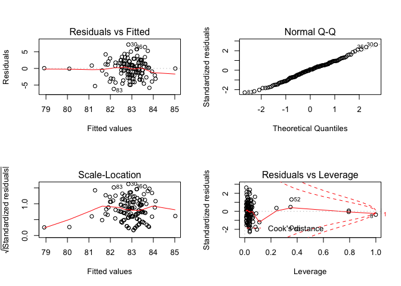<!-- -->

Full model:

    ## 
    ## Call:
    ## lm(formula = dbp ~ fuel_used_for_cooking_percent_wood_dung + 
    ##     percent_public_source + percent_private_toilet + percent_employed + 
    ##     percent_without_hs_education + percent_caste + median_age + 
    ##     percent_female + percent_marital_status, data = total)
    ## 
    ## Residuals:
    ##     Min      1Q  Median      3Q     Max 
    ## -6.1063 -1.7159  0.1151  1.5832  7.1919 
    ## 
    ## Coefficients:
    ##                                          Estimate Std. Error t value
    ## (Intercept)                             83.330946   4.019182  20.733
    ## fuel_used_for_cooking_percent_wood_dung -1.912130   5.490215  -0.348
    ## percent_public_source                   -0.020060   0.024244  -0.827
    ## percent_private_toilet                  -0.002713   0.006517  -0.416
    ## percent_employed                        -4.012456   3.715342  -1.080
    ## percent_without_hs_education            -1.032857   1.851311  -0.558
    ## percent_caste                            0.027418   0.028012   0.979
    ## median_age                               0.040190   0.062537   0.643
    ## percent_female                           0.116323   0.466785   0.249
    ## percent_marital_status                   0.000601   0.016970   0.035
    ##                                         Pr(>|t|)    
    ## (Intercept)                               <2e-16 ***
    ## fuel_used_for_cooking_percent_wood_dung    0.728    
    ## percent_public_source                      0.410    
    ## percent_private_toilet                     0.678    
    ## percent_employed                           0.282    
    ## percent_without_hs_education               0.578    
    ## percent_caste                              0.330    
    ## median_age                                 0.522    
    ## percent_female                             0.804    
    ## percent_marital_status                     0.972    
    ## ---
    ## Signif. codes:  0 '***' 0.001 '**' 0.01 '*' 0.05 '.' 0.1 ' ' 1
    ## 
    ## Residual standard error: 2.755 on 124 degrees of freedom
    ## Multiple R-squared:  0.07129,    Adjusted R-squared:  0.003884 
    ## F-statistic: 1.058 on 9 and 124 DF,  p-value: 0.3989

    ##                                              Estimate  Std. Error
    ## (Intercept)                             83.3309462630 4.019181894
    ## fuel_used_for_cooking_percent_wood_dung -1.9121301016 5.490215435
    ## percent_public_source                   -0.0200598083 0.024243759
    ## percent_private_toilet                  -0.0027130617 0.006517217
    ## percent_employed                        -4.0124558718 3.715341895
    ## percent_without_hs_education            -1.0328574693 1.851310911
    ## percent_caste                            0.0274180151 0.028012013
    ## median_age                               0.0401899198 0.062536927
    ## percent_female                           0.1163227959 0.466785010
    ## percent_marital_status                   0.0006009671 0.016970479
    ##                                            t value     Pr(>|t|)
    ## (Intercept)                             20.7333105 4.066778e-42
    ## fuel_used_for_cooking_percent_wood_dung -0.3482796 7.282208e-01
    ## percent_public_source                   -0.8274216 4.095877e-01
    ## percent_private_toilet                  -0.4162915 6.779164e-01
    ## percent_employed                        -1.0799695 2.822519e-01
    ## percent_without_hs_education            -0.5579060 5.779144e-01
    ## percent_caste                            0.9787949 3.295871e-01
    ## median_age                               0.6426590 5.216319e-01
    ## percent_female                           0.2491999 8.036184e-01
    ## percent_marital_status                   0.0354125 9.718078e-01

    ##                             (Intercept) 
    ##                           83.3309462630 
    ## fuel_used_for_cooking_percent_wood_dung 
    ##                           -1.9121301016 
    ##                   percent_public_source 
    ##                           -0.0200598083 
    ##                  percent_private_toilet 
    ##                           -0.0027130617 
    ##                        percent_employed 
    ##                           -4.0124558718 
    ##            percent_without_hs_education 
    ##                           -1.0328574693 
    ##                           percent_caste 
    ##                            0.0274180151 
    ##                              median_age 
    ##                            0.0401899198 
    ##                          percent_female 
    ##                            0.1163227959 
    ##                  percent_marital_status 
    ##                            0.0006009671

    ##        1        2        3        4        5        6        7        8 
    ## 82.69139 82.78562 83.10266 82.90276 83.65461 82.60543 82.23685 85.03553 
    ##        9       10       11       12       13       14       15       16 
    ## 83.15482 82.88523 82.00517 82.87534 82.79515 82.72831 83.30920 81.44953 
    ##       17       18       19       20       21       22       23       24 
    ## 83.17135 82.08678 83.00347 83.06045 81.91992 82.74245 82.64499 83.05214 
    ##       25       26       27       28       29       30       31       32 
    ## 83.19951 82.39151 83.41566 83.21150 82.58168 82.80810 82.72138 83.59128 
    ##       33       34       35       36       37       38       39       40 
    ## 82.42925 83.12504 82.77962 83.45172 84.14029 84.03554 83.46986 82.10950 
    ##       41       42       43       44       45       46       47       48 
    ## 84.28805 83.57013 83.29588 82.75694 83.56346 82.94300 83.04482 83.23322 
    ##       49       50       51       52       53       54       55       56 
    ## 83.42628 83.70251 83.59404 83.06695 83.81112 83.51983 82.68519 82.75987 
    ##       57       58       59       60       61       62       63       64 
    ## 82.69906 82.74068 82.61090 82.63638 81.29265 82.83821 84.04846 83.45406 
    ##       65       66       67       68       69       70       71       72 
    ## 82.81467 82.65485 82.45851 82.64911 82.42019 81.85368 82.90417 83.25416 
    ##       73       74       75       76       77       78       79       80 
    ## 83.78941 81.68590 82.78820 83.41637 82.33166 82.38529 83.56838 82.93042 
    ##       81       82       83       84       85       86       87       88 
    ## 83.89199 83.57891 82.10626 80.12380 82.61880 82.51503 81.97684 82.65430 
    ##       89       90       91       92       93       94       95       96 
    ## 82.39645 82.55920 83.71990 83.08122 82.71699 82.64195 83.17726 82.74977 
    ##       97       98       99      100      101      102      103      104 
    ## 83.37173 83.44678 82.14720 83.45223 81.80557 83.61517 83.12976 83.25193 
    ##      105      106      107      108      109      110      111      112 
    ## 83.12654 83.34322 83.09634 83.33437 83.13995 83.62922 83.26803 82.51604 
    ##      113      114      115      116      117      118      119      120 
    ## 82.28005 82.53249 83.35455 83.71605 83.55189 84.24383 83.44679 83.99381 
    ##      121      122      123      124      125      126      127      128 
    ## 82.82693 82.71277 81.92011 82.38841 83.19953 83.44088 82.69180 82.89449 
    ##      129      130      131      132      133      134 
    ## 83.47422 82.61278 83.01382 83.03867 82.75161 78.88454

    ## # A tibble: 1 x 11
    ##   r.squared adj.r.squared sigma statistic p.value    df logLik   AIC   BIC
    ##       <dbl>         <dbl> <dbl>     <dbl>   <dbl> <int>  <dbl> <dbl> <dbl>
    ## 1    0.0713       0.00388  2.75      1.06   0.399    10  -321.  663.  695.
    ## # … with 2 more variables: deviance <dbl>, df.residual <int>

| term                                          | estimate | p.value |
| :-------------------------------------------- | -------: | ------: |
| (Intercept)                                   |   83.331 |   0.000 |
| fuel\_used\_for\_cooking\_percent\_wood\_dung |  \-1.912 |   0.728 |
| percent\_public\_source                       |  \-0.020 |   0.410 |
| percent\_private\_toilet                      |  \-0.003 |   0.678 |
| percent\_employed                             |  \-4.012 |   0.282 |
| percent\_without\_hs\_education               |  \-1.033 |   0.578 |
| percent\_caste                                |    0.027 |   0.330 |
| median\_age                                   |    0.040 |   0.522 |
| percent\_female                               |    0.116 |   0.804 |
| percent\_marital\_status                      |    0.001 |   0.972 |

| dbp | fuel\_used\_for\_cooking\_percent\_wood\_dung | percent\_public\_source | percent\_private\_toilet | percent\_employed | percent\_without\_hs\_education | percent\_caste | median\_age | percent\_female | percent\_marital\_status |  .fitted |   .se.fit |      .resid |      .hat |   .sigma |    .cooksd |  .std.resid |
| --: | --------------------------------------------: | ----------------------: | -----------------------: | ----------------: | ------------------------------: | -------------: | ----------: | --------------: | -----------------------: | -------: | --------: | ----------: | --------: | -------: | ---------: | ----------: |
|  85 |                                     0.0000000 |               0.0270270 |              100.0000000 |         0.5405405 |                       0.0270270 |      0.5675676 |    43.08108 |       0.7017544 |                0.8108108 | 82.69139 | 0.6330816 |   2.3086081 | 0.0528132 | 2.757683 |  0.0041342 |   0.8610811 |
|  82 |                                     0.0000000 |               0.0789474 |                0.7368421 |         0.5789474 |                       0.0263158 |      0.2368421 |    42.89474 |       0.6666667 |                0.7631579 | 82.78562 | 0.5948009 | \-0.7856192 | 0.0466194 | 2.765013 |  0.0004171 | \-0.2920725 |
|  84 |                                     0.0277778 |               0.0555556 |                0.4722222 |         0.4444444 |                       0.3055556 |      0.7500000 |    45.33333 |       0.7142857 |                0.8947368 | 83.10266 | 0.3771682 |   0.8973412 | 0.0187453 | 2.764758 |  0.0002066 |   0.3288353 |
|  84 |                                     0.0000000 |               0.1538462 |                0.7692308 |         0.6153846 |                       0.0000000 |      0.4615385 |    47.07692 |       0.7000000 |              100.0000000 | 82.90276 | 1.6297382 |   1.0972355 | 0.3499928 | 2.763241 |  0.0131415 |   0.4940290 |
|  86 |                                     0.0277778 |               0.1944444 |                0.8333333 |         0.3888889 |                       0.2500000 |      0.3888889 |    52.50000 |       0.6909091 |                0.9166667 | 83.65461 | 0.6314437 |   2.3453910 | 0.0525403 | 2.757419 |  0.0042425 |   0.8746747 |
|  83 |                                     0.0000000 |               0.3076923 |                0.7435897 |         0.5128205 |                       0.2820513 |      0.4871795 |    38.35897 |       0.6551724 |                0.7435897 | 82.60543 | 0.3790186 |   0.3945719 | 0.0189297 | 2.765731 |  0.0000403 |   0.1446065 |
|  85 |                                     0.0000000 |               0.1351351 |                0.5405405 |         0.6486486 |                       0.3513514 |      0.9189189 |    44.00000 |       0.7017544 |                0.7837838 | 82.23685 | 0.7124288 |   2.7631485 | 0.0668815 | 2.753913 |  0.0077280 |   1.0383589 |
|  85 |                                     0.0526316 |               0.3947368 |                0.9473684 |         0.5789474 |                       0.2631579 |    100.0000000 |    39.57895 |       0.6666667 |                0.8157895 | 85.03553 | 2.7541466 | \-0.0355289 | 0.9995337 | 2.761983 | 76.4626426 | \-0.5972546 |
|  81 |                                     0.0000000 |               0.2777778 |                0.3611111 |         0.4166667 |                       0.4722222 |      0.0000000 |    47.72222 |       0.6153846 |                0.8055556 | 83.15482 | 0.6805699 | \-2.1548192 | 0.0610336 | 2.758687 |  0.0042356 | \-0.8072303 |
|  83 |                                     0.0000000 |               0.1500000 |                0.8500000 |         0.4250000 |                       0.3500000 |      0.0750000 |    38.47500 |       0.6666667 |                0.8000000 | 82.88523 | 0.5208061 |   0.1147699 | 0.0357417 | 2.765944 |  0.0000067 |   0.0424270 |
|  84 |                                     0.0000000 |               0.1071429 |                0.9285714 |         0.6666667 |                       0.3392857 |      0.6785714 |    40.00000 |       0.6666667 |                0.9107143 | 82.00517 | 0.6631285 |   1.9948289 | 0.0579454 | 2.759750 |  0.0034237 |   0.7460695 |
|  79 |                                     0.0000000 |               0.0344828 |                0.9137931 |         0.4655172 |                       0.2068966 |      0.4137931 |    38.31034 |       0.6666667 |                0.8965517 | 82.87534 | 0.4821441 | \-3.8753357 | 0.0306321 | 2.743101 |  0.0064512 | \-1.4288173 |
|  85 |                                     0.0000000 |               0.3818182 |                0.8000000 |         0.4909091 |                       0.2727273 |      0.8727273 |    40.41818 |       0.6585366 |                0.8909091 | 82.79515 | 0.3266442 |   2.2048527 | 0.0140596 | 2.758709 |  0.0009265 |   0.8060573 |
|  84 |                                     0.0000000 |               0.1636364 |                0.8909091 |         0.4909091 |                       0.1818182 |      0.6545455 |    36.41818 |       0.6746988 |                0.8909091 | 82.72831 | 0.5639097 |   1.2716883 | 0.0419027 | 2.763483 |  0.0009728 |   0.4716149 |
|  87 |                                     0.0000000 |               0.0000000 |              100.0000000 |         0.4545455 |                       0.0606061 |      0.2121212 |    51.18182 |       0.6250000 |                0.8181818 | 83.30920 | 0.4799251 |   3.6907983 | 0.0303508 | 2.745240 |  0.0057944 |   1.3605818 |
|  76 |                                     0.0263158 |               0.8684211 |                0.1315789 |         0.7368421 |                       0.4736842 |      0.8157895 |    38.05263 |       0.6896552 |                0.9210526 | 81.44953 | 0.8804740 | \-5.4495307 | 0.1021542 | 2.716919 |  0.0495900 | \-2.0877087 |
|  82 |                                     0.0000000 |               0.2702703 |                0.7837838 |         0.4594595 |                       0.1891892 |      0.5945946 |    44.56757 |       0.6785714 |                0.8648649 | 83.17135 | 0.3179054 | \-1.1713546 | 0.0133174 | 2.763920 |  0.0002473 | \-0.4280666 |
|  83 |                                     0.1025641 |               0.0256410 |                0.9487179 |         0.5897436 |                       0.2820513 |      0.6923077 |    37.74359 |       0.6551724 |                0.9487179 | 82.08678 | 0.6434179 |   0.9132216 | 0.0545519 | 2.764668 |  0.0006707 |   0.3409330 |
|  82 |                                     0.0000000 |               0.2105263 |                0.9473684 |         0.4210526 |                       0.5263158 |      0.6315789 |    45.21053 |       0.6666667 |                0.8421053 | 83.00347 | 0.6855913 | \-1.0034673 | 0.0619375 | 2.764387 |  0.0009339 | \-0.3760962 |
|  82 |                                     0.0000000 |               0.0263158 |                0.8947368 |         0.4473684 |                       0.2105263 |      0.2894737 |    41.21053 |       0.6896552 |                0.8947368 | 83.06045 | 0.3914573 | \-1.0604460 | 0.0201926 | 2.764277 |  0.0003117 | \-0.3888928 |
|  86 |                                     0.0540541 |               0.7837838 |                0.5675676 |         0.5405405 |                       0.7297297 |      0.1621622 |    38.72973 |       0.6071429 |                0.9729730 | 81.91992 | 0.7966733 |   4.0800762 | 0.0836342 | 2.739136 |  0.0218477 |   1.5471966 |
|  87 |                                     0.0000000 |               0.1500000 |                0.9000000 |         0.5500000 |                       0.1500000 |      0.4250000 |    42.02500 |       0.6666667 |                0.9250000 | 82.74245 | 0.4061845 |   4.2575454 | 0.0217405 | 2.738597 |  0.0054263 |   1.5625860 |
|  87 |                                     0.0000000 |               0.6923077 |                0.6666667 |         0.4871795 |                       0.4102564 |      0.0256410 |    40.51282 |       0.6779661 |                0.8205128 | 82.64499 | 0.3980137 |   4.3550065 | 0.0208747 | 2.737348 |  0.0054418 |   1.5976489 |
|  88 |                                     0.0000000 |               0.8461538 |                0.6923077 |         0.4615385 |                       0.3076923 |      0.2307692 |    45.38462 |       0.6779661 |                0.9230769 | 83.05214 | 0.3640579 |   4.9478618 | 0.0174648 | 2.729100 |  0.0058362 |   1.8119874 |
|  86 |                                     0.0000000 |               0.5365854 |                0.6585366 |         0.3902439 |                       0.3170732 |      0.3658537 |    41.92683 |       0.6774194 |                0.9512195 | 83.19951 | 0.5108745 |   2.8004942 | 0.0343916 | 2.754002 |  0.0038119 |   1.0345365 |
|  84 |                                     0.0769231 |               0.3333333 |                0.7179487 |         0.5384615 |                       0.3589744 |      0.7435897 |    41.00000 |       0.6779661 |                0.9487179 | 82.39151 | 0.4473150 |   1.6084901 | 0.0263664 | 2.762056 |  0.0009482 |   0.5917418 |
|  85 |                                     0.0000000 |               0.4102564 |                0.7179487 |         0.4102564 |                       0.1282051 |      0.2051282 |    44.56410 |       0.6551724 |                0.9743590 | 83.41566 | 0.4407691 |   1.5843356 | 0.0256003 | 2.762176 |  0.0008918 |   0.5826266 |
|  89 |                                     0.0000000 |               0.1538462 |                0.7948718 |         0.4615385 |                       0.1538462 |      0.0512821 |    45.17949 |       0.6779661 |                0.9487179 | 83.21150 | 0.3344924 |   5.7885012 | 0.0147433 | 2.715524 |  0.0067058 |   2.1169135 |
|  85 |                                     0.0000000 |               0.9250000 |                0.8250000 |         0.4500000 |                       0.6250000 |      0.1750000 |    40.80000 |       0.6666667 |                0.9500000 | 82.58168 | 0.7333884 |   2.4183221 | 0.0708747 | 2.756698 |  0.0063270 |   0.9107280 |
|  90 |                                     0.0000000 |               0.2307692 |                0.8974359 |         0.5128205 |                       0.2307692 |      0.1538462 |    42.28205 |       0.6551724 |                0.8205128 | 82.80810 | 0.3049595 |   7.1919041 | 0.0122548 | 2.687904 |  0.0085611 |   2.6268369 |
|  84 |                                     0.0000000 |               0.1750000 |                0.7750000 |         0.5000000 |                       0.1750000 |      0.2500000 |    37.27500 |       0.6666667 |                0.9000000 | 82.72138 | 0.5189868 |   1.2786217 | 0.0354925 | 2.763472 |  0.0008219 |   0.4726078 |
|  84 |                                     0.0000000 |               0.1025641 |                0.7948718 |         0.3589744 |                       0.1794872 |      0.2564103 |    44.94872 |       0.6551724 |                0.9487179 | 83.59128 | 0.5459491 |   0.4087239 | 0.0392760 | 2.765709 |  0.0000937 |   0.1513709 |
|  82 |                                     0.0000000 |               0.0270270 |              100.0000000 |         0.5945946 |                       0.0270270 |      0.0270270 |    42.32432 |       0.7017544 |                0.7837838 | 82.42925 | 0.7212962 | \-0.4292516 | 0.0685568 | 2.765674 |  0.0001919 | \-0.1614527 |
|  83 |                                     0.0263158 |               0.4736842 |                0.9210526 |         0.4473684 |                       0.2631579 |      0.8157895 |    45.28947 |       0.6896552 |                0.8157895 | 83.12504 | 0.3465812 | \-0.1250360 | 0.0158283 | 2.765941 |  0.0000034 | \-0.0457521 |
|  86 |                                     0.0256410 |               0.2307692 |                0.9743590 |         0.5384615 |                       0.1538462 |      0.4102564 |    43.20513 |       0.6551724 |                0.9230769 | 82.77962 | 0.3889545 |   3.2203844 | 0.0199352 | 2.750369 |  0.0028363 |   1.1808426 |
|  90 |                                     0.0000000 |               0.0188679 |              100.0000000 |         0.3773585 |                       0.0754717 |      0.1320755 |    47.32075 |       0.6750000 |                0.9811321 | 83.45172 | 0.5987504 |   6.5482781 | 0.0472405 | 2.699010 |  0.0294053 |   2.4352702 |
|  82 |                                     0.0000000 |               0.0526316 |                0.9473684 |         0.3157895 |                       0.0789474 |      0.0000000 |    51.84211 |       0.6666667 |                0.8684211 | 84.14029 | 0.6757166 | \-2.1402880 | 0.0601662 | 2.758792 |  0.0041117 | \-0.8014166 |
|  84 |                                     0.0000000 |               0.0000000 |                0.9750000 |         0.5000000 |                       0.0250000 |      0.0000000 |    48.85000 |       6.6666667 |                0.8750000 | 84.03554 | 2.7531315 | \-0.0355404 | 0.9987971 | 2.764421 | 11.4887496 | \-0.3719768 |
|  83 |                                     0.0000000 |               0.0769231 |                0.8846154 |         0.4230769 |                       0.0961538 |      0.0192308 |    46.30769 |       0.6666667 |                0.9423077 | 83.46986 | 0.4192827 | \-0.4698570 | 0.0231653 | 2.765632 |  0.0000706 | \-0.1725706 |
|  79 |                                     0.0000000 |               0.8285714 |                0.0285714 |         0.6000000 |                       0.4571429 |      0.4000000 |    39.57143 |       0.6274510 |                0.9428571 | 82.10950 | 0.5454196 | \-3.1095041 | 0.0391999 | 2.751135 |  0.0054103 | \-1.1515592 |
|  81 |                                     0.0000000 |               0.0000000 |              100.0000000 |         0.3030303 |                       0.0000000 |      0.0303030 |    58.81818 |       0.6800000 |                0.7878788 | 84.28805 | 0.7489139 | \-3.2880462 | 0.0739073 | 2.748754 |  0.0122766 | \-1.2402875 |
|  84 |                                     0.0000000 |               0.0000000 |              100.0000000 |         0.4000000 |                       0.0333333 |      0.0000000 |    51.46667 |       0.6956522 |                0.9000000 | 83.57013 | 0.5062904 |   0.4298686 | 0.0337771 | 2.765684 |  0.0000881 |   0.1587482 |
|  81 |                                     0.0000000 |               0.0000000 |              100.0000000 |         0.4444444 |                       0.0000000 |      0.0000000 |    48.25926 |       0.6829268 |                0.9629630 | 83.29588 | 0.5055460 | \-2.2958808 | 0.0336779 | 2.757936 |  0.0025051 | \-0.8478130 |
|  83 |                                     0.0000000 |               0.0263158 |              100.0000000 |         0.5526316 |                       0.0526316 |      0.0789474 |    47.07895 |       0.6428571 |                0.9210526 | 82.75694 | 0.5708108 |   0.2430624 | 0.0429346 | 2.765874 |  0.0000365 |   0.0901900 |
|  80 |                                     0.0000000 |               0.0000000 |              100.0000000 |         0.3947368 |                       0.1052632 |      0.0526316 |    52.60526 |       0.6896552 |                0.8947368 | 83.56346 | 0.5400663 | \-3.5634588 | 0.0384342 | 2.746488 |  0.0069555 | \-1.3191491 |
|  80 |                                     0.0000000 |               0.0000000 |                0.9666667 |         0.5666667 |                       0.0333333 |      0.1000000 |    45.83333 |       0.6666667 |                0.8333333 | 82.94300 | 0.5673174 | \-2.9429992 | 0.0424107 | 2.752640 |  0.0052786 | \-1.0917223 |
|  84 |                                     0.0400000 |               0.0000000 |              100.0000000 |         0.5000000 |                       0.1000000 |      0.0000000 |    52.08000 |       0.6666667 |                0.9000000 | 83.04482 | 0.5676022 |   0.9551784 | 0.0424533 | 2.764564 |  0.0005567 |   0.3543367 |
|  84 |                                     0.0000000 |               0.0000000 |              100.0000000 |         0.4761905 |                       0.0000000 |      0.0000000 |    49.85714 |       0.6875000 |                0.9047619 | 83.23322 | 0.4887897 |   0.7667829 | 0.0314824 | 2.765072 |  0.0002600 |   0.2828332 |
|  81 |                                     0.0000000 |               0.0000000 |              100.0000000 |         0.4473684 |                       0.0000000 |      0.0263158 |    51.89474 |       0.6428571 |                0.8947368 | 83.42628 | 0.4886782 | \-2.4262775 | 0.0314680 | 2.757017 |  0.0026022 | \-0.8949426 |
|  85 |                                     0.0000000 |               0.0000000 |                0.9855072 |         0.4347826 |                       0.0144928 |      0.0434783 |    51.10145 |       0.6730769 |                0.8405797 | 83.70251 | 0.5287362 |   1.2974879 | 0.0368385 | 2.763395 |  0.0008809 |   0.4799162 |
|  83 |                                     0.0000000 |               0.0000000 |              100.0000000 |         0.4615385 |                       0.0512821 |      0.0000000 |    58.71795 |       0.6779661 |                0.8974359 | 83.59404 | 0.7399829 | \-0.5940422 | 0.0721550 | 2.765406 |  0.0003897 | \-0.2238676 |
|  86 |                                     0.0000000 |               0.0000000 |              100.0000000 |         0.5483871 |                       0.0000000 |      0.0000000 |    51.54839 |       0.6521739 |              100.0000000 | 83.06695 | 1.6484602 |   2.9330540 | 0.3580802 | 2.746198 |  0.0985104 |   1.3288971 |
|  79 |                                     0.0000000 |               0.0000000 |              100.0000000 |         0.4117647 |                       0.0000000 |      0.0000000 |    57.94118 |       0.6400000 |                0.9411765 | 83.81112 | 0.6410057 | \-4.8111158 | 0.0541436 | 2.729762 |  0.0184591 | \-1.7957459 |
|  86 |                                     0.0000000 |               0.1304348 |                0.8695652 |         0.4347826 |                       0.1304348 |      0.1086957 |    49.56522 |       0.6666667 |                0.9565217 | 83.51983 | 0.4355317 |   2.4801703 | 0.0249956 | 2.756677 |  0.0021313 |   0.9117796 |
|  84 |                                     0.0000000 |               0.0000000 |              100.0000000 |         0.5641026 |                       0.1025641 |      0.1282051 |    47.64103 |       0.6551724 |                0.8461538 | 82.68519 | 0.5901959 |   1.3148065 | 0.0459003 | 2.763300 |  0.0011486 |   0.4886261 |
|  80 |                                     0.0000000 |               0.1315789 |                0.9736842 |         0.4736842 |                       0.2105263 |      0.4210526 |    36.39474 |       0.6666667 |                0.8157895 | 82.75987 | 0.5624501 | \-2.7598693 | 0.0416861 | 2.754259 |  0.0045559 | \-1.0234021 |
|  79 |                                     0.0000000 |               0.0500000 |                0.9500000 |         0.5250000 |                       0.0750000 |      0.5750000 |    36.25000 |       0.7096774 |                0.8250000 | 82.69906 | 0.6784032 | \-3.6990596 | 0.0606456 | 2.744473 |  0.0123921 | \-1.3854417 |
|  81 |                                     0.0000000 |               0.0243902 |                0.8536585 |         0.5121951 |                       0.1951220 |      0.2682927 |    39.31707 |       0.6984127 |                0.8048780 | 82.74068 | 0.3990049 | \-1.7406786 | 0.0209788 | 2.761412 |  0.0008739 | \-0.6386078 |
|  81 |                                     0.0000000 |               0.4594595 |                0.4324324 |         0.4054054 |                       0.4594595 |      0.4324324 |    32.35135 |       0.6785714 |                0.9729730 | 82.61090 | 0.8480346 | \-1.6109017 | 0.0947655 | 2.761748 |  0.0039545 | \-0.6146108 |
|  83 |                                     0.0000000 |               0.0512821 |                0.8717949 |         0.5128205 |                       0.2307692 |      0.5384615 |    37.58974 |       0.6779661 |                0.8205128 | 82.63638 | 0.4407211 |   0.3636207 | 0.0255948 | 2.765765 |  0.0000470 |   0.1337182 |
|  82 |                                     0.2549020 |               0.3421053 |                0.7894737 |         0.6052632 |                       0.7368421 |      0.1052632 |    39.05263 |       0.6428571 |                0.9473684 | 81.29265 | 1.3743710 |   0.7073520 | 0.2489037 | 2.764985 |  0.0029089 |   0.2962780 |
|  85 |                                     0.0000000 |               0.1538462 |                0.8974359 |         0.5128205 |                       0.2051282 |      0.0769231 |    42.38462 |       0.6551724 |                0.9487179 | 82.83821 | 0.3154532 |   2.1617875 | 0.0131127 | 2.758996 |  0.0008291 |   0.7899342 |
|  80 |                                     0.0000000 |               0.0000000 |                0.8333333 |         0.4166667 |                       0.0000000 |      0.0000000 |    56.08333 |       0.6666667 |              100.0000000 | 84.04846 | 1.6588221 | \-4.0484587 | 0.3625960 | 2.727912 |  0.1927508 | \-1.8407465 |
|  83 |                                     0.0000000 |               0.0000000 |                0.9729730 |         0.4054054 |                       0.1621622 |      0.0000000 |    45.86486 |       0.6545455 |                0.7837838 | 83.45406 | 0.4156521 | \-0.4540597 | 0.0227658 | 2.765655 |  0.0000648 | \-0.1667344 |
|  84 |                                     0.0000000 |               0.2666667 |                0.8000000 |         0.4666667 |                       0.2666667 |      0.1333333 |    38.66667 |       0.6956522 |                0.9333333 | 82.81467 | 0.4268963 |   1.1853345 | 0.0240142 | 2.763848 |  0.0004668 |   0.4355428 |
|  82 |                                     0.0256410 |               0.0512821 |                0.8974359 |         0.4871795 |                       0.4102564 |      0.7692308 |    41.23077 |       0.6551724 |                0.9230769 | 82.65485 | 0.3789079 | \-0.6548495 | 0.0189187 | 2.765322 |  0.0001111 | \-0.2399942 |
|  83 |                                     0.0500000 |               0.2500000 |                0.7000000 |         0.5000000 |                       0.4250000 |      0.4250000 |    39.45000 |       0.6666667 |                0.9750000 | 82.45851 | 0.4173315 |   0.5414872 | 0.0229502 | 2.765524 |  0.0000929 |   0.1988573 |
|  84 |                                     0.0000000 |               0.2500000 |                0.6500000 |         0.5000000 |                       0.3250000 |      0.4500000 |    39.22500 |       0.6666667 |                0.8500000 | 82.64911 | 0.3535388 |   1.3508917 | 0.0164701 | 2.763236 |  0.0004094 |   0.4944683 |
|  84 |                                     0.0000000 |               0.1351351 |                0.8918919 |         0.5675676 |                       0.2972973 |      0.4324324 |    39.56757 |       0.6545455 |                0.9459459 | 82.42019 | 0.3872843 |   1.5798090 | 0.0197644 | 2.762220 |  0.0006765 |   0.5792300 |
|  83 |                                     0.0000000 |               0.2500000 |                0.8888889 |         0.6666667 |                       0.4166667 |      0.6111111 |    38.33333 |       0.6666667 |                0.9444444 | 81.85368 | 0.6709729 |   1.1463230 | 0.0593244 | 2.763911 |  0.0011609 |   0.4290409 |
|  78 |                                     0.0000000 |               0.0000000 |              100.0000000 |         0.5454545 |                       0.0000000 |      0.0000000 |    48.70455 |       0.6461538 |                0.9090909 | 82.90417 | 0.5792395 | \-4.9041683 | 0.0442120 | 2.728732 |  0.0153381 | \-1.8209426 |
|  83 |                                     0.0000000 |               0.0000000 |                0.9607843 |         0.5294118 |                       0.0000000 |      0.0196078 |    49.07843 |       0.6578947 |                0.9019608 | 83.25416 | 0.5812907 | \-0.2541643 | 0.0445256 | 2.765865 |  0.0000415 | \-0.0943880 |
|  78 |                                     0.0000000 |               0.0000000 |                0.9285714 |         0.3928571 |                       0.0000000 |      0.0000000 |    48.75000 |       0.6666667 |                0.8214286 | 83.78941 | 0.5481275 | \-5.7894058 | 0.0395901 | 2.714190 |  0.0189568 | \-2.1444570 |
|  81 |                                     0.0975610 |               0.3414634 |                0.2439024 |         0.5609756 |                       0.7317073 |      0.2195122 |    36.58537 |       0.6774194 |                0.7804878 | 81.68590 | 0.8206828 | \-0.6858962 | 0.0887512 | 2.765206 |  0.0006626 | \-0.2608264 |
|  83 |                                     0.0000000 |               0.0000000 |                0.9333333 |         0.5833333 |                       0.0166667 |      0.0333333 |    43.21667 |       0.6813187 |                0.9333333 | 82.78820 | 0.6122747 |   0.2117974 | 0.0493987 | 2.765895 |  0.0000323 |   0.0788557 |
|  82 |                                     0.0000000 |               0.0750000 |                0.9000000 |         0.4250000 |                       0.2250000 |      0.1000000 |    48.42500 |       0.6666667 |                0.9500000 | 83.41637 | 0.4227654 | \-1.4163715 | 0.0235517 | 2.762943 |  0.0006530 | \-0.5203124 |
|  78 |                                     0.0000000 |               0.5263158 |                0.5789474 |         0.5526316 |                       0.4736842 |      0.3684211 |    40.65789 |       0.6428571 |                0.9736842 | 82.33166 | 0.4998508 | \-4.3316626 | 0.0329234 | 2.737302 |  0.0087039 | \-1.5989536 |
|  84 |                                     0.0000000 |               0.6000000 |                0.3500000 |         0.5500000 |                       0.4750000 |      0.1000000 |    41.90000 |       0.6666667 |                0.9000000 | 82.38529 | 0.5258479 |   1.6147084 | 0.0364371 | 2.761985 |  0.0013483 |   0.5971257 |
|  82 |                                     0.0000000 |               0.0263158 |                0.9736842 |         0.5000000 |                       0.0526316 |      0.0000000 |    55.31579 |       0.6666667 |                0.8421053 | 83.56838 | 0.7523596 | \-1.5683796 | 0.0745889 | 2.762055 |  0.0028231 | \-0.5918280 |
|  84 |                                     0.0256410 |               0.0000000 |              100.0000000 |         0.5641026 |                       0.0512821 |      0.0000000 |    53.66667 |       0.6779661 |                0.8205128 | 82.93042 | 0.7209068 |   1.0695775 | 0.0684828 | 2.764159 |  0.0011897 |   0.4022801 |
|  84 |                                     0.0000000 |               0.0303030 |              100.0000000 |         0.3636364 |                       0.0000000 |      0.0303030 |    55.03030 |       0.6800000 |                0.7272727 | 83.89199 | 0.5819516 |   0.1080118 | 0.0446269 | 2.765947 |  0.0000075 |   0.0401140 |
|  89 |                                     0.0000000 |               0.0000000 |              100.0000000 |         0.3750000 |                       0.0000000 |      0.0000000 |    48.41667 |       0.6666667 |                0.8750000 | 83.57891 | 0.6002783 |   5.4210945 | 0.0474820 | 2.720243 |  0.0202665 |   2.0163320 |
|  76 |                                     0.0000000 |               0.9750000 |                0.0000000 |         0.5500000 |                       0.5250000 |      0.3750000 |    36.35000 |       0.6206897 |                0.9750000 | 82.10626 | 0.5425343 | \-6.1062587 | 0.0387862 | 2.708355 |  0.0206258 | \-2.2608767 |
|  80 |                                     0.0000000 |             100.0000000 |                0.0000000 |         0.5405405 |                       0.6216216 |      0.6756757 |    37.75676 |       0.6296296 |                0.9459459 | 80.12380 | 2.4539580 | \-0.1237993 | 0.7935195 | 2.765855 |  0.0037589 | \-0.0988987 |
|  81 |                                     0.0000000 |               0.2931034 |                0.6896552 |         0.5344828 |                       0.1896552 |      0.3275862 |    38.58621 |       0.6511628 |                0.9655172 | 82.61880 | 0.4350366 | \-1.6188040 | 0.0249388 | 2.762012 |  0.0009058 | \-0.5951001 |
|  84 |                                     0.0000000 |               0.0000000 |                0.9148936 |         0.5744681 |                       0.1914894 |      0.4255319 |    39.82979 |       0.6571429 |                0.8510638 | 82.51503 | 0.4425241 |   1.4849696 | 0.0258046 | 2.762636 |  0.0007901 |   0.5461428 |
|  83 |                                     0.0000000 |               0.1666667 |                0.8333333 |         0.6666667 |                       0.3611111 |      0.7500000 |    39.83333 |       0.6666667 |                0.7222222 | 81.97684 | 0.6677294 |   1.0231603 | 0.0587522 | 2.764330 |  0.0009148 |   0.3828277 |
|  85 |                                     0.0000000 |               0.0000000 |                0.7068966 |         0.5517241 |                       0.2586207 |      0.5172414 |    42.68966 |       0.6511628 |                0.8965517 | 82.65430 | 0.3622355 |   2.3456992 | 0.0172904 | 2.757723 |  0.0012981 |   0.8589570 |
|  85 |                                     0.0000000 |               0.0869565 |                0.7391304 |         0.5652174 |                       0.2826087 |      0.2608696 |    38.41304 |       0.6666667 |                0.8913043 | 82.39645 | 0.4042984 |   2.6035539 | 0.0215391 | 2.755764 |  0.0020095 |   0.9554468 |
|  83 |                                     0.0000000 |               0.0000000 |                0.9743590 |         0.5384615 |                       0.3333333 |      0.2564103 |    41.10256 |       0.6551724 |                0.9743590 | 82.55920 | 0.3468229 |   0.4408002 | 0.0158503 | 2.765674 |  0.0000419 |   0.1612957 |
|  84 |                                     0.0175439 |               0.0000000 |                0.9824561 |         0.3859649 |                       0.0350877 |      0.0350877 |    48.07018 |       0.6588235 |                0.8947368 | 83.71990 | 0.5501737 |   0.2801007 | 0.0398862 | 2.765845 |  0.0000447 |   0.1037683 |
|  83 |                                     0.0000000 |               0.0000000 |              100.0000000 |         0.4531250 |                       0.0312500 |      0.0156250 |    44.62500 |       0.6666667 |                0.9062500 | 83.08122 | 0.5818793 | \-0.0812160 | 0.0446159 | 2.765954 |  0.0000042 | \-0.0301623 |
|  81 |                                     0.0169492 |               0.1355932 |                0.7796610 |         0.4915254 |                       0.2711864 |      0.2372881 |    39.61017 |       0.6590909 |                0.8474576 | 82.71699 | 0.3513105 | \-1.7169931 | 0.0162632 | 2.761557 |  0.0006528 | \-0.6284066 |
|  82 |                                     0.0000000 |               0.2131148 |                0.9672131 |         0.5081967 |                       0.4426230 |      0.1147541 |    43.09836 |       0.6739130 |                0.8852459 | 82.64195 | 0.4707772 | \-0.6419532 | 0.0292048 | 2.765341 |  0.0001683 | \-0.2365109 |
|  86 |                                     0.0000000 |               0.0800000 |                0.9800000 |         0.4800000 |                       0.1800000 |      0.0000000 |    46.94000 |       0.6486486 |                0.8400000 | 83.17726 | 0.3548729 |   2.8227382 | 0.0165947 | 2.754031 |  0.0018016 |   1.0332752 |
|  78 |                                     0.0000000 |               0.0526316 |                0.8684211 |         0.5526316 |                       0.0526316 |      0.2105263 |    40.13158 |       0.6428571 |                0.9473684 | 82.74977 | 0.5688554 | \-4.7497691 | 0.0426410 | 2.731112 |  0.0138308 | \-1.7621657 |
|  82 |                                     0.0000000 |               0.0000000 |              100.0000000 |         0.4000000 |                       0.0750000 |      0.0500000 |    47.65000 |       0.6666667 |                0.9500000 | 83.37173 | 0.5450618 | \-1.3717335 | 0.0391485 | 2.763085 |  0.0010514 | \-0.5079878 |
|  80 |                                     0.0000000 |               0.0285714 |                0.9142857 |         0.4571429 |                       0.0857143 |      0.1142857 |    48.74286 |       0.6792453 |                0.9428571 | 83.44678 | 0.4246965 | \-3.4467798 | 0.0237673 | 2.748021 |  0.0039041 | \-1.2663348 |
|  78 |                                     0.0540541 |               0.1081081 |                0.1351351 |         0.5675676 |                       0.5405405 |      0.2432432 |    41.59459 |       0.6785714 |                0.8378378 | 82.14720 | 0.5976059 | \-4.1472010 | 0.0470601 | 2.739311 |  0.0117451 | \-1.5421762 |
|  84 |                                     0.0000000 |               0.0175439 |              100.0000000 |         0.4561404 |                       0.0000000 |      0.0000000 |    53.35088 |       0.6744186 |                0.9473684 | 83.45223 | 0.5153336 |   0.5477678 | 0.0349945 | 2.765508 |  0.0001486 |   0.2024153 |
|  80 |                                     0.0416667 |               0.2708333 |                0.3125000 |         0.5625000 |                       0.6666667 |      0.3541667 |    35.29167 |       0.6666667 |                0.8750000 | 81.80557 | 0.6885574 | \-1.8055696 | 0.0624746 | 2.760849 |  0.0030534 | \-0.6769154 |
|  85 |                                     0.0000000 |               0.0000000 |              100.0000000 |         0.3859649 |                       0.0350877 |      0.0175439 |    51.28070 |       0.6744186 |                0.8947368 | 83.61517 | 0.5257295 |   1.3848314 | 0.0364207 | 2.763038 |  0.0009913 |   0.5121119 |
|  80 |                                     0.0000000 |               0.0000000 |              100.0000000 |         0.4871795 |                       0.1025641 |      0.1025641 |    50.97436 |       0.6779661 |                0.8461538 | 83.12976 | 0.5092017 | \-3.1297587 | 0.0341667 | 2.751019 |  0.0047276 | \-1.1560362 |
|  83 |                                     0.0000000 |               0.0000000 |              100.0000000 |         0.4102564 |                       0.2564103 |      0.3589744 |    50.17949 |       0.6551724 |                0.8205128 | 83.25193 | 0.6157709 | \-0.2519256 | 0.0499645 | 2.765866 |  0.0000463 | \-0.0938240 |
|  79 |                                     0.0000000 |               0.0000000 |              100.0000000 |         0.5333333 |                       0.0333333 |      0.1333333 |    53.73333 |       0.6666667 |                0.9333333 | 83.12654 | 0.6490198 | \-4.1265386 | 0.0555059 | 2.739340 |  0.0139616 | \-1.5413383 |
|  82 |                                     0.0000000 |               0.0000000 |              100.0000000 |         0.4324324 |                       0.0000000 |      0.0540541 |    48.21622 |       0.6785714 |                0.7837838 | 83.34322 | 0.5159009 | \-1.3432163 | 0.0350716 | 2.763215 |  0.0008955 | \-0.4963752 |
|  80 |                                     0.0000000 |               0.0697674 |                0.9302326 |         0.4186047 |                       0.1860465 |      0.0000000 |    38.86047 |       0.6769231 |                0.9534884 | 83.09634 | 0.5738821 | \-3.0963443 | 0.0433979 | 2.751196 |  0.0059914 | \-1.1491990 |
|  85 |                                     0.0000000 |               0.0750000 |              100.0000000 |         0.4250000 |                       0.1000000 |      0.0250000 |    49.85000 |       0.6885246 |                0.9500000 | 83.33437 | 0.4868914 |   1.6656289 | 0.0312383 | 2.761753 |  0.0012168 |   0.6143013 |
|  82 |                                     0.0161290 |               0.1774194 |                0.7903226 |         0.4354839 |                       0.1935484 |      0.1129032 |    42.54839 |       0.6808511 |                0.8387097 | 83.13995 | 0.3956283 | \-1.1399489 | 0.0206252 | 2.764014 |  0.0003682 | \-0.4181409 |
|  85 |                                     0.0000000 |               0.0000000 |                0.9000000 |         0.4750000 |                       0.0000000 |      0.0000000 |    52.90000 |       0.6885246 |                0.8250000 | 83.62922 | 0.6180412 |   1.3707784 | 0.0503336 | 2.763055 |  0.0013819 |   0.5106148 |
|  84 |                                     0.0000000 |               0.1621622 |                0.6756757 |         0.3783784 |                       0.3243243 |      0.1891892 |    42.56757 |       0.6785714 |                0.7837838 | 83.26803 | 0.5368658 |   0.7319685 | 0.0379800 | 2.765146 |  0.0002897 |   0.2709019 |
|  86 |                                     0.0000000 |               0.0555556 |              100.0000000 |         0.5277778 |                       0.2777778 |      0.6666667 |    44.08333 |       0.6153846 |                0.8888889 | 82.51604 | 0.5958291 |   3.4839625 | 0.0467807 | 2.747187 |  0.0082348 |   1.2953548 |
|  78 |                                     0.0000000 |               0.1282051 |              100.0000000 |         0.4615385 |                       0.4615385 |      0.5128205 |    36.28205 |       0.6779661 |                0.8205128 | 82.28005 | 0.9242736 | \-4.2800514 | 0.1125705 | 2.735459 |  0.0345047 | \-1.6492775 |
|  81 |                                     0.0000000 |               0.6052632 |                0.7105263 |         0.4736842 |                       0.5526316 |      0.4210526 |    39.81579 |       0.6428571 |                0.8684211 | 82.53249 | 0.5924022 | \-1.5324891 | 0.0462441 | 2.762343 |  0.0015733 | \-0.5696269 |
|  86 |                                     0.0000000 |               0.0476190 |                0.9523810 |         0.4285714 |                       0.1269841 |      0.0952381 |    44.69841 |       0.6736842 |                0.8730159 | 83.35455 | 0.4002827 |   2.6454469 | 0.0211133 | 2.755437 |  0.0020320 |   0.9706095 |
|  87 |                                     0.0000000 |               0.0000000 |                0.9444444 |         0.3888889 |                       0.1388889 |      0.0000000 |    50.02778 |       0.6909091 |                0.8888889 | 83.71605 | 0.4913740 |   3.2839530 | 0.0318162 | 2.749546 |  0.0048234 |   1.2115175 |
|  86 |                                     0.0000000 |               0.0000000 |                0.9473684 |         0.4473684 |                       0.0526316 |      0.1578947 |    49.52632 |       0.6666667 |                0.9736842 | 83.55189 | 0.4640960 |   2.4481095 | 0.0283817 | 2.756884 |  0.0023743 |   0.9015601 |
|  83 |                                     0.0000000 |               0.0263158 |                0.9736842 |         0.3684211 |                       0.0000000 |      0.0000000 |    57.63158 |       0.6666667 |                0.9473684 | 84.24383 | 0.7755603 | \-1.2438299 | 0.0792601 | 2.763494 |  0.0019060 | \-0.4705483 |
|  85 |                                     0.0000000 |               0.0000000 |              100.0000000 |         0.4358974 |                       0.0769231 |      0.0000000 |    53.15385 |       0.6779661 |                0.8461538 | 83.44679 | 0.5178123 |   1.5532095 | 0.0353320 | 2.762287 |  0.0012070 |   0.5740540 |
|  81 |                                     0.0000000 |               0.0000000 |                0.9000000 |         0.4000000 |                       0.0666667 |      0.0666667 |    56.13333 |       0.6956522 |                0.6666667 | 83.99381 | 0.7039206 | \-2.9938079 | 0.0652936 | 2.751836 |  0.0088266 | \-1.1240820 |
|  84 |                                     0.0000000 |               0.0810811 |                0.8918919 |         0.5135135 |                       0.1351351 |      0.4324324 |    40.02703 |       0.6785714 |                0.9729730 | 82.82693 | 0.4380892 |   1.1730681 | 0.0252900 | 2.763889 |  0.0004827 |   0.4313176 |
|  81 |                                     0.0500000 |               0.0250000 |              100.0000000 |         0.4750000 |                       0.1000000 |      0.2000000 |    41.67500 |       0.6666667 |                0.8250000 | 82.71277 | 0.6949314 | \-1.7127726 | 0.0636366 | 2.761356 |  0.0028057 | \-0.6425237 |
|  79 |                                     0.1724138 |               0.8275862 |                0.0000000 |         0.5862069 |                       0.2758621 |      0.5862069 |    36.82759 |       0.6511628 |                0.9655172 | 81.92011 | 0.9677154 | \-2.9201076 | 0.1234010 | 2.751631 |  0.0180442 | \-1.1321658 |
|  79 |                                     0.0000000 |               0.2162162 |                0.7297297 |         0.5405405 |                       0.2972973 |      0.4324324 |    36.10811 |       0.6545455 |                0.9459459 | 82.38841 | 0.4586843 | \-3.3884139 | 0.0277237 | 2.748555 |  0.0044370 | \-1.2474216 |
|  89 |                                     0.0270270 |               0.0000000 |              100.0000000 |         0.4594595 |                       0.0270270 |      0.1621622 |    49.24324 |       0.6785714 |                0.9729730 | 83.19953 | 0.4979884 |   5.8004688 | 0.0326785 | 2.714365 |  0.0154835 |   2.1408653 |
|  83 |                                     0.0000000 |               0.3333333 |                0.6944444 |         0.3888889 |                       0.3055556 |      0.4166667 |    47.47222 |       0.6415094 |                0.9166667 | 83.44088 | 0.5077248 | \-0.4408828 | 0.0339688 | 2.765669 |  0.0000932 | \-0.1628318 |
|  85 |                                     0.0256410 |               0.1538462 |                0.4102564 |         0.4615385 |                       0.4615385 |      0.5128205 |    41.10256 |       0.6551724 |                0.8461538 | 82.69180 | 0.4652387 |   2.3081988 | 0.0285217 | 2.757893 |  0.0021217 |   0.8500967 |
|  80 |                                     0.0000000 |               0.0000000 |                0.9487179 |         0.5128205 |                       0.2564103 |      0.3076923 |    44.87179 |       0.6551724 |                0.9743590 | 82.89449 | 0.3375153 | \-2.8944946 | 0.0150110 | 2.753436 |  0.0017081 | \-1.0586898 |
|  83 |                                     0.0000000 |               0.0000000 |                0.9117647 |         0.4705882 |                       0.0588235 |      0.0294118 |    50.23529 |       0.6400000 |                0.8461538 | 83.47422 | 0.4924084 | \-0.4742157 | 0.0319503 | 2.765623 |  0.0001010 | \-0.1749600 |
|  86 |                                     0.0000000 |               0.0263158 |                0.9210526 |         0.6052632 |                       0.0526316 |      0.3947368 |    41.84211 |       0.6428571 |                0.9736842 | 82.61278 | 0.6254094 |   3.3872153 | 0.0515409 | 2.748129 |  0.0086621 |   1.2625401 |
|  82 |                                     0.0000000 |               0.0000000 |                0.9714286 |         0.5428571 |                       0.0857143 |      0.1428571 |    46.57143 |       0.6538462 |                0.9142857 | 83.01382 | 0.4808355 | \-1.0138153 | 0.0304661 | 2.764406 |  0.0004390 | \-0.3737567 |
|  81 |                                     0.0000000 |               0.0000000 |                0.9090909 |         0.4848485 |                       0.1515152 |      0.2727273 |    43.00000 |       0.6530612 |                0.8484848 | 83.03867 | 0.3437843 | \-2.0386731 | 0.0155738 | 2.759753 |  0.0008801 | \-0.7458778 |
|  81 |                                     0.0000000 |               0.0000000 |              100.0000000 |         0.4705882 |                       0.1470588 |      0.1176471 |    41.00000 |       0.6923077 |                0.8823529 | 82.75161 | 0.6544121 | \-1.7516086 | 0.0564321 | 2.761182 |  0.0025626 | \-0.6545791 |
|  79 |                                     0.5526316 |             100.0000000 |                0.0000000 |         0.5789474 |                       0.6842105 |      0.6578947 |    38.63158 |       0.6428571 |                0.9210526 | 78.88454 | 2.4546672 |   0.1154601 | 0.7939782 | 2.765869 |  0.0032860 |   0.0923394 |

    ## Warning in sqrt(crit * p * (1 - hh)/hh): NaNs produced
    
    ## Warning in sqrt(crit * p * (1 - hh)/hh): NaNs produced

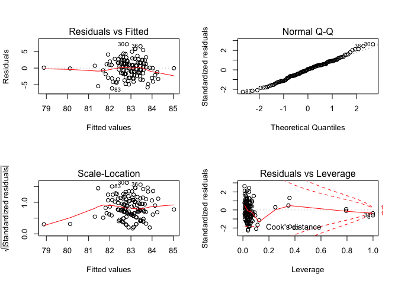<!-- -->
